# Order Model

<cite>
**Referenced Files in This Document**
- [models.py](file://backend/apps/orders/models.py)
- [orders.py](file://backend/api/v1/orders.py)
- [models.py](file://backend/apps/products/models.py)
- [models.py](file://backend/apps/artisans/models.py)
- [models.py](file://backend/apps/gifting/models.py)
- [index.ts](file://supabase/functions/process-cash-payment/index.ts)
- [index.ts](file://supabase/functions/process-momo-payment/index.ts)
- [index.ts](file://supabase/functions/send-order-email/index.ts)
- [index.ts](file://supabase/functions/send-gift-order-email/index.ts)
- [OrdersManager.tsx](file://src/components/admin/OrdersManager.tsx)
- [OrderHistory.tsx](file://src/components/orders/OrderHistory.tsx)
- [ReturnsManager.tsx](file://src/components/admin/ReturnsManager.tsx)
- [ReturnRequestDialog.tsx](file://src/components/orders/ReturnRequestDialog.tsx)
</cite>

## Table of Contents
1. [Introduction](#introduction)
2. [Project Structure](#project-structure)
3. [Core Components](#core-components)
4. [Architecture Overview](#architecture-overview)
5. [Detailed Component Analysis](#detailed-component-analysis)
6. [Dependency Analysis](#dependency-analysis)
7. [Performance Considerations](#performance-considerations)
8. [Troubleshooting Guide](#troubleshooting-guide)
9. [Conclusion](#conclusion)
10. [Appendices](#appendices)

## Introduction
This document provides comprehensive documentation for the Order model that manages the complete purchase lifecycle. It covers the 8-state order lifecycle, frozen financial snapshots, artisan payout calculations, and status transitions. It also explains the relationships with Product and Artisan models, payment integration, shipping logistics, order timeline tracking, customer communication triggers, administrative workflow automation, return/refund management, and analytics.

## Project Structure
The Order model resides in the backend orders app and integrates with:
- Product model for pricing and inventory
- Artisan model for the seller and payouts
- Gifting model for gift-specific personalization
- Supabase functions for payment processing and notifications
- Frontend components for admin and customer order management

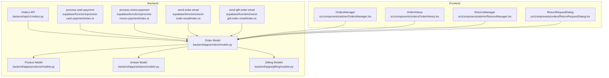

**Diagram sources**
- [models.py:10-122](file://backend/apps/orders/models.py#L10-L122)
- [models.py:10-99](file://backend/apps/products/models.py#L10-L99)
- [models.py:62-170](file://backend/apps/artisans/models.py#L62-L170)
- [models.py:9-67](file://backend/apps/gifting/models.py#L9-L67)
- [orders.py:1-18](file://backend/api/v1/orders.py#L1-L18)
- [index.ts](file://supabase/functions/process-cash-payment/index.ts)
- [index.ts](file://supabase/functions/process-momo-payment/index.ts)
- [index.ts](file://supabase/functions/send-order-email/index.ts)
- [index.ts](file://supabase/functions/send-gift-order-email/index.ts)
- [OrdersManager.tsx](file://src/components/admin/OrdersManager.tsx)
- [OrderHistory.tsx](file://src/components/orders/OrderHistory.tsx)
- [ReturnsManager.tsx](file://src/components/admin/ReturnsManager.tsx)
- [ReturnRequestDialog.tsx](file://src/components/orders/ReturnRequestDialog.tsx)

**Section sources**
- [models.py:10-122](file://backend/apps/orders/models.py#L10-L122)
- [orders.py:1-18](file://backend/api/v1/orders.py#L1-L18)

## Core Components
This section documents the Order model’s fields, relationships, lifecycle states, and financial snapshot mechanics.

- Order model fields and relationships
  - Parties: product, buyer, artisan
  - Status: order status and payout status
  - Gift flag and gift details
  - Quantity and financial snapshot fields
  - Payment method and reference
  - Shipping details and tracking
  - Timestamps for lifecycle events

- Lifecycle states
  - pending_payment
  - paid
  - confirmed
  - dispatched
  - in_transit
  - delivered
  - disputed
  - refunded

- Payment methods
  - stripe, momo, airtel, ton

- Payout statuses
  - pending, processing, paid, failed

- Financial snapshot (frozen at order time)
  - price_ugx, price_usd
  - artisan_earnings_ugx
  - platform_commission_ugx
  - heritage_fund_ugx

- Calculated totals
  - compute totals based on product pricing and quantity

**Section sources**
- [models.py:16-25](file://backend/apps/orders/models.py#L16-L25)
- [models.py:27-32](file://backend/apps/orders/models.py#L27-L32)
- [models.py:34-39](file://backend/apps/orders/models.py#L34-L39)
- [models.py:41-104](file://backend/apps/orders/models.py#L41-L104)
- [models.py:111-122](file://backend/apps/orders/models.py#L111-L122)

## Architecture Overview
The Order model orchestrates the purchase lifecycle across models and external integrations:
- Product provides pricing and revenue split percentages
- Artisan holds contact and payout information
- Gifting adds gift-specific personalization
- Supabase functions handle payment processing and notifications
- Frontend components manage admin and customer workflows

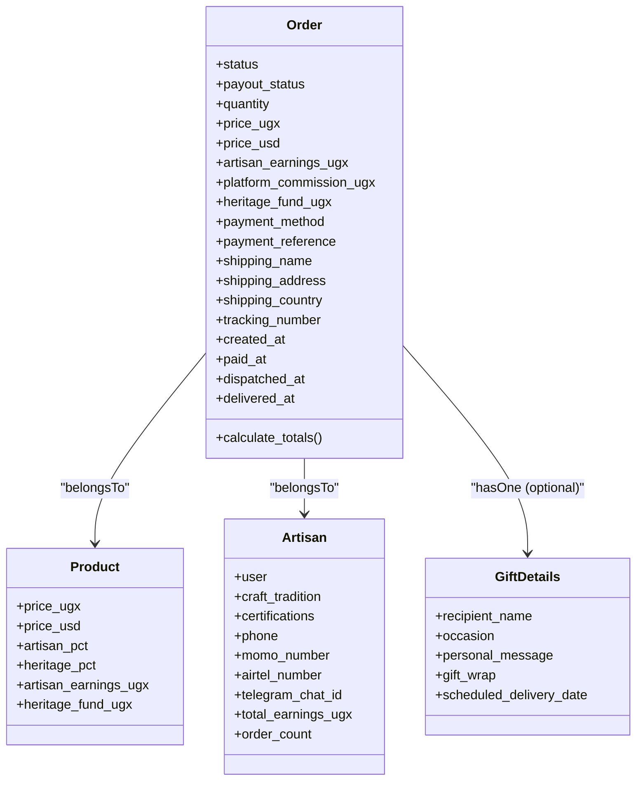

**Diagram sources**
- [models.py:10-122](file://backend/apps/orders/models.py#L10-L122)
- [models.py:10-99](file://backend/apps/products/models.py#L10-L99)
- [models.py:62-170](file://backend/apps/artisans/models.py#L62-L170)
- [models.py:9-37](file://backend/apps/gifting/models.py#L9-L37)

## Detailed Component Analysis

### Order Lifecycle and State Transitions
The Order model defines an 8-state lifecycle. Transitions are driven by payment completion, artisan confirmation, dispatch, shipping updates, delivery, and administrative actions leading to disputes or refunds.

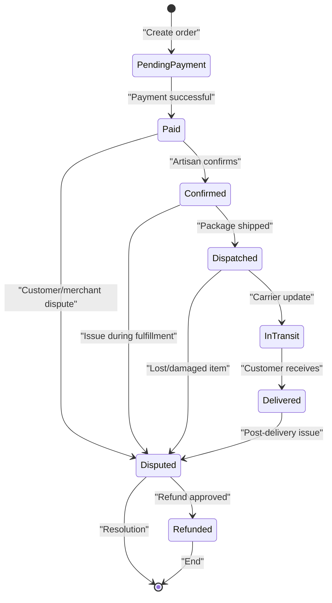

- Frozen financial snapshot
  - At order creation, prices and earnings are captured to ensure consistency regardless of future product price changes.
- Payout calculation
  - Artisan earnings are computed from the frozen snapshot and tracked via payout status.
- Timeline tracking
  - Timestamps capture paid_at, dispatched_at, and delivered_at for auditability and reporting.

**Diagram sources**
- [models.py:16-25](file://backend/apps/orders/models.py#L16-L25)
- [models.py:77-83](file://backend/apps/orders/models.py#L77-L83)
- [models.py:100-104](file://backend/apps/orders/models.py#L100-L104)

**Section sources**
- [models.py:16-25](file://backend/apps/orders/models.py#L16-L25)
- [models.py:77-83](file://backend/apps/orders/models.py#L77-L83)
- [models.py:100-104](file://backend/apps/orders/models.py#L100-L104)

### Payment Integration
Payment processing is handled by Supabase functions for cash and mobile money, with Stripe integration noted in payment methods. The Order model records the payment method and reference.

- Supported payment methods
  - stripe, momo, airtel, ton
- Payment reference
  - Unique identifier for reconciliation
- Cash and mobile money processing
  - Supabase functions orchestrate payment verification and order state updates

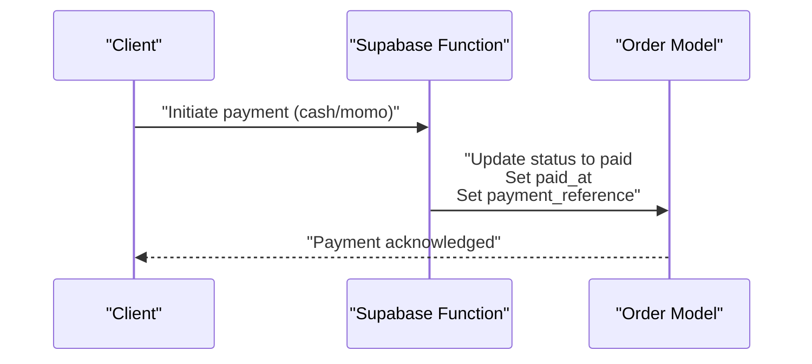

**Diagram sources**
- [models.py:84-87](file://backend/apps/orders/models.py#L84-L87)
- [index.ts](file://supabase/functions/process-cash-payment/index.ts)
- [index.ts](file://supabase/functions/process-momo-payment/index.ts)

**Section sources**
- [models.py:27-32](file://backend/apps/orders/models.py#L27-L32)
- [models.py:84-87](file://backend/apps/orders/models.py#L84-L87)
- [index.ts](file://supabase/functions/process-cash-payment/index.ts)
- [index.ts](file://supabase/functions/process-momo-payment/index.ts)

### Fulfillment Tracking and Shipping
The Order model captures shipping details and tracking information, enabling logistics visibility.

- Shipping fields
  - shipping_name, shipping_address (JSON), shipping_country (ISO code)
  - tracking_number, dispatch_photo
- Dispatch and transit
  - dispatched_at marks shipment
  - in_transit reflects carrier updates
  - delivered_at finalizes the lifecycle

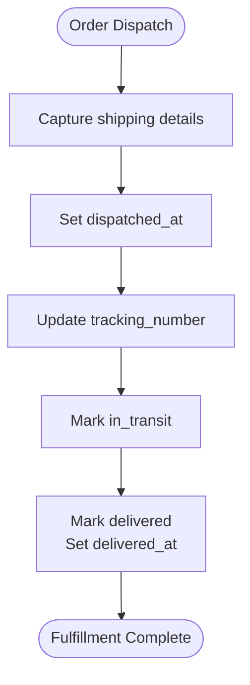

**Diagram sources**
- [models.py:88-98](file://backend/apps/orders/models.py#L88-L98)
- [models.py:100-104](file://backend/apps/orders/models.py#L100-L104)

**Section sources**
- [models.py:88-98](file://backend/apps/orders/models.py#L88-L98)
- [models.py:100-104](file://backend/apps/orders/models.py#L100-L104)

### Return Request System and Refund Processing
Return requests originate from the customer UI and are managed by administrators. Disputes and refunds are supported by lifecycle states.

- Customer-facing return
  - ReturnRequestDialog initiates return requests
- Administrative management
  - ReturnsManager handles approvals and resolutions
- Lifecycle impact
  - Disputed leads to Refunded when resolved

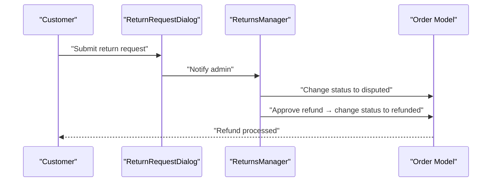

**Diagram sources**
- [ReturnRequestDialog.tsx](file://src/components/orders/ReturnRequestDialog.tsx)
- [ReturnsManager.tsx](file://src/components/admin/ReturnsManager.tsx)
- [models.py:16-25](file://backend/apps/orders/models.py#L16-L25)

**Section sources**
- [ReturnRequestDialog.tsx](file://src/components/orders/ReturnRequestDialog.tsx)
- [ReturnsManager.tsx](file://src/components/admin/ReturnsManager.tsx)
- [models.py:16-25](file://backend/apps/orders/models.py#L16-L25)

### Customer Communication Triggers
Notifications are triggered by lifecycle events to keep customers informed.

- Order confirmation email
  - Supabase function sends order confirmation
- Gift order email
  - Dedicated function for gift orders
- Timing
  - Emails sent after payment and fulfillment milestones

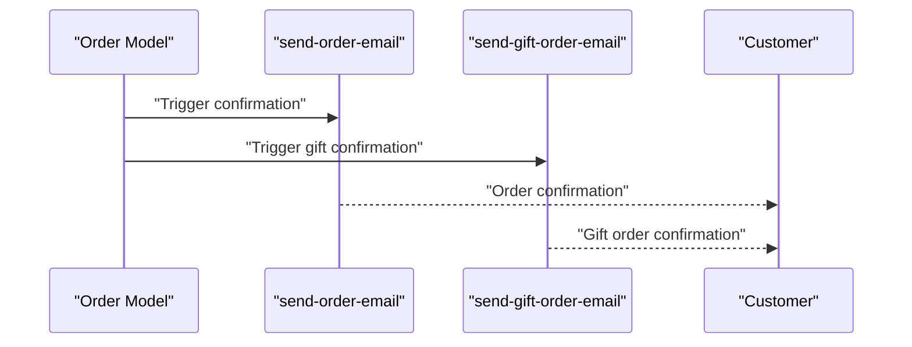

**Diagram sources**
- [index.ts](file://supabase/functions/send-order-email/index.ts)
- [index.ts](file://supabase/functions/send-gift-order-email/index.ts)
- [models.py:65-72](file://backend/apps/orders/models.py#L65-L72)

**Section sources**
- [index.ts](file://supabase/functions/send-order-email/index.ts)
- [index.ts](file://supabase/functions/send-gift-order-email/index.ts)
- [models.py:65-72](file://backend/apps/orders/models.py#L65-L72)

### Administrative Workflow Automation
Administrators use OrdersManager to monitor and update orders, ensuring smooth operations across the lifecycle.

- Order monitoring
  - View order list, status, and timeline
- Actions
  - Confirm orders, update tracking, escalate disputes

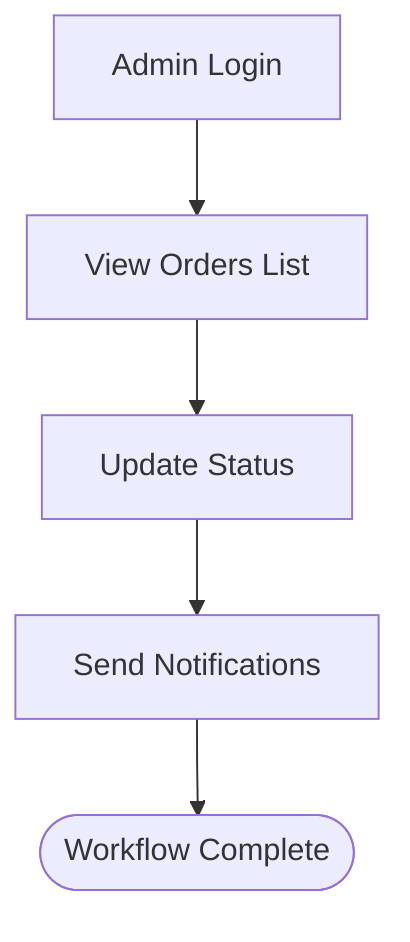

**Diagram sources**
- [OrdersManager.tsx](file://src/components/admin/OrdersManager.tsx)
- [orders.py:10-17](file://backend/api/v1/orders.py#L10-L17)

**Section sources**
- [OrdersManager.tsx](file://src/components/admin/OrdersManager.tsx)
- [orders.py:10-17](file://backend/api/v1/orders.py#L10-L17)

### Relationship with Product and Artisan Models
- Product relationship
  - Provides pricing and revenue split percentages used to compute the frozen snapshot
- Artisan relationship
  - Links the order to the seller; used for payouts and communication
- Gift relationship
  - Optional gift details for gifting purchases

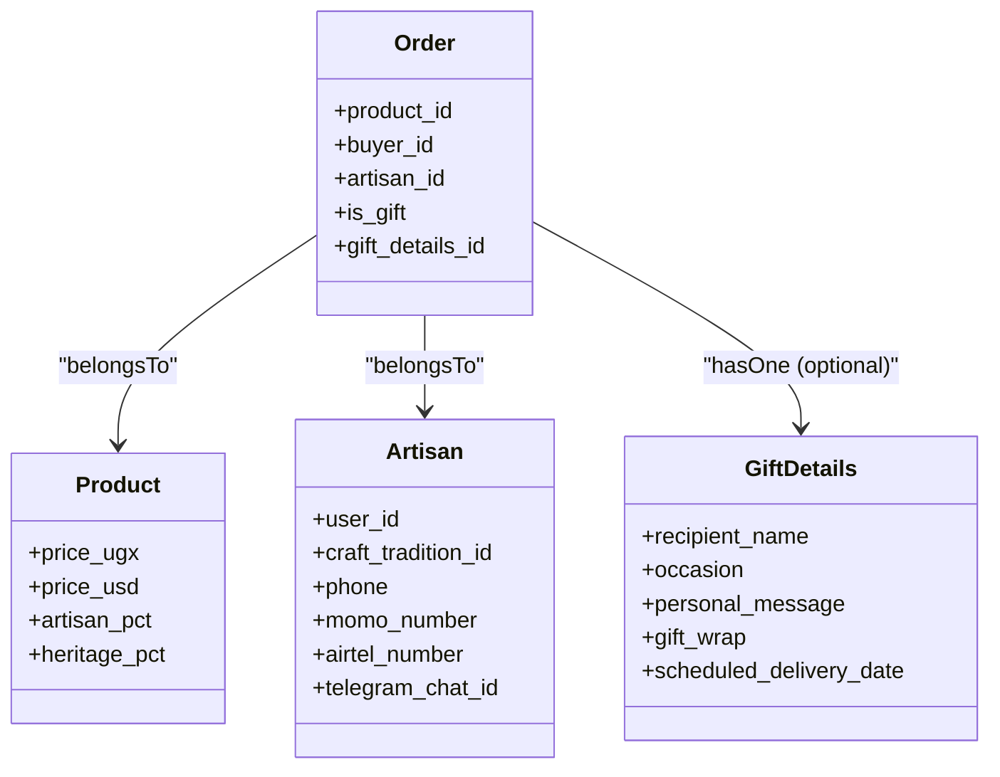

**Diagram sources**
- [models.py:42-72](file://backend/apps/orders/models.py#L42-L72)
- [models.py:55-66](file://backend/apps/products/models.py#L55-L66)
- [models.py:76-105](file://backend/apps/artisans/models.py#L76-L105)
- [models.py:24-33](file://backend/apps/gifting/models.py#L24-L33)

**Section sources**
- [models.py:42-72](file://backend/apps/orders/models.py#L42-L72)
- [models.py:55-66](file://backend/apps/products/models.py#L55-L66)
- [models.py:76-105](file://backend/apps/artisans/models.py#L76-L105)
- [models.py:24-33](file://backend/apps/gifting/models.py#L24-L33)

### Order Timeline Tracking
Timestamps capture key lifecycle moments for transparency and reporting.

- created_at: order creation
- paid_at: payment completion
- dispatched_at: shipment initiation
- delivered_at: delivery confirmation

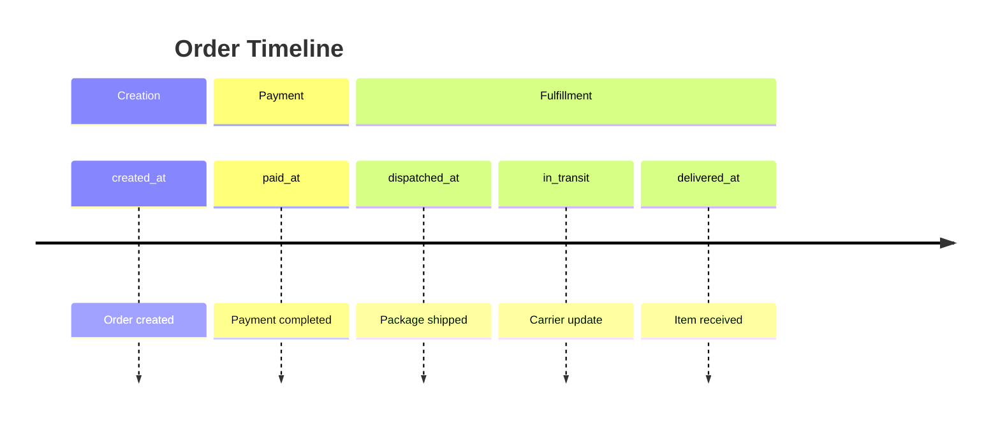

**Diagram sources**
- [models.py:100-104](file://backend/apps/orders/models.py#L100-L104)

**Section sources**
- [models.py:100-104](file://backend/apps/orders/models.py#L100-L104)

### Financial Snapshot and Payout Calculations
The Order model freezes financial values at order time and computes payouts.

- Frozen values
  - price_ugx, price_usd, artisan_earnings_ugx, platform_commission_ugx, heritage_fund_ugx
- Calculation method
  - Totals computed from product pricing and quantity
- Payout status
  - Tracks payout lifecycle: pending → processing → paid → failed

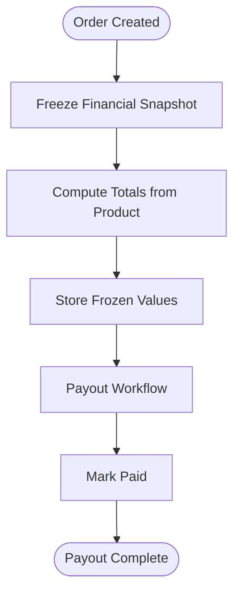

**Diagram sources**
- [models.py:77-83](file://backend/apps/orders/models.py#L77-L83)
- [models.py:111-122](file://backend/apps/orders/models.py#L111-L122)
- [models.py:34-39](file://backend/apps/orders/models.py#L34-L39)

**Section sources**
- [models.py:77-83](file://backend/apps/orders/models.py#L77-L83)
- [models.py:111-122](file://backend/apps/orders/models.py#L111-L122)
- [models.py:34-39](file://backend/apps/orders/models.py#L34-L39)

### API and Frontend Integration
- Backend API
  - Orders API router exists but is currently a placeholder
- Frontend components
  - OrdersManager for admin
  - OrderHistory for customers
  - ReturnsManager and ReturnRequestDialog for returns

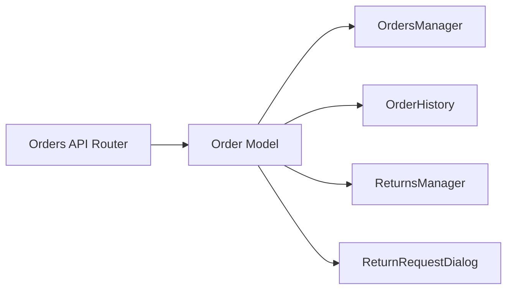

**Diagram sources**
- [orders.py:5-17](file://backend/api/v1/orders.py#L5-L17)
- [OrdersManager.tsx](file://src/components/admin/OrdersManager.tsx)
- [OrderHistory.tsx](file://src/components/orders/OrderHistory.tsx)
- [ReturnsManager.tsx](file://src/components/admin/ReturnsManager.tsx)
- [ReturnRequestDialog.tsx](file://src/components/orders/ReturnRequestDialog.tsx)

**Section sources**
- [orders.py:5-17](file://backend/api/v1/orders.py#L5-L17)
- [OrdersManager.tsx](file://src/components/admin/OrdersManager.tsx)
- [OrderHistory.tsx](file://src/components/orders/OrderHistory.tsx)
- [ReturnsManager.tsx](file://src/components/admin/ReturnsManager.tsx)
- [ReturnRequestDialog.tsx](file://src/components/orders/ReturnRequestDialog.tsx)

## Dependency Analysis
The Order model depends on Product, Artisan, and Gifting models. It integrates with Supabase functions for payment and notifications, and with frontend components for admin and customer workflows.

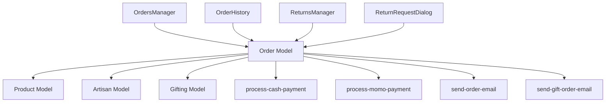

**Diagram sources**
- [models.py:42-72](file://backend/apps/orders/models.py#L42-L72)
- [models.py:24-29](file://backend/apps/products/models.py#L24-L29)
- [models.py:76-82](file://backend/apps/artisans/models.py#L76-L82)
- [models.py:6-7](file://backend/apps/gifting/models.py#L6-L7)
- [index.ts](file://supabase/functions/process-cash-payment/index.ts)
- [index.ts](file://supabase/functions/process-momo-payment/index.ts)
- [index.ts](file://supabase/functions/send-order-email/index.ts)
- [index.ts](file://supabase/functions/send-gift-order-email/index.ts)
- [OrdersManager.tsx](file://src/components/admin/OrdersManager.tsx)
- [OrderHistory.tsx](file://src/components/orders/OrderHistory.tsx)
- [ReturnsManager.tsx](file://src/components/admin/ReturnsManager.tsx)
- [ReturnRequestDialog.tsx](file://src/components/orders/ReturnRequestDialog.tsx)

**Section sources**
- [models.py:42-72](file://backend/apps/orders/models.py#L42-L72)
- [models.py:24-29](file://backend/apps/products/models.py#L24-L29)
- [models.py:76-82](file://backend/apps/artisans/models.py#L76-L82)
- [models.py:6-7](file://backend/apps/gifting/models.py#L6-L7)
- [index.ts](file://supabase/functions/process-cash-payment/index.ts)
- [index.ts](file://supabase/functions/process-momo-payment/index.ts)
- [index.ts](file://supabase/functions/send-order-email/index.ts)
- [index.ts](file://supabase/functions/send-gift-order-email/index.ts)
- [OrdersManager.tsx](file://src/components/admin/OrdersManager.tsx)
- [OrderHistory.tsx](file://src/components/orders/OrderHistory.tsx)
- [ReturnsManager.tsx](file://src/components/admin/ReturnsManager.tsx)
- [ReturnRequestDialog.tsx](file://src/components/orders/ReturnRequestDialog.tsx)

## Performance Considerations
- Use frozen financial snapshots to avoid recomputation and ensure consistency across reports
- Index frequently filtered fields (status, payout_status, created_at) for efficient queries
- Offload heavy tasks (notifications, analytics) to asynchronous workers
- Minimize database round-trips by batching updates (e.g., updating timestamps and status together)
- Cache product pricing and artisan payout thresholds for quick calculations

## Troubleshooting Guide
- Payment not reflected
  - Verify payment_reference and payment_method match the provider
  - Check Supabase function logs for cash/momo processing errors
- Missing notifications
  - Confirm email functions are invoked after paid_at and delivery milestones
- Dispute resolution delays
  - Ensure disputes are escalated appropriately and refund approvals update status to refunded
- Payout discrepancies
  - Reconcile frozen values against product pricing and quantity at order time

**Section sources**
- [models.py:84-87](file://backend/apps/orders/models.py#L84-L87)
- [models.py:100-104](file://backend/apps/orders/models.py#L100-L104)
- [models.py:34-39](file://backend/apps/orders/models.py#L34-L39)
- [index.ts](file://supabase/functions/process-cash-payment/index.ts)
- [index.ts](file://supabase/functions/process-momo-payment/index.ts)
- [index.ts](file://supabase/functions/send-order-email/index.ts)

## Conclusion
The Order model centralizes the purchase lifecycle with a robust 8-state progression, frozen financial snapshots, and clear integrations with Product, Artisan, and Gifting models. It supports payment processing, fulfillment tracking, customer communications, and administrative automation, laying the foundation for comprehensive analytics and performance metrics.

## Appendices
- API placeholders
  - Orders API router exists but is not fully implemented
- Frontend coverage
  - Admin and customer components support order management and returns
- Future enhancements
  - Expand Orders API endpoints and integrate analytics dashboards

**Section sources**
- [orders.py:1-18](file://backend/api/v1/orders.py#L1-L18)
- [OrdersManager.tsx](file://src/components/admin/OrdersManager.tsx)
- [OrderHistory.tsx](file://src/components/orders/OrderHistory.tsx)
- [ReturnsManager.tsx](file://src/components/admin/ReturnsManager.tsx)
- [ReturnRequestDialog.tsx](file://src/components/orders/ReturnRequestDialog.tsx)