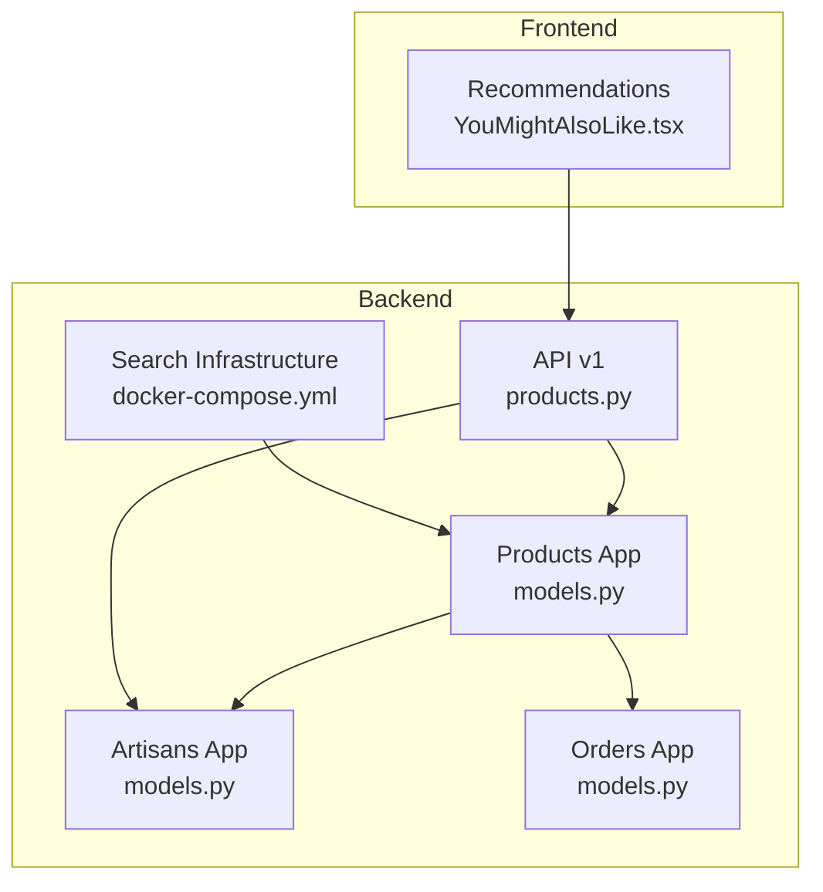
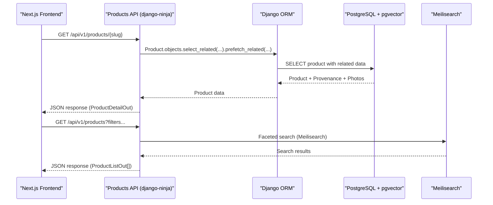
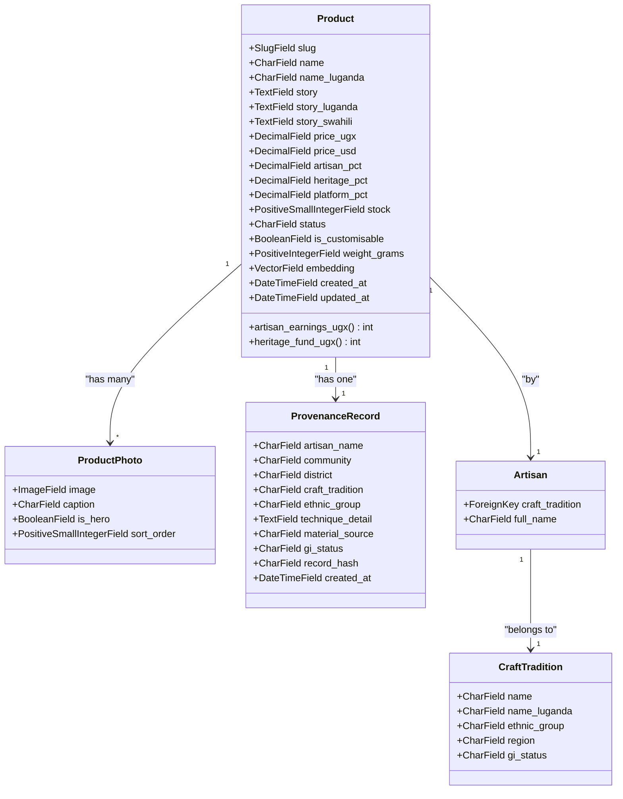
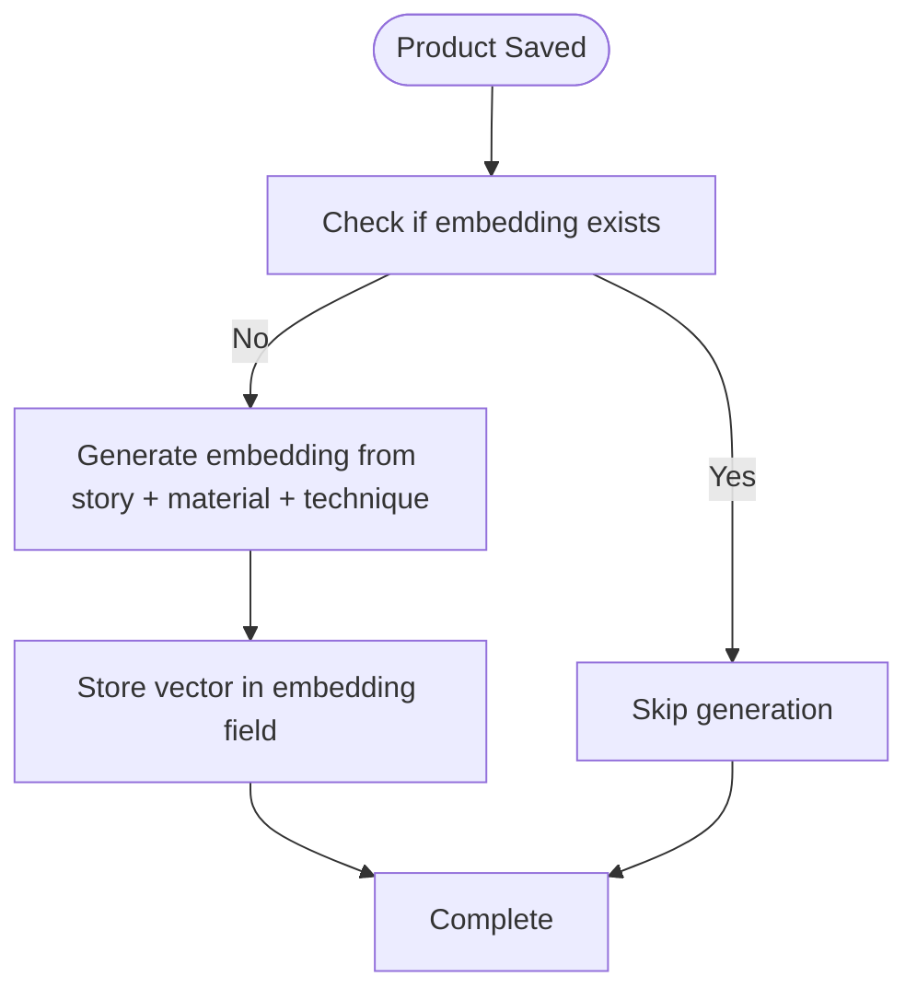
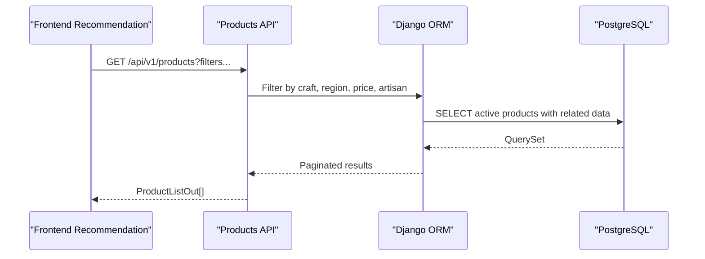
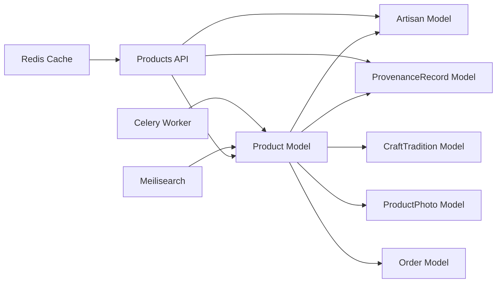

# Product Model

<cite>
**Referenced Files in This Document**
- [models.py](file://backend/apps/products/models.py)
- [products.py](file://backend/api/v1/products.py)
- [0001_initial.py](file://backend/apps/products/migrations/0001_initial.py)
- [artisans/models.py](file://backend/apps/artisans/models.py)
- [orders/models.py](file://backend/apps/orders/models.py)
- [docker-compose.yml](file://infrastructure/docker-compose.yml)
- [README.md](file://README.md)
- [YouMightAlsoLike.tsx](file://apps/web/src/components/recommendations/YouMightAlsoLike.tsx)
</cite>

## Table of Contents
1. [Introduction](#introduction)
2. [Project Structure](#project-structure)
3. [Core Components](#core-components)
4. [Architecture Overview](#architecture-overview)
5. [Detailed Component Analysis](#detailed-component-analysis)
6. [Dependency Analysis](#dependency-analysis)
7. [Performance Considerations](#performance-considerations)
8. [Troubleshooting Guide](#troubleshooting-guide)
9. [Conclusion](#conclusion)

## Introduction
This document provides comprehensive data model documentation for the Product entity in Empindu's story-first architecture. It covers product metadata, multilingual story content, provenance tracking, semantic embeddings for AI-powered discovery, pricing and revenue sharing, inventory management, relationships with Artisan models, craft tradition anchoring, lifecycle management, visibility controls, image/media handling, recommendation system integration, and analytics considerations.

## Project Structure
The Product model is part of the Django application ecosystem with supporting components across artisans, orders, search, and ML domains. The backend leverages PostgreSQL with pgvector for embeddings, Redis for caching and Celery for asynchronous tasks, and Meilisearch for semantic search.

**Diagram sources**
- [models.py:10-153](file://backend/apps/products/models.py#L10-L153)
- [artisans/models.py:62-170](file://backend/apps/artisans/models.py#L62-L170)
- [orders/models.py:10-122](file://backend/apps/orders/models.py#L10-L122)
- [products.py:1-191](file://backend/api/v1/products.py#L1-L191)
- [docker-compose.yml:1-51](file://infrastructure/docker-compose.yml#L1-L51)
- [YouMightAlsoLike.tsx:1-50](file://apps/web/src/components/recommendations/YouMightAlsoLike.tsx#L1-L50)

**Section sources**
- [README.md:1-242](file://README.md#L1-L242)
- [docker-compose.yml:1-51](file://infrastructure/docker-compose.yml#L1-L51)

## Core Components
The Product model encapsulates the story-first product architecture with cultural IP anchoring. It includes identity fields, multilingual story content, craft details, pricing and revenue splits, inventory, customization options, shipping attributes, semantic embeddings, timestamps, and relationships to Artisan and CraftTradition models. The ProvenanceRecord model captures immutable cultural attribution snapshots linked to each product.

Key fields and relationships:
- Identity: slug, name, multilingual name variants
- Story: primary and multilingual narrative fields, draft transcription fields
- Craft Details: material, technique, estimated days to make
- Pricing & Revenue: UGX/USD prices, artisan/share percentages, platform commission
- Inventory & Status: stock count, lifecycle status (draft, active, sold_out, archived)
- Customization & Shipping: customization flag, weight in grams
- Embeddings: pgvector field for semantic search
- Relationships: ForeignKey to Artisan and CraftTradition, OneToOne to ProvenanceRecord
- Media: ProductPhoto model with hero image selection and captions

**Section sources**
- [models.py:10-153](file://backend/apps/products/models.py#L10-L153)
- [0001_initial.py:16-87](file://backend/apps/products/migrations/0001_initial.py#L16-L87)

## Architecture Overview
Empindu's Product model participates in a layered architecture:
- Data Access Layer: Django ORM models with PostgreSQL/pgvector
- API Layer: django-ninja endpoints serving product catalog and details
- Asynchronous Layer: Celery workers for embedding generation and background tasks
- Search Layer: Meilisearch for faceted discovery and semantic search
- Presentation Layer: Next.js frontend consuming the API and rendering product pages

**Diagram sources**
- [products.py:74-191](file://backend/api/v1/products.py#L74-L191)
- [models.py:10-153](file://backend/apps/products/models.py#L10-L153)
- [docker-compose.yml:36-47](file://infrastructure/docker-compose.yml#L36-L47)

**Section sources**
- [products.py:1-191](file://backend/api/v1/products.py#L1-L191)
- [README.md:3-16](file://README.md#L3-L16)

## Detailed Component Analysis

### Product Entity
The Product model defines the core attributes and behaviors for story-first product listings:
- Status Management: draft, active, sold_out, archived lifecycle states
- Revenue Calculation: artisan earnings and heritage fund contributions computed from price and percentage fields
- Multilingual Support: story content and product name with Luganda and Swahili variants
- Craft Details: materials and techniques with cultural significance
- Inventory Control: stock levels and customization flags
- Media Handling: hero image selection and ordered photo gallery
- Embedding System: pgvector field for semantic similarity search

**Diagram sources**
- [models.py:10-153](file://backend/apps/products/models.py#L10-L153)
- [artisans/models.py:62-170](file://backend/apps/artisans/models.py#L62-L170)

**Section sources**
- [models.py:10-153](file://backend/apps/products/models.py#L10-L153)
- [0001_initial.py:16-87](file://backend/apps/products/migrations/0001_initial.py#L16-L87)

### Provenance Tracking
The ProvenanceRecord model captures immutable cultural attribution at listing time:
- Cultural Anchor: artisan name, community, district, craft tradition, ethnic group
- Technique & Materials: detailed technique description and material sourcing
- GI Status: intellectual property registration status
- Hash: future blockchain anchoring identifier
- Timestamp: creation date for auditability

This model ensures transparency and cultural preservation by freezing key attributes when a product is listed.

**Section sources**
- [models.py:122-153](file://backend/apps/products/models.py#L122-L153)

### Embedding Vector System
The Product model includes a semantic embedding field for AI-powered discovery:
- Vector Field: pgvector VectorField with dimension 384
- Generation: planned integration with Celery workers and sentence-transformers model
- Purpose: enable semantic similarity search and recommendation systems
- Infrastructure: PostgreSQL with pgvector extension and Celery worker processes

**Diagram sources**
- [models.py:77-79](file://backend/apps/products/models.py#L77-L79)
- [docker-compose.yml:4-7](file://infrastructure/docker-compose.yml#L4-L7)

**Section sources**
- [models.py:77-79](file://backend/apps/products/models.py#L77-L79)
- [docker-compose.yml:4-7](file://infrastructure/docker-compose.yml#L4-L7)

### API Integration and Recommendations
The Products API serves both detail and listing endpoints with filtering and pagination. The frontend recommendation component integrates with the API to surface related products.

**Diagram sources**
- [products.py:126-191](file://backend/api/v1/products.py#L126-L191)
- [YouMightAlsoLike.tsx:12-13](file://apps/web/src/components/recommendations/YouMightAlsoLike.tsx#L12-L13)

**Section sources**
- [products.py:126-191](file://backend/api/v1/products.py#L126-L191)
- [YouMightAlsoLike.tsx:1-50](file://apps/web/src/components/recommendations/YouMightAlsoLike.tsx#L1-L50)

## Dependency Analysis
The Product model interacts with several core components across the application stack:

**Diagram sources**
- [models.py:10-153](file://backend/apps/products/models.py#L10-L153)
- [artisans/models.py:62-170](file://backend/apps/artisans/models.py#L62-L170)
- [orders/models.py:10-122](file://backend/apps/orders/models.py#L10-L122)
- [products.py:1-191](file://backend/api/v1/products.py#L1-L191)

**Section sources**
- [models.py:10-153](file://backend/apps/products/models.py#L10-L153)
- [artisans/models.py:62-170](file://backend/apps/artisans/models.py#L62-L170)
- [orders/models.py:10-122](file://backend/apps/orders/models.py#L10-L122)
- [products.py:1-191](file://backend/api/v1/products.py#L1-L191)

## Performance Considerations
- Embedding Computation: Offload embedding generation to Celery workers to avoid blocking API requests
- Vector Indexing: Ensure proper indexing on the embedding vector field for similarity queries
- Media Handling: Use CDN-backed ImageFields and optimize image sizes for hero and thumbnail views
- Search Optimization: Leverage Meilisearch for faceted filtering and PostgreSQL for precise joins
- Caching: Utilize Redis for API response caching and session management
- Query Optimization: Use select_related and prefetch_related to minimize N+1 queries in product listings

## Troubleshooting Guide
Common issues and resolutions:
- Embedding Generation Failures: Verify Celery worker is running and vector model is available
- pgvector Extension Issues: Confirm PostgreSQL container uses pgvector image and extension is enabled
- Meilisearch Connectivity: Check service availability and API keys in environment variables
- Image Upload Problems: Validate Cloudinary credentials and storage permissions
- API Response Delays: Monitor Redis cache hit rates and database query performance

**Section sources**
- [docker-compose.yml:4-7](file://infrastructure/docker-compose.yml#L4-L7)
- [README.md:109-145](file://README.md#L109-L145)

## Conclusion
The Product model in Empindu represents a sophisticated story-first approach to artisan commerce, integrating cultural IP anchoring, multilingual content, semantic search capabilities, and robust revenue sharing mechanisms. Its design supports scalable growth while maintaining transparency, cultural preservation, and user-centric discovery through AI-powered recommendations and traditional search faceting.