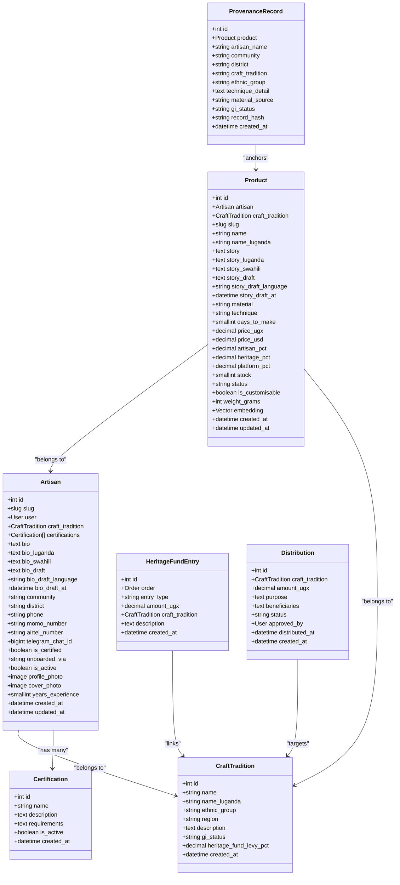
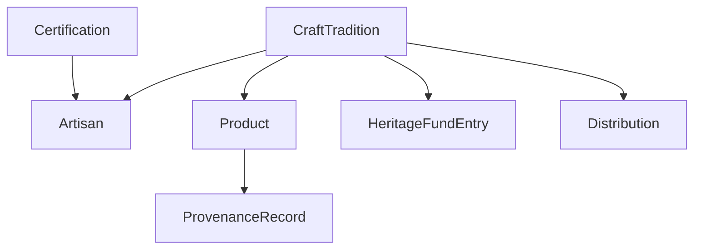

# Craft Tradition & Certification

<cite>
**Referenced Files in This Document**
- [models.py](file://backend/apps/artisans/models.py)
- [admin.py](file://backend/apps/artisans/admin.py)
- [artisans.py](file://backend/api/v1/artisans.py)
- [heritage/models.py](file://backend/apps/heritage/models.py)
- [products/models.py](file://backend/apps/products/models.py)
- [0001_initial.py](file://backend/apps/artisans/migrations/0001_initial.py)
</cite>

## Table of Contents
1. [Introduction](#introduction)
2. [Project Structure](#project-structure)
3. [Core Components](#core-components)
4. [Architecture Overview](#architecture-overview)
5. [Detailed Component Analysis](#detailed-component-analysis)
6. [Dependency Analysis](#dependency-analysis)
7. [Performance Considerations](#performance-considerations)
8. [Troubleshooting Guide](#troubleshooting-guide)
9. [Conclusion](#conclusion)

## Introduction
This document provides comprehensive data model documentation for CraftTradition and Certification entities within the Empindu platform. It explains the cultural IP anchor system that documents craft traditions with ethnic group and regional classifications, the heritage fund levy structure, and Geographical Indication (GI) status tracking. It also details the certification system with quality assurance requirements, active status management, and artisan-certification relationships. Multilingual support for craft names and descriptions is documented, along with data validation rules, business constraints for cultural preservation, administrative approval workflows, and the relationship between craft traditions and artisan onboarding processes.

## Project Structure
The data models relevant to CraftTradition and Certification are primarily located in the artisans app, with supporting models in products and heritage apps. API endpoints expose artisan and craft tradition data for discovery and filtering. Administrative interfaces enable certification and craft tradition management.

```mermaid
graph TB
subgraph "Artisans App"
CT["CraftTradition<br/>Models"]
CERT["Certification<br/>Models"]
ART["Artisan<br/>Models"]
ADM["Admin<br/>Interface"]
API["Artisans API<br/>Endpoints"]
end
subgraph "Products App"
PROD["Product<br/>Models"]
PRV["ProvenanceRecord<br/>Models"]
end
subgraph "Heritage App"
HF["HeritageFundEntry<br/>Models"]
DIST["Distribution<br/>Models"]
end
CT --> ART
CERT <- --> ART
PROD --> ART
PROD --> CT
PRV --> PROD
HF --> CT
DIST --> CT
ADM --> CT
ADM --> CERT
ADM --> ART
API --> ART
API --> CT
```

**Diagram sources**
- [models.py:14-170](file://backend/apps/artisans/models.py#L14-L170)
- [artisans.py:1-120](file://backend/api/v1/artisans.py#L1-L120)
- [heritage/models.py:1-66](file://backend/apps/heritage/models.py#L1-L66)
- [products/models.py:1-153](file://backend/apps/products/models.py#L1-L153)

**Section sources**
- [models.py:1-170](file://backend/apps/artisans/models.py#L1-L170)
- [artisans.py:1-120](file://backend/api/v1/artisans.py#L1-L120)

## Core Components
This section documents the primary entities and their attributes, focusing on CraftTradition, Certification, and Artisan, and how they relate to heritage fund contributions and product provenance.

- CraftTradition
  - Purpose: Cultural IP anchor representing named craft traditions with ethnic and regional classification.
  - Key attributes: name, name_luganda, ethnic_group, region, description, gi_status, heritage_fund_levy_pct, created_at.
  - Validation: gi_status uses predefined choices; heritage_fund_levy_pct stored as decimal with two decimals.
  - Ordering: Ordered by name; pluralized as "Craft Traditions".

- Certification
  - Purpose: Quality and authenticity assurance with Empindu Certified mark.
  - Key attributes: name, description, requirements (JSON list), is_active, created_at.
  - Validation: is_active defaults to True; requirements stored as JSON text.

- Artisan
  - Purpose: Digital identity of artisans created via web, WhatsApp, Telegram, or field onboarding.
  - Key attributes: user (OneToOne), slug, craft_tradition (ForeignKey), certifications (ManyToMany), bio/bio_luganda/bio_swahili, bio_draft variants, community, district, phone, payment methods, is_certified, onboarded_via, is_active, profile photos, experience, timestamps.
  - Validation: OneToOne relationship with User; PROTECT deletion on craft_tradition; ManyToMany with Certification; slug auto-generated; is_active defaults to True; is_certified defaults to False.

- Heritage Fund Entries and Distributions
  - HeritageFundEntry: Immutable ledger entries for every completed order, linking to Order and CraftTradition, with entry_type and amount_ugx.
  - Distribution: Proposed-to-completed distributions to craft communities, linked to CraftTradition, with status and approvals.

- Product and Provenance
  - Product: Anchored to Artisan and CraftTradition, with pricing, revenue split, inventory, and multilingual story fields.
  - ProvenanceRecord: Immutable snapshot at listing time capturing artisan, community, district, craft tradition, ethnic group, technique, materials, GI status, and timestamp.

**Section sources**
- [models.py:14-170](file://backend/apps/artisans/models.py#L14-L170)
- [heritage/models.py:9-66](file://backend/apps/heritage/models.py#L9-L66)
- [products/models.py:10-153](file://backend/apps/products/models.py#L10-L153)
- [0001_initial.py:17-80](file://backend/apps/artisans/migrations/0001_initial.py#L17-L80)

## Architecture Overview
The CraftTradition entity serves as the cultural IP anchor, linking artisans and products to a specific craft tradition. Certifications are associated with artisans to signal quality and authenticity. The heritage fund tracks financial contributions per craft tradition, and product listings capture provenance snapshots for cultural attribution.



**Diagram sources**
- [models.py:14-170](file://backend/apps/artisans/models.py#L14-L170)
- [products/models.py:10-153](file://backend/apps/products/models.py#L10-L153)
- [heritage/models.py:9-66](file://backend/apps/heritage/models.py#L9-L66)

## Detailed Component Analysis

### CraftTradition Data Model
- Cultural IP Anchor
  - Represents named craft traditions with ethnic and regional context.
  - Attributes include multilingual name support (name_luganda), description, GI status (choices: none, pending, registered), and heritage fund levy percentage.
- Business Constraints
  - gi_status constrained to predefined choices; heritage_fund_levy_pct stored as decimal with precision suitable for percentages.
  - Ordering enforced by name; pluralized as "Craft Traditions".
- Administrative Management
  - Admin interface displays name, ethnic_group, region, gi_status, and heritage_fund_levy_pct; supports filtering by ethnic_group, region, and gi_status.

**Section sources**
- [models.py:14-45](file://backend/apps/artisans/models.py#L14-L45)
- [admin.py:73-85](file://backend/apps/artisans/admin.py#L73-L85)
- [0001_initial.py:28-45](file://backend/apps/artisans/migrations/0001_initial.py#L28-L45)

### Certification Data Model
- Quality Assurance Mark
  - Provides Empindu Certified quality and authenticity assurance.
  - Stores requirements as JSON text for flexible validation criteria.
- Active Status Management
  - is_active flag enables deactivation without data loss; defaults to True.
- Relationship to Artisans
  - Many-to-many relationship allows artisans to hold multiple certifications.

**Section sources**
- [models.py:47-60](file://backend/apps/artisans/models.py#L47-L60)
- [admin.py:87-92](file://backend/apps/artisans/admin.py#L87-L92)
- [0001_initial.py:17-27](file://backend/apps/artisans/migrations/0001_initial.py#L17-L27)

### Artisan Data Model
- Onboarding and Identity
  - OneToOne relationship with User; slug auto-generated from full name; PROTECT deletion on craft_tradition ensures cultural attribution integrity.
  - Onboarding channels tracked via onboarded_via choices.
- Multilingual Support
  - Bio fields support Luganda and Swahili alongside English.
  - Voice draft fields capture transcription metadata for review and publishing.
- Status and Compliance
  - is_certified indicates Empindu Certified status; is_active controls visibility and marketplace participation.
- Administrative Controls
  - Admin actions include bulk certification and display of stats and drafts.

**Section sources**
- [models.py:62-170](file://backend/apps/artisans/models.py#L62-L170)
- [admin.py:10-71](file://backend/apps/artisans/admin.py#L10-L71)
- [0001_initial.py:46-80](file://backend/apps/artisans/migrations/0001_initial.py#L46-L80)

### Heritage Fund and GI Tracking
- Heritage Fund Entries
  - Immutable ledger entries created per completed order, linking to Order and CraftTradition, with entry_type and amount_ugx.
- Distributions
  - Proposals to completions for fund disbursements to craft communities, with status tracking and approvals.
- GI Status
  - CraftTradition maintains gi_status to track geographical indication applications and registrations.

**Section sources**
- [heritage/models.py:9-66](file://backend/apps/heritage/models.py#L9-L66)
- [models.py:25-36](file://backend/apps/artisans/models.py#L25-L36)

### Product and Provenance
- Product Model
  - Anchors to Artisan and CraftTradition; includes multilingual story fields, pricing, revenue splits, inventory, and semantic embeddings.
- Provenance Record
  - Immutable snapshot at listing time capturing artisan, community, district, craft tradition, ethnic group, technique, materials, and GI status.

**Section sources**
- [products/models.py:10-153](file://backend/apps/products/models.py#L10-L153)
- [models.py:14-45](file://backend/apps/artisans/models.py#L14-L45)

### API Integration for Discovery
- Public Endpoints
  - Retrieve artisan profiles and lists filtered by craft tradition, region, and certification status.
  - List craft traditions for filtering and discovery.

**Section sources**
- [artisans.py:51-120](file://backend/api/v1/artisans.py#L51-L120)

## Dependency Analysis
The CraftTradition entity underpins artisan and product relationships, while certifications and heritage fund mechanisms ensure quality assurance and cultural stewardship.



**Diagram sources**
- [models.py:14-170](file://backend/apps/artisans/models.py#L14-L170)
- [products/models.py:10-153](file://backend/apps/products/models.py#L10-L153)
- [heritage/models.py:9-66](file://backend/apps/heritage/models.py#L9-L66)

**Section sources**
- [models.py:14-170](file://backend/apps/artisans/models.py#L14-L170)
- [products/models.py:10-153](file://backend/apps/products/models.py#L10-L153)
- [heritage/models.py:9-66](file://backend/apps/heritage/models.py#L9-L66)

## Performance Considerations
- Indexing and Filtering
  - Use database indexes on frequently filtered fields such as craft_tradition.name, district, and gi_status to optimize discovery queries.
- Embeddings and Vector Search
  - Product embedding updates via background tasks reduce real-time latency during product creation or edits.
- Admin Workflows
  - Bulk certification actions minimize repeated updates and improve administrative throughput.

## Troubleshooting Guide
- CraftTradition Integrity
  - PROTECT deletion prevents orphaning artisans when deleting a craft tradition; adjust relationships before deletion.
- Certification Activation
  - Set is_active=False to temporarily disable a certification without removing it.
- GI Status Updates
  - Update gi_status on CraftTradition to reflect application or registration outcomes; ensure consistency with ProvenanceRecord captures.
- Provenance Accuracy
  - ProvenanceRecord snapshots capture historical context; avoid modifying records after listing.
- Heritage Fund Disbursements
  - Ensure Distribution status transitions align with approvals and disbursement timelines.

**Section sources**
- [models.py:80-85](file://backend/apps/artisans/models.py#L80-L85)
- [products/models.py:122-153](file://backend/apps/products/models/models.py#L122-L153)
- [heritage/models.py:39-66](file://backend/apps/heritage/models.py#L39-L66)

## Conclusion
The CraftTradition and Certification models form the backbone of Empindu’s cultural IP strategy. CraftTradition documents the heritage anchor with ethnic and regional context, GI status, and heritage fund levy structure. Certification ensures quality and authenticity, while artisan relationships maintain cultural continuity. Multilingual support and provenance records strengthen storytelling and attribution. Administrative interfaces streamline onboarding, certification, and fund distributions, ensuring sustainable cultural preservation and economic empowerment.