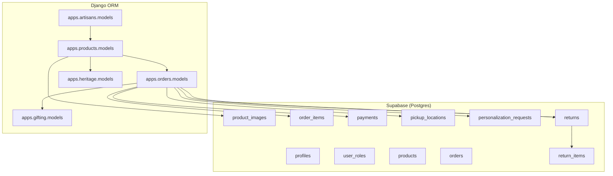
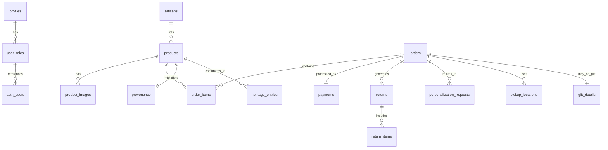
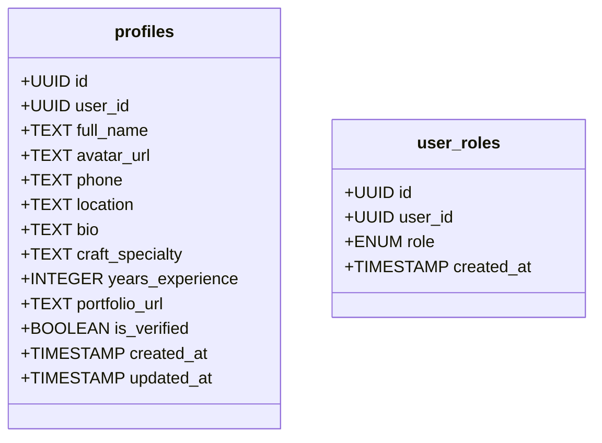
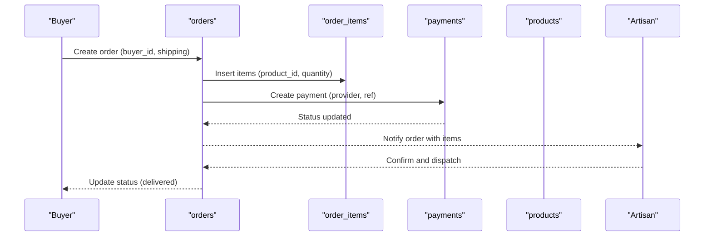
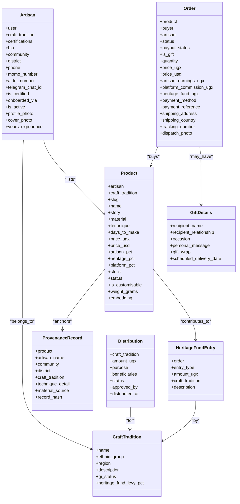
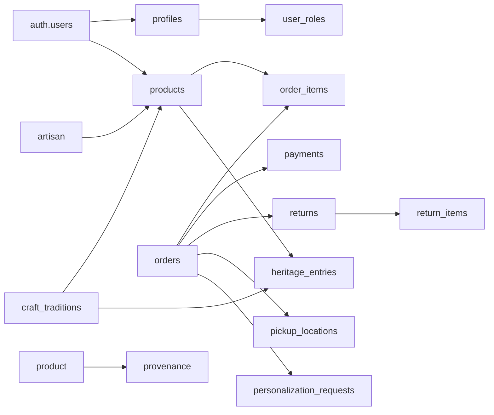

# Data Models & Database Schema

<cite>
**Referenced Files in This Document**
- [20251231095959_3473bebe-42ab-4109-8633-54732ebf1eaf.sql](file://supabase/migrations/20251231095959_3473bebe-42ab-4109-8633-54732ebf1eaf.sql)
- [20260101210119_8814f12d-688f-4774-9ce8-6ce5f9fd0bba.sql](file://supabase/migrations/20260101210119_8814f12d-688f-4774-9ce8-6ce5f9fd0bba.sql)
- [20260101211534_d1ce3159-d630-4859-8ee8-6361241b244c.sql](file://supabase/migrations/20260101211534_d1ce3159-d630-4859-8ee8-6361241b244c.sql)
- [20260103085459_7948cea8-ed91-44d2-882d-43b3ec3c3fa4.sql](file://supabase/migrations/20260103085459_7948cea8-ed91-44d2-882d-43b3ec3c3fa4.sql)
- [20260104173154_8858732d-0e5c-45cd-afaf-c177dfa5487a.sql](file://supabase/migrations/20260104173154_8858732d-0e5c-45cd-afaf-c177dfa5487a.sql)
- [20260107224910_0b6f10e2-c8bb-49bb-ba91-d7b9b48cd27c.sql](file://supabase/migrations/20260107224910_0b6f10e2-c8bb-49bb-ba91-d7b9b48cd27c.sql)
- [20260109095251_6889a1b9-3b1c-4b8f-9535-f3ef095414de.sql](file://supabase/migrations/20260109095251_6889a1b9-3b1c-4b8f-9535-f3ef095414de.sql)
- [20260110082525_e26cf9e4-1e19-414d-9316-27ada8493a53.sql](file://supabase/migrations/20260110082525_e26cf9e4-1e19-414d-9316-27ada8493a53.sql)
- [20260110084208_19f31e38-2062-4a6a-a516-e5b9de4e3510.sql](file://supabase/migrations/20260110084208_19f31e38-2062-4a6a-a516-e5b9de4e3510.sql)
- [20260121122109_0b1cb36d-aa4e-4dd7-a125-c453bc87fffe.sql](file://supabase/migrations/20260121122109_0b1cb36d-aa4e-4dd7-a125-c453bc87fffe.sql)
- [models.py (Artisans)](file://backend/apps/artisans/models.py)
- [models.py (Products)](file://backend/apps/products/models.py)
- [models.py (Orders)](file://backend/apps/orders/models.py)
- [models.py (Heritage)](file://backend/apps/heritage/models.py)
- [models.py (Gifting)](file://backend/apps/gifting/models.py)
</cite>

## Table of Contents
1. [Introduction](#introduction)
2. [Project Structure](#project-structure)
3. [Core Components](#core-components)
4. [Architecture Overview](#architecture-overview)
5. [Detailed Component Analysis](#detailed-component-analysis)
6. [Dependency Analysis](#dependency-analysis)
7. [Performance Considerations](#performance-considerations)
8. [Troubleshooting Guide](#troubleshooting-guide)
9. [Conclusion](#conclusion)
10. [Appendices](#appendices)

## Introduction
This document provides comprehensive data model documentation for Empindu’s database schema. It covers entity relationship diagrams, field definitions, data types, primary and foreign keys, constraints, row-level security (RLS), and application-layer models. It also documents the story-first product architecture, provenance records, heritage fund ledger, certification tracking, craft tradition documentation, and embedding vectors for semantic search. Finally, it outlines validation rules, referential integrity, indexing strategies, performance optimizations, and schema evolution practices.

## Project Structure
Empindu’s data model spans two layers:
- Supabase SQL migrations define the Postgres schema, enums, tables, triggers, and RLS policies.
- Django ORM models define application-level entities, relationships, and computed properties.



**Diagram sources**
- [20251231095959_3473bebe-42ab-4109-8633-54732ebf1eaf.sql:4-20](file://supabase/migrations/20251231095959_3473bebe-42ab-4109-8633-54732ebf1eaf.sql#L4-L20)
- [20260101210119_8814f12d-688f-4774-9ce8-6ce5f9fd0bba.sql:1-23](file://supabase/migrations/20260101210119_8814f12d-688f-4774-9ce8-6ce5f9fd0bba.sql#L1-L23)
- [20260103085459_7948cea8-ed91-44d2-882d-43b3ec3c3fa4.sql:4-28](file://supabase/migrations/20260103085459_7948cea8-ed91-44d2-882d-43b3ec3c3fa4.sql#L4-L28)
- [20260107224910_0b6f10e2-c8bb-49bb-ba91-d7b9b48cd27c.sql:11-56](file://supabase/migrations/20260107224910_0b6f10e2-c8bb-49bb-ba91-d7b9b48cd27c.sql#L11-L56)
- [20260110084208_19f31e38-2062-4a6a-a516-e5b9de4e3510.sql:1-14](file://supabase/migrations/20260110084208_19f31e38-2062-4a6a-a516-e5b9de4e3510.sql#L1-L14)
- [models.py (Artisans):14-170](file://backend/apps/artisans/models.py#L14-L170)
- [models.py (Products):10-153](file://backend/apps/products/models.py#L10-L153)
- [models.py (Orders):10-122](file://backend/apps/orders/models.py#L10-L122)
- [models.py (Heritage):9-66](file://backend/apps/heritage/models.py#L9-L66)
- [models.py (Gifting):9-67](file://backend/apps/gifting/models.py#L9-L67)

**Section sources**
- [20251231095959_3473bebe-42ab-4109-8633-54732ebf1eaf.sql:1-140](file://supabase/migrations/20251231095959_3473bebe-42ab-4109-8633-54732ebf1eaf.sql#L1-L140)
- [20260101210119_8814f12d-688f-4774-9ce8-6ce5f9fd0bba.sql:1-118](file://supabase/migrations/20260101210119_8814f12d-688f-4774-9ce8-6ce5f9fd0bba.sql#L1-L118)
- [20260103085459_7948cea8-ed91-44d2-882d-43b3ec3c3fa4.sql:1-53](file://supabase/migrations/20260103085459_7948cea8-ed91-44d2-882d-43b3ec3c3fa4.sql#L1-L53)
- [20260107224910_0b6f10e2-c8bb-49bb-ba91-d7b9b48cd27c.sql:1-235](file://supabase/migrations/20260107224910_0b6f10e2-c8bb-49bb-ba91-d7b9b48cd27c.sql#L1-L235)
- [20260110084208_19f31e38-2062-4a6a-a516-e5b9de4e3510.sql:1-45](file://supabase/migrations/20260110084208_19f31e38-2062-4a6a-a516-e5b9de4e3510.sql#L1-L45)
- [models.py (Artisans):1-170](file://backend/apps/artisans/models.py#L1-L170)
- [models.py (Products):1-153](file://backend/apps/products/models.py#L1-L153)
- [models.py (Orders):1-122](file://backend/apps/orders/models.py#L1-L122)
- [models.py (Heritage):1-66](file://backend/apps/heritage/models.py#L1-L66)
- [models.py (Gifting):1-67](file://backend/apps/gifting/models.py#L1-L67)

## Core Components
This section summarizes the principal entities and their relationships.

- Users and Roles
  - profiles: user biographical and artisan metadata with RLS.
  - user_roles: role membership with RLS and security-definer helpers.
- Products and Images
  - products: artisan listings with availability, pricing, inventory, and RLS.
  - product_images: multiple images per product with RLS and storage policies.
- Orders and Payments
  - orders: lifecycle tracking with frozen financials and RLS.
  - order_items: line items linking orders to products.
  - payments: payment tracking across providers with RLS.
- Logistics and Returns
  - pickup_locations: curated collection points with RLS.
  - personalization_requests: customization requests with RLS.
  - returns and return_items: return lifecycle with RLS.
- Application Models (Django)
  - artisans, products, orders, heritage, gifting: story-first product architecture, provenance, heritage fund ledger, and gift commerce.

**Section sources**
- [20251231095959_3473bebe-42ab-4109-8633-54732ebf1eaf.sql:4-20](file://supabase/migrations/20251231095959_3473bebe-42ab-4109-8633-54732ebf1eaf.sql#L4-L20)
- [20260101210119_8814f12d-688f-4774-9ce8-6ce5f9fd0bba.sql:1-23](file://supabase/migrations/20260101210119_8814f12d-688f-4774-9ce8-6ce5f9fd0bba.sql#L1-L23)
- [20260103085459_7948cea8-ed91-44d2-882d-43b3ec3c3fa4.sql:4-28](file://supabase/migrations/20260103085459_7948cea8-ed91-44d2-882d-43b3ec3c3fa4.sql#L4-L28)
- [20260107224910_0b6f10e2-c8bb-49bb-ba91-d7b9b48cd27c.sql:11-56](file://supabase/migrations/20260107224910_0b6f10e2-c8bb-49bb-ba91-d7b9b48cd27c.sql#L11-L56)
- [20260110084208_19f31e38-2062-4a6a-a516-e5b9de4e3510.sql:1-14](file://supabase/migrations/20260110084208_19f31e38-2062-4a6a-a516-e5b9de4e3510.sql#L1-L14)
- [models.py (Artisans):14-170](file://backend/apps/artisans/models.py#L14-L170)
- [models.py (Products):10-153](file://backend/apps/products/models.py#L10-L153)
- [models.py (Orders):10-122](file://backend/apps/orders/models.py#L10-L122)
- [models.py (Heritage):9-66](file://backend/apps/heritage/models.py#L9-L66)
- [models.py (Gifting):9-67](file://backend/apps/gifting/models.py#L9-L67)

## Architecture Overview
The database architecture combines:
- Supabase Postgres for core relational data, enums, RLS, and triggers.
- Supabase Storage for product images with bucket policies.
- Django ORM models for advanced domain logic, computed properties, and semantic embeddings.



**Diagram sources**
- [20251231095959_3473bebe-42ab-4109-8633-54732ebf1eaf.sql:4-20](file://supabase/migrations/20251231095959_3473bebe-42ab-4109-8633-54732ebf1eaf.sql#L4-L20)
- [20260101210119_8814f12d-688f-4774-9ce8-6ce5f9fd0bba.sql:1-23](file://supabase/migrations/20260101210119_8814f12d-688f-4774-9ce8-6ce5f9fd0bba.sql#L1-L23)
- [20260103085459_7948cea8-ed91-44d2-882d-43b3ec3c3fa4.sql:4-28](file://supabase/migrations/20260103085459_7948cea8-ed91-44d2-882d-43b3ec3c3fa4.sql#L4-L28)
- [20260107224910_0b6f10e2-c8bb-49bb-ba91-d7b9b48cd27c.sql:11-56](file://supabase/migrations/20260107224910_0b6f10e2-c8bb-49bb-ba91-d7b9b48cd27c.sql#L11-L56)
- [20260110084208_19f31e38-2062-4a6a-a516-e5b9de4e3510.sql:1-14](file://supabase/migrations/20260110084208_19f31e38-2062-4a6a-a516-e5b9de4e3510.sql#L1-L14)
- [models.py (Artisans):14-170](file://backend/apps/artisans/models.py#L14-L170)
- [models.py (Products):10-153](file://backend/apps/products/models.py#L10-L153)
- [models.py (Orders):10-122](file://backend/apps/orders/models.py#L10-L122)
- [models.py (Heritage):9-66](file://backend/apps/heritage/models.py#L9-L66)
- [models.py (Gifting):9-67](file://backend/apps/gifting/models.py#L9-L67)

## Detailed Component Analysis

### Users and Roles
- Enum: app_role includes admin, artisan, buyer.
- profiles: UUID primary key; references auth.users; artisan-specific fields; RLS enabled; triggers update updated_at.
- user_roles: enforces role membership; RLS enabled; security-definer functions for role checks; policies restrict visibility and updates.



**Diagram sources**
- [20251231095959_3473bebe-42ab-4109-8633-54732ebf1eaf.sql:4-20](file://supabase/migrations/20251231095959_3473bebe-42ab-4109-8633-54732ebf1eaf.sql#L4-L20)
- [20251231095959_3473bebe-42ab-4109-8633-54732ebf1eaf.sql:22-29](file://supabase/migrations/20251231095959_3473bebe-42ab-4109-8633-54732ebf1eaf.sql#L22-L29)
- [20251231095959_3473bebe-42ab-4109-8633-54732ebf1eaf.sql:31-33](file://supabase/migrations/20251231095959_3473bebe-42ab-4109-8633-54732ebf1eaf.sql#L31-L33)
- [20251231095959_3473bebe-42ab-4109-8633-54732ebf1eaf.sql:97-126](file://supabase/migrations/20251231095959_3473bebe-42ab-4109-8633-54732ebf1eaf.sql#L97-L126)

**Section sources**
- [20251231095959_3473bebe-42ab-4109-8633-54732ebf1eaf.sql:1-140](file://supabase/migrations/20251231095959_3473bebe-42ab-4109-8633-54732ebf1eaf.sql#L1-L140)

### Products and Images
- products: UUID primary key; references auth.users as artisan; constraints on price and stock; RLS policies for artisans and admins; trigger updates updated_at.
- product_images: multiple images per product; RLS policies for artisans; storage bucket and policies for uploads.

```mermaid
classDiagram
class products {
+UUID id
+UUID artisan_id
+TEXT name
+TEXT description
+DECIMAL price
+TEXT category
+INTEGER stock_quantity
+BOOLEAN is_available
+TIMESTAMP created_at
+TIMESTAMP updated_at
}
class product_images {
+UUID id
+UUID product_id
+TEXT image_url
+BOOLEAN is_primary
+INTEGER display_order
+TIMESTAMP created_at
}
products ||--o{ product_images : "has"
```

**Diagram sources**
- [20260101210119_8814f12d-688f-4774-9ce8-6ce5f9fd0bba.sql:1-23](file://supabase/migrations/20260101210119_8814f12d-688f-4774-9ce8-6ce5f9fd0bba.sql#L1-L23)
- [20260101210119_8814f12d-688f-4774-9ce8-6ce5f9fd0bba.sql:25-27](file://supabase/migrations/20260101210119_8814f12d-688f-4774-9ce8-6ce5f9fd0bba.sql#L25-L27)
- [20260101210119_8814f12d-688f-4774-9ce8-6ce5f9fd0bba.sql:91-118](file://supabase/migrations/20260101210119_8814f12d-688f-4774-9ce8-6ce5f9fd0bba.sql#L91-L118)

**Section sources**
- [20260101210119_8814f12d-688f-4774-9ce8-6ce5f9fd0bba.sql:1-118](file://supabase/migrations/20260101210119_8814f12d-688f-4774-9ce8-6ce5f9fd0bba.sql#L1-L118)

### Orders, Items, Payments, Returns, Personalization
- orders: order_status enum; buyer_id; delivery/pickup; RLS policies; trigger updates updated_at.
- order_items: links orders to products; RLS policies.
- payments: provider and transaction_ref; RLS policies; trigger updates updated_at.
- returns and return_items: return lifecycle; RLS policies.
- personalization_requests: customization requests; RLS policies.



**Diagram sources**
- [20260103085459_7948cea8-ed91-44d2-882d-43b3ec3c3fa4.sql:4-28](file://supabase/migrations/20260103085459_7948cea8-ed91-44d2-882d-43b3ec3c3fa4.sql#L4-L28)
- [20260110084208_19f31e38-2062-4a6a-a516-e5b9de4e3510.sql:1-14](file://supabase/migrations/20260110084208_19f31e38-2062-4a6a-a516-e5b9de4e3510.sql#L1-L14)
- [20260107224910_0b6f10e2-c8bb-49bb-ba91-d7b9b48cd27c.sql:118-134](file://supabase/migrations/20260107224910_0b6f10e2-c8bb-49bb-ba91-d7b9b48cd27c.sql#L118-L134)

**Section sources**
- [20260103085459_7948cea8-ed91-44d2-882d-43b3ec3c3fa4.sql:1-53](file://supabase/migrations/20260103085459_7948cea8-ed91-44d2-882d-43b3ec3c3fa4.sql#L1-L53)
- [20260104173154_8858732d-0e5c-45cd-afaf-c177dfa5487a.sql:1-22](file://supabase/migrations/20260104173154_8858732d-0e5c-45cd-afaf-c177dfa5487a.sql#L1-L22)
- [20260107224910_0b6f10e2-c8bb-49bb-ba91-d7b9b48cd27c.sql:47-134](file://supabase/migrations/20260107224910_0b6f10e2-c8bb-49bb-ba91-d7b9b48cd27c.sql#L47-L134)
- [20260110084208_19f31e38-2062-4a6a-a516-e5b9de4e3510.sql:1-45](file://supabase/migrations/20260110084208_19f31e38-2062-4a6a-a516-e5b9de4e3510.sql#L1-L45)

### Pickup Locations and Personalization
- pickup_locations: curated collection points; RLS policies.
- personalization_requests: customization requests; RLS policies for buyers, artisans, and admins.

**Section sources**
- [20260107224910_0b6f10e2-c8bb-49bb-ba91-d7b9b48cd27c.sql:11-56](file://supabase/migrations/20260107224910_0b6f10e2-c8bb-49bb-ba91-d7b9b48cd27c.sql#L11-L56)

### Application Models: Story-First Product Architecture
- artisans: CraftTradition and Certification tracking; artisan identity and contact; computed metrics.
- products: story-first design; multilingual fields; embedding vector; pricing and revenue split; customisation flag; shipping weight.
- provenance: immutable IP anchor snapshot at listing time.
- orders: lifecycle states; payment methods; payout status; gift flag; financial snapshot; shipping details.
- heritage: HeritageFundEntry and Distribution for transparent ledger and community distributions.
- gifting: GiftDetails and GiftOrder for gift commerce.



**Diagram sources**
- [models.py (Artisans):14-170](file://backend/apps/artisans/models.py#L14-L170)
- [models.py (Products):10-153](file://backend/apps/products/models.py#L10-L153)
- [models.py (Orders):10-122](file://backend/apps/orders/models.py#L10-L122)
- [models.py (Heritage):9-66](file://backend/apps/heritage/models.py#L9-L66)
- [models.py (Gifting):9-67](file://backend/apps/gifting/models.py#L9-L67)

**Section sources**
- [models.py (Artisans):1-170](file://backend/apps/artisans/models.py#L1-L170)
- [models.py (Products):1-153](file://backend/apps/products/models.py#L1-L153)
- [models.py (Orders):1-122](file://backend/apps/orders/models.py#L1-L122)
- [models.py (Heritage):1-66](file://backend/apps/heritage/models.py#L1-L66)
- [models.py (Gifting):1-67](file://backend/apps/gifting/models.py#L1-L67)

### Data Validation Rules and Constraints
- Numeric constraints: price and stock non-negative; percentages sum to 100% within product model.
- Enumerations: app_role, order_status, payment methods, payout statuses.
- Unique constraints: user_roles unique(user_id, role); transaction_ref unique.
- Check constraints: size_category in ('small','medium','large'); delivery_method in ('delivery','pickup'); return status in predefined set.
- RLS policies enforce row-level access control across tables.

**Section sources**
- [20260101210119_8814f12d-688f-4774-9ce8-6ce5f9fd0bba.sql:7-9](file://supabase/migrations/20260101210119_8814f12d-688f-4774-9ce8-6ce5f9fd0bba.sql#L7-L9)
- [20260103085459_7948cea8-ed91-44d2-882d-43b3ec3c3fa4.sql:1-18](file://supabase/migrations/20260103085459_7948cea8-ed91-44d2-882d-43b3ec3c3fa4.sql#L1-L18)
- [20260107224910_0b6f10e2-c8bb-49bb-ba91-d7b9b48cd27c.sql:7-9](file://supabase/migrations/20260107224910_0b6f10e2-c8bb-49bb-ba91-d7b9b48cd27c.sql#L7-L9)
- [20260107224910_0b6f10e2-c8bb-49bb-ba91-d7b9b48cd27c.sql:44-45](file://supabase/migrations/20260107224910_0b6f10e2-c8bb-49bb-ba91-d7b9b48cd27c.sql#L44-L45)
- [20260107224910_0b6f10e2-c8bb-49bb-ba91-d7b9b48cd27c.sql:125-126](file://supabase/migrations/20260107224910_0b6f10e2-c8bb-49bb-ba91-d7b9b48cd27c.sql#L125-L126)

### Referential Integrity Measures
- Foreign keys: products.artisan_id references auth.users; order_items.order_id and product_id; payments.order_id; returns.order_id; return_items.return_id and order_item_id; pickup_locations referenced by orders; personalization_requests linked via order_items; heritage entries link to orders and craft traditions.
- ON DELETE CASCADE used where appropriate for images and items; PROTECT used for master entities like products and craft traditions.

**Section sources**
- [20260101210119_8814f12d-688f-4774-9ce8-6ce5f9fd0bba.sql:4-5](file://supabase/migrations/20260101210119_8814f12d-688f-4774-9ce8-6ce5f9fd0bba.sql#L4-L5)
- [20260103085459_7948cea8-ed91-44d2-882d-43b3ec3c3fa4.sql:21-24](file://supabase/migrations/20260103085459_7948cea8-ed91-44d2-882d-43b3ec3c3fa4.sql#L21-L24)
- [20260107224910_0b6f10e2-c8bb-49bb-ba91-d7b9b48cd27c.sql:48-55](file://supabase/migrations/20260107224910_0b6f10e2-c8bb-49bb-ba91-d7b9b48cd27c.sql#L48-L55)
- [20260110084208_19f31e38-2062-4a6a-a516-e5b9de4e3510.sql:4-5](file://supabase/migrations/20260110084208_19f31e38-2062-4a6a-a516-e5b9de4e3510.sql#L4-L5)

### Search and Embedding Implementation
- Semantic search embedding: Product.embedding is a vector field (dimensions configured) for similarity search.
- Story-first architecture: Product.story and related multilingual fields support narrative-driven discovery.
- Migration-based admin assignment ensures operational admin access.

**Section sources**
- [models.py (Products):78-79](file://backend/apps/products/models.py#L78-L79)
- [20260109095251_6889a1b9-3b1c-4b8f-9535-f3ef095414de.sql:1-7](file://supabase/migrations/20260109095251_6889a1b9-3b1c-4b8f-9535-f3ef095414de.sql#L1-L7)

### Heritage Fund Ledger and Certification Tracking
- HeritageFundEntry: immutable ledger entries per order with type, amount, craft tradition, and description.
- Distribution: planned and executed distributions to craft communities with status tracking.
- CraftTradition and Certification: cultural IP anchoring and quality marks.

**Section sources**
- [models.py (Heritage):9-66](file://backend/apps/heritage/models.py#L9-L66)
- [models.py (Artisans):14-60](file://backend/apps/artisans/models.py#L14-L60)

### Data Migration Patterns and Schema Evolution
- Incremental migrations: new columns added to products (materials, use_case, size_category, etc.), pickup_locations, personalization_requests, returns, return_items, payments.
- Policy fixes: redefinition of artisan order visibility using security-definer functions to avoid RLS recursion.
- Public profiles view: restricted direct table access; a public_profiles view exposes non-sensitive fields.

**Section sources**
- [20260107224910_0b6f10e2-c8bb-49bb-ba91-d7b9b48cd27c.sql:1-235](file://supabase/migrations/20260107224910_0b6f10e2-c8bb-49bb-ba91-d7b9b48cd27c.sql#L1-L235)
- [20260110082525_e26cf9e4-1e19-414d-9316-27ada8493a53.sql:1-25](file://supabase/migrations/20260110082525_e26cf9e4-1e19-414d-9316-27ada8493a53.sql#L1-L25)
- [20260121122109_0b1cb36d-aa4e-4dd7-a125-c453bc87fffe.sql:1-36](file://supabase/migrations/20260121122109_0b1cb36d-aa4e-4dd7-a125-c453bc87fffe.sql#L1-L36)

## Dependency Analysis
- Supabase tables depend on auth.users for identity.
- Django models depend on each other to reflect business logic (e.g., Order depends on Product and Artisan).
- RLS policies depend on security-definer functions to prevent recursion and enforce access.



**Diagram sources**
- [20251231095959_3473bebe-42ab-4109-8633-54732ebf1eaf.sql:4-20](file://supabase/migrations/20251231095959_3473bebe-42ab-4109-8633-54732ebf1eaf.sql#L4-L20)
- [20260101210119_8814f12d-688f-4774-9ce8-6ce5f9fd0bba.sql:4-5](file://supabase/migrations/20260101210119_8814f12d-688f-4774-9ce8-6ce5f9fd0bba.sql#L4-L5)
- [20260103085459_7948cea8-ed91-44d2-882d-43b3ec3c3fa4.sql:21-24](file://supabase/migrations/20260103085459_7948cea8-ed91-44d2-882d-43b3ec3c3fa4.sql#L21-L24)
- [20260107224910_0b6f10e2-c8bb-49bb-ba91-d7b9b48cd27c.sql:48-55](file://supabase/migrations/20260107224910_0b6f10e2-c8bb-49bb-ba91-d7b9b48cd27c.sql#L48-L55)
- [20260110084208_19f31e38-2062-4a6a-a516-e5b9de4e3510.sql:4-5](file://supabase/migrations/20260110084208_19f31e38-2062-4a6a-a516-e5b9de4e3510.sql#L4-L5)
- [models.py (Artisans):62-85](file://backend/apps/artisans/models.py#L62-L85)
- [models.py (Products):10-30](file://backend/apps/products/models.py#L10-L30)
- [models.py (Orders):42-54](file://backend/apps/orders/models.py#L42-L54)
- [models.py (Heritage):20-27](file://backend/apps/heritage/models.py#L20-L27)

**Section sources**
- [20251231095959_3473bebe-42ab-4109-8633-54732ebf1eaf.sql:1-140](file://supabase/migrations/20251231095959_3473bebe-42ab-4109-8633-54732ebf1eaf.sql#L1-L140)
- [20260101210119_8814f12d-688f-4774-9ce8-6ce5f9fd0bba.sql:1-118](file://supabase/migrations/20260101210119_8814f12d-688f-4774-9ce8-6ce5f9fd0bba.sql#L1-L118)
- [20260103085459_7948cea8-ed91-44d2-882d-43b3ec3c3fa4.sql:1-53](file://supabase/migrations/20260103085459_7948cea8-ed91-44d2-882d-43b3ec3c3fa4.sql#L1-L53)
- [20260107224910_0b6f10e2-c8bb-49bb-ba91-d7b9b48cd27c.sql:1-235](file://supabase/migrations/20260107224910_0b6f10e2-c8bb-49bb-ba91-d7b9b48cd27c.sql#L1-L235)
- [20260110084208_19f31e38-2062-4a6a-a516-e5b9de4e3510.sql:1-45](file://supabase/migrations/20260110084208_19f31e38-2062-4a6a-a516-e5b9de4e3510.sql#L1-L45)
- [models.py (Artisans):1-170](file://backend/apps/artisans/models.py#L1-L170)
- [models.py (Products):1-153](file://backend/apps/products/models.py#L1-L153)
- [models.py (Orders):1-122](file://backend/apps/orders/models.py#L1-L122)
- [models.py (Heritage):1-66](file://backend/apps/heritage/models.py#L1-L66)
- [models.py (Gifting):1-67](file://backend/apps/gifting/models.py#L1-L67)

## Performance Considerations
- Triggers: centralized update_updated_at_column reduces duplication and ensures timestamps are current.
- RLS overhead: policies are enforced per-row; keep filters selective and leverage indexes where possible.
- Vector search: configure vector dimension and index appropriately for embedding similarity queries.
- Storage: bucket policies limit uploads to artisans; consider signed URLs and CDN caching for images.
- Enums: restrict values to reduce storage and improve query performance.

[No sources needed since this section provides general guidance]

## Troubleshooting Guide
- Role checks failing: verify has_role and get_user_role functions and that user_roles rows exist.
- Artisan order visibility: use is_artisan_for_order function to confirm access.
- Public profiles exposure: ensure direct profiles SELECT is restricted; use public_profiles view for safe exposure.
- Admin assignment: confirm user_roles entry for admin user exists and is correct.

**Section sources**
- [20251231095959_3473bebe-42ab-4109-8633-54732ebf1eaf.sql:35-63](file://supabase/migrations/20251231095959_3473bebe-42ab-4109-8633-54732ebf1eaf.sql#L35-L63)
- [20260110082525_e26cf9e4-1e19-414d-9316-27ada8493a53.sql:4-19](file://supabase/migrations/20260110082525_e26cf9e4-1e19-414d-9316-27ada8493a53.sql#L4-L19)
- [20260121122109_0b1cb36d-aa4e-4dd7-a125-c453bc87fffe.sql:3-36](file://supabase/migrations/20260121122109_0b1cb36d-aa4e-4dd7-a125-c453bc87fffe.sql#L3-L36)
- [20260109095251_6889a1b9-3b1c-4b8f-9535-f3ef095414de.sql:1-7](file://supabase/migrations/20260109095251_6889a1b9-3b1c-4b8f-9535-f3ef095414de.sql#L1-L7)

## Conclusion
Empindu’s data model blends robust relational design with culturally grounded storytelling. Supabase enforces strong access control and integrity, while Django models encapsulate business logic, embeddings, and legacy tracking. The provenance and heritage fund designs anchor cultural IP and transparency. Evolving migrations maintain backward compatibility while extending capabilities for logistics, returns, and payments.

[No sources needed since this section summarizes without analyzing specific files]

## Appendices

### Appendix A: Field Reference Summary
- profiles: id, user_id, full_name, avatar_url, phone, location, bio, craft_specialty, years_experience, portfolio_url, is_verified, created_at, updated_at.
- user_roles: id, user_id, role, created_at.
- products: id, artisan_id, name, description, price, category, stock_quantity, is_available, created_at, updated_at.
- product_images: id, product_id, image_url, is_primary, display_order, created_at.
- orders: id, buyer_id, status, total_amount, shipping_address, shipping_city, shipping_country, shipping_postal_code, payment_method, notes, created_at, updated_at.
- order_items: id, order_id, product_id, quantity, unit_price, created_at.
- payments: id, order_id, amount, provider, phone_number, transaction_ref, status, customer_name, completed_at, created_at, updated_at.
- pickup_locations: id, name, address, city, region, phone, operating_hours, is_active, latitude, longitude, created_at, updated_at.
- personalization_requests: id, order_item_id, description, status, artisan_response, created_at, updated_at.
- returns: id, order_id, buyer_id, reason, description, status, refund_amount, refund_method, admin_notes, pickup_scheduled_at, received_at, refunded_at, created_at, updated_at.
- return_items: id, return_id, order_item_id, quantity, condition, reason, created_at.
- public_profiles view: user_id, full_name, avatar_url, location, craft_specialty, years_experience, is_verified, portfolio_url, created_at.

**Section sources**
- [20251231095959_3473bebe-42ab-4109-8633-54732ebf1eaf.sql:4-20](file://supabase/migrations/20251231095959_3473bebe-42ab-4109-8633-54732ebf1eaf.sql#L4-L20)
- [20260101210119_8814f12d-688f-4774-9ce8-6ce5f9fd0bba.sql:1-23](file://supabase/migrations/20260101210119_8814f12d-688f-4774-9ce8-6ce5f9fd0bba.sql#L1-L23)
- [20260103085459_7948cea8-ed91-44d2-882d-43b3ec3c3fa4.sql:4-28](file://supabase/migrations/20260103085459_7948cea8-ed91-44d2-882d-43b3ec3c3fa4.sql#L4-L28)
- [20260107224910_0b6f10e2-c8bb-49bb-ba91-d7b9b48cd27c.sql:11-56](file://supabase/migrations/20260107224910_0b6f10e2-c8bb-49bb-ba91-d7b9b48cd27c.sql#L11-L56)
- [20260110084208_19f31e38-2062-4a6a-a516-e5b9de4e3510.sql:1-14](file://supabase/migrations/20260110084208_19f31e38-2062-4a6a-a516-e5b9de4e3510.sql#L1-L14)
- [20260121122109_0b1cb36d-aa4e-4dd7-a125-c453bc87fffe.sql:21-36](file://supabase/migrations/20260121122109_0b1cb36d-aa4e-4dd7-a125-c453bc87fffe.sql#L21-L36)