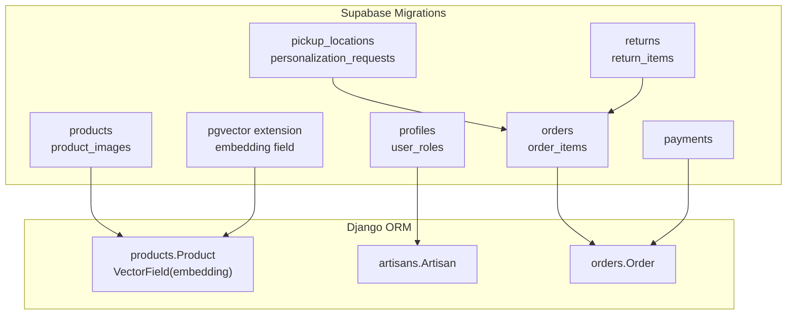
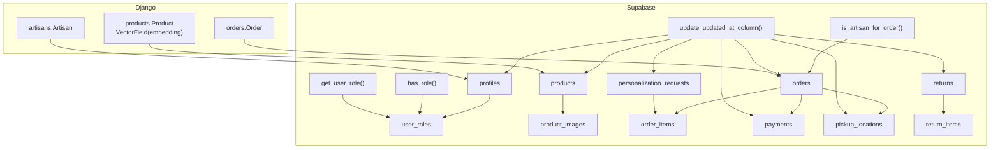
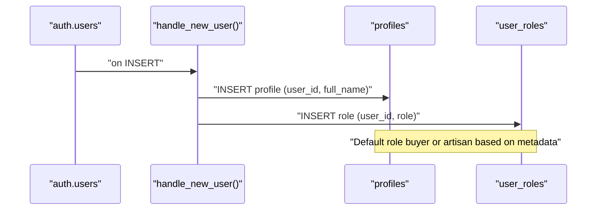
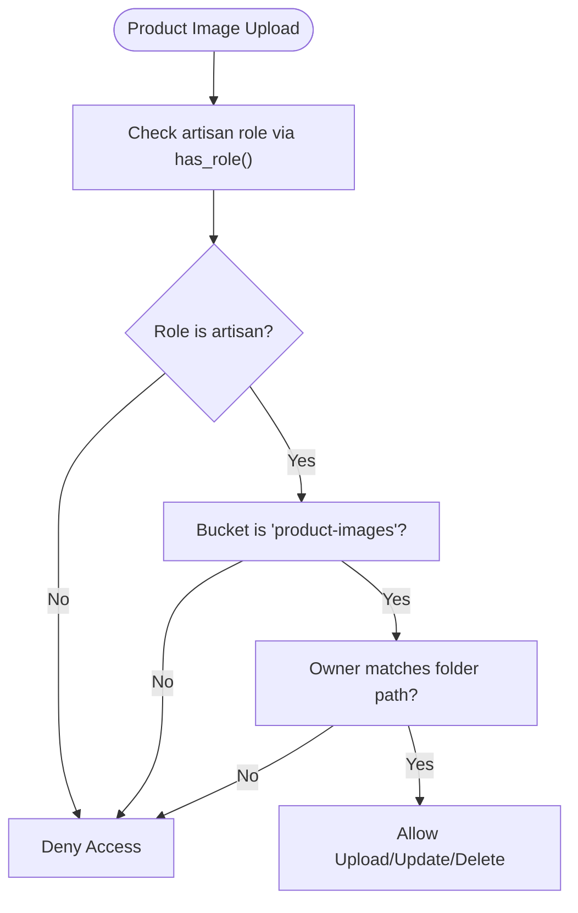
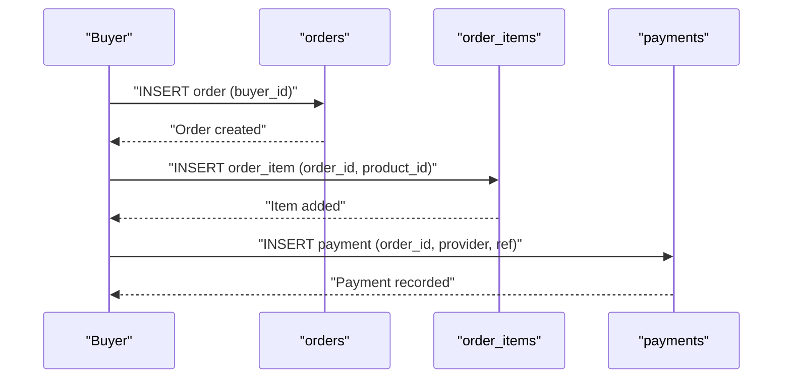
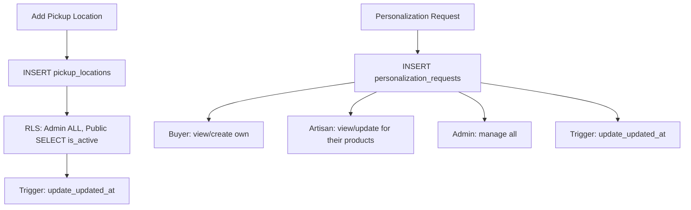
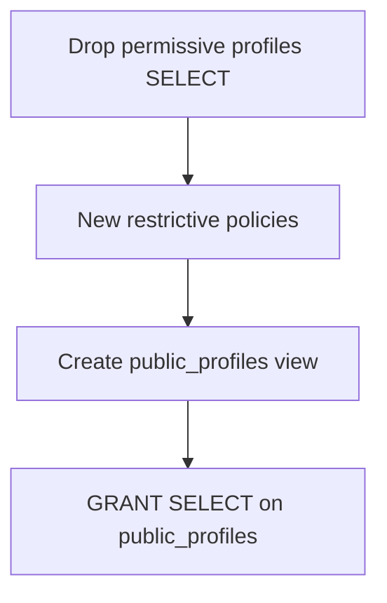
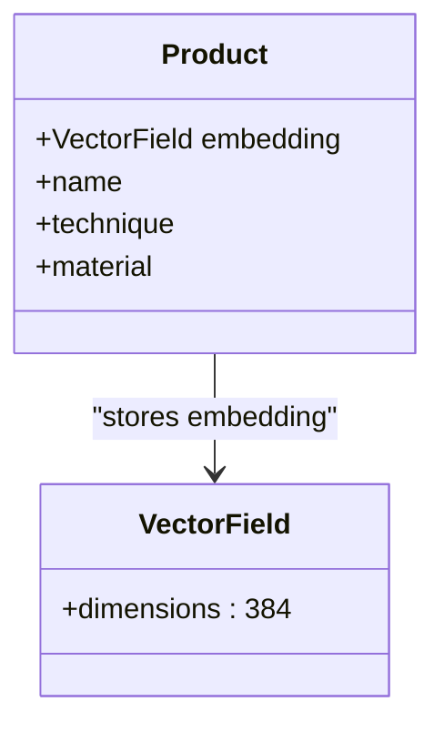
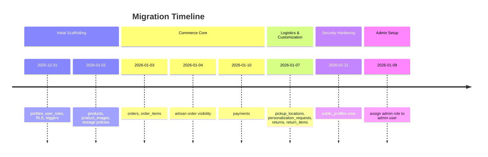
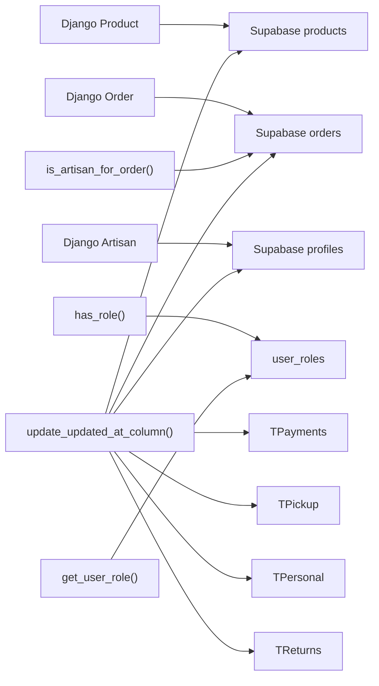

# Database Schema Evolution

<cite>
**Referenced Files in This Document**
- [20251231095959_3473bebe-42ab-4109-8633-54732ebf1eaf.sql](file://supabase/migrations/20251231095959_3473bebe-42ab-4109-8633-54732ebf1eaf.sql)
- [20260101210119_8814f12d-688f-4774-9ce8-6ce5f9fd0bba.sql](file://supabase/migrations/20260101210119_8814f12d-688f-4774-9ce8-6ce5f9fd0bba.sql)
- [20260101211534_d1ce3159-d630-4859-8ee8-6361241b244c.sql](file://supabase/migrations/20260101211534_d1ce3159-d630-4859-8ee8-6361241b244c.sql)
- [20260103085459_7948cea8-ed91-44d2-882d-43b3ec3c3fa4.sql](file://supabase/migrations/20260103085459_7948cea8-ed91-44d2-882d-43b3ec3c3fa4.sql)
- [20260104173154_8858732d-0e5c-45cd-afaf-c177dfa5487a.sql](file://supabase/migrations/20260104173154_8858732d-0e5c-45cd-afaf-c177dfa5487a.sql)
- [20260107224910_0b6f10e2-c8bb-49bb-ba91-d7b9b48cd27c.sql](file://supabase/migrations/20260107224910_0b6f10e2-c8bb-49bb-ba91-d7b9b48cd27c.sql)
- [20260109095251_6889a1b9-3b1c-4b8f-9535-f3ef095414de.sql](file://supabase/migrations/20260109095251_6889a1b9-3b1c-4b8f-9535-f3ef095414de.sql)
- [20260110082525_e26cf9e4-1e19-414d-9316-27ada8493a53.sql](file://supabase/migrations/20260110082525_e26cf9e4-1e19-414d-9316-27ada8493a53.sql)
- [20260110084208_19f31e38-2062-4a6a-a516-e5b9de4e3510.sql](file://supabase/migrations/20260110084208_19f31e38-2062-4a6a-a516-e5b9de4e3510.sql)
- [20260121122109_0b1cb36d-aa4e-4dd7-a125-c453bc87fffe.sql](file://supabase/migrations/20260121122109_0b1cb36d-aa4e-4dd7-a125-c453bc87fffe.sql)
- [20260301183140_74b1e32e-ded4-4234-9c49-76542f291b2d.sql](file://supabase/migrations/20260301183140_74b1e32e-ded4-4234-9c49-76542f291b2d.sql)
- [20260301185835_24e7e596-6ffe-4991-964c-74e173d7213e.sql](file://supabase/migrations/20260301185835_24e7e596-6ffe-4991-964c-74e173d7213e.sql)
- [20260307151135_abb92613-d0a4-4ab6-8384-d241b138020b.sql](file://supabase/migrations/20260307151135_abb92613-d0a4-4ab6-8384-d241b138020b.sql)
- [20260312151001_0ad1fffe-4364-4902-9212-6c6e1aeb1f08.sql](file://supabase/migrations/20260312151001_0ad1fffe-4364-4902-9212-6c6e1aeb1f08.sql)
- [20260312151243_54077459-7217-4c42-a35e-67af66d898f3.sql](file://supabase/migrations/20260312151243_54077459-7217-4c42-a35e-67af66d898f3.sql)
- [models.py](file://backend/apps/products/models.py)
- [models.py](file://backend/apps/artisans/models.py)
- [models.py](file://backend/apps/orders/models.py)
</cite>

## Table of Contents
1. [Introduction](#introduction)
2. [Project Structure](#project-structure)
3. [Core Components](#core-components)
4. [Architecture Overview](#architecture-overview)
5. [Detailed Component Analysis](#detailed-component-analysis)
6. [Dependency Analysis](#dependency-analysis)
7. [Performance Considerations](#performance-considerations)
8. [Troubleshooting Guide](#troubleshooting-guide)
9. [Conclusion](#conclusion)
10. [Appendices](#appendices)

## Introduction
This document explains Empindu’s database schema evolution and migration strategy. It documents the complete migration history, vector embedding implementations, and feature rollouts. It also explains Supabase’s pgvector extension usage for semantic search, embedding management, indexing strategies for performance and search, data model versioning, backward compatibility, rollback procedures, and the integration between Django ORM models and raw SQL migrations, custom database functions, and triggers. Finally, it outlines a deployment strategy for schema changes and production database updates.

## Project Structure
Empindu’s database schema is primarily defined by Supabase SQL migrations under the Supabase directory. Django ORM models in the backend define application-level data models and integrate with Postgres/pgvector for embeddings. The migrations evolve the schema over time, adding tables, enums, policies, functions, and triggers. The Django models reference Supabase-managed tables and extend them with vector fields for semantic search.

**Diagram sources**
- [20251231095959_3473bebe-42ab-4109-8633-54732ebf1eaf.sql:1-140](file://supabase/migrations/20251231095959_3473bebe-42ab-4109-8633-54732ebf1eaf.sql#L1-L140)
- [20260101210119_8814f12d-688f-4774-9ce8-6ce5f9fd0bba.sql:1-118](file://supabase/migrations/20260101210119_8814f12d-688f-4774-9ce8-6ce5f9fd0bba.sql#L1-L118)
- [20260103085459_7948cea8-ed91-44d2-882d-43b3ec3c3fa4.sql:1-53](file://supabase/migrations/20260103085459_7948cea8-ed91-44d2-882d-43b3ec3c3fa4.sql#L1-L53)
- [20260110084208_19f31e38-2062-4a6a-a516-e5b9de4e3510.sql:1-45](file://supabase/migrations/20260110084208_19f31e38-2062-4a6a-a516-e5b9de4e3510.sql#L1-L45)
- [20260107224910_0b6f10e2-c8bb-49bb-ba91-d7b9b48cd27c.sql:1-235](file://supabase/migrations/20260107224910_0b6f10e2-c8bb-49bb-ba91-d7b9b48cd27c.sql#L1-L235)
- [20260109095251_6889a1b9-3b1c-4b8f-9535-f3ef095414de.sql:1-7](file://supabase/migrations/20260109095251_6889a1b9-3b1c-4b8f-9535-f3ef095414de.sql#L1-L7)
- [20260110082525_e26cf9e4-1e19-414d-9316-27ada8493a53.sql:1-25](file://supabase/migrations/20260110082525_e26cf9e4-1e19-414d-9316-27ada8493a53.sql#L1-L25)
- [20260121122109_0b1cb36d-aa4e-4dd7-a125-c453bc87fffe.sql:1-36](file://supabase/migrations/20260121122109_0b1cb36d-aa4e-4dd7-a125-c453bc87fffe.sql#L1-L36)
- [models.py:1-153](file://backend/apps/products/models.py#L1-L153)
- [models.py:1-170](file://backend/apps/artisans/models.py#L1-L170)
- [models.py:1-122](file://backend/apps/orders/models.py#L1-L122)

**Section sources**
- [20251231095959_3473bebe-42ab-4109-8633-54732ebf1eaf.sql:1-140](file://supabase/migrations/20251231095959_3473bebe-42ab-4109-8633-54732ebf1eaf.sql#L1-L140)
- [20260101210119_8814f12d-688f-4774-9ce8-6ce5f9fd0bba.sql:1-118](file://supabase/migrations/20260101210119_8814f12d-688f-4774-9ce8-6ce5f9fd0bba.sql#L1-L118)
- [20260103085459_7948cea8-ed91-44d2-882d-43b3ec3c3fa4.sql:1-53](file://supabase/migrations/20260103085459_7948cea8-ed91-44d2-882d-43b3ec3c3fa4.sql#L1-L53)
- [20260110084208_19f31e38-2062-4a6a-a516-e5b9de4e3510.sql:1-45](file://supabase/migrations/20260110084208_19f31e38-2062-4a6a-a516-e5b9de4e3510.sql#L1-L45)
- [20260107224910_0b6f10e2-c8bb-49bb-ba91-d7b9b48cd27c.sql:1-235](file://supabase/migrations/20260107224910_0b6f10e2-c8bb-49bb-ba91-d7b9b48cd27c.sql#L1-L235)
- [20260121122109_0b1cb36d-aa4e-4dd7-a125-c453bc87fffe.sql:1-36](file://supabase/migrations/20260121122109_0b1cb36d-aa4e-4dd7-a125-c453bc87fffe.sql#L1-L36)
- [models.py:1-153](file://backend/apps/products/models.py#L1-L153)
- [models.py:1-170](file://backend/apps/artisans/models.py#L1-L170)
- [models.py:1-122](file://backend/apps/orders/models.py#L1-L122)

## Core Components
- Supabase migrations define the canonical schema, including tables, enums, row-level security (RLS), policies, custom functions, and triggers.
- Django ORM models define application-level entities and integrate with Supabase-managed tables. They include a vector embedding field for semantic search.
- pgvector extension is used to store and query vector embeddings for similarity search.

Key schema components:
- Authentication and roles: profiles, user_roles, app_role enum, role-checking functions, and triggers.
- Product catalog: products, product_images, storage buckets, and policies.
- Orders and payments: orders, order_items, payments, and related policies.
- Logistics and returns: pickup_locations, personalization_requests, returns, return_items.
- Security: RLS policies, security definer functions, and a public profiles view.

**Section sources**
- [20251231095959_3473bebe-42ab-4109-8633-54732ebf1eaf.sql:1-140](file://supabase/migrations/20251231095959_3473bebe-42ab-4109-8633-54732ebf1eaf.sql#L1-L140)
- [20260101210119_8814f12d-688f-4774-9ce8-6ce5f9fd0bba.sql:1-118](file://supabase/migrations/20260101210119_8814f12d-688f-4774-9ce8-6ce5f9fd0bba.sql#L1-L118)
- [20260103085459_7948cea8-ed91-44d2-882d-43b3ec3c3fa4.sql:1-53](file://supabase/migrations/20260103085459_7948cea8-ed91-44d2-882d-43b3ec3c3fa4.sql#L1-L53)
- [20260110084208_19f31e38-2062-4a6a-a516-e5b9de4e3510.sql:1-45](file://supabase/migrations/20260110084208_19f31e38-2062-4a6a-a516-e5b9de4e3510.sql#L1-L45)
- [20260107224910_0b6f10e2-c8bb-49bb-ba91-d7b9b48cd27c.sql:1-235](file://supabase/migrations/20260107224910_0b6f10e2-c8bb-49bb-ba91-d7b9b48cd27c.sql#L1-L235)
- [20260121122109_0b1cb36d-aa4e-4dd7-a125-c453bc87fffe.sql:1-36](file://supabase/migrations/20260121122109_0b1cb36d-aa4e-4dd7-a125-c453bc87fffe.sql#L1-L36)
- [models.py:1-153](file://backend/apps/products/models.py#L1-L153)

## Architecture Overview
The database architecture centers on Supabase-managed tables with strict RLS and custom functions. Django ORM models mirror core entities and add vector embeddings for semantic search. Triggers maintain audit timestamps. Functions encapsulate role checks and artisan order verification.

**Diagram sources**
- [20251231095959_3473bebe-42ab-4109-8633-54732ebf1eaf.sql:1-140](file://supabase/migrations/20251231095959_3473bebe-42ab-4109-8633-54732ebf1eaf.sql#L1-L140)
- [20260101210119_8814f12d-688f-4774-9ce8-6ce5f9fd0bba.sql:1-118](file://supabase/migrations/20260101210119_8814f12d-688f-4774-9ce8-6ce5f9fd0bba.sql#L1-L118)
- [20260103085459_7948cea8-ed91-44d2-882d-43b3ec3c3fa4.sql:1-53](file://supabase/migrations/20260103085459_7948cea8-ed91-44d2-882d-43b3ec3c3fa4.sql#L1-L53)
- [20260110084208_19f31e38-2062-4a6a-a516-e5b9de4e3510.sql:1-45](file://supabase/migrations/20260110084208_19f31e38-2062-4a6a-a516-e5b9de4e3510.sql#L1-L45)
- [20260107224910_0b6f10e2-c8bb-49bb-ba91-d7b9b48cd27c.sql:1-235](file://supabase/migrations/20260107224910_0b6f10e2-c8bb-49bb-ba91-d7b9b48cd27c.sql#L1-L235)
- [20260110082525_e26cf9e4-1e19-414d-9316-27ada8493a53.sql:1-25](file://supabase/migrations/20260110082525_e26cf9e4-1e19-414d-9316-27ada8493a53.sql#L1-L25)
- [models.py:1-153](file://backend/apps/products/models.py#L1-L153)

## Detailed Component Analysis

### Authentication, Roles, and Row-Level Security
- Enum app_role defines roles: admin, artisan, buyer.
- profiles and user_roles tables store identities and roles, with RLS enabled.
- Security-definer functions has_role and get_user_role prevent RLS recursion and simplify policy checks.
- Policies grant selective access based on roles and ownership.
- A trigger updates updated_at timestamps automatically.

**Diagram sources**
- [20251231095959_3473bebe-42ab-4109-8633-54732ebf1eaf.sql:97-126](file://supabase/migrations/20251231095959_3473bebe-42ab-4109-8633-54732ebf1eaf.sql#L97-L126)

**Section sources**
- [20251231095959_3473bebe-42ab-4109-8633-54732ebf1eaf.sql:1-140](file://supabase/migrations/20251231095959_3473bebe-42ab-4109-8633-54732ebf1eaf.sql#L1-L140)

### Product Catalog and Image Management
- products and product_images tables define the product catalog with RLS policies.
- Storage bucket product-images is provisioned with policies allowing artisans to upload/manage images.
- Triggers maintain updated_at for auditability.

**Diagram sources**
- [20260101210119_8814f12d-688f-4774-9ce8-6ce5f9fd0bba.sql:91-118](file://supabase/migrations/20260101210119_8814f12d-688f-4774-9ce8-6ce5f9fd0bba.sql#L91-L118)

**Section sources**
- [20260101210119_8814f12d-688f-4774-9ce8-6ce5f9fd0bba.sql:1-118](file://supabase/migrations/20260101210119_8814f12d-688f-4774-9ce8-6ce5f9fd0bba.sql#L1-L118)

### Orders, Order Items, and Payments
- orders and order_items define the order lifecycle with RLS policies.
- payments tracks multiple payment providers with RLS.
- Policies restrict visibility to buyers, artisans (for their orders), and admins.

**Diagram sources**
- [20260103085459_7948cea8-ed91-44d2-882d-43b3ec3c3fa4.sql:1-53](file://supabase/migrations/20260103085459_7948cea8-ed91-44d2-882d-43b3ec3c3fa4.sql#L1-L53)
- [20260110084208_19f31e38-2062-4a6a-a516-e5b9de4e3510.sql:1-45](file://supabase/migrations/20260110084208_19f31e38-2062-4a6a-a516-e5b9de4e3510.sql#L1-L45)

**Section sources**
- [20260103085459_7948cea8-ed91-44d2-882d-43b3ec3c3fa4.sql:1-53](file://supabase/migrations/20260103085459_7948cea8-ed91-44d2-882d-43b3ec3c3fa4.sql#L1-L53)
- [20260104173154_8858732d-0e5c-45cd-afaf-c177dfa5487a.sql:1-22](file://supabase/migrations/20260104173154_8858732d-0e5c-45cd-afaf-c177dfa5487a.sql#L1-L22)
- [20260110084208_19f31e38-2062-4a6a-a516-e5b9de4e3510.sql:1-45](file://supabase/migrations/20260110084208_19f31e38-2062-4a6a-a516-e5b9de4e3510.sql#L1-L45)

### Logistics, Personalization, Returns, and Pickups
- pickup_locations centralizes verified pickup points with RLS.
- personalization_requests supports custom orders with role-based visibility.
- returns and return_items track return lifecycle with conditions and statuses.
- Triggers maintain updated_at for new tables.

**Diagram sources**
- [20260107224910_0b6f10e2-c8bb-49bb-ba91-d7b9b48cd27c.sql:11-235](file://supabase/migrations/20260107224910_0b6f10e2-c8bb-49bb-ba91-d7b9b48cd27c.sql#L11-L235)

**Section sources**
- [20260107224910_0b6f10e2-c8bb-49bb-ba91-d7b9b48cd27c.sql:1-235](file://supabase/migrations/20260107224910_0b6f10e2-c8bb-49bb-ba91-d7b9b48cd27c.sql#L1-L235)

### Security Hardening and Public Profiles View
- Restrictive policies limit direct profiles access; a public_profiles view exposes non-sensitive fields safely.
- Grants SELECT on the view to anon and authenticated users.

**Diagram sources**
- [20260121122109_0b1cb36d-aa4e-4dd7-a125-c453bc87fffe.sql:1-36](file://supabase/migrations/20260121122109_0b1cb36d-aa4e-4dd7-a125-c453bc87fffe.sql#L1-L36)

**Section sources**
- [20260121122109_0b1cb36d-aa4e-4dd7-a125-c453bc87fffe.sql:1-36](file://supabase/migrations/20260121122109_0b1cb36d-aa4e-4dd7-a125-c453bc87fffe.sql#L1-L36)

### Vector Embeddings and Semantic Search
- Django Product model includes a VectorField for embeddings.
- pgvector extension is used for similarity search.
- Embeddings are updated by Celery tasks (external to the schema).

**Diagram sources**
- [models.py:78-80](file://backend/apps/products/models.py#L78-L80)

**Section sources**
- [models.py:1-153](file://backend/apps/products/models.py#L1-L153)

### Migration History and Feature Rollouts
- Initial user and product scaffolding with RLS and triggers.
- Orders and payments added with role-based policies.
- Pickup locations, personalization, returns, and logistics features rolled out.
- Security hardening with public profiles view.
- Admin role assignment for initial admin user.

**Diagram sources**
- [20251231095959_3473bebe-42ab-4109-8633-54732ebf1eaf.sql:1-140](file://supabase/migrations/20251231095959_3473bebe-42ab-4109-8633-54732ebf1eaf.sql#L1-L140)
- [20260101210119_8814f12d-688f-4774-9ce8-6ce5f9fd0bba.sql:1-118](file://supabase/migrations/20260101210119_8814f12d-688f-4774-9ce8-6ce5f9fd0bba.sql#L1-L118)
- [20260103085459_7948cea8-ed91-44d2-882d-43b3ec3c3fa4.sql:1-53](file://supabase/migrations/20260103085459_7948cea8-ed91-44d2-882d-43b3ec3c3fa4.sql#L1-L53)
- [20260104173154_8858732d-0e5c-45cd-afaf-c177dfa5487a.sql:1-22](file://supabase/migrations/20260104173154_8858732d-0e5c-45cd-afaf-c177dfa5487a.sql#L1-L22)
- [20260110084208_19f31e38-2062-4a6a-a516-e5b9de4e3510.sql:1-45](file://supabase/migrations/20260110084208_19f31e38-2062-4a6a-a516-e5b9de4e3510.sql#L1-L45)
- [20260107224910_0b6f10e2-c8bb-49bb-ba91-d7b9b48cd27c.sql:1-235](file://supabase/migrations/20260107224910_0b6f10e2-c8bb-49bb-ba91-d7b9b48cd27c.sql#L1-L235)
- [20260121122109_0b1cb36d-aa4e-4dd7-a125-c453bc87fffe.sql:1-36](file://supabase/migrations/20260121122109_0b1cb36d-aa4e-4dd7-a125-c453bc87fffe.sql#L1-L36)
- [20260109095251_6889a1b9-3b1c-4b8f-9535-f3ef095414de.sql:1-7](file://supabase/migrations/20260109095251_6889a1b9-3b1c-4b8f-9535-f3ef095414de.sql#L1-L7)

## Dependency Analysis
- Django models depend on Supabase-managed tables for persistence.
- Functions and policies depend on each other for role checks and order validation.
- Triggers depend on a shared function to maintain updated_at.
- Storage policies depend on bucket configuration and folder structure.

**Diagram sources**
- [20251231095959_3473bebe-42ab-4109-8633-54732ebf1eaf.sql:35-63](file://supabase/migrations/20251231095959_3473bebe-42ab-4109-8633-54732ebf1eaf.sql#L35-L63)
- [20260110082525_e26cf9e4-1e19-414d-9316-27ada8493a53.sql:4-25](file://supabase/migrations/20260110082525_e26cf9e4-1e19-414d-9316-27ada8493a53.sql#L4-L25)
- [20251231095959_3473bebe-42ab-4109-8633-54732ebf1eaf.sql:128-140](file://supabase/migrations/20251231095959_3473bebe-42ab-4109-8633-54732ebf1eaf.sql#L128-L140)
- [20260101210119_8814f12d-688f-4774-9ce8-6ce5f9fd0bba.sql:85-90](file://supabase/migrations/20260101210119_8814f12d-688f-4774-9ce8-6ce5f9fd0bba.sql#L85-L90)
- [20260103085459_7948cea8-ed91-44d2-882d-43b3ec3c3fa4.sql:49-53](file://supabase/migrations/20260103085459_7948cea8-ed91-44d2-882d-43b3ec3c3fa4.sql#L49-L53)
- [20260110084208_19f31e38-2062-4a6a-a516-e5b9de4e3510.sql:41-45](file://supabase/migrations/20260110084208_19f31e38-2062-4a6a-a516-e5b9de4e3510.sql#L41-L45)
- [20260107224910_0b6f10e2-c8bb-49bb-ba91-d7b9b48cd27c.sql:213-227](file://supabase/migrations/20260107224910_0b6f10e2-c8bb-49bb-ba91-d7b9b48cd27c.sql#L213-L227)

**Section sources**
- [20251231095959_3473bebe-42ab-4109-8633-54732ebf1eaf.sql:1-140](file://supabase/migrations/20251231095959_3473bebe-42ab-4109-8633-54732ebf1eaf.sql#L1-L140)
- [20260110082525_e26cf9e4-1e19-414d-9316-27ada8493a53.sql:1-25](file://supabase/migrations/20260110082525_e26cf9e4-1e19-414d-9316-27ada8493a53.sql#L1-L25)
- [20260101210119_8814f12d-688f-4774-9ce8-6ce5f9fd0bba.sql:85-90](file://supabase/migrations/20260101210119_8814f12d-688f-4774-9ce8-6ce5f9fd0bba.sql#L85-L90)
- [20260103085459_7948cea8-ed91-44d2-882d-43b3ec3c3fa4.sql:49-53](file://supabase/migrations/20260103085459_7948cea8-ed91-44d2-882d-43b3ec3c3fa4.sql#L49-L53)
- [20260110084208_19f31e38-2062-4a6a-a516-e5b9de4e3510.sql:41-45](file://supabase/migrations/20260110084208_19f31e38-2062-4a6a-a516-e5b9de4e3510.sql#L41-L45)
- [20260107224910_0b6f10e2-c8bb-49bb-ba91-d7b9b48cd27c.sql:213-227](file://supabase/migrations/20260107224910_0b6f10e2-c8bb-49bb-ba91-d7b9b48cd27c.sql#L213-L227)

## Performance Considerations
- Indexing strategies:
  - Primary keys on all tables (UUID).
  - Foreign key indexes implied by constraints; consider explicit indexes for frequent join columns (e.g., orders.buyer_id, order_items.product_id).
  - Add GIN or ivfflat indexes on vector embeddings for similarity search.
- Query optimization:
  - Use RLS-aware queries; avoid unnecessary joins when policies filter data.
  - Prefer EXISTS subqueries for role checks (as seen in policies).
  - Batch updates to leverage triggers efficiently.
- Storage:
  - Use storage.buckets for images; enforce folder-based ownership checks.
- Caching:
  - Cache frequently accessed product lists and public profiles view results.

[No sources needed since this section provides general guidance]

## Troubleshooting Guide
Common issues and resolutions:
- Role mismatches: Verify has_role and get_user_role functions and policies.
- Artisan order visibility: Use is_artisan_for_order function to bypass complex policy recursion.
- Updated-at timestamps: Ensure triggers are attached to all relevant tables.
- Storage access: Confirm bucket permissions and folder ownership checks.

**Section sources**
- [20251231095959_3473bebe-42ab-4109-8633-54732ebf1eaf.sql:35-63](file://supabase/migrations/20251231095959_3473bebe-42ab-4109-8633-54732ebf1eaf.sql#L35-L63)
- [20260110082525_e26cf9e4-1e19-414d-9316-27ada8493a53.sql:4-25](file://supabase/migrations/20260110082525_e26cf9e4-1e19-414d-9316-27ada8493a53.sql#L4-L25)
- [20251231095959_3473bebe-42ab-4109-8633-54732ebf1eaf.sql:128-140](file://supabase/migrations/20251231095959_3473bebe-42ab-4109-8633-54732ebf1eaf.sql#L128-L140)
- [20260101210119_8814f12d-688f-4774-9ce8-6ce5f9fd0bba.sql:91-118](file://supabase/migrations/20260101210119_8814f12d-688f-4774-9ce8-6ce5f9fd0bba.sql#L91-L118)

## Conclusion
Empindu’s schema evolution demonstrates a disciplined approach to database design: clear separation of concerns between Supabase-managed schema and Django ORM models, robust RLS and policies, reusable security functions, and triggers for auditability. The addition of vector embeddings enables semantic search, while careful indexing and query patterns support performance. The documented migration history and troubleshooting guidance provide a foundation for safe, backward-compatible deployments.

[No sources needed since this section summarizes without analyzing specific files]

## Appendices

### Data Model Versioning and Backward Compatibility
- Versioning approach:
  - Migrations are timestamped and ordered; each file represents a discrete change.
  - Enums and policies are additive; existing rows remain compatible.
- Backward compatibility:
  - Use IF NOT EXISTS for new columns and tables.
  - Keep default values and constraints that preserve historical data.
- Rollback procedures:
  - Reversible migrations: DROP policies, functions, and tables as needed.
  - For irreversible changes, create a new migration that reverts to previous state.
  - Admin role cleanup: DELETE from user_roles for specific user_id before reassigning roles.

**Section sources**
- [20260107224910_0b6f10e2-c8bb-49bb-ba91-d7b9b48cd27c.sql:1-235](file://supabase/migrations/20260107224910_0b6f10e2-c8bb-49bb-ba91-d7b9b48cd27c.sql#L1-L235)
- [20260109095251_6889a1b9-3b1c-4b8f-9535-f3ef095414de.sql:1-7](file://supabase/migrations/20260109095251_6889a1b9-3b1c-4b8f-9535-f3ef095414de.sql#L1-L7)

### Deployment Strategy for Schema Changes
- Pre-deployment:
  - Review migration order and dependencies.
  - Test RLS policies and security functions locally.
- Deployment:
  - Apply migrations in order; monitor for constraint violations.
  - Validate triggers and updated_at behavior after schema changes.
- Post-deployment:
  - Run integrity checks on related tables (orders, payments, returns).
  - Verify embedding-related tasks are scheduled and healthy.
  - Monitor logs for RLS policy errors.

[No sources needed since this section provides general guidance]