# Gifting & Heritage Fund

<cite>
**Referenced Files in This Document**
- [models.py](file://backend/apps/gifting/models.py)
- [models.py](file://backend/apps/heritage/models.py)
- [models.py](file://backend/apps/orders/models.py)
- [models.py](file://backend/apps/artisans/models.py)
- [models.py](file://backend/apps/products/models.py)
- [router.py](file://backend/api/v1/router.py)
- [gifting.py](file://backend/api/v1/gifting.py)
- [orders.py](file://backend/api/v1/orders.py)
- [router.py](file://backend/api/v1/artisans.py)
- [CorporateGifting.tsx](file://apps/web/src/pages/CorporateGifting.tsx)
- [GiftOrderTimeline.tsx](file://apps/web/src/components/gifting/GiftOrderTimeline.tsx)
- [useCorporateGifting.tsx](file://apps/web/src/hooks/useCorporateGifting.tsx)
- [20260301183140_74b1e32e-ded4-4234-9c49-76542f291b2d.sql](file://supabase/migrations/20260301183140_74b1e32e-ded4-4234-9c49-76542f291b2d.sql)
- [send-gift-confirmation/index.ts](file://supabase/functions/send-gift-confirmation/index.ts)
- [process-cash-payment/index.ts](file://supabase/functions/process-cash-payment/index.ts)
</cite>

## Table of Contents
1. [Introduction](#introduction)
2. [Project Structure](#project-structure)
3. [Core Components](#core-components)
4. [Architecture Overview](#architecture-overview)
5. [Detailed Component Analysis](#detailed-component-analysis)
6. [Dependency Analysis](#dependency-analysis)
7. [Performance Considerations](#performance-considerations)
8. [Troubleshooting Guide](#troubleshooting-guide)
9. [Conclusion](#conclusion)
10. [Appendices](#appendices)

## Introduction
This document describes the data models and workflows for the gifting system and the heritage fund ledger. It covers:
- Gift order structure, personalization, corporate gift management, and scheduling
- Heritage fund accounting with automated 3% levy, fund allocation tracking, and cultural preservation contributions
- Timeline implementation for gift orders, recipient management, and delivery coordination
- Financial ledger design for heritage fund transactions, audit trails, and reporting
- Integration between gifting orders and order processing workflows, including tax and compliance considerations

## Project Structure
The gifting and heritage fund functionality spans backend Django models, frontend React components, Supabase database tables and functions, and API routers.

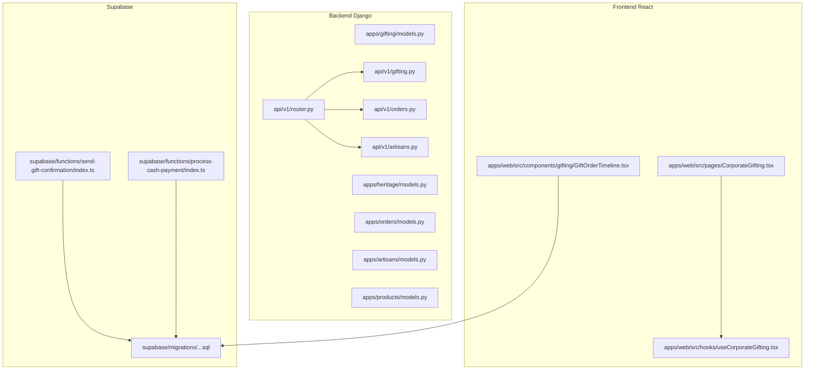

**Diagram sources**
- [router.py:30-40](file://backend/api/v1/router.py#L30-L40)
- [gifting.py:1-13](file://backend/api/v1/gifting.py#L1-L13)
- [orders.py:1-18](file://backend/api/v1/orders.py#L1-L18)
- [CorporateGifting.tsx:1-396](file://apps/web/src/pages/CorporateGifting.tsx#L1-L396)
- [GiftOrderTimeline.tsx:1-85](file://apps/web/src/components/gifting/GiftOrderTimeline.tsx#L1-L85)
- [20260301183140_74b1e32e-ded4-4234-9c49-76542f291b2d.sql:64-130](file://supabase/migrations/20260301183140_74b1e32e-ded4-4234-9c49-76542f291b2d.sql#L64-L130)
- [send-gift-confirmation/index.ts:1-219](file://supabase/functions/send-gift-confirmation/index.ts#L1-L219)
- [process-cash-payment/index.ts:1-114](file://supabase/functions/process-cash-payment/index.ts#L1-L114)

**Section sources**
- [router.py:30-40](file://backend/api/v1/router.py#L30-L40)
- [CorporateGifting.tsx:1-396](file://apps/web/src/pages/CorporateGifting.tsx#L1-L396)
- [GiftOrderTimeline.tsx:1-85](file://apps/web/src/components/gifting/GiftOrderTimeline.tsx#L1-L85)
- [20260301183140_74b1e32e-ded4-4234-9c49-76542f291b2d.sql:64-130](file://supabase/migrations/20260301183140_74b1e32e-ded4-4234-9c49-76542f291b2d.sql#L64-L130)

## Core Components
- GiftDetails: Personalization and scheduling for individual gift orders
- GiftOrder: Aggregated corporate/bulk gift orders
- Order: Full lifecycle for retail and gift orders, including heritage fund amounts
- HeritageFundEntry: Immutable ledger entries for heritage fund transactions
- Distribution: Proposed, approved, and executed distributions to craft communities
- CraftTradition: Cultural anchor with heritage fund levy percentage
- Product: Pricing and revenue split including heritage fund contribution
- Supabase tables: corporate gift orders, items, recipients, and gift order status history
- Supabase functions: gift confirmation email and cash-on-delivery payment processor

**Section sources**
- [models.py:9-67](file://backend/apps/gifting/models.py#L9-L67)
- [models.py:10-122](file://backend/apps/orders/models.py#L10-L122)
- [models.py:9-66](file://backend/apps/heritage/models.py#L9-L66)
- [models.py:14-45](file://backend/apps/artisans/models.py#L14-L45)
- [models.py:10-99](file://backend/apps/products/models.py#L10-L99)
- [20260301183140_74b1e32e-ded4-4234-9c49-76542f291b2d.sql:64-130](file://supabase/migrations/20260301183140_74b1e32e-ded4-4234-9c49-76542f291b2d.sql#L64-L130)
- [send-gift-confirmation/index.ts:1-219](file://supabase/functions/send-gift-confirmation/index.ts#L1-L219)
- [process-cash-payment/index.ts:1-114](file://supabase/functions/process-cash-payment/index.ts#L1-L114)

## Architecture Overview
The gifting system integrates frontend forms with Supabase tables and functions, and connects to the order lifecycle and heritage fund ledger via Django models and API routers.

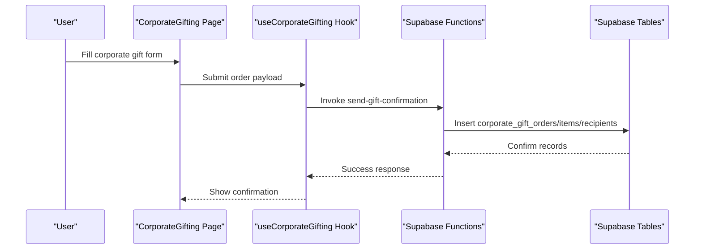

**Diagram sources**
- [CorporateGifting.tsx:83-99](file://apps/web/src/pages/CorporateGifting.tsx#L83-L99)
- [useCorporateGifting.tsx](file://apps/web/src/hooks/useCorporateGifting.tsx)
- [send-gift-confirmation/index.ts:15-219](file://supabase/functions/send-gift-confirmation/index.ts#L15-L219)
- [20260301183140_74b1e32e-ded4-4234-9c49-76542f291b2d.sql:64-130](file://supabase/migrations/20260301183140_74b1e32e-ded4-4234-9c49-76542f291b2d.sql#L64-L130)

## Detailed Component Analysis

### Gift Order Data Model
- GiftDetails captures recipient identity, relationship, occasion, personal message, gift wrap preference, and optional scheduled delivery date.
- GiftOrder aggregates bulk orders with customer/company info, totals, status, and timestamps.

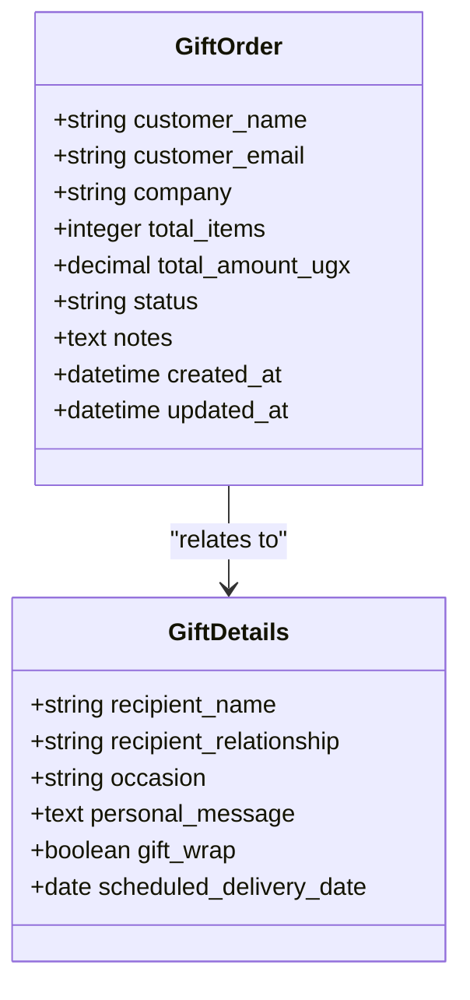

**Diagram sources**
- [models.py:9-67](file://backend/apps/gifting/models.py#L9-L67)

**Section sources**
- [models.py:9-67](file://backend/apps/gifting/models.py#L9-L67)

### Order Lifecycle and Heritage Fund Ledger
- Order includes buyer, artisan, product, quantities, frozen financial snapshots, gift flag, gift details linkage, payment metadata, shipping, and timestamps.
- HeritageFundEntry records immutable ledger entries for every completed order, linking to Order and CraftTradition, with entry type, amount, and description.
- Distribution tracks proposed/approved distributions to communities with status, purpose, beneficiaries, approvals, and timing.

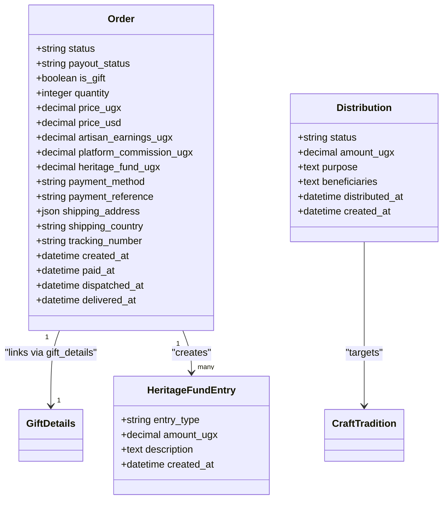

**Diagram sources**
- [models.py:10-122](file://backend/apps/orders/models.py#L10-L122)
- [models.py:9-66](file://backend/apps/heritage/models.py#L9-L66)
- [models.py:14-45](file://backend/apps/artisans/models.py#L14-L45)

**Section sources**
- [models.py:10-122](file://backend/apps/orders/models.py#L10-L122)
- [models.py:9-66](file://backend/apps/heritage/models.py#L9-L66)
- [models.py:14-45](file://backend/apps/artisans/models.py#L14-L45)

### Product Pricing and Heritage Fund Calculation
- Product defines pricing tiers and revenue split percentages (artisan share, heritage fund, platform).
- Unit-level heritage fund contribution is computed per product and scaled by quantity in Order.calculate_totals.

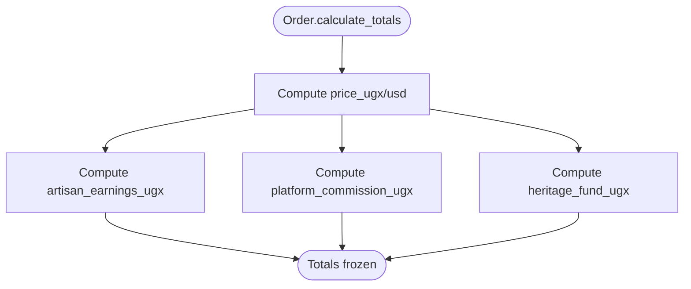

**Diagram sources**
- [models.py:55-99](file://backend/apps/products/models.py#L55-L99)
- [models.py:111-122](file://backend/apps/orders/models.py#L111-L122)

**Section sources**
- [models.py:55-99](file://backend/apps/products/models.py#L55-L99)
- [models.py:111-122](file://backend/apps/orders/models.py#L111-L122)

### Corporate Gifting Workflow (Frontend)
- The CorporateGifting page guides users through company details, product selection, customization, and recipient management.
- useCorporateGifting handles submission to Supabase functions and manages state transitions.

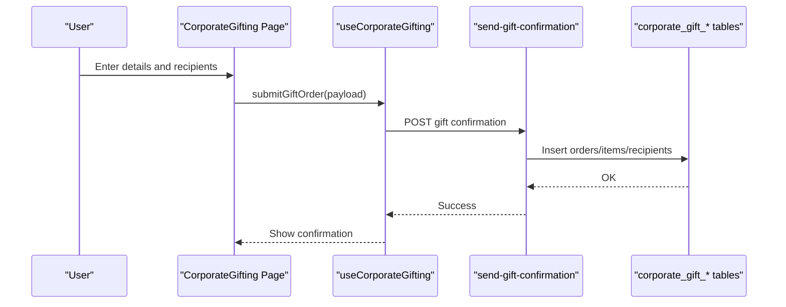

**Diagram sources**
- [CorporateGifting.tsx:83-99](file://apps/web/src/pages/CorporateGifting.tsx#L83-L99)
- [useCorporateGifting.tsx](file://apps/web/src/hooks/useCorporateGifting.tsx)
- [send-gift-confirmation/index.ts:15-219](file://supabase/functions/send-gift-confirmation/index.ts#L15-L219)
- [20260301183140_74b1e32e-ded4-4234-9c49-76542f291b2d.sql:64-130](file://supabase/migrations/20260301183140_74b1e32e-ded4-4234-9c49-76542f291b2d.sql#L64-L130)

**Section sources**
- [CorporateGifting.tsx:1-396](file://apps/web/src/pages/CorporateGifting.tsx#L1-L396)
- [useCorporateGifting.tsx](file://apps/web/src/hooks/useCorporateGifting.tsx)

### Gift Order Timeline (Frontend)
- GiftOrderTimeline queries Supabase’s gift order status history table and renders a chronological timeline with icons and timestamps.

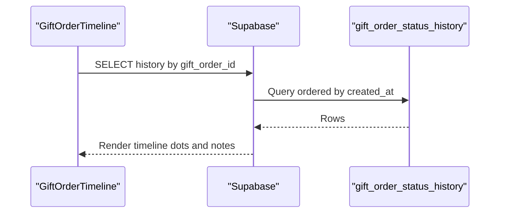

**Diagram sources**
- [GiftOrderTimeline.tsx:21-32](file://apps/web/src/components/gifting/GiftOrderTimeline.tsx#L21-L32)
- [20260301183140_74b1e32e-ded4-4234-9c49-76542f291b2d.sql:1-130](file://supabase/migrations/20260301183140_74b1e32e-ded4-4234-9c49-76542f291b2d.sql#L1-L130)

**Section sources**
- [GiftOrderTimeline.tsx:1-85](file://apps/web/src/components/gifting/GiftOrderTimeline.tsx#L1-L85)
- [20260301183140_74b1e32e-ded4-4234-9c49-76542f291b2d.sql:1-130](file://supabase/migrations/20260301183140_74b1e32e-ded4-4234-9c49-76542f291b2d.sql#L1-L130)

### Delivery Coordination and Cash Payments
- process-cash-payment creates a payment record for cash on delivery/pickup, updates order status, and returns delivery/pickup details.

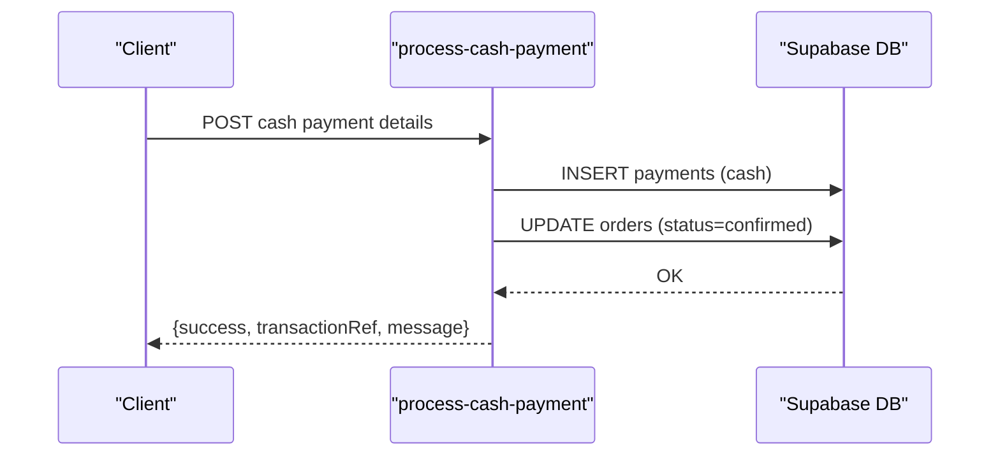

**Diagram sources**
- [process-cash-payment/index.ts:19-114](file://supabase/functions/process-cash-payment/index.ts#L19-L114)
- [20260301183140_74b1e32e-ded4-4234-9c49-76542f291b2d.sql:64-130](file://supabase/migrations/20260301183140_74b1e32e-ded4-4234-9c49-76542f291b2d.sql#L64-L130)

**Section sources**
- [process-cash-payment/index.ts:1-114](file://supabase/functions/process-cash-payment/index.ts#L1-L114)

### API Integration
- API v1 router registers artisan, product, order, and gifting endpoints with JWT authentication for protected routes.

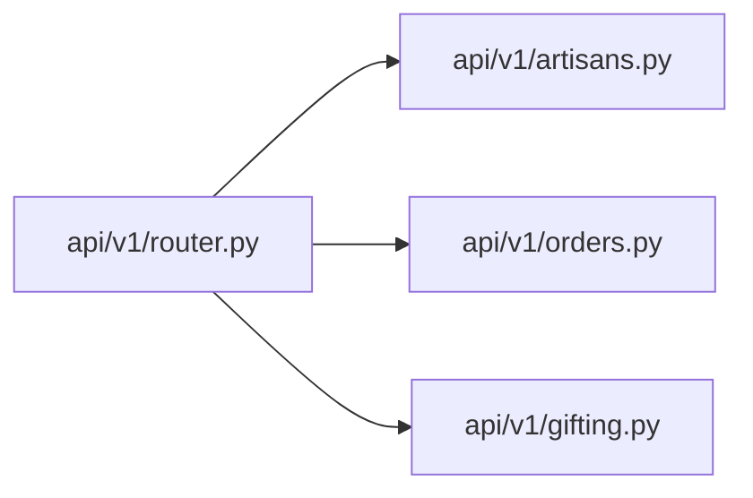

**Diagram sources**
- [router.py:30-40](file://backend/api/v1/router.py#L30-L40)
- [gifting.py:1-13](file://backend/api/v1/gifting.py#L1-L13)
- [orders.py:1-18](file://backend/api/v1/orders.py#L1-L18)

**Section sources**
- [router.py:30-40](file://backend/api/v1/router.py#L30-L40)
- [gifting.py:1-13](file://backend/api/v1/gifting.py#L1-L13)
- [orders.py:1-18](file://backend/api/v1/orders.py#L1-L18)

## Dependency Analysis
- GiftDetails is linked from Order via a OneToOneField when is_gift is true.
- HeritageFundEntry references Order and CraftTradition, enabling cross-tradition fund tracking.
- Product heritage_pct drives Order.heritage_fund_ugx via calculate_totals.
- Supabase tables support corporate gift orders, items, and recipients; functions integrate with frontend flows.

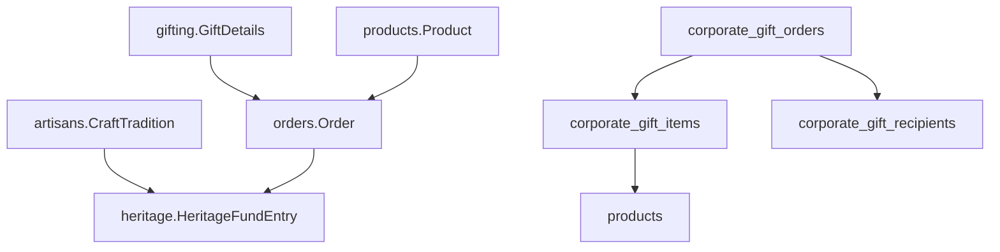

**Diagram sources**
- [models.py:64-72](file://backend/apps/orders/models.py#L64-L72)
- [models.py:55-99](file://backend/apps/products/models.py#L55-L99)
- [models.py:20-27](file://backend/apps/heritage/models.py#L20-L27)
- [20260301183140_74b1e32e-ded4-4234-9c49-76542f291b2d.sql:64-130](file://supabase/migrations/20260301183140_74b1e32e-ded4-4234-9c49-76542f291b2d.sql#L64-L130)

**Section sources**
- [models.py:64-72](file://backend/apps/orders/models.py#L64-L72)
- [models.py:55-99](file://backend/apps/products/models.py#L55-L99)
- [models.py:20-27](file://backend/apps/heritage/models.py#L20-L27)
- [20260301183140_74b1e32e-ded4-4234-9c49-76542f291b2d.sql:64-130](file://supabase/migrations/20260301183140_74b1e32e-ded4-4234-9c49-76542f291b2d.sql#L64-L130)

## Performance Considerations
- Use database indexes on frequently queried fields (e.g., order status, created_at, product craft_tradition).
- Batch retrieval of related entities (items, recipients) to minimize round trips in Supabase functions.
- Cache immutable product and craft tradition metadata on the frontend to reduce repeated network requests.
- Optimize Supabase policies to limit returned columns and apply row-level security efficiently.

## Troubleshooting Guide
- Gift confirmation emails: Verify Supabase function receives a valid bearer token, order ownership matches the authenticated user, and required fields exist before sending.
- Cash payment processing: Ensure order exists, payment record inserts successfully, and order status updates; handle pickup location resolution when applicable.
- Timeline rendering: Confirm gift_order_status_history exists and is ordered by created_at ascending; handle missing data gracefully.

**Section sources**
- [send-gift-confirmation/index.ts:35-74](file://supabase/functions/send-gift-confirmation/index.ts#L35-L74)
- [process-cash-payment/index.ts:44-72](file://supabase/functions/process-cash-payment/index.ts#L44-L72)
- [GiftOrderTimeline.tsx:21-32](file://apps/web/src/components/gifting/GiftOrderTimeline.tsx#L21-L32)

## Conclusion
The gifting system combines Supabase-managed corporate gift workflows with Django-backed order and heritage fund accounting. Automated heritage fund levies, immutable ledger entries, and distribution tracking support cultural preservation and transparent impact reporting. Frontend components streamline corporate gift ordering, personalization, and timeline visibility, while backend models and APIs ensure robust integration and compliance-ready financial flows.

## Appendices

### Data Model Definitions

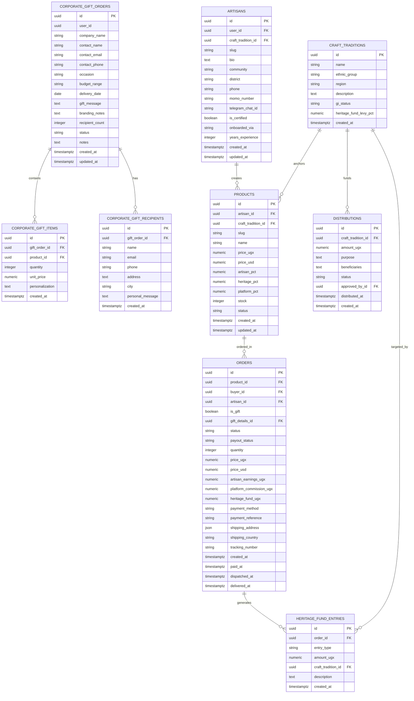

**Diagram sources**
- [20260301183140_74b1e32e-ded4-4234-9c49-76542f291b2d.sql:64-130](file://supabase/migrations/20260301183140_74b1e32e-ded4-4234-9c49-76542f291b2d.sql#L64-L130)
- [models.py:10-122](file://backend/apps/orders/models.py#L10-L122)
- [models.py:10-99](file://backend/apps/products/models.py#L10-L99)
- [models.py:14-45](file://backend/apps/artisans/models.py#L14-L45)
- [models.py:9-66](file://backend/apps/heritage/models.py#L9-L66)