# Deployment & DevOps

<cite>
**Referenced Files in This Document**
- [README.md](file://README.md)
- [docker-compose.yml](file://infrastructure/docker-compose.yml)
- [Procfile](file://backend/Procfile)
- [railway.toml](file://backend/railway.toml)
- [requirements.txt](file://backend/requirements.txt)
- [package.json](file://package.json)
- [config.toml](file://supabase/config.toml)
- [production.py](file://backend/config/settings/production.py)
- [base.py](file://backend/config/settings/base.py)
- [development.py](file://backend/config/settings/development.py)
- [wsgi.py](file://backend/config/wsgi.py)
- [setup.cfg](file://backend/setup.cfg)
</cite>

## Table of Contents
1. [Introduction](#introduction)
2. [Project Structure](#project-structure)
3. [Core Components](#core-components)
4. [Architecture Overview](#architecture-overview)
5. [Detailed Component Analysis](#detailed-component-analysis)
6. [Dependency Analysis](#dependency-analysis)
7. [Performance Considerations](#performance-considerations)
8. [Troubleshooting Guide](#troubleshooting-guide)
9. [Conclusion](#conclusion)
10. [Appendices](#appendices)

## Introduction
This document provides comprehensive deployment and DevOps guidance for Empindu, covering containerization, orchestration, production deployments to Railway (backend) and Vercel (frontend), environment configuration and secrets handling, CI/CD setup, database migrations, backups, disaster recovery, monitoring/logging, performance optimization, scaling, deployment workflows, rollbacks, health checks, security hardening, SSL/TLS, and cost optimization. It synthesizes the repository’s existing configuration artifacts and operational patterns to deliver a practical, repeatable deployment strategy.

## Project Structure
Empindu follows a monorepo layout with:
- Backend: Django + django-ninja API, async ASGI server, Celery workers and periodic tasks, Supabase Edge Functions, and local dev services orchestrated via Docker Compose.
- Frontend: Next.js 14 App Router application.
- Infrastructure: Railway configuration and docker-compose for local development.
- Supabase: Edge Functions and migrations for payment and notification workflows.

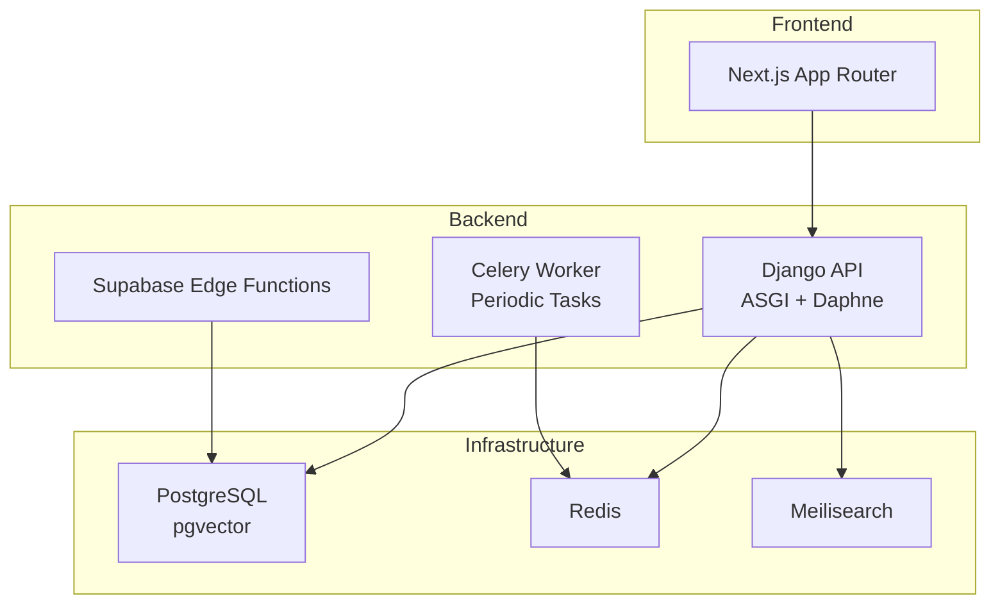

**Diagram sources**
- [docker-compose.yml:1-52](file://infrastructure/docker-compose.yml#L1-L52)
- [Procfile:1-4](file://backend/Procfile#L1-L4)
- [config.toml:1-17](file://supabase/config.toml#L1-L17)

**Section sources**
- [README.md:1-242](file://README.md#L1-L242)
- [docker-compose.yml:1-52](file://infrastructure/docker-compose.yml#L1-L52)
- [railway.toml:1-13](file://backend/railway.toml#L1-L13)

## Core Components
- Backend API and ASGI server: Daphne runs the Django ASGI application behind Railway’s platform.
- Task processing: Celery worker and beat scheduler are configured for background jobs and periodic tasks.
- Edge Functions: Supabase-managed functions handle payment and email notifications.
- Local dev stack: PostgreSQL, Redis, and Meilisearch via docker-compose.
- Frontend: Next.js application deployed to Vercel.

Key configuration touchpoints:
- Railway build and runtime: Nixpacks builder, start command, health check, restart policy, replicas, and Python version.
- Django settings: Base, development, and production environments; environment variable loading; static/media storage; CORS; Sentry.
- Dependencies: Backend pinned requirements; frontend package scripts and dependencies.

**Section sources**
- [Procfile:1-4](file://backend/Procfile#L1-L4)
- [railway.toml:1-13](file://backend/railway.toml#L1-L13)
- [requirements.txt:1-50](file://backend/requirements.txt#L1-L50)
- [package.json:1-89](file://package.json#L1-L89)
- [base.py:1-287](file://backend/config/settings/base.py#L1-L287)
- [production.py:1-33](file://backend/config/settings/production.py#L1-L33)
- [development.py:1-17](file://backend/config/settings/development.py#L1-L17)
- [docker-compose.yml:1-52](file://infrastructure/docker-compose.yml#L1-L52)
- [config.toml:1-17](file://supabase/config.toml#L1-L17)

## Architecture Overview
The deployment architecture separates concerns across backend, frontend, and shared infrastructure:
- Backend: Django API with ASGI, Celery workers/beat, and Supabase Edge Functions.
- Frontend: Next.js application consuming the backend API.
- Infrastructure: PostgreSQL (with pgvector), Redis (cache and Celery broker), Meilisearch (semantic search).
- Hosting: Railway for backend, Vercel for frontend.

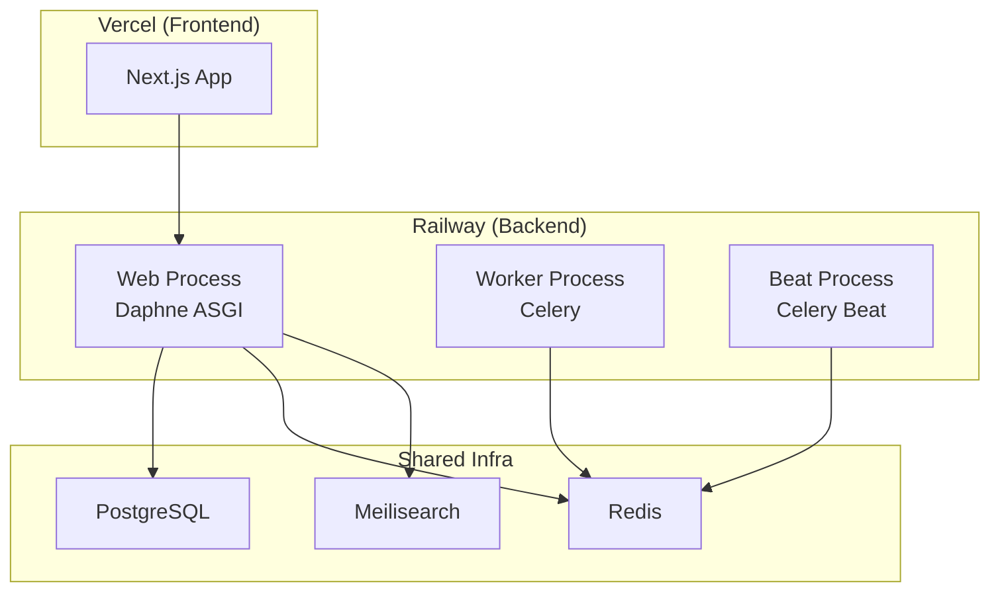

**Diagram sources**
- [Procfile:1-4](file://backend/Procfile#L1-L4)
- [railway.toml:1-13](file://backend/railway.toml#L1-L13)
- [docker-compose.yml:1-52](file://infrastructure/docker-compose.yml#L1-L52)

## Detailed Component Analysis

### Backend Containerization Strategy
- Builder: Nixpacks on Railway.
- Runtime: Daphne serves the Django ASGI application on the port provided by Railway.
- Health check: GET endpoint for readiness/liveness verification.
- Restart policy: On failure.
- Concurrency and scheduling: Celery worker concurrency and DatabaseScheduler for periodic tasks.
- Python version: Explicitly set for reproducibility.

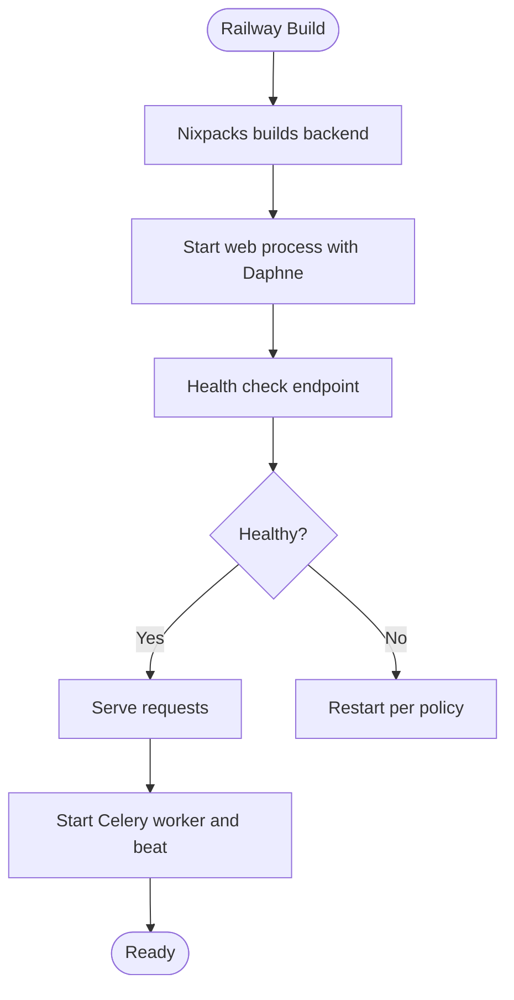

**Diagram sources**
- [railway.toml:1-13](file://backend/railway.toml#L1-L13)
- [Procfile:1-4](file://backend/Procfile#L1-L4)

**Section sources**
- [railway.toml:1-13](file://backend/railway.toml#L1-L13)
- [Procfile:1-4](file://backend/Procfile#L1-L4)

### Service Orchestration with docker-compose
Local development services:
- PostgreSQL with pgvector extension.
- Redis for caching and Celery broker.
- Meilisearch for semantic search.
- Persistent volumes for data durability.
- Health checks for Postgres and Redis.

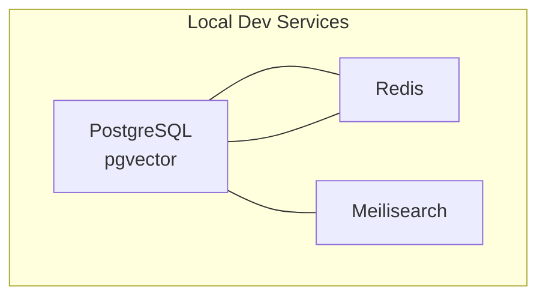

**Diagram sources**
- [docker-compose.yml:1-52](file://infrastructure/docker-compose.yml#L1-L52)

**Section sources**
- [docker-compose.yml:1-52](file://infrastructure/docker-compose.yml#L1-L52)

### Production Deployment to Railway (Backend)
- Install Railway CLI, log in, initialize project, and deploy from the backend directory.
- Railway uses Nixpacks to build and starts the ASGI server with Daphne.
- Health check path and timeout are configured.
- Restart policy and replica count are set.

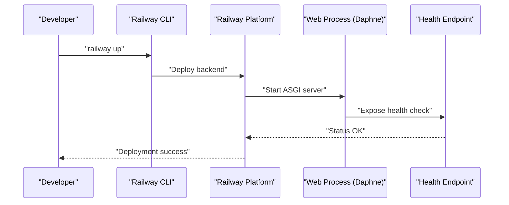

**Diagram sources**
- [README.md:179-193](file://README.md#L179-L193)
- [railway.toml:1-13](file://backend/railway.toml#L1-L13)

**Section sources**
- [README.md:179-193](file://README.md#L179-L193)
- [railway.toml:1-13](file://backend/railway.toml#L1-L13)

### Frontend Deployment to Vercel (Next.js)
- Install Vercel CLI globally, navigate to the frontend app, and run the Vercel command to deploy.
- The frontend consumes the backend API via environment variables.

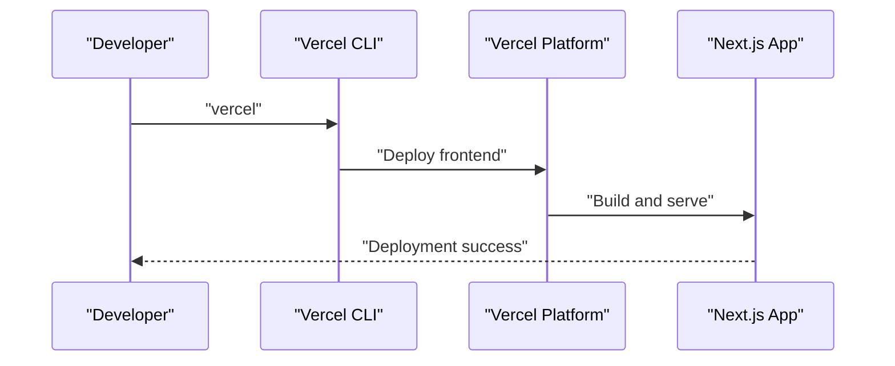

**Diagram sources**
- [README.md:194-203](file://README.md#L194-L203)
- [package.json:1-89](file://package.json#L1-L89)

**Section sources**
- [README.md:194-203](file://README.md#L194-L203)
- [package.json:1-89](file://package.json#L1-L89)

### Environment Configuration Management
- Django settings load from environment variables via django-environ.
- Base settings define defaults and environment-driven configuration for databases, caches, CORS, static/media, and channel layers.
- Development and production settings override base settings and enable security hardening in production.
- Railway sets Python version; environment variables are managed externally (e.g., Railway project variables).

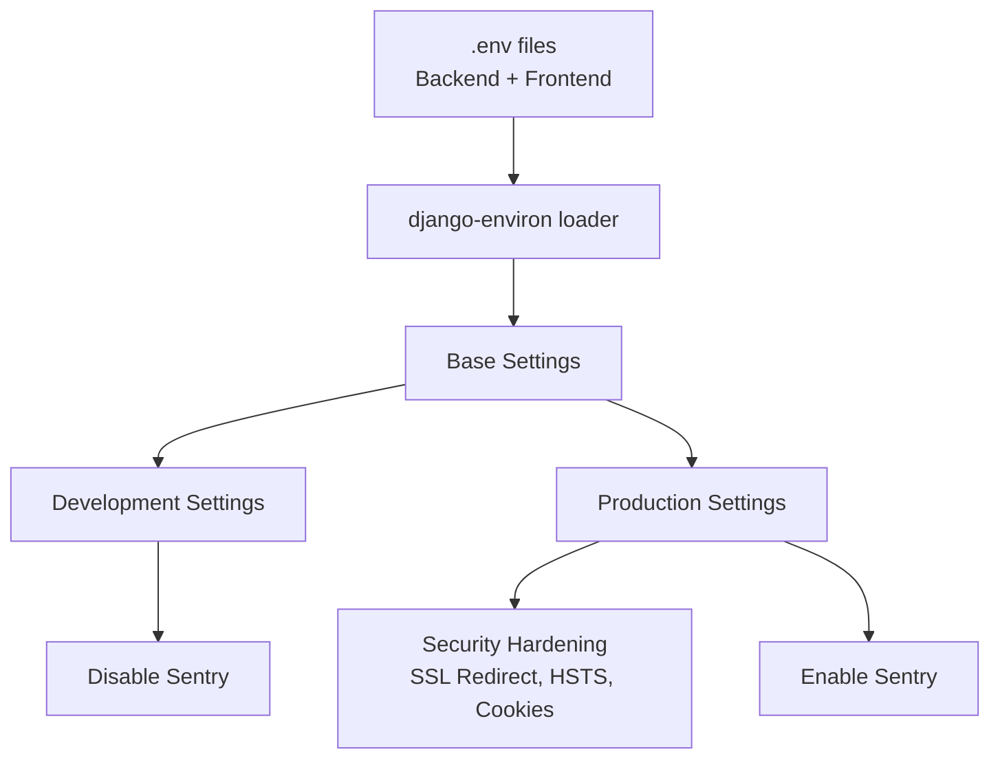

**Diagram sources**
- [base.py:1-287](file://backend/config/settings/base.py#L1-L287)
- [development.py:1-17](file://backend/config/settings/development.py#L1-L17)
- [production.py:1-33](file://backend/config/settings/production.py#L1-L33)

**Section sources**
- [base.py:1-287](file://backend/config/settings/base.py#L1-L287)
- [development.py:1-17](file://backend/config/settings/development.py#L1-L17)
- [production.py:1-33](file://backend/config/settings/production.py#L1-L33)
- [railway.toml:11-13](file://backend/railway.toml#L11-L13)

### Secrets Handling
- Backend secrets are loaded from environment variables (e.g., secret key, database URL, Redis URL, Cloudinary, Stripe, MTN MoMo, Telegram bot, OpenAI).
- Railway project variables should store secrets; avoid committing secrets to the repository.
- Frontend exposes only public API URLs via environment variables.

Recommended practices:
- Use platform-managed secrets (Railway/Vercel).
- Rotate keys regularly.
- Limit scope of secrets per environment.

**Section sources**
- [README.md:109-153](file://README.md#L109-L153)
- [base.py:100-165](file://backend/config/settings/base.py#L100-L165)

### CI/CD Pipeline Setup
Recommended pipeline stages:
- Build: Install dependencies and lint/test.
- Test: Run backend and frontend tests.
- Deploy: Deploy backend to Railway and frontend to Vercel.
- Rollback: Keep previous release tagged and ready for quick revert.

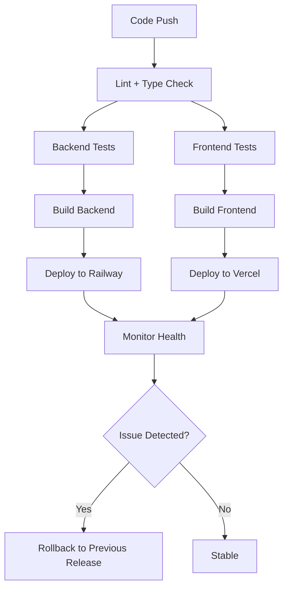

[No sources needed since this diagram shows conceptual workflow, not actual code structure]

### Database Migration Strategy
- Local migrations: Apply after starting infrastructure and before running the Django server.
- Railway migrations: Apply during or after deployment as part of the deployment process.
- Supabase migrations: Managed separately under the Supabase migrations directory; Edge Functions configuration is defined in Supabase TOML.

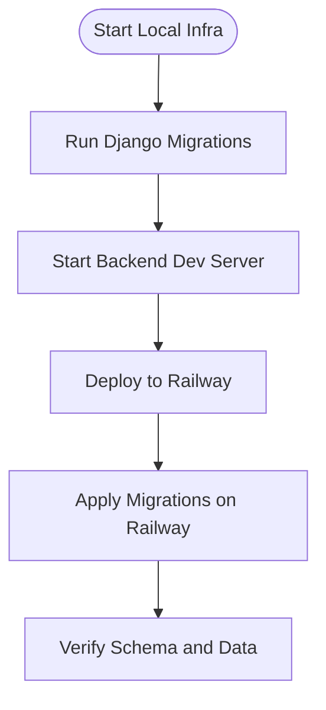

**Diagram sources**
- [README.md:82-84](file://README.md#L82-L84)
- [docker-compose.yml:1-52](file://infrastructure/docker-compose.yml#L1-L52)

**Section sources**
- [README.md:82-84](file://README.md#L82-L84)
- [docker-compose.yml:1-52](file://infrastructure/docker-compose.yml#L1-L52)

### Backup Procedures and Disaster Recovery
- PostgreSQL backups: Schedule logical backups using the platform’s backup service or external tooling; retain rotation policies.
- Redis persistence: Leverage volume-backed Redis for durability; monitor memory usage and eviction policies.
- Meilisearch snapshots: Periodically snapshot indices to durable storage.
- DR plan: Maintain offsite backups, test restore procedures, and automate failover steps.

[No sources needed since this section provides general guidance]

### Monitoring and Logging
- Backend: Enable Sentry SDK in production settings for error tracking and performance profiling.
- Railway: Use platform logs and metrics dashboards; configure alerts for health check failures and restart loops.
- Frontend: Integrate error reporting and performance monitoring via Vercel analytics or external services.

**Section sources**
- [production.py:23-32](file://backend/config/settings/production.py#L23-L32)

### Performance Optimization
- Static assets: WhiteNoise and whitenoise storage for efficient serving.
- Caching: Redis for session and cache layers; tune concurrency for Celery workers.
- Search: Meilisearch for fast semantic search; optimize indexing and queries.
- Database: Use connection pooling and appropriate indexes; monitor slow queries.
- CDN: Cloudinary for optimized media delivery.

**Section sources**
- [base.py:151-165](file://backend/config/settings/base.py#L151-L165)
- [requirements.txt:1-50](file://backend/requirements.txt#L1-L50)

### Scaling Considerations
- Horizontal scaling: Increase replicas on Railway for the web process; ensure stateless design.
- Background work: Scale Celery workers horizontally; use Redis for reliable broker.
- Database: Use managed PostgreSQL with read replicas if needed; apply connection limits.
- CDN and caching: Scale Redis and Meilisearch horizontally if traffic grows.

**Section sources**
- [railway.toml:8-9](file://backend/railway.toml#L8-L9)
- [Procfile:2-3](file://backend/Procfile#L2-L3)

### Deployment Workflow (Dev to Prod)
- Local: Start infrastructure, run migrations, create superuser, and launch backend/frontend servers.
- Staging: Mirror production environment on Railway; validate health checks and migrations.
- Production: Deploy backend to Railway and frontend to Vercel; monitor rollout.

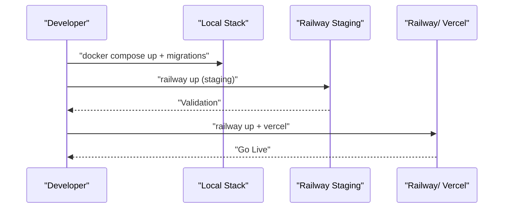

**Diagram sources**
- [README.md:61-101](file://README.md#L61-L101)
- [railway.toml:1-13](file://backend/railway.toml#L1-L13)

**Section sources**
- [README.md:61-101](file://README.md#L61-L101)
- [railway.toml:1-13](file://backend/railway.toml#L1-L13)

### Rollback Procedures
- Backend: Use Railway’s release history to roll back to the previous successful build.
- Frontend: Use Vercel’s project settings to revert to the prior stable version.
- Data: Ensure migrations are reversible or maintain safe fallbacks.

**Section sources**
- [README.md:179-203](file://README.md#L179-L203)

### Health Check Implementations
- Backend: Configure a health check path and timeout in Railway; Daphne serves the ASGI application.
- Infrastructure: Use docker-compose health checks for Postgres and Redis.

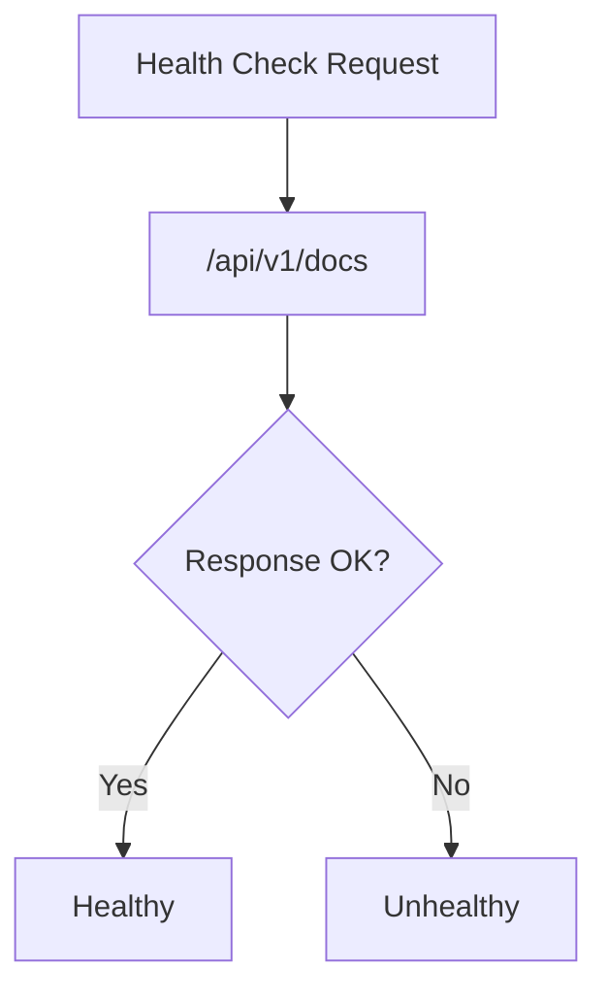

**Diagram sources**
- [railway.toml:6-7](file://backend/railway.toml#L6-L7)
- [docker-compose.yml:16-20](file://infrastructure/docker-compose.yml#L16-L20)

**Section sources**
- [railway.toml:6-7](file://backend/railway.toml#L6-L7)
- [docker-compose.yml:16-20](file://infrastructure/docker-compose.yml#L16-L20)

### Security Hardening and SSL/TLS
- Production settings enable SSL redirect, secure cookies, and HSTS.
- Use platform-managed certificates and enforce HTTPS.
- Restrict CORS origins and configure allowed hosts per environment.

**Section sources**
- [production.py:15-22](file://backend/config/settings/production.py#L15-L22)
- [base.py:166-173](file://backend/config/settings/base.py#L166-L173)

### Infrastructure Cost Optimization
- Right-size instances and replicas on Railway.
- Use managed services with autoscaling where applicable.
- Monitor resource utilization and adjust concurrency and replicas accordingly.
- Optimize CDN usage and database connections.

[No sources needed since this section provides general guidance]

## Dependency Analysis
- Backend runtime depends on Django, ASGI server, Celery, Redis, PostgreSQL, Meilisearch, and Cloudinary.
- Frontend depends on Next.js and external libraries; communicates with backend API.
- Supabase Edge Functions depend on Supabase configuration and database.

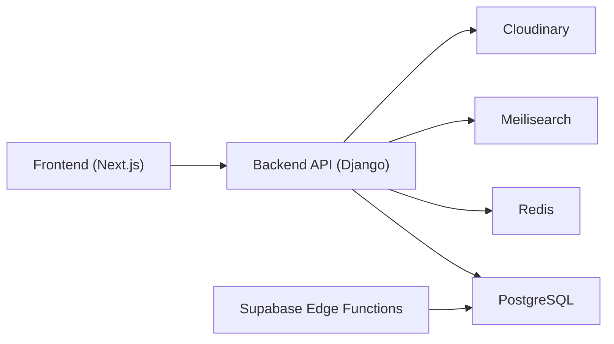

**Diagram sources**
- [requirements.txt:1-50](file://backend/requirements.txt#L1-L50)
- [package.json:1-89](file://package.json#L1-L89)
- [config.toml:1-17](file://supabase/config.toml#L1-L17)

**Section sources**
- [requirements.txt:1-50](file://backend/requirements.txt#L1-L50)
- [package.json:1-89](file://package.json#L1-L89)
- [config.toml:1-17](file://supabase/config.toml#L1-L17)

## Performance Considerations
- Use WhiteNoise for static files and compressed manifest storage.
- Tune Celery concurrency and scheduler for background tasks.
- Monitor Redis memory and eviction policies.
- Optimize Meilisearch indexing and query patterns.
- Use connection pooling and proper database indexes.

[No sources needed since this section provides general guidance]

## Troubleshooting Guide
Common deployment issues and resolutions:
- Health check failures: Verify the configured health check path and ensure the ASGI server responds.
- Database connectivity: Confirm DATABASE_URL and network access; check local docker-compose health checks.
- Redis connectivity: Validate REDIS_URL and health checks; ensure Celery can connect.
- CORS errors: Align CORS_ALLOWED_ORIGINS with frontend origin.
- Sentry errors: Confirm SENTRY_DSN and environment configuration.
- Supabase function permissions: Review JWT verification settings in Supabase config.

**Section sources**
- [railway.toml:6-7](file://backend/railway.toml#L6-L7)
- [base.py:100-173](file://backend/config/settings/base.py#L100-L173)
- [config.toml:1-17](file://supabase/config.toml#L1-L17)

## Conclusion
Empindu’s deployment model leverages Railway for backend scalability and Vercel for frontend performance, with a robust local development stack powered by docker-compose. By following the outlined environment management, CI/CD, migration, monitoring, security, and cost optimization practices, teams can reliably operate Empindu in production while maintaining flexibility for growth and change.

## Appendices
- Development quick start commands and environment variables are documented in the repository’s README.
- Django settings base, development, and production configurations provide a clear separation of concerns for environment-specific behavior.

**Section sources**
- [README.md:52-153](file://README.md#L52-L153)
- [base.py:1-287](file://backend/config/settings/base.py#L1-L287)
- [development.py:1-17](file://backend/config/settings/development.py#L1-L17)
- [production.py:1-33](file://backend/config/settings/production.py#L1-L33)