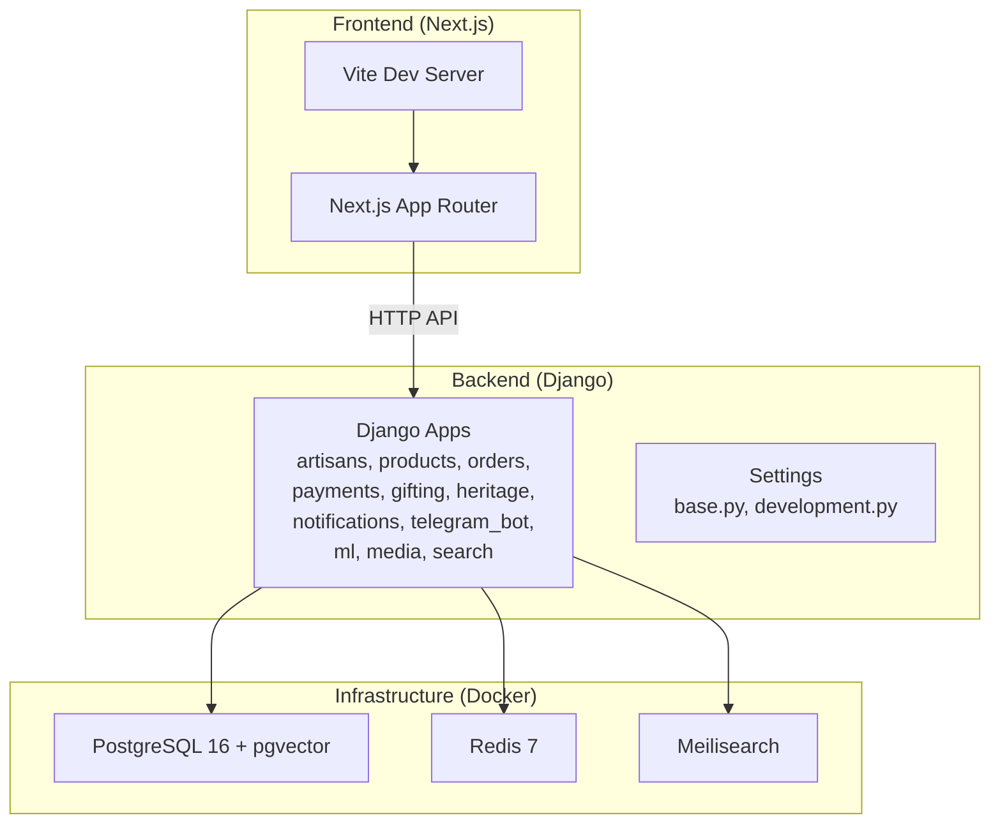
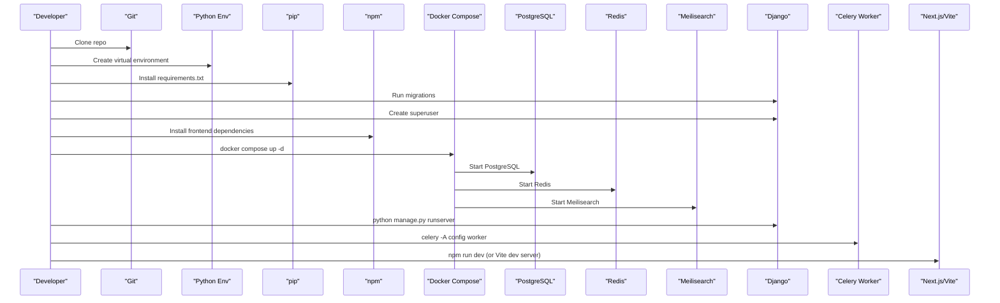
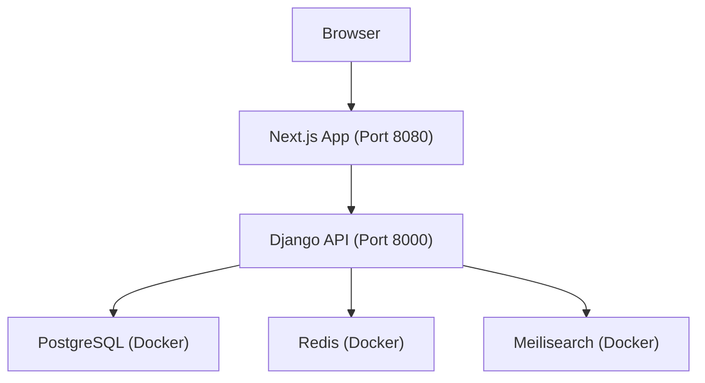

# Getting Started

<cite>
**Referenced Files in This Document**
- [README.md](file://README.md)
- [package.json](file://package.json)
- [backend/requirements.txt](file://backend/requirements.txt)
- [infrastructure/docker-compose.yml](file://infrastructure/docker-compose.yml)
- [backend/config/settings/base.py](file://backend/config/settings/base.py)
- [backend/config/settings/development.py](file://backend/config/settings/development.py)
- [backend/setup.ps1](file://backend/setup.ps1)
- [backend/.env.example](file://backend/.env.example)
- [vite.config.ts](file://vite.config.ts)
- [tailwind.config.ts](file://tailwind.config.ts)
- [tsconfig.json](file://tsconfig.json)
- [backend/Procfile](file://backend/Procfile)
</cite>

## Table of Contents
1. [Introduction](#introduction)
2. [Project Structure](#project-structure)
3. [Prerequisites](#prerequisites)
4. [Step-by-Step Setup](#step-by-step-setup)
5. [Environment Variables](#environment-variables)
6. [Development Workflow](#development-workflow)
7. [Access Points](#access-points)
8. [Verification Checklist](#verification-checklist)
9. [Troubleshooting Guide](#troubleshooting-guide)
10. [Architecture Overview](#architecture-overview)
11. [Conclusion](#conclusion)

## Introduction
This guide helps you set up a complete local development environment for Empindu, a Django-powered artisan marketplace with a modern frontend and integrated AI/ML capabilities. You will configure Python and Node.js environments, start supporting services with Docker, run database migrations, and launch the backend, frontend, and Celery worker.

## Project Structure
Empindu follows a monorepo layout:
- backend/: Django application with apps for artisans, products, orders, payments, gifting, heritage, notifications, telegram_bot, ml, media, and search.
- apps/web/: Next.js frontend (React) using the App Router.
- infrastructure/: Docker Compose services for PostgreSQL, Redis, and Meilisearch.
- supabase/: Supabase-related functions and migrations (used for payment processing integrations).

**Diagram sources**
- [backend/config/settings/base.py:100-121](file://backend/config/settings/base.py#L100-L121)
- [infrastructure/docker-compose.yml:4-47](file://infrastructure/docker-compose.yml#L4-L47)
- [vite.config.ts:7-18](file://vite.config.ts#L7-L18)

**Section sources**
- [README.md:17-50](file://README.md#L17-L50)

## Prerequisites
Install the following tools on your system:
- Python 3.11+ (for backend)
- Node.js 20+ (for frontend)
- Docker Desktop (to run supporting services)
- Railway CLI (optional, for backend deployment)

Notes:
- On Windows, you can also use the provided PowerShell script to automate backend setup.
- The frontend runs on a different port than the backend by default.

**Section sources**
- [README.md:54-60](file://README.md#L54-L60)
- [backend/setup.ps1:1-55](file://backend/setup.ps1#L1-L55)

## Step-by-Step Setup
Follow these steps to prepare your local environment:

1. Clone the repository and enter the project directory.
2. Backend setup:
   - Create and activate a Python virtual environment.
   - Install Python dependencies from requirements.txt.
   - Create a .env file from the example template and configure variables.
   - Run database migrations.
   - Create a Django superuser.
3. Frontend setup:
   - Install Node.js dependencies.
4. Infrastructure services:
   - Start Docker Compose services (PostgreSQL, Redis, Meilisearch).
5. Development servers:
   - Start the Django development server (port 8000).
   - Start the Next.js/Vite development server (port 8080).
   - Start the Celery worker (optional but recommended).

Windows-specific automation:
- Use the backend PowerShell script to automate virtual environment creation, dependency installation, migration, and superuser creation.

Unix-like systems:
- Use shell commands equivalent to the steps above.

**Section sources**
- [README.md:61-101](file://README.md#L61-L101)
- [backend/setup.ps1:9-54](file://backend/setup.ps1#L9-L54)

## Environment Variables
Create .env files in both backend and frontend directories.

Backend (.env):
- Django core: SECRET_KEY, DEBUG, ALLOWED_HOSTS
- Database: DATABASE_URL
- Cache/Queue: REDIS_URL
- Media: CLOUDINARY_* keys
- Payments: STRIPE_* keys
- Local payments: MTN_MOMO_* keys
- Bot: TELEGRAM_BOT_TOKEN, TELEGRAM_WEBHOOK_SECRET, SITE_URL
- AI/ML: OPENAI_API_KEY
- Optional: SENTRY_DSN (for production)

Frontend (.env):
- NEXT_PUBLIC_API_URL=http://localhost:8000/api/v1
- NEXT_PUBLIC_SITE_URL=http://localhost:8080

Notes:
- The frontend defaults to port 8080 in development (see vite.config.ts).
- Backend settings load from .env using django-environ.

**Section sources**
- [README.md:109-152](file://README.md#L109-L152)
- [backend/.env.example:1-40](file://backend/.env.example#L1-L40)
- [backend/config/settings/base.py:12-19](file://backend/config/settings/base.py#L12-L19)
- [vite.config.ts:8-11](file://vite.config.ts#L8-L11)

## Development Workflow
End-to-end workflow from clone to running servers:

**Diagram sources**
- [README.md:61-101](file://README.md#L61-L101)
- [infrastructure/docker-compose.yml:4-47](file://infrastructure/docker-compose.yml#L4-L47)
- [backend/requirements.txt:1-49](file://backend/requirements.txt#L1-L49)
- [backend/Procfile:1-4](file://backend/Procfile#L1-L4)

## Access Points
- Frontend: http://localhost:8080
- Backend API: http://localhost:8000/api/v1
- Django Admin: http://localhost:8000/admin
- Meilisearch: http://localhost:7700

Notes:
- The frontend development server runs on port 8080 by default (vite.config.ts).
- Backend API and Admin run on port 8000.

**Section sources**
- [README.md:103-107](file://README.md#L103-L107)
- [vite.config.ts:8-11](file://vite.config.ts#L8-L11)

## Verification Checklist
- Docker services are healthy:
  - PostgreSQL responds to health checks.
  - Redis responds to ping.
  - Meilisearch is reachable on port 7700.
- Database:
  - Migrations applied successfully.
  - Superuser created.
- Backend:
  - Django server starts on port 8000.
  - Settings loaded from .env (SECRET_KEY, DATABASE_URL, REDIS_URL).
- Frontend:
  - Node dependencies installed.
  - Vite dev server starts on port 8080.
- Celery:
  - Worker connects to Redis and processes tasks.

**Section sources**
- [infrastructure/docker-compose.yml:16-46](file://infrastructure/docker-compose.yml#L16-L46)
- [backend/config/settings/base.py:100-121](file://backend/config/settings/base.py#L100-L121)
- [backend/config/settings/development.py:7-16](file://backend/config/settings/development.py#L7-L16)
- [vite.config.ts:8-11](file://vite.config.ts#L8-L11)

## Troubleshooting Guide
Common issues and resolutions:

- Port conflicts
  - Frontend default port is 8080 (vite.config.ts). Change it if needed.
  - Backend default port is 8000 (Django runserver). Change via command-line argument if needed.
  - Docker services bind to 5432 (PostgreSQL), 6379 (Redis), 7700 (Meilisearch). Stop conflicting services or adjust docker-compose ports.

- Dependency problems
  - Python: Ensure Python 3.11+ is installed and virtual environment is activated before pip install.
  - Node.js: Ensure Node.js 20+ is installed and npm install succeeds.

- Database connectivity
  - Confirm DATABASE_URL matches Docker service credentials and port.
  - Verify migrations ran successfully after starting PostgreSQL.

- Redis connectivity
  - Ensure REDIS_URL points to the running Redis container.
  - Check Celery logs for connection errors.

- Meilisearch
  - Confirm MEILI_MASTER_KEY and MEILI_ENV are set in docker-compose.
  - Access http://localhost:7700 to verify service availability.

- CORS and origins
  - Configure CORS_ALLOWED_ORIGINS in backend settings to include frontend origin (default includes localhost:8080).

- Windows-specific
  - Use the backend PowerShell script to automate setup and avoid manual steps.

**Section sources**
- [vite.config.ts:8-11](file://vite.config.ts#L8-L11)
- [infrastructure/docker-compose.yml:12-46](file://infrastructure/docker-compose.yml#L12-L46)
- [backend/config/settings/base.py:160-167](file://backend/config/settings/base.py#L160-L167)
- [backend/setup.ps1:48-54](file://backend/setup.ps1#L48-L54)

## Architecture Overview
High-level runtime architecture during local development:

**Diagram sources**
- [README.md:3-15](file://README.md#L3-L15)
- [infrastructure/docker-compose.yml:4-47](file://infrastructure/docker-compose.yml#L4-L47)
- [vite.config.ts:8-11](file://vite.config.ts#L8-L11)

## Conclusion
You now have a fully configured local development environment for Empindu. With Docker services running, Django migrations applied, and both backend and frontend servers started, you can develop features, iterate quickly, and integrate with Meilisearch, Redis, and PostgreSQL. Refer to the verification checklist and troubleshooting guide to resolve common issues.