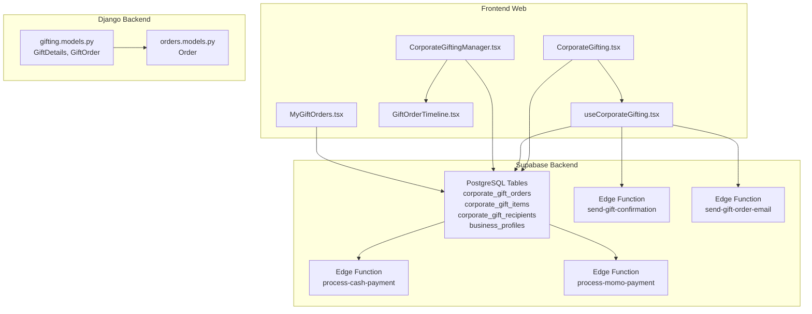
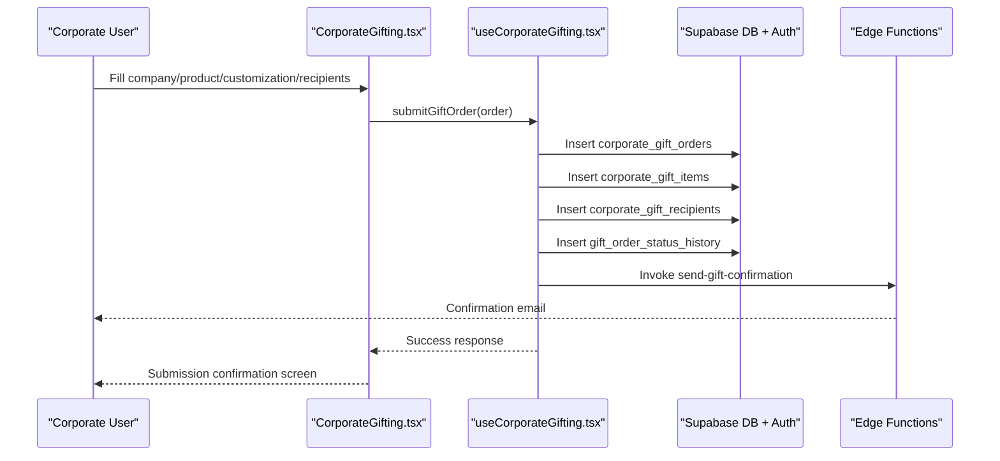
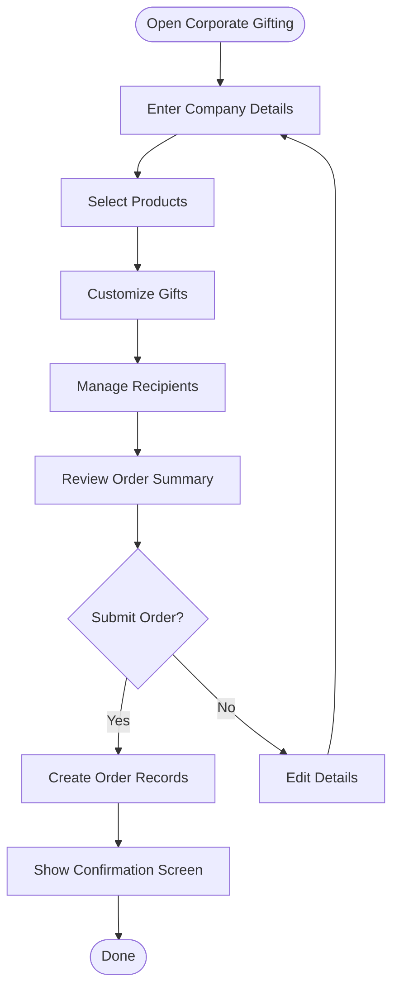
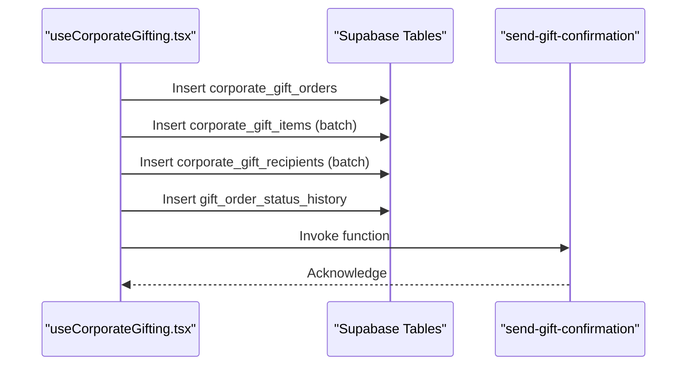
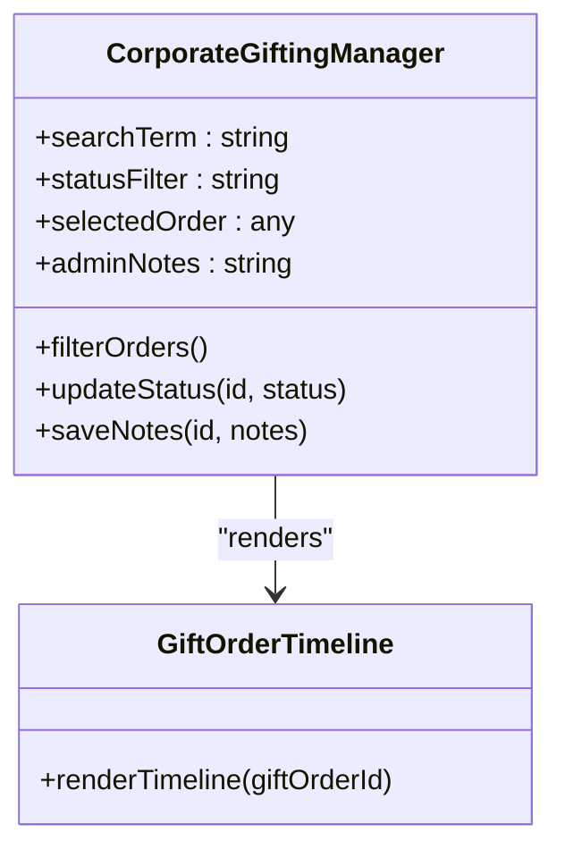
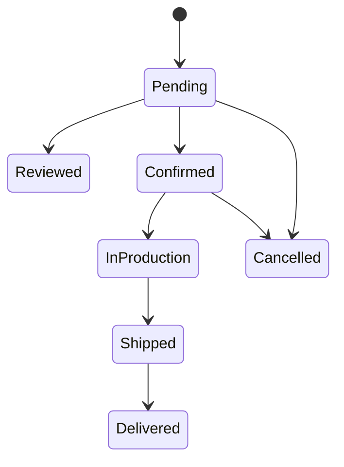
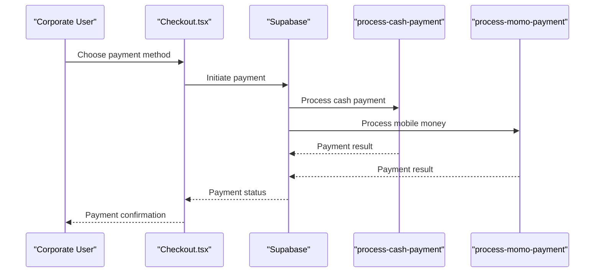
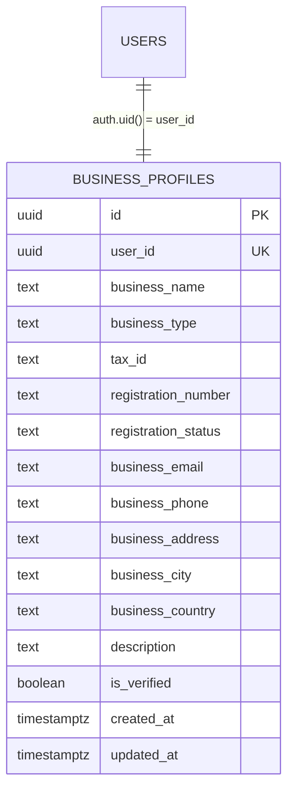
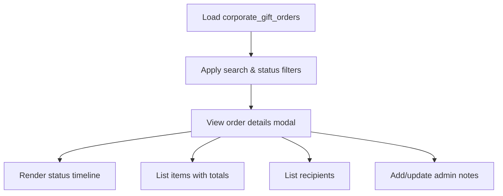
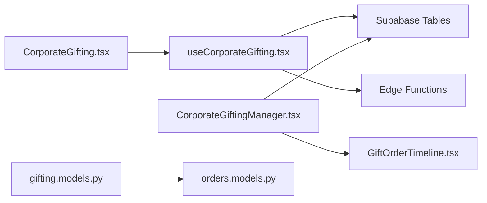

# Corporate Gifting

<cite>
**Referenced Files in This Document**
- [CorporateGifting.tsx](file://apps/web/src/pages/CorporateGifting.tsx)
- [useCorporateGifting.tsx](file://apps/web/src/hooks/useCorporateGifting.tsx)
- [CorporateGiftingManager.tsx](file://apps/web/src/components/admin/CorporateGiftingManager.tsx)
- [GiftOrderTimeline.tsx](file://apps/web/src/components/gifting/GiftOrderTimeline.tsx)
- [MyGiftOrders.tsx](file://apps/web/src/components/gifting/MyGiftOrders.tsx)
- [Checkout.tsx](file://apps/web/src/pages/Checkout.tsx)
- [business_profiles table migration](file://supabase/migrations/20260312151001_0ad1fffe-4364-4902-9212-6c6e1aeb1f08.sql)
- [send-gift-confirmation function](file://supabase/functions/send-gift-confirmation/index.ts)
- [send-gift-order-email function](file://supabase/functions/send-gift-order-email/index.ts)
- [process-cash-payment function](file://supabase/functions/process-cash-payment/index.ts)
- [process-momo-payment function](file://supabase/functions/process-momo-payment/index.ts)
- [gifting models.py](file://backend/apps/gifting/models.py)
- [orders models.py](file://backend/apps/orders/models.py)
</cite>

## Table of Contents
1. [Introduction](#introduction)
2. [Project Structure](#project-structure)
3. [Core Components](#core-components)
4. [Architecture Overview](#architecture-overview)
5. [Detailed Component Analysis](#detailed-component-analysis)
6. [Dependency Analysis](#dependency-analysis)
7. [Performance Considerations](#performance-considerations)
8. [Troubleshooting Guide](#troubleshooting-guide)
9. [Conclusion](#conclusion)
10. [Appendices](#appendices)

## Introduction
This document describes the corporate gifting system that enables bulk gift ordering and business-to-business functionality. It covers the corporate gifting portal interface, bulk order creation, team gift management, gift order aggregation, payment handling for corporate accounts, approval workflows, and the corporate gifting manager admin interface with order status management and reporting capabilities. It also documents corporate gift templates, bulk customization options, departmental ordering features, corporate account management, order volume discounts, seasonal corporate collections, and integration with business procurement systems.

## Project Structure
The corporate gifting system spans three primary areas:
- Frontend web application (React + TypeScript) with dedicated pages and admin components
- Supabase backend (PostgreSQL, Row Level Security, Supabase Auth, Edge Functions)
- Django backend (Python) with models for gift commerce and order lifecycle

**Diagram sources**
- [CorporateGifting.tsx:1-396](file://apps/web/src/pages/CorporateGifting.tsx#L1-L396)
- [useCorporateGifting.tsx:1-133](file://apps/web/src/hooks/useCorporateGifting.tsx#L1-L133)
- [CorporateGiftingManager.tsx:1-363](file://apps/web/src/components/admin/CorporateGiftingManager.tsx#L1-L363)
- [GiftOrderTimeline.tsx](file://apps/web/src/components/gifting/GiftOrderTimeline.tsx)
- [MyGiftOrders.tsx](file://apps/web/src/components/gifting/MyGiftOrders.tsx)
- [business_profiles table migration:2-20](file://supabase/migrations/20260312151001_0ad1fffe-4364-4902-9212-6c6e1aeb1f08.sql#L2-L20)
- [send-gift-confirmation function](file://supabase/functions/send-gift-confirmation/index.ts)
- [send-gift-order-email function](file://supabase/functions/send-gift-order-email/index.ts)
- [process-cash-payment function](file://supabase/functions/process-cash-payment/index.ts)
- [process-momo-payment function](file://supabase/functions/process-momo-payment/index.ts)
- [gifting models.py:1-67](file://backend/apps/gifting/models.py#L1-L67)
- [orders models.py:1-122](file://backend/apps/orders/models.py#L1-L122)

**Section sources**
- [CorporateGifting.tsx:1-396](file://apps/web/src/pages/CorporateGifting.tsx#L1-L396)
- [useCorporateGifting.tsx:1-133](file://apps/web/src/hooks/useCorporateGifting.tsx#L1-L133)
- [CorporateGiftingManager.tsx:1-363](file://apps/web/src/components/admin/CorporateGiftingManager.tsx#L1-L363)
- [business_profiles table migration:2-20](file://supabase/migrations/20260312151001_0ad1fffe-4364-4902-9212-6c6e1aeb1f08.sql#L2-L20)

## Core Components
- Corporate Gifting Portal: Multi-step form for company details, product selection, customization, and recipient management.
- Corporate Gifting Hook: Submits orders to Supabase, creates related items and recipients, logs status history, and triggers email notifications.
- Corporate Gifting Manager: Admin dashboard to filter, view, update order statuses, and manage order notes.
- Timeline Component: Visualizes order status history for transparency.
- Business Profiles: Corporate account management via business profiles with verification and role-based policies.
- Payment Integration: Edge functions for cash and mobile money payments; checkout page integrates with payment methods.
- Gift Commerce Models: Django models for gift-specific personalization and aggregated gift orders.
- Order Lifecycle Models: Django models for standard order lifecycle with gift flagging and financial snapshots.

**Section sources**
- [CorporateGifting.tsx:21-140](file://apps/web/src/pages/CorporateGifting.tsx#L21-L140)
- [useCorporateGifting.tsx:39-132](file://apps/web/src/hooks/useCorporateGifting.tsx#L39-L132)
- [CorporateGiftingManager.tsx:29-127](file://apps/web/src/components/admin/CorporateGiftingManager.tsx#L29-L127)
- [business_profiles table migration:2-20](file://supabase/migrations/20260312151001_0ad1fffe-4364-4902-9212-6c6e1aeb1f08.sql#L2-L20)
- [gifting models.py:9-67](file://backend/apps/gifting/models.py#L9-L67)
- [orders models.py:10-122](file://backend/apps/orders/models.py#L10-L122)

## Architecture Overview
The corporate gifting system follows a frontend-first architecture with Supabase as the primary backend and optional Django services for specialized gift commerce models.

**Diagram sources**
- [CorporateGifting.tsx:83-99](file://apps/web/src/pages/CorporateGifting.tsx#L83-L99)
- [useCorporateGifting.tsx:44-129](file://apps/web/src/hooks/useCorporateGifting.tsx#L44-L129)
- [send-gift-confirmation function](file://supabase/functions/send-gift-confirmation/index.ts)

**Section sources**
- [CorporateGifting.tsx:194-368](file://apps/web/src/pages/CorporateGifting.tsx#L194-L368)
- [useCorporateGifting.tsx:39-132](file://apps/web/src/hooks/useCorporateGifting.tsx#L39-L132)

## Detailed Component Analysis

### Corporate Gifting Portal Interface
The portal provides a guided four-step flow:
- Step 1: Company details (name, contact, occasion, budget range, preferred delivery date)
- Step 2: Product selection with availability checks, quantity adjustments, and optional personalization per item
- Step 3: Customization (gift message and branding/packaging notes)
- Step 4: Recipient management (add/remove recipients, contact info, delivery address, optional personal messages)
- Summary and submission with estimated total cost

**Diagram sources**
- [CorporateGifting.tsx:198-368](file://apps/web/src/pages/CorporateGifting.tsx#L198-L368)

**Section sources**
- [CorporateGifting.tsx:21-140](file://apps/web/src/pages/CorporateGifting.tsx#L21-L140)
- [CorporateGifting.tsx:198-368](file://apps/web/src/pages/CorporateGifting.tsx#L198-L368)

### Bulk Order Creation and Team Gift Management
Bulk order creation is handled by the corporate gifting hook:
- Creates a single order record with company and contact details
- Inserts multiple items with quantities and personalization
- Inserts multiple recipients with contact and delivery details
- Logs initial status as pending in status history
- Sends confirmation email via Supabase Edge Function

**Diagram sources**
- [useCorporateGifting.tsx:53-118](file://apps/web/src/hooks/useCorporateGifting.tsx#L53-L118)

**Section sources**
- [useCorporateGifting.tsx:39-132](file://apps/web/src/hooks/useCorporateGifting.tsx#L39-L132)

### Corporate Gifting Manager Admin Interface
The admin interface allows filtering orders by company/contact/order ID and status, viewing order details, updating status, adding admin notes, and reviewing status timelines.

**Diagram sources**
- [CorporateGiftingManager.tsx:29-127](file://apps/web/src/components/admin/CorporateGiftingManager.tsx#L29-L127)
- [GiftOrderTimeline.tsx](file://apps/web/src/components/gifting/GiftOrderTimeline.tsx)

**Section sources**
- [CorporateGiftingManager.tsx:29-127](file://apps/web/src/components/admin/CorporateGiftingManager.tsx#L29-L127)
- [CorporateGiftingManager.tsx:176-354](file://apps/web/src/components/admin/CorporateGiftingManager.tsx#L176-L354)

### Gift Order Aggregation and Approval Workflows
Aggregation occurs at the Supabase level with separate tables for orders, items, and recipients. Approval workflows are managed via status transitions:
- Initial status: pending
- Review and confirmation steps handled by admin updates
- Status history logging ensures auditability

**Diagram sources**
- [CorporateGiftingManager.tsx:17-27](file://apps/web/src/components/admin/CorporateGiftingManager.tsx#L17-L27)
- [useCorporateGifting.tsx:108-113](file://apps/web/src/hooks/useCorporateGifting.tsx#L108-L113)

**Section sources**
- [CorporateGiftingManager.tsx:17-27](file://apps/web/src/components/admin/CorporateGiftingManager.tsx#L17-L27)
- [useCorporateGifting.tsx:108-113](file://apps/web/src/hooks/useCorporateGifting.tsx#L108-L113)

### Payment Handling for Corporate Accounts
Payment integration leverages Supabase Edge Functions for cash and mobile money processing. The checkout page integrates with payment methods and links to payment processing functions.

**Diagram sources**
- [Checkout.tsx](file://apps/web/src/pages/Checkout.tsx)
- [process-cash-payment function](file://supabase/functions/process-cash-payment/index.ts)
- [process-momo-payment function](file://supabase/functions/process-momo-payment/index.ts)

**Section sources**
- [Checkout.tsx](file://apps/web/src/pages/Checkout.tsx)
- [process-cash-payment function](file://supabase/functions/process-cash-payment/index.ts)
- [process-momo-payment function](file://supabase/functions/process-momo-payment/index.ts)

### Corporate Account Management
Corporate account management is supported via the business_profiles table with Row Level Security policies enabling:
- Users can view and update their own business profile
- Artisans can insert/update business profiles when authenticated
- Admins can manage all business profiles
- Verified profiles are publicly visible

**Diagram sources**
- [business_profiles table migration:2-20](file://supabase/migrations/20260312151001_0ad1fffe-4364-4902-9212-6c6e1aeb1f08.sql#L2-L20)

**Section sources**
- [business_profiles table migration:2-20](file://supabase/migrations/20260312151001_0ad1fffe-4364-4902-9212-6c6e1aeb1f08.sql#L2-L20)

### Reporting Capabilities
The admin interface provides:
- Filterable order listing with search and status filters
- Detailed order view with items, recipients, and status timeline
- Estimated total calculation across items
- Admin notes for internal tracking

**Diagram sources**
- [CorporateGiftingManager.tsx:36-127](file://apps/web/src/components/admin/CorporateGiftingManager.tsx#L36-L127)
- [CorporateGiftingManager.tsx:207-350](file://apps/web/src/components/admin/CorporateGiftingManager.tsx#L207-L350)

**Section sources**
- [CorporateGiftingManager.tsx:115-122](file://apps/web/src/components/admin/CorporateGiftingManager.tsx#L115-L122)
- [CorporateGiftingManager.tsx:207-350](file://apps/web/src/components/admin/CorporateGiftingManager.tsx#L207-L350)

### Corporate Gift Templates and Bulk Customization
- Gift templates: Predefined combinations of products can be suggested in the product selection step.
- Bulk customization: Optional personalization per item and global gift message/branding notes.
- Departmental ordering: Recipients can be added iteratively; each can have individual personal messages and delivery addresses.

**Section sources**
- [CorporateGifting.tsx:232-311](file://apps/web/src/pages/CorporateGifting.tsx#L232-L311)
- [CorporateGifting.tsx:313-366](file://apps/web/src/pages/CorporateGifting.tsx#L313-L366)

### Order Volume Discounts and Seasonal Collections
- Volume discounts: Can be applied during order review or via admin adjustments; reflected in final pricing communicated to clients.
- Seasonal collections: Products can be tagged and filtered; occasions can be selected to align with seasonal themes.

**Section sources**
- [CorporateGifting.tsx:18-19](file://apps/web/src/pages/CorporateGifting.tsx#L18-L19)
- [CorporateGifting.tsx:232-287](file://apps/web/src/pages/CorporateGifting.tsx#L232-L287)

### Integration with Business Procurement Systems
- Business profiles support corporate registration and verification.
- Order status updates can trigger email notifications to procurement contacts.
- Admin notes enable internal coordination with procurement stakeholders.

**Section sources**
- [business_profiles table migration:2-20](file://supabase/migrations/20260312151001_0ad1fffe-4364-4902-9212-6c6e1aeb1f08.sql#L2-L20)
- [CorporateGiftingManager.tsx:96-105](file://apps/web/src/components/admin/CorporateGiftingManager.tsx#L96-L105)

## Dependency Analysis
The system exhibits clear separation of concerns:
- Frontend components depend on Supabase for data persistence and authentication
- Supabase Edge Functions encapsulate email notifications and payment processing
- Django models provide gift-specific domain logic and order lifecycle semantics

**Diagram sources**
- [CorporateGifting.tsx:1-396](file://apps/web/src/pages/CorporateGifting.tsx#L1-L396)
- [useCorporateGifting.tsx:1-133](file://apps/web/src/hooks/useCorporateGifting.tsx#L1-L133)
- [CorporateGiftingManager.tsx:1-363](file://apps/web/src/components/admin/CorporateGiftingManager.tsx#L1-L363)
- [GiftOrderTimeline.tsx](file://apps/web/src/components/gifting/GiftOrderTimeline.tsx)
- [gifting models.py:1-67](file://backend/apps/gifting/models.py#L1-L67)
- [orders models.py:1-122](file://backend/apps/orders/models.py#L1-L122)

**Section sources**
- [CorporateGifting.tsx:1-396](file://apps/web/src/pages/CorporateGifting.tsx#L1-L396)
- [useCorporateGifting.tsx:1-133](file://apps/web/src/hooks/useCorporateGifting.tsx#L1-L133)
- [CorporateGiftingManager.tsx:1-363](file://apps/web/src/components/admin/CorporateGiftingManager.tsx#L1-L363)
- [gifting models.py:1-67](file://backend/apps/gifting/models.py#L1-L67)
- [orders models.py:1-122](file://backend/apps/orders/models.py#L1-L122)

## Performance Considerations
- Minimize redundant queries: Batch inserts for items and recipients reduce round-trips.
- Pagination and filtering: Use server-side filtering and search to limit payload sizes.
- Debounce user inputs: Avoid excessive re-renders during bulk recipient management.
- Edge Functions: Offload email sending to minimize frontend latency.
- RLS policies: Keep policies efficient to avoid query slowdowns.

## Troubleshooting Guide
Common issues and resolutions:
- Authentication errors when submitting orders: Ensure user is signed in before accessing the portal.
- Order submission failures: Check network connectivity and Supabase function invocations; inspect toast notifications for error messages.
- Missing email confirmations: Verify Edge Function permissions and logs; retry invoking the function manually.
- Status update failures: Confirm admin privileges and that the status transition is valid.
- Recipient or item missing in admin view: Ensure the order has been fully created and the selected order ID is correct.

**Section sources**
- [useCorporateGifting.tsx:44-48](file://apps/web/src/hooks/useCorporateGifting.tsx#L44-L48)
- [useCorporateGifting.tsx:122-128](file://apps/web/src/hooks/useCorporateGifting.tsx#L122-L128)
- [CorporateGiftingManager.tsx:107-113](file://apps/web/src/components/admin/CorporateGiftingManager.tsx#L107-L113)

## Conclusion
The corporate gifting system provides a robust, scalable solution for bulk gift ordering with comprehensive admin controls, flexible customization, and integrated payment processing. Its modular architecture supports future enhancements such as advanced discount tiers, seasonal promotions, and deeper procurement system integrations.

## Appendices
- Additional admin components (AnalyticsDashboard, OrdersManager, ProductsManager) complement the corporate gifting workflow by offering broader operational insights and controls.