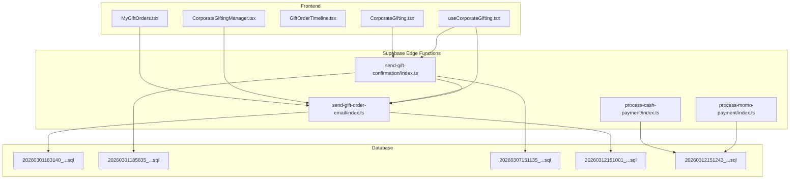
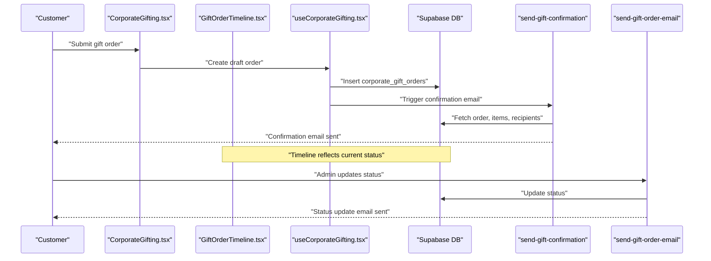
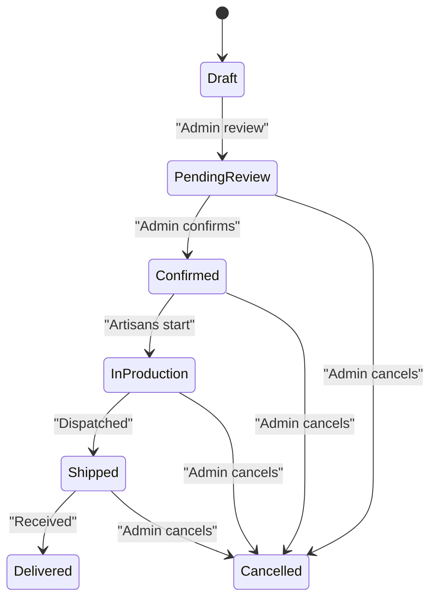
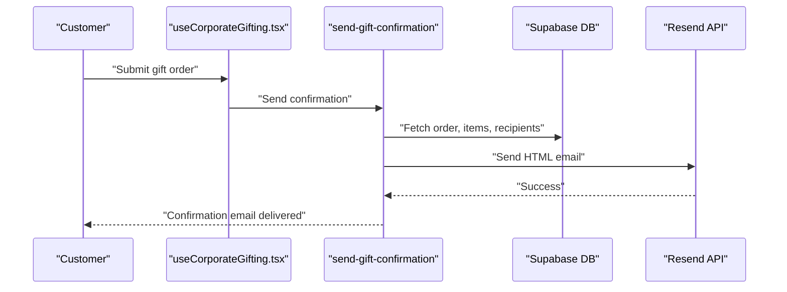
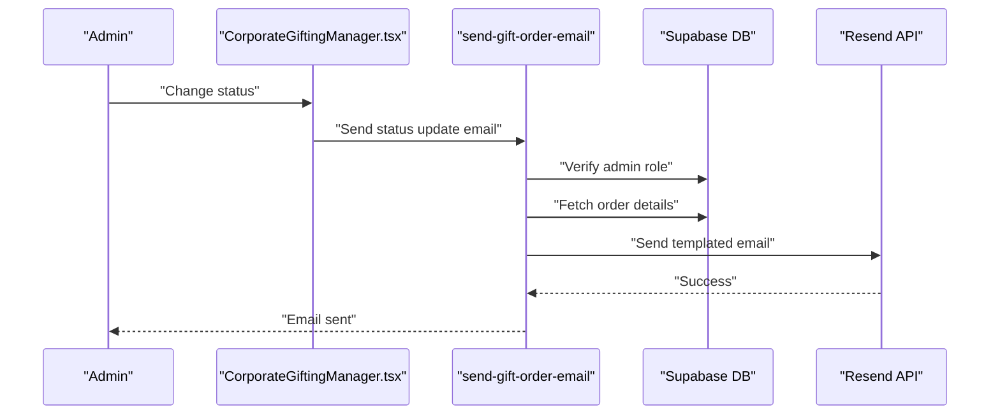
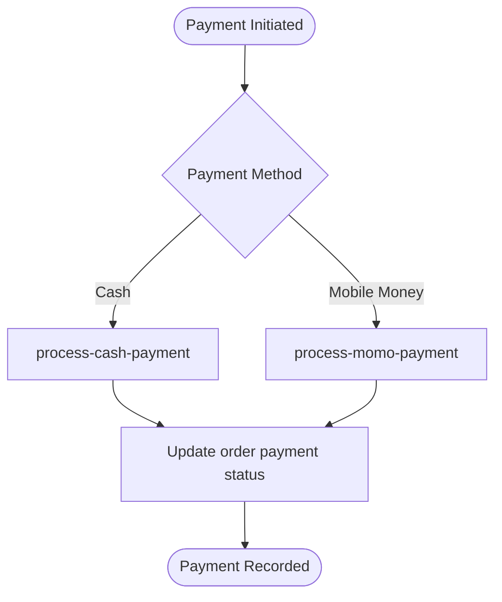
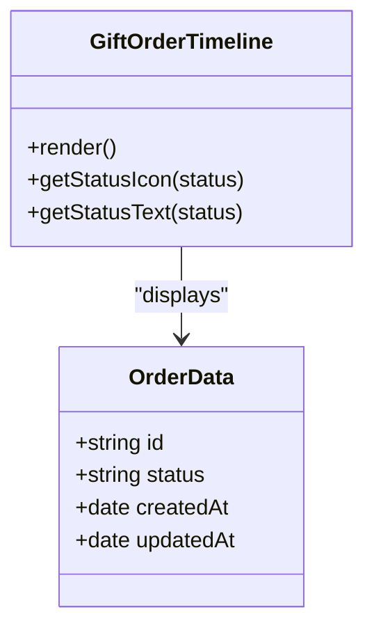
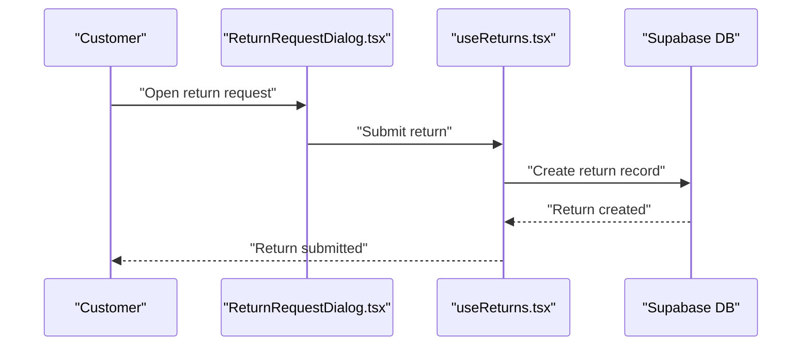
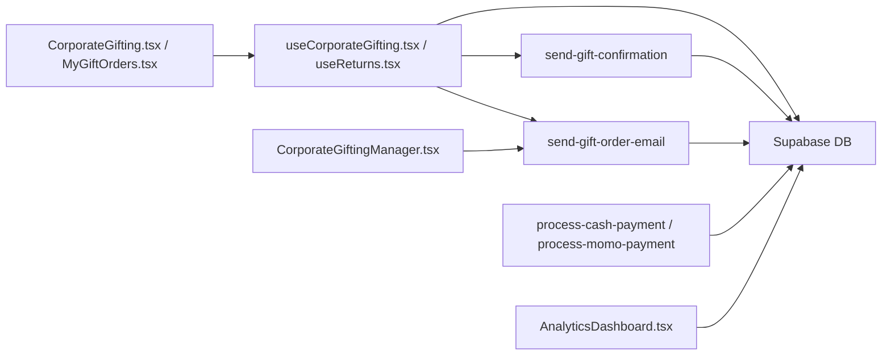

# Gift Order Workflow

<cite>
**Referenced Files in This Document**
- [send-gift-confirmation/index.ts](file://supabase/functions/send-gift-confirmation/index.ts)
- [send-gift-order-email/index.ts](file://supabase/functions/send-gift-order-email/index.ts)
- [process-cash-payment/index.ts](file://supabase/functions/process-cash-payment/index.ts)
- [process-momo-payment/index.ts](file://supabase/functions/process-momo-payment/index.ts)
- [GiftOrderTimeline.tsx](file://src/components/gifting/GiftOrderTimeline.tsx)
- [MyGiftOrders.tsx](file://src/components/gifting/MyGiftOrders.tsx)
- [CorporateGifting.tsx](file://src/pages/CorporateGifting.tsx)
- [CorporateGiftingManager.tsx](file://src/components/admin/CorporateGiftingManager.tsx)
- [useCorporateGifting.tsx](file://src/hooks/useCorporateGifting.tsx)
- [useReturns.tsx](file://src/hooks/useReturns.tsx)
- [ReturnRequestDialog.tsx](file://src/components/orders/ReturnRequestDialog.tsx)
- [AnalyticsDashboard.tsx](file://src/components/admin/AnalyticsDashboard.tsx)
- [20260301183140_74b1e32e-ded4-4234-9c49-76542f291b2d.sql](file://supabase/migrations/20260301183140_74b1e32e-ded4-4234-9c49-76542f291b2d.sql)
- [20260301185835_24e7e596-6ffe-4991-964c-74e173d7213e.sql](file://supabase/migrations/20260301185835_24e7e596-6ffe-4991-964c-74e173d7213e.sql)
- [20260307151135_abb92613-d0a4-4ab6-8384-d241b138020b.sql](file://supabase/migrations/20260307151135_abb92613-d0a4-4ab6-8384-d241b138020b.sql)
- [20260312151001_0ad1fffe-4364-4902-9212-6c6e1aeb1f08.sql](file://supabase/migrations/20260312151001_0ad1fffe-4364-4902-9212-6c6e1aeb1f08.sql)
- [20260312151243_54077459-7217-4c42-a35e-67af66d898f3.sql](file://supabase/migrations/20260312151243_54077459-7217-4c42-a35e-67af66d898f3.sql)
</cite>

## Table of Contents
1. [Introduction](#introduction)
2. [Project Structure](#project-structure)
3. [Core Components](#core-components)
4. [Architecture Overview](#architecture-overview)
5. [Detailed Component Analysis](#detailed-component-analysis)
6. [Dependency Analysis](#dependency-analysis)
7. [Performance Considerations](#performance-considerations)
8. [Troubleshooting Guide](#troubleshooting-guide)
9. [Conclusion](#conclusion)
10. [Appendices](#appendices)

## Introduction
This document describes the complete gift order lifecycle and workflow management for corporate gifting. It covers order states from draft through completion, payment processing, fulfillment stages, automated status updates, notifications, order tracking, delivery coordination, return/cancellation policies, modifications, customer service workflows, and analytics/reporting. The system integrates frontend components with Supabase Edge Functions for email/SMS notifications and payment processing.

## Project Structure
The gift order workflow spans three primary areas:
- Frontend React components for customer and admin experiences
- Supabase Edge Functions for serverless orchestration (email/SMS, payment processing)
- Database schema via migrations supporting corporate gift orders, items, recipients, and statuses

**Diagram sources**
- [CorporateGifting.tsx](file://src/pages/CorporateGifting.tsx)
- [MyGiftOrders.tsx](file://src/components/gifting/MyGiftOrders.tsx)
- [GiftOrderTimeline.tsx](file://src/components/gifting/GiftOrderTimeline.tsx)
- [CorporateGiftingManager.tsx](file://src/components/admin/CorporateGiftingManager.tsx)
- [useCorporateGifting.tsx](file://src/hooks/useCorporateGifting.tsx)
- [send-gift-confirmation/index.ts](file://supabase/functions/send-gift-confirmation/index.ts)
- [send-gift-order-email/index.ts](file://supabase/functions/send-gift-order-email/index.ts)
- [process-cash-payment/index.ts](file://supabase/functions/process-cash-payment/index.ts)
- [process-momo-payment/index.ts](file://supabase/functions/process-momo-payment/index.ts)
- [20260301183140_74b1e32e-ded4-4234-9c49-76542f291b2d.sql](file://supabase/migrations/20260301183140_74b1e32e-ded4-4234-9c49-76542f291b2d.sql)
- [20260301185835_24e7e596-6ffe-4991-964c-74e173d7213e.sql](file://supabase/migrations/20260301185835_24e7e596-6ffe-4991-964c-74e173d7213e.sql)
- [20260307151135_abb92613-d0a4-4ab6-8384-d241b138020b.sql](file://supabase/migrations/20260307151135_abb92613-d0a4-4ab6-8384-d241b138020b.sql)
- [20260312151001_0ad1fffe-4364-4902-9212-6c6e1aeb1f08.sql](file://supabase/migrations/20260312151001_0ad1fffe-4364-4902-9212-6c6e1aeb1f08.sql)
- [20260312151243_54077459-7217-4c42-a35e-67af66d898f3.sql](file://supabase/migrations/20260312151243_54077459-7217-4c42-a35e-67af66d898f3.sql)

**Section sources**
- [CorporateGifting.tsx](file://src/pages/CorporateGifting.tsx)
- [MyGiftOrders.tsx](file://src/components/gifting/MyGiftOrders.tsx)
- [GiftOrderTimeline.tsx](file://src/components/gifting/GiftOrderTimeline.tsx)
- [CorporateGiftingManager.tsx](file://src/components/admin/CorporateGiftingManager.tsx)
- [useCorporateGifting.tsx](file://src/hooks/useCorporateGifting.tsx)
- [send-gift-confirmation/index.ts](file://supabase/functions/send-gift-confirmation/index.ts)
- [send-gift-order-email/index.ts](file://supabase/functions/send-gift-order-email/index.ts)
- [process-cash-payment/index.ts](file://supabase/functions/process-cash-payment/index.ts)
- [process-momo-payment/index.ts](file://supabase/functions/process-momo-payment/index.ts)
- [20260301183140_74b1e32e-ded4-4234-9c49-76542f291b2d.sql](file://supabase/migrations/20260301183140_74b1e32e-ded4-4234-9c49-76542f291b2d.sql)
- [20260301185835_24e7e596-6ffe-4991-964c-74e173d7213e.sql](file://supabase/migrations/20260301185835_24e7e596-6ffe-4991-964c-74e173d7213e.sql)
- [20260307151135_abb92613-d0a4-4ab6-8384-d241b138020b.sql](file://supabase/migrations/20260307151135_abb92613-d0a4-4ab6-8384-d241b138020b.sql)
- [20260312151001_0ad1fffe-4364-4902-9212-6c6e1aeb1f08.sql](file://supabase/migrations/20260312151001_0ad1fffe-4364-4902-9212-6c6e1aeb1f08.sql)
- [20260312151243_54077459-7217-4c42-a35e-67af66d898f3.sql](file://supabase/migrations/20260312151243_54077459-7217-4c42-a35e-67af66d898f3.sql)

## Core Components
- Corporate gift order model and related entities are defined in database migrations.
- Frontend pages and components render the gift ordering experience, timelines, and admin management.
- Edge Functions handle gift confirmation emails, status update emails, and payment processing for cash and mobile money.

Key capabilities:
- Draft-to-completion lifecycle with explicit status transitions
- Automated email notifications triggered by status changes
- Payment processing via cash and mobile money functions
- Order tracking and visibility for customers and admins
- Return request flow integrated with return dialogs and hooks

**Section sources**
- [CorporateGifting.tsx](file://src/pages/CorporateGifting.tsx)
- [MyGiftOrders.tsx](file://src/components/gifting/MyGiftOrders.tsx)
- [GiftOrderTimeline.tsx](file://src/components/gifting/GiftOrderTimeline.tsx)
- [CorporateGiftingManager.tsx](file://src/components/admin/CorporateGiftingManager.tsx)
- [useCorporateGifting.tsx](file://src/hooks/useCorporateGifting.tsx)
- [useReturns.tsx](file://src/hooks/useReturns.tsx)
- [ReturnRequestDialog.tsx](file://src/components/orders/ReturnRequestDialog.tsx)
- [send-gift-confirmation/index.ts](file://supabase/functions/send-gift-confirmation/index.ts)
- [send-gift-order-email/index.ts](file://supabase/functions/send-gift-order-email/index.ts)
- [process-cash-payment/index.ts](file://supabase/functions/process-cash-payment/index.ts)
- [process-momo-payment/index.ts](file://supabase/functions/process-momo-payment/index.ts)

## Architecture Overview
The gift order workflow is orchestrated by Supabase Edge Functions and React components. The frontend interacts with Supabase for data and invokes Edge Functions for actions like sending confirmation emails and updating order status. Payments are processed through dedicated functions that update order records accordingly.

**Diagram sources**
- [CorporateGifting.tsx](file://src/pages/CorporateGifting.tsx)
- [GiftOrderTimeline.tsx](file://src/components/gifting/GiftOrderTimeline.tsx)
- [useCorporateGifting.tsx](file://src/hooks/useCorporateGifting.tsx)
- [send-gift-confirmation/index.ts](file://supabase/functions/send-gift-confirmation/index.ts)
- [send-gift-order-email/index.ts](file://supabase/functions/send-gift-order-email/index.ts)

## Detailed Component Analysis

### Gift Order States and Lifecycle
The lifecycle progresses through distinct states managed by the system:
- Draft: Initial submission by the customer
- Pending Review: Awaiting administrative review
- Confirmed: Administrative confirmation
- In Production: Artisans are crafting the gifts
- Shipped: Order dispatched
- Delivered: Recipients received the gifts
- Cancelled: Order terminated

Automated status updates trigger email notifications to the customer. The admin manager page allows changing states and sending status emails.

**Section sources**
- [send-gift-order-email/index.ts](file://supabase/functions/send-gift-order-email/index.ts)
- [CorporateGiftingManager.tsx](file://src/components/admin/CorporateGiftingManager.tsx)

### Gift Confirmation System
On successful order submission, the system sends a confirmation email summarizing the order details, items, recipients, and estimated total. Ownership verification ensures only the order owner receives the email.

**Diagram sources**
- [useCorporateGifting.tsx](file://src/hooks/useCorporateGifting.tsx)
- [send-gift-confirmation/index.ts](file://supabase/functions/send-gift-confirmation/index.ts)

**Section sources**
- [send-gift-confirmation/index.ts](file://supabase/functions/send-gift-confirmation/index.ts)
- [useCorporateGifting.tsx](file://src/hooks/useCorporateGifting.tsx)

### Status Update Notifications
Administrators can update order status and trigger automated emails. The email function validates admin role, fetches order details, builds a templated email, and sends it via Resend.

**Diagram sources**
- [CorporateGiftingManager.tsx](file://src/components/admin/CorporateGiftingManager.tsx)
- [send-gift-order-email/index.ts](file://supabase/functions/send-gift-order-email/index.ts)

**Section sources**
- [send-gift-order-email/index.ts](file://supabase/functions/send-gift-order-email/index.ts)
- [CorporateGiftingManager.tsx](file://src/components/admin/CorporateGiftingManager.tsx)

### Payment Processing
Two payment methods are supported:
- Cash payment: Processes cash payments and updates order records
- Mobile Money (MOMO): Processes mobile money payments and updates order records

Both functions integrate with Supabase to update order status and payment metadata.

**Diagram sources**
- [process-cash-payment/index.ts](file://supabase/functions/process-cash-payment/index.ts)
- [process-momo-payment/index.ts](file://supabase/functions/process-momo-payment/index.ts)

**Section sources**
- [process-cash-payment/index.ts](file://supabase/functions/process-cash-payment/index.ts)
- [process-momo-payment/index.ts](file://supabase/functions/process-momo-payment/index.ts)

### Gift Order Timeline Component
The timeline component visualizes the progression of a gift order, reflecting current status and relevant dates. It integrates with the order data to show milestones such as pending review, confirmation, production, shipping, and delivery.

**Diagram sources**
- [GiftOrderTimeline.tsx](file://src/components/gifting/GiftOrderTimeline.tsx)

**Section sources**
- [GiftOrderTimeline.tsx](file://src/components/gifting/GiftOrderTimeline.tsx)

### Order Tracking and Delivery Coordination
Customers can view their gift orders and track progress through the timeline. Admins coordinate delivery by updating statuses and sending notifications. Recipients' details are stored to support delivery coordination.

**Section sources**
- [MyGiftOrders.tsx](file://src/components/gifting/MyGiftOrders.tsx)
- [CorporateGiftingManager.tsx](file://src/components/admin/CorporateGiftingManager.tsx)

### Returns and Cancellations
Return requests are handled via a dedicated dialog and hook. While cancellation follows the standard status change flow, returns are initiated through the returns interface and tracked separately.

**Diagram sources**
- [ReturnRequestDialog.tsx](file://src/components/orders/ReturnRequestDialog.tsx)
- [useReturns.tsx](file://src/hooks/useReturns.tsx)

**Section sources**
- [ReturnRequestDialog.tsx](file://src/components/orders/ReturnRequestDialog.tsx)
- [useReturns.tsx](file://src/hooks/useReturns.tsx)

### Modifications and Customer Service Workflows
Customers can manage orders through the corporate gifting page and view history via the orders component. Admins use the corporate gifting manager to modify statuses, communicate updates, and coordinate fulfillment.

**Section sources**
- [CorporateGifting.tsx](file://src/pages/CorporateGifting.tsx)
- [MyGiftOrders.tsx](file://src/components/gifting/MyGiftOrders.tsx)
- [CorporateGiftingManager.tsx](file://src/components/admin/CorporateGiftingManager.tsx)

### Analytics and Reporting
Admins can monitor gift commerce performance using the analytics dashboard, which aggregates key metrics derived from the gift order data.

**Section sources**
- [AnalyticsDashboard.tsx](file://src/components/admin/AnalyticsDashboard.tsx)

## Dependency Analysis
The gift order workflow depends on:
- Supabase Edge Functions for email/SMS orchestration and payment processing
- React components for customer and admin interactions
- Database migrations defining the schema for corporate gift orders, items, and recipients

**Diagram sources**
- [CorporateGifting.tsx](file://src/pages/CorporateGifting.tsx)
- [MyGiftOrders.tsx](file://src/components/gifting/MyGiftOrders.tsx)
- [useCorporateGifting.tsx](file://src/hooks/useCorporateGifting.tsx)
- [useReturns.tsx](file://src/hooks/useReturns.tsx)
- [send-gift-confirmation/index.ts](file://supabase/functions/send-gift-confirmation/index.ts)
- [send-gift-order-email/index.ts](file://supabase/functions/send-gift-order-email/index.ts)
- [process-cash-payment/index.ts](file://supabase/functions/process-cash-payment/index.ts)
- [process-momo-payment/index.ts](file://supabase/functions/process-momo-payment/index.ts)
- [CorporateGiftingManager.tsx](file://src/components/admin/CorporateGiftingManager.tsx)
- [AnalyticsDashboard.tsx](file://src/components/admin/AnalyticsDashboard.tsx)

**Section sources**
- [CorporateGifting.tsx](file://src/pages/CorporateGifting.tsx)
- [MyGiftOrders.tsx](file://src/components/gifting/MyGiftOrders.tsx)
- [useCorporateGifting.tsx](file://src/hooks/useCorporateGifting.tsx)
- [useReturns.tsx](file://src/hooks/useReturns.tsx)
- [send-gift-confirmation/index.ts](file://supabase/functions/send-gift-confirmation/index.ts)
- [send-gift-order-email/index.ts](file://supabase/functions/send-gift-order-email/index.ts)
- [process-cash-payment/index.ts](file://supabase/functions/process-cash-payment/index.ts)
- [process-momo-payment/index.ts](file://supabase/functions/process-momo-payment/index.ts)
- [CorporateGiftingManager.tsx](file://src/components/admin/CorporateGiftingManager.tsx)
- [AnalyticsDashboard.tsx](file://src/components/admin/AnalyticsDashboard.tsx)

## Performance Considerations
- Minimize repeated database queries by batching reads for items and recipients during confirmation and status update emails.
- Cache frequently accessed product names and recipient lists where appropriate to reduce latency.
- Use serverless function cold-start mitigation by keeping functions small and avoiding heavy initialization.
- Monitor Resend API response times and implement retry/backoff strategies for transient failures.
- Optimize frontend rendering by virtualizing long lists in the timeline and orders components.

## Troubleshooting Guide
Common issues and resolutions:
- Missing authorization header in Edge Functions: Ensure clients pass a valid bearer token; functions return unauthorized errors when missing.
- Ownership verification failures: Confirmation emails are restricted to the order owner; verify user identity claims.
- Admin role validation: Status update emails require admin privileges; verify user roles via RPC.
- Email delivery failures: Inspect Resend API responses and logs; handle non-2xx responses gracefully.
- Payment processing errors: Validate payment metadata and ensure functions are invoked with correct parameters.

**Section sources**
- [send-gift-confirmation/index.ts](file://supabase/functions/send-gift-confirmation/index.ts)
- [send-gift-order-email/index.ts](file://supabase/functions/send-gift-order-email/index.ts)

## Conclusion
The gift order workflow integrates frontend components with Supabase Edge Functions to deliver a seamless corporate gifting experience. From draft creation to delivery and returns, the system automates notifications, supports multiple payment methods, and provides admin oversight through a dedicated manager and analytics dashboard.

## Appendices

### Database Schema Highlights
- Corporate gift orders, items, and recipients are modeled in migrations supporting the full lifecycle.
- Status enums and timestamps enable robust tracking and reporting.
- Relationships between orders, items, and recipients facilitate accurate notifications and fulfillment.

**Section sources**
- [20260301183140_74b1e32e-ded4-4234-9c49-76542f291b2d.sql](file://supabase/migrations/20260301183140_74b1e32e-ded4-4234-9c49-76542f291b2d.sql)
- [20260301185835_24e7e596-6ffe-4991-964c-74e173d7213e.sql](file://supabase/migrations/20260301185835_24e7e596-6ffe-4991-964c-74e173d7213e.sql)
- [20260307151135_abb92613-d0a4-4ab6-8384-d241b138020b.sql](file://supabase/migrations/20260307151135_abb92613-d0a4-4ab6-8384-d241b138020b.sql)
- [20260312151001_0ad1fffe-4364-4902-9212-6c6e1aeb1f08.sql](file://supabase/migrations/20260312151001_0ad1fffe-4364-4902-9212-6c6e1aeb1f08.sql)
- [20260312151243_54077459-7217-4c42-a35e-67af66d898f3.sql](file://supabase/migrations/20260312151243_54077459-7217-4c42-a35e-67af66d898f3.sql)