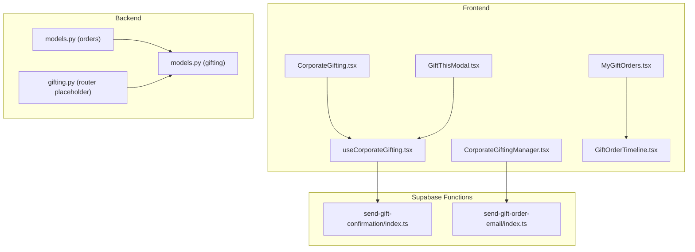
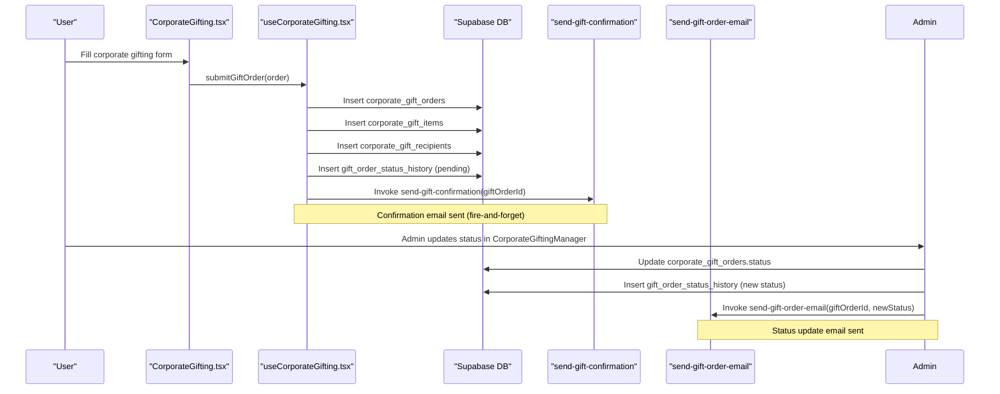
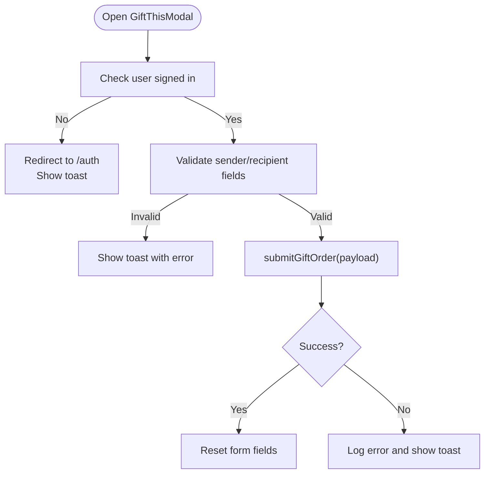
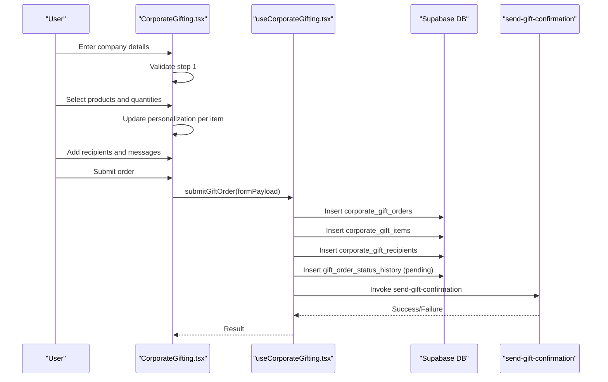
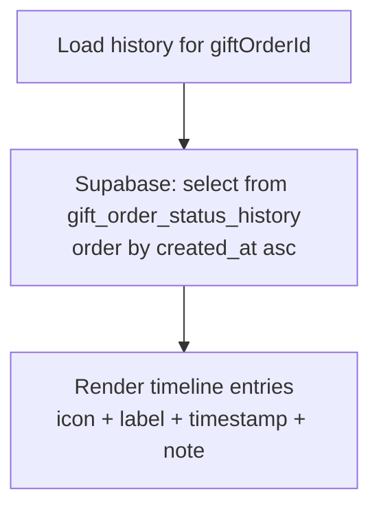
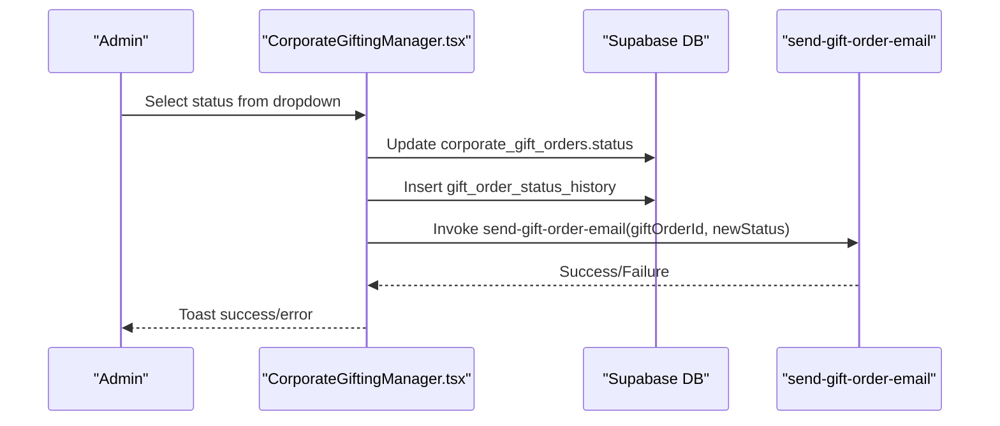
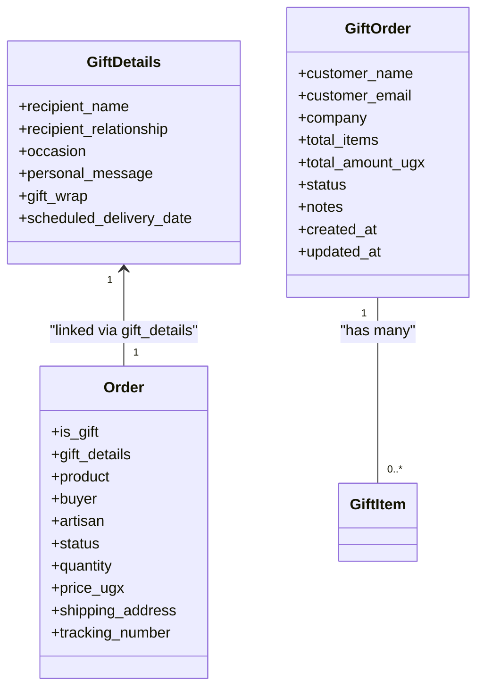
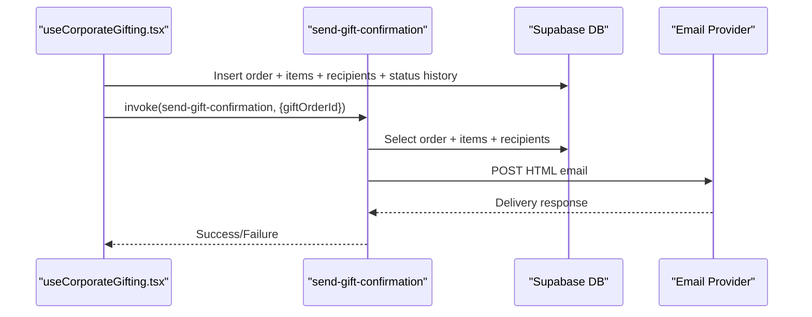
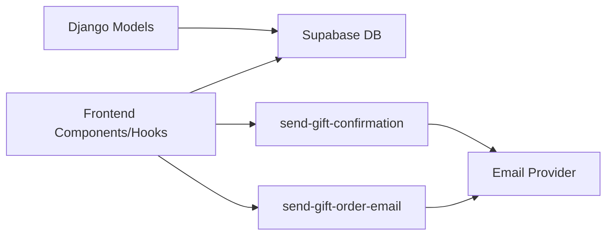

# Gifting System

<cite>
**Referenced Files in This Document**
- [GiftOrderTimeline.tsx](file://src/components/gifting/GiftOrderTimeline.tsx)
- [GiftThisModal.tsx](file://src/components/gifting/GiftThisModal.tsx)
- [MyGiftOrders.tsx](file://src/components/gifting/MyGiftOrders.tsx)
- [CorporateGifting.tsx](file://src/pages/CorporateGifting.tsx)
- [useCorporateGifting.tsx](file://src/hooks/useCorporateGifting.tsx)
- [CorporateGiftingManager.tsx](file://src/components/admin/CorporateGiftingManager.tsx)
- [gifting.py](file://backend/api/v1/gifting.py)
- [models.py (gifting)](file://backend/apps/gifting/models.py)
- [models.py (orders)](file://backend/apps/orders/models.py)
- [send-gift-confirmation/index.ts](file://supabase/functions/send-gift-confirmation/index.ts)
- [send-gift-order-email/index.ts](file://supabase/functions/send-gift-order-email/index.ts)
</cite>

## Table of Contents
1. [Introduction](#introduction)
2. [Project Structure](#project-structure)
3. [Core Components](#core-components)
4. [Architecture Overview](#architecture-overview)
5. [Detailed Component Analysis](#detailed-component-analysis)
6. [Dependency Analysis](#dependency-analysis)
7. [Performance Considerations](#performance-considerations)
8. [Troubleshooting Guide](#troubleshooting-guide)
9. [Conclusion](#conclusion)
10. [Appendices](#appendices)

## Introduction
This document describes the gifting system that supports both personalized and corporate gift commerce. It covers the gift order workflow from selection through personalization and fulfillment, the underlying data model architecture, scheduling and timeline management, the corporate gifting portal and bulk order processing, approval workflows, packaging and message personalization, recipient management, integration with order processing and notifications, and the gift analytics dashboard. It also outlines gift-specific return policies, seasonal gift collections, and promotional gifting campaigns.

## Project Structure
The gifting system spans frontend React components and hooks, backend Django models, and Supabase functions for notifications. The frontend provides user-facing flows for personal gifting and corporate gifting, while the backend defines the data models and the Supabase functions manage email notifications.

**Diagram sources**
- [CorporateGifting.tsx:1-396](file://src/pages/CorporateGifting.tsx#L1-L396)
- [GiftThisModal.tsx:1-208](file://src/components/gifting/GiftThisModal.tsx#L1-L208)
- [MyGiftOrders.tsx:1-159](file://src/components/gifting/MyGiftOrders.tsx#L1-L159)
- [useCorporateGifting.tsx:1-133](file://src/hooks/useCorporateGifting.tsx#L1-L133)
- [CorporateGiftingManager.tsx:1-363](file://src/components/admin/CorporateGiftingManager.tsx#L1-L363)
- [GiftOrderTimeline.tsx:1-85](file://src/components/gifting/GiftOrderTimeline.tsx#L1-L85)
- [models.py (gifting):1-67](file://backend/apps/gifting/models.py#L1-L67)
- [models.py (orders):1-122](file://backend/apps/orders/models.py#L1-L122)
- [gifting.py:1-13](file://backend/api/v1/gifting.py#L1-L13)
- [send-gift-confirmation/index.ts:1-219](file://supabase/functions/send-gift-confirmation/index.ts#L1-L219)
- [send-gift-order-email/index.ts:1-217](file://supabase/functions/send-gift-order-email/index.ts#L1-L217)

**Section sources**
- [CorporateGifting.tsx:1-396](file://src/pages/CorporateGifting.tsx#L1-L396)
- [useCorporateGifting.tsx:1-133](file://src/hooks/useCorporateGifting.tsx#L1-L133)
- [models.py (gifting):1-67](file://backend/apps/gifting/models.py#L1-L67)
- [models.py (orders):1-122](file://backend/apps/orders/models.py#L1-L122)
- [gifting.py:1-13](file://backend/api/v1/gifting.py#L1-L13)
- [send-gift-confirmation/index.ts:1-219](file://supabase/functions/send-gift-confirmation/index.ts#L1-L219)
- [send-gift-order-email/index.ts:1-217](file://supabase/functions/send-gift-order-email/index.ts#L1-L217)

## Core Components
- Personalized gifting flow: A modal allows users to send a single product as a gift with sender and recipient details, optional gift message, and quantity selection.
- Corporate gifting portal: A multi-step wizard for companies to define company/contact details, select products, customize branding/personalization, and add multiple recipients.
- Order persistence: Corporate gift orders, items, recipients, and status history are stored in Supabase tables and managed via hooks and admin components.
- Timeline and notifications: A timeline component visualizes order status history; Supabase functions send confirmation and status update emails.
- Backend models: Django models define gift details and aggregated gift orders; the order model integrates gift metadata for personal orders.

**Section sources**
- [GiftThisModal.tsx:1-208](file://src/components/gifting/GiftThisModal.tsx#L1-L208)
- [CorporateGifting.tsx:1-396](file://src/pages/CorporateGifting.tsx#L1-L396)
- [useCorporateGifting.tsx:1-133](file://src/hooks/useCorporateGifting.tsx#L1-L133)
- [CorporateGiftingManager.tsx:1-363](file://src/components/admin/CorporateGiftingManager.tsx#L1-L363)
- [GiftOrderTimeline.tsx:1-85](file://src/components/gifting/GiftOrderTimeline.tsx#L1-L85)
- [models.py (gifting):1-67](file://backend/apps/gifting/models.py#L1-L67)
- [models.py (orders):1-122](file://backend/apps/orders/models.py#L1-L122)

## Architecture Overview
The gifting system is composed of:
- Frontend pages and components for user interactions (personal and corporate gifting).
- Hooks orchestrating Supabase mutations for creating orders, items, recipients, and logging status history.
- Supabase functions for sending confirmation and status update emails.
- Backend Django models for gift details and aggregated gift orders, with integration to the core order model.

**Diagram sources**
- [CorporateGifting.tsx:83-99](file://src/pages/CorporateGifting.tsx#L83-L99)
- [useCorporateGifting.tsx:44-129](file://src/hooks/useCorporateGifting.tsx#L44-L129)
- [CorporateGiftingManager.tsx:76-113](file://src/components/admin/CorporateGiftingManager.tsx#L76-L113)
- [send-gift-confirmation/index.ts:15-219](file://supabase/functions/send-gift-confirmation/index.ts#L15-L219)
- [send-gift-order-email/index.ts:109-217](file://supabase/functions/send-gift-order-email/index.ts#L109-L217)

## Detailed Component Analysis

### Personalized Gifting Modal
- Purpose: Enable individual users to send a single product as a gift with sender/recipient details, optional gift message, and quantity.
- Key behaviors:
  - Validates sender and recipient presence.
  - Submits a corporate-style order payload for a single recipient and item.
  - Integrates with authentication and toast feedback.
  - Resets form after successful submission.

**Diagram sources**
- [GiftThisModal.tsx:41-86](file://src/components/gifting/GiftThisModal.tsx#L41-L86)
- [useCorporateGifting.tsx:44-129](file://src/hooks/useCorporateGifting.tsx#L44-L129)

**Section sources**
- [GiftThisModal.tsx:1-208](file://src/components/gifting/GiftThisModal.tsx#L1-L208)
- [useCorporateGifting.tsx:1-133](file://src/hooks/useCorporateGifting.tsx#L1-L133)

### Corporate Gifting Portal
- Purpose: Multi-step wizard for corporate customers to configure company details, select products, customize branding/personalization, and add multiple recipients.
- Key behaviors:
  - Step 1: Company and contact details, occasion, budget range, preferred delivery date.
  - Step 2: Product selection with quantity and optional personalization per item.
  - Step 3: Gift message and branding/packaging notes.
  - Step 4: Recipient list with optional personal messages per recipient.
  - Submission triggers order creation and confirmation email.

**Diagram sources**
- [CorporateGifting.tsx:198-366](file://src/pages/CorporateGifting.tsx#L198-L366)
- [useCorporateGifting.tsx:44-129](file://src/hooks/useCorporateGifting.tsx#L44-L129)
- [send-gift-confirmation/index.ts:15-219](file://supabase/functions/send-gift-confirmation/index.ts#L15-L219)

**Section sources**
- [CorporateGifting.tsx:1-396](file://src/pages/CorporateGifting.tsx#L1-L396)
- [useCorporateGifting.tsx:1-133](file://src/hooks/useCorporateGifting.tsx#L1-L133)

### Gift Order Timeline Management
- Purpose: Visualize the status history of a gift order with icons, timestamps, and optional notes.
- Data source: Queries the gift order status history table ordered chronologically.
- UI: Renders a vertical timeline with latest status highlighted.

**Diagram sources**
- [GiftOrderTimeline.tsx:21-32](file://src/components/gifting/GiftOrderTimeline.tsx#L21-L32)

**Section sources**
- [GiftOrderTimeline.tsx:1-85](file://src/components/gifting/GiftOrderTimeline.tsx#L1-L85)

### Corporate Gifting Manager (Admin)
- Purpose: Admin panel to manage corporate gift orders, filter/search, update status, view items/recipients, and send status update emails.
- Key behaviors:
  - Filters orders by search term and status.
  - Updates order status and logs changes to history.
  - Sends status update emails via Supabase function.
  - Displays order summary, items, recipients, and status timeline.

**Diagram sources**
- [CorporateGiftingManager.tsx:76-113](file://src/components/admin/CorporateGiftingManager.tsx#L76-L113)
- [send-gift-order-email/index.ts:109-217](file://supabase/functions/send-gift-order-email/index.ts#L109-L217)

**Section sources**
- [CorporateGiftingManager.tsx:1-363](file://src/components/admin/CorporateGiftingManager.tsx#L1-L363)

### Gift Model Architecture
- GiftDetails: Stores recipient information, relationship, occasion, personal message, gift wrap flag, and optional scheduled delivery date.
- GiftOrder: Aggregated corporate gift order with customer/company info, totals, status, and timestamps.
- Integration with Order: The core order model includes a gift flag and a one-to-one relationship to gift details for personal orders.

**Diagram sources**
- [models.py (gifting):9-67](file://backend/apps/gifting/models.py#L9-L67)
- [models.py (orders):10-122](file://backend/apps/orders/models.py#L10-L122)

**Section sources**
- [models.py (gifting):1-67](file://backend/apps/gifting/models.py#L1-L67)
- [models.py (orders):1-122](file://backend/apps/orders/models.py#L1-L122)

### Gift Scheduling Capabilities
- Scheduled delivery date is supported in gift details for personal gifting.
- Corporate gifting allows specifying a preferred delivery date during the wizard.
- Recommendation: Integrate scheduling checks in the order fulfillment pipeline to ensure availability and capacity alignment.

**Section sources**
- [models.py (gifting):33-33](file://backend/apps/gifting/models.py#L33-L33)
- [CorporateGifting.tsx:221-221](file://src/pages/CorporateGifting.tsx#L221-L221)

### Gift Packaging Options and Message Personalization
- Packaging: Gift wrap flag in gift details for personal orders.
- Personalization: Optional personalization text per corporate gift item; optional personal message per corporate gift recipient.
- Branding notes: Corporate gift order supports branding/packaging notes for customization requests.

**Section sources**
- [models.py (gifting):32-32](file://backend/apps/gifting/models.py#L32-L32)
- [CorporateGifting.tsx:271-271](file://src/pages/CorporateGifting.tsx#L271-L271)
- [CorporateGifting.tsx:300-303](file://src/pages/CorporateGifting.tsx#L300-L303)

### Gift Recipient Management
- Corporate gifting supports multiple recipients with optional details (email, phone, address, city, personal message).
- Admin view lists recipients with their details and personal messages.

**Section sources**
- [CorporateGifting.tsx:324-340](file://src/pages/CorporateGifting.tsx#L324-L340)
- [CorporateGiftingManager.tsx:307-321](file://src/components/admin/CorporateGiftingManager.tsx#L307-L321)

### Integration with Order Processing
- Personal gift orders integrate with the core order model via a one-to-one gift details relationship.
- Corporate gift orders are separate but share the same product catalog and can be fulfilled alongside regular orders.

**Section sources**
- [models.py (orders):64-72](file://backend/apps/orders/models.py#L64-L72)
- [models.py (gifting):9-67](file://backend/apps/gifting/models.py#L9-L67)

### Notification System for Gift Confirmations
- Confirmation email: Sent upon initial order submission via a Supabase function that builds an HTML email and sends it using a third-party provider.
- Status update emails: Admin-triggered status changes trigger another function to notify the contact person.

**Diagram sources**
- [useCorporateGifting.tsx:115-118](file://src/hooks/useCorporateGifting.tsx#L115-L118)
- [send-gift-confirmation/index.ts:15-219](file://supabase/functions/send-gift-confirmation/index.ts#L15-L219)

**Section sources**
- [useCorporateGifting.tsx:1-133](file://src/hooks/useCorporateGifting.tsx#L1-L133)
- [send-gift-confirmation/index.ts:1-219](file://supabase/functions/send-gift-confirmation/index.ts#L1-L219)
- [send-gift-order-email/index.ts:1-217](file://supabase/functions/send-gift-order-email/index.ts#L1-L217)

### Gift Analytics Dashboard
- Admin view aggregates order data, items, and recipients, and displays status history via the timeline component.
- Recommendations:
  - Track order counts, revenue, and status conversion rates.
  - Monitor recipient distribution and popular occasions.
  - Export reports for finance and marketing teams.

**Section sources**
- [CorporateGiftingManager.tsx:1-363](file://src/components/admin/CorporateGiftingManager.tsx#L1-L363)
- [GiftOrderTimeline.tsx:1-85](file://src/components/gifting/GiftOrderTimeline.tsx#L1-L85)

### Gift-Specific Return Policies, Seasonal Collections, and Promotional Campaigns
- Return policy: Not defined in the current codebase; recommend adding a dedicated policy page and integrating with the returns manager.
- Seasonal collections: Not defined in the current codebase; recommend tagging products with seasonal categories and exposing filters in the marketplace.
- Promotional campaigns: Not defined in the current codebase; recommend campaign banners and targeted promotions in the marketplace and corporate portal.

[No sources needed since this section provides general guidance]

## Dependency Analysis
- Frontend depends on Supabase for data and functions for notifications.
- Backend models define the schema for gift details and orders.
- Supabase functions encapsulate email logic and are invoked by frontend hooks and admin actions.

**Diagram sources**
- [useCorporateGifting.tsx:53-118](file://src/hooks/useCorporateGifting.tsx#L53-L118)
- [CorporateGiftingManager.tsx:99-105](file://src/components/admin/CorporateGiftingManager.tsx#L99-L105)
- [models.py (gifting):1-67](file://backend/apps/gifting/models.py#L1-L67)
- [models.py (orders):1-122](file://backend/apps/orders/models.py#L1-L122)
- [send-gift-confirmation/index.ts:1-219](file://supabase/functions/send-gift-confirmation/index.ts#L1-L219)
- [send-gift-order-email/index.ts:1-217](file://supabase/functions/send-gift-order-email/index.ts#L1-L217)

**Section sources**
- [useCorporateGifting.tsx:1-133](file://src/hooks/useCorporateGifting.tsx#L1-L133)
- [CorporateGiftingManager.tsx:1-363](file://src/components/admin/CorporateGiftingManager.tsx#L1-L363)
- [models.py (gifting):1-67](file://backend/apps/gifting/models.py#L1-L67)
- [models.py (orders):1-122](file://backend/apps/orders/models.py#L1-L122)
- [send-gift-confirmation/index.ts:1-219](file://supabase/functions/send-gift-confirmation/index.ts#L1-L219)
- [send-gift-order-email/index.ts:1-217](file://supabase/functions/send-gift-order-email/index.ts#L1-L217)

## Performance Considerations
- Minimize repeated queries: Use React Query’s caching and selective refetching for order lists and timelines.
- Batch inserts: Corporate order submission performs multiple inserts; ensure they are grouped and validated efficiently.
- Email latency: Notifications are fire-and-forget; monitor delivery failures and retry mechanisms if needed.
- Pagination: For large order histories, consider paginated queries in the timeline component.

[No sources needed since this section provides general guidance]

## Troubleshooting Guide
- Authentication errors: Ensure the user is signed in before submitting orders; the modal and hook both check for user presence.
- Missing fields: Validation prevents submission without required sender/recipient fields; ensure all required fields are filled.
- Email failures: Supabase functions log errors; check function logs and environment variables for the email provider.
- Status updates: Admin updates require admin role verification; ensure the invoking user has the correct role.

**Section sources**
- [GiftThisModal.tsx:42-51](file://src/components/gifting/GiftThisModal.tsx#L42-L51)
- [useCorporateGifting.tsx:45-48](file://src/hooks/useCorporateGifting.tsx#L45-L48)
- [send-gift-confirmation/index.ts:21-42](file://supabase/functions/send-gift-confirmation/index.ts#L21-L42)
- [send-gift-order-email/index.ts:115-147](file://supabase/functions/send-gift-order-email/index.ts#L115-L147)

## Conclusion
The gifting system provides a robust foundation for both personalized and corporate gift commerce. It includes a user-friendly corporate gifting portal, order persistence with status history, and automated notifications. The backend models support gift scheduling and personalization, while the admin portal enables efficient order management and communication. Future enhancements should focus on return policies, seasonal collections, and promotional campaigns.

## Appendices
- API placeholder: A gifting router exists but is currently a placeholder; expand it to expose gift-specific endpoints as the system evolves.

**Section sources**
- [gifting.py:1-13](file://backend/api/v1/gifting.py#L1-L13)