# Personalized Gifting

<cite>
**Referenced Files in This Document**
- [GiftThisModal.tsx](file://src/components/gifting/GiftThisModal.tsx)
- [MyGiftOrders.tsx](file://src/components/gifting/MyGiftOrders.tsx)
- [GiftOrderTimeline.tsx](file://src/components/gifting/GiftOrderTimeline.tsx)
- [CorporateGifting.tsx](file://src/pages/CorporateGifting.tsx)
- [useCorporateGifting.tsx](file://src/hooks/useCorporateGifting.tsx)
- [gifting.py](file://backend/api/v1/gifting.py)
- [router.py](file://backend/api/v1/router.py)
- [models.py](file://backend/apps/gifting/models.py)
- [orders/models.py](file://backend/apps/orders/models.py)
- [send-gift-confirmation/index.ts](file://supabase/functions/send-gift-confirmation/index.ts)
- [20260307151135_abb92613-d0a4-4ab6-8384-d241b138020b.sql](file://supabase/migrations/20260307151135_abb92613-d0a4-4ab6-8384-d241b138020b.sql)
</cite>

## Table of Contents
1. [Introduction](#introduction)
2. [Project Structure](#project-structure)
3. [Core Components](#core-components)
4. [Architecture Overview](#architecture-overview)
5. [Detailed Component Analysis](#detailed-component-analysis)
6. [Dependency Analysis](#dependency-analysis)
7. [Performance Considerations](#performance-considerations)
8. [Troubleshooting Guide](#troubleshooting-guide)
9. [Conclusion](#conclusion)

## Introduction
This document describes the personalized gifting feature for individual gift purchases. It covers the gift selection process, personalization options (occasion types, recipient information, custom messages), gift wrapping and scheduling, order management, and the gift modal component. It also documents the gift-specific data models, validation rules, business logic for gift personalization, gift order states, delivery scheduling, and recipient management features.

## Project Structure
The gifting feature spans frontend React components, hooks, and backend Supabase functions and Django models. The frontend provides two primary flows:
- Individual gift purchase via a modal attached to product pages
- Corporate gifting via a multi-step wizard page

Backend services orchestrate order creation, persistence, and notifications.

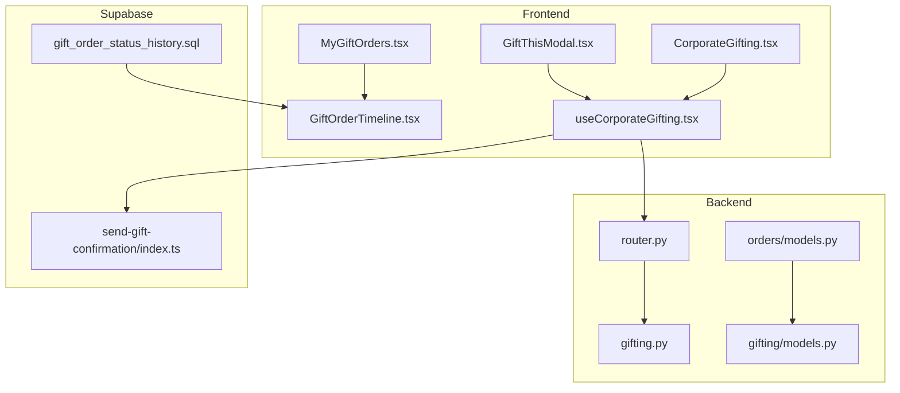

**Diagram sources**
- [router.py:1-40](file://backend/api/v1/router.py#L1-L40)
- [gifting.py:1-13](file://backend/api/v1/gifting.py#L1-L13)
- [orders/models.py:1-122](file://backend/apps/orders/models.py#L1-L122)
- [gifting/models.py:1-67](file://backend/apps/gifting/models.py#L1-L67)
- [send-gift-confirmation/index.ts:1-219](file://supabase/functions/send-gift-confirmation/index.ts#L1-L219)
- [20260307151135_abb92613-d0a4-4ab6-8384-d241b138020b.sql:1-43](file://supabase/migrations/20260307151135_abb92613-d0a4-4ab6-8384-d241b138020b.sql#L1-L43)

**Section sources**
- [router.py:1-40](file://backend/api/v1/router.py#L1-L40)
- [gifting.py:1-13](file://backend/api/v1/gifting.py#L1-L13)
- [orders/models.py:1-122](file://backend/apps/orders/models.py#L1-L122)
- [gifting/models.py:1-67](file://backend/apps/gifting/models.py#L1-L67)
- [send-gift-confirmation/index.ts:1-219](file://supabase/functions/send-gift-confirmation/index.ts#L1-L219)
- [20260307151135_abb92613-d0a4-4ab6-8384-d241b138020b.sql:1-43](file://supabase/migrations/20260307151135_abb92613-d0a4-4ab6-8384-d241b138020b.sql#L1-L43)

## Core Components
- GiftThisModal: Single-product gift purchase modal with sender/recipient fields, occasion, quantity, and gift message.
- CorporateGifting: Multi-step wizard for bulk corporate gifting with company details, product selection, customization, and recipients.
- useCorporateGifting: Hook orchestrating order submission to Supabase, including order, items, recipients, and status history.
- MyGiftOrders: Customer view of past gift orders with expandable details and timeline.
- GiftOrderTimeline: Timeline visualization of gift order status transitions.
- Backend models: Django models for gift details and gift orders; Order model links to gift details.
- Supabase functions: Email confirmation on gift order submission.

**Section sources**
- [GiftThisModal.tsx:1-208](file://src/components/gifting/GiftThisModal.tsx#L1-L208)
- [CorporateGifting.tsx:1-396](file://src/pages/CorporateGifting.tsx#L1-L396)
- [useCorporateGifting.tsx:1-133](file://src/hooks/useCorporateGifting.tsx#L1-L133)
- [MyGiftOrders.tsx:1-159](file://src/components/gifting/MyGiftOrders.tsx#L1-L159)
- [GiftOrderTimeline.tsx:1-85](file://src/components/gifting/GiftOrderTimeline.tsx#L1-L85)
- [orders/models.py:1-122](file://backend/apps/orders/models.py#L1-L122)
- [gifting/models.py:1-67](file://backend/apps/gifting/models.py#L1-L67)
- [send-gift-confirmation/index.ts:1-219](file://supabase/functions/send-gift-confirmation/index.ts#L1-L219)

## Architecture Overview
The individual gift purchase flow is initiated from a product page via the GiftThisModal. The modal collects sender and recipient details, optional gift wrapping, and a gift message. On submit, the useCorporateGifting hook posts the order to Supabase, creates related items and recipients, logs the initial status, and triggers a confirmation email via a Supabase Edge Function.

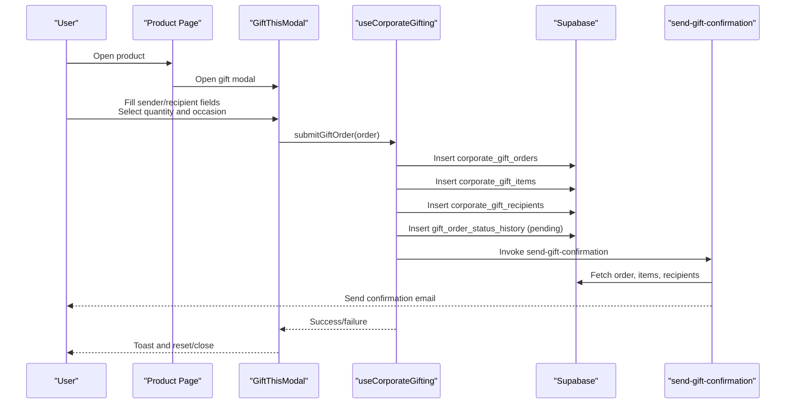

**Diagram sources**
- [GiftThisModal.tsx:41-86](file://src/components/gifting/GiftThisModal.tsx#L41-L86)
- [useCorporateGifting.tsx:44-129](file://src/hooks/useCorporateGifting.tsx#L44-L129)
- [send-gift-confirmation/index.ts:54-104](file://supabase/functions/send-gift-confirmation/index.ts#L54-L104)

## Detailed Component Analysis

### GiftThisModal: Individual Gift Purchase
- Purpose: Allow logged-in users to quickly send a single product as a gift with minimal fields.
- Fields:
  - Sender: name, email, phone
  - Recipient: name, email, phone, address, city
  - Gift details: occasion, quantity, gift message (max 500 chars)
- Validation:
  - Requires sender name and email, and recipient name.
  - Quantity clamped to product stock.
- Submission:
  - Calls useCorporateGifting.submitGiftOrder with a single-item order payload.
  - Resets form on success and closes modal.

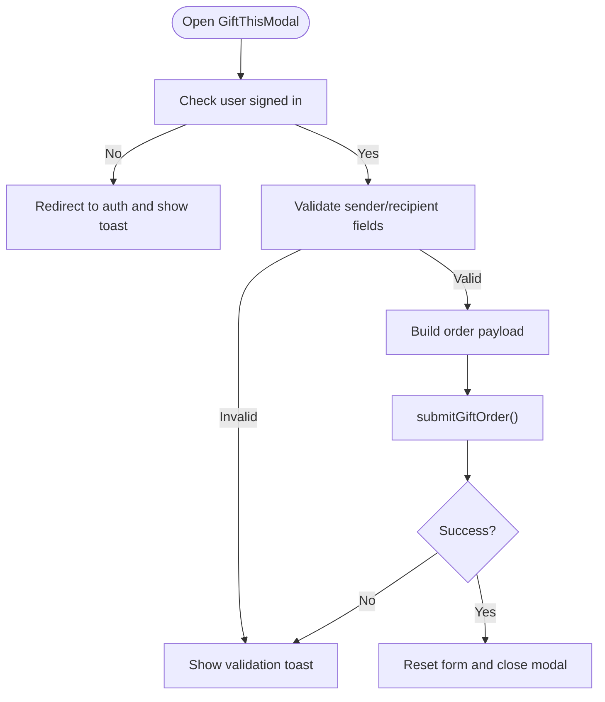

**Diagram sources**
- [GiftThisModal.tsx:41-86](file://src/components/gifting/GiftThisModal.tsx#L41-L86)
- [useCorporateGifting.tsx:44-48](file://src/hooks/useCorporateGifting.tsx#L44-L48)

**Section sources**
- [GiftThisModal.tsx:15-208](file://src/components/gifting/GiftThisModal.tsx#L15-L208)

### CorporateGifting: Multi-Step Corporate Gifting
- Purpose: Full-featured corporate gift ordering with multiple recipients and customization.
- Steps:
  - Company details: company name, contact, occasion, budget range, preferred delivery date.
  - Products: add/remove items, set quantities, optional personalization notes per item.
  - Customize: gift message and branding/packaging notes.
  - Recipients: add/remove, fill name/email/phone/city/address/personal message.
- Submission:
  - Validates presence of required fields.
  - Submits order via useCorporateGifting with items and recipients arrays.

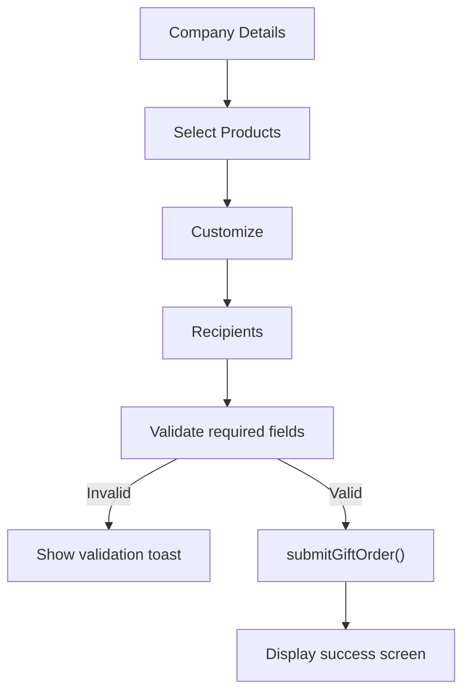

**Diagram sources**
- [CorporateGifting.tsx:198-366](file://src/pages/CorporateGifting.tsx#L198-L366)
- [useCorporateGifting.tsx:84-99](file://src/hooks/useCorporateGifting.tsx#L84-L99)

**Section sources**
- [CorporateGifting.tsx:1-396](file://src/pages/CorporateGifting.tsx#L1-L396)

### useCorporateGifting: Order Orchestration
- Responsibilities:
  - Insert corporate gift order header.
  - Insert multiple items with product_id, quantity, unit_price, optional personalization.
  - Insert multiple recipients with name, optional email/phone/address/city/personal_message.
  - Log initial status history entry.
  - Fire-and-forget confirmation email via Supabase Edge Function.
- Error handling:
  - Shows user-friendly toasts on errors and returns false on failure.

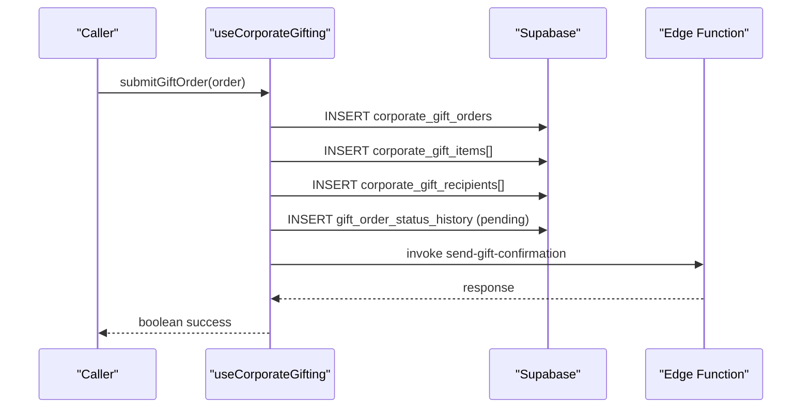

**Diagram sources**
- [useCorporateGifting.tsx:44-129](file://src/hooks/useCorporateGifting.tsx#L44-L129)
- [send-gift-confirmation/index.ts:15-74](file://supabase/functions/send-gift-confirmation/index.ts#L15-L74)

**Section sources**
- [useCorporateGifting.tsx:1-133](file://src/hooks/useCorporateGifting.tsx#L1-L133)

### MyGiftOrders: Order Management Interface
- Fetches orders for the current user with related items and recipients.
- Displays order summary, total amount, status badge, and expands to show items, recipients, gift message, and status timeline.
- Uses react-query for caching and loading states.

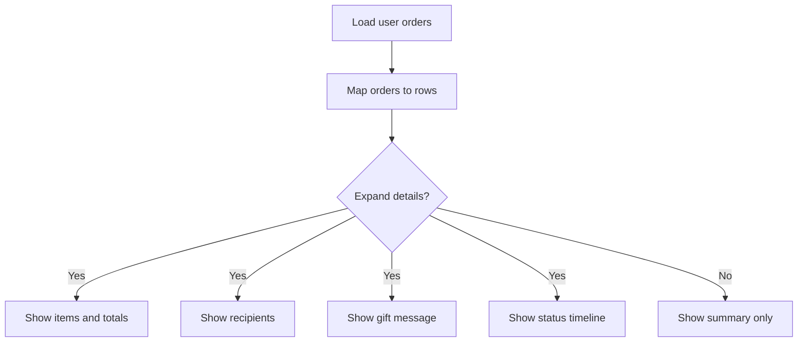

**Diagram sources**
- [MyGiftOrders.tsx:23-42](file://src/components/gifting/MyGiftOrders.tsx#L23-L42)
- [MyGiftOrders.tsx:68-155](file://src/components/gifting/MyGiftOrders.tsx#L68-L155)

**Section sources**
- [MyGiftOrders.tsx:1-159](file://src/components/gifting/MyGiftOrders.tsx#L1-L159)

### GiftOrderTimeline: Order Tracking
- Fetches status history entries for a given gift order.
- Renders a vertical timeline with icons, timestamps, and optional notes.
- Supports latest entry highlighting.

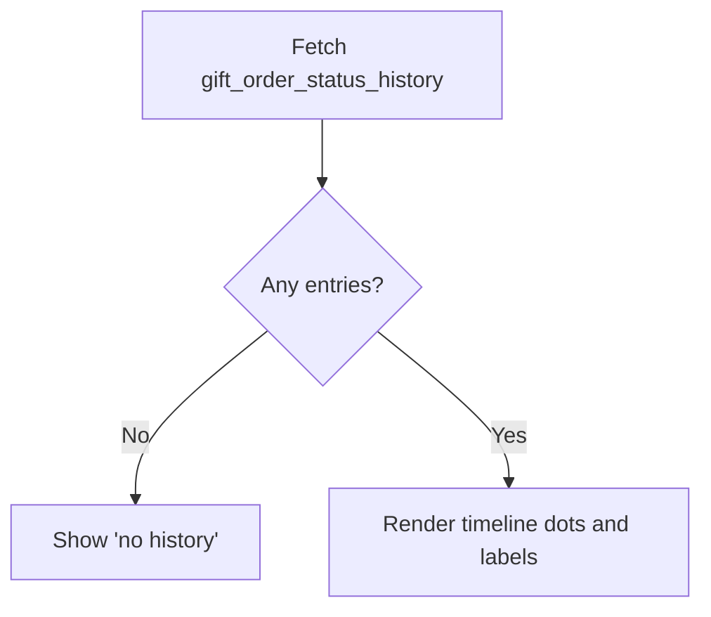

**Diagram sources**
- [GiftOrderTimeline.tsx:21-32](file://src/components/gifting/GiftOrderTimeline.tsx#L21-L32)
- [20260307151135_abb92613-d0a4-4ab6-8384-d241b138020b.sql:3-11](file://supabase/migrations/20260307151135_abb92613-d0a4-4ab6-8384-d241b138020b.sql#L3-L11)

**Section sources**
- [GiftOrderTimeline.tsx:1-85](file://src/components/gifting/GiftOrderTimeline.tsx#L1-L85)

### Gift-Specific Data Models and Backend Integration
- Django models:
  - GiftDetails: recipient info, relationship, occasion, personal message, gift wrap flag, optional scheduled delivery date.
  - GiftOrder: aggregated corporate gift order with status choices and metadata.
- Order model linkage:
  - Order model includes a OneToOne link to GiftDetails via is_gift flag and gift_details relation.
- Supabase schema:
  - corporate_gift_orders, corporate_gift_items, corporate_gift_recipients, gift_order_status_history tables.
  - Edge Function fetches order, items, and recipients to render confirmation emails.

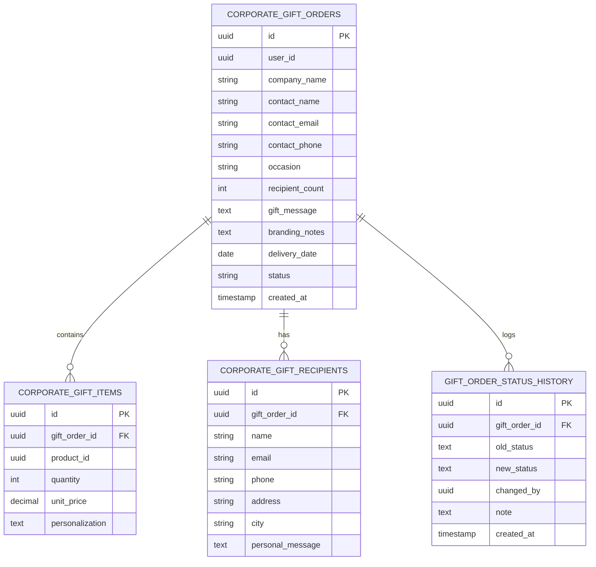

**Diagram sources**
- [gifting/models.py:9-67](file://backend/apps/gifting/models.py#L9-L67)
- [orders/models.py:10-122](file://backend/apps/orders/models.py#L10-L122)
- [20260307151135_abb92613-d0a4-4ab6-8384-d241b138020b.sql:3-11](file://supabase/migrations/20260307151135_abb92613-d0a4-4ab6-8384-d241b138020b.sql#L3-L11)

**Section sources**
- [gifting/models.py:1-67](file://backend/apps/gifting/models.py#L1-L67)
- [orders/models.py:1-122](file://backend/apps/orders/models.py#L1-L122)
- [20260307151135_abb92613-d0a4-4ab6-8384-d241b138020b.sql:1-43](file://supabase/migrations/20260307151135_abb92613-d0a4-4ab6-8384-d241b138020b.sql#L1-L43)

### Gift Order States and Delivery Scheduling
- Gift order states (as persisted):
  - Draft, Pending Payment, Paid, Processing, Completed.
- Scheduled delivery:
  - Optional delivery_date stored on the gift order.
- Timeline states (as rendered):
  - Pending, Reviewed, Confirmed, In Production, Shipped, Delivered, Cancelled.

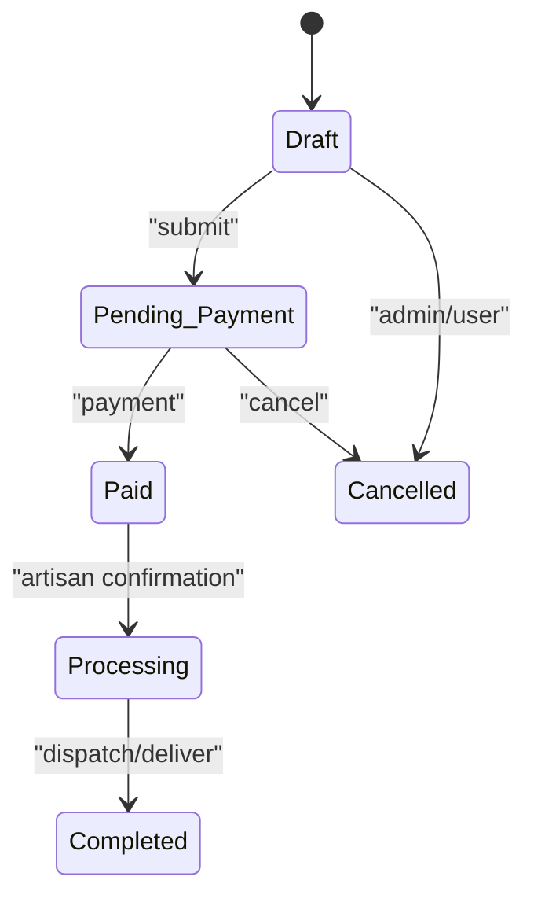

**Diagram sources**
- [gifting/models.py:44-50](file://backend/apps/gifting/models.py#L44-L50)
- [GiftOrderTimeline.tsx:6-14](file://src/components/gifting/GiftOrderTimeline.tsx#L6-L14)

**Section sources**
- [gifting/models.py:44-50](file://backend/apps/gifting/models.py#L44-L50)
- [GiftOrderTimeline.tsx:6-14](file://src/components/gifting/GiftOrderTimeline.tsx#L6-L14)

### Backend API and Routing
- API v1 router registers the gifting endpoint under /gifting/.
- Current gifting endpoint returns a placeholder message indicating future implementation.
- Authentication uses JWT bearer tokens.

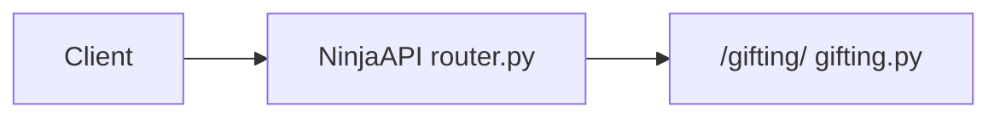

**Diagram sources**
- [router.py:34-39](file://backend/api/v1/router.py#L34-L39)
- [gifting.py:10-12](file://backend/api/v1/gifting.py#L10-L12)

**Section sources**
- [router.py:1-40](file://backend/api/v1/router.py#L1-L40)
- [gifting.py:1-13](file://backend/api/v1/gifting.py#L1-L13)

## Dependency Analysis
- Frontend-to-Backend:
  - GiftThisModal and CorporateGifting depend on useCorporateGifting for order submission.
  - useCorporateGifting writes to Supabase tables and invokes an Edge Function.
- Backend-to-Frontend:
  - MyGiftOrders reads corporate gift tables and renders timelines.
  - GiftOrderTimeline reads gift_order_status_history for visualization.
- Data Model Coupling:
  - Order model references GiftDetails via a OneToOne relationship, enabling gift-specific personalization for regular orders.

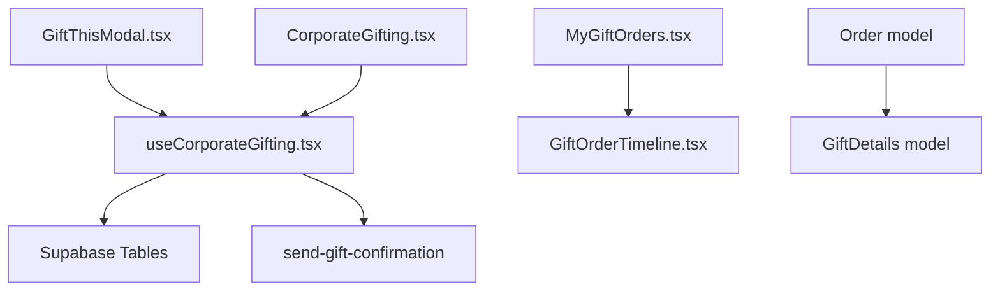

**Diagram sources**
- [GiftThisModal.tsx:26-27](file://src/components/gifting/GiftThisModal.tsx#L26-L27)
- [CorporateGifting.tsx:23-24](file://src/pages/CorporateGifting.tsx#L23-L24)
- [useCorporateGifting.tsx:53-118](file://src/hooks/useCorporateGifting.tsx#L53-L118)
- [MyGiftOrders.tsx:27-41](file://src/components/gifting/MyGiftOrders.tsx#L27-L41)
- [GiftOrderTimeline.tsx:21-32](file://src/components/gifting/GiftOrderTimeline.tsx#L21-L32)
- [orders/models.py:66-72](file://backend/apps/orders/models.py#L66-L72)
- [gifting/models.py:9-36](file://backend/apps/gifting/models.py#L9-L36)

**Section sources**
- [useCorporateGifting.tsx:1-133](file://src/hooks/useCorporateGifting.tsx#L1-L133)
- [MyGiftOrders.tsx:1-159](file://src/components/gifting/MyGiftOrders.tsx#L1-L159)
- [orders/models.py:1-122](file://backend/apps/orders/models.py#L1-L122)
- [gifting/models.py:1-67](file://backend/apps/gifting/models.py#L1-L67)

## Performance Considerations
- Minimize re-renders by keeping form state scoped to modals and wizard steps.
- Use react-query’s caching for order lists and timelines to avoid redundant network requests.
- Batch database writes in useCorporateGifting to reduce round trips.
- Limit timeline rendering to visible entries and paginate if histories grow large.

## Troubleshooting Guide
- Authentication prompts:
  - GiftThisModal redirects unauthenticated users to the auth page and shows a toast.
- Validation failures:
  - Missing required sender/recipient fields trigger user-visible toasts.
- Submission errors:
  - useCorporateGifting catches and displays errors via toast; returns false to prevent unexpected success states.
- Email confirmation:
  - Edge Function validates ownership and sends HTML email; check function logs for failures.

**Section sources**
- [GiftThisModal.tsx:42-51](file://src/components/gifting/GiftThisModal.tsx#L42-L51)
- [useCorporateGifting.tsx:122-126](file://src/hooks/useCorporateGifting.tsx#L122-L126)
- [send-gift-confirmation/index.ts:15-74](file://supabase/functions/send-gift-confirmation/index.ts#L15-L74)

## Conclusion
The personalized gifting feature combines a streamlined individual gift purchase flow with a comprehensive corporate gifting wizard. It leverages Supabase for data persistence and notifications, Django models for gift personalization, and React components for intuitive UI patterns. The system supports recipient management, gift messaging, optional gift wrapping, scheduling, and robust order tracking via status history.