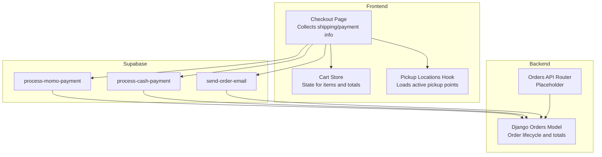
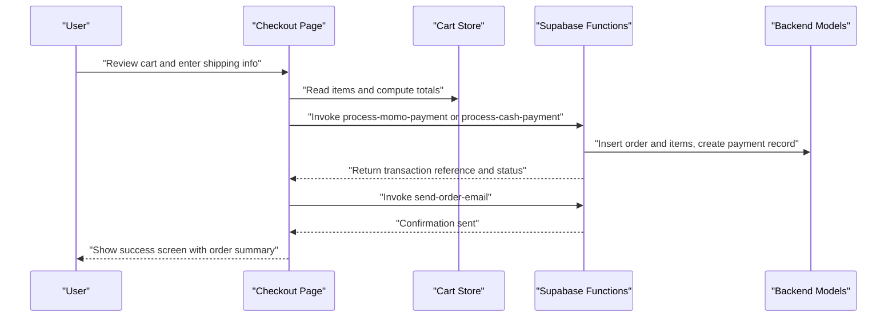
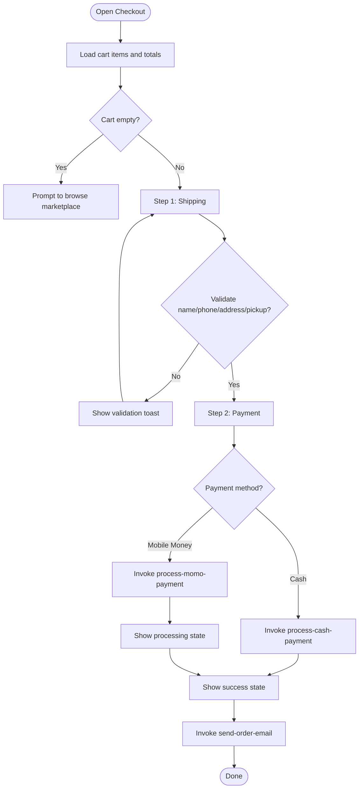
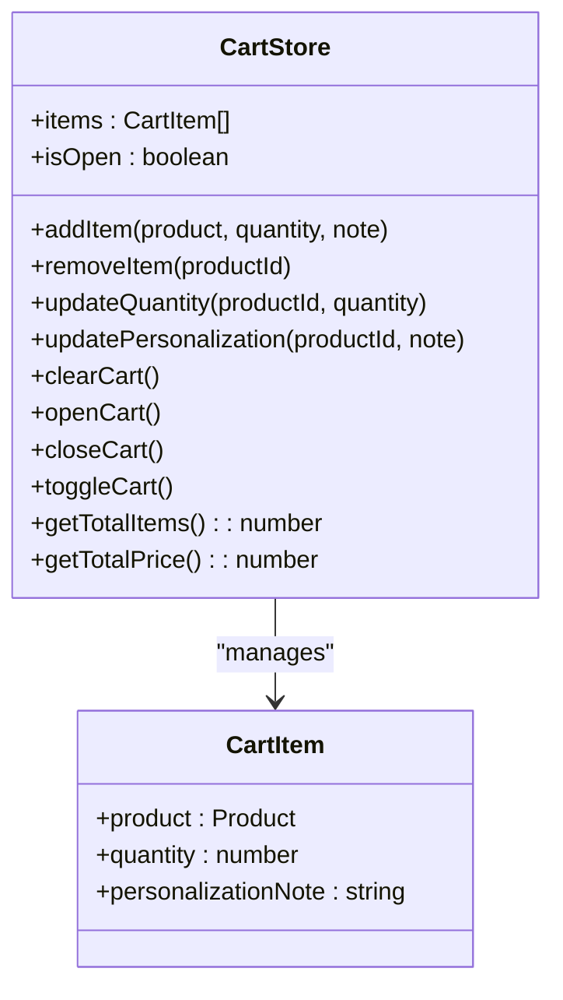
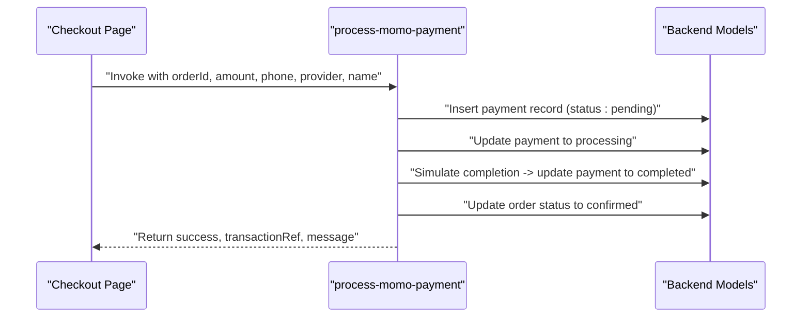
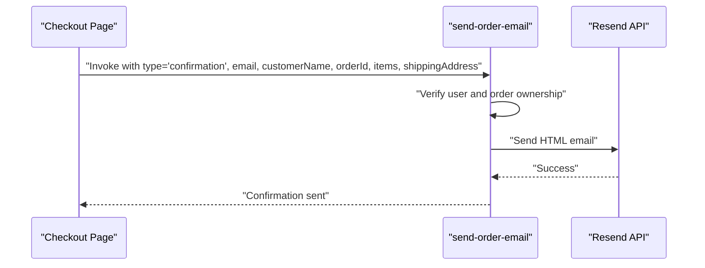
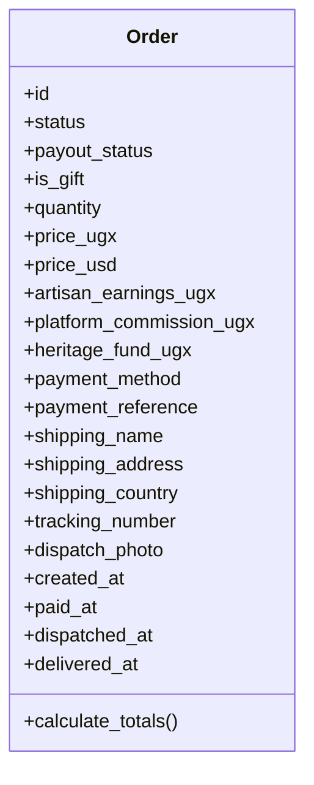
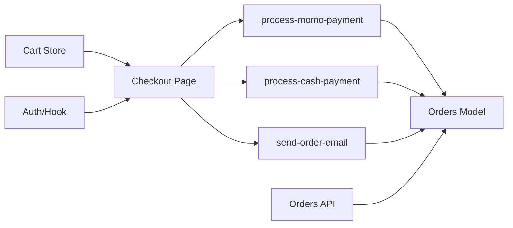

# Checkout Process

<cite>
**Referenced Files in This Document**
- [Checkout.tsx](file://apps/web/src/pages/Checkout.tsx)
- [cartStore.ts](file://apps/web/src/stores/cartStore.ts)
- [usePickupLocations.tsx](file://apps/web/src/hooks/usePickupLocations.tsx)
- [orders.py](file://backend/api/v1/orders.py)
- [models.py](file://backend/apps/orders/models.py)
- [process-momo-payment/index.ts](file://supabase/functions/process-momo-payment/index.ts)
- [process-cash-payment/index.ts](file://supabase/functions/process-cash-payment/index.ts)
- [send-order-email/index.ts](file://supabase/functions/send-order-email/index.ts)
</cite>

## Table of Contents
1. [Introduction](#introduction)
2. [Project Structure](#project-structure)
3. [Core Components](#core-components)
4. [Architecture Overview](#architecture-overview)
5. [Detailed Component Analysis](#detailed-component-analysis)
6. [Dependency Analysis](#dependency-analysis)
7. [Performance Considerations](#performance-considerations)
8. [Troubleshooting Guide](#troubleshooting-guide)
9. [Conclusion](#conclusion)

## Introduction
This document explains the end-to-end checkout process, from reviewing the cart to payment confirmation and order creation. It covers the frontend user experience, state management, form validation, shipping and payment options, and the backend integration via Supabase functions and Django models. It also documents the current state of the backend Orders API and highlights areas for future expansion.

## Project Structure
The checkout flow spans three layers:
- Frontend page and state management: collects shipping info, calculates totals, selects payment method, and invokes backend functions.
- Supabase Edge Functions: process mobile money and cash payments, update payment/order records, and trigger email notifications.
- Backend Django models: define the order lifecycle and financial snapshots; the Orders API is currently a placeholder pending future sprints.

**Diagram sources**
- [Checkout.tsx:37-847](file://apps/web/src/pages/Checkout.tsx#L37-L847)
- [cartStore.ts:1-115](file://apps/web/src/stores/cartStore.ts#L1-L115)
- [usePickupLocations.tsx:1-59](file://apps/web/src/hooks/usePickupLocations.tsx#L1-L59)
- [process-momo-payment/index.ts:1-151](file://supabase/functions/process-momo-payment/index.ts#L1-L151)
- [process-cash-payment/index.ts:1-114](file://supabase/functions/process-cash-payment/index.ts#L1-L114)
- [send-order-email/index.ts:1-284](file://supabase/functions/send-order-email/index.ts#L1-L284)
- [models.py:10-122](file://backend/apps/orders/models.py#L10-L122)
- [orders.py:1-18](file://backend/api/v1/orders.py#L1-L18)

**Section sources**
- [Checkout.tsx:37-847](file://apps/web/src/pages/Checkout.tsx#L37-L847)
- [cartStore.ts:1-115](file://apps/web/src/stores/cartStore.ts#L1-L115)
- [usePickupLocations.tsx:1-59](file://apps/web/src/hooks/usePickupLocations.tsx#L1-L59)
- [orders.py:1-18](file://backend/api/v1/orders.py#L1-L18)
- [models.py:10-122](file://backend/apps/orders/models.py#L10-L122)

## Core Components
- Checkout page: Multi-step form collecting delivery method, contact info, address or pickup location, optional notes, and payment selection. Handles validation, totals computation, and invoking backend functions.
- Cart store: Persistent state for cart items, quantities, personalization notes, and computed totals.
- Pickup locations hook: Loads active pickup locations for selection during checkout.
- Supabase functions: Mobile money and cash payment processors; order confirmation email sender.
- Backend models: Order lifecycle, statuses, payment methods, and financial snapshot fields.

**Section sources**
- [Checkout.tsx:37-847](file://apps/web/src/pages/Checkout.tsx#L37-L847)
- [cartStore.ts:1-115](file://apps/web/src/stores/cartStore.ts#L1-L115)
- [usePickupLocations.tsx:1-59](file://apps/web/src/hooks/usePickupLocations.tsx#L1-L59)
- [process-momo-payment/index.ts:1-151](file://supabase/functions/process-momo-payment/index.ts#L1-L151)
- [process-cash-payment/index.ts:1-114](file://supabase/functions/process-cash-payment/index.ts#L1-L114)
- [send-order-email/index.ts:1-284](file://supabase/functions/send-order-email/index.ts#L1-L284)
- [models.py:10-122](file://backend/apps/orders/models.py#L10-L122)

## Architecture Overview
The checkout flow integrates frontend state with Supabase edge functions and backend models. The frontend validates inputs, computes totals, and submits an order creation request. Payment functions are invoked conditionally based on the chosen method. On success, an order confirmation email is sent.

**Diagram sources**
- [Checkout.tsx:126-295](file://apps/web/src/pages/Checkout.tsx#L126-L295)
- [process-momo-payment/index.ts:17-151](file://supabase/functions/process-momo-payment/index.ts#L17-L151)
- [process-cash-payment/index.ts:19-114](file://supabase/functions/process-cash-payment/index.ts#L19-L114)
- [send-order-email/index.ts:165-284](file://supabase/functions/send-order-email/index.ts#L165-L284)
- [models.py:10-122](file://backend/apps/orders/models.py#L10-L122)

## Detailed Component Analysis

### Checkout Page: Steps, Validation, and State Management
- Steps:
  - Shipping: Delivery method selection (home delivery vs. pickup), contact info, address or pickup location, and optional notes.
  - Payment: Payment method selection (mobile money or cash), provider selection for mobile money, and order summary review.
  - Processing: Shows payment prompts for mobile money with a simulated wait.
  - Success: Displays confirmation and actions to continue shopping or view orders.
- Validation:
  - Enforces presence of full name and phone number.
  - Requires street address and city for home delivery.
  - Requires a selected pickup location for pickup.
  - Ensures user is authenticated before placing an order.
- Totals and shipping:
  - Free pickup; fixed shipping cost for home delivery.
  - Real-time recomputation of subtotal, shipping, and total.
- State management:
  - Uses local React state for step progression, selections, and UI feedback.
  - Uses cart store for items and totals.
  - Integrates with Supabase auth and hooks for pickup locations.

**Diagram sources**
- [Checkout.tsx:93-295](file://apps/web/src/pages/Checkout.tsx#L93-L295)
- [cartStore.ts:98-107](file://apps/web/src/stores/cartStore.ts#L98-L107)

**Section sources**
- [Checkout.tsx:37-847](file://apps/web/src/pages/Checkout.tsx#L37-L847)
- [cartStore.ts:1-115](file://apps/web/src/stores/cartStore.ts#L1-L115)

### Cart Store: Items, Quantities, and Totals
- Responsibilities:
  - Add/update/remove items.
  - Track personalization notes per item.
  - Compute total items and total price.
  - Persist cart state locally.
- Integration:
  - Used by the checkout page to compute shipping-affected totals and render order summary.

**Diagram sources**
- [cartStore.ts:5-24](file://apps/web/src/stores/cartStore.ts#L5-L24)

**Section sources**
- [cartStore.ts:1-115](file://apps/web/src/stores/cartStore.ts#L1-L115)

### Pickup Locations Hook: Active Locations and Loading States
- Responsibilities:
  - Fetch active pickup locations.
  - Provide loading state and refetch capability.
- Integration:
  - Supplies options for the pickup method in checkout.

**Section sources**
- [usePickupLocations.tsx:1-59](file://apps/web/src/hooks/usePickupLocations.tsx#L1-L59)

### Payment Methods: Mobile Money and Cash
- Mobile Money:
  - Validates phone number format for Uganda.
  - Normalizes phone number to international format.
  - Creates a payment record and sets status to processing.
  - Simulates payment completion after a delay and updates order status to confirmed.
  - Returns transaction reference and provider info.
- Cash Payment:
  - Creates a cash payment record with a unique transaction reference.
  - Immediately confirms the order.
  - Returns delivery/pickup messaging and amount due.

**Diagram sources**
- [Checkout.tsx:196-223](file://apps/web/src/pages/Checkout.tsx#L196-L223)
- [process-momo-payment/index.ts:17-151](file://supabase/functions/process-momo-payment/index.ts#L17-L151)
- [models.py:10-122](file://backend/apps/orders/models.py#L10-L122)

**Section sources**
- [process-momo-payment/index.ts:1-151](file://supabase/functions/process-momo-payment/index.ts#L1-L151)
- [process-cash-payment/index.ts:1-114](file://supabase/functions/process-cash-payment/index.ts#L1-L114)

### Order Creation and Confirmation Email
- Order creation:
  - The checkout page inserts an order row and associated order items.
  - Personalization requests are created for items with notes.
- Confirmation email:
  - The checkout page invokes the email function with order details and shipping address.
  - The function verifies user permissions and sends an HTML email via Resend.

**Diagram sources**
- [Checkout.tsx:260-295](file://apps/web/src/pages/Checkout.tsx#L260-L295)
- [send-order-email/index.ts:165-284](file://supabase/functions/send-order-email/index.ts#L165-L284)

**Section sources**
- [Checkout.tsx:138-194](file://apps/web/src/pages/Checkout.tsx#L138-L194)
- [send-order-email/index.ts:1-284](file://supabase/functions/send-order-email/index.ts#L1-L284)

### Backend Orders Model and API
- Orders model:
  - Defines statuses, payment methods, payout status, gift flags, quantities, financial snapshots, shipping fields, and timestamps.
  - Provides a totals calculation method to derive price and earnings fields.
- Orders API:
  - Currently a placeholder; endpoints return informational messages indicating future implementation.

**Diagram sources**
- [models.py:10-122](file://backend/apps/orders/models.py#L10-L122)

**Section sources**
- [models.py:10-122](file://backend/apps/orders/models.py#L10-L122)
- [orders.py:1-18](file://backend/api/v1/orders.py#L1-L18)

## Dependency Analysis
- Frontend depends on:
  - Cart store for item and total computations.
  - Auth and hooks for user profile and pickup locations.
  - Supabase client to invoke functions and manage data.
- Supabase functions depend on:
  - Supabase client and environment variables.
  - Backend models for order and payment persistence.
- Backend models underpin:
  - Order lifecycle and financial integrity.
  - Future Orders API endpoints (pending implementation).

**Diagram sources**
- [Checkout.tsx:37-847](file://apps/web/src/pages/Checkout.tsx#L37-L847)
- [cartStore.ts:1-115](file://apps/web/src/stores/cartStore.ts#L1-L115)
- [process-momo-payment/index.ts:1-151](file://supabase/functions/process-momo-payment/index.ts#L1-L151)
- [process-cash-payment/index.ts:1-114](file://supabase/functions/process-cash-payment/index.ts#L1-L114)
- [send-order-email/index.ts:1-284](file://supabase/functions/send-order-email/index.ts#L1-L284)
- [models.py:10-122](file://backend/apps/orders/models.py#L10-L122)
- [orders.py:1-18](file://backend/api/v1/orders.py#L1-L18)

**Section sources**
- [Checkout.tsx:37-847](file://apps/web/src/pages/Checkout.tsx#L37-L847)
- [cartStore.ts:1-115](file://apps/web/src/stores/cartStore.ts#L1-L115)
- [process-momo-payment/index.ts:1-151](file://supabase/functions/process-momo-payment/index.ts#L1-L151)
- [process-cash-payment/index.ts:1-114](file://supabase/functions/process-cash-payment/index.ts#L1-L114)
- [send-order-email/index.ts:1-284](file://supabase/functions/send-order-email/index.ts#L1-L284)
- [models.py:10-122](file://backend/apps/orders/models.py#L10-L122)
- [orders.py:1-18](file://backend/api/v1/orders.py#L1-L18)

## Performance Considerations
- Minimize network calls: Batch order creation and items insertion in a single transaction where possible.
- Debounce or throttle validation: Avoid excessive toasts during rapid typing.
- Optimize image rendering: Lazy-load product images in the order summary.
- Function cold starts: Mobile money simulation introduces a fixed delay; consider caching or reducing delay for production.
- Email sending: Ensure Resend API keys are configured securely and monitor rate limits.

## Troubleshooting Guide
- Empty cart:
  - The checkout page redirects to the marketplace if the cart is empty.
- Authentication errors:
  - Payment requires an authenticated user; the page prompts to sign in.
- Validation failures:
  - Missing name/phone, missing address/city for delivery, or missing pickup selection triggers user-visible toasts.
- Payment errors:
  - Mobile money phone number format must match Uganda’s pattern; otherwise, the function returns a 400 error.
  - Both payment functions return structured error responses; the frontend displays a generic failure message if not handled specifically.
- Order creation issues:
  - The checkout page inserts order rows and items; errors surface as toasts and reset the payment step.
- Email failures:
  - The email function checks permissions and logs errors; verify Resend API key and network connectivity.

**Section sources**
- [Checkout.tsx:93-124](file://apps/web/src/pages/Checkout.tsx#L93-L124)
- [process-momo-payment/index.ts:33-40](file://supabase/functions/process-momo-payment/index.ts#L33-L40)
- [send-order-email/index.ts:172-241](file://supabase/functions/send-order-email/index.ts#L172-L241)

## Conclusion
The checkout process combines a robust frontend UX with Supabase edge functions and Django models to support mobile money and cash payments, order creation, and confirmation emails. While the Orders API remains a placeholder, the underlying models and functions provide a strong foundation for future enhancements, including real-time payment webhooks, expanded shipping zones, and richer order lifecycle events.