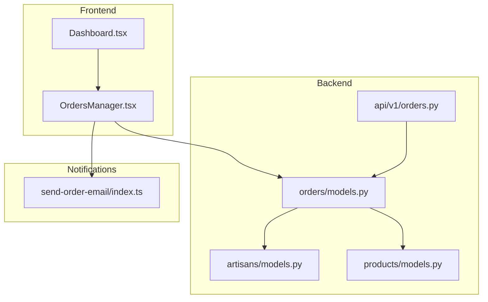
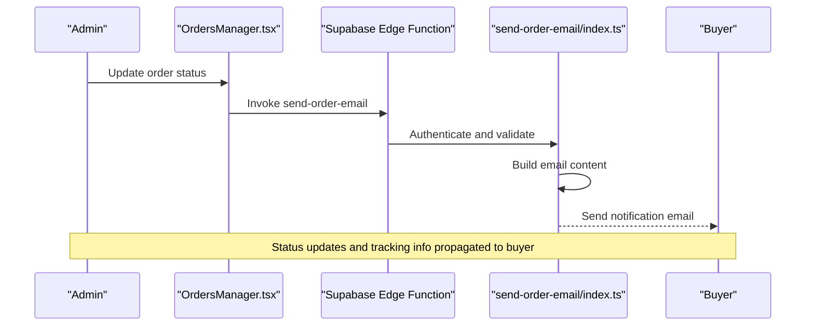
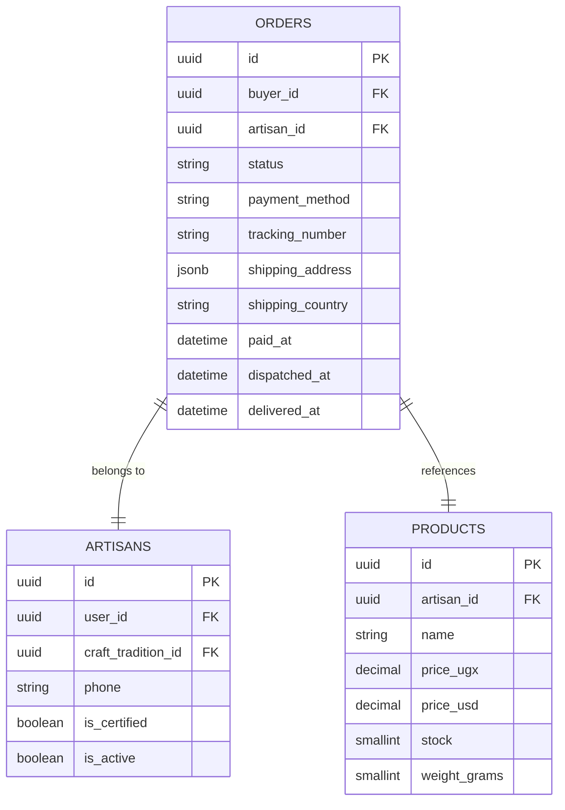
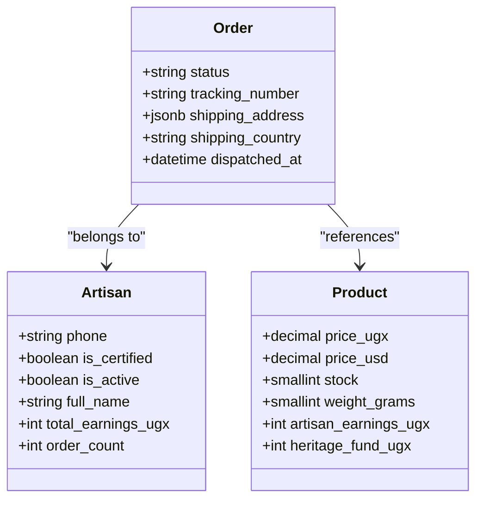
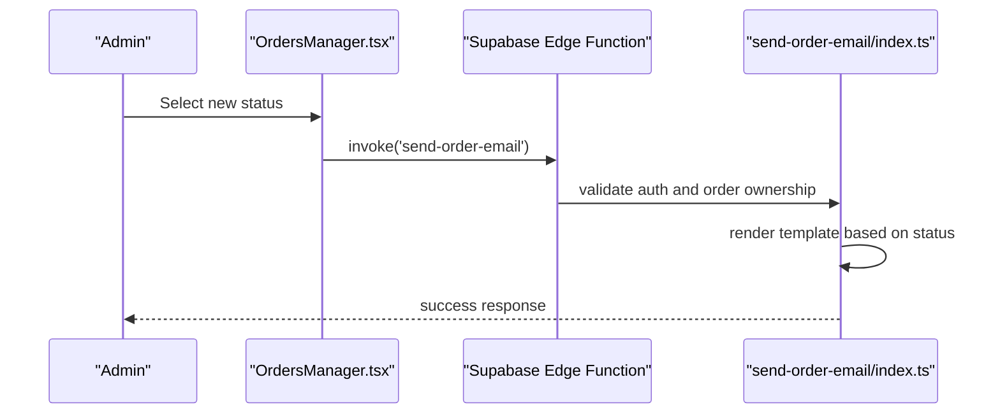
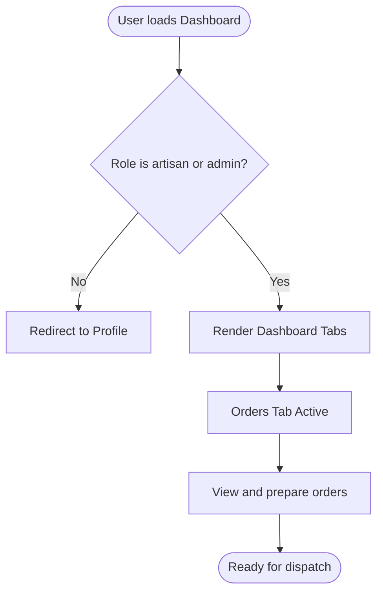
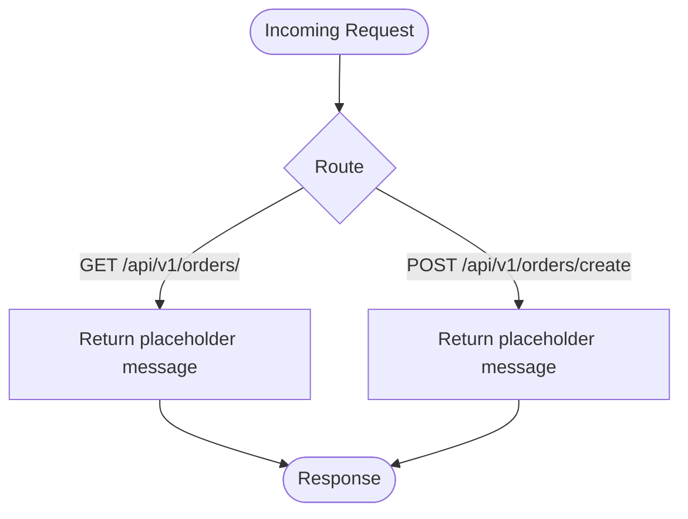
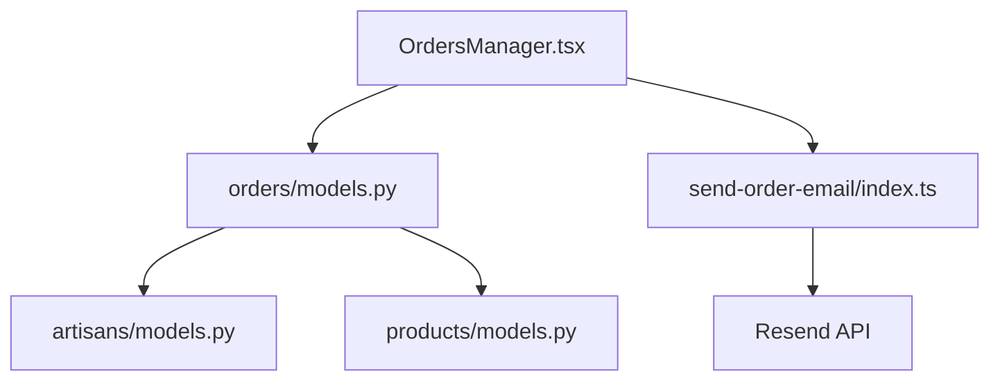

# Fulfillment Coordination

<cite>
**Referenced Files in This Document**
- [orders.py](file://backend/api/v1/orders.py)
- [models.py](file://backend/apps/orders/models.py)
- [models.py](file://backend/apps/artisans/models.py)
- [models.py](file://backend/apps/products/models.py)
- [OrdersManager.tsx](file://apps/web/src/components/admin/OrdersManager.tsx)
- [Dashboard.tsx](file://apps/web/src/pages/Dashboard.tsx)
- [send-order-email/index.ts](file://supabase/functions/send-order-email/index.ts)
</cite>

## Table of Contents
1. [Introduction](#introduction)
2. [Project Structure](#project-structure)
3. [Core Components](#core-components)
4. [Architecture Overview](#architecture-overview)
5. [Detailed Component Analysis](#detailed-component-analysis)
6. [Dependency Analysis](#dependency-analysis)
7. [Performance Considerations](#performance-considerations)
8. [Troubleshooting Guide](#troubleshooting-guide)
9. [Conclusion](#conclusion)

## Introduction
This document explains the end-to-end fulfillment coordination between artisans and logistics, focusing on dispatch, tracking number generation, dispatch photo uploads, buyer notifications, artisan dashboards, and admin oversight. It also outlines shipping address validation, international shipping considerations, and customs documentation requirements derived from the repository’s data models and frontend/backend components.

## Project Structure
The fulfillment workflow spans:
- Backend Django models for orders, artisans, and products
- Frontend dashboards for artisans and admins
- Supabase Edge Functions for buyer notifications
- Placeholder API routes for order operations

**Diagram sources**
- [Dashboard.tsx:1-87](file://apps/web/src/pages/Dashboard.tsx#L1-L87)
- [OrdersManager.tsx:1-342](file://apps/web/src/components/admin/OrdersManager.tsx#L1-L342)
- [models.py:47-121](file://backend/apps/orders/models.py#L47-L121)
- [models.py:62-170](file://backend/apps/artisans/models.py#L62-L170)
- [models.py:10-153](file://backend/apps/products/models.py#L10-L153)
- [orders.py:1-18](file://backend/api/v1/orders.py#L1-L18)
- [send-order-email/index.ts:1-284](file://supabase/functions/send-order-email/index.ts#L1-L284)

**Section sources**
- [Dashboard.tsx:1-87](file://apps/web/src/pages/Dashboard.tsx#L1-L87)
- [OrdersManager.tsx:1-342](file://apps/web/src/components/admin/OrdersManager.tsx#L1-L342)
- [models.py:47-121](file://backend/apps/orders/models.py#L47-L121)
- [models.py:62-170](file://backend/apps/artisans/models.py#L62-L170)
- [models.py:10-153](file://backend/apps/products/models.py#L10-L153)
- [orders.py:1-18](file://backend/api/v1/orders.py#L1-L18)
- [send-order-email/index.ts:1-284](file://supabase/functions/send-order-email/index.ts#L1-L284)

## Core Components
- Order model encapsulates shipping address, country, tracking number, dispatch photo, timestamps, and fulfillment status.
- Artisan model connects buyers to artisans and supports analytics and order metrics.
- Product model defines pricing, revenue split, and shipping attributes.
- Admin dashboard component allows status updates and triggers buyer notifications.
- Email function sends order confirmation, status updates, and shipped notifications.

**Section sources**
- [models.py:47-121](file://backend/apps/orders/models.py#L47-L121)
- [models.py:62-170](file://backend/apps/artisans/models.py#L62-L170)
- [models.py:10-153](file://backend/apps/products/models.py#L10-L153)
- [OrdersManager.tsx:117-152](file://apps/web/src/components/admin/OrdersManager.tsx#L117-L152)
- [send-order-email/index.ts:29-163](file://supabase/functions/send-order-email/index.ts#L29-L163)

## Architecture Overview
The fulfillment pipeline integrates buyer notifications, admin oversight, artisan dashboards, and logistics metadata capture.

**Diagram sources**
- [OrdersManager.tsx:117-152](file://apps/web/src/components/admin/OrdersManager.tsx#L117-L152)
- [send-order-email/index.ts:165-281](file://supabase/functions/send-order-email/index.ts#L165-L281)

## Detailed Component Analysis

### Order Model and Dispatch Metadata
The order model captures all fulfillment-relevant fields:
- Shipping address structure with line, city, country, and postal code
- Country stored as ISO 3166-1 alpha-2 for internationalization
- Tracking number field for logistics integration
- Dispatch photo upload for proof of shipment
- Timestamps for payment, dispatch, and delivery
- Financial snapshot frozen at order time

**Diagram sources**
- [models.py:47-121](file://backend/apps/orders/models.py#L47-L121)
- [models.py:62-170](file://backend/apps/artisans/models.py#L62-L170)
- [models.py:10-153](file://backend/apps/products/models.py#L10-L153)

**Section sources**
- [models.py:88-103](file://backend/apps/orders/models.py#L88-L103)

### Artisan and Product Models
Artisan and product models underpin the fulfillment ecosystem:
- Artisan model includes contact details and certification status
- Product model defines pricing, revenue split, and shipping weight
- These inform order totals, payouts, and logistics packaging

**Diagram sources**
- [models.py:62-170](file://backend/apps/artisans/models.py#L62-L170)
- [models.py:10-153](file://backend/apps/products/models.py#L10-L153)
- [models.py:47-121](file://backend/apps/orders/models.py#L47-L121)

**Section sources**
- [models.py:132-150](file://backend/apps/artisans/models.py#L132-L150)
- [models.py:88-96](file://backend/apps/products/models.py#L88-L96)

### Admin Oversight and Buyer Notifications
The admin Orders Manager enables status updates and triggers buyer notifications:
- Filters orders by status and search term
- Updates order status in Supabase
- Invokes the Supabase Edge Function to send email notifications
- Supports shipped status with optional tracking info

**Diagram sources**
- [OrdersManager.tsx:117-152](file://apps/web/src/components/admin/OrdersManager.tsx#L117-L152)
- [send-order-email/index.ts:165-281](file://supabase/functions/send-order-email/index.ts#L165-L281)

**Section sources**
- [OrdersManager.tsx:58-152](file://apps/web/src/components/admin/OrdersManager.tsx#L58-L152)
- [send-order-email/index.ts:165-281](file://supabase/functions/send-order-email/index.ts#L165-L281)

### Artisan Dashboard and Order Preparation
The artisan dashboard organizes business operations:
- Tabs for products, orders, analytics, business registration, and profile
- Dedicated Orders tab for order management and preparation
- Role-based routing ensures artisans and admins access appropriate views

**Diagram sources**
- [Dashboard.tsx:13-84](file://apps/web/src/pages/Dashboard.tsx#L13-L84)

**Section sources**
- [Dashboard.tsx:47-79](file://apps/web/src/pages/Dashboard.tsx#L47-L79)

### API Routes for Orders
The Orders API currently exposes placeholders for listing and creating orders, indicating future implementation for fulfillment operations.

**Diagram sources**
- [orders.py:10-17](file://backend/api/v1/orders.py#L10-L17)

**Section sources**
- [orders.py:1-18](file://backend/api/v1/orders.py#L1-L18)

## Dependency Analysis
- Orders depend on Artisans and Products for fulfillment and financial snapshots.
- Admin Orders Manager depends on Supabase for data and Edge Functions for notifications.
- Email function depends on Resend API and Supabase authentication for secure delivery.

**Diagram sources**
- [models.py:47-121](file://backend/apps/orders/models.py#L47-L121)
- [models.py:62-170](file://backend/apps/artisans/models.py#L62-L170)
- [models.py:10-153](file://backend/apps/products/models.py#L10-L153)
- [OrdersManager.tsx:117-152](file://apps/web/src/components/admin/OrdersManager.tsx#L117-L152)
- [send-order-email/index.ts:247-259](file://supabase/functions/send-order-email/index.ts#L247-L259)

**Section sources**
- [models.py:47-121](file://backend/apps/orders/models.py#L47-L121)
- [OrdersManager.tsx:117-152](file://apps/web/src/components/admin/OrdersManager.tsx#L117-L152)
- [send-order-email/index.ts:247-259](file://supabase/functions/send-order-email/index.ts#L247-L259)

## Performance Considerations
- Use database indexes on frequently filtered fields (status, created_at) to optimize order listing and filtering.
- Offload heavy operations (image processing for dispatch photos) to background tasks.
- Cache buyer profile lookups in admin views to reduce repeated queries.
- Batch status updates and limit concurrent email invocations to avoid rate limits.

## Troubleshooting Guide
Common issues and resolutions:
- Unauthorized email invocation: Ensure the requester is the order buyer or admin; verify Supabase authentication and role checks.
- Missing required fields: Confirm email payload includes email, orderId, and type; validate presence before invoking the function.
- Order not found: Verify order ID exists and belongs to the requesting user or admin.
- Email delivery failures: Inspect Resend API response and logs; retry on transient errors.

**Section sources**
- [send-order-email/index.ts:172-241](file://supabase/functions/send-order-email/index.ts#L172-L241)
- [OrdersManager.tsx:117-152](file://apps/web/src/components/admin/OrdersManager.tsx#L117-L152)

## Conclusion
The fulfillment system integrates order metadata, artisan/product context, admin oversight, and buyer notifications. While the Orders API is currently a placeholder, the order model, artisan/product models, admin dashboard, and email function provide a robust foundation for dispatch, tracking, and international shipping readiness. Future work should focus on implementing order creation and dispatch workflows, integrating logistics APIs for tracking number generation, and adding customs documentation handling for international shipments.