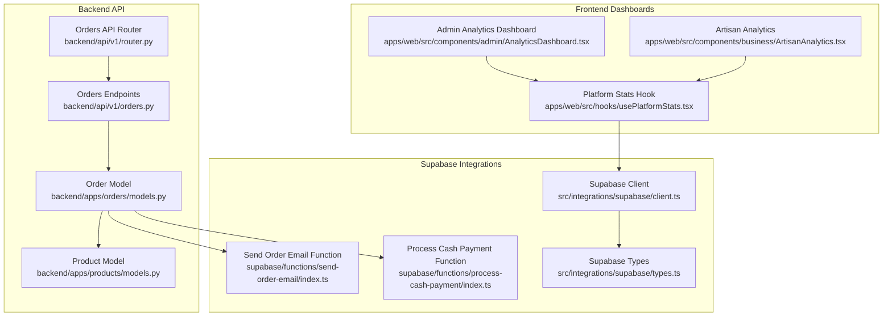
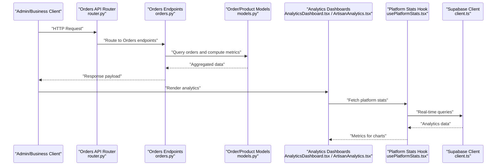
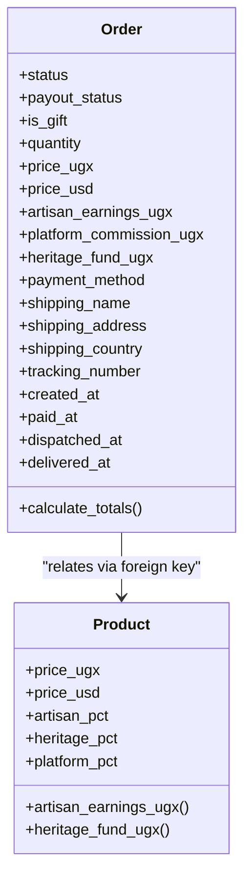
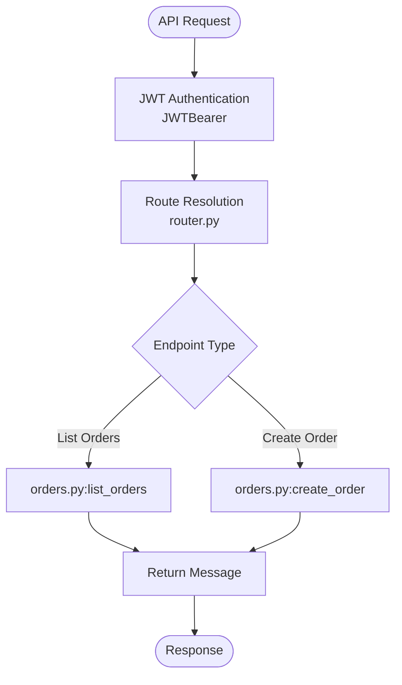
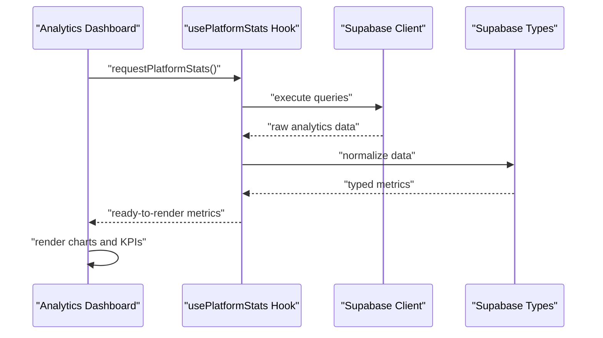
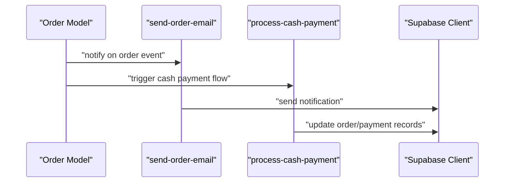
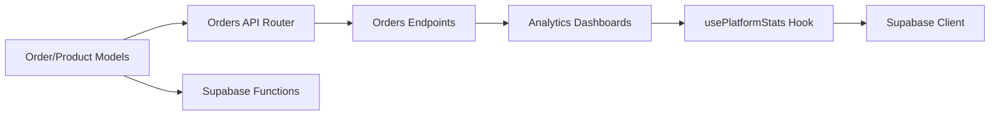

# Order Analytics & Monitoring

<cite>
**Referenced Files in This Document**
- [orders.py](file://backend/api/v1/orders.py)
- [router.py](file://backend/api/v1/router.py)
- [models.py](file://backend/apps/orders/models.py)
- [models.py](file://backend/apps/products/models.py)
- [AnalyticsDashboard.tsx](file://apps/web/src/components/admin/AnalyticsDashboard.tsx)
- [ArtisanAnalytics.tsx](file://apps/web/src/components/business/ArtisanAnalytics.tsx)
- [usePlatformStats.tsx](file://apps/web/src/hooks/usePlatformStats.tsx)
- [client.ts](file://src/integrations/supabase/client.ts)
- [types.ts](file://src/integrations/supabase/types.ts)
- [index.ts](file://supabase/functions/send-order-email/index.ts)
- [index.ts](file://supabase/functions/process-cash-payment/index.ts)
</cite>

## Table of Contents
1. [Introduction](#introduction)
2. [Project Structure](#project-structure)
3. [Core Components](#core-components)
4. [Architecture Overview](#architecture-overview)
5. [Detailed Component Analysis](#detailed-component-analysis)
6. [Dependency Analysis](#dependency-analysis)
7. [Performance Considerations](#performance-considerations)
8. [Troubleshooting Guide](#troubleshooting-guide)
9. [Conclusion](#conclusion)
10. [Appendices](#appendices)

## Introduction
This document describes the order analytics and monitoring capabilities of the platform, focusing on order metrics tracking, performance indicators, and business intelligence dashboards. It documents the integration between order data collection, real-time analytics, and administrative reporting tools. It also explains order volume tracking, conversion rate analysis, and customer lifetime value calculations, along with monitoring alerts, performance benchmarks, and integration with business intelligence platforms. Data privacy considerations, reporting automation, and export capabilities are addressed to ensure responsible and scalable operations.

## Project Structure
The analytics and monitoring solution spans three layers:
- Backend API and models: define order lifecycle, statuses, and financial snapshots.
- Frontend dashboards: present administrative and artisan-specific analytics.
- Supabase integrations: provide real-time notifications and automated workflows.

**Diagram sources**
- [router.py:30-39](file://backend/api/v1/router.py#L30-L39)
- [orders.py:1-18](file://backend/api/v1/orders.py#L1-L18)
- [models.py:10-122](file://backend/apps/orders/models.py#L10-L122)
- [models.py:10-99](file://backend/apps/products/models.py#L10-L99)
- [AnalyticsDashboard.tsx](file://apps/web/src/components/admin/AnalyticsDashboard.tsx)
- [ArtisanAnalytics.tsx](file://apps/web/src/components/business/ArtisanAnalytics.tsx)
- [usePlatformStats.tsx](file://apps/web/src/hooks/usePlatformStats.tsx)
- [client.ts](file://src/integrations/supabase/client.ts)
- [types.ts](file://src/integrations/supabase/types.ts)
- [index.ts](file://supabase/functions/send-order-email/index.ts)
- [index.ts](file://supabase/functions/process-cash-payment/index.ts)

**Section sources**
- [router.py:30-39](file://backend/api/v1/router.py#L30-L39)
- [orders.py:1-18](file://backend/api/v1/orders.py#L1-L18)
- [models.py:10-122](file://backend/apps/orders/models.py#L10-L122)
- [models.py:10-99](file://backend/apps/products/models.py#L10-L99)
- [AnalyticsDashboard.tsx](file://apps/web/src/components/admin/AnalyticsDashboard.tsx)
- [ArtisanAnalytics.tsx](file://apps/web/src/components/business/ArtisanAnalytics.tsx)
- [usePlatformStats.tsx](file://apps/web/src/hooks/usePlatformStats.tsx)
- [client.ts](file://src/integrations/supabase/client.ts)
- [types.ts](file://src/integrations/supabase/types.ts)
- [index.ts](file://supabase/functions/send-order-email/index.ts)
- [index.ts](file://supabase/functions/process-cash-payment/index.ts)

## Core Components
- Order lifecycle and financial snapshot: The Order model captures product, parties, status, gift flag, quantities, frozen financial values, payment method, shipping details, and timestamps. It computes totals based on product pricing and quantities.
- Product model and revenue split: The Product model defines pricing, artisan share, heritage fund, and platform commission percentages, enabling deterministic revenue attribution.
- Orders API: The Orders router exposes placeholder endpoints for listing and creating orders, integrated under the API v1 namespace with JWT authentication.
- Frontend dashboards: Administrative and artisan dashboards consume platform statistics and order data to render analytics visuals.
- Supabase integrations: Real-time notifications and serverless functions automate order-related workflows and communications.

Key implementation references:
- Order model definition and financial computation: [models.py:10-122](file://backend/apps/orders/models.py#L10-L122)
- Product model and revenue split: [models.py:10-99](file://backend/apps/products/models.py#L10-L99)
- Orders API router and endpoints: [router.py:30-39](file://backend/api/v1/router.py#L30-L39), [orders.py:1-18](file://backend/api/v1/orders.py#L1-L18)
- Admin analytics dashboard: [AnalyticsDashboard.tsx](file://apps/web/src/components/admin/AnalyticsDashboard.tsx)
- Artisan analytics dashboard: [ArtisanAnalytics.tsx](file://apps/web/src/components/business/ArtisanAnalytics.tsx)
- Platform stats hook: [usePlatformStats.tsx](file://apps/web/src/hooks/usePlatformStats.tsx)
- Supabase client and types: [client.ts](file://src/integrations/supabase/client.ts), [types.ts](file://src/integrations/supabase/types.ts)
- Order email notification function: [index.ts](file://supabase/functions/send-order-email/index.ts)
- Cash payment processing function: [index.ts](file://supabase/functions/process-cash-payment/index.ts)

**Section sources**
- [models.py:10-122](file://backend/apps/orders/models.py#L10-L122)
- [models.py:10-99](file://backend/apps/products/models.py#L10-L99)
- [router.py:30-39](file://backend/api/v1/router.py#L30-L39)
- [orders.py:1-18](file://backend/api/v1/orders.py#L1-L18)
- [AnalyticsDashboard.tsx](file://apps/web/src/components/admin/AnalyticsDashboard.tsx)
- [ArtisanAnalytics.tsx](file://apps/web/src/components/business/ArtisanAnalytics.tsx)
- [usePlatformStats.tsx](file://apps/web/src/hooks/usePlatformStats.tsx)
- [client.ts](file://src/integrations/supabase/client.ts)
- [types.ts](file://src/integrations/supabase/types.ts)
- [index.ts](file://supabase/functions/send-order-email/index.ts)
- [index.ts](file://supabase/functions/process-cash-payment/index.ts)

## Architecture Overview
The order analytics pipeline integrates frontend dashboards, backend models, API endpoints, and Supabase functions to deliver real-time insights and automated workflows.

**Diagram sources**
- [router.py:30-39](file://backend/api/v1/router.py#L30-L39)
- [orders.py:1-18](file://backend/api/v1/orders.py#L1-L18)
- [models.py:10-122](file://backend/apps/orders/models.py#L10-L122)
- [AnalyticsDashboard.tsx](file://apps/web/src/components/admin/AnalyticsDashboard.tsx)
- [ArtisanAnalytics.tsx](file://apps/web/src/components/business/ArtisanAnalytics.tsx)
- [usePlatformStats.tsx](file://apps/web/src/hooks/usePlatformStats.tsx)
- [client.ts](file://src/integrations/supabase/client.ts)

## Detailed Component Analysis

### Order Model and Metrics Tracking
The Order model encapsulates the order lifecycle and financial snapshot:
- Status tracking: Supports a comprehensive state machine from pending payment to refunded/disputed.
- Gift flagging: Optional gift details linkage enables gift-specific analytics.
- Financial snapshot: Stores frozen prices and calculated earnings for artisan, platform, and heritage fund.
- Payment and shipping: Captures payment method, reference, shipping address, and tracking metadata.
- Timestamps: Tracks creation, payment, dispatch, and delivery events for time-series analytics.

**Diagram sources**
- [models.py:10-122](file://backend/apps/orders/models.py#L10-L122)
- [models.py:10-99](file://backend/apps/products/models.py#L10-L99)

**Section sources**
- [models.py:10-122](file://backend/apps/orders/models.py#L10-L122)
- [models.py:10-99](file://backend/apps/products/models.py#L10-L99)

### Orders API and Authentication
The Orders API is registered under the API v1 router with JWT authentication. Current endpoints are placeholders indicating future implementation for listing and creating orders.

**Diagram sources**
- [router.py:10-28](file://backend/api/v1/router.py#L10-L28)
- [router.py:36-39](file://backend/api/v1/router.py#L36-L39)
- [orders.py:10-17](file://backend/api/v1/orders.py#L10-L17)

**Section sources**
- [router.py:10-28](file://backend/api/v1/router.py#L10-L28)
- [router.py:36-39](file://backend/api/v1/router.py#L36-L39)
- [orders.py:1-18](file://backend/api/v1/orders.py#L1-L18)

### Frontend Analytics Dashboards
Administrative and artisan dashboards rely on platform statistics to render charts and KPIs:
- Admin Analytics Dashboard: Aggregates platform-wide order metrics for executive oversight.
- Artisan Analytics: Provides artisan-specific insights into sales, earnings, and performance.
- Platform Stats Hook: Centralizes data fetching and normalization for consistent dashboard rendering.

**Diagram sources**
- [AnalyticsDashboard.tsx](file://apps/web/src/components/admin/AnalyticsDashboard.tsx)
- [ArtisanAnalytics.tsx](file://apps/web/src/components/business/ArtisanAnalytics.tsx)
- [usePlatformStats.tsx](file://apps/web/src/hooks/usePlatformStats.tsx)
- [client.ts](file://src/integrations/supabase/client.ts)
- [types.ts](file://src/integrations/supabase/types.ts)

**Section sources**
- [AnalyticsDashboard.tsx](file://apps/web/src/components/admin/AnalyticsDashboard.tsx)
- [ArtisanAnalytics.tsx](file://apps/web/src/components/business/ArtisanAnalytics.tsx)
- [usePlatformStats.tsx](file://apps/web/src/hooks/usePlatformStats.tsx)
- [client.ts](file://src/integrations/supabase/client.ts)
- [types.ts](file://src/integrations/supabase/types.ts)

### Supabase Integrations and Real-Time Workflows
Supabase functions and client libraries enable automated order workflows and real-time updates:
- Order email notification function: Triggers upon order creation or status change.
- Cash payment processing function: Handles cash payment completion and order updates.
- Supabase client and types: Provide typed database access and real-time subscriptions for dashboards.

**Diagram sources**
- [models.py:10-122](file://backend/apps/orders/models.py#L10-L122)
- [index.ts](file://supabase/functions/send-order-email/index.ts)
- [index.ts](file://supabase/functions/process-cash-payment/index.ts)
- [client.ts](file://src/integrations/supabase/client.ts)

**Section sources**
- [models.py:10-122](file://backend/apps/orders/models.py#L10-L122)
- [index.ts](file://supabase/functions/send-order-email/index.ts)
- [index.ts](file://supabase/functions/process-cash-payment/index.ts)
- [client.ts](file://src/integrations/supabase/client.ts)

## Dependency Analysis
The analytics stack exhibits clear separation of concerns:
- Backend models define the canonical order and product domain.
- API router orchestrates endpoint exposure and authentication.
- Frontend dashboards depend on a centralized stats hook and Supabase client.
- Supabase functions integrate with models to trigger notifications and update records.

**Diagram sources**
- [models.py:10-122](file://backend/apps/orders/models.py#L10-L122)
- [models.py:10-99](file://backend/apps/products/models.py#L10-L99)
- [router.py:30-39](file://backend/api/v1/router.py#L30-L39)
- [orders.py:1-18](file://backend/api/v1/orders.py#L1-L18)
- [AnalyticsDashboard.tsx](file://apps/web/src/components/admin/AnalyticsDashboard.tsx)
- [ArtisanAnalytics.tsx](file://apps/web/src/components/business/ArtisanAnalytics.tsx)
- [usePlatformStats.tsx](file://apps/web/src/hooks/usePlatformStats.tsx)
- [client.ts](file://src/integrations/supabase/client.ts)

**Section sources**
- [models.py:10-122](file://backend/apps/orders/models.py#L10-L122)
- [models.py:10-99](file://backend/apps/products/models.py#L10-L99)
- [router.py:30-39](file://backend/api/v1/router.py#L30-L39)
- [orders.py:1-18](file://backend/api/v1/orders.py#L1-L18)
- [AnalyticsDashboard.tsx](file://apps/web/src/components/admin/AnalyticsDashboard.tsx)
- [ArtisanAnalytics.tsx](file://apps/web/src/components/business/ArtisanAnalytics.tsx)
- [usePlatformStats.tsx](file://apps/web/src/hooks/usePlatformStats.tsx)
- [client.ts](file://src/integrations/supabase/client.ts)

## Performance Considerations
- Data modeling: The Order model’s frozen financial snapshot ensures consistent reporting without recalculating on-the-fly, reducing query complexity and improving dashboard responsiveness.
- Indexing and ordering: The default ordering by creation timestamp supports efficient time-series queries for volume tracking and trend analysis.
- API routing: Centralized router registration and JWT authentication streamline request handling and reduce overhead.
- Frontend caching: The stats hook can cache normalized metrics to minimize repeated Supabase calls and improve dashboard interactivity.
- Supabase functions: Offloading email notifications and payment processing to serverless functions reduces backend load and improves scalability.

[No sources needed since this section provides general guidance]

## Troubleshooting Guide
- Authentication failures: Verify JWT bearer token handling in the API router and ensure clients include valid tokens.
- Missing order data: Confirm that the Orders endpoints are properly routed and that the Order model is correctly queried for analytics.
- Dashboard rendering issues: Validate the stats hook’s data normalization and ensure the Supabase client is initialized with correct credentials and types.
- Notification failures: Check Supabase functions for errors and confirm that order events trigger the appropriate function invocations.

**Section sources**
- [router.py:10-28](file://backend/api/v1/router.py#L10-L28)
- [orders.py:1-18](file://backend/api/v1/orders.py#L1-L18)
- [usePlatformStats.tsx](file://apps/web/src/hooks/usePlatformStats.tsx)
- [client.ts](file://src/integrations/supabase/client.ts)

## Conclusion
The platform’s order analytics and monitoring foundation combines robust data models, a secure API, and interactive dashboards, supported by Supabase functions for real-time workflows. While the Orders API endpoints are currently placeholders, the underlying models and frontend components are structured to support comprehensive order volume tracking, conversion rate analysis, and artisan/customer lifetime value computations. With proper authentication, caching, and function monitoring, the system can scale to meet business intelligence needs while maintaining data privacy and operational reliability.

[No sources needed since this section summarizes without analyzing specific files]

## Appendices
- Reporting automation: Use Supabase functions to schedule periodic reports and export endpoints to generate downloadable summaries.
- Export capabilities: Extend the Orders API to support filtered exports of order data for external BI tools.
- Privacy considerations: Enforce role-based access controls, anonymize personal identifiers in exported datasets, and log audit trails for sensitive operations.

[No sources needed since this section provides general guidance]