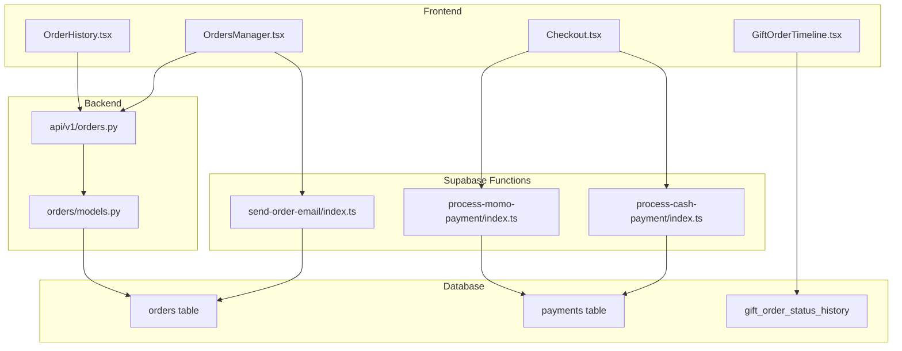
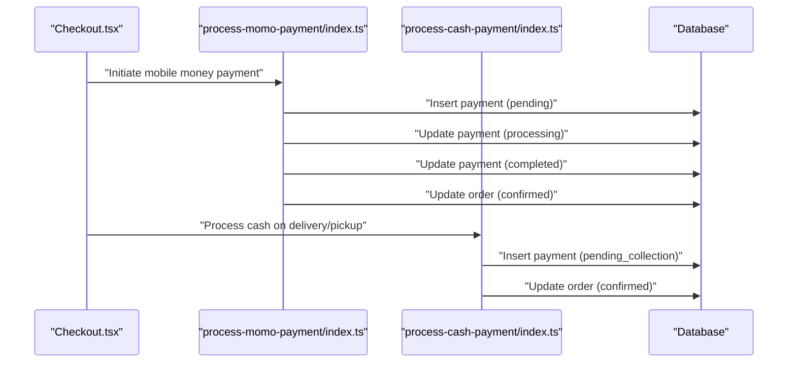
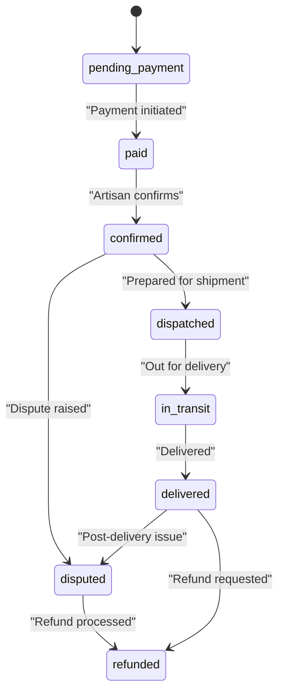
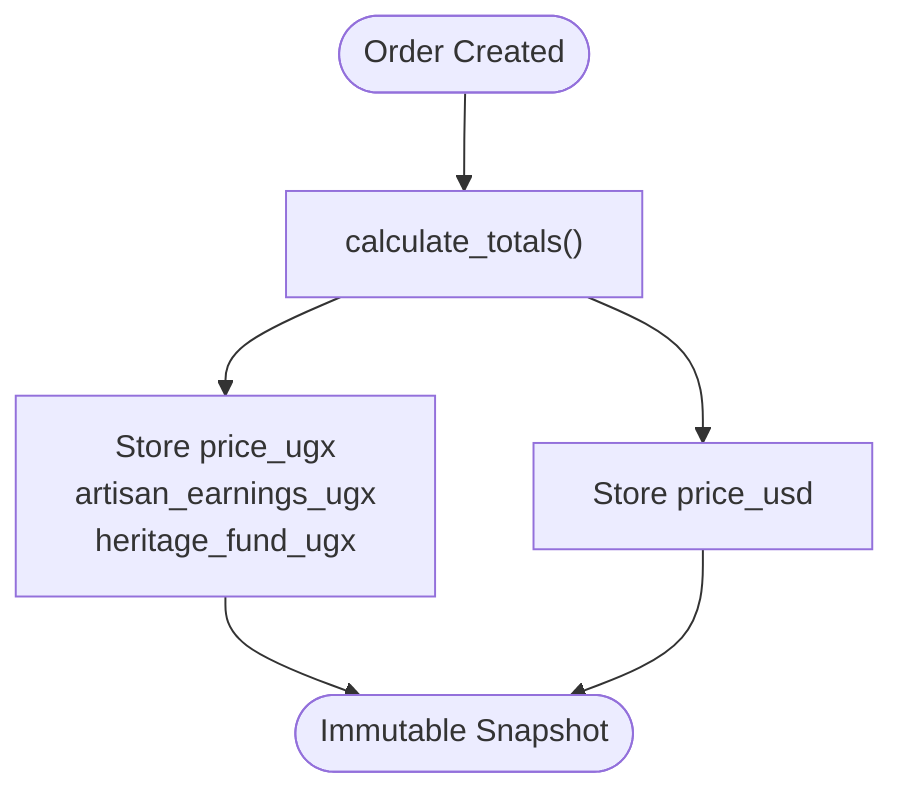
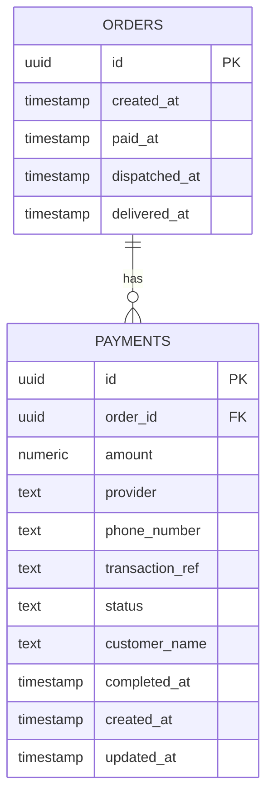
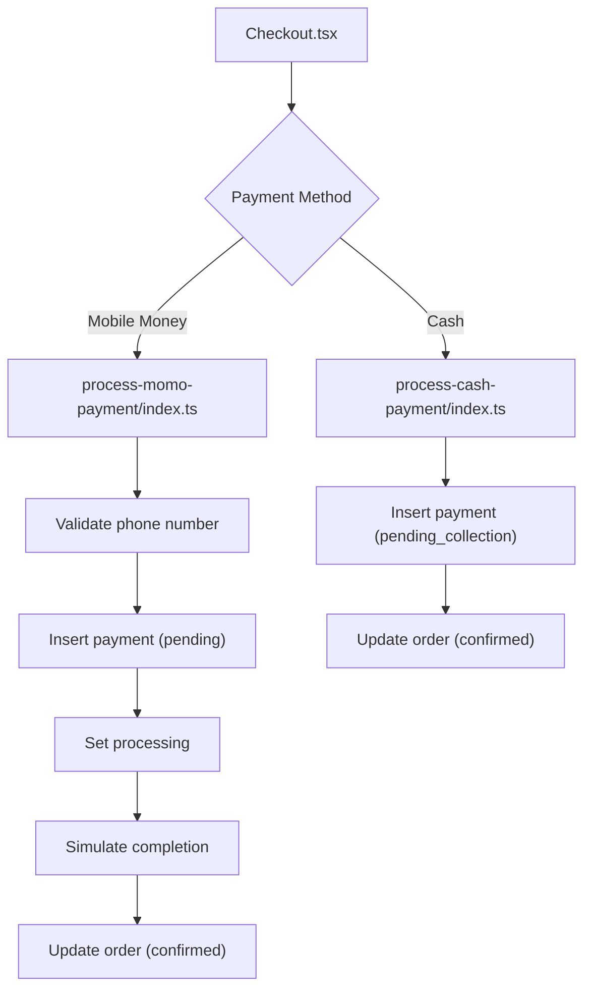
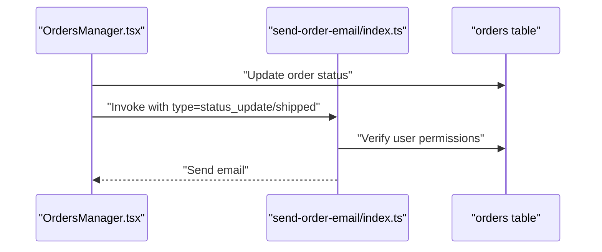
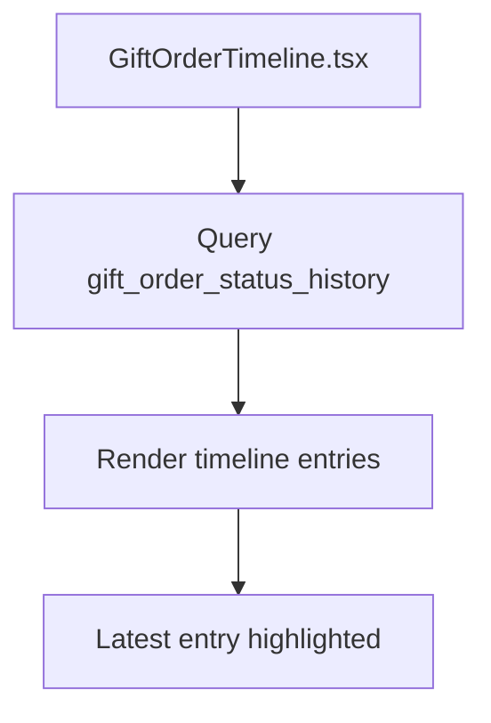
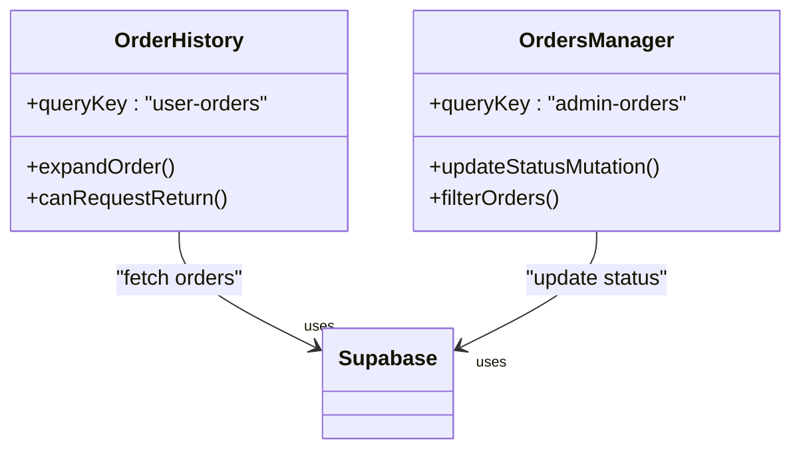
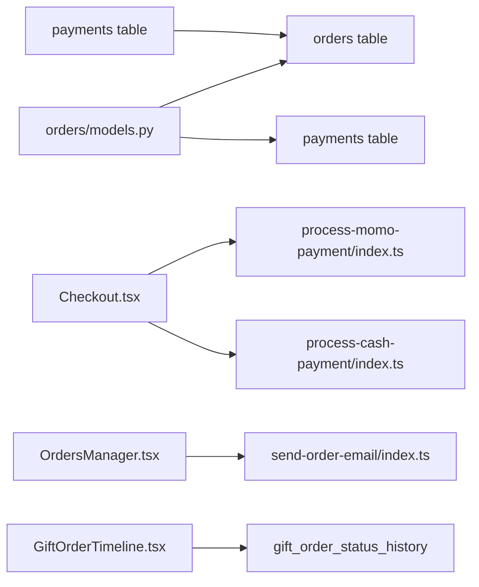

# Order Lifecycle Management

<cite>
**Referenced Files in This Document**
- [models.py](file://backend/apps/orders/models.py)
- [orders.py](file://backend/api/v1/orders.py)
- [process-momo-payment/index.ts](file://supabase/functions/process-momo-payment/index.ts)
- [process-cash-payment/index.ts](file://supabase/functions/process-cash-payment/index.ts)
- [send-order-email/index.ts](file://supabase/functions/send-order-email/index.ts)
- [20260110084208_19f31e38-2062-4a6a-a516-e5b9de4e3510.sql](file://supabase/migrations/20260110084208_19f31e38-2062-4a6a-a516-e5b9de4e3510.sql)
- [20260307151135_abb92613-d0a4-4ab6-8384-d241b138020b.sql](file://supabase/migrations/20260307151135_abb92613-d0a4-4ab6-8384-d241b138020b.sql)
- [OrderHistory.tsx](file://src/components/orders/OrderHistory.tsx)
- [OrdersManager.tsx](file://src/components/admin/OrdersManager.tsx)
- [Checkout.tsx](file://src/pages/Checkout.tsx)
- [GiftOrderTimeline.tsx](file://src/components/gifting/GiftOrderTimeline.tsx)
</cite>

## Table of Contents
1. [Introduction](#introduction)
2. [Project Structure](#project-structure)
3. [Core Components](#core-components)
4. [Architecture Overview](#architecture-overview)
5. [Detailed Component Analysis](#detailed-component-analysis)
6. [Dependency Analysis](#dependency-analysis)
7. [Performance Considerations](#performance-considerations)
8. [Troubleshooting Guide](#troubleshooting-guide)
9. [Conclusion](#conclusion)

## Introduction
This document describes the order lifecycle management system, covering the complete workflow from order placement through refund, including state transitions, business rules, validation logic, frozen financial snapshots, timestamps, audit trails, payouts, and integration with external payment providers. It also documents order timeline visualization, status notifications, and user interface components for order tracking.

## Project Structure
The order lifecycle spans three layers:
- Backend Django models define the order state machine, financial snapshot, and payout tracking.
- Supabase Edge Functions implement payment processing and notifications.
- Frontend components render order history, timelines, and admin controls.

**Diagram sources**
- [models.py:10-122](file://backend/apps/orders/models.py#L10-L122)
- [orders.py:1-18](file://backend/api/v1/orders.py#L1-L18)
- [process-momo-payment/index.ts:1-151](file://supabase/functions/process-momo-payment/index.ts#L1-L151)
- [process-cash-payment/index.ts:1-114](file://supabase/functions/process-cash-payment/index.ts#L1-L114)
- [send-order-email/index.ts:1-284](file://supabase/functions/send-order-email/index.ts#L1-L284)
- [20260110084208_19f31e38-2062-4a6a-a516-e5b9de4e3510.sql:1-45](file://supabase/migrations/20260110084208_19f31e38-2062-4a6a-a516-e5b9de4e3510.sql#L1-L45)
- [20260307151135_abb92613-d0a4-4ab6-8384-d241b138020b.sql:1-44](file://supabase/migrations/20260307151135_abb92613-d0a4-4ab6-8384-d241b138020b.sql#L1-L44)

**Section sources**
- [models.py:10-122](file://backend/apps/orders/models.py#L10-L122)
- [orders.py:1-18](file://backend/api/v1/orders.py#L1-L18)

## Core Components
- Order model defines the 8-state lifecycle, payment method enumeration, payout status, frozen financial snapshot, shipping metadata, and timestamps.
- Payments table tracks provider, transaction reference, status, and completion timestamps.
- Gift order status history table captures administrative and system-driven state changes for gift orders.
- Frontend components provide order history, admin management, checkout payment orchestration, and gift order timeline visualization.

**Section sources**
- [models.py:16-122](file://backend/apps/orders/models.py#L16-L122)
- [20260110084208_19f31e38-2062-4a6a-a516-e5b9de4e3510.sql:1-45](file://supabase/migrations/20260110084208_19f31e38-2062-4a6a-a516-e5b9de4e3510.sql#L1-L45)
- [20260307151135_abb92613-d0a4-4ab6-8384-d241b138020b.sql:1-44](file://supabase/migrations/20260307151135_abb92613-d0a4-4ab6-8384-d241b138020b.sql#L1-L44)

## Architecture Overview
The order lifecycle integrates frontend UI, backend models, and serverless functions:
- Checkout orchestrates payment via mobile money or cash-on-delivery/collection, invoking Supabase functions.
- Payment functions create payment records, update order status, and optionally collect pickup/delivery details.
- Email notifications are sent on status updates and shipping events.
- Admin UI updates order status and triggers notifications.
- Timeline components visualize gift order status history.

**Diagram sources**
- [Checkout.tsx:207-244](file://src/pages/Checkout.tsx#L207-L244)
- [process-momo-payment/index.ts:53-123](file://supabase/functions/process-momo-payment/index.ts#L53-L123)
- [process-cash-payment/index.ts:44-72](file://supabase/functions/process-cash-payment/index.ts#L44-L72)

## Detailed Component Analysis

### Order State Machine and Transitions
The order state machine defines eight states with typical progression and exceptions:
- pending_payment → paid → confirmed → dispatched → in_transit → delivered
- Additional terminal states: disputed, refunded

**Diagram sources**
- [models.py:16-25](file://backend/apps/orders/models.py#L16-L25)

**Section sources**
- [models.py:16-25](file://backend/apps/orders/models.py#L16-L25)

### Frozen Financial Snapshot
At order creation, immutable financial values are captured:
- Local currency and USD amounts
- Artisan earnings, platform commission, and heritage fund contributions
- Calculated during totals computation and stored for auditability

**Diagram sources**
- [models.py:111-122](file://backend/apps/orders/models.py#L111-L122)

**Section sources**
- [models.py:77-82](file://backend/apps/orders/models.py#L77-L82)
- [models.py:111-122](file://backend/apps/orders/models.py#L111-L122)

### Timestamp Tracking and Audit Trail
- created_at: order creation
- paid_at: set when payment completes
- dispatched_at: set when shipped
- delivered_at: set when delivered
- Payments table includes created_at, updated_at, and completed_at for reconciliation

**Diagram sources**
- [models.py:100-104](file://backend/apps/orders/models.py#L100-L104)
- [20260110084208_19f31e38-2062-4a6a-a516-e5b9de4e3510.sql:1-14](file://supabase/migrations/20260110084208_19f31e38-2062-4a6a-a516-e5b9de4e3510.sql#L1-L14)

**Section sources**
- [models.py:100-104](file://backend/apps/orders/models.py#L100-L104)
- [20260110084208_19f31e38-2062-4a6a-a516-e5b9de4e3510.sql:1-14](file://supabase/migrations/20260110084208_19f31e38-2062-4a6a-a516-e5b9de4e3510.sql#L1-L14)

### Payment Providers and Validation Logic
- Mobile Money (MTN MoMo/Airtel Money): Validates phone number format for Uganda, normalizes to international format, creates pending payment, sets processing/completed, and updates order to confirmed.
- Cash on Delivery/Pickup: Creates payment with pending_collection status, immediately confirms order, and optionally retrieves pickup location details.

**Diagram sources**
- [Checkout.tsx:207-244](file://src/pages/Checkout.tsx#L207-L244)
- [process-momo-payment/index.ts:33-123](file://supabase/functions/process-momo-payment/index.ts#L33-L123)
- [process-cash-payment/index.ts:44-72](file://supabase/functions/process-cash-payment/index.ts#L44-L72)

**Section sources**
- [process-momo-payment/index.ts:33-48](file://supabase/functions/process-momo-payment/index.ts#L33-L48)
- [process-momo-payment/index.ts:53-123](file://supabase/functions/process-momo-payment/index.ts#L53-L123)
- [process-cash-payment/index.ts:44-72](file://supabase/functions/process-cash-payment/index.ts#L44-L72)

### Notifications and Email Triggers
- Admin actions and shipping events trigger email notifications via a Supabase Edge Function.
- Emails include order-specific details and status-specific messaging.

**Diagram sources**
- [OrdersManager.tsx:117-152](file://src/components/admin/OrdersManager.tsx#L117-L152)
- [send-order-email/index.ts:165-281](file://supabase/functions/send-order-email/index.ts#L165-L281)

**Section sources**
- [OrdersManager.tsx:117-152](file://src/components/admin/OrdersManager.tsx#L117-L152)
- [send-order-email/index.ts:29-163](file://supabase/functions/send-order-email/index.ts#L29-L163)

### Order Timeline Visualization
- Gift order timeline displays chronological status changes with icons, labels, and timestamps.
- Uses a dedicated status history table with row-level security policies.

**Diagram sources**
- [GiftOrderTimeline.tsx:20-32](file://src/components/gifting/GiftOrderTimeline.tsx#L20-L32)
- [20260307151135_abb92613-d0a4-4ab6-8384-d241b138020b.sql:3-11](file://supabase/migrations/20260307151135_abb92613-d0a4-4ab6-8384-d241b138020b.sql#L3-L11)

**Section sources**
- [GiftOrderTimeline.tsx:6-14](file://src/components/gifting/GiftOrderTimeline.tsx#L6-L14)
- [20260307151135_abb92613-d0a4-4ab6-8384-d241b138020b.sql:1-44](file://supabase/migrations/20260307151135_abb92613-d0a4-4ab6-8384-d241b138020b.sql#L1-L44)

### Frontend Order Tracking Components
- OrderHistory.tsx: Lists orders with expandable details, return eligibility, and return request action.
- OrdersManager.tsx: Admin panel to filter, view, and update order statuses with real-time notifications.

**Diagram sources**
- [OrderHistory.tsx:59-118](file://src/components/orders/OrderHistory.tsx#L59-L118)
- [OrdersManager.tsx:58-152](file://src/components/admin/OrdersManager.tsx#L58-L152)

**Section sources**
- [OrderHistory.tsx:109-118](file://src/components/orders/OrderHistory.tsx#L109-L118)
- [OrdersManager.tsx:58-152](file://src/components/admin/OrdersManager.tsx#L58-L152)

## Dependency Analysis
- Backend models define the canonical state machine and financial snapshot.
- Supabase functions encapsulate payment provider logic and enforce validation.
- Frontend components depend on Supabase queries and function invocations.
- Database migrations define payment and status history tables with RLS.

**Diagram sources**
- [models.py:10-122](file://backend/apps/orders/models.py#L10-L122)
- [process-momo-payment/index.ts:1-151](file://supabase/functions/process-momo-payment/index.ts#L1-L151)
- [process-cash-payment/index.ts:1-114](file://supabase/functions/process-cash-payment/index.ts#L1-L114)
- [send-order-email/index.ts:1-284](file://supabase/functions/send-order-email/index.ts#L1-L284)
- [20260110084208_19f31e38-2062-4a6a-a516-e5b9de4e3510.sql:1-45](file://supabase/migrations/20260110084208_19f31e38-2062-4a6a-a516-e5b9de4e3510.sql#L1-L45)
- [20260307151135_abb92613-d0a4-4ab6-8384-d241b138020b.sql:1-44](file://supabase/migrations/20260307151135_abb92613-d0a4-4ab6-8384-d241b138020b.sql#L1-L44)

**Section sources**
- [models.py:10-122](file://backend/apps/orders/models.py#L10-L122)
- [20260110084208_19f31e38-2062-4a6a-a516-e5b9de4e3510.sql:1-45](file://supabase/migrations/20260110084208_19f31e38-2062-4a6a-a516-e5b9de4e3510.sql#L1-L45)
- [20260307151135_abb92613-d0a4-4ab6-8384-d241b138020b.sql:1-44](file://supabase/migrations/20260307151135_abb92613-d0a4-4ab6-8384-d241b138020b.sql#L1-L44)

## Performance Considerations
- Prefer batched queries for order lists and minimize payload sizes in frontend components.
- Use database indexes on frequently filtered columns (status, buyer_id, created_at).
- Offload long-running tasks (e.g., payment completion simulation) to background functions to avoid blocking requests.
- Cache static UI elements (e.g., status badges) to reduce re-renders.

## Troubleshooting Guide
Common issues and resolutions:
- Payment validation failures (mobile money): Verify phone number format and normalization logic.
- Cash payment errors: Confirm order exists and payment insertion succeeds before updating order status.
- Email notifications: Ensure user permissions and order ownership checks pass; inspect function logs for Resend API errors.
- Timeline visibility: Confirm RLS policies allow authenticated users to view their gift order history.

**Section sources**
- [process-momo-payment/index.ts:33-40](file://supabase/functions/process-momo-payment/index.ts#L33-L40)
- [process-cash-payment/index.ts:59-72](file://supabase/functions/process-cash-payment/index.ts#L59-L72)
- [send-order-email/index.ts:214-241](file://supabase/functions/send-order-email/index.ts#L214-L241)
- [20260307151135_abb92613-d0a4-4ab6-8384-d241b138020b.sql:15-28](file://supabase/migrations/20260307151135_abb92613-d0a4-4ab6-8384-d241b138020b.sql#L15-L28)

## Conclusion
The order lifecycle management system combines a robust state machine, immutable financial snapshots, comprehensive audit trails, and integrated payment/provider flows. Frontend components deliver a seamless user experience for tracking and administration, while Supabase functions ensure secure, validated, and auditable operations across the entire lifecycle.