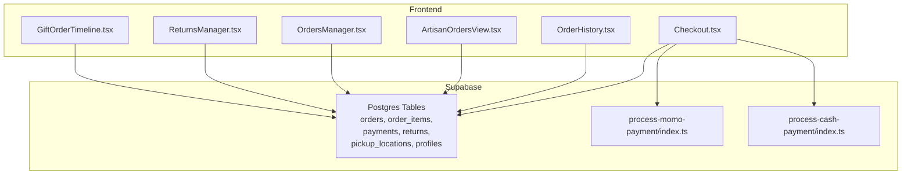
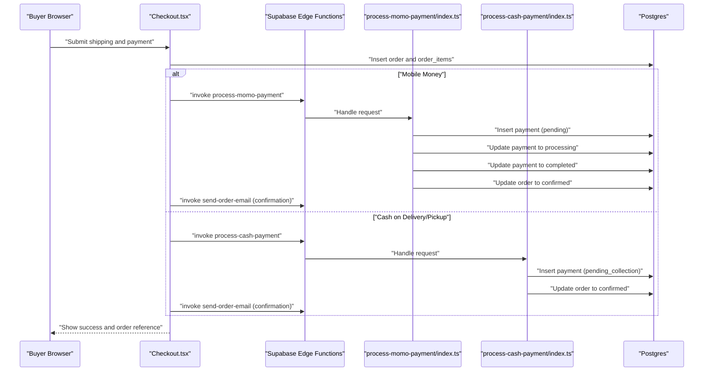
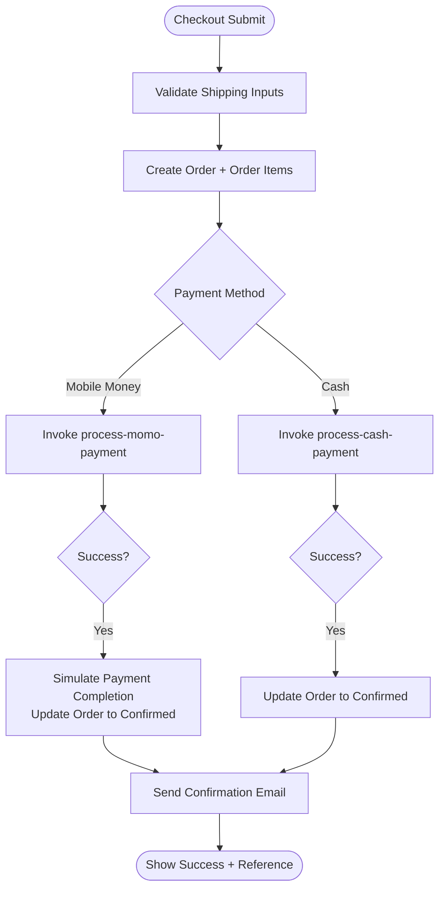
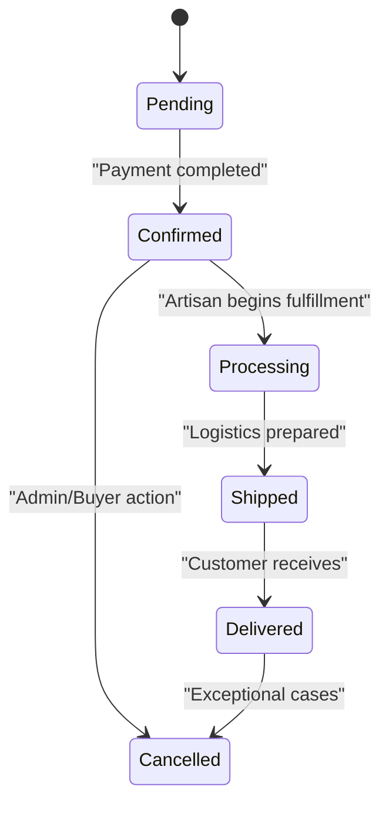
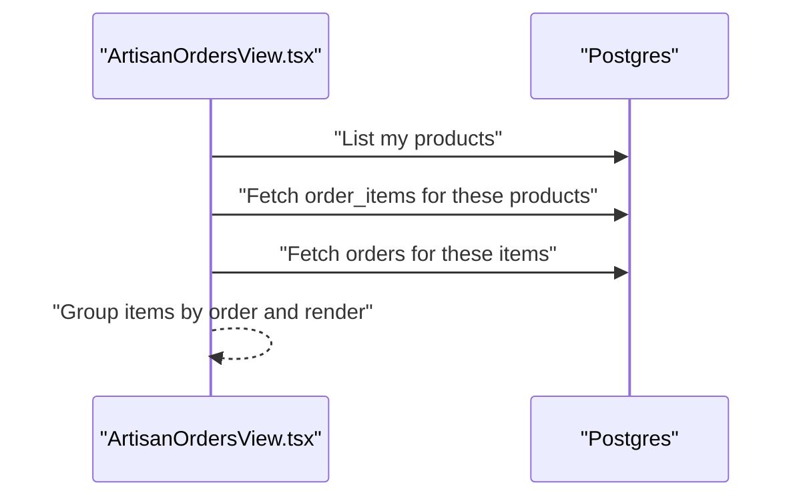
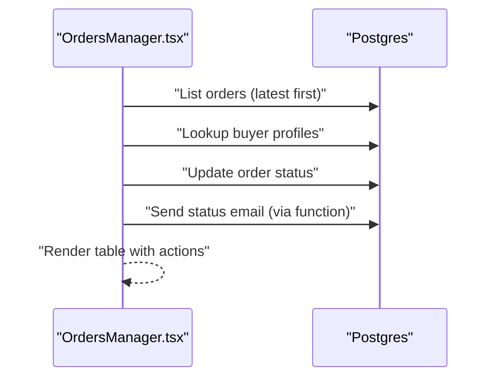
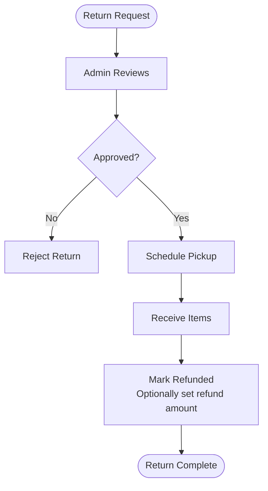
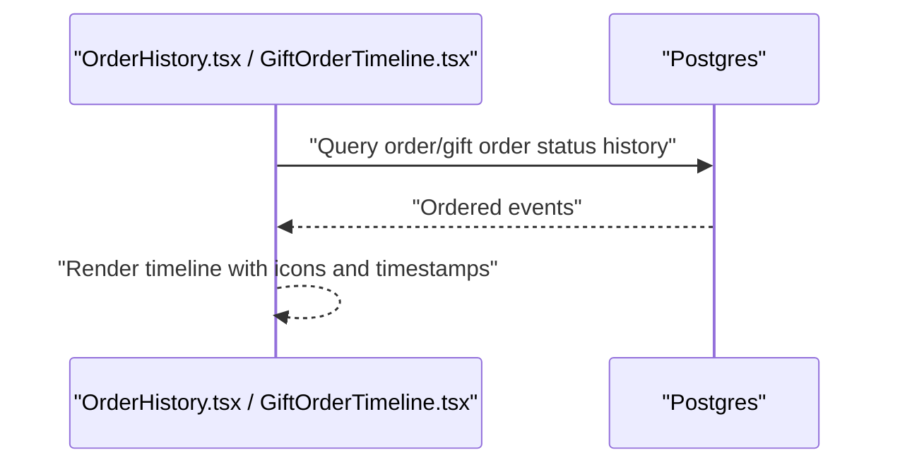
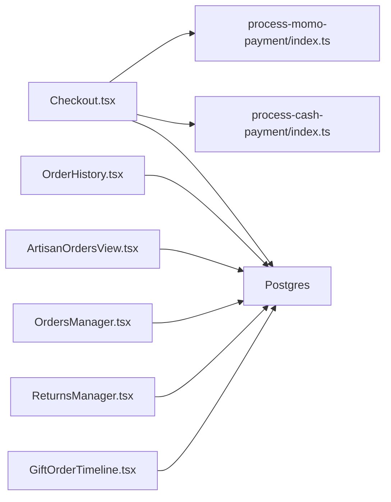

# Order Processing System

<cite>
**Referenced Files in This Document**
- [Checkout.tsx](file://src/pages/Checkout.tsx)
- [OrderHistory.tsx](file://src/components/orders/OrderHistory.tsx)
- [ArtisanOrdersView.tsx](file://src/components/business/ArtisanOrdersView.tsx)
- [OrdersManager.tsx](file://src/components/admin/OrdersManager.tsx)
- [ReturnsManager.tsx](file://src/components/admin/ReturnsManager.tsx)
- [GiftOrderTimeline.tsx](file://src/components/gifting/GiftOrderTimeline.tsx)
- [process-momo-payment/index.ts](file://supabase/functions/process-momo-payment/index.ts)
- [process-cash-payment/index.ts](file://supabase/functions/process-cash-payment/index.ts)
</cite>

## Table of Contents
1. [Introduction](#introduction)
2. [Project Structure](#project-structure)
3. [Core Components](#core-components)
4. [Architecture Overview](#architecture-overview)
5. [Detailed Component Analysis](#detailed-component-analysis)
6. [Dependency Analysis](#dependency-analysis)
7. [Performance Considerations](#performance-considerations)
8. [Troubleshooting Guide](#troubleshooting-guide)
9. [Conclusion](#conclusion)
10. [Appendices](#appendices)

## Introduction
This document describes the end-to-end order processing system, covering the buyer checkout journey, payment workflows, order status management, fulfillment coordination, and administrative oversight. It also documents return/refund processing, order timelines, notifications, and analytics hooks. The system integrates a frontend built with React and Supabase for real-time data and serverless functions for payment orchestration.

## Project Structure
The order processing system spans three layers:
- Frontend (React): Handles checkout, order history, artisan dashboards, admin tools, and gift order timelines.
- Backend (Supabase): Provides real-time Postgres tables for orders, payments, returns, and related entities; exposes serverless functions for payment initiation and completion.
- Integrations: Email notifications via Supabase Edge Functions and third-party payment providers (simulated for mobile money).

**Diagram sources**
- [Checkout.tsx:126-258](file://src/pages/Checkout.tsx#L126-L258)
- [OrderHistory.tsx:59-91](file://src/components/orders/OrderHistory.tsx#L59-L91)
- [ArtisanOrdersView.tsx:34-57](file://src/components/business/ArtisanOrdersView.tsx#L34-L57)
- [OrdersManager.tsx:58-101](file://src/components/admin/OrdersManager.tsx#L58-L101)
- [ReturnsManager.tsx:78-113](file://src/components/admin/ReturnsManager.tsx#L78-L113)
- [GiftOrderTimeline.tsx:21-32](file://src/components/gifting/GiftOrderTimeline.tsx#L21-L32)
- [process-momo-payment/index.ts:19-150](file://supabase/functions/process-momo-payment/index.ts#L19-L150)
- [process-cash-payment/index.ts:19-113](file://supabase/functions/process-cash-payment/index.ts#L19-L113)

**Section sources**
- [Checkout.tsx:126-258](file://src/pages/Checkout.tsx#L126-L258)
- [OrderHistory.tsx:59-91](file://src/components/orders/OrderHistory.tsx#L59-L91)
- [ArtisanOrdersView.tsx:34-57](file://src/components/business/ArtisanOrdersView.tsx#L34-L57)
- [OrdersManager.tsx:58-101](file://src/components/admin/OrdersManager.tsx#L58-L101)
- [ReturnsManager.tsx:78-113](file://src/components/admin/ReturnsManager.tsx#L78-L113)
- [GiftOrderTimeline.tsx:21-32](file://src/components/gifting/GiftOrderTimeline.tsx#L21-L32)
- [process-momo-payment/index.ts:19-150](file://supabase/functions/process-momo-payment/index.ts#L19-L150)
- [process-cash-payment/index.ts:19-113](file://supabase/functions/process-cash-payment/index.ts#L19-L113)

## Core Components
- Buyer checkout flow: Multi-step form collecting shipping, delivery/pickup, and payment preferences; invokes serverless payment functions; sends confirmation emails.
- Order lifecycle: Creation → Payment initiation → Status transitions → Fulfillment → Delivery.
- Payment workflows: Mobile money (simulated) and cash-on-delivery/pickup.
- Order management dashboards: Buyer order history, artisan order view, admin order management, and returns management.
- Timeline visualization: Order and gift order status timelines for transparency.
- Notifications: Email triggers for confirmation, status updates, and return actions.
- Returns/refunds: Admin-managed return lifecycle with approval, scheduling, receipt, refund, and rejection.

**Section sources**
- [Checkout.tsx:126-258](file://src/pages/Checkout.tsx#L126-L258)
- [OrderHistory.tsx:59-91](file://src/components/orders/OrderHistory.tsx#L59-L91)
- [ArtisanOrdersView.tsx:34-57](file://src/components/business/ArtisanOrdersView.tsx#L34-L57)
- [OrdersManager.tsx:58-101](file://src/components/admin/OrdersManager.tsx#L58-L101)
- [ReturnsManager.tsx:78-113](file://src/components/admin/ReturnsManager.tsx#L78-L113)
- [GiftOrderTimeline.tsx:21-32](file://src/components/gifting/GiftOrderTimeline.tsx#L21-L32)
- [process-momo-payment/index.ts:19-150](file://supabase/functions/process-momo-payment/index.ts#L19-L150)
- [process-cash-payment/index.ts:19-113](file://supabase/functions/process-cash-payment/index.ts#L19-L113)

## Architecture Overview
The system uses a reactive architecture:
- Frontend components query Supabase for real-time data and mutate state via serverless functions.
- Payment functions create payment records, update order statuses, and schedule background completion for mobile money.
- Notifications are triggered via Supabase Edge Functions for confirmation and status updates.
- Admin dashboards enable status updates and return management with email notifications.

**Diagram sources**
- [Checkout.tsx:126-258](file://src/pages/Checkout.tsx#L126-L258)
- [process-momo-payment/index.ts:19-150](file://supabase/functions/process-momo-payment/index.ts#L19-L150)
- [process-cash-payment/index.ts:19-113](file://supabase/functions/process-cash-payment/index.ts#L19-L113)

## Detailed Component Analysis

### Checkout and Payment Workflows
The checkout page orchestrates order creation and payment initiation:
- Validates shipping inputs and delivery/pickup selection.
- Creates order and order items in Supabase.
- Invokes serverless functions for payment processing.
- Sends confirmation email via Supabase Edge Function.
- Displays success and transaction reference.

**Diagram sources**
- [Checkout.tsx:126-258](file://src/pages/Checkout.tsx#L126-L258)
- [process-momo-payment/index.ts:19-150](file://supabase/functions/process-momo-payment/index.ts#L19-L150)
- [process-cash-payment/index.ts:19-113](file://supabase/functions/process-cash-payment/index.ts#L19-L113)

**Section sources**
- [Checkout.tsx:126-258](file://src/pages/Checkout.tsx#L126-L258)
- [process-momo-payment/index.ts:19-150](file://supabase/functions/process-momo-payment/index.ts#L19-L150)
- [process-cash-payment/index.ts:19-113](file://supabase/functions/process-cash-payment/index.ts#L19-L113)

### Order Lifecycle and Status Management
Order statuses observed in the UI and admin tools:
- pending, confirmed, processing, shipped, delivered, cancelled.

**Diagram sources**
- [OrdersManager.tsx:15-50](file://src/components/admin/OrdersManager.tsx#L15-L50)
- [OrderHistory.tsx:42-49](file://src/components/orders/OrderHistory.tsx#L42-L49)

**Section sources**
- [OrdersManager.tsx:15-50](file://src/components/admin/OrdersManager.tsx#L15-L50)
- [OrderHistory.tsx:42-49](file://src/components/orders/OrderHistory.tsx#L42-L49)

### Artisan Order Management Dashboard
Artisan view aggregates orders for their products, grouping by order and displaying status, totals, and delivery details.

**Diagram sources**
- [ArtisanOrdersView.tsx:34-57](file://src/components/business/ArtisanOrdersView.tsx#L34-L57)

**Section sources**
- [ArtisanOrdersView.tsx:34-57](file://src/components/business/ArtisanOrdersView.tsx#L34-L57)

### Admin Oversight Tools
Admin dashboard enables filtering, status updates, and viewing order details with buyer profiles and items.

**Diagram sources**
- [OrdersManager.tsx:58-152](file://src/components/admin/OrdersManager.tsx#L58-L152)

**Section sources**
- [OrdersManager.tsx:58-152](file://src/components/admin/OrdersManager.tsx#L58-L152)

### Returns and Refund Processing
Return lifecycle includes request, approval, scheduling pickup, receiving items, and refund processing with optional admin notes and refund amounts.

**Diagram sources**
- [ReturnsManager.tsx:138-148](file://src/components/admin/ReturnsManager.tsx#L138-L148)

**Section sources**
- [ReturnsManager.tsx:138-148](file://src/components/admin/ReturnsManager.tsx#L138-L148)

### Order Timeline Visualization
Buyers and stakeholders can view chronological status changes for regular and gift orders.

**Diagram sources**
- [OrderHistory.tsx:59-91](file://src/components/orders/OrderHistory.tsx#L59-L91)
- [GiftOrderTimeline.tsx:21-32](file://src/components/gifting/GiftOrderTimeline.tsx#L21-L32)

**Section sources**
- [OrderHistory.tsx:59-91](file://src/components/orders/OrderHistory.tsx#L59-L91)
- [GiftOrderTimeline.tsx:21-32](file://src/components/gifting/GiftOrderTimeline.tsx#L21-L32)

### Notification System
- Confirmation emails are sent after order placement.
- Status update emails are sent when orders change state.
- Return-related updates are supported via admin actions.

**Section sources**
- [Checkout.tsx:260-282](file://src/pages/Checkout.tsx#L260-L282)
- [OrdersManager.tsx:126-143](file://src/components/admin/OrdersManager.tsx#L126-L143)

## Dependency Analysis
- Frontend depends on Supabase client for queries and function invocations.
- Payment functions depend on Supabase service role keys and write to orders and payments tables.
- Admin tools depend on buyer profiles and order items for display and updates.
- Returns manager depends on return items and buyer profiles for display and updates.

**Diagram sources**
- [Checkout.tsx:126-258](file://src/pages/Checkout.tsx#L126-L258)
- [process-momo-payment/index.ts:19-150](file://supabase/functions/process-momo-payment/index.ts#L19-L150)
- [process-cash-payment/index.ts:19-113](file://supabase/functions/process-cash-payment/index.ts#L19-L113)
- [OrderHistory.tsx:59-91](file://src/components/orders/OrderHistory.tsx#L59-L91)
- [ArtisanOrdersView.tsx:34-57](file://src/components/business/ArtisanOrdersView.tsx#L34-L57)
- [OrdersManager.tsx:58-101](file://src/components/admin/OrdersManager.tsx#L58-L101)
- [ReturnsManager.tsx:78-113](file://src/components/admin/ReturnsManager.tsx#L78-L113)
- [GiftOrderTimeline.tsx:21-32](file://src/components/gifting/GiftOrderTimeline.tsx#L21-L32)

**Section sources**
- [Checkout.tsx:126-258](file://src/pages/Checkout.tsx#L126-L258)
- [process-momo-payment/index.ts:19-150](file://supabase/functions/process-momo-payment/index.ts#L19-L150)
- [process-cash-payment/index.ts:19-113](file://supabase/functions/process-cash-payment/index.ts#L19-L113)
- [OrderHistory.tsx:59-91](file://src/components/orders/OrderHistory.tsx#L59-L91)
- [ArtisanOrdersView.tsx:34-57](file://src/components/business/ArtisanOrdersView.tsx#L34-L57)
- [OrdersManager.tsx:58-101](file://src/components/admin/OrdersManager.tsx#L58-L101)
- [ReturnsManager.tsx:78-113](file://src/components/admin/ReturnsManager.tsx#L78-L113)
- [GiftOrderTimeline.tsx:21-32](file://src/components/gifting/GiftOrderTimeline.tsx#L21-L32)

## Performance Considerations
- Minimize round-trips by batching reads/writes (e.g., fetching buyer profiles once per batch).
- Use efficient filters and ordering (e.g., latest-first) to reduce payload sizes.
- Debounce search/filter inputs in admin dashboards.
- Offload long-running tasks (e.g., payment completion simulation) to background tasks to avoid blocking responses.
- Cache frequently accessed static data (e.g., product categories) in memory where appropriate.

## Troubleshooting Guide
Common issues and resolutions:
- Payment initiation fails: Verify phone number format for mobile money and check function logs for errors.
- Order not transitioning to confirmed: Ensure payment function completes and updates order status.
- Missing buyer emails: Confirm buyer profile exists and function invocation succeeds.
- Return state not updating: Check admin mutation and database permissions.

**Section sources**
- [process-momo-payment/index.ts:33-40](file://supabase/functions/process-momo-payment/index.ts#L33-L40)
- [process-momo-payment/index.ts:142-150](file://supabase/functions/process-momo-payment/index.ts#L142-L150)
- [process-cash-payment/index.ts:59-72](file://supabase/functions/process-cash-payment/index.ts#L59-L72)
- [OrdersManager.tsx:117-152](file://src/components/admin/OrdersManager.tsx#L117-L152)
- [ReturnsManager.tsx:115-136](file://src/components/admin/ReturnsManager.tsx#L115-L136)

## Conclusion
The order processing system provides a robust, real-time checkout experience with flexible payment options, transparent order timelines, and comprehensive dashboards for buyers, artisans, and administrators. Payment functions encapsulate provider-specific logic while maintaining consistent order and payment records. Admin tools streamline fulfillment and returns, and notifications keep stakeholders informed throughout the lifecycle.

## Appendices
- Audit trail: Order and return status histories are stored in dedicated tables for visibility.
- Frozen financial snapshots: Payments table captures provider, amount, and transaction reference for reconciliation.
- Analytics hooks: Admin dashboards expose counts and filters suitable for reporting; extend with additional metrics as needed.