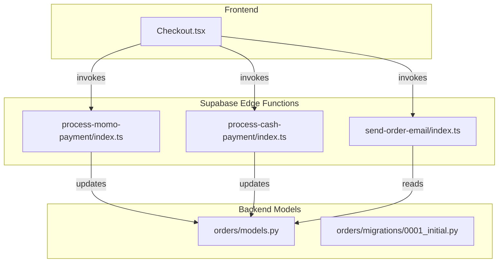
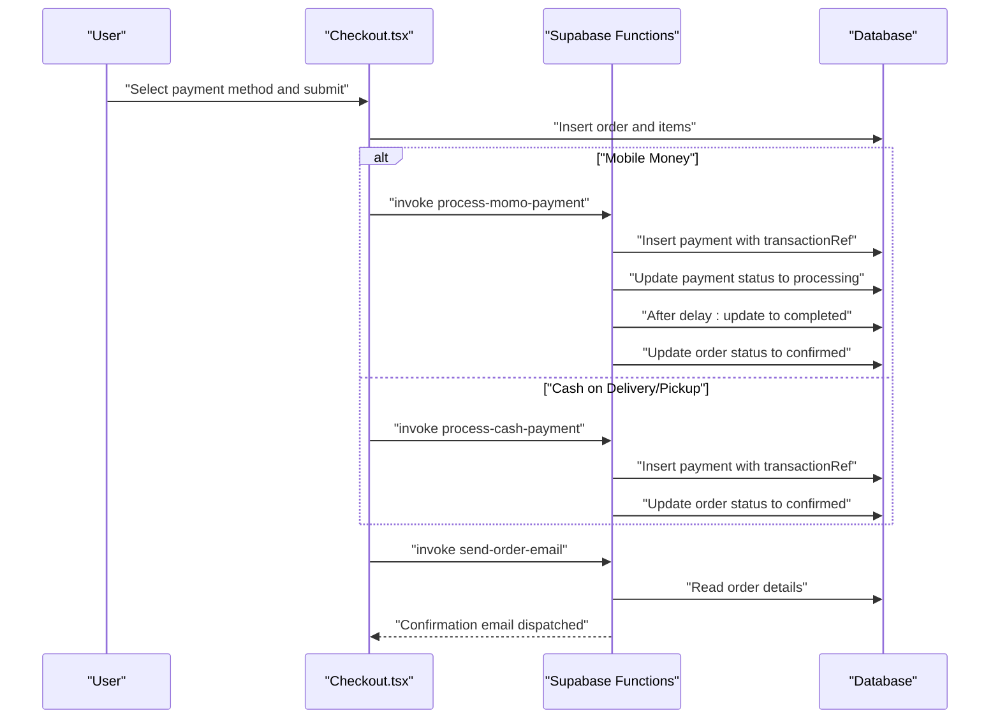
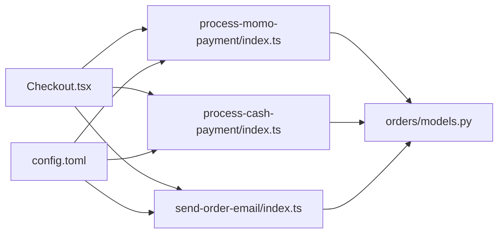

# Payment Integration

<cite>
**Referenced Files in This Document**
- [Checkout.tsx](file://apps/web/src/pages/Checkout.tsx)
- [process-momo-payment/index.ts](file://supabase/functions/process-momo-payment/index.ts)
- [process-cash-payment/index.ts](file://supabase/functions/process-cash-payment/index.ts)
- [send-order-email/index.ts](file://supabase/functions/send-order-email/index.ts)
- [config.toml](file://supabase/config.toml)
- [orders/models.py](file://backend/apps/orders/models.py)
- [orders/migrations/0001_initial.py](file://backend/apps/orders/migrations/0001_initial.py)
- [orders/__init__.py](file://backend/apps/orders/__init__.py)
- [payments/__init__.py](file://backend/apps/payments/__init__.py)
</cite>

## Table of Contents
1. [Introduction](#introduction)
2. [Project Structure](#project-structure)
3. [Core Components](#core-components)
4. [Architecture Overview](#architecture-overview)
5. [Detailed Component Analysis](#detailed-component-analysis)
6. [Dependency Analysis](#dependency-analysis)
7. [Performance Considerations](#performance-considerations)
8. [Troubleshooting Guide](#troubleshooting-guide)
9. [Conclusion](#conclusion)

## Introduction
This document describes the payment integration system within the order processing workflow. It covers supported payment methods, payment reference handling, transaction validation, and the integration with Supabase Edge Functions for payment initiation, status updates, and confirmation emails. It also documents payment method selection, reference generation, automated confirmation workflows, and error handling/retry/dispute resolution processes.

## Project Structure
The payment integration spans three main areas:
- Frontend checkout flow that collects shipping and payment details and invokes Supabase Edge Functions
- Supabase Edge Functions that process payments and update order/payment records
- Backend Django models that define order states and payment metadata

**Diagram sources**
- [Checkout.tsx](file://apps/web/src/pages/Checkout.tsx)
- [process-momo-payment/index.ts](file://supabase/functions/process-momo-payment/index.ts)
- [process-cash-payment/index.ts](file://supabase/functions/process-cash-payment/index.ts)
- [send-order-email/index.ts](file://supabase/functions/send-order-email/index.ts)
- [orders/models.py](file://backend/apps/orders/models.py)
- [orders/migrations/0001_initial.py](file://backend/apps/orders/migrations/0001_initial.py)

**Section sources**
- [Checkout.tsx](file://apps/web/src/pages/Checkout.tsx)
- [process-momo-payment/index.ts](file://supabase/functions/process-momo-payment/index.ts)
- [process-cash-payment/index.ts](file://supabase/functions/process-cash-payment/index.ts)
- [send-order-email/index.ts](file://supabase/functions/send-order-email/index.ts)
- [orders/models.py](file://backend/apps/orders/models.py)
- [orders/migrations/0001_initial.py](file://backend/apps/orders/migrations/0001_initial.py)

## Core Components
- Payment method selection and validation in the checkout flow
- Supabase Edge Function invocations for mobile money and cash payments
- Payment reference generation and persistence
- Automated order confirmation and email dispatch
- Order state transitions and payment metadata storage

**Section sources**
- [Checkout.tsx](file://apps/web/src/pages/Checkout.tsx)
- [process-momo-payment/index.ts](file://supabase/functions/process-momo-payment/index.ts)
- [process-cash-payment/index.ts](file://supabase/functions/process-cash-payment/index.ts)
- [orders/models.py](file://backend/apps/orders/models.py)

## Architecture Overview
The payment flow begins in the frontend checkout, which gathers shipping and payment details. Based on the chosen method, the frontend invokes a Supabase Edge Function. The function validates inputs, creates a payment record with a generated reference, and simulates payment processing. Upon completion, the function updates the payment and order statuses. Finally, a confirmation email is dispatched via another Edge Function.

**Diagram sources**
- [Checkout.tsx](file://apps/web/src/pages/Checkout.tsx)
- [process-momo-payment/index.ts](file://supabase/functions/process-momo-payment/index.ts)
- [process-cash-payment/index.ts](file://supabase/functions/process-cash-payment/index.ts)
- [send-order-email/index.ts](file://supabase/functions/send-order-email/index.ts)
- [orders/models.py](file://backend/apps/orders/models.py)

## Detailed Component Analysis

### Frontend Checkout and Payment Method Selection
- Supports two payment methods:
  - Mobile Money (MTN MoMo or Airtel Money)
  - Cash on Delivery or Pickup
- Validates shipping information and delivery/pickup selection
- Creates order and order items in the database
- Invokes Supabase Edge Functions based on the selected method
- Displays processing state and transaction reference for mobile money
- Sends confirmation email after successful payment

Key behaviors:
- Payment method choice drives which function is invoked
- Mobile Money provider selection determines the provider-specific message
- Transaction reference is stored in the payment record and displayed to the user
- Order status transitions to confirmed upon successful payment

**Section sources**
- [Checkout.tsx](file://apps/web/src/pages/Checkout.tsx)

### Supabase Edge Function: process-momo-payment
Responsibilities:
- Validate phone number format for Uganda
- Normalize phone number to international format
- Generate a unique transaction reference
- Insert a payment record with status pending
- Simulate payment request and update status to processing
- Background task to complete payment after a delay and update order status to confirmed
- Return success payload with transaction reference and provider info

Error handling:
- Returns structured error responses for invalid inputs or internal failures

**Section sources**
- [process-momo-payment/index.ts](file://supabase/functions/process-momo-payment/index.ts)

### Supabase Edge Function: process-cash-payment
Responsibilities:
- Generate a unique transaction reference for cash payments
- Insert a payment record for cash on delivery/pickup
- Update order status to confirmed immediately
- Return success payload with transaction reference

**Section sources**
- [process-cash-payment/index.ts](file://supabase/functions/process-cash-payment/index.ts)

### Email Dispatch: send-order-email
Responsibilities:
- Dispatches a confirmation email after payment success
- Reads order details from the database
- Builds email content with order summary and shipping details

**Section sources**
- [send-order-email/index.ts](file://supabase/functions/send-order-email/index.ts)

### Backend Models: Order State Machine and Payment Metadata
- Defines order status choices including pending_payment, paid, confirmed, dispatched, in_transit, delivered, disputed, refunded
- Defines payment method choices including stripe, momo, airtel, ton
- Stores payment_reference for audit and reconciliation

Implications:
- Order state transitions align with payment outcomes
- Payment method and reference enable reconciliation and dispute resolution

**Section sources**
- [orders/models.py](file://backend/apps/orders/models.py)
- [orders/migrations/0001_initial.py](file://backend/apps/orders/migrations/0001_initial.py)

### Payment Reference Handling and Validation
- Mobile Money: transaction reference format starts with a prefix followed by timestamp and random alphanumeric suffix
- Cash Payment: transaction reference format starts with a prefix followed by timestamp and random alphanumeric suffix
- References are persisted in the payments table and displayed to the user during processing and success states

Validation:
- Phone number format validated against a regex for Uganda mobile numbers
- Inputs sanitized and normalized before payment processing

**Section sources**
- [process-momo-payment/index.ts](file://supabase/functions/process-momo-payment/index.ts)
- [process-cash-payment/index.ts](file://supabase/functions/process-cash-payment/index.ts)

### Automated Payment Confirmation Workflows
- Mobile Money: function sets status to processing, then completes after a background delay, updating both payment and order statuses
- Cash Payment: function immediately confirms the order upon successful creation of the payment record
- Confirmation email is dispatched after successful payment completion

**Section sources**
- [process-momo-payment/index.ts](file://supabase/functions/process-momo-payment/index.ts)
- [process-cash-payment/index.ts](file://supabase/functions/process-cash-payment/index.ts)
- [send-order-email/index.ts](file://supabase/functions/send-order-email/index.ts)

### Supported Payment Methods
- Stripe: present in model choices for payment_method
- MTN MoMo: supported via process-momo-payment function
- Airtel Money: supported via process-momo-payment function
- TON Crypto: present in model choices for payment_method

Note: While Stripe and TON Crypto are modeled as supported payment methods, the current Edge Function implementations focus on mobile money and cash payments. Stripe and TON Crypto integrations would require additional function implementations mirroring the existing patterns.

**Section sources**
- [orders/models.py](file://backend/apps/orders/models.py)
- [orders/migrations/0001_initial.py](file://backend/apps/orders/migrations/0001_initial.py)
- [process-momo-payment/index.ts](file://supabase/functions/process-momo-payment/index.ts)
- [process-cash-payment/index.ts](file://supabase/functions/process-cash-payment/index.ts)

### Webhook Handling and Status Updates
- Current implementation simulates payment completion after a fixed delay
- Production readiness requires integrating with provider webhooks to update payment and order statuses asynchronously
- Webhook verification should be enabled and validated before updating records

[No sources needed since this section provides general guidance]

### Error Handling, Retry Mechanisms, and Dispute Resolution
- Frontend error handling displays user-friendly messages and resets to the payment step on failure
- Edge Functions return structured errors for invalid inputs and internal failures
- Retry mechanisms:
  - Mobile Money: re-invoke the process-momo-payment function if the simulated background task did not complete
  - Cash Payment: re-invoke the process-cash-payment function if the order status was not updated
- Dispute resolution:
  - Use payment_reference to reconcile disputes
  - Update order status to disputed and refund accordingly
  - Maintain audit trail in the payments table

**Section sources**
- [Checkout.tsx](file://apps/web/src/pages/Checkout.tsx)
- [process-momo-payment/index.ts](file://supabase/functions/process-momo-payment/index.ts)
- [process-cash-payment/index.ts](file://supabase/functions/process-cash-payment/index.ts)
- [orders/models.py](file://backend/apps/orders/models.py)

## Dependency Analysis
The payment integration depends on:
- Supabase Edge Functions for payment processing and email dispatch
- Database models for order and payment state management
- Environment configuration for function access

**Diagram sources**
- [Checkout.tsx](file://apps/web/src/pages/Checkout.tsx)
- [process-momo-payment/index.ts](file://supabase/functions/process-momo-payment/index.ts)
- [process-cash-payment/index.ts](file://supabase/functions/process-cash-payment/index.ts)
- [send-order-email/index.ts](file://supabase/functions/send-order-email/index.ts)
- [orders/models.py](file://backend/apps/orders/models.py)
- [config.toml](file://supabase/config.toml)

**Section sources**
- [Checkout.tsx](file://apps/web/src/pages/Checkout.tsx)
- [process-momo-payment/index.ts](file://supabase/functions/process-momo-payment/index.ts)
- [process-cash-payment/index.ts](file://supabase/functions/process-cash-payment/index.ts)
- [send-order-email/index.ts](file://supabase/functions/send-order-email/index.ts)
- [orders/models.py](file://backend/apps/orders/models.py)
- [config.toml](file://supabase/config.toml)

## Performance Considerations
- Asynchronous background tasks prevent blocking the payment initiation response
- Edge Functions should minimize synchronous I/O and rely on database updates for state changes
- Consider caching frequently accessed order/payment data to reduce latency

[No sources needed since this section provides general guidance]

## Troubleshooting Guide
Common issues and resolutions:
- Invalid phone number format: Ensure the phone number matches the Uganda mobile pattern and includes the country code
- Payment initiation failures: Verify Supabase environment variables and function permissions
- Missing order or payment records: Confirm that order creation precedes function invocation
- Email dispatch failures: Check function logs and recipient email validity

**Section sources**
- [process-momo-payment/index.ts](file://supabase/functions/process-momo-payment/index.ts)
- [process-cash-payment/index.ts](file://supabase/functions/process-cash-payment/index.ts)
- [config.toml](file://supabase/config.toml)

## Conclusion
The payment integration provides a clear, extensible foundation for processing orders via mobile money and cash. The frontend checkout orchestrates payment initiation, while Supabase Edge Functions manage payment records and order state transitions. The backend models define a robust state machine and payment metadata for reconciliation and dispute resolution. To reach production parity, integrate provider webhooks, enable JWT verification for functions, and implement provider-specific payment flows for Stripe and TON Crypto.