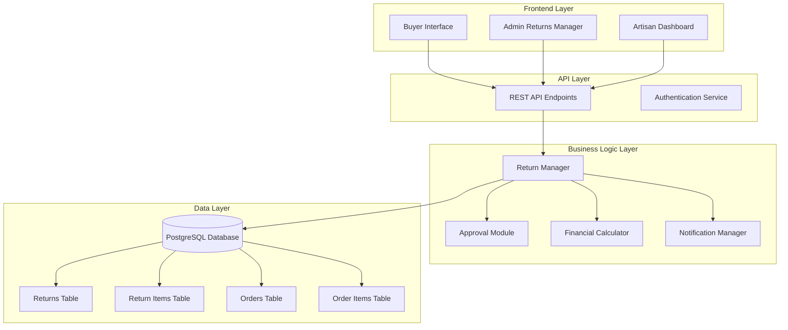
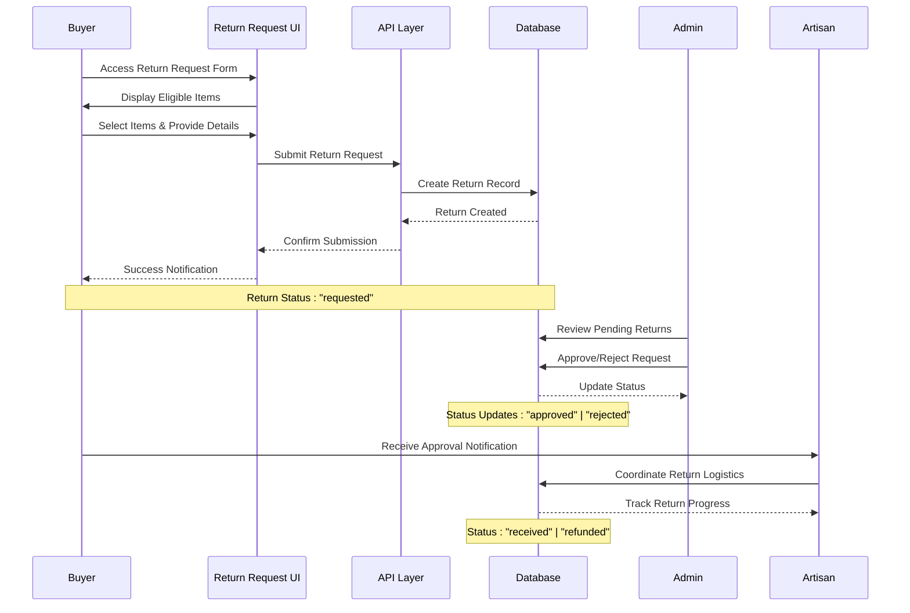
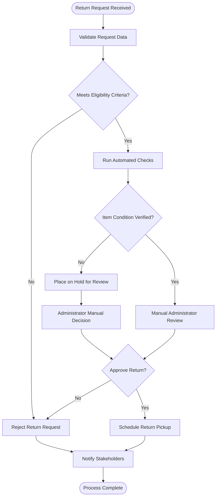
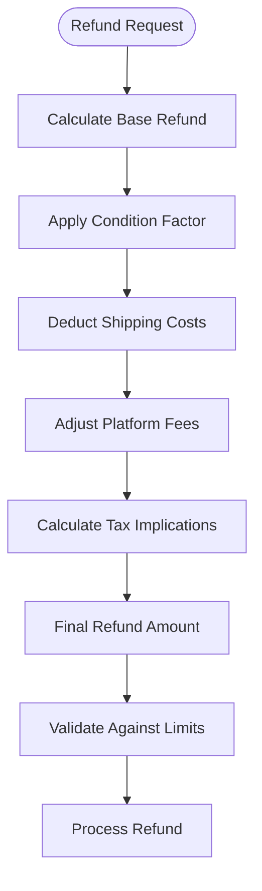
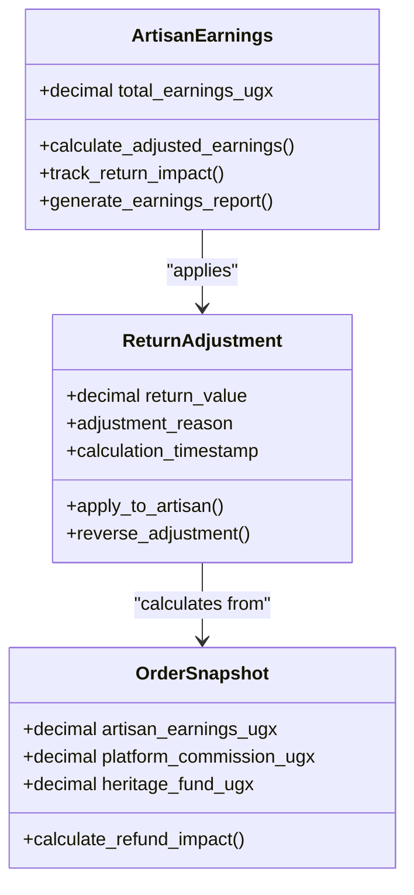
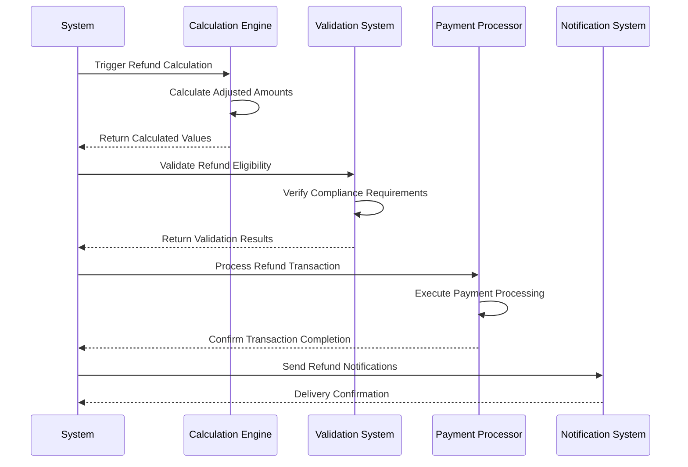
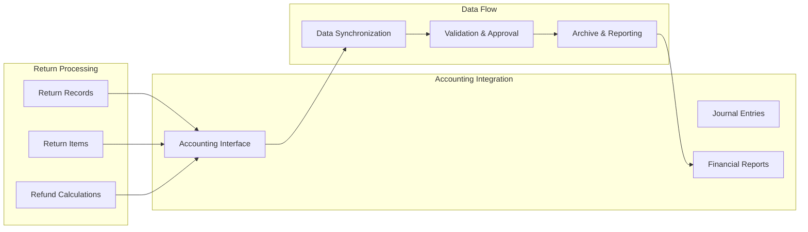

# Return & Refund System

<cite>
**Referenced Files in This Document**
- [ReturnsManager.tsx](file://apps/web/src/components/admin/ReturnsManager.tsx)
- [useReturns.tsx](file://apps/web/src/hooks/useReturns.tsx)
- [ReturnRequestDialog.tsx](file://apps/web/src/components/orders/ReturnRequestDialog.tsx)
- [orders/models.py](file://backend/apps/orders/models.py)
- [artisans/models.py](file://backend/apps/artisans/models.py)
- [20260107224910_0b6f10e2-c8bb-49bb-ba91-d7b9b48cd27c.sql](file://supabase/migrations/20260107224910_0b6f10e2-c8bb-49bb-ba91-d7b9b48cd27c.sql)
- [20260312151001_0ad1fffe-4364-4902-9212-6c6e1aeb1f08.sql](file://supabase/migrations/20260312151001_0ad1fffe-4364-4902-9212-6c6e1aeb1f08.sql)
</cite>

## Table of Contents
1. [Introduction](#introduction)
2. [System Architecture](#system-architecture)
3. [Core Components](#core-components)
4. [Return Request Workflow](#return-request-workflow)
5. [Eligibility Criteria](#eligibility-criteria)
6. [Approval Process](#approval-process)
7. [Refund Calculation Methodology](#refund-calculation-methodology)
8. [Platform Commission Adjustments](#platform-commission-adjustments)
9. [Artisan Earnings Recalculation](#artisan-earnings-recalculation)
10. [Return Shipping Coordination](#return-shipping-coordination)
11. [Item Inspection Requirements](#item-inspection-requirements)
12. [Automated Refund Processing](#automated-refund-processing)
13. [Dispute Resolution](#dispute-resolution)
14. [Return Policy Enforcement](#return-policy-enforcement)
15. [Accounting System Integration](#accounting-system-integration)
16. [Troubleshooting Guide](#troubleshooting-guide)
17. [Conclusion](#conclusion)

## Introduction

The Return & Refund System is a comprehensive solution designed to manage the complete lifecycle of product returns within the Empindu marketplace ecosystem. This system integrates buyer-initiated return requests, artisan approvals, and administrative oversight to ensure fair and efficient return processing while maintaining accurate financial records and platform compliance.

The system operates on a multi-stakeholder model involving buyers, artisans, and administrators, each with distinct roles and permissions in the return process. It encompasses sophisticated financial calculations, inventory tracking, and automated workflows to streamline return operations while ensuring transparency and accountability.

## System Architecture

The Return & Refund System follows a distributed architecture pattern with clear separation of concerns across frontend, backend, and database layers. The system leverages Supabase for real-time database operations and authentication, Django for backend processing, and React for frontend user interfaces.

**Diagram sources**
- [ReturnsManager.tsx:68-413](file://apps/web/src/components/admin/ReturnsManager.tsx#L68-L413)
- [useReturns.tsx:44-133](file://apps/web/src/hooks/useReturns.tsx#L44-L133)
- [ReturnRequestDialog.tsx:45-258](file://apps/web/src/components/orders/ReturnRequestDialog.tsx#L45-L258)

The architecture ensures scalability, maintainability, and real-time synchronization across all system components. The modular design allows for independent development and deployment of individual system components while maintaining cohesive functionality.

## Core Components

### Frontend Components

The frontend layer consists of three primary components that serve different stakeholder groups:

**Buyer Return Request Interface**: Provides an intuitive form for customers to initiate return requests, select items, specify reasons, and upload supporting documentation.

**Admin Returns Management**: Offers comprehensive oversight capabilities for platform administrators to monitor, approve, reject, and track all return requests through a centralized dashboard.

**Artisan Return Processing**: Delivers artisan-specific interfaces for managing return-related communications and coordinating return logistics.

### Backend Services

**Return Processing Engine**: Manages the core business logic for return request validation, approval workflows, and financial calculations.

**Approval Decision System**: Implements automated and manual approval mechanisms based on predefined criteria and business rules.

**Financial Calculation Engine**: Handles complex monetary computations including refund amounts, commission adjustments, and artisan earnings recalculations.

**Notification System**: Coordinates automated communications between stakeholders throughout the return process.

### Database Schema

The system utilizes a normalized relational database design with strict referential integrity and row-level security policies to ensure data consistency and privacy.

**Section sources**
- [ReturnsManager.tsx:17-46](file://apps/web/src/components/admin/ReturnsManager.tsx#L17-L46)
- [useReturns.tsx:6-31](file://apps/web/src/hooks/useReturns.tsx#L6-L31)
- [ReturnRequestDialog.tsx:13-27](file://apps/web/src/components/orders/ReturnRequestDialog.tsx#L13-L27)

## Return Request Workflow

The return request workflow follows a structured seven-stage process designed to balance customer satisfaction with business integrity and operational efficiency.

**Diagram sources**
- [ReturnRequestDialog.tsx:73-149](file://apps/web/src/components/orders/ReturnRequestDialog.tsx#L73-L149)
- [useReturns.tsx:49-107](file://apps/web/src/hooks/useReturns.tsx#L49-L107)
- [ReturnsManager.tsx:138-148](file://apps/web/src/components/admin/ReturnsManager.tsx#L138-L148)

### Stage 1: Request Initiation
Buyers access the return request interface through their order history, selecting eligible items and providing detailed reasons for returns. The system validates item eligibility and presents available return reasons.

### Stage 2: Administrative Review
Administrators receive notifications for pending return requests, reviewing eligibility criteria and product conditions before making approval decisions.

### Stage 3: Artisan Coordination
Approved returns trigger artisan notifications for return logistics coordination, including shipping instructions and return address management.

### Stage 4: Item Receipt & Inspection
Artisans receive returned items and conduct quality inspections, documenting item conditions and any discrepancies.

### Stage 5: Refund Processing
Successful inspections trigger automated refund processing, with financial adjustments to platform commissions and artisan earnings.

### Stage 6: Completion Tracking
The system tracks refund completion and provides final notifications to all stakeholders.

**Section sources**
- [ReturnRequestDialog.tsx:45-258](file://apps/web/src/components/orders/ReturnRequestDialog.tsx#L45-L258)
- [useReturns.tsx:44-133](file://apps/web/src/hooks/useReturns.tsx#L44-L133)
- [ReturnsManager.tsx:68-413](file://apps/web/src/components/admin/ReturnsManager.tsx#L68-L413)

## Eligibility Criteria

The system implements comprehensive eligibility criteria to ensure fair and sustainable return operations while protecting business interests and maintaining product quality standards.

### Product Eligibility Requirements

**Returnable Items**: Only items marked as returnable in the product catalog can be processed through the return system. This designation prevents returns for non-returnable or customized items.

**Condition Standards**: Items must meet specific condition requirements based on their return classification:
- Unopened/Sealed: Original packaging intact
- Like New: Minimal wear, unused condition
- Used: Acceptable wear for second-hand items
- Damaged: Evidence of damage requiring replacement

### Timeline Constraints

**Purchase-to-Return Window**: Returns must be initiated within 30 days of purchase completion, ensuring timely processing while allowing reasonable consideration periods.

**Delivery Verification**: Items must be delivered before return requests can be processed, preventing returns for undelivered orders.

### Order History Validation

**Purchase Verification**: System validates that the requesting user is the original purchaser, preventing fraudulent return attempts.

**Order Completeness**: Only fully paid and completed orders qualify for returns, excluding pending or partially processed orders.

### Return Reason Classification

The system categorizes return reasons to facilitate appropriate processing and analytics:
- Defective/Damaged Products
- Not as Described
- Wrong Item Received
- Quality Issues
- Change of Mind
- Other Reasons

**Section sources**
- [ReturnRequestDialog.tsx:53-53](file://apps/web/src/components/orders/ReturnRequestDialog.tsx#L53-L53)
- [useReturns.tsx:135-150](file://apps/web/src/hooks/useReturns.tsx#L135-L150)

## Approval Process

The approval process incorporates both automated validation and manual oversight to ensure consistent, fair decision-making across all return requests.

**Diagram sources**
- [ReturnsManager.tsx:138-148](file://apps/web/src/components/admin/ReturnsManager.tsx#L138-L148)
- [useReturns.tsx:96-107](file://apps/web/src/hooks/useReturns.tsx#L96-L107)

### Automated Validation Checks

**Data Integrity Verification**: System validates all required fields and data formats before proceeding with manual review.

**Eligibility Rule Engine**: Automated checks verify product returnability, purchase history, and timeline compliance.

**Condition Matching**: Initial item condition assessment against return request specifications.

### Manual Review Process

**Administrator Dashboard**: Centralized interface for reviewing pending returns with comprehensive item and order details.

**Decision Tools**: Administrators can approve, reject, or place returns on hold with detailed note-taking capabilities.

**Escalation Path**: Complex cases can be escalated to senior administrators or specialized teams.

### Status Management

**Real-time Updates**: Automatic status updates propagate to all stakeholders through the notification system.

**Audit Trail**: Complete logging of all approval decisions with timestamps and rationale.

**Exception Handling**: Special circumstances trigger additional verification steps or supervisor approval requirements.

**Section sources**
- [ReturnsManager.tsx:78-136](file://apps/web/src/components/admin/ReturnsManager.tsx#L78-L136)
- [ReturnsManager.tsx:164-169](file://apps/web/src/components/admin/ReturnsManager.tsx#L164-L169)

## Refund Calculation Methodology

The refund calculation methodology ensures accurate financial processing while maintaining transparency and fairness across all return scenarios. The system employs a tiered calculation approach that considers multiple factors including item value, condition, and applicable fees.

### Base Refund Determination

**Item Value Calculation**: Refund amounts are calculated based on the original item purchase price, adjusted for quantity and any applicable discounts or promotions.

**Condition-Based Adjustments**: Item condition significantly impacts refund amounts:
- Unopened/Sealed: Full item value minus shipping costs
- Like New: 90% of item value minus shipping costs
- Used: 75% of item value minus shipping costs
- Damaged: 50% of item value minus shipping costs

**Shipping Cost Recovery**: Return shipping costs are typically recovered from the refund amount, with buyers responsible for return shipping unless otherwise specified.

### Platform Fee Integration

**Commission Adjustment**: Platform commission amounts are recalculated based on the returned item value, with proportional refunds processed to maintain financial accuracy.

**Heritage Fund Considerations**: Cultural heritage fund contributions are adjusted according to return value and applicable regulations.

**Multi-Currency Handling**: Refund calculations accommodate multiple currency denominations with real-time exchange rate integration.

### Advanced Calculation Features

**Partial Returns**: For partial returns, calculations are prorated based on the proportion of items being returned.

**Bundle Adjustments**: Multi-item purchases require coordinated calculations considering individual item values and conditions.

**Tax Implications**: Applicable taxes are recalculated and adjusted according to return circumstances.

**Diagram sources**
- [orders/models.py:111-122](file://backend/apps/orders/models.py#L111-L122)

**Section sources**
- [orders/models.py:77-122](file://backend/apps/orders/models.py#L77-L122)
- [ReturnsManager.tsx:150-162](file://apps/web/src/components/admin/ReturnsManager.tsx#L150-L162)

## Platform Commission Adjustments

Platform commission adjustments represent a critical component of the return processing system, ensuring that the marketplace maintains financial integrity while fairly compensating all stakeholders.

### Commission Recalculation Process

**Proportional Adjustment**: Platform commissions are recalculated based on the returned item value, with proportional reductions applied to maintain accurate revenue attribution.

**Time-Based Allocation**: Commission amounts are allocated based on the time elapsed between purchase and return, accounting for platform service duration.

**Multi-Tier Commission Structures**: Complex commission structures with varying rates for different product categories or seller tiers require sophisticated recalculation algorithms.

### Revenue Distribution Rebalancing

**Dynamic Redistribution**: Returned items trigger dynamic redistribution of platform revenue among successful sales, maintaining accurate financial reporting.

**Settlement Adjustments**: Monthly settlement processes incorporate return adjustments to ensure accurate profit and loss statements.

**Reporting Modifications**: Financial reports are automatically updated to reflect commission adjustments from return activities.

### Compliance and Audit Requirements

**Regulatory Adherence**: Commission adjustments comply with applicable financial regulations and tax requirements across operating jurisdictions.

**Audit Trail Maintenance**: Complete documentation of all commission adjustment calculations supports regulatory audits and internal compliance reviews.

**Dispute Resolution Support**: Detailed commission adjustment records facilitate resolution of billing disputes and merchant inquiries.

**Section sources**
- [orders/models.py:115-121](file://backend/apps/orders/models.py#L115-L121)

## Artisan Earnings Recalculation

Artisan earnings recalculations ensure that craftspeople receive accurate compensation reflecting their actual sales performance, even when returns occur within the system's operational window.

### Earnings Adjustment Mechanisms

**Direct Reduction**: Artisan earnings are directly reduced by the value of returned items, with proportional adjustments for partial returns.

**Performance Impact Assessment**: Return activities are tracked as performance indicators, potentially affecting artisan ratings and promotional opportunities.

**Payout Synchronization**: Earnings recalculations are synchronized with regular payout cycles to ensure smooth financial processing.

### Comprehensive Earnings Tracking

**Individual Item Attribution**: Each returned item is individually attributed to specific artisan earnings, enabling precise calculation adjustments.

**Historical Performance Analysis**: Long-term earnings data includes return impact analysis to support business decision-making and performance evaluation.

**Cross-Platform Consistency**: Earnings calculations maintain consistency across different marketplace platforms and integrated systems.

### Payment Processing Integration

**Automated Deduction**: Return adjustments trigger automated deductions from scheduled artisan payouts, minimizing manual intervention requirements.

**Settlement Cycle Alignment**: Earnings recalculations align with established settlement cycles to optimize cash flow management.

**Exception Handling**: Unusual return scenarios trigger exception handling protocols for manual review and adjustment.

**Diagram sources**
- [artisans/models.py:133-143](file://backend/apps/artisans/models.py#L133-L143)
- [orders/models.py:115-122](file://backend/apps/orders/models.py#L115-L122)

**Section sources**
- [artisans/models.py:133-143](file://backend/apps/artisans/models.py#L133-L143)
- [orders/models.py:115-122](file://backend/apps/orders/models.py#L115-L122)

## Return Shipping Coordination

Return shipping coordination involves comprehensive logistics management to ensure efficient and cost-effective return processing while maintaining product integrity throughout the shipping lifecycle.

### Shipping Provider Integration

**Multi-Provider Support**: Integration with major shipping providers enables competitive rate comparisons and optimal shipping route selection.

**Rate Automation**: Automated rate calculation based on package weight, dimensions, destination, and shipping speed preferences.

**Tracking Integration**: Real-time tracking updates provided to all stakeholders with automated notification systems.

### Return Address Management

**Dynamic Address Generation**: Unique return addresses generated for each return request with integrated barcode labeling.

**Geographic Optimization**: Return address selection optimized based on artisan location and shipping provider coverage areas.

**Address Validation**: Automated validation of return addresses to prevent shipping errors and delays.

### Packaging Requirements

**Packaging Guidelines**: Clear guidelines provided for proper item packaging to minimize damage during return shipping.

**Insurance Options**: Optional insurance coverage for high-value items with automated premium calculation.

**Label Printing**: Integrated label printing system with QR code generation for seamless tracking and identification.

### Cost Optimization Strategies

**Return Shipment Consolidation**: Strategic consolidation of multiple returns to optimize shipping costs and environmental impact.

**Reverse Logistics**: Efficient reverse logistics processes minimize handling costs and improve processing speed.

**Return Rate Monitoring**: Continuous monitoring of return shipping costs enables identification of optimization opportunities.

**Section sources**
- [ReturnsManager.tsx:141-145](file://apps/web/src/components/admin/ReturnsManager.tsx#L141-L145)

## Item Inspection Requirements

Item inspection requirements ensure product quality standards are maintained while providing fair assessment procedures for all return scenarios. The inspection process balances thoroughness with efficiency to support rapid decision-making.

### Inspection Protocol Framework

**Condition Assessment Categories**: Standardized categories for item condition evaluation including visual inspection, functional testing, and documentation review.

**Quality Standards Definition**: Clear definitions of acceptable conditions for each return classification, with photographic evidence requirements.

**Inspection Checklist Development**: Comprehensive checklists covering all relevant quality and safety considerations for different product categories.

### Documentation and Evidence Collection

**Photographic Requirements**: Mandatory photography of items from multiple angles with condition indicators clearly visible.

**Video Documentation**: Optional video documentation for complex items requiring detailed functional demonstration.

**Condition Reports**: Standardized inspection reports with detailed descriptions and photographic evidence for each assessed item.

### Specialized Inspection Procedures

**Electronics Testing**: Specialized testing procedures for electronic items including functionality verification and safety compliance checks.

**Food and Beverage Inspection**: Enhanced inspection protocols for perishable items with temperature and freshness verification requirements.

**Custom and Handmade Items**: Tailored inspection approaches for unique items requiring artisan expertise and specialized assessment criteria.

### Quality Assurance Integration

**Inspection Result Validation**: Multi-level validation of inspection results with supervisor approval requirements for disputed assessments.

**Continuous Improvement**: Regular review and updating of inspection protocols based on return data analysis and industry best practices.

**Training and Certification**: Ongoing training programs for inspectors covering new product categories, updated procedures, and quality standards.

**Section sources**
- [useReturns.tsx:23-30](file://apps/web/src/hooks/useReturns.tsx#L23-L30)

## Automated Refund Processing

Automated refund processing represents the culmination of the return workflow, integrating financial calculations, compliance validation, and secure payment processing to deliver efficient refund operations.

### Refund Execution Pipeline

**Financial Calculation Integration**: Seamless integration with refund calculation engine to determine precise refund amounts after all adjustments and validations.

**Compliance Verification**: Automated compliance checks ensure refund processing adheres to regulatory requirements and platform policies.

**Payment Processing Coordination**: Integration with multiple payment processors to facilitate swift refund execution across different payment methods.

### Security and Fraud Prevention

**Multi-Factor Authentication**: Enhanced security measures for refund processing including administrator authentication and transaction verification.

**Fraud Detection Integration**: Real-time fraud detection systems monitor refund patterns and flag suspicious activities for additional review.

**Audit Trail Generation**: Comprehensive audit trails documenting all refund processing activities with timestamped records and approval signatures.

### Real-Time Processing Features

**Instant Notification Systems**: Automated notifications to all stakeholders upon refund completion with detailed transaction information.

**Status Update Synchronization**: Real-time status updates across all system components ensuring consistent information availability.

**Exception Handling**: Robust exception handling for failed refund attempts with automated retry mechanisms and escalation protocols.

### Settlement and Reporting

**Batch Processing Capabilities**: Efficient batch processing of multiple refunds to optimize system performance and reduce processing overhead.

**Settlement Automation**: Automated settlement processes integrate refund data with accounting systems for accurate financial reporting.

**Compliance Reporting**: Automated generation of compliance reports for regulatory submissions and internal audit requirements.

**Diagram sources**
- [ReturnsManager.tsx:143-145](file://apps/web/src/components/admin/ReturnsManager.tsx#L143-L145)

**Section sources**
- [ReturnsManager.tsx:143-145](file://apps/web/src/components/admin/ReturnsManager.tsx#L143-L145)

## Dispute Resolution

Dispute resolution mechanisms provide structured pathways for addressing disagreements and conflicts that arise during the return process, ensuring fair outcomes while maintaining system efficiency and stakeholder satisfaction.

### Multi-Level Resolution Hierarchy

**Automated Escalation**: System-defined escalation paths for unresolved disputes with automatic routing to appropriate resolution authorities.

**Mediation Support**: Facilitated mediation processes connecting disputing parties with neutral third-party mediators when appropriate.

**Arbitration Procedures**: Formal arbitration processes for complex disputes requiring binding resolution with established timelines and procedures.

### Evidence Management System

**Digital Evidence Collection**: Comprehensive digital evidence collection system capturing all relevant documentation, communications, and transaction records.

**Evidence Authentication**: Secure authentication mechanisms ensuring evidence integrity and admissibility in formal dispute proceedings.

**Confidentiality Protection**: Strict confidentiality measures protecting sensitive information while ensuring transparent dispute resolution processes.

### Resolution Tracking and Analytics

**Case Management**: Integrated case management system tracking dispute progression with automated status updates and milestone notifications.

**Resolution Analytics**: Comprehensive analytics on dispute resolution outcomes, identifying patterns and improvement opportunities across the platform.

**Stakeholder Feedback**: Structured feedback mechanisms collecting insights from all parties to continuously improve dispute resolution processes.

### Legal and Regulatory Compliance

**Regulatory Alignment**: Dispute resolution processes aligned with applicable laws and regulations across all operating jurisdictions.

**Documentation Standards**: Comprehensive documentation standards supporting legal requirements and regulatory compliance obligations.

**Professional Liability Coverage**: Adequate professional liability coverage protecting platform operators and resolution participants.

**Section sources**
- [ReturnsManager.tsx:124-136](file://apps/web/src/components/admin/ReturnsManager.tsx#L124-L136)

## Return Policy Enforcement

Return policy enforcement ensures consistent application of platform policies while providing flexibility for exceptional circumstances and special arrangements. The enforcement mechanism balances strict policy adherence with fair treatment of legitimate customer concerns.

### Policy Framework Structure

**Standard Return Policies**: Comprehensive standard policies covering typical return scenarios with clear terms, conditions, and limitations.

**Category-Specific Rules**: Specialized policies for different product categories addressing unique return considerations and requirements.

**Promotional Policy Integration**: Integration of promotional campaigns with return policies to ensure consistent customer expectations across marketing initiatives.

### Enforcement Mechanisms

**Automated Policy Checking**: Sophisticated automated systems checking return requests against policy criteria with real-time decision-making capabilities.

**Manual Override Capabilities**: Authorized personnel override mechanisms for exceptional circumstances requiring policy exceptions.

**Policy Violation Tracking**: Comprehensive tracking of policy violations with escalating consequences for repeated infractions.

### Customer Communication and Education

**Policy Transparency**: Clear communication of return policies to all stakeholders through multiple channels and formats.

**Educational Resources**: Extensive educational resources helping customers understand return policies and their rights within the platform ecosystem.

**Policy Update Notifications**: Automated notifications of policy changes with effective date communications and transition period provisions.

### Compliance and Quality Assurance

**Regular Policy Audits**: Systematic audits ensuring policy compliance across all platform operations and stakeholder interactions.

**Quality Metrics Development**: Development of quality metrics measuring policy effectiveness and customer satisfaction with return processes.

**Continuous Improvement Processes**: Structured continuous improvement processes incorporating stakeholder feedback and industry best practices.

**Section sources**
- [ReturnRequestDialog.tsx:36-43](file://apps/web/src/components/orders/ReturnRequestDialog.tsx#L36-L43)

## Accounting System Integration

Accounting system integration ensures seamless financial reconciliation and reporting across all return-related transactions, maintaining accurate financial records and supporting comprehensive financial analysis and compliance reporting.

### Financial Data Synchronization

**Real-Time Data Exchange**: Real-time synchronization of return transactions with accounting systems ensuring immediate financial impact recognition.

**Automated Journal Entries**: Automated journal entry generation for all return-related financial transactions with appropriate account classifications.

**Multi-Entity Support**: Support for multi-entity accounting structures accommodating different business entities within the platform ecosystem.

### Compliance and Reporting

**Regulatory Reporting**: Automated generation of regulatory financial reports including VAT, income tax, and other statutory reporting requirements.

**Audit Trail Maintenance**: Comprehensive audit trails supporting external audits and internal compliance reviews with complete transaction documentation.

**Financial Statement Integration**: Seamless integration with financial statement preparation processes ensuring accurate representation of return-related financial impacts.

### Advanced Accounting Features

**Cost Center Allocation**: Sophisticated cost center allocation mechanisms distributing return-related costs across appropriate organizational segments.

**Revenue Recognition**: Automated revenue recognition adjustments for returns with appropriate timing and amount recognition in accordance with accounting standards.

**Foreign Exchange Management**: Comprehensive foreign exchange management for international returns with appropriate currency translation and gain/loss recognition.

### Financial Analytics and Insights

**Return Impact Analysis**: Advanced analytics providing insights into return patterns, profitability impacts, and operational efficiency indicators derived from return data.

**Forecasting Integration**: Integration of return data into financial forecasting models supporting strategic business planning and resource allocation decisions.

**Performance Benchmarking**: Comparative analysis capabilities enabling benchmarking against industry standards and internal performance targets.

**Diagram sources**
- [20260107224910_0b6f10e2-c8bb-49bb-ba91-d7b9b48cd27c.sql:146-191](file://supabase/migrations/20260107224910_0b6f10e2-c8bb-49bb-ba91-d7b9b48cd27c.sql#L146-L191)

**Section sources**
- [20260107224910_0b6f10e2-c8bb-49bb-ba91-d7b9b48cd27c.sql:146-191](file://supabase/migrations/20260107224910_0b6f10e2-c8bb-49bb-ba91-d7b9b48cd27c.sql#L146-L191)

## Troubleshooting Guide

The troubleshooting guide addresses common issues and provides systematic approaches to resolving problems within the return and refund processing system, ensuring minimal disruption to normal operations and stakeholder satisfaction.

### Common System Issues

**Return Request Submission Failures**: Issues with return request submission often stem from network connectivity problems, invalid item selections, or incomplete form data. Resolution involves validating user credentials, checking item eligibility, and ensuring all required fields are properly populated.

**Approval Process Delays**: Delays in return approval typically result from insufficient item documentation, complex condition assessments, or system maintenance activities. Solutions include providing complete photographic evidence, utilizing expedited review options, and scheduling reviews during off-peak hours.

**Refund Processing Errors**: Refund processing errors commonly occur due to payment processor connectivity issues, incorrect bank account information, or compliance validation failures. Resolutions involve verifying payment details, checking compliance requirements, and coordinating with payment processors for system status updates.

### Diagnostic Procedures

**System Health Monitoring**: Regular monitoring of system health indicators including response times, error rates, and processing capacity utilization helps identify potential issues before they impact operations.

**Log Analysis Protocols**: Comprehensive log analysis procedures enable systematic identification of error patterns, performance bottlenecks, and security incidents requiring immediate attention.

**Stakeholder Communication**: Effective communication protocols ensure stakeholders receive timely updates on issue resolution progress and alternative solutions when standard processing is unavailable.

### Escalation Procedures

**Tiered Support Structure**: Multi-tiered support structure with clear escalation paths ensures appropriate expertise is deployed based on issue complexity and impact level.

**Priority Assignment System**: Systematic priority assignment based on business impact, customer value, and regulatory requirements ensures efficient resource allocation for issue resolution.

**Post-Incident Analysis**: Comprehensive post-incident analysis procedures identify root causes, implement permanent fixes, and prevent recurrence of similar issues through improved system design and operational procedures.

### Preventive Measures

**System Maintenance Scheduling**: Proactive system maintenance scheduling minimizes unexpected downtime and ensures optimal system performance during peak processing periods.

**Capacity Planning**: Continuous capacity planning based on historical processing patterns and business growth projections ensures adequate system resources for handling return processing demands.

**Security Enhancement**: Regular security enhancements including vulnerability assessments, penetration testing, and security protocol updates protect the system from emerging threats and maintain stakeholder confidence.

**Section sources**
- [ReturnsManager.tsx:129-135](file://apps/web/src/components/admin/ReturnsManager.tsx#L129-L135)
- [useReturns.tsx:96-107](file://apps/web/src/hooks/useReturns.tsx#L96-L107)

## Conclusion

The Return & Refund System represents a comprehensive solution designed to balance customer satisfaction with business integrity in the Empindu marketplace ecosystem. Through its multi-stakeholder architecture, sophisticated eligibility criteria, and automated processing capabilities, the system ensures efficient return operations while maintaining financial accuracy and regulatory compliance.

The system's strength lies in its comprehensive approach to return management, encompassing everything from initial request processing through final refund execution. The integration of advanced financial calculation engines, robust approval workflows, and comprehensive inspection protocols ensures that all return scenarios are handled consistently and fairly.

Key advantages of the system include its scalability to handle high-volume return processing, its comprehensive audit trail capabilities supporting regulatory compliance, and its flexible architecture accommodating future enhancements and business evolution. The real-time notification systems and automated workflows minimize manual intervention requirements while maintaining transparency for all stakeholders.

Looking forward, the system provides a solid foundation for continued enhancement including expanded international return capabilities, integration with emerging technologies such as blockchain for provenance tracking, and advanced analytics for predictive return pattern analysis. The modular architecture ensures these enhancements can be integrated seamlessly without disrupting existing operations.

The Return & Refund System stands as a testament to thoughtful system design, balancing operational efficiency with stakeholder satisfaction while maintaining the highest standards of financial integrity and regulatory compliance.