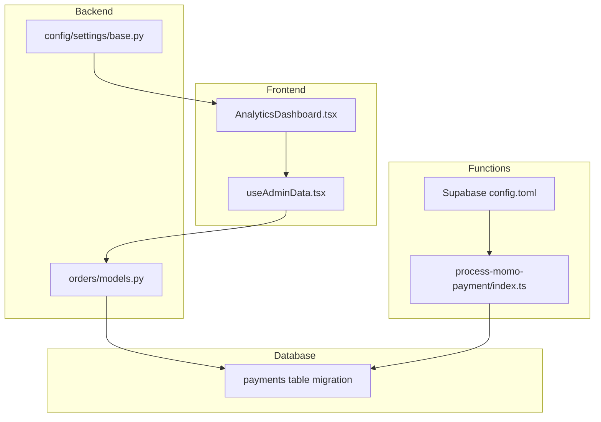
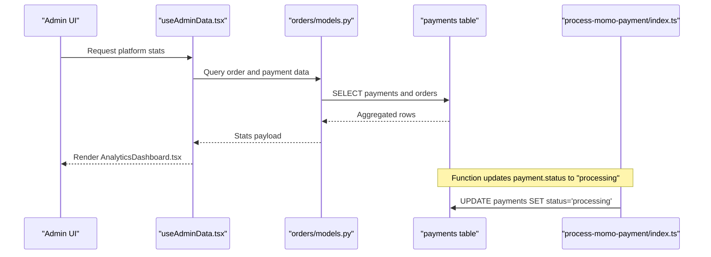
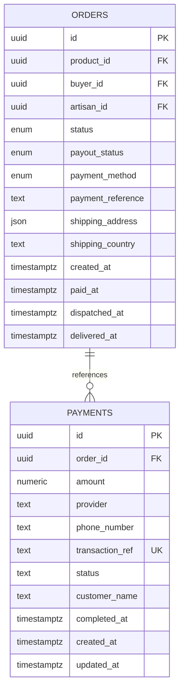
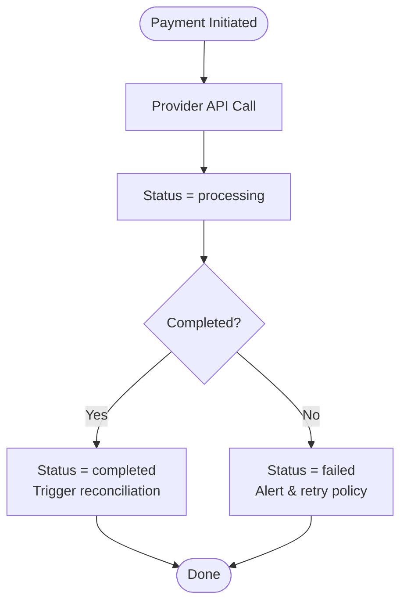
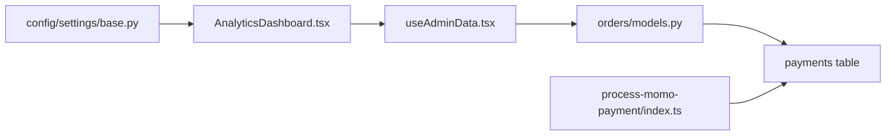

# Payment Analytics & Reporting

<cite>
**Referenced Files in This Document**
- [models.py](file://backend/apps/orders/models.py)
- [20260110084208_19f31e38-2062-4a6a-a516-e5b9de4e3510.sql](file://supabase/migrations/20260110084208_19f31e38-2062-4a6a-a516-e5b9de4e3510.sql)
- [AnalyticsDashboard.tsx](file://apps/web/src/components/admin/AnalyticsDashboard.tsx)
- [useAdminData.tsx](file://apps/web/src/hooks/useAdminData.tsx)
- [base.py](file://backend/config/settings/base.py)
- [index.ts](file://supabase/functions/process-momo-payment/index.ts)
- [config.toml](file://supabase/config.toml)
- [PROGRESS_REPORT.md](file://PROGRESS_REPORT.md)
</cite>

## Table of Contents
1. [Introduction](#introduction)
2. [Project Structure](#project-structure)
3. [Core Components](#core-components)
4. [Architecture Overview](#architecture-overview)
5. [Detailed Component Analysis](#detailed-component-analysis)
6. [Dependency Analysis](#dependency-analysis)
7. [Performance Considerations](#performance-considerations)
8. [Troubleshooting Guide](#troubleshooting-guide)
9. [Conclusion](#conclusion)
10. [Appendices](#appendices)

## Introduction
This document describes the payment analytics and reporting systems for the platform. It focuses on payment volume tracking, revenue analytics, transaction success rate monitoring, payment method performance dashboards, geographic transaction distribution, and customer payment behavior analysis. It also covers real-time monitoring alerts, anomaly detection reports, reconciliation summaries, forecasting models, seasonal trends, merchant commission calculations, export capabilities for accounting and tax reporting, financial audit preparation, payment KPIs, conversion rate optimization, and payment friction analysis.

## Project Structure
The payment analytics and reporting system spans frontend dashboards, backend models, database schema, and Supabase functions. The key areas are:
- Backend models define order lifecycles and financial snapshots.
- Supabase migrations define the payments table and row-level security policies.
- Frontend analytics dashboard renders platform statistics and charts.
- Supabase functions orchestrate payment processing flows and status updates.
- Admin settings integrate the Payments menu item into the Django admin interface.

**Diagram sources**
- [AnalyticsDashboard.tsx:1-226](file://apps/web/src/components/admin/AnalyticsDashboard.tsx#L1-L226)
- [useAdminData.tsx](file://apps/web/src/hooks/useAdminData.tsx)
- [models.py:10-122](file://backend/apps/orders/models.py#L10-L122)
- [20260110084208_19f31e38-2062-4a6a-a516-e5b9de4e3510.sql:1-45](file://supabase/migrations/20260110084208_19f31e38-2062-4a6a-a516-e5b9de4e3510.sql#L1-L45)
- [index.ts:71-107](file://supabase/functions/process-momo-payment/index.ts#L71-L107)
- [config.toml:1-16](file://supabase/config.toml#L1-L16)
- [base.py:255-287](file://backend/config/settings/base.py#L255-L287)

**Section sources**
- [AnalyticsDashboard.tsx:1-226](file://apps/web/src/components/admin/AnalyticsDashboard.tsx#L1-L226)
- [models.py:10-122](file://backend/apps/orders/models.py#L10-L122)
- [20260110084208_19f31e38-2062-4a6a-a516-e5b9de4e3510.sql:1-45](file://supabase/migrations/20260110084208_19f31e38-2062-4a6a-a516-e5b9de4e3510.sql#L1-L45)
- [index.ts:71-107](file://supabase/functions/process-momo-payment/index.ts#L71-L107)
- [base.py:255-287](file://backend/config/settings/base.py#L255-L287)

## Core Components
- Payments table: Tracks payment attempts, providers, amounts, transaction references, statuses, and timestamps. Row-level security ensures buyers see only their payments and admins can view/update all.
- Orders model: Defines payment methods, shipping country, and frozen financial snapshots (price in UGX/USD, artisan earnings, platform commission, heritage fund contribution).
- Analytics dashboard: Renders platform statistics and charts for product categories and verification rates.
- Supabase functions: Orchestrate payment initiation and status transitions for mobile money providers.
- Admin integration: Adds a Payments menu item in the Django admin.

**Section sources**
- [20260110084208_19f31e38-2062-4a6a-a516-e5b9de4e3510.sql:1-45](file://supabase/migrations/20260110084208_19f31e38-2062-4a6a-a516-e5b9de4e3510.sql#L1-L45)
- [models.py:10-122](file://backend/apps/orders/models.py#L10-L122)
- [AnalyticsDashboard.tsx:1-226](file://apps/web/src/components/admin/AnalyticsDashboard.tsx#L1-L226)
- [index.ts:71-107](file://supabase/functions/process-momo-payment/index.ts#L71-L107)
- [base.py:255-287](file://backend/config/settings/base.py#L255-L287)

## Architecture Overview
The payment analytics pipeline integrates frontend dashboards, backend models, database storage, and serverless functions. Payments are recorded in the database with strict access controls. The frontend retrieves aggregated stats via hooks and displays them in cards and charts. Payment functions update statuses asynchronously and rely on webhooks for production flows.

**Diagram sources**
- [AnalyticsDashboard.tsx:1-226](file://apps/web/src/components/admin/AnalyticsDashboard.tsx#L1-L226)
- [useAdminData.tsx](file://apps/web/src/hooks/useAdminData.tsx)
- [models.py:10-122](file://backend/apps/orders/models.py#L10-L122)
- [20260110084208_19f31e38-2062-4a6a-a516-e5b9de4e3510.sql:1-45](file://supabase/migrations/20260110084208_19f31e38-2062-4a6a-a516-e5b9de4e3510.sql#L1-L45)
- [index.ts:71-107](file://supabase/functions/process-momo-payment/index.ts#L71-L107)

## Detailed Component Analysis

### Payments Data Model and Schema
The payments table captures provider-specific transaction metadata, amounts, and lifecycle status. Row-level security policies restrict visibility to buyers and grant admin access. The orders model defines payment methods and frozen financial snapshots used for analytics and reconciliation.

**Diagram sources**
- [20260110084208_19f31e38-2062-4a6a-a516-e5b9de4e3510.sql:1-45](file://supabase/migrations/20260110084208_19f31e38-2062-4a6a-a516-e5b9de4e3510.sql#L1-L45)
- [models.py:10-122](file://backend/apps/orders/models.py#L10-L122)

**Section sources**
- [20260110084208_19f31e38-2062-4a6a-a516-e5b9de4e3510.sql:1-45](file://supabase/migrations/20260110084208_19f31e38-2062-4a6a-a516-e5b9de4e3510.sql#L1-L45)
- [models.py:10-122](file://backend/apps/orders/models.py#L10-L122)

### Payment Method Performance Dashboards
- Payment method breakdown: Use the orders model’s payment method choices to group transactions by method (Stripe, MTN MoMo, Airtel Money, TON Crypto).
- Provider-specific metrics: The payments table includes provider and transaction_ref, enabling provider-level success rates and volume tracking.
- Real-time status monitoring: The payments table’s status field supports live dashboards for pending, processing, completed, failed, and pending_collection states.

Implementation guidance:
- Aggregate counts and sums by payment_method and provider.
- Track conversion from pending to completed per method/provider.
- Surface top-performing methods and regions for optimization.

**Section sources**
- [models.py:27-32](file://backend/apps/orders/models.py#L27-L32)
- [20260110084208_19f31e38-2062-4a6a-a516-e5b9de4e3510.sql:5-13](file://supabase/migrations/20260110084208_19f31e38-2062-4a6a-a516-e5b9de4e3510.sql#L5-L13)

### Geographic Transaction Distribution
- Use shipping_country from the orders model to segment transactions by ISO country codes.
- Combine with payment provider to analyze regional preferences and cross-border flows.
- Visualize distributions via bar/pie charts in the analytics dashboard.

**Section sources**
- [models.py:93-95](file://backend/apps/orders/models.py#L93-L95)

### Customer Payment Behavior Analysis
- Cohort analysis: Group buyers by registration date and track payment frequency and average order value over time.
- RFM-style segmentation: Recency, Frequency, Monetary value derived from order and payment data.
- Funnel analysis: Map homepage → product page → cart → checkout completion using order status transitions.

**Section sources**
- [models.py:16-25](file://backend/apps/orders/models.py#L16-L25)

### Real-Time Monitoring Alerts and Anomaly Detection
- Status change alerts: Monitor rapid spikes in failed or pending_collection statuses.
- Provider-specific thresholds: Alert on unusual patterns per provider (e.g., MTN/Airtel).
- Webhook-driven reconciliation: Functions update payment status; production flows require provider webhooks to finalize statuses.

**Diagram sources**
- [index.ts:71-107](file://supabase/functions/process-momo-payment/index.ts#L71-L107)
- [20260110084208_19f31e38-2062-4a6a-a516-e5b9de4e3510.sql:9](file://supabase/migrations/20260110084208_19f31e38-2062-4a6a-a516-e5b9de4e3510.sql#L9)

**Section sources**
- [index.ts:71-107](file://supabase/functions/process-momo-payment/index.ts#L71-L107)
- [20260110084208_19f31e38-2062-4a6a-a516-e5b9de4e3510.sql:9](file://supabase/migrations/20260110084208_19f31e38-2062-4a6a-a516-e5b9de4e3510.sql#L9)

### Reconciliation Summaries
- Daily reconciliation: Compare payments.completed_at with order.paid_at and status to identify mismatches.
- Provider reconciliation: Match transaction_ref to provider records and reconcile differences.
- Dispute and refund tracking: Use order status transitions to flag disputed/refunded orders.

**Section sources**
- [models.py:100-103](file://backend/apps/orders/models.py#L100-L103)
- [20260110084208_19f31e38-2062-4a6a-a516-e5b9de4e3510.sql:10-12](file://supabase/migrations/20260110084208_19f31e38-2062-4a6a-a516-e5b9de4e3510.sql#L10-L12)

### Payment Forecasting Models and Seasonal Trends
- Historical aggregation: Build monthly/quarterly series by payment_method and shipping_country.
- Decomposition: Separate trend, seasonality, and residual components.
- Scenario modeling: Stress-test with provider outages and currency fluctuations.

[No sources needed since this section provides general guidance]

### Merchant Commission Calculations
- Platform commission: Derived from the orders model’s frozen financial snapshot (price minus artisan earnings and heritage fund).
- Real-time calculation: Use price_ugx, artisan_earnings_ugx, heritage_fund_ugx to compute platform_commission_ugx.
- Payout tracking: Use order.payout_status to monitor disbursements.

**Section sources**
- [models.py:78-82](file://backend/apps/orders/models.py#L78-L82)
- [models.py:34-39](file://backend/apps/orders/models.py#L34-L39)

### Export Capabilities for Accounting and Tax Reporting
- CSV exports: Export payments and orders with provider, amount, status, timestamps, and buyer/artisan identifiers.
- Tax reporting: Segment by provider and country to support VAT/GST reporting.
- Audit trail: Include transaction_ref, payment_reference, and status history for compliance.

**Section sources**
- [20260110084208_19f31e38-2062-4a6a-a516-e5b9de4e3510.sql:4-13](file://supabase/migrations/20260110084208_19f31e38-2062-4a6a-a516-e5b9de4e3510.sql#L4-L13)
- [models.py:84-86](file://backend/apps/orders/models.py#L84-L86)

### Payment KPIs, Conversion Rate Optimization, and Friction Analysis
- KPIs: Total transactions, total revenue, average order value, conversion rates (homepage→product→cart→checkout), payment method success rate.
- Conversion funnel: Use order status transitions to identify drop-off points.
- Friction indicators: High failed/pending_collection ratios by region/method; long processing times.

**Section sources**
- [models.py:16-25](file://backend/apps/orders/models.py#L16-L25)
- [PROGRESS_REPORT.md:395-416](file://PROGRESS_REPORT.md#L395-L416)

## Dependency Analysis
- Frontend dashboard depends on useAdminData hook to fetch stats and renders charts.
- useAdminData queries backend models that join orders and payments.
- Supabase functions update payments status and rely on database triggers for updated_at.
- Admin settings integrate the Payments menu item pointing to the payments admin.

**Diagram sources**
- [AnalyticsDashboard.tsx:1-226](file://apps/web/src/components/admin/AnalyticsDashboard.tsx#L1-L226)
- [useAdminData.tsx](file://apps/web/src/hooks/useAdminData.tsx)
- [models.py:10-122](file://backend/apps/orders/models.py#L10-L122)
- [20260110084208_19f31e38-2062-4a6a-a516-e5b9de4e3510.sql:1-45](file://supabase/migrations/20260110084208_19f31e38-2062-4a6a-a516-e5b9de4e3510.sql#L1-L45)
- [index.ts:71-107](file://supabase/functions/process-momo-payment/index.ts#L71-L107)
- [base.py:255-287](file://backend/config/settings/base.py#L255-L287)

**Section sources**
- [AnalyticsDashboard.tsx:1-226](file://apps/web/src/components/admin/AnalyticsDashboard.tsx#L1-L226)
- [useAdminData.tsx](file://apps/web/src/hooks/useAdminData.tsx)
- [models.py:10-122](file://backend/apps/orders/models.py#L10-L122)
- [20260110084208_19f31e38-2062-4a6a-a516-e5b9de4e3510.sql:1-45](file://supabase/migrations/20260110084208_19f31e38-2062-4a6a-a516-e5b9de4e3510.sql#L1-L45)
- [index.ts:71-107](file://supabase/functions/process-momo-payment/index.ts#L71-L107)
- [base.py:255-287](file://backend/config/settings/base.py#L255-L287)

## Performance Considerations
- Index provider and status on the payments table to accelerate filtering and reporting.
- Use partial indexes for frequently queried subsets (e.g., completed payments within a date range).
- Paginate and cache dashboard queries; leverage database materialized views for heavy aggregations.
- Batch reconciliation jobs to avoid real-time contention during peak hours.

[No sources needed since this section provides general guidance]

## Troubleshooting Guide
- Access denied errors: Verify RLS policies for buyers and admins; ensure auth.uid() matches order ownership.
- Status desynchronization: Confirm function updates and webhook handlers align with expected status transitions.
- Missing data: Check that payment_reference and transaction_ref are populated consistently across flows.

**Section sources**
- [20260110084208_19f31e38-2062-4a6a-a516-e5b9de4e3510.sql:19-39](file://supabase/migrations/20260110084208_19f31e38-2062-4a6a-a516-e5b9de4e3510.sql#L19-L39)
- [index.ts:99-107](file://supabase/functions/process-momo-payment/index.ts#L99-L107)

## Conclusion
The platform establishes a solid foundation for payment analytics and reporting with a dedicated payments table, secure access controls, and an extensible orders model. The frontend dashboard demonstrates how to surface key metrics, while Supabase functions illustrate asynchronous payment orchestration. Future enhancements should focus on production-grade webhooks, advanced forecasting, and richer export formats for accounting and tax compliance.

[No sources needed since this section summarizes without analyzing specific files]

## Appendices

### Admin Menu Integration
- The Django admin includes a Payments menu item linking to the payments admin interface.

**Section sources**
- [base.py:263-266](file://backend/config/settings/base.py#L263-L266)

### Supabase Function Configuration
- Function settings disable JWT verification for payment functions; adjust according to security requirements.

**Section sources**
- [config.toml:3-16](file://supabase/config.toml#L3-L16)