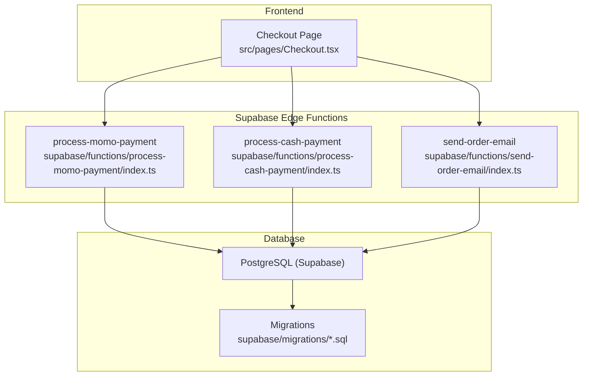
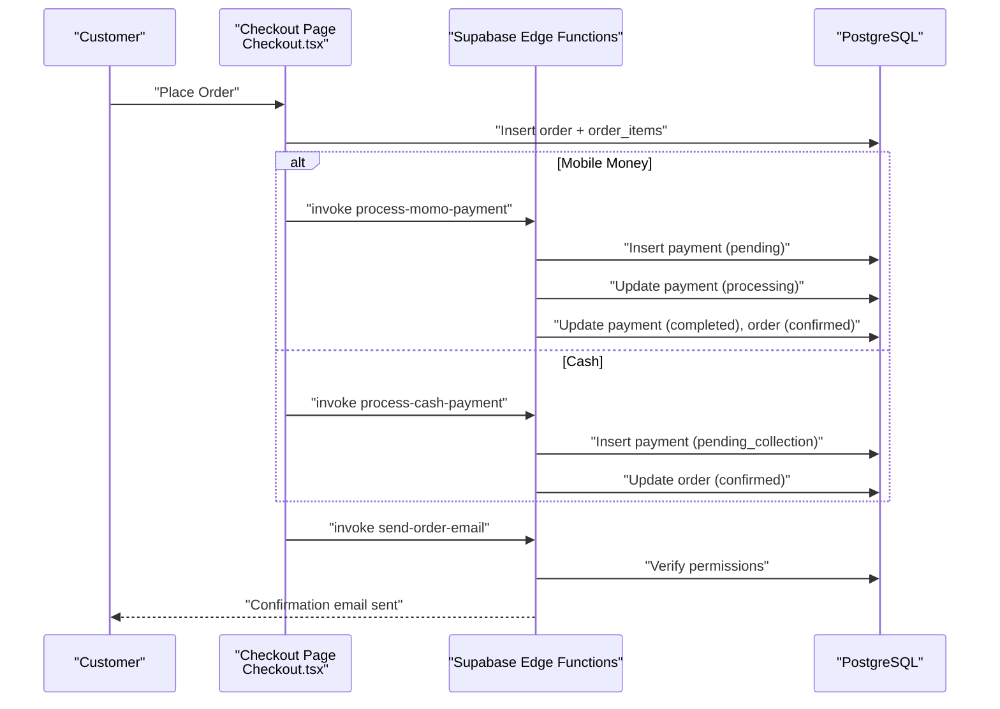
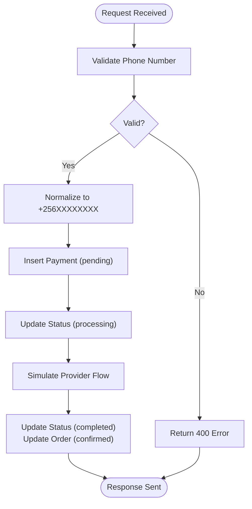
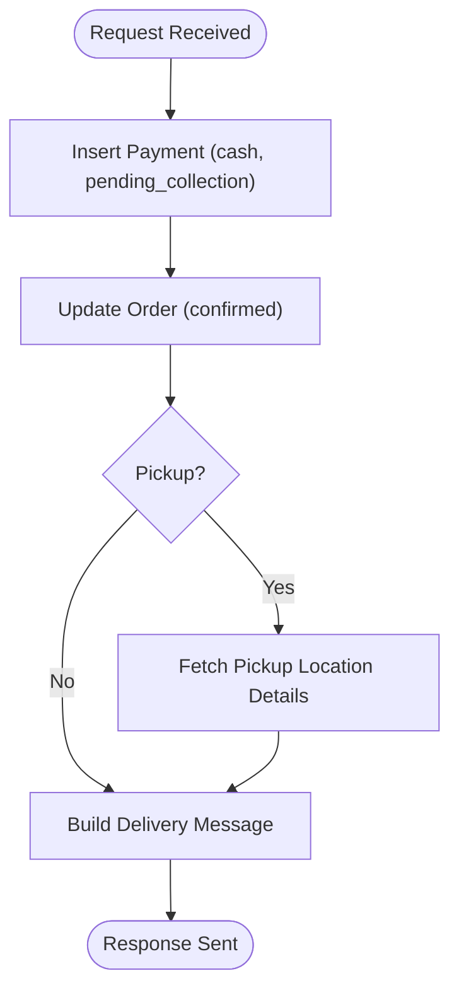
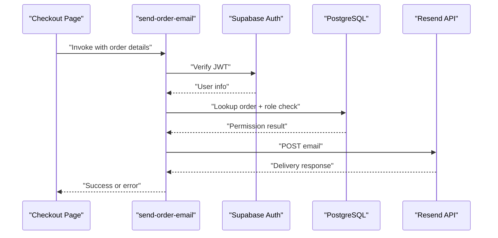
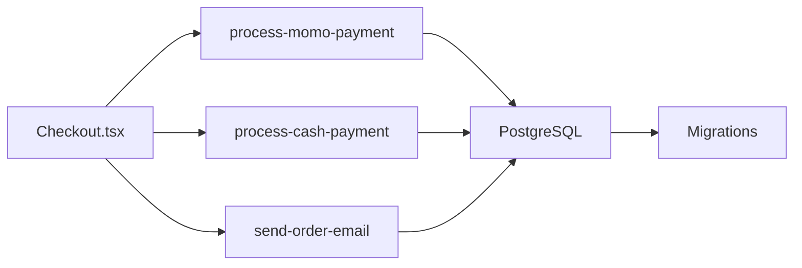
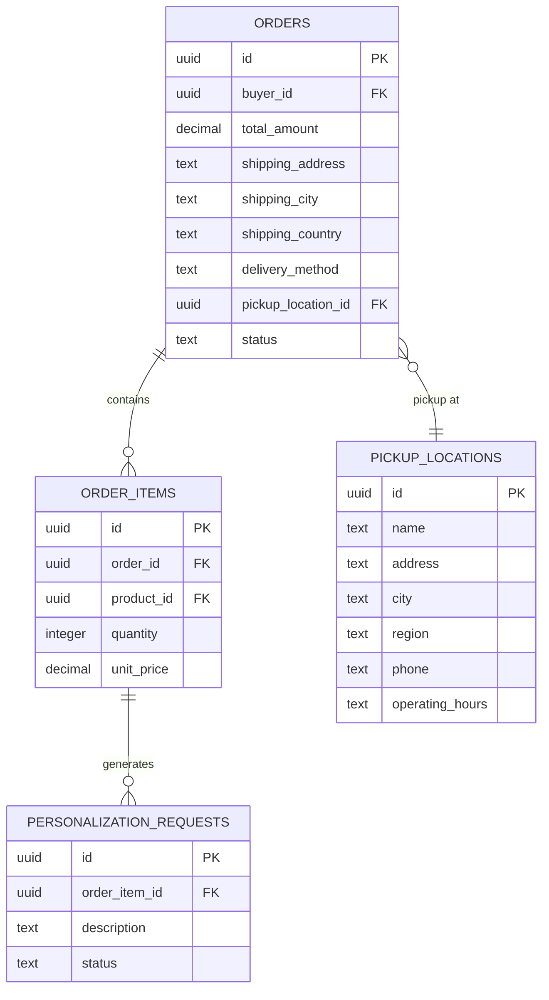

# Payment Processing

<cite>
**Referenced Files in This Document**
- [Checkout.tsx](file://src/pages/Checkout.tsx)
- [process-momo-payment/index.ts](file://supabase/functions/process-momo-payment/index.ts)
- [process-cash-payment/index.ts](file://supabase/functions/process-cash-payment/index.ts)
- [send-order-email/index.ts](file://supabase/functions/send-order-email/index.ts)
- [20260107224910_0b6f10e2-c8bb-49bb-ba91-d7b9b48cd27c.sql](file://supabase/migrations/20260107224910_0b6f10e2-c8bb-49bb-ba91-d7b9b48cd27c.sql)
- [20260104173154_8858732d-0e5c-45cd-afaf-c177dfa5487a.sql](file://supabase/migrations/20260104173154_8858732d-0e5c-45cd-afaf-c177dfa5487a.sql)
- [20260101210119_8814f12d-688f-4774-9ce8-6ce5f9fd0bba.sql](file://supabase/migrations/20260101210119_8814f12d-688f-4774-9ce8-6ce5f9fd0bba.sql)
- [20260110082525_e26cf9e4-1e19-414d-9316-27ada8493a53.sql](file://supabase/migrations/20260110082525_e26cf9e4-1e19-414d-9316-27ada8493a53.sql)
- [20260301183140_74b1e32e-ded4-4234-9c49-76542f291b2d.sql](file://supabase/migrations/20260301183140_74b1e32e-ded4-4234-9c49-76542f291b2d.sql)
- [20260301185835_24e7e596-6ffe-4991-964c-74e173d7213e.sql](file://supabase/migrations/20260301185835_24e7e596-6ffe-4991-964c-74e173d7213e.sql)
- [20260307151135_abb92613-d0a4-4ab6-8384-d241b138020b.sql](file://supabase/migrations/20260307151135_abb92613-d0a4-4ab6-8384-d241b138020b.sql)
- [20260312151001_0ad1fffe-4364-4902-9212-6c6e1aeb1f08.sql](file://supabase/migrations/20260312151001_0ad1fffe-4364-4902-9212-6c6e1aeb1f08.sql)
- [20260312151243_54077459-7217-4c42-a35e-67af66d898f3.sql](file://supabase/migrations/20260312151243_54077459-7217-4c42-a35e-67af66d898f3.sql)
</cite>

## Table of Contents
1. [Introduction](#introduction)
2. [Project Structure](#project-structure)
3. [Core Components](#core-components)
4. [Architecture Overview](#architecture-overview)
5. [Detailed Component Analysis](#detailed-component-analysis)
6. [Dependency Analysis](#dependency-analysis)
7. [Performance Considerations](#performance-considerations)
8. [Troubleshooting Guide](#troubleshooting-guide)
9. [Conclusion](#conclusion)
10. [Appendices](#appendices)

## Introduction
This document describes the multi-method payment processing system, covering:
- Credit/debit card payments via Stripe (planned)
- MTN Mobile Money and Airtel Money (implemented via Supabase Edge Functions)
- Cash payments (implemented via Supabase Edge Functions)
- Email confirmation system (implemented via Supabase Edge Function)
- Payment provider abstraction layer (conceptual)
- Transaction processing workflows and validation
- Security, PCI compliance considerations, and fraud prevention strategies
- Payment analytics, monitoring, and reconciliation processes
- International payment support, currency conversion, and regulatory compliance

The system integrates a React frontend with Supabase Edge Functions and database migrations to orchestrate payment flows, order creation, and notifications.

## Project Structure
The payment system spans:
- Frontend checkout page orchestrating payment selection and invoking backend functions
- Supabase Edge Functions implementing payment providers and email notifications
- Database schema and row-level security policies governing orders, payments, and related entities

**Diagram sources**
- [Checkout.tsx:126-295](file://src/pages/Checkout.tsx#L126-L295)
- [process-momo-payment/index.ts:17-150](file://supabase/functions/process-momo-payment/index.ts#L17-L150)
- [process-cash-payment/index.ts:19-113](file://supabase/functions/process-cash-payment/index.ts#L19-L113)
- [send-order-email/index.ts:165-283](file://supabase/functions/send-order-email/index.ts#L165-L283)
- [20260107224910_0b6f10e2-c8bb-49bb-ba91-d7b9b48cd27c.sql:11-45](file://supabase/migrations/20260107224910_0b6f10e2-c8bb-49bb-ba91-d7b9b48cd27c.sql#L11-L45)

**Section sources**
- [Checkout.tsx:126-295](file://src/pages/Checkout.tsx#L126-L295)
- [process-momo-payment/index.ts:17-150](file://supabase/functions/process-momo-payment/index.ts#L17-L150)
- [process-cash-payment/index.ts:19-113](file://supabase/functions/process-cash-payment/index.ts#L19-L113)
- [send-order-email/index.ts:165-283](file://supabase/functions/send-order-email/index.ts#L165-L283)
- [20260107224910_0b6f10e2-c8bb-49bb-ba91-d7b9b48cd27c.sql:11-45](file://supabase/migrations/20260107224910_0b6f10e2-c8bb-49bb-ba91-d7b9b48cd27c.sql#L11-L45)

## Core Components
- Checkout page: Creates orders, selects payment method, invokes backend functions, and triggers email notifications.
- Mobile Money payment function: Validates phone number, normalizes to international format, creates payment records, simulates provider flow, and updates statuses.
- Cash payment function: Creates cash-on-delivery or cash-pickup payment records and updates order status.
- Email function: Sends order confirmation emails via Resend, enforcing authorization checks.

Key implementation references:
- [Checkout.tsx:126-295](file://src/pages/Checkout.tsx#L126-L295)
- [process-momo-payment/index.ts:33-103](file://supabase/functions/process-momo-payment/index.ts#L33-L103)
- [process-cash-payment/index.ts:30-100](file://supabase/functions/process-cash-payment/index.ts#L30-L100)
- [send-order-email/index.ts:165-283](file://supabase/functions/send-order-email/index.ts#L165-L283)

**Section sources**
- [Checkout.tsx:126-295](file://src/pages/Checkout.tsx#L126-L295)
- [process-momo-payment/index.ts:33-103](file://supabase/functions/process-momo-payment/index.ts#L33-L103)
- [process-cash-payment/index.ts:30-100](file://supabase/functions/process-cash-payment/index.ts#L30-L100)
- [send-order-email/index.ts:165-283](file://supabase/functions/send-order-email/index.ts#L165-L283)

## Architecture Overview
End-to-end payment flow:
- User selects delivery method, enters contact info, and chooses payment method.
- Frontend creates an order and order items, then invokes the appropriate payment function.
- Payment function validates inputs, persists a payment record, and simulates provider initiation.
- On successful simulation, the function updates payment and order statuses asynchronously.
- Frontend sends an order confirmation email via the email function.

**Diagram sources**
- [Checkout.tsx:158-295](file://src/pages/Checkout.tsx#L158-L295)
- [process-momo-payment/index.ts:54-125](file://supabase/functions/process-momo-payment/index.ts#L54-L125)
- [process-cash-payment/index.ts:45-72](file://supabase/functions/process-cash-payment/index.ts#L45-L72)
- [send-order-email/index.ts:214-241](file://supabase/functions/send-order-email/index.ts#L214-L241)

## Detailed Component Analysis

### Mobile Money Payment Flow (MTN/Airtel)
- Input validation: Phone number format enforced for Uganda (+256 7XXXXXXX).
- Normalization: Converts local or missing leading "+" to "+256".
- Payment record creation: Inserts a payment row with provider, amount, phone number, and generated transaction reference.
- Status transitions: pending → processing → completed with asynchronous background task.
- Provider-specific logging and response messaging.

**Diagram sources**
- [process-momo-payment/index.ts:33-103](file://supabase/functions/process-momo-payment/index.ts#L33-L103)
- [process-momo-payment/index.ts:107-129](file://supabase/functions/process-momo-payment/index.ts#L107-L129)

**Section sources**
- [process-momo-payment/index.ts:33-103](file://supabase/functions/process-momo-payment/index.ts#L33-L103)
- [process-momo-payment/index.ts:107-129](file://supabase/functions/process-momo-payment/index.ts#L107-L129)

### Cash Payment Flow (Cash on Delivery/Pickup)
- Input validation: Customer name, phone, delivery method, optional pickup location.
- Payment record creation: Inserts a payment row with provider "cash" and status "pending_collection".
- Order status update: Immediately sets order to "confirmed".
- Optional pickup details resolution: Fetches pickup location details for confirmation messaging.

**Diagram sources**
- [process-cash-payment/index.ts:45-72](file://supabase/functions/process-cash-payment/index.ts#L45-L72)
- [process-cash-payment/index.ts:74-84](file://supabase/functions/process-cash-payment/index.ts#L74-L84)

**Section sources**
- [process-cash-payment/index.ts:45-72](file://supabase/functions/process-cash-payment/index.ts#L45-L72)
- [process-cash-payment/index.ts:74-84](file://supabase/functions/process-cash-payment/index.ts#L74-L84)

### Email Confirmation System
- Authentication: Verifies JWT and ensures caller is either the order owner or admin.
- Authorization: Checks order ownership via database lookup and role RPC.
- Content generation: Builds HTML email content based on type (confirmation, status update, shipped).
- Delivery: Sends email via Resend API using configured API key.

**Diagram sources**
- [send-order-email/index.ts:165-283](file://supabase/functions/send-order-email/index.ts#L165-L283)
- [send-order-email/index.ts:247-267](file://supabase/functions/send-order-email/index.ts#L247-L267)

**Section sources**
- [send-order-email/index.ts:165-283](file://supabase/functions/send-order-email/index.ts#L165-L283)
- [send-order-email/index.ts:247-267](file://supabase/functions/send-order-email/index.ts#L247-L267)

### Payment Provider Abstraction Layer (Conceptual)
- Current state: Mobile Money and Cash are implemented as separate functions with shared patterns (payment record creation, status updates).
- Recommended abstraction:
  - Define a unified interface for payment creation, status update, and callback handling.
  - Centralize provider configuration and credentials.
  - Standardize transaction reference generation and error handling.
  - Implement webhooks for real-time provider callbacks.

[No sources needed since this section proposes conceptual improvements]

### Payment Validation Mechanisms
- Phone number validation and normalization for mobile money.
- Order creation and item persistence before payment.
- Authorization checks for email sending.
- Row-level security policies for orders and related entities.

**Section sources**
- [process-momo-payment/index.ts:33-48](file://supabase/functions/process-momo-payment/index.ts#L33-L48)
- [Checkout.tsx:158-193](file://src/pages/Checkout.tsx#L158-L193)
- [send-order-email/index.ts:214-241](file://supabase/functions/send-order-email/index.ts#L214-L241)
- [20260104173154_8858732d-0e5c-45cd-afaf-c177dfa5487a.sql:1-22](file://supabase/migrations/20260104173154_8858732d-0e5c-45cd-afaf-c177dfa5487a.sql#L1-L22)

### Transaction Processing Workflows
- Mobile Money: pending → processing → completed with asynchronous completion.
- Cash: pending_collection → confirmed immediately.
- Order lifecycle: created with items; payment completion updates order status.

**Section sources**
- [process-momo-payment/index.ts:99-125](file://supabase/functions/process-momo-payment/index.ts#L99-L125)
- [process-cash-payment/index.ts:64-72](file://supabase/functions/process-cash-payment/index.ts#L64-L72)
- [Checkout.tsx:158-193](file://src/pages/Checkout.tsx#L158-L193)

## Dependency Analysis
- Frontend depends on Supabase client to invoke Edge Functions and manage state.
- Edge Functions depend on Supabase client and environment variables.
- Database depends on migrations for schema, policies, and triggers.
- Email function depends on Resend API and proper authorization.

**Diagram sources**
- [Checkout.tsx:126-295](file://src/pages/Checkout.tsx#L126-L295)
- [process-momo-payment/index.ts:24-26](file://supabase/functions/process-momo-payment/index.ts#L24-L26)
- [process-cash-payment/index.ts:26-28](file://supabase/functions/process-cash-payment/index.ts#L26-L28)
- [send-order-email/index.ts:184-189](file://supabase/functions/send-order-email/index.ts#L184-L189)
- [20260107224910_0b6f10e2-c8bb-49bb-ba91-d7b9b48cd27c.sql:11-45](file://supabase/migrations/20260107224910_0b6f10e2-c8bb-49bb-ba91-d7b9b48cd27c.sql#L11-L45)

**Section sources**
- [Checkout.tsx:126-295](file://src/pages/Checkout.tsx#L126-L295)
- [process-momo-payment/index.ts:24-26](file://supabase/functions/process-momo-payment/index.ts#L24-L26)
- [process-cash-payment/index.ts:26-28](file://supabase/functions/process-cash-payment/index.ts#L26-L28)
- [send-order-email/index.ts:184-189](file://supabase/functions/send-order-email/index.ts#L184-L189)
- [20260107224910_0b6f10e2-c8bb-49bb-ba91-d7b9b48cd27c.sql:11-45](file://supabase/migrations/20260107224910_0b6f10e2-c8bb-49bb-ba91-d7b9b48cd27c.sql#L11-L45)

## Performance Considerations
- Asynchronous completion: Background tasks avoid blocking HTTP responses.
- Minimal payload: Functions operate on validated inputs and small datasets.
- Edge Functions: Serverless execution reduces latency for payment initiation.
- Recommendations:
  - Use provider webhooks for real-time updates instead of simulated completion.
  - Add retry/backoff for external API calls.
  - Cache frequently accessed lookup data (e.g., pickup locations) where safe.

[No sources needed since this section provides general guidance]

## Troubleshooting Guide
Common issues and resolutions:
- Phone number validation failures: Ensure format matches Uganda mobile patterns; function returns 400 with error message.
- Payment initiation errors: Check environment variables and Supabase service role key; review function logs.
- Order/email permission errors: Verify user is authenticated and has ownership/admin rights; function returns 401/403.
- Email delivery failures: Confirm Resend API key and network connectivity; inspect function logs.

**Section sources**
- [process-momo-payment/index.ts:35-40](file://supabase/functions/process-momo-payment/index.ts#L35-L40)
- [process-momo-payment/index.ts:142-149](file://supabase/functions/process-momo-payment/index.ts#L142-L149)
- [send-order-email/index.ts:175-199](file://supabase/functions/send-order-email/index.ts#L175-L199)
- [send-order-email/index.ts:235-241](file://supabase/functions/send-order-email/index.ts#L235-L241)
- [send-order-email/index.ts:263-267](file://supabase/functions/send-order-email/index.ts#L263-L267)

## Conclusion
The current payment system supports mobile money and cash payments with robust frontend orchestration and backend functions. It includes order creation, payment recording, status updates, and email confirmations. To meet enterprise-grade needs, integrate Stripe for cards, implement provider webhooks, strengthen security and compliance, and build analytics and reconciliation dashboards.

[No sources needed since this section summarizes without analyzing specific files]

## Appendices

### Database Schema Highlights
- Orders, order items, and personalization requests define order lifecycle and customization.
- Pick-up locations enable cash-pickup flows.
- Row-level security policies restrict access to buyers, artisans, and admins.
- Triggers maintain updated timestamps.

**Diagram sources**
- [20260107224910_0b6f10e2-c8bb-49bb-ba91-d7b9b48cd27c.sql:42-45](file://supabase/migrations/20260107224910_0b6f10e2-c8bb-49bb-ba91-d7b9b48cd27c.sql#L42-L45)
- [20260107224910_0b6f10e2-c8bb-49bb-ba91-d7b9b48cd27c.sql#L11-L25)
- [20260107224910_0b6f10e2-c8bb-49bb-ba91-d7b9b48cd27c.sql#L47-L56)

**Section sources**
- [20260107224910_0b6f10e2-c8bb-49bb-ba91-d7b9b48cd27c.sql:11-56](file://supabase/migrations/20260107224910_0b6f10e2-c8bb-49bb-ba91-d7b9b48cd27c.sql#L11-L56)
- [20260104173154_8858732d-0e5c-45cd-afaf-c177dfa5487a.sql:1-22](file://supabase/migrations/20260104173154_8858732d-0e5c-45cd-afaf-c177dfa5487a.sql#L1-L22)
- [20260101210119_8814f12d-688f-4774-9ce8-6ce5f9fd0bba.sql:1-13](file://supabase/migrations/20260101210119_8814f12d-688f-4774-9ce8-6ce5f9fd0bba.sql#L1-L13)

### Payment Security and Compliance
- PCI DSS: Card data is not stored; Stripe integration should be used for card payments.
- Data protection: Environment variables for secrets; JWT-based authorization for sensitive operations.
- Fraud prevention: Phone number validation, user-role checks, and RLS policies.
- Regulatory compliance: Local mobile money flows; future Stripe integration should align with regional regulations.

[No sources needed since this section provides general guidance]

### Payment Analytics, Monitoring, and Reconciliation
- Analytics: Track payment counts, amounts, and provider breakdowns via database queries.
- Monitoring: Log function invocations and errors; surface metrics to dashboards.
- Reconciliation: Compare payment records with provider statements; reconcile discrepancies.

[No sources needed since this section provides general guidance]

### International Payments, Currency Conversion, and Regulation
- Current scope: Uganda Shilling (UGX) for mobile money and cash.
- Recommendations: Add currency conversion logic; support multiple currencies; implement KYC/AML checks; comply with regional regulations for cross-border payments.

[No sources needed since this section provides general guidance]