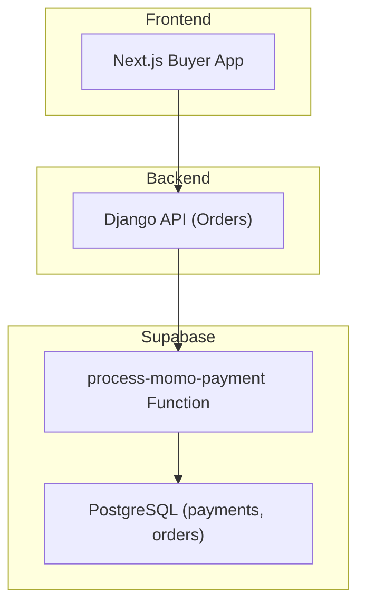
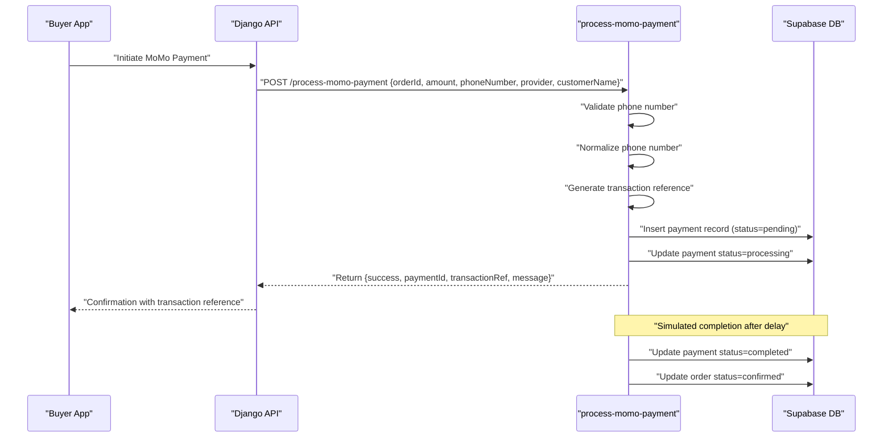
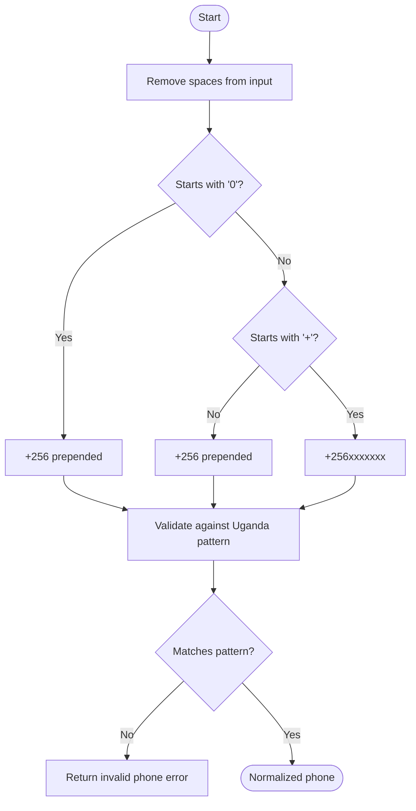
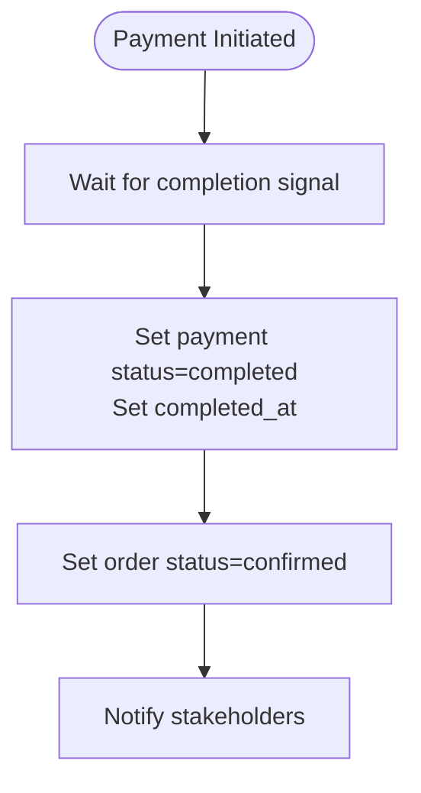
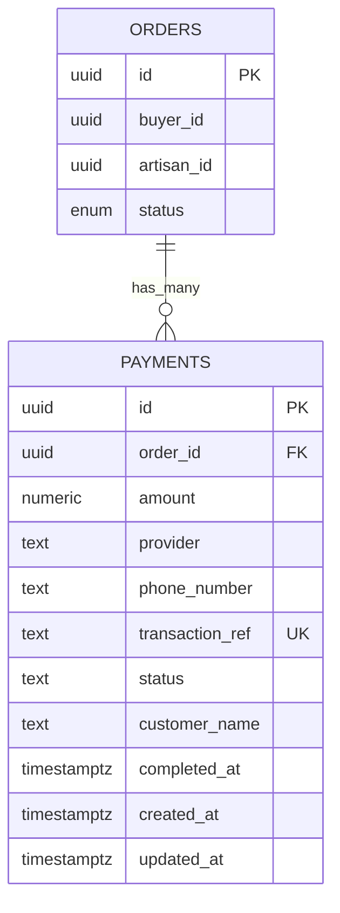
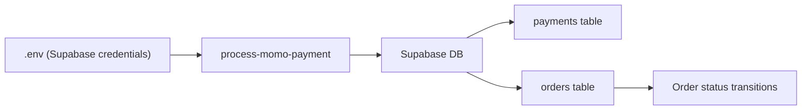

# MTN MoMo Mobile Money Integration

<cite>
**Referenced Files in This Document**
- [README.md](file://README.md)
- [process-momo-payment/index.ts](file://supabase/functions/process-momo-payment/index.ts)
- [process-cash-payment/index.ts](file://supabase/functions/process-cash-payment/index.ts)
- [20260110084208_19f31e38-2062-4a6a-a516-e5b9de4e3510.sql](file://supabase/migrations/20260110084208_19f31e38-2062-4a6a-a516-e5b9de4e3510.sql)
- [orders/models.py](file://backend/apps/orders/models.py)
- [orders.py](file://backend/api/v1/orders.py)
</cite>

## Table of Contents
1. [Introduction](#introduction)
2. [Project Structure](#project-structure)
3. [Core Components](#core-components)
4. [Architecture Overview](#architecture-overview)
5. [Detailed Component Analysis](#detailed-component-analysis)
6. [Dependency Analysis](#dependency-analysis)
7. [Performance Considerations](#performance-considerations)
8. [Troubleshooting Guide](#troubleshooting-guide)
9. [Conclusion](#conclusion)
10. [Appendices](#appendices)

## Introduction
This document describes the MTN MoMo mobile money payment provider integration within the Empindu artisan marketplace. It covers configuration, transaction initiation, phone number validation, transaction reference generation, payment status simulation, Supabase-backed payment tracking, and operational workflows. It also outlines regional and currency considerations, operator-specific requirements, and security measures. The current implementation simulates payment completion for demonstration; production readiness requires integrating the live MTN MoMo API and implementing webhook callbacks.

## Project Structure
The MoMo integration spans Supabase Edge Functions for payment initiation and Supabase database tables for persistence, alongside Django models that define order lifecycles and payment method choices.

**Diagram sources**
- [process-momo-payment/index.ts:17-150](file://supabase/functions/process-momo-payment/index.ts#L17-L150)
- [20260110084208_19f31e38-2062-4a6a-a516-e5b9de4e3510.sql:1-45](file://supabase/migrations/20260110084208_19f31e38-2062-4a6a-a516-e5b9de4e3510.sql#L1-L45)
- [orders/models.py:10-122](file://backend/apps/orders/models.py#L10-L122)

**Section sources**
- [README.md:1-242](file://README.md#L1-L242)
- [process-momo-payment/index.ts:1-151](file://supabase/functions/process-momo-payment/index.ts#L1-L151)
- [20260110084208_19f31e38-2062-4a6a-a516-e5b9de4e3510.sql:1-45](file://supabase/migrations/20260110084208_19f31e38-2062-4a6a-a516-e5b9de4e3510.sql#L1-L45)
- [orders/models.py:10-122](file://backend/apps/orders/models.py#L10-L122)

## Core Components
- Supabase Edge Function for MoMo payment initiation:
  - Validates phone number format for Uganda
  - Normalizes phone numbers to international format
  - Generates a unique transaction reference
  - Creates a payment record in the payments table
  - Updates payment status to processing
  - Simulates completion after a short delay and updates order status
- Supabase payments table:
  - Stores payment metadata, provider, phone number, transaction reference, and status
  - Enforces row-level security policies
- Django Order model:
  - Defines payment method choices including MoMo and Airtel Money
  - Tracks order status and payment reference

**Section sources**
- [process-momo-payment/index.ts:33-103](file://supabase/functions/process-momo-payment/index.ts#L33-L103)
- [20260110084208_19f31e38-2062-4a6a-a516-e5b9de4e3510.sql:1-45](file://supabase/migrations/20260110084208_19f31e38-2062-4a6a-a516-e5b9de4e3510.sql#L1-L45)
- [orders/models.py:27-32](file://backend/apps/orders/models.py#L27-L32)

## Architecture Overview
The MoMo integration uses a serverless function to orchestrate payment initiation and status updates. The function validates input, persists the payment, transitions statuses, and simulates completion. In production, the function would integrate with the MTN MoMo API and rely on webhooks for asynchronous completion notifications.

**Diagram sources**
- [process-momo-payment/index.ts:17-150](file://supabase/functions/process-momo-payment/index.ts#L17-L150)
- [20260110084208_19f31e38-2062-4a6a-a516-e5b9de4e3510.sql:1-45](file://supabase/migrations/20260110084208_19f31e38-2062-4a6a-a516-e5b9de4e3510.sql#L1-L45)

## Detailed Component Analysis

### Phone Number Validation and Normalization
- Validation pattern enforces Uganda mobile numbers with optional leading zero or plus sign, ensuring the digit after the area code is 7.
- Normalization converts local numbers starting with 0 to international format with country code 256, and adds the country code prefix if missing.

**Diagram sources**
- [process-momo-payment/index.ts:33-48](file://supabase/functions/process-momo-payment/index.ts#L33-L48)

**Section sources**
- [process-momo-payment/index.ts:33-48](file://supabase/functions/process-momo-payment/index.ts#L33-L48)

### Transaction Reference Generation
- A unique transaction reference is generated using a prefix, timestamp, and random alphanumeric suffix to minimize collision risk and provide auditability.

**Section sources**
- [process-momo-payment/index.ts:50-51](file://supabase/functions/process-momo-payment/index.ts#L50-L51)

### Payment Record Creation and Status Transition
- Payment records are inserted with initial status pending and later updated to processing upon successful initiation.
- The function logs provider-specific messages for clarity during testing.

**Section sources**
- [process-momo-payment/index.ts:54-71](file://supabase/functions/process-momo-payment/index.ts#L54-L71)
- [process-momo-payment/index.ts:99-103](file://supabase/functions/process-momo-payment/index.ts#L99-L103)

### Payment Completion Simulation and Order Fulfillment
- After a short delay, the function marks the payment as completed and sets the order status to confirmed.
- This simulates the completion flow; production systems should replace this with real-time webhook callbacks.

**Diagram sources**
- [process-momo-payment/index.ts:107-126](file://supabase/functions/process-momo-payment/index.ts#L107-L126)

**Section sources**
- [process-momo-payment/index.ts:105-126](file://supabase/functions/process-momo-payment/index.ts#L105-L126)

### Supabase Payments Table Schema and Security
- The payments table captures order linkage, amount, provider, phone number, transaction reference, status, timestamps, and customer name.
- Row-level security policies restrict visibility and updates to buyers and admins respectively.
- An updated_at trigger maintains audit trails.

**Diagram sources**
- [20260110084208_19f31e38-2062-4a6a-a516-e5b9de4e3510.sql:1-45](file://supabase/migrations/20260110084208_19f31e38-2062-4a6a-a516-e5b9de4e3510.sql#L1-L45)

**Section sources**
- [20260110084208_19f31e38-2062-4a6a-a516-e5b9de4e3510.sql:1-45](file://supabase/migrations/20260110084208_19f31e38-2062-4a6a-a516-e5b9de4e3510.sql#L1-L45)

### Order Model and Payment Method Choices
- The Order model defines payment method choices including MoMo and Airtel Money, enabling consistent tracking across the platform.

**Section sources**
- [orders/models.py:27-32](file://backend/apps/orders/models.py#L27-L32)

### API Endpoints and Future Integration
- The Orders API currently exposes placeholder endpoints indicating future development for listing orders and creating orders.
- Integration points for payment initiation and status polling should align with the existing Orders API routes.

**Section sources**
- [orders.py:1-18](file://backend/api/v1/orders.py#L1-L18)

## Dependency Analysis
- Supabase Edge Function depends on Supabase client libraries and environment variables for database connectivity.
- The function writes to the payments table and reads/writes the orders table to reflect payment completion.
- The Django Orders model defines payment method semantics and order state transitions.

**Diagram sources**
- [process-momo-payment/index.ts:24-26](file://supabase/functions/process-momo-payment/index.ts#L24-L26)
- [20260110084208_19f31e38-2062-4a6a-a516-e5b9de4e3510.sql:1-45](file://supabase/migrations/20260110084208_19f31e38-2062-4a6a-a516-e5b9de4e3510.sql#L1-L45)

**Section sources**
- [process-momo-payment/index.ts:24-26](file://supabase/functions/process-momo-payment/index.ts#L24-L26)
- [20260110084208_19f31e38-2062-4a6a-a516-e5b9de4e3510.sql:1-45](file://supabase/migrations/20260110084208_19f31e38-2062-4a6a-a516-e5b9de4e3510.sql#L1-L45)

## Performance Considerations
- Asynchronous background tasks prevent function timeouts and improve user experience.
- Database writes occur after response to reduce latency; ensure proper indexing on transaction_ref and order_id for efficient lookups.
- Consider rate limiting and input sanitization to mitigate abuse.

## Troubleshooting Guide
Common issues and resolutions:
- Invalid phone number format:
  - Ensure the number matches the Uganda mobile pattern and is normalized to international format.
- Payment initiation failures:
  - Verify Supabase service role credentials and function environment variables.
  - Confirm payments table exists and RLS policies are configured.
- Missing order updates:
  - Validate that the order ID corresponds to an existing order and that the function has write permissions.
- Production webhook alignment:
  - Replace simulated completion with real-time webhook handling to update payment and order statuses.

**Section sources**
- [process-momo-payment/index.ts:33-40](file://supabase/functions/process-momo-payment/index.ts#L33-L40)
- [process-momo-payment/index.ts:68-71](file://supabase/functions/process-momo-payment/index.ts#L68-L71)
- [process-momo-payment/index.ts:142-149](file://supabase/functions/process-momo-payment/index.ts#L142-L149)

## Conclusion
The current MoMo integration provides a robust foundation for mobile money payments with strong validation, normalization, and Supabase-backed persistence. The simulation demonstrates end-to-end flow, but production readiness requires live API integration and webhook-driven completion notifications. Regional and currency considerations are aligned with Ugandan mobile money operations, while security is enforced through Supabase RLS and environment-based configuration.

## Appendices

### Regional Restrictions and Currency Handling
- Mobile money operator coverage is limited to Uganda for this integration.
- Amounts are stored as numeric with two decimal places, suitable for UGX transactions.

**Section sources**
- [process-momo-payment/index.ts:33-48](file://supabase/functions/process-momo-payment/index.ts#L33-L48)
- [20260110084208_19f31e38-2062-4a6a-a516-e5b9de4e3510.sql:5-6](file://supabase/migrations/20260110084208_19f31e38-2062-4a6a-a516-e5b9de4e3510.sql#L5-L6)

### Operator-Specific Requirements
- The function supports MoMo and Airtel Money providers, enabling dual-operator compatibility.
- In production, implement provider-specific API flows and credentials per operator.

**Section sources**
- [process-momo-payment/index.ts:13-15](file://supabase/functions/process-momo-payment/index.ts#L13-L15)
- [process-momo-payment/index.ts:93-97](file://supabase/functions/process-momo-payment/index.ts#L93-L97)

### Security Considerations
- Environment variables store sensitive keys; ensure they are managed securely and rotated periodically.
- Supabase RLS policies restrict payment visibility and updates to authorized users.
- Validate and sanitize all inputs to prevent injection and misuse.

**Section sources**
- [README.md:132-136](file://README.md#L132-L136)
- [20260110084208_19f31e38-2062-4a6a-a516-e5b9de4e3510.sql:16-39](file://supabase/migrations/20260110084208_19f31e38-2062-4a6a-a516-e5b9de4e3510.sql#L16-L39)

### Transaction Limits and Customer Support
- Implement application-level limits and thresholds for per-transaction amounts.
- Route failed or disputed payments to customer support workflows for resolution.

[No sources needed since this section provides general guidance]