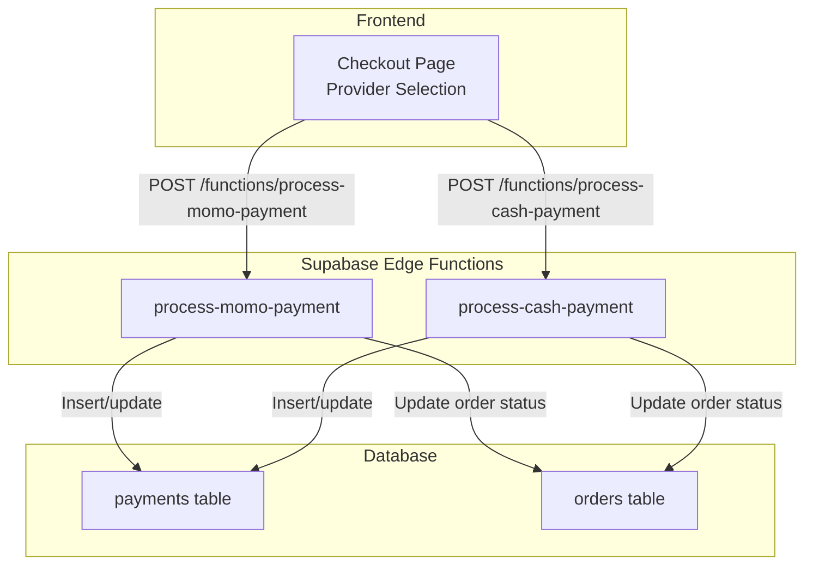
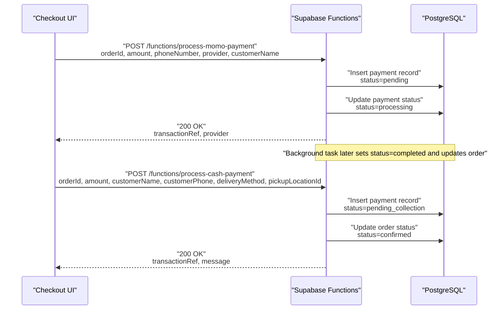
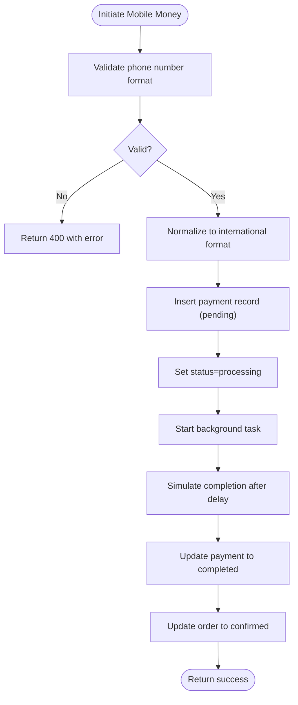
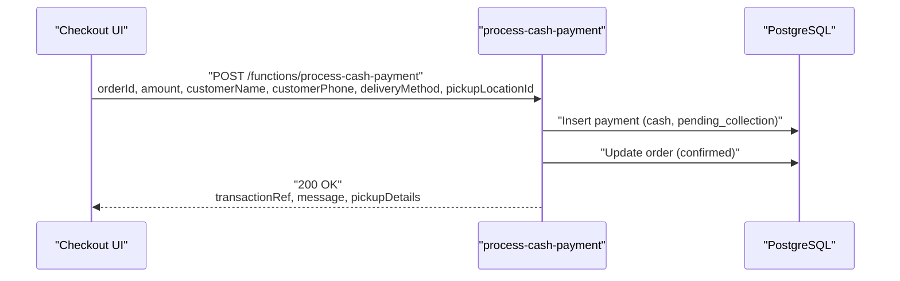
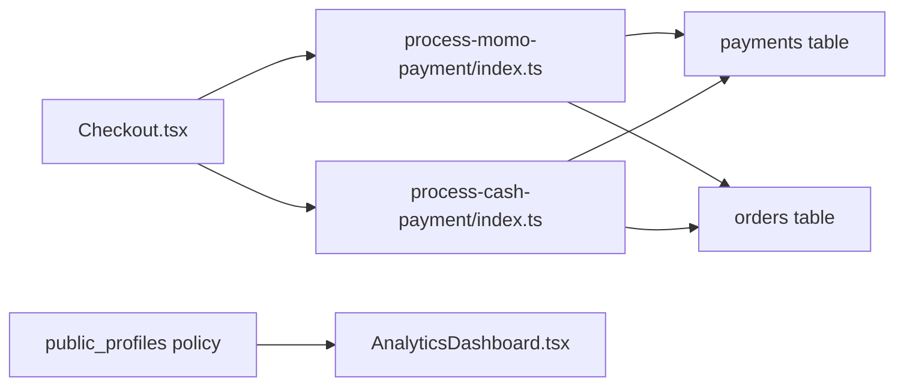

# Payment Providers

<cite>
**Referenced Files in This Document**
- [Checkout.tsx](file://src/pages/Checkout.tsx)
- [process-momo-payment/index.ts](file://supabase/functions/process-momo-payment/index.ts)
- [process-cash-payment/index.ts](file://supabase/functions/process-cash-payment/index.ts)
- [config.toml](file://supabase/config.toml)
- [20260312151243_54077459-7217-4c42-a35e-67af66d898f3.sql](file://supabase/migrations/20260312151243_54077459-7217-4c42-a35e-67af66d898f3.sql)
- [AnalyticsDashboard.tsx](file://src/components/admin/AnalyticsDashboard.tsx)
- [usePlatformStats.tsx](file://src/hooks/usePlatformStats.tsx)
</cite>

## Table of Contents
1. [Introduction](#introduction)
2. [Project Structure](#project-structure)
3. [Core Components](#core-components)
4. [Architecture Overview](#architecture-overview)
5. [Detailed Component Analysis](#detailed-component-analysis)
6. [Dependency Analysis](#dependency-analysis)
7. [Performance Considerations](#performance-considerations)
8. [Troubleshooting Guide](#troubleshooting-guide)
9. [Conclusion](#conclusion)
10. [Appendices](#appendices)

## Introduction
This document describes the payment provider integration system, focusing on:
- Mobile Money providers (MTN Mobile Money and Airtel Money)
- Cash on Delivery (COD)
- The frontend checkout experience and provider selection
- Backend Supabase Functions that orchestrate payment initiation and status updates
- Current limitations and future roadmap for provider abstraction and webhooks

It also outlines how platform analytics surfaces payment-related insights and highlights areas for compliance, limits, and regional restrictions.

## Project Structure
The payment system spans the frontend checkout UI and backend Supabase Edge Functions:
- Frontend: checkout page with provider selection and user prompts
- Backend: two serverless functions for initiating Mobile Money and Cash payments
- Supabase configuration enables function endpoints without JWT verification
- Database migration adjusts a view’s security policy

**Diagram sources**
- [Checkout.tsx:644-690](file://src/pages/Checkout.tsx#L644-L690)
- [process-momo-payment/index.ts:17-150](file://supabase/functions/process-momo-payment/index.ts#L17-L150)
- [process-cash-payment/index.ts:19-113](file://supabase/functions/process-cash-payment/index.ts#L19-L113)
- [20260312151243_54077459-7217-4c42-a35e-67af66d898f3.sql:1-4](file://supabase/migrations/20260312151243_54077459-7217-4c42-a35e-67af66d898f3.sql#L1-L4)

**Section sources**
- [Checkout.tsx:644-690](file://src/pages/Checkout.tsx#L644-L690)
- [process-momo-payment/index.ts:17-150](file://supabase/functions/process-momo-payment/index.ts#L17-L150)
- [process-cash-payment/index.ts:19-113](file://supabase/functions/process-cash-payment/index.ts#L19-L113)
- [config.toml:1-16](file://supabase/config.toml#L1-L16)
- [20260312151243_54077459-7217-4c42-a35e-67af66d898f3.sql:1-4](file://supabase/migrations/20260312151243_54077459-7217-4c42-a35e-67af66d898f3.sql#L1-L4)

## Core Components
- Mobile Money provider selection and initiation:
  - Frontend allows choosing between Mobile Money and Cash on Delivery
  - Mobile Money supports MTN and Airtel variants
  - Backend function validates phone number format, normalizes to international format, creates a payment record, and simulates a background completion
- Cash on Delivery:
  - Records a pending collection payment and immediately confirms the order
  - Provides delivery/pickup messaging based on selected method
- Provider configuration:
  - Supabase Functions are configured to accept requests without JWT verification
- Provider abstraction:
  - Not implemented yet; current code paths are specific to Mobile Money and Cash

**Section sources**
- [Checkout.tsx:644-690](file://src/pages/Checkout.tsx#L644-L690)
- [process-momo-payment/index.ts:33-103](file://supabase/functions/process-momo-payment/index.ts#L33-L103)
- [process-cash-payment/index.ts:44-72](file://supabase/functions/process-cash-payment/index.ts#L44-L72)
- [config.toml:6-10](file://supabase/config.toml#L6-L10)

## Architecture Overview
The checkout flow routes to provider-specific functions. Mobile Money uses a provider field to choose MTN or Airtel, while Cash is a single path. Both functions write to the payments table and update the orders table accordingly.

**Diagram sources**
- [process-momo-payment/index.ts:53-103](file://supabase/functions/process-momo-payment/index.ts#L53-L103)
- [process-cash-payment/index.ts:44-72](file://supabase/functions/process-cash-payment/index.ts#L44-L72)

## Detailed Component Analysis

### Mobile Money Provider Integration (MTN and Airtel)
- Provider selection:
  - The checkout UI presents MTN and Airtel options for Mobile Money
- Request validation and normalization:
  - Phone number is validated for a Ugandan mobile pattern and normalized to an international format
- Payment lifecycle:
  - A payment record is inserted with provider, amount, phone number, and a generated transaction reference
  - Status transitions from pending to processing
  - A background task simulates completion after a delay and updates the payment and order records
- Current limitations:
  - The function includes a placeholder comment indicating that real provider APIs are not integrated yet
  - Webhook handling is not implemented; completion relies on simulated background processing

**Diagram sources**
- [process-momo-payment/index.ts:33-103](file://supabase/functions/process-momo-payment/index.ts#L33-L103)

**Section sources**
- [Checkout.tsx:668-690](file://src/pages/Checkout.tsx#L668-L690)
- [process-momo-payment/index.ts:33-103](file://supabase/functions/process-momo-payment/index.ts#L33-L103)

### Cash on Delivery (COD)
- Payment lifecycle:
  - Inserts a payment record with provider=cash and status=pending_collection
  - Immediately updates the order to confirmed
  - Returns a message tailored to delivery vs pickup
- Pickup location details:
  - Optional pickup location lookup enriches the response with location details

**Diagram sources**
- [process-cash-payment/index.ts:44-72](file://supabase/functions/process-cash-payment/index.ts#L44-L72)

**Section sources**
- [Checkout.tsx:655-665](file://src/pages/Checkout.tsx#L655-L665)
- [process-cash-payment/index.ts:44-72](file://supabase/functions/process-cash-payment/index.ts#L44-L72)

### Provider Abstraction Layer
- Current state:
  - There is no shared abstraction for providers; each provider has its own function
  - The Mobile Money function accepts a provider parameter to differentiate MTN vs Airtel
- Future roadmap:
  - Introduce a unified provider interface to standardize payment processing across methods
  - Centralize configuration, API keys, and webhook handling behind a single abstraction
  - Implement provider-specific adapters for Stripe, MTN MoMo, Airtel Money, and TON

[No sources needed since this section outlines conceptual improvements]

### Provider-Specific Configurations and API Keys Management
- Supabase Functions configuration:
  - Functions are configured to accept requests without JWT verification
- API keys:
  - Not currently used in the provided functions
  - Real provider integrations will require secure storage and retrieval of provider credentials

**Section sources**
- [config.toml:6-10](file://supabase/config.toml#L6-L10)

### Webhook Handling
- Current state:
  - Webhooks are not implemented; completion is simulated via a background task
- Future roadmap:
  - Implement provider webhooks to reliably finalize transactions
  - Validate webhook signatures and handle retries
  - Update payment and order statuses upon webhook confirmation

**Section sources**
- [process-momo-payment/index.ts:105-129](file://supabase/functions/process-momo-payment/index.ts#L105-L129)

### Provider Selection Logic and Fallback Mechanisms
- Selection logic:
  - Mobile Money provider is chosen in the UI; fallback to another provider is not implemented
- Fallback mechanisms:
  - Not present in the current code; future enhancements could include alternate providers or retry strategies

**Section sources**
- [Checkout.tsx:668-690](file://src/pages/Checkout.tsx#L668-L690)

### Provider-Specific Error Handling
- Mobile Money:
  - Validates phone number format and returns structured errors on invalid input
  - General try/catch blocks return 500 with error messages
- Cash:
  - Validates inputs and returns structured errors on failures
  - Logs and continues on order status update failures

**Section sources**
- [process-momo-payment/index.ts:33-40](file://supabase/functions/process-momo-payment/index.ts#L33-L40)
- [process-momo-payment/index.ts:142-149](file://supabase/functions/process-momo-payment/index.ts#L142-L149)
- [process-cash-payment/index.ts:59-62](file://supabase/functions/process-cash-payment/index.ts#L59-L62)
- [process-cash-payment/index.ts:105-112](file://supabase/functions/process-cash-payment/index.ts#L105-L112)

### Payment Provider Dashboard
- Existing analytics:
  - Platform analytics dashboard aggregates counts and distributions but does not currently segment by payment provider
- Recommendations:
  - Extend analytics to include provider-specific transaction volumes, success rates, and performance metrics
  - Surface provider health and latency signals

**Section sources**
- [AnalyticsDashboard.tsx:1-226](file://src/components/admin/AnalyticsDashboard.tsx#L1-L226)
- [usePlatformStats.tsx:1-93](file://src/hooks/usePlatformStats.tsx#L1-L93)

### Compliance Requirements, Transaction Limits, and Regional Restrictions
- Compliance:
  - KYC/AML considerations are not addressed in the current implementation
- Transaction limits:
  - No provider-specific limits are enforced in the code
- Regional restrictions:
  - Phone number validation is specific to Uganda; other regions would require region-aware validation

**Section sources**
- [process-momo-payment/index.ts:33-40](file://supabase/functions/process-momo-payment/index.ts#L33-L40)

## Dependency Analysis
- Frontend depends on provider selection and displays provider-specific instructions
- Functions depend on Supabase client initialization and database tables
- Database views and policies influence data access and security

**Diagram sources**
- [Checkout.tsx:644-690](file://src/pages/Checkout.tsx#L644-L690)
- [process-momo-payment/index.ts:24-26](file://supabase/functions/process-momo-payment/index.ts#L24-L26)
- [process-cash-payment/index.ts:26-28](file://supabase/functions/process-cash-payment/index.ts#L26-L28)
- [20260312151243_54077459-7217-4c42-a35e-67af66d898f3.sql:2-3](file://supabase/migrations/20260312151243_54077459-7217-4c42-a35e-67af66d898f3.sql#L2-L3)
- [AnalyticsDashboard.tsx:1-226](file://src/components/admin/AnalyticsDashboard.tsx#L1-L226)

**Section sources**
- [Checkout.tsx:644-690](file://src/pages/Checkout.tsx#L644-L690)
- [process-momo-payment/index.ts:24-26](file://supabase/functions/process-momo-payment/index.ts#L24-L26)
- [process-cash-payment/index.ts:26-28](file://supabase/functions/process-cash-payment/index.ts#L26-L28)
- [20260312151243_54077459-7217-4c42-a35e-67af66d898f3.sql:2-3](file://supabase/migrations/20260312151243_54077459-7217-4c42-a35e-67af66d898f3.sql#L2-L3)
- [AnalyticsDashboard.tsx:1-226](file://src/components/admin/AnalyticsDashboard.tsx#L1-L226)

## Performance Considerations
- Asynchronous background tasks:
  - Mobile Money function runs a background task to avoid blocking the HTTP response
- Database writes:
  - Minimize round-trips by batching related updates where feasible
- Function cold starts:
  - Keep function code lean and rely on Supabase Edge Runtime for performance

[No sources needed since this section provides general guidance]

## Troubleshooting Guide
- Mobile Money initiation fails:
  - Verify phone number format matches the expected pattern
  - Check function logs for validation or database insertion errors
- Cash payment not confirming order:
  - Confirm order status update succeeded; inspect function logs for errors
- Webhook-driven completions:
  - Not implemented yet; ensure background simulation completes as expected

**Section sources**
- [process-momo-payment/index.ts:33-40](file://supabase/functions/process-momo-payment/index.ts#L33-L40)
- [process-momo-payment/index.ts:142-149](file://supabase/functions/process-momo-payment/index.ts#L142-L149)
- [process-cash-payment/index.ts:64-72](file://supabase/functions/process-cash-payment/index.ts#L64-L72)
- [process-cash-payment/index.ts:105-112](file://supabase/functions/process-cash-payment/index.ts#L105-L112)

## Conclusion
The current payment system provides a clear path for Mobile Money and Cash on Delivery, with provider selection and basic validation. The functions insert payment records and update order statuses, though real provider integrations and webhooks are placeholders. Extending the system to include a unified provider abstraction, robust webhook handling, and comprehensive analytics will enable scalable, compliant, and region-aware payment processing.

[No sources needed since this section summarizes without analyzing specific files]

## Appendices

### Appendix A: Provider Roadmap
- Implement provider abstraction with standardized interfaces
- Add Stripe, MTN MoMo, Airtel Money, and TON integrations
- Enforce provider-specific limits and regional restrictions
- Build webhook handlers with signature verification and retry logic
- Enhance analytics dashboard with provider-specific metrics

[No sources needed since this section outlines conceptual improvements]