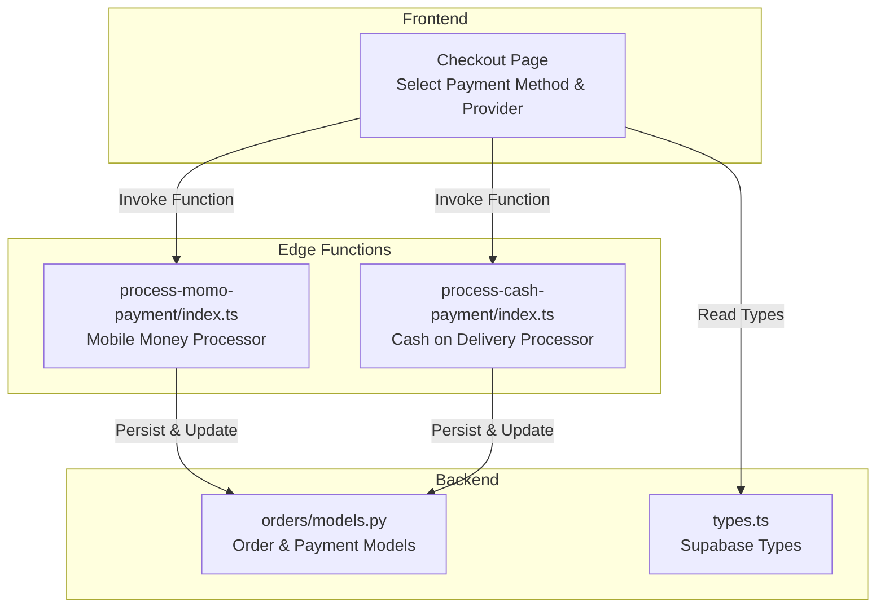
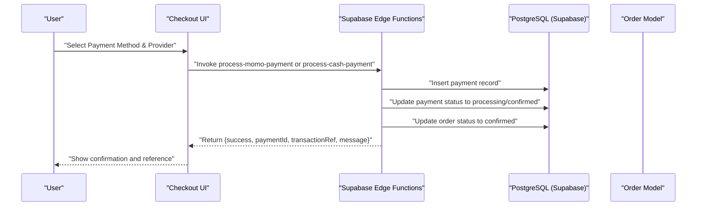
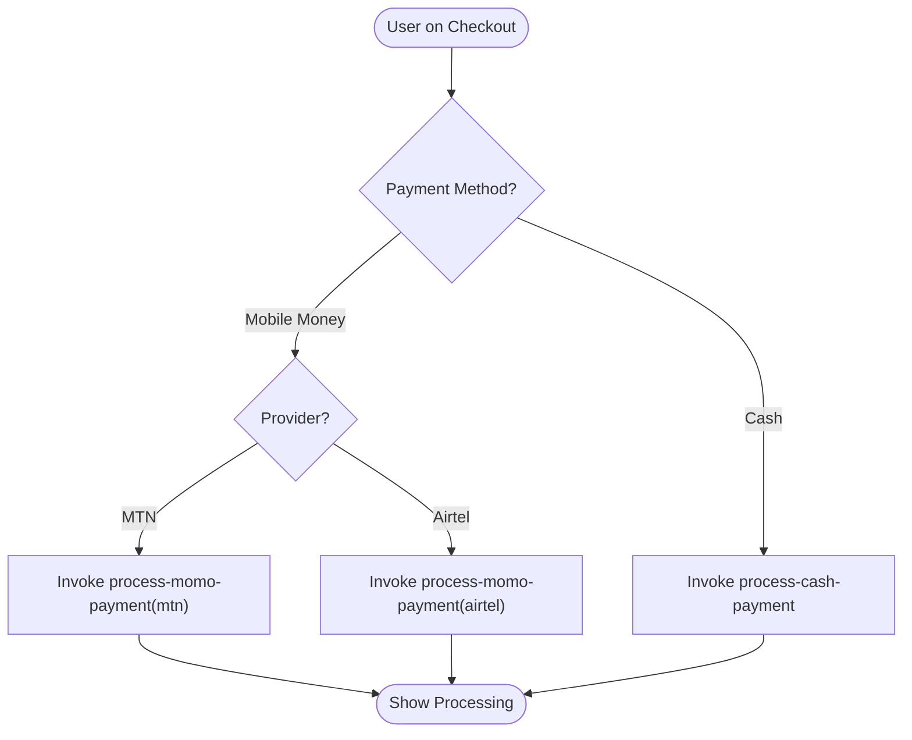
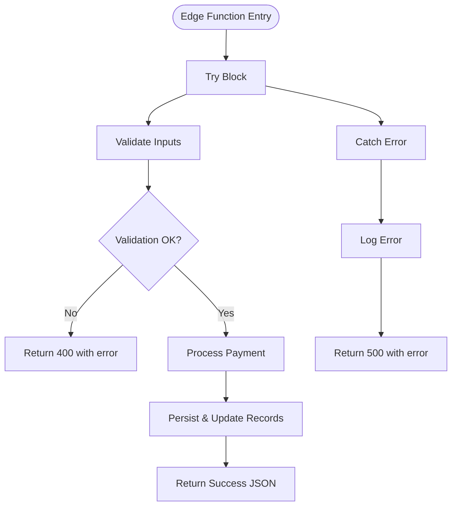
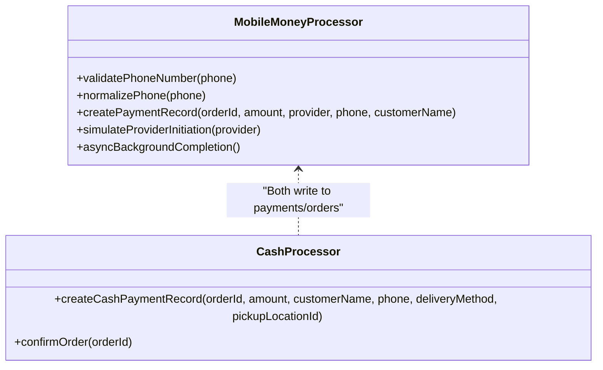
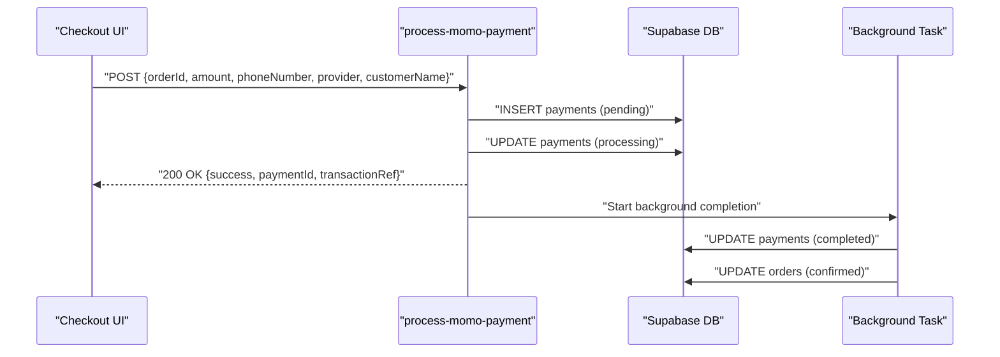
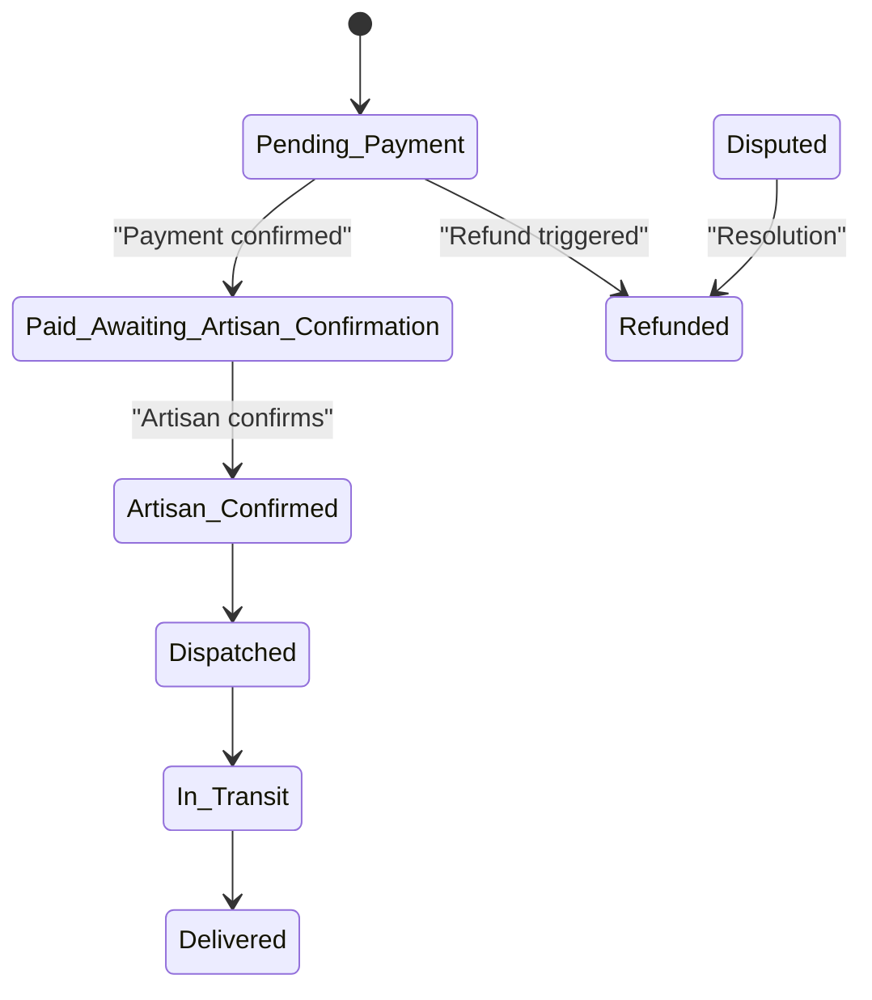
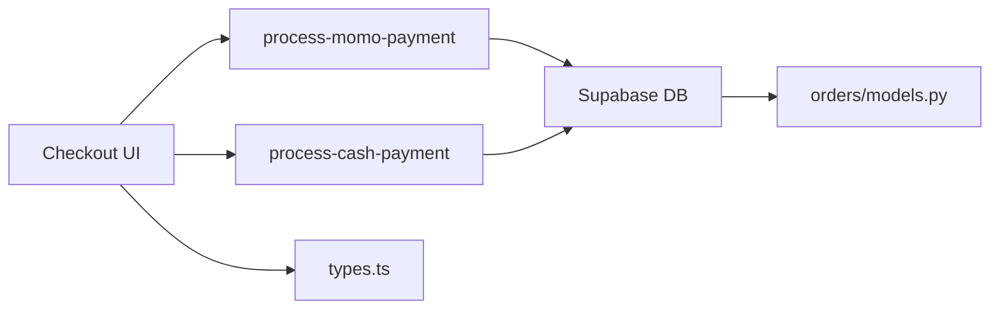

# Provider Abstraction Layer

<cite>
**Referenced Files in This Document**
- [Checkout.tsx](file://apps/web/src/pages/Checkout.tsx)
- [process-momo-payment/index.ts](file://supabase/functions/process-momo-payment/index.ts)
- [process-cash-payment/index.ts](file://supabase/functions/process-cash-payment/index.ts)
- [orders/models.py](file://backend/apps/orders/models.py)
- [types.ts](file://apps/web/src/integrations/supabase/types.ts)
</cite>

## Table of Contents
1. [Introduction](#introduction)
2. [Project Structure](#project-structure)
3. [Core Components](#core-components)
4. [Architecture Overview](#architecture-overview)
5. [Detailed Component Analysis](#detailed-component-analysis)
6. [Dependency Analysis](#dependency-analysis)
7. [Performance Considerations](#performance-considerations)
8. [Troubleshooting Guide](#troubleshooting-guide)
9. [Conclusion](#conclusion)
10. [Appendices](#appendices)

## Introduction
This document describes the payment provider abstraction layer that standardizes payment processing across multiple methods in the system. It focuses on the provider interface design, common payment operations, unified error handling patterns, provider selection logic, fallback mechanisms, provider-specific configuration management, payment processor architecture, transaction lifecycle management, provider switching capabilities, provider registry and dynamic loading, runtime configuration, and the benefits for adding new providers while maintaining consistency and simplifying frontend integration. It also covers performance monitoring, transaction analytics, and provider health checks.

## Project Structure
The payment abstraction spans three layers:
- Frontend checkout flow that selects payment method and provider
- Supabase Edge Functions that implement provider-specific processors
- Backend models that define the transaction lifecycle and payment metadata

**Diagram sources**
- [Checkout.tsx:650-847](file://apps/web/src/pages/Checkout.tsx#L650-L847)
- [process-momo-payment/index.ts:1-151](file://supabase/functions/process-momo-payment/index.ts#L1-L151)
- [process-cash-payment/index.ts:1-114](file://supabase/functions/process-cash-payment/index.ts#L1-L114)
- [orders/models.py:10-122](file://backend/apps/orders/models.py#L10-L122)
- [types.ts:371-465](file://apps/web/src/integrations/supabase/types.ts#L371-L465)

**Section sources**
- [Checkout.tsx:650-847](file://apps/web/src/pages/Checkout.tsx#L650-L847)
- [process-momo-payment/index.ts:1-151](file://supabase/functions/process-momo-payment/index.ts#L1-L151)
- [process-cash-payment/index.ts:1-114](file://supabase/functions/process-cash-payment/index.ts#L1-L114)
- [orders/models.py:10-122](file://backend/apps/orders/models.py#L10-L122)
- [types.ts:371-465](file://apps/web/src/integrations/supabase/types.ts#L371-L465)

## Core Components
- Provider selection UI: Allows users to choose between Mobile Money and Cash on Delivery, and further select MTN MoMo or Airtel Money when applicable.
- Mobile Money processor: Validates phone number, normalizes to international format, creates a payment record, simulates provider initiation, updates statuses asynchronously, and returns a transaction reference.
- Cash on Delivery processor: Creates a pending collection payment record, immediately confirms the order, and returns a localized message with pickup/delivery details.
- Order lifecycle model: Defines payment method choices, statuses, and fields for payment references and timestamps.
- Supabase types: Define frontend-facing types for payments and related fields.

**Section sources**
- [Checkout.tsx:650-847](file://apps/web/src/pages/Checkout.tsx#L650-L847)
- [process-momo-payment/index.ts:23-150](file://supabase/functions/process-momo-payment/index.ts#L23-L150)
- [process-cash-payment/index.ts:25-113](file://supabase/functions/process-cash-payment/index.ts#L25-L113)
- [orders/models.py:16-86](file://backend/apps/orders/models.py#L16-L86)
- [types.ts:423-465](file://apps/web/src/integrations/supabase/types.ts#L423-L465)

## Architecture Overview
The abstraction separates concerns:
- UI layer handles user selection and displays provider-specific prompts.
- Edge Functions encapsulate provider-specific logic behind a uniform interface.
- Backend models enforce a consistent transaction lifecycle and payment metadata.

**Diagram sources**
- [Checkout.tsx:207-244](file://apps/web/src/pages/Checkout.tsx#L207-L244)
- [process-momo-payment/index.ts:53-130](file://supabase/functions/process-momo-payment/index.ts#L53-L130)
- [process-cash-payment/index.ts:44-90](file://supabase/functions/process-cash-payment/index.ts#L44-L90)
- [orders/models.py:56-86](file://backend/apps/orders/models.py#L56-L86)

## Detailed Component Analysis

### Provider Selection Logic and Fallback Mechanisms
- The UI presents two primary payment methods: Mobile Money and Cash on Delivery.
- When Mobile Money is selected, the user chooses a provider (MTN MoMo or Airtel Money).
- Cash on Delivery bypasses provider selection and proceeds directly to order confirmation.
- Fallback behavior is implicit: if a provider-specific function fails, the UI surfaces an error and allows retry.

**Diagram sources**
- [Checkout.tsx:650-704](file://apps/web/src/pages/Checkout.tsx#L650-L704)
- [process-momo-payment/index.ts:17-31](file://supabase/functions/process-momo-payment/index.ts#L17-L31)
- [process-cash-payment/index.ts:19-37](file://supabase/functions/process-cash-payment/index.ts#L19-L37)

**Section sources**
- [Checkout.tsx:650-704](file://apps/web/src/pages/Checkout.tsx#L650-L704)

### Unified Error Handling Patterns
- Both Edge Functions wrap processing in try/catch blocks, log errors, and return structured JSON with success flags and error messages.
- HTTP status codes are used appropriately (e.g., 400 for validation errors, 500 for internal errors).
- Frontend code checks for response success and surfaces user-friendly messages.

**Diagram sources**
- [process-momo-payment/index.ts:23-150](file://supabase/functions/process-momo-payment/index.ts#L23-L150)
- [process-cash-payment/index.ts:25-113](file://supabase/functions/process-cash-payment/index.ts#L25-L113)

**Section sources**
- [process-momo-payment/index.ts:142-149](file://supabase/functions/process-momo-payment/index.ts#L142-L149)
- [process-cash-payment/index.ts:105-112](file://supabase/functions/process-cash-payment/index.ts#L105-L112)
- [Checkout.tsx:246-249](file://apps/web/src/pages/Checkout.tsx#L246-L249)

### Provider-Specific Configuration Management
- Mobile Money processor accepts provider parameter and validates phone number format for Uganda, normalizing to international format.
- Cash processor records provider as a constant and sets appropriate status for collection.
- Configuration is environment-driven via Supabase service keys and function-level environment access.

**Diagram sources**
- [process-momo-payment/index.ts:33-129](file://supabase/functions/process-momo-payment/index.ts#L33-L129)
- [process-cash-payment/index.ts:44-90](file://supabase/functions/process-cash-payment/index.ts#L44-L90)

**Section sources**
- [process-momo-payment/index.ts:33-48](file://supabase/functions/process-momo-payment/index.ts#L33-L48)
- [process-cash-payment/index.ts:44-68](file://supabase/functions/process-cash-payment/index.ts#L44-L68)

### Payment Processor Architecture
- Edge Functions act as providers: they receive a standardized payload, validate, persist state, and trigger asynchronous updates.
- Asynchronous background tasks update payment and order statuses without blocking the HTTP response.
- Transaction references are generated per operation to unify frontend UX.

**Diagram sources**
- [process-momo-payment/index.ts:53-130](file://supabase/functions/process-momo-payment/index.ts#L53-L130)
- [Checkout.tsx:212-222](file://apps/web/src/pages/Checkout.tsx#L212-L222)

**Section sources**
- [process-momo-payment/index.ts:99-130](file://supabase/functions/process-momo-payment/index.ts#L99-L130)
- [Checkout.tsx:212-222](file://apps/web/src/pages/Checkout.tsx#L212-L222)

### Transaction Lifecycle Management
- Payments are tracked with a consistent set of fields: amount, provider, phone number, transaction reference, and status.
- Order status transitions are coordinated with payment completion.
- The model defines payment method choices and lifecycle statuses.

**Diagram sources**
- [orders/models.py:16-25](file://backend/apps/orders/models.py#L16-L25)

**Section sources**
- [orders/models.py:16-86](file://backend/apps/orders/models.py#L16-L86)

### Provider Switching Capabilities
- The UI supports switching between MTN MoMo and Airtel Money for Mobile Money payments.
- The Edge Functions accept a provider parameter and route accordingly.
- Cash on Delivery remains provider-agnostic and does not require switching.

**Section sources**
- [Checkout.tsx:668-704](file://apps/web/src/pages/Checkout.tsx#L668-L704)
- [process-momo-payment/index.ts:13-31](file://supabase/functions/process-momo-payment/index.ts#L13-L31)

### Provider Registry System, Dynamic Loading, and Runtime Configuration
- Current implementation uses separate Edge Functions per provider (process-momo-payment, process-cash-payment).
- There is no centralized provider registry or dynamic loader in the current codebase.
- Runtime configuration is minimal and relies on environment variables and function parameters.

**Section sources**
- [process-momo-payment/index.ts:24-26](file://supabase/functions/process-momo-payment/index.ts#L24-L26)
- [process-cash-payment/index.ts:26-28](file://supabase/functions/process-cash-payment/index.ts#L26-L28)

### Abstraction Benefits
- Uniform interface for invoking payments from the frontend.
- Consistent transaction references and status updates across providers.
- Simplified frontend integration by hiding provider differences behind function invocations.
- Easier addition of new providers by implementing a new Edge Function with the same contract.

**Section sources**
- [Checkout.tsx:207-244](file://apps/web/src/pages/Checkout.tsx#L207-L244)
- [process-momo-payment/index.ts:17-31](file://supabase/functions/process-momo-payment/index.ts#L17-L31)
- [process-cash-payment/index.ts:19-37](file://supabase/functions/process-cash-payment/index.ts#L19-L37)

## Dependency Analysis
- Frontend depends on Supabase functions for payment processing.
- Edge Functions depend on Supabase client and environment variables.
- Edge Functions update the same database schema used by backend models.
- Supabase types define the shape of returned data for the frontend.

**Diagram sources**
- [Checkout.tsx:207-244](file://apps/web/src/pages/Checkout.tsx#L207-L244)
- [process-momo-payment/index.ts:24-26](file://supabase/functions/process-momo-payment/index.ts#L24-L26)
- [process-cash-payment/index.ts:26-28](file://supabase/functions/process-cash-payment/index.ts#L26-L28)
- [orders/models.py:10-122](file://backend/apps/orders/models.py#L10-L122)
- [types.ts:423-465](file://apps/web/src/integrations/supabase/types.ts#L423-L465)

**Section sources**
- [Checkout.tsx:207-244](file://apps/web/src/pages/Checkout.tsx#L207-L244)
- [process-momo-payment/index.ts:24-26](file://supabase/functions/process-momo/payment/index.ts#L24-L26)
- [process-cash-payment/index.ts:26-28](file://supabase/functions/process-cash-payment/index.ts#L26-L28)
- [orders/models.py:10-122](file://backend/apps/orders/models.py#L10-L122)
- [types.ts:423-465](file://apps/web/src/integrations/supabase/types.ts#L423-L465)

## Performance Considerations
- Asynchronous background tasks prevent blocking the HTTP response, improving perceived performance.
- Validation occurs early to fail fast and reduce unnecessary database writes.
- Transaction reference generation ensures idempotent retries and audit trails.
- Recommendation: Add metrics logging and health checks for provider functions to monitor latency and error rates.

[No sources needed since this section provides general guidance]

## Troubleshooting Guide
- Phone number validation failures: Verify the phone number matches the expected format for Uganda and ensure normalization to international format.
- Payment creation failures: Check database insert errors and logs emitted by the Edge Functions.
- Status update failures: Confirm order status transitions occur after payment completion and inspect database updates.
- Frontend errors: Inspect response success flags and error messages returned by the functions.

**Section sources**
- [process-momo-payment/index.ts:33-40](file://supabase/functions/process-momo-payment/index.ts#L33-L40)
- [process-momo-payment/index.ts:68-71](file://supabase/functions/process-momo-payment/index.ts#L68-L71)
- [process-cash-payment/index.ts:59-62](file://supabase/functions/process-cash-payment/index.ts#L59-L62)
- [Checkout.tsx:246-249](file://apps/web/src/pages/Checkout.tsx#L246-L249)

## Conclusion
The current abstraction layer provides a clean separation between UI, provider-specific processors, and backend models. It standardizes payment operations, unifies error handling, and simplifies frontend integration. Extending support to new providers requires implementing a new Edge Function with a consistent interface. Future enhancements could include a centralized provider registry, dynamic loading, runtime configuration, performance monitoring, transaction analytics, and provider health checks.

[No sources needed since this section summarizes without analyzing specific files]

## Appendices

### API Definitions
- process-momo-payment
  - Method: POST
  - Body fields: orderId, amount, phoneNumber, provider, customerName
  - Response fields: success, paymentId, transactionRef, message, provider
  - Status codes: 200 on success, 400 on validation error, 500 on internal error

- process-cash-payment
  - Method: POST
  - Body fields: orderId, amount, customerName, customerPhone, deliveryMethod, pickupLocationId (optional)
  - Response fields: success, paymentId, transactionRef, message, deliveryMethod, pickupDetails (optional), amountDue
  - Status codes: 200 on success, 500 on internal error

**Section sources**
- [process-momo-payment/index.ts:9-15](file://supabase/functions/process-momo-payment/index.ts#L9-L15)
- [process-momo-payment/index.ts:131-140](file://supabase/functions/process-momo-payment/index.ts#L131-L140)
- [process-cash-payment/index.ts:9-17](file://supabase/functions/process-cash-payment/index.ts#L9-L17)
- [process-cash-payment/index.ts:92-103](file://supabase/functions/process-cash-payment/index.ts#L92-L103)