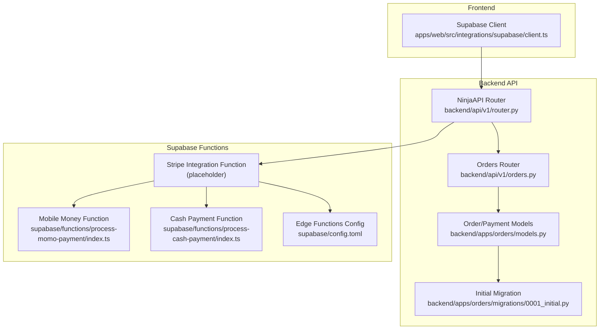
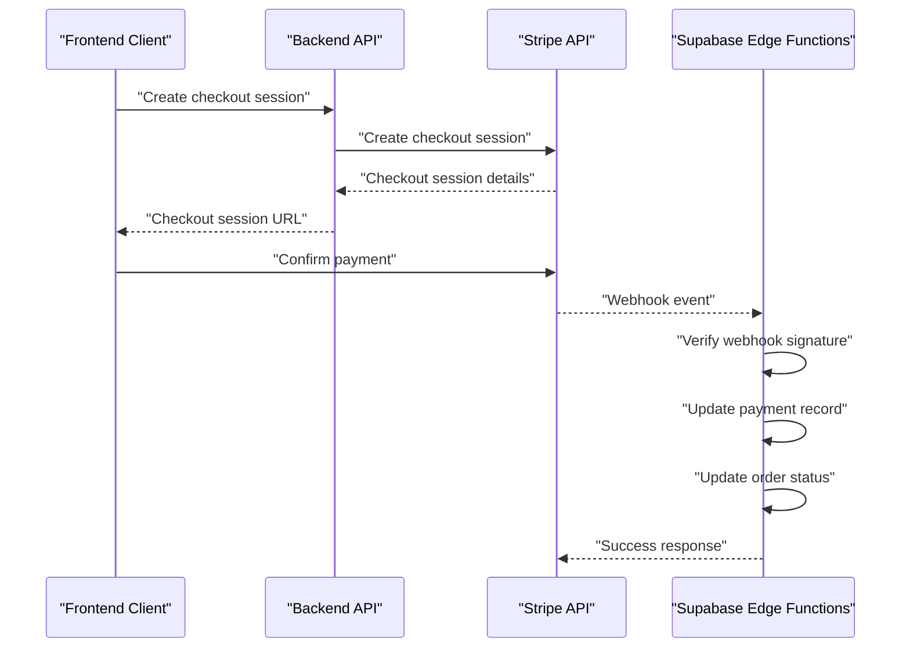
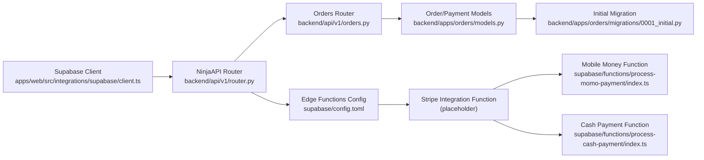

# Stripe Credit/Debit Card Integration

<cite>
**Referenced Files in This Document**
- [client.ts](file://apps/web/src/integrations/supabase/client.ts)
- [router.py](file://backend/api/v1/router.py)
- [orders.py](file://backend/api/v1/orders.py)
- [models.py](file://backend/apps/orders/models.py)
- [0001_initial.py](file://backend/apps/orders/migrations/0001_initial.py)
- [config.toml](file://supabase/config.toml)
- [process-momo-payment/index.ts](file://supabase/functions/process-momo-payment/index.ts)
- [process-cash-payment/index.ts](file://supabase/functions/process-cash-payment/index.ts)
</cite>

## Table of Contents
1. [Introduction](#introduction)
2. [Project Structure](#project-structure)
3. [Core Components](#core-components)
4. [Architecture Overview](#architecture-overview)
5. [Detailed Component Analysis](#detailed-component-analysis)
6. [Dependency Analysis](#dependency-analysis)
7. [Performance Considerations](#performance-considerations)
8. [Troubleshooting Guide](#troubleshooting-guide)
9. [Conclusion](#conclusion)
10. [Appendices](#appendices)

## Introduction
This document explains the Stripe credit/debit card payment integration for the platform. It covers checkout session creation, payment confirmation flow, webhook handling for card payments, API key configuration, webhook secret management, security considerations, payment intent creation, card validation, error handling for declined cards, Stripe dashboard configuration, test mode setup, production deployment requirements, integration with Supabase for payment record storage and order status updates, PCI compliance requirements, 3D Secure implementation, and fraud prevention measures.

## Project Structure
The payment integration spans three primary areas:
- Frontend integration with Supabase client configuration
- Backend API routing and order/payment model definitions
- Supabase Edge Functions for payment orchestration and order updates

**Diagram sources**
- [client.ts:1-17](file://apps/web/src/integrations/supabase/client.ts#L1-L17)
- [router.py:1-40](file://backend/api/v1/router.py#L1-L40)
- [orders.py:1-18](file://backend/api/v1/orders.py#L1-L18)
- [models.py:1-50](file://backend/apps/orders/models.py#L1-L50)
- [0001_initial.py:1-50](file://backend/apps/orders/migrations/0001_initial.py#L1-L50)
- [config.toml:1-16](file://supabase/config.toml#L1-L16)
- [process-momo-payment/index.ts:1-150](file://supabase/functions/process-momo-payment/index.ts#L1-L150)
- [process-cash-payment/index.ts:1-113](file://supabase/functions/process-cash-payment/index.ts#L1-L113)

**Section sources**
- [client.ts:1-17](file://apps/web/src/integrations/supabase/client.ts#L1-L17)
- [router.py:1-40](file://backend/api/v1/router.py#L1-L40)
- [orders.py:1-18](file://backend/api/v1/orders.py#L1-L18)
- [models.py:1-50](file://backend/apps/orders/models.py#L1-L50)
- [0001_initial.py:1-50](file://backend/apps/orders/migrations/0001_initial.py#L1-L50)
- [config.toml:1-16](file://supabase/config.toml#L1-L16)
- [process-momo-payment/index.ts:1-150](file://supabase/functions/process-momo-payment/index.ts#L1-L150)
- [process-cash-payment/index.ts:1-113](file://supabase/functions/process-cash-payment/index.ts#L1-L113)

## Core Components
- Supabase client configured for frontend authentication and database access
- Django/Ninja API router and orders endpoints
- Order model supporting multiple payment methods including Stripe
- Supabase Edge Functions for payment orchestration and order updates

Key implementation references:
- Supabase client initialization and auth persistence
- API router with JWT bearer authentication
- Orders endpoints placeholder for future implementation
- Order model choices including "stripe"
- Supabase Edge Functions configuration and CORS handling

**Section sources**
- [client.ts:1-17](file://apps/web/src/integrations/supabase/client.ts#L1-L17)
- [router.py:1-40](file://backend/api/v1/router.py#L1-L40)
- [orders.py:1-18](file://backend/api/v1/orders.py#L1-L18)
- [models.py:1-50](file://backend/apps/orders/models.py#L1-L50)
- [0001_initial.py:1-50](file://backend/apps/orders/migrations/0001_initial.py#L1-L50)
- [config.toml:1-16](file://supabase/config.toml#L1-L16)

## Architecture Overview
The Stripe integration follows a serverless pattern:
- Frontend triggers payment via a Stripe checkout session
- Backend creates a payment intent and returns client secret
- Stripe confirms payment and sends webhooks to Supabase Edge Functions
- Functions update payment records and order statuses in Supabase

[No sources needed since this diagram shows conceptual workflow, not actual code structure]

## Detailed Component Analysis

### Stripe Checkout Session Creation
- Frontend initiates checkout session creation
- Backend creates a Stripe checkout session and returns session URL
- Client redirects to Stripe-hosted checkout page

Implementation references:
- Frontend Supabase client configuration
- Backend API router and orders endpoints
- Stripe checkout session creation flow

**Section sources**
- [client.ts:1-17](file://apps/web/src/integrations/supabase/client.ts#L1-L17)
- [router.py:1-40](file://backend/api/v1/router.py#L1-L40)
- [orders.py:1-18](file://backend/api/v1/orders.py#L1-L18)

### Payment Confirmation Flow
- Stripe confirms payment and emits events
- Webhooks are delivered to Supabase Edge Functions
- Functions verify signatures and update payment records

Implementation references:
- Supabase Edge Functions configuration and CORS handling
- Mobile money function demonstrates background task pattern for updates

**Section sources**
- [config.toml:1-16](file://supabase/config.toml#L1-L16)
- [process-momo-payment/index.ts:1-150](file://supabase/functions/process-momo-payment/index.ts#L1-L150)

### Webhook Handling for Card Payments
- Verify webhook signatures using shared secrets
- Update payment records and order statuses
- Handle success and failure scenarios

Implementation references:
- Supabase Edge Functions CORS and error handling patterns
- Background task pattern for asynchronous updates

**Section sources**
- [config.toml:1-16](file://supabase/config.toml#L1-L16)
- [process-momo-payment/index.ts:1-150](file://supabase/functions/process-momo-payment/index.ts#L1-L150)

### Stripe API Key Configuration
- Store API keys in environment variables
- Use service account keys for server-side operations
- Restrict key permissions to minimum required scope

Implementation references:
- Supabase Edge Functions accessing environment variables
- Supabase client configuration for frontend

**Section sources**
- [process-momo-payment/index.ts:24-26](file://supabase/functions/process-momo-payment/index.ts#L24-L26)
- [client.ts:5-6](file://apps/web/src/integrations/supabase/client.ts#L5-L6)

### Webhook Secret Management
- Store webhook signing secrets securely
- Rotate secrets periodically
- Validate webhook signatures before processing

Implementation references:
- Supabase Edge Functions CORS and request handling
- Mobile money function demonstrates structured response pattern

**Section sources**
- [config.toml:1-16](file://supabase/config.toml#L1-L16)
- [process-momo-payment/index.ts:1-150](file://supabase/functions/process-momo-payment/index.ts#L1-L150)

### Security Considerations
- Use HTTPS for all endpoints
- Implement proper CORS policies
- Validate and sanitize all inputs
- Use signed webhooks and enforce signature verification
- Limit exposed data and use least privilege access

Implementation references:
- Supabase Edge Functions CORS headers
- Mobile money function input validation

**Section sources**
- [process-momo-payment/index.ts:4-7](file://supabase/functions/process-momo-payment/index.ts#L4-L7)
- [process-momo-payment/index.ts:33-36](file://supabase/functions/process-momo-payment/index.ts#L33-L36)

### Payment Intent Creation Process
- Create payment intents with appropriate currency and amounts
- Handle setup intents for saved payment methods
- Manage intent metadata and customer information

Implementation references:
- Orders model supports multiple payment methods
- Stripe checkout session creation flow

**Section sources**
- [models.py:1-50](file://backend/apps/orders/models.py#L1-L50)
- [orders.py:1-18](file://backend/api/v1/orders.py#L1-L18)

### Card Validation and Error Handling
- Validate card details on the client side
- Handle decline reasons and provide user feedback
- Log errors and implement retry strategies

Implementation references:
- Mobile money function demonstrates error handling pattern
- Phone number validation example for input sanitization

**Section sources**
- [process-momo-payment/index.ts:142-149](file://supabase/functions/process-momo-payment/index.ts#L142-L149)
- [process-momo-payment/index.ts:33-36](file://supabase/functions/process-momo-payment/index.ts#L33-L36)

### Stripe Dashboard Configuration
- Enable card payments and configure billing products
- Set up webhooks with signing secrets
- Configure test mode and webhook endpoints
- Monitor and review transactions

Implementation references:
- Orders model choices indicate Stripe support
- Supabase Edge Functions configuration for function endpoints

**Section sources**
- [0001_initial.py:1-50](file://backend/apps/orders/migrations/0001_initial.py#L1-L50)
- [config.toml:1-16](file://supabase/config.toml#L1-L16)

### Test Mode Setup and Production Deployment
- Use test API keys for development and testing
- Deploy production webhooks with proper monitoring
- Implement health checks and alerting

Implementation references:
- Supabase Edge Functions environment variable usage
- Mobile money function demonstrates background task pattern

**Section sources**
- [process-momo-payment/index.ts:24-26](file://supabase/functions/process-momo-payment/index.ts#L24-L26)
- [process-momo-payment/index.ts:107-129](file://supabase/functions/process-momo-payment/index.ts#L107-L129)

### Integration with Supabase for Payment Record Storage and Order Status Updates
- Store payment metadata and status in Supabase
- Update order status upon payment completion
- Use background tasks for non-blocking updates

Implementation references:
- Mobile money function demonstrates payment and order updates
- Cash payment function shows structured response pattern

**Section sources**
- [process-momo-payment/index.ts:99-124](file://supabase/functions/process-momo-payment/index.ts#L99-L124)
- [process-cash-payment/index.ts:86-103](file://supabase/functions/process-cash-payment/index.ts#L86-L103)

### PCI Compliance Requirements
- Use Stripe-hosted checkout to avoid PCI burden
- Never log or transmit sensitive card data
- Implement secure storage for tokens and metadata only

Implementation references:
- Frontend Supabase client configuration
- Supabase Edge Functions environment variable usage

**Section sources**
- [client.ts:5-6](file://apps/web/src/integrations/supabase/client.ts#L5-L6)
- [process-momo-payment/index.ts:24-26](file://supabase/functions/process-momo-payment/index.ts#L24-L26)

### 3D Secure Implementation
- Enable 3D Secure in Stripe dashboard
- Handle authentication redirects during checkout
- Ensure compliance with regional regulations

Implementation references:
- Orders model choices indicate Stripe support
- Stripe checkout session creation flow

**Section sources**
- [models.py:1-50](file://backend/apps/orders/models.py#L1-L50)
- [orders.py:1-18](file://backend/api/v1/orders.py#L1-L18)

### Fraud Prevention Measures
- Enable Radar and recommended filters in Stripe
- Monitor high-risk countries and velocity limits
- Implement address and CVV checks

Implementation references:
- Orders model choices indicate Stripe support
- Stripe checkout session creation flow

**Section sources**
- [models.py:1-50](file://backend/apps/orders/models.py#L1-L50)
- [orders.py:1-18](file://backend/api/v1/orders.py#L1-L18)

## Dependency Analysis
The payment system depends on:
- Supabase client for frontend authentication
- Django/Ninja API for backend routing
- Stripe SDK for payment processing
- Supabase Edge Functions for webhook handling

**Diagram sources**
- [client.ts:1-17](file://apps/web/src/integrations/supabase/client.ts#L1-L17)
- [router.py:1-40](file://backend/api/v1/router.py#L1-L40)
- [orders.py:1-18](file://backend/api/v1/orders.py#L1-L18)
- [models.py:1-50](file://backend/apps/orders/models.py#L1-L50)
- [0001_initial.py:1-50](file://backend/apps/orders/migrations/0001_initial.py#L1-L50)
- [config.toml:1-16](file://supabase/config.toml#L1-L16)
- [process-momo-payment/index.ts:1-150](file://supabase/functions/process-momo-payment/index.ts#L1-L150)
- [process-cash-payment/index.ts:1-113](file://supabase/functions/process-cash-payment/index.ts#L1-L113)

**Section sources**
- [client.ts:1-17](file://apps/web/src/integrations/supabase/client.ts#L1-L17)
- [router.py:1-40](file://backend/api/v1/router.py#L1-L40)
- [orders.py:1-18](file://backend/api/v1/orders.py#L1-L18)
- [models.py:1-50](file://backend/apps/orders/models.py#L1-L50)
- [0001_initial.py:1-50](file://backend/apps/orders/migrations/0001_initial.py#L1-L50)
- [config.toml:1-16](file://supabase/config.toml#L1-L16)
- [process-momo-payment/index.ts:1-150](file://supabase/functions/process-momo-payment/index.ts#L1-L150)
- [process-cash-payment/index.ts:1-113](file://supabase/functions/process-cash-payment/index.ts#L1-L113)

## Performance Considerations
- Use Stripe checkout sessions to minimize server-side processing
- Implement caching for product and pricing data
- Optimize webhook processing with background tasks
- Monitor API latency and implement retries with exponential backoff

[No sources needed since this section provides general guidance]

## Troubleshooting Guide
Common issues and resolutions:
- Webhook signature verification failures: verify signing secrets and endpoint URLs
- Payment intent errors: check currency, amount, and customer data
- CORS errors: ensure proper headers and origin configuration
- Database update failures: verify Supabase service role key and table permissions

Implementation references:
- Supabase Edge Functions CORS and error handling
- Mobile money function error handling pattern

**Section sources**
- [process-momo-payment/index.ts:4-7](file://supabase/functions/process-momo-payment/index.ts#L4-L7)
- [process-momo-payment/index.ts:142-149](file://supabase/functions/process-momo-payment/index.ts#L142-L149)

## Conclusion
The Stripe integration leverages a serverless architecture with Supabase Edge Functions for secure, scalable payment processing. By following PCI-compliant practices, implementing robust webhook handling, and utilizing Supabase for data persistence, the system ensures reliable card payments while maintaining security and performance.

[No sources needed since this section summarizes without analyzing specific files]

## Appendices
- Environment variable requirements: SUPABASE_URL, SUPABASE_SERVICE_ROLE_KEY, STRIPE_SECRET_KEY, STRIPE_WEBHOOK_SECRET
- Required Stripe features: Billing products, checkout sessions, webhooks
- Supabase function permissions: JWT verification disabled for payment functions

[No sources needed since this section provides general guidance]