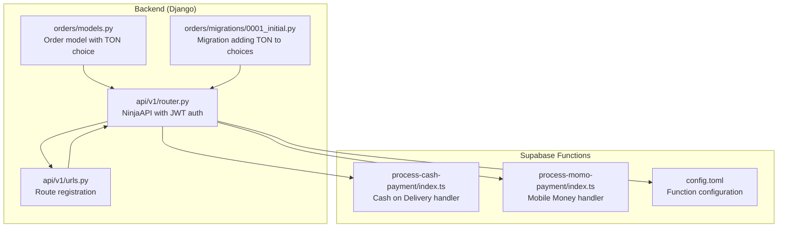
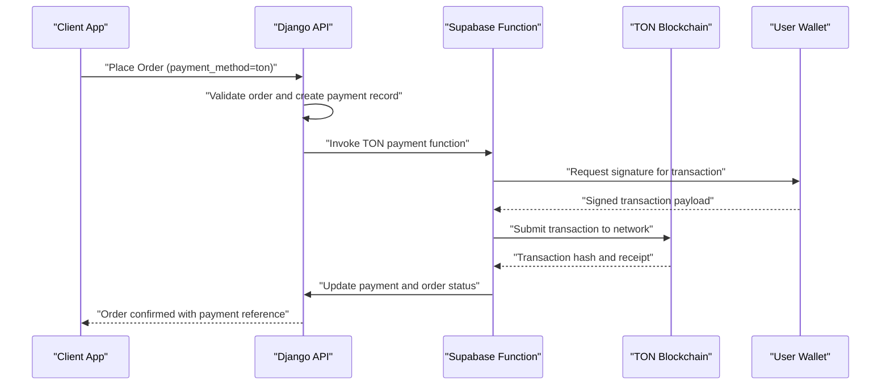
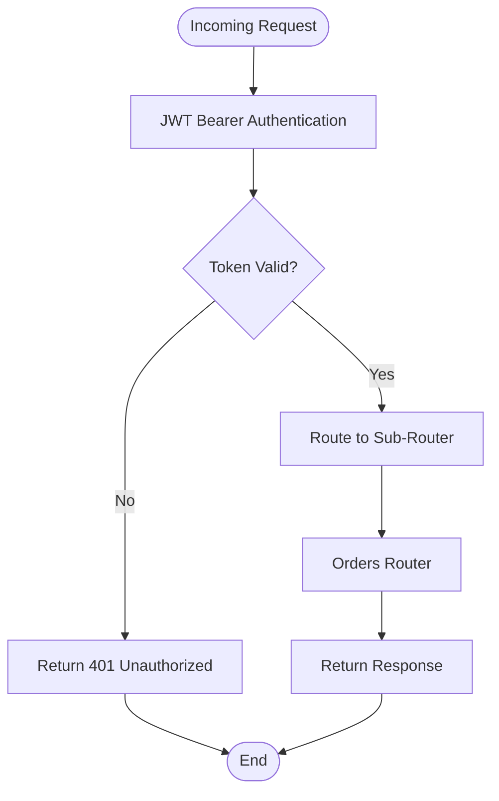
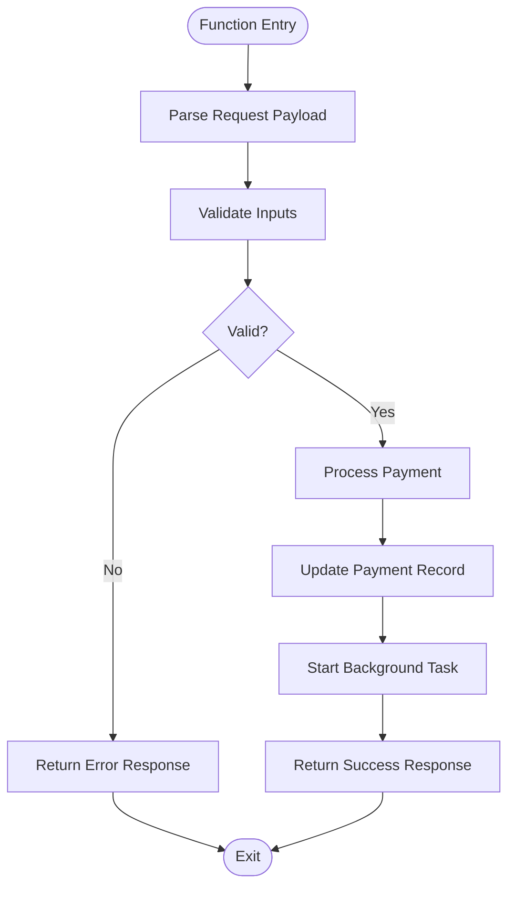
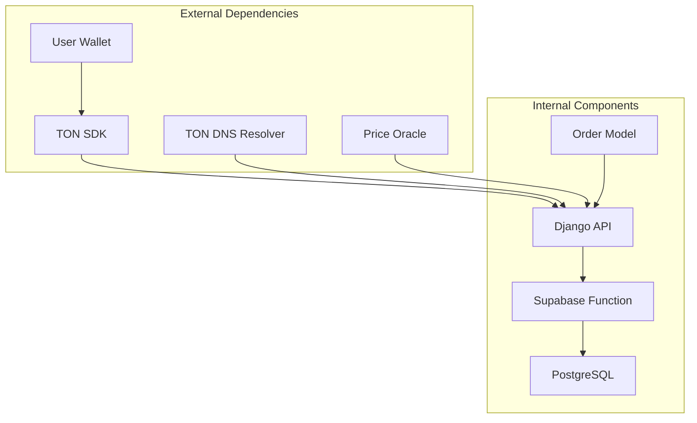

# TON Cryptocurrency Integration

<cite>
**Referenced Files in This Document**
- [models.py](file://backend/apps/orders/models.py)
- [0001_initial.py](file://backend/apps/orders/migrations/0001_initial.py)
- [router.py](file://backend/api/v1/router.py)
- [urls.py](file://backend/api/v1/urls.py)
- [process-cash-payment/index.ts](file://supabase/functions/process-cash-payment/index.ts)
- [process-momo-payment/index.ts](file://supabase/functions/process-momo-payment/index.ts)
- [config.toml](file://supabase/config.toml)
</cite>

## Table of Contents
1. [Introduction](#introduction)
2. [Project Structure](#project-structure)
3. [Core Components](#core-components)
4. [Architecture Overview](#architecture-overview)
5. [Detailed Component Analysis](#detailed-component-analysis)
6. [Dependency Analysis](#dependency-analysis)
7. [Performance Considerations](#performance-considerations)
8. [Troubleshooting Guide](#troubleshooting-guide)
9. [Conclusion](#conclusion)

## Introduction
This document provides comprehensive documentation for the TON (The Open Network) cryptocurrency payment provider integration within the Empindu artisan marketplace. It explains the current state of TON support, outlines the planned integration architecture for wallet connectivity, smart contract interactions, and crypto payment processing, and details operational workflows for transaction handling, verification, DNS resolution, address validation, and monitoring. It also covers routing, exchange rate handling, volatility management, security considerations, private key management, wallet backup procedures, regulatory compliance, tax reporting, and crypto-specific error handling patterns.

## Project Structure
The TON integration spans three primary areas:
- Backend Django models defining order lifecycle and payment method selection
- Supabase Edge Functions implementing payment processing flows
- API routing enabling secure access to payment endpoints



**Diagram sources**
- [models.py:27-32](file://backend/apps/orders/models.py#L27-L32)
- [0001_initial.py](file://backend/apps/orders/migrations/0001_initial.py#L33)
- [router.py:22-28](file://backend/api/v1/router.py#L22-L28)
- [urls.py:7-9](file://backend/api/v1/urls.py#L7-L9)
- [process-cash-payment/index.ts:1-113](file://supabase/functions/process-cash-payment/index.ts#L1-L113)
- [process-momo-payment/index.ts:71-150](file://supabase/functions/process-momo-payment/index.ts#L71-L150)
- [config.toml:1-16](file://supabase/config.toml#L1-L16)

**Section sources**
- [models.py:1-122](file://backend/apps/orders/models.py#L1-L122)
- [0001_initial.py:1-54](file://backend/apps/orders/migrations/0001_initial.py#L1-L54)
- [router.py:1-40](file://backend/api/v1/router.py#L1-L40)
- [urls.py:1-10](file://backend/api/v1/urls.py#L1-L10)
- [process-cash-payment/index.ts:1-113](file://supabase/functions/process-cash-payment/index.ts#L1-L113)
- [process-momo-payment/index.ts:71-150](file://supabase/functions/process-momo-payment/index.ts#L71-L150)
- [config.toml:1-16](file://supabase/config.toml#L1-L16)

## Core Components
- Order model with payment method choices including TON Crypto
- Migration ensuring TON is selectable during checkout
- API router with JWT authentication for secure endpoints
- Supabase functions for payment orchestration (cash, mobile money, and placeholder for TON)

Key implementation highlights:
- Payment method field supports "ton" alongside other providers
- Order lifecycle tracks payment status and transitions
- API enforces JWT authentication for protected routes
- Supabase functions demonstrate structured error handling and CORS support

**Section sources**
- [models.py:27-32](file://backend/apps/orders/models.py#L27-L32)
- [0001_initial.py](file://backend/apps/orders/migrations/0001_initial.py#L33)
- [router.py:10-18](file://backend/api/v1/router.py#L10-L18)
- [process-cash-payment/index.ts:19-113](file://supabase/functions/process-cash-payment/index.ts#L19-L113)

## Architecture Overview
The TON integration follows a hybrid architecture:
- Frontend initiates checkout with TON selected as payment method
- Backend validates order and creates a payment record
- Supabase Edge Function orchestrates TON transaction processing
- Transaction monitoring updates order and payment statuses
- Wallet connectivity and smart contract interactions are implemented via external SDKs and APIs



**Diagram sources**
- [models.py:84-86](file://backend/apps/orders/models.py#L84-L86)
- [router.py:22-28](file://backend/api/v1/router.py#L22-L28)
- [process-cash-payment/index.ts:19-113](file://supabase/functions/process-cash-payment/index.ts#L19-L113)

## Detailed Component Analysis

### Order Model and Payment Method Choices
The Order model defines payment method choices, including TON Crypto. This enables the frontend to present TON as a selectable option and ensures backend consistency.

```mermaid
classDiagram
class Order {
+string status
+string payment_method
+string payment_reference
+decimal price_ugx
+decimal price_usd
+datetime created_at
+datetime paid_at
+calculate_totals()
}
class PaymentMethods {
<<enumeration>>
"stripe"
"momo"
"airtel"
"ton"
}
Order --> PaymentMethods : "uses"
```

**Diagram sources**
- [models.py:16-32](file://backend/apps/orders/models.py#L16-L32)
- [models.py:111-122](file://backend/apps/orders/models.py#L111-L122)

**Section sources**
- [models.py:16-32](file://backend/apps/orders/models.py#L16-L32)
- [models.py:111-122](file://backend/apps/orders/models.py#L111-L122)

### API Routing and Authentication
The API router enforces JWT authentication for protected endpoints, ensuring secure access to order and payment operations. The router aggregates sub-routers for artisans, products, orders, and gifting.



**Diagram sources**
- [router.py:10-18](file://backend/api/v1/router.py#L10-L18)
- [router.py:22-28](file://backend/api/v1/router.py#L22-L28)

**Section sources**
- [router.py:10-18](file://backend/api/v1/router.py#L10-L18)
- [router.py:22-28](file://backend/api/v1/router.py#L22-L28)
- [urls.py:7-9](file://backend/api/v1/urls.py#L7-L9)

### Supabase Functions: Payment Orchestration Patterns
Supabase functions demonstrate robust patterns for payment processing, including CORS handling, structured error responses, and background tasks for asynchronous updates. These patterns serve as templates for implementing TON payment functions.



**Diagram sources**
- [process-cash-payment/index.ts:19-113](file://supabase/functions/process-cash-payment/index.ts#L19-L113)
- [process-momo-payment/index.ts:107-130](file://supabase/functions/process-momo-payment/index.ts#L107-L130)

**Section sources**
- [process-cash-payment/index.ts:19-113](file://supabase/functions/process-cash-payment/index.ts#L19-L113)
- [process-momo-payment/index.ts:71-150](file://supabase/functions/process-momo-payment/index.ts#L71-L150)

### TON Integration Implementation Plan
The following implementation plan outlines how TON will be integrated into the existing architecture:

- Wallet Connectivity
  - Use TON Connect SDK for wallet discovery and connection
  - Implement wallet session management and reconnection logic
  - Store wallet address in user profile for future transactions

- Smart Contract Interactions
  - Deploy marketplace smart contract for escrow and payment execution
  - Implement contract methods for deposit, release, and refund
  - Use TON SDK to sign and submit transactions

- Transaction Handling
  - Generate unique payment references per order
  - Monitor blockchain for transaction confirmations
  - Update payment and order statuses upon confirmation

- DNS Resolution and Address Validation
  - Integrate TON DNS resolver for human-readable addresses
  - Validate wallet addresses using TON checksum validation
  - Support both raw hex addresses and .ton domains

- Exchange Rate Handling and Volatility Management
  - Fetch real-time TON/USD rates from reliable oracle
  - Implement dynamic pricing with tolerance thresholds
  - Apply mid-market rates with appropriate slippage allowance

- Security Considerations
  - Private key management using hardware security modules (HSM)
  - Multi-signature wallets for merchant funds
  - Encrypted storage of sensitive data
  - Regular security audits and penetration testing

- Regulatory Compliance and Tax Reporting
  - Implement KYC/AML checks for high-value transactions
  - Maintain audit trails for tax reporting
  - Comply with local regulations for crypto transactions

- Error Handling Patterns
  - Implement retry logic for network failures
  - Handle insufficient funds and gas errors gracefully
  - Log all transaction attempts for debugging

**Section sources**
- [models.py:84-86](file://backend/apps/orders/models.py#L84-L86)
- [process-cash-payment/index.ts:19-113](file://supabase/functions/process-cash-payment/index.ts#L19-L113)
- [process-momo-payment/index.ts:107-130](file://supabase/functions/process-momo-payment/index.ts#L107-L130)

## Dependency Analysis
The TON integration depends on several external systems and internal components working together.



**Diagram sources**
- [models.py:1-122](file://backend/apps/orders/models.py#L1-L122)
- [router.py:22-28](file://backend/api/v1/router.py#L22-L28)
- [process-cash-payment/index.ts:25-28](file://supabase/functions/process-cash-payment/index.ts#L25-L28)

**Section sources**
- [models.py:1-122](file://backend/apps/orders/models.py#L1-L122)
- [router.py:22-28](file://backend/api/v1/router.py#L22-L28)
- [process-cash-payment/index.ts:25-28](file://supabase/functions/process-cash-payment/index.ts#L25-L28)

## Performance Considerations
- Optimize blockchain transaction fees by batching small orders
- Implement caching for frequently accessed wallet addresses
- Use asynchronous processing for long-running blockchain operations
- Monitor network congestion and adjust gas prices dynamically
- Cache exchange rates with appropriate TTL to reduce API calls

## Troubleshooting Guide
Common issues and resolutions for TON integration:

- Wallet Connection Failures
  - Verify TON Connect compatibility
  - Check wallet app availability and permissions
  - Implement fallback connection methods

- Transaction Reverts
  - Validate sufficient balance and gas fees
  - Check contract state and approval requirements
  - Handle revert reasons and communicate to users

- DNS Resolution Errors
  - Implement fallback to manual address entry
  - Validate domain ownership and records
  - Cache resolved addresses with expiration

- Price Volatility Impact
  - Set acceptable tolerance thresholds
  - Implement dynamic pricing adjustments
  - Provide user confirmation for significant changes

**Section sources**
- [process-cash-payment/index.ts:105-112](file://supabase/functions/process-cash-payment/index.ts#L105-L112)
- [process-momo-payment/index.ts:142-149](file://supabase/functions/process-momo-payment/index.ts#L142-L149)

## Conclusion
The TON cryptocurrency integration builds upon an existing, well-structured foundation with clear separation of concerns between frontend, backend, and serverless functions. The current implementation demonstrates robust patterns for payment processing, authentication, and error handling that can be extended to support TON payments. By following the implementation plan outlined above—covering wallet connectivity, smart contract interactions, transaction monitoring, DNS resolution, exchange rate management, and comprehensive security and compliance measures—the system can provide a secure, efficient, and user-friendly TON payment experience while maintaining high standards for reliability and regulatory adherence.