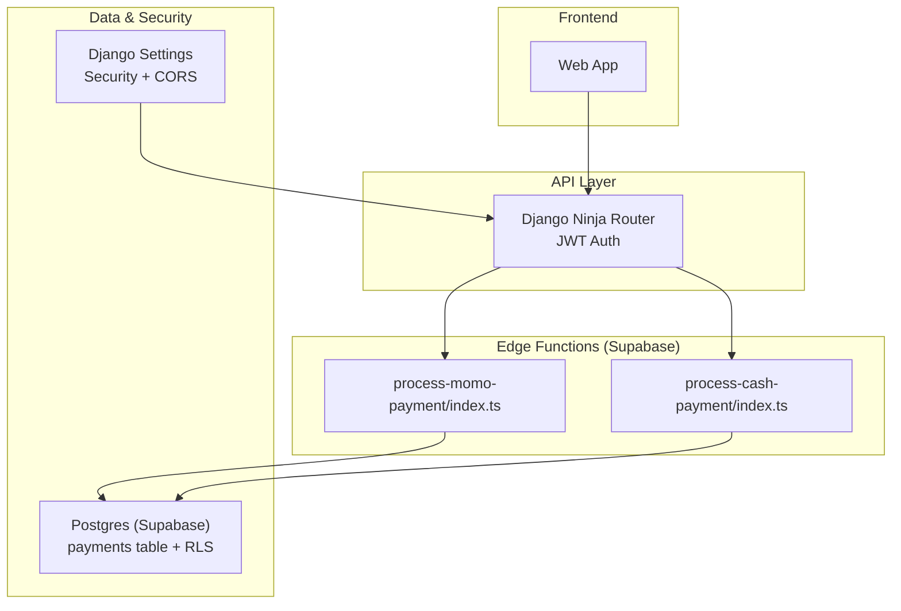
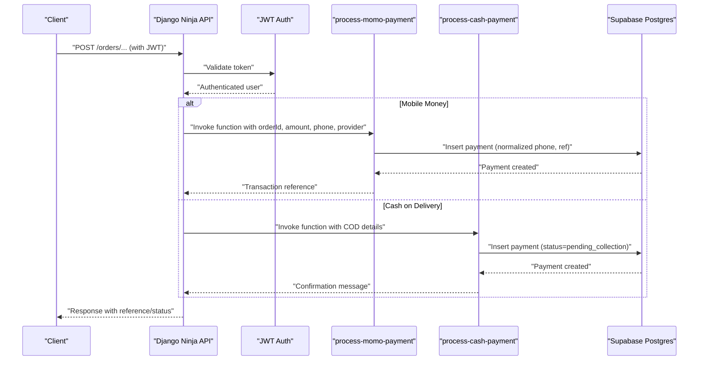
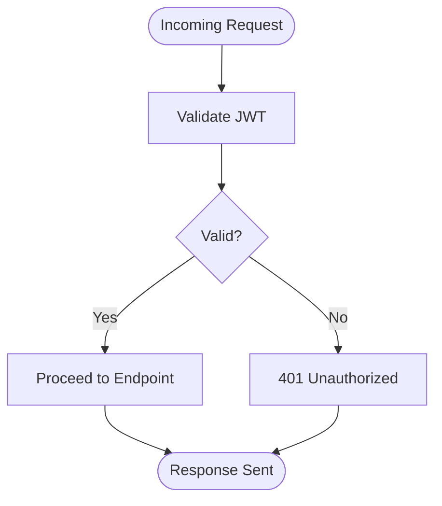
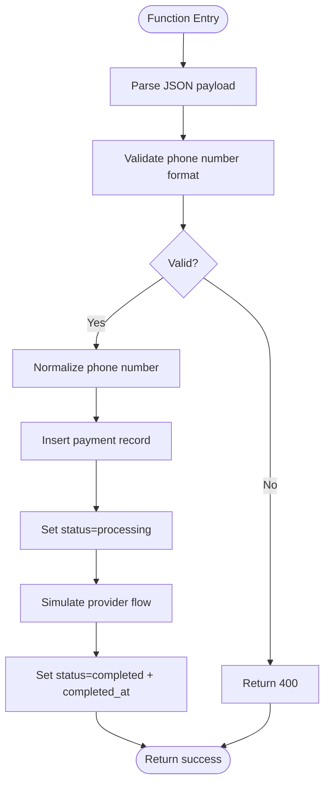
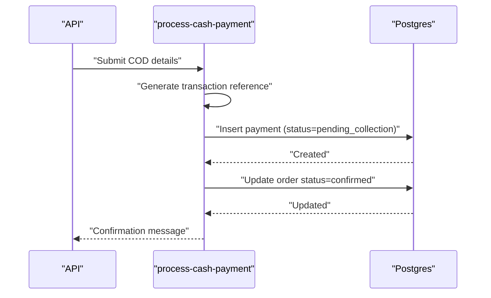
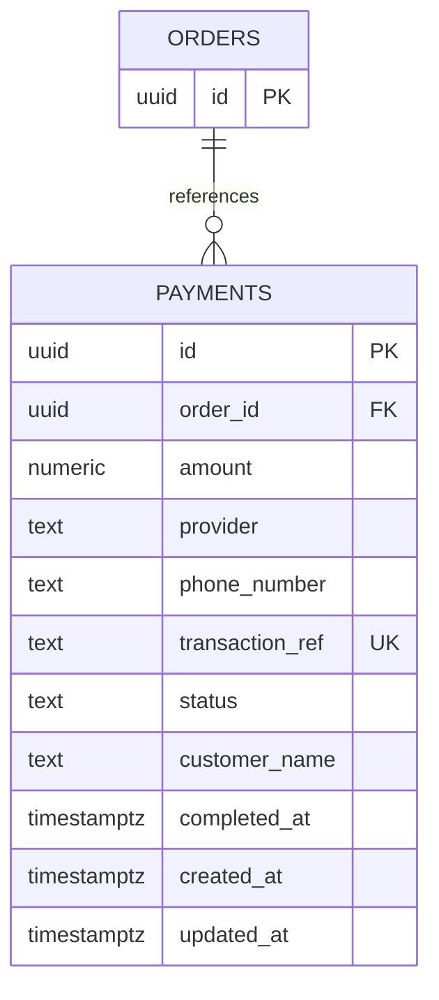
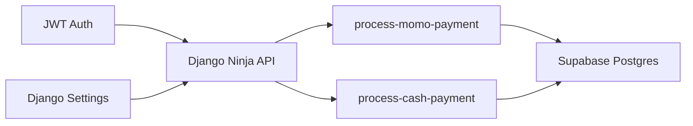

# Payment Security & Compliance

<cite>
**Referenced Files in This Document**
- [base.py](file://backend/config/settings/base.py)
- [production.py](file://backend/config/settings/production.py)
- [router.py](file://backend/api/v1/router.py)
- [process-momo-payment/index.ts](file://supabase/functions/process-momo-payment/index.ts)
- [process-cash-payment/index.ts](file://supabase/functions/process-cash-payment/index.ts)
- [20260110084208_19f31e38-2062-4a6a-a516-e5b9de4e3510.sql](file://supabase/migrations/20260110084208_19f31e38-2062-4a6a-a516-e5b9de4e3510.sql)
- [config.toml](file://supabase/config.toml)
- [PROGRESS_REPORT.md](file://PROGRESS_REPORT.md)
</cite>

## Table of Contents
1. [Introduction](#introduction)
2. [Project Structure](#project-structure)
3. [Core Components](#core-components)
4. [Architecture Overview](#architecture-overview)
5. [Detailed Component Analysis](#detailed-component-analysis)
6. [Dependency Analysis](#dependency-analysis)
7. [Performance Considerations](#performance-considerations)
8. [Troubleshooting Guide](#troubleshooting-guide)
9. [Conclusion](#conclusion)
10. [Appendices](#appendices)

## Introduction
This document details the current payment security posture and compliance considerations for the Empindu platform. It focuses on PCI DSS readiness, encryption of payment data, tokenization strategies, fraud prevention, risk assessment, suspicious transaction detection, SSL/TLS enforcement, secure API endpoints, authenticated payment requests, regional compliance for mobile money and cash-on-delivery, audit logging, data retention, and incident response. Where implementation is pending, this document outlines recommended approaches aligned with industry standards.

## Project Structure
The payment stack spans Supabase Edge Functions for payment orchestration, Supabase Postgres for persistence with Row Level Security (RLS), Django Ninja API for authenticated endpoints, and Django settings enforcing production-grade security.

**Diagram sources**
- [router.py:10-28](file://backend/api/v1/router.py#L10-L28)
- [process-momo-payment/index.ts:1-151](file://supabase/functions/process-momo-payment/index.ts#L1-L151)
- [process-cash-payment/index.ts:1-114](file://supabase/functions/process-cash-payment/index.ts#L1-L114)
- [20260110084208_19f31e38-2062-4a6a-a516-e5b9de4e3510.sql:1-45](file://supabase/migrations/20260110084208_19f31e38-2062-4a6a-a516-e5b9de4e3510.sql#L1-L45)
- [base.py:66-78](file://backend/config/settings/base.py#L66-L78)

**Section sources**
- [router.py:1-40](file://backend/api/v1/router.py#L1-L40)
- [base.py:1-288](file://backend/config/settings/base.py#L1-L288)

## Core Components
- Authentication and Authorization
  - JWT bearer authentication is configured for API endpoints via a custom HttpBearer class and SimpleJWT.
  - Production settings enforce HTTPS redirects and HSTS.
- Edge Function Payment Orchestration
  - Mobile Money (MTN/Airtel) and Cash on Delivery (COD) flows are implemented as Supabase Edge Functions.
  - Functions validate phone numbers, normalize formats, create payment records, and update statuses asynchronously.
- Data Persistence and Access Control
  - The payments table is defined with numeric amounts, provider identifiers, phone numbers, transaction references, and timestamps.
  - Row Level Security policies restrict access to buyers and admins.

**Section sources**
- [router.py:10-28](file://backend/api/v1/router.py#L10-L28)
- [production.py:15-22](file://backend/config/settings/production.py#L15-L22)
- [process-momo-payment/index.ts:33-48](file://supabase/functions/process-momo-payment/index.ts#L33-L48)
- [process-cash-payment/index.ts:41-57](file://supabase/functions/process-cash-payment/index.ts#L41-L57)
- [20260110084208_19f31e38-2062-4a6a-a516-e5b9de4e3510.sql:1-45](file://supabase/migrations/20260110084208_19f31e38-2062-4a6a-a516-e5b9de4e3510.sql#L1-L45)

## Architecture Overview
The payment flow integrates frontend requests through authenticated API endpoints into Supabase Edge Functions, which persist payment records and orchestrate provider-specific actions. Production-grade security enforces TLS and cookie policies.

**Diagram sources**
- [router.py:36-38](file://backend/api/v1/router.py#L36-L38)
- [process-momo-payment/index.ts:23-71](file://supabase/functions/process-momo-payment/index.ts#L23-L71)
- [process-cash-payment/index.ts:25-62](file://supabase/functions/process-cash-payment/index.ts#L25-L62)
- [20260110084208_19f31e38-2062-4a6a-a516-e5b9de4e3510.sql:1-14](file://supabase/migrations/20260110084208_19f31e38-2062-4a6a-a516-e5b9de4e3510.sql#L1-L14)

## Detailed Component Analysis

### Authentication and API Security
- JWT bearer authentication is applied to API routes, ensuring only authenticated clients can submit payment requests.
- Production settings enable secure cookies, SSL redirect, and HSTS to protect transport-layer confidentiality and integrity.

**Diagram sources**
- [router.py:10-18](file://backend/api/v1/router.py#L10-L18)
- [production.py:15-22](file://backend/config/settings/production.py#L15-L22)

**Section sources**
- [router.py:10-28](file://backend/api/v1/router.py#L10-L28)
- [production.py:15-22](file://backend/config/settings/production.py#L15-L22)

### Mobile Money Payment Orchestration
- Phone number validation enforces a Ugandan mobile number pattern and normalizes to international format (+256).
- A unique transaction reference is generated and stored with the payment record.
- Status transitions occur from pending to processing and eventually to completed, with asynchronous updates.
- The function simulates provider flows and logs provider-specific steps.

**Diagram sources**
- [process-momo-payment/index.ts:23-107](file://supabase/functions/process-momo-payment/index.ts#L23-L107)

**Section sources**
- [process-momo-payment/index.ts:33-48](file://supabase/functions/process-momo-payment/index.ts#L33-L48)
- [process-momo-payment/index.ts:50-66](file://supabase/functions/process-momo-payment/index.ts#L50-L66)
- [process-momo-payment/index.ts:99-103](file://supabase/functions/process-momo-payment/index.ts#L99-L103)
- [process-momo-payment/index.ts:107-129](file://supabase/functions/process-momo-payment/index.ts#L107-L129)

### Cash on Delivery Payment Orchestration
- Generates a unique transaction reference for COD orders.
- Inserts a payment record with status set to pending collection.
- Immediately confirms the order and returns a localized message indicating cash collection on delivery or pickup.

**Diagram sources**
- [process-cash-payment/index.ts:41-62](file://supabase/functions/process-cash-payment/index.ts#L41-L62)
- [process-cash-payment/index.ts:64-68](file://supabase/functions/process-cash-payment/index.ts#L64-L68)

**Section sources**
- [process-cash-payment/index.ts:41-57](file://supabase/functions/process-cash-payment/index.ts#L41-L57)
- [process-cash-payment/index.ts:64-68](file://supabase/functions/process-cash-payment/index.ts#L64-L68)

### Data Storage and Access Control
- The payments table captures order linkage, amount, provider, phone number, transaction reference, status, timestamps, and customer name.
- Row Level Security policies ensure buyers can only view their own payments and admins can view/update all payments.

**Diagram sources**
- [20260110084208_19f31e38-2062-4a6a-a516-e5b9de4e3510.sql:1-14](file://supabase/migrations/20260110084208_19f31e38-2062-4a6a-a516-e5b9de4e3510.sql#L1-L14)

**Section sources**
- [20260110084208_19f31e38-2062-4a6a-a516-e5b9de4e3510.sql:1-45](file://supabase/migrations/20260110084208_19f31e38-2062-4a6a-a516-e5b9de4e3510.sql#L1-L45)

### Edge Function Security and CORS
- Supabase Edge Functions currently disable JWT verification for payment functions, which reduces trust boundaries and increases risk.
- CORS headers are set broadly; production deployments should restrict origins.

**Section sources**
- [config.toml:3-16](file://supabase/config.toml#L3-L16)
- [process-momo-payment/index.ts:4-7](file://supabase/functions/process-momo-payment/index.ts#L4-L7)
- [process-cash-payment/index.ts:4-7](file://supabase/functions/process-cash-payment/index.ts#L4-L7)

## Dependency Analysis
- API depends on JWT authentication middleware to gate endpoints.
- Edge Functions depend on Supabase client libraries and environment variables for database connectivity.
- Payments table depends on orders table and enforces referential integrity with cascade delete.
- Production settings depend on environment variables for secrets and domain configuration.

**Diagram sources**
- [router.py:10-28](file://backend/api/v1/router.py#L10-L28)
- [process-momo-payment/index.ts:23-28](file://supabase/functions/process-momo-payment/index.ts#L23-L28)
- [process-cash-payment/index.ts:25-28](file://supabase/functions/process-cash-payment/index.ts#L25-L28)
- [20260110084208_19f31e38-2062-4a6a-a516-e5b9de4e3510.sql:4-5](file://supabase/migrations/20260110084208_19f31e38-2062-4a6a-a516-e5b9de4e3510.sql#L4-L5)

**Section sources**
- [router.py:10-28](file://backend/api/v1/router.py#L10-L28)
- [process-momo-payment/index.ts:23-28](file://supabase/functions/process-momo-payment/index.ts#L23-L28)
- [process-cash-payment/index.ts:25-28](file://supabase/functions/process-cash-payment/index.ts#L25-L28)
- [20260110084208_19f31e38-2062-4a6a-a516-e5b9de4e3510.sql:4-5](file://supabase/migrations/20260110084208_19f31e38-2062-4a6a-a516-e5b9de4e3510.sql#L4-L5)

## Performance Considerations
- Asynchronous status updates in Edge Functions prevent blocking responses and improve throughput.
- Database triggers maintain updated_at timestamps efficiently.
- Production-grade caching and CDN are configured via WhiteNoise and Cloudinary storage; ensure static assets remain off the payment-sensitive paths.

[No sources needed since this section provides general guidance]

## Troubleshooting Guide
- Authentication failures: Verify JWT token validity and ensure the JWTBearer class is properly configured.
- Payment initiation errors: Check Edge Function logs for JSON parsing failures, database insert errors, or phone number validation mismatches.
- CORS issues: Confirm allowed origins and header configurations in Edge Functions and Django settings.
- Production errors: Enable Sentry for error tracking and monitoring.

**Section sources**
- [router.py:10-18](file://backend/api/v1/router.py#L10-L18)
- [process-momo-payment/index.ts:142-149](file://supabase/functions/process-momo-payment/index.ts#L142-L149)
- [process-cash-payment/index.ts:105-112](file://supabase/functions/process-cash-payment/index.ts#L105-L112)
- [PROGRESS_REPORT.md:345-354](file://PROGRESS_REPORT.md#L345-L354)

## Conclusion
The platform implements foundational payment flows for mobile money and cash on delivery, with database-backed persistence and basic transport security in production. To achieve robust PCI DSS alignment, tokenization of primary account numbers, strong provider integration with webhooks, and comprehensive audit logging are required. Additional controls—such as JWT verification for Edge Functions, stricter CORS, rate limiting, and fraud detection—are essential for mature security and compliance.

[No sources needed since this section summarizes without analyzing specific files]

## Appendices

### PCI DSS Readiness Checklist (Recommended)
- Tokenization: Replace primary account numbers with tokens; store only tokens in database.
- Encryption: Encrypt at-rest and in-transit; use approved cryptographic algorithms.
- Least Privilege: Enforce RLS and role-based access; limit provider credentials exposure.
- Logging: Record all payment events with immutable audit trails.
- Validation: Regular penetration testing and vulnerability assessments.

[No sources needed since this section provides general guidance]

### Regulatory Compliance Notes
- Mobile Money (Uganda): Ensure provider APIs are integrated with webhooks and KYC-aligned validation.
- Cryptocurrency: Not present in current codebase; any future adoption must comply with local licensing and reporting obligations.
- Cross-border: Implement origin/destination checks, sanctions screening, and reporting as required by jurisdiction.

[No sources needed since this section provides general guidance]