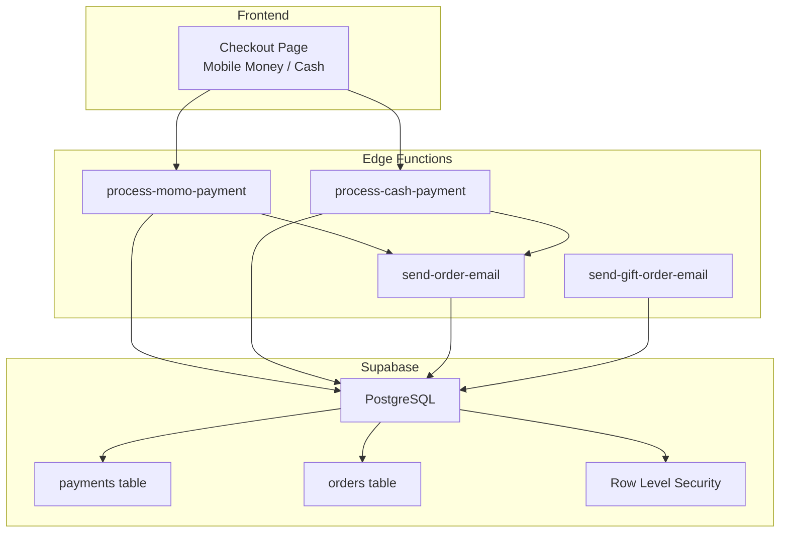
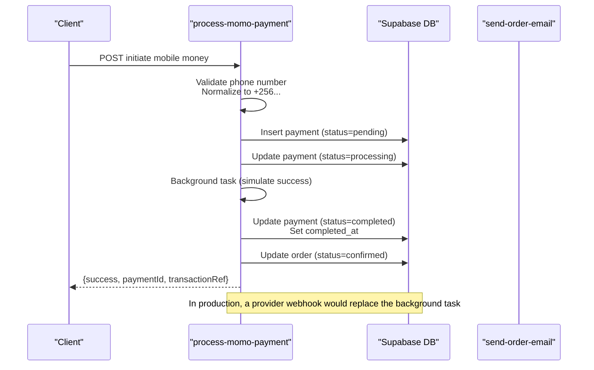
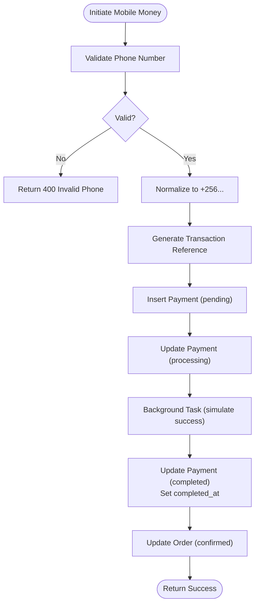
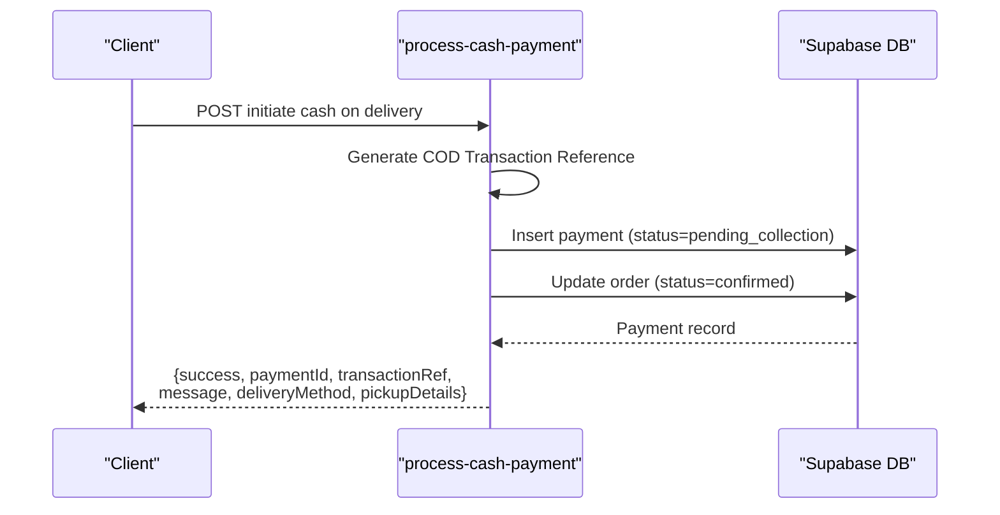
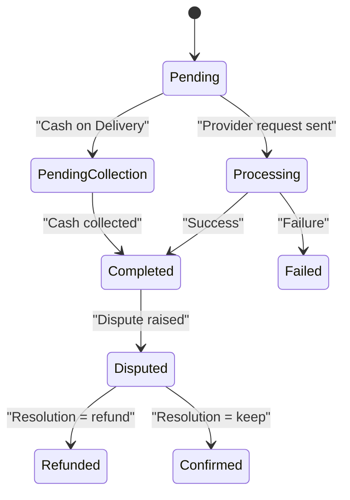
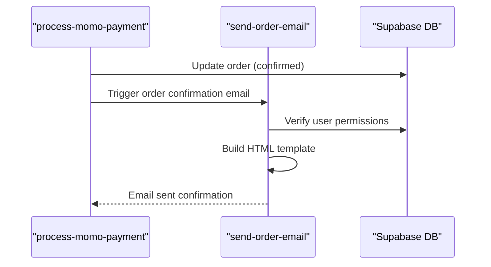
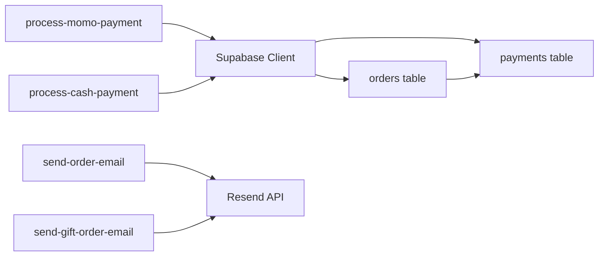

# Payment Workflows

<cite>
**Referenced Files in This Document**
- [process-momo-payment/index.ts](file://supabase/functions/process-momo-payment/index.ts)
- [process-cash-payment/index.ts](file://supabase/functions/process-cash-payment/index.ts)
- [send-order-email/index.ts](file://supabase/functions/send-order-email/index.ts)
- [send-gift-order-email/index.ts](file://supabase/functions/send-gift-order-email/index.ts)
- [payments table migration](file://supabase/migrations/20260110084208_19f31e38-2062-4a6a-a516-e5b9de4e3510.sql)
- [orders model](file://backend/apps/orders/models.py)
- [router](file://backend/api/v1/router.py)
- [urls](file://backend/api/v1/urls.py)
</cite>

## Table of Contents
1. [Introduction](#introduction)
2. [Project Structure](#project-structure)
3. [Core Components](#core-components)
4. [Architecture Overview](#architecture-overview)
5. [Detailed Component Analysis](#detailed-component-analysis)
6. [Dependency Analysis](#dependency-analysis)
7. [Performance Considerations](#performance-considerations)
8. [Troubleshooting Guide](#troubleshooting-guide)
9. [Conclusion](#conclusion)
10. [Appendices](#appendices)

## Introduction
This document describes the payment processing workflows and state management for the platform. It covers the end-to-end lifecycle from initiation to completion for mobile money and cash-on-delivery (COD) payments, including pending, authorized, captured, and failed states. It also documents transaction reference generation, payment validation logic, order status synchronization, email confirmation sequences, retry mechanisms, timeout handling, cancellation procedures, analytics tracking, fraud detection integration, suspicious activity monitoring, reconciliation processes, settlement timing, and dispute resolution workflows.

## Project Structure
The payment system is composed of:
- Supabase Edge Functions that handle payment initiation and callbacks
- Supabase database tables for payments and orders
- Backend API router and URLs for future integration points
- Email notification functions for order and gift order updates

**Diagram sources**
- [process-momo-payment/index.ts:1-151](file://supabase/functions/process-momo-payment/index.ts#L1-L151)
- [process-cash-payment/index.ts:1-114](file://supabase/functions/process-cash-payment/index.ts#L1-L114)
- [send-order-email/index.ts:1-284](file://supabase/functions/send-order-email/index.ts#L1-L284)
- [send-gift-order-email/index.ts:1-217](file://supabase/functions/send-gift-order-email/index.ts#L1-L217)
- [payments table migration:1-45](file://supabase/migrations/20260110084208_19f31e38-2062-4a6a-a516-e5b9de4e3510.sql#L1-L45)
- [orders model:1-51](file://backend/apps/orders/models.py#L1-L51)

**Section sources**
- [router:1-40](file://backend/api/v1/router.py#L1-L40)
- [urls:1-10](file://backend/api/v1/urls.py#L1-L10)

## Core Components
- Mobile Money Payment Function: Validates phone number, normalizes to international format, generates a unique transaction reference, creates a payment record, transitions to processing, and simulates completion with a background task.
- Cash on Delivery Function: Creates a COD payment record with a unique transaction reference, immediately confirms the order, and optionally returns pickup location details.
- Payments Database Table: Stores payment metadata, provider, amount, transaction reference, status, timestamps, and foreign key to orders.
- Orders Model: Defines order lifecycle states and payment method choices.
- Email Functions: Send order confirmation and status update emails, and corporate gift order status emails with authentication and authorization checks.

**Section sources**
- [process-momo-payment/index.ts:33-71](file://supabase/functions/process-momo-payment/index.ts#L33-L71)
- [process-cash-payment/index.ts:41-72](file://supabase/functions/process-cash-payment/index.ts#L41-L72)
- [payments table migration:1-45](file://supabase/migrations/20260110084208_19f31e38-2062-4a6a-a516-e5b9de4e3510.sql#L1-L45)
- [orders model:16-51](file://backend/apps/orders/models.py#L16-L51)
- [send-order-email/index.ts:165-281](file://supabase/functions/send-order-email/index.ts#L165-L281)
- [send-gift-order-email/index.ts:109-214](file://supabase/functions/send-gift-order-email/index.ts#L109-L214)

## Architecture Overview
The payment architecture integrates frontend checkout actions with Supabase Edge Functions that write to the payments and orders tables. Email notifications are triggered via dedicated functions. The system uses row-level security to protect sensitive data.

**Diagram sources**
- [process-momo-payment/index.ts:33-130](file://supabase/functions/process-momo-payment/index.ts#L33-L130)
- [payments table migration:8-14](file://supabase/migrations/20260110084208_19f31e38-2062-4a6a-a516-e5b9de4e3510.sql#L8-L14)

## Detailed Component Analysis

### Mobile Money Payment Workflow
- Validation: Phone number is validated against a regex for Uganda and normalized to international format.
- Transaction Reference: Generated with a unique prefix and random suffix.
- Payment Record: Created with initial status pending.
- Provider Interaction: Placeholder for MTN MoMo or Airtel Money API integration; currently simulated.
- State Transitions: pending → processing → completed; order updated to confirmed.
- Asynchronous Completion: Background task simulates provider confirmation after a delay.

**Diagram sources**
- [process-momo-payment/index.ts:33-130](file://supabase/functions/process-momo-payment/index.ts#L33-L130)
- [payments table migration:8-14](file://supabase/migrations/20260110084208_19f31e38-2062-4a6a-a516-e5b9de4e3510.sql#L8-L14)

**Section sources**
- [process-momo-payment/index.ts:33-130](file://supabase/functions/process-momo-payment/index.ts#L33-L130)

### Cash on Delivery Workflow
- Transaction Reference: Generated with a COD-specific prefix.
- Payment Record: Created with status pending_collection.
- Immediate Order Confirmation: Order status set to confirmed upon payment creation.
- Pickup Details: Optional pickup location details returned when applicable.

**Diagram sources**
- [process-cash-payment/index.ts:41-90](file://supabase/functions/process-cash-payment/index.ts#L41-L90)
- [payments table migration:8-14](file://supabase/migrations/20260110084208_19f31e38-2062-4a6a-a516-e5b9de4e3510.sql#L8-L14)

**Section sources**
- [process-cash-payment/index.ts:41-90](file://supabase/functions/process-cash-payment/index.ts#L41-L90)

### Payment State Management
- Payment States: pending, processing, completed, failed, pending_collection.
- Order States: pending_payment, paid, confirmed, dispatched, in_transit, delivered, disputed, refunded.
- Synchronization: On mobile money success simulation, payment status is set to completed and order status to confirmed.

**Diagram sources**
- [payments table migration:9-9](file://supabase/migrations/20260110084208_19f31e38-2062-4a6a-a516-e5b9de4e3510.sql#L9-L9)
- [orders model:16-25](file://backend/apps/orders/models.py#L16-L25)

**Section sources**
- [payments table migration:9-9](file://supabase/migrations/20260110084208_19f31e38-2062-4a6a-a516-e5b9de4e3510.sql#L9-L9)
- [orders model:16-25](file://backend/apps/orders/models.py#L16-L25)

### Email Confirmation Sequences
- Order Emails: Confirmation, status update, and shipped notifications with dynamic HTML templates and Resend integration.
- Gift Order Emails: Corporate gift order status updates with contextual details and Resend integration.
- Authentication: Both functions require JWT-based authentication and enforce authorization checks.

**Diagram sources**
- [process-momo-payment/index.ts:119-125](file://supabase/functions/process-momo-payment/index.ts#L119-L125)
- [send-order-email/index.ts:165-281](file://supabase/functions/send-order-email/index.ts#L165-L281)

**Section sources**
- [send-order-email/index.ts:165-281](file://supabase/functions/send-order-email/index.ts#L165-L281)
- [send-gift-order-email/index.ts:109-214](file://supabase/functions/send-gift-order-email/index.ts#L109-L214)

### Transaction Reference Generation
- Mobile Money: Prefix CU- with timestamp and random uppercase substring.
- Cash on Delivery: Prefix COD- with timestamp and random uppercase substring.
- Uniqueness: Enforced by database constraint on transaction_ref.

**Section sources**
- [process-momo-payment/index.ts:50-51](file://supabase/functions/process-momo-payment/index.ts#L50-L51)
- [process-cash-payment/index.ts:41-42](file://supabase/functions/process-cash-payment/index.ts#L41-L42)
- [payments table migration:8-8](file://supabase/migrations/20260110084208_19f31e38-2062-4a6a-a516-e5b9de4e3510.sql#L8-L8)

### Payment Validation Logic
- Mobile Money: Phone number regex validates Ugandan mobile numbers; normalization ensures international format.
- Error Handling: Returns structured errors with appropriate HTTP status codes.

**Section sources**
- [process-momo-payment/index.ts:33-40](file://supabase/functions/process-momo-payment/index.ts#L33-L40)

### Order Status Synchronization
- Mobile Money: On simulated success, order status transitions to confirmed.
- Cash on Delivery: Immediately sets order status to confirmed upon payment creation.

**Section sources**
- [process-momo-payment/index.ts:119-123](file://supabase/functions/process-momo-payment/index.ts#L119-L123)
- [process-cash-payment/index.ts:64-68](file://supabase/functions/process-cash-payment/index.ts#L64-L68)

### Retry Mechanisms, Timeout Handling, and Cancellation
- Retries: Not implemented in current functions; provider webhooks should be integrated to handle retries.
- Timeouts: Background tasks simulate provider confirmation; production requires webhook-driven timeouts.
- Cancellations: Not implemented in current functions; cancellation logic should update payment status to failed/refunded and order status accordingly.

[No sources needed since this section provides general guidance]

### Fraud Detection Integration and Suspicious Activity Monitoring
- Current Implementation: No explicit fraud detection or monitoring logic in the referenced files.
- Recommendations: Integrate external fraud detection services and monitor anomalies such as rapid retries, invalid phone numbers, and unusual amounts.

[No sources needed since this section provides general guidance]

### Payment Analytics Tracking
- Current Implementation: No analytics tracking in the referenced files.
- Recommendations: Track payment events (initiated, processing, completed, failed), conversion funnels, provider usage, and geographic distribution.

[No sources needed since this section provides general guidance]

### Reconciliation, Settlement Timing, and Dispute Resolution
- Reconciliation: Not implemented in current functions; reconcile payments against provider statements and mark reconciled records.
- Settlement Timing: Not implemented; define settlement windows and batch processing.
- Disputes: Implemented in order states; payment state transitions to disputed and resolution outcomes update order/payment statuses.

**Section sources**
- [orders model:23-24](file://backend/apps/orders/models.py#L23-L24)
- [payments table migration:9-9](file://supabase/migrations/20260110084208_19f31e38-2062-4a6a-a516-e5b9de4e3510.sql#L9-L9)

## Dependency Analysis
- Edge Functions depend on Supabase client libraries and environment variables for credentials.
- Payments and orders tables are linked via foreign keys; RLS policies restrict access.
- Email functions depend on Resend API and JWT verification.

**Diagram sources**
- [process-momo-payment/index.ts:24-28](file://supabase/functions/process-momo-payment/index.ts#L24-L28)
- [process-cash-payment/index.ts:26-28](file://supabase/functions/process-cash-payment/index.ts#L26-L28)
- [send-order-email/index.ts:247-259](file://supabase/functions/send-order-email/index.ts#L247-L259)
- [send-gift-order-email/index.ts:181-193](file://supabase/functions/send-gift-order-email/index.ts#L181-L193)
- [payments table migration:4-4](file://supabase/migrations/20260110084208_19f31e38-2062-4a6a-a516-e5b9de4e3510.sql#L4-L4)

**Section sources**
- [payments table migration:1-45](file://supabase/migrations/20260110084208_19f31e38-2062-4a6a-a516-e5b9de4e3510.sql#L1-L45)
- [orders model:42-51](file://backend/apps/orders/models.py#L42-L51)

## Performance Considerations
- Asynchronous Processing: Background tasks avoid blocking HTTP responses.
- Database Constraints: Unique transaction references prevent duplicates.
- Row Level Security: Protects data access and reduces unauthorized queries.

[No sources needed since this section provides general guidance]

## Troubleshooting Guide
- Phone Number Validation Failures: Ensure numbers match the expected Ugandan format and include proper normalization.
- Payment Creation Errors: Check Supabase service role key and database connectivity.
- Email Delivery Failures: Verify Resend API key and network connectivity; check function logs for detailed errors.
- Authorization Errors: Confirm JWT presence and validity; ensure user roles align with permissions.

**Section sources**
- [process-momo-payment/index.ts:33-40](file://supabase/functions/process-momo-payment/index.ts#L33-L40)
- [send-order-email/index.ts:173-241](file://supabase/functions/send-order-email/index.ts#L173-L241)
- [send-gift-order-email/index.ts:114-147](file://supabase/functions/send-gift-order-email/index.ts#L114-L147)

## Conclusion
The payment system provides a foundation for mobile money and cash-on-delivery transactions with clear state transitions and email notifications. Future enhancements should focus on integrating provider webhooks for robust retry and timeout handling, implementing fraud detection and analytics, and adding reconciliation and dispute resolution workflows.

[No sources needed since this section summarizes without analyzing specific files]

## Appendices
- API Router and URLs: The backend API router and URLs are defined for future integration points.

**Section sources**
- [router:22-28](file://backend/api/v1/router.py#L22-L28)
- [urls:7-9](file://backend/api/v1/urls.py#L7-L9)