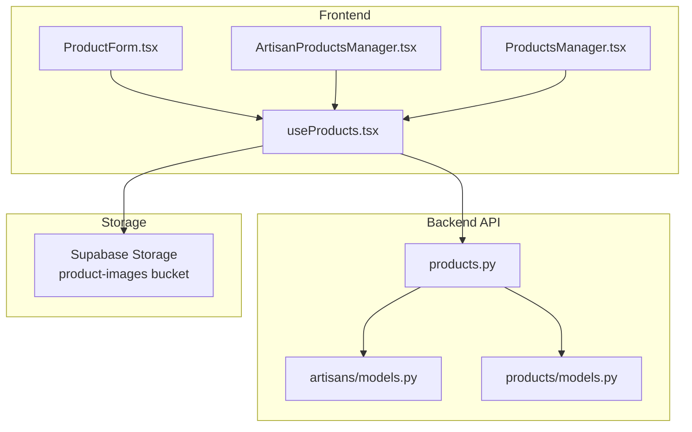
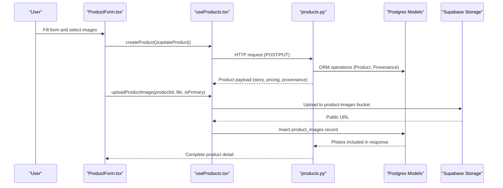
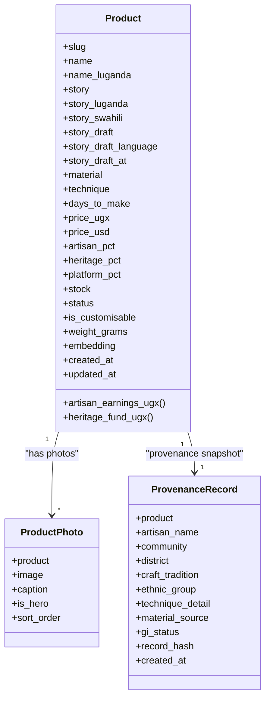
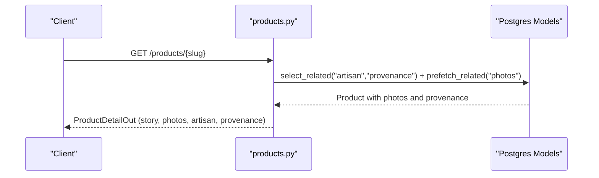
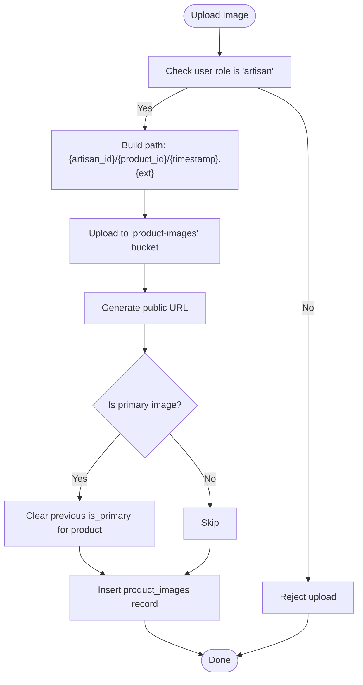
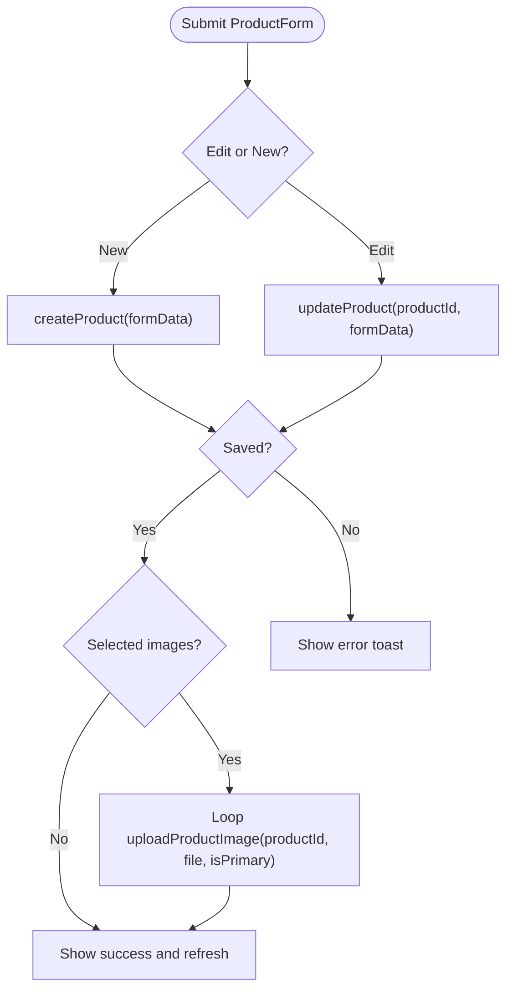
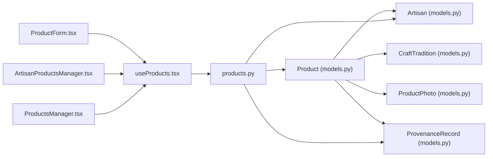

# Product Catalog Management

<cite>
**Referenced Files in This Document**
- [products.py](file://backend/api/v1/products.py)
- [models.py](file://backend/apps/products/models.py)
- [models.py](file://backend/apps/artisans/models.py)
- [useProducts.tsx](file://src/hooks/useProducts.tsx)
- [ProductForm.tsx](file://src/components/products/ProductForm.tsx)
- [ProductsManager.tsx](file://src/components/admin/ProductsManager.tsx)
- [ArtisanProductsManager.tsx](file://src/components/products/ArtisanProductsManager.tsx)
- [20260101210119_8814f12d-688f-4774-9ce8-6ce5f9fd0bba.sql](file://supabase/migrations/20260101210119_8814f12d-688f-4774-9ce8-6ce5f9fd0bba.sql)
- [20260301185835_24e7e596-6ffe-4991-964c-74e173d7213e.sql](file://supabase/migrations/20260301185835_24e7e596-6ffe-4991-964c-74e173d7213e.sql)
</cite>

## Table of Contents
1. [Introduction](#introduction)
2. [Project Structure](#project-structure)
3. [Core Components](#core-components)
4. [Architecture Overview](#architecture-overview)
5. [Detailed Component Analysis](#detailed-component-analysis)
6. [Dependency Analysis](#dependency-analysis)
7. [Performance Considerations](#performance-considerations)
8. [Troubleshooting Guide](#troubleshooting-guide)
9. [Conclusion](#conclusion)

## Introduction
This document describes the product catalog management system with a story-first architecture that emphasizes artisan narratives and cultural provenance. It covers the product model design, pricing and revenue split, inventory management, image/media handling, provenance records, and analytics hooks. It also documents the artisan product management interface, validation, multilingual content support, and search optimization features, along with moderation, quality control, and performance guidance for large catalogs.

## Project Structure
The product catalog spans frontend React components and backend Django APIs backed by Supabase:
- Frontend: product forms, managers, and hooks for CRUD, image uploads, and analytics
- Backend: Django Ninja API endpoints and Django ORM models for products, artisans, and provenance
- Storage: Supabase Storage bucket for product images with role-based policies
- Database: Supabase Postgres with vector embeddings for semantic search

**Diagram sources**
- [ProductForm.tsx:1-387](file://src/components/products/ProductForm.tsx#L1-L387)
- [ArtisanProductsManager.tsx:1-43](file://src/components/products/ArtisanProductsManager.tsx#L1-L43)
- [ProductsManager.tsx:1-234](file://src/components/admin/ProductsManager.tsx#L1-L234)
- [useProducts.tsx:1-369](file://src/hooks/useProducts.tsx#L1-L369)
- [products.py:1-191](file://backend/api/v1/products.py#L1-L191)
- [models.py:1-153](file://backend/apps/products/models.py#L1-L153)
- [models.py:1-170](file://backend/apps/artisans/models.py#L1-L170)
- [20260101210119_8814f12d-688f-4774-9ce8-6ce5f9fd0bba.sql:91-118](file://supabase/migrations/20260101210119_8814f12d-688f-4774-9ce8-6ce5f9fd0bba.sql#L91-L118)

**Section sources**
- [products.py:1-191](file://backend/api/v1/products.py#L1-L191)
- [models.py:1-153](file://backend/apps/products/models.py#L1-L153)
- [models.py:1-170](file://backend/apps/artisans/models.py#L1-L170)
- [useProducts.tsx:1-369](file://src/hooks/useProducts.tsx#L1-L369)
- [ProductForm.tsx:1-387](file://src/components/products/ProductForm.tsx#L1-L387)
- [ProductsManager.tsx:1-234](file://src/components/admin/ProductsManager.tsx#L1-L234)
- [ArtisanProductsManager.tsx:1-43](file://src/components/products/ArtisanProductsManager.tsx#L1-L43)
- [20260101210119_8814f12d-688f-4774-9ce8-6ce5f9fd0bba.sql:91-118](file://supabase/migrations/20260101210119_8814f12d-688f-4774-9ce8-6ce5f9fd0bba.sql#L91-L118)

## Core Components
- Product model with story-first fields, multilingual support, pricing and revenue split, inventory, embedding vector, and status lifecycle
- Provenance record capturing immutable cultural attribution at listing time
- Artisan model with craft traditions, certifications, and multilingual biographies
- Frontend product form with validation, image previews, and upload flow
- Admin and artisan product managers for listing, filtering, visibility toggling, and deletion
- Supabase-backed image storage with role-based policies and public URLs
- API endpoints for product listing and detail with story-first narrative and provenance

**Section sources**
- [models.py:10-100](file://backend/apps/products/models.py#L10-L100)
- [models.py:122-153](file://backend/apps/products/models.py#L122-L153)
- [models.py:62-170](file://backend/apps/artisans/models.py#L62-L170)
- [ProductForm.tsx:31-104](file://src/components/products/ProductForm.tsx#L31-L104)
- [ProductsManager.tsx:41-80](file://src/components/admin/ProductsManager.tsx#L41-L80)
- [ArtisanProductsManager.tsx:26-43](file://src/components/products/ArtisanProductsManager.tsx#L26-L43)
- [useProducts.tsx:264-310](file://src/hooks/useProducts.tsx#L264-L310)
- [products.py:41-71](file://backend/api/v1/products.py#L41-L71)

## Architecture Overview
The system follows a clear separation of concerns:
- Frontend manages product creation/editing, image uploads, and displays
- Backend exposes REST-like endpoints via Django Ninja and orchestrates data retrieval
- Supabase handles storage, row-level security, and public URLs
- Database models define the story-first product architecture and provenance anchors

**Diagram sources**
- [ProductForm.tsx:71-104](file://src/components/products/ProductForm.tsx#L71-L104)
- [useProducts.tsx:170-208](file://src/hooks/useProducts.tsx#L170-L208)
- [products.py:74-124](file://backend/api/v1/products.py#L74-L124)
- [models.py:10-100](file://backend/apps/products/models.py#L10-L100)
- [20260101210119_8814f12d-688f-4774-9ce8-6ce5f9fd0bba.sql:91-118](file://supabase/migrations/20260101210119_8814f12d-688f-4774-9ce8-6ce5f9fd0bba.sql#L91-L118)

## Detailed Component Analysis

### Product Model Design
The product model is story-first and culturally anchored:
- Identity: slug, name, multilingual names
- Story: lead narrative with multilingual variants and draft transcription fields
- Craft details: material, technique, estimated days to make
- Pricing and revenue: UGX and USD prices, configurable percentages for artisan, heritage fund, and platform
- Inventory: stock count and lifecycle status (draft, active, sold_out, archived)
- Customization and shipping: customization flag and weight
- Embedding: vector field for semantic search
- Timestamps: created/updated

**Diagram sources**
- [models.py:10-100](file://backend/apps/products/models.py#L10-L100)
- [models.py:102-120](file://backend/apps/products/models.py#L102-L120)
- [models.py:122-153](file://backend/apps/products/models.py#L122-L153)

**Section sources**
- [models.py:10-100](file://backend/apps/products/models.py#L10-L100)
- [models.py:102-120](file://backend/apps/products/models.py#L102-L120)
- [models.py:122-153](file://backend/apps/products/models.py#L122-L153)

### Pricing and Revenue Split
- Price fields: UGX and USD
- Percentages: artisan share, heritage fund, platform commission
- Computed earnings and heritage contributions per unit
- Practical implication: transparent economic impact storytelling on product pages

**Section sources**
- [models.py:55-96](file://backend/apps/products/models.py#L55-L96)

### Inventory Management
- Stock quantity and lifecycle status
- Active listings filtered in public endpoints
- Admin and artisan managers can toggle visibility and delete products

**Section sources**
- [models.py:68-71](file://backend/apps/products/models.py#L68-L71)
- [products.py:126-191](file://backend/api/v1/products.py#L126-L191)
- [ProductsManager.tsx:57-80](file://src/components/admin/ProductsManager.tsx#L57-L80)
- [ArtisanProductsManager.tsx:42-43](file://src/components/products/ArtisanProductsManager.tsx#L42-L43)

### Story-First Product Pages and Provenance
- Product detail endpoint returns story, photos, artisan, and provenance
- Provenance record is immutable and created at listing time
- Public listing endpoint supports faceted filters and pagination

**Diagram sources**
- [products.py:74-124](file://backend/api/v1/products.py#L74-L124)
- [models.py:10-100](file://backend/apps/products/models.py#L10-L100)
- [models.py:122-153](file://backend/apps/products/models.py#L122-L153)

**Section sources**
- [products.py:41-71](file://backend/api/v1/products.py#L41-L71)
- [products.py:74-124](file://backend/api/v1/products.py#L74-L124)
- [products.py:126-191](file://backend/api/v1/products.py#L126-L191)
- [models.py:122-153](file://backend/apps/products/models.py#L122-L153)

### Image and Media Handling via Supabase Storage
- Frontend uploads images to a dedicated bucket
- Policies grant role-based access for artisans to upload/update/delete images under their namespace
- Primary image handling ensures single hero image per product
- Public URLs are stored in product_images for rendering

**Diagram sources**
- [useProducts.tsx:264-310](file://src/hooks/useProducts.tsx#L264-L310)
- [20260101210119_8814f12d-688f-4774-9ce8-6ce5f9fd0bba.sql:91-118](file://supabase/migrations/20260101210119_8814f12d-688f-4774-9ce8-6ce5f9fd0bba.sql#L91-L118)

**Section sources**
- [useProducts.tsx:264-310](file://src/hooks/useProducts.tsx#L264-L310)
- [20260101210119_8814f12d-688f-4774-9ce8-6ce5f9fd0bba.sql:91-118](file://supabase/migrations/20260101210119_8814f12d-688f-4774-9ce8-6ce5f9fd0bba.sql#L91-L118)

### Product Listing Process and Validation
- ProductForm validates required fields and enforces image limits
- Creation sets defaults and attaches the current artisan as owner
- Updates modify existing records; images uploaded sequentially with optional primary designation
- Success triggers refetch of artisan’s product list

**Diagram sources**
- [ProductForm.tsx:71-104](file://src/components/products/ProductForm.tsx#L71-L104)
- [useProducts.tsx:170-208](file://src/hooks/useProducts.tsx#L170-L208)
- [useProducts.tsx:264-310](file://src/hooks/useProducts.tsx#L264-L310)

**Section sources**
- [ProductForm.tsx:31-104](file://src/components/products/ProductForm.tsx#L31-L104)
- [useProducts.tsx:170-208](file://src/hooks/useProducts.tsx#L170-L208)
- [useProducts.tsx:264-310](file://src/hooks/useProducts.tsx#L264-L310)

### Artisan Product Management Interface
- ArtisanProductsManager lists, edits, and deletes products
- ProductsManager (admin) filters by category and search term, toggles visibility, and deletes
- Both rely on shared hooks for data fetching and mutations

**Section sources**
- [ArtisanProductsManager.tsx:26-43](file://src/components/products/ArtisanProductsManager.tsx#L26-L43)
- [ProductsManager.tsx:41-80](file://src/components/admin/ProductsManager.tsx#L41-L80)
- [useProducts.tsx:134-168](file://src/hooks/useProducts.tsx#L134-L168)

### Multilingual Content Support
- Product story and names support Luganda and Swahili variants
- Artisan biography supports multilingual fields
- API returns localized fields where applicable

**Section sources**
- [models.py:34-44](file://backend/apps/products/models.py#L34-L44)
- [models.py:88-95](file://backend/apps/artisans/models.py#L88-L95)

### Search Optimization and Embeddings
- Product embedding vector field for semantic similarity
- Public listing supports faceted filters (craft, region, price range, artisan)
- Recommendations hook tracks views, searches, and purchases for personalization

**Section sources**
- [models.py:78-79](file://backend/apps/products/models.py#L78-L79)
- [products.py:126-158](file://backend/api/v1/products.py#L126-L158)
- [useRecommendations.tsx:1-110](file://src/hooks/useRecommendations.tsx#L1-L110)

### Relationship Between Artisans and Their Products
- Product belongs to an artisan and craft tradition
- Product listing endpoint includes artisan metadata and certification status
- Artisan model aggregates earnings and order counts

**Section sources**
- [models.py:24-29](file://backend/apps/products/models.py#L24-L29)
- [products.py:104-113](file://backend/api/v1/products.py#L104-L113)
- [models.py:133-150](file://backend/apps/artisans/models.py#L133-L150)

### Provenance Record Creation
- One-to-one provenance record snapshot created at listing time
- Captures artisan, community, district, craft tradition, technique, materials, GI status, and timestamp
- Immutable anchor for cultural attribution

**Section sources**
- [models.py:128-146](file://backend/apps/products/models.py#L128-L146)
- [models.py:151-152](file://backend/apps/products/models.py#L151-L152)

### Product Analytics Hooks
- Tracks product views and categories
- Tracks search terms and categories
- Uses these signals to compute recommendations and personalize discovery

**Section sources**
- [useRecommendations.tsx:11-34](file://src/hooks/useRecommendations.tsx#L11-L34)
- [useRecommendations.tsx:36-110](file://src/hooks/useRecommendations.tsx#L36-L110)

### Moderation and Quality Control
- Product status lifecycle supports draft and archival
- Admin can hide/show and delete products
- Artisan can manage their own listings
- Role-based storage policies restrict uploads to authorized users

**Section sources**
- [models.py:16-21](file://backend/apps/products/models.py#L16-L21)
- [ProductsManager.tsx:57-80](file://src/components/admin/ProductsManager.tsx#L57-L80)
- [20260101210119_8814f12d-688f-4774-9ce8-6ce5f9fd0bba.sql:99-118](file://supabase/migrations/20260101210119_8814f12d-688f-4774-9ce8-6ce5f9fd0bba.sql#L99-L118)

## Dependency Analysis
- Product depends on Artisan and CraftTradition
- ProductPhoto belongs to Product
- ProvenanceRecord belongs to Product
- API endpoints depend on Product, Artisan, and Provenance models
- Frontend hooks depend on Supabase for data and storage operations

**Diagram sources**
- [models.py:10-100](file://backend/apps/products/models.py#L10-L100)
- [models.py:62-170](file://backend/apps/artisans/models.py#L62-L170)
- [products.py:1-191](file://backend/api/v1/products.py#L1-L191)
- [useProducts.tsx:1-369](file://src/hooks/useProducts.tsx#L1-L369)
- [ProductForm.tsx:1-387](file://src/components/products/ProductForm.tsx#L1-L387)
- [ArtisanProductsManager.tsx:1-43](file://src/components/products/ArtisanProductsManager.tsx#L1-L43)
- [ProductsManager.tsx:1-234](file://src/components/admin/ProductsManager.tsx#L1-L234)

**Section sources**
- [models.py:10-100](file://backend/apps/products/models.py#L10-L100)
- [models.py:62-170](file://backend/apps/artisans/models.py#L62-L170)
- [products.py:1-191](file://backend/api/v1/products.py#L1-L191)
- [useProducts.tsx:1-369](file://src/hooks/useProducts.tsx#L1-L369)

## Performance Considerations
- Use select_related and prefetch_related in API endpoints to minimize N+1 queries
- Paginate product listings and apply filters early to reduce result sets
- Store only necessary fields in list views (e.g., truncated story) to optimize bandwidth
- Consider indexing embedding vectors for similarity search and caching frequently accessed product details
- Batch image uploads and avoid blocking UI during upload loops
- Monitor Supabase storage and database query performance; scale policies and indexes accordingly

[No sources needed since this section provides general guidance]

## Troubleshooting Guide
- Image upload failures: verify user role, bucket policies, and file extension handling
- Missing product images: confirm insertion into product_images and correct public URL generation
- Product not visible: check status and visibility toggles in admin/artisan manager
- API errors: inspect Supabase RPC/function logs and Django Ninja error responses
- Embedding-related search issues: ensure embedding pipeline runs and vectors are populated

**Section sources**
- [useProducts.tsx:264-310](file://src/hooks/useProducts.tsx#L264-L310)
- [20260101210119_8814f12d-688f-4774-9ce8-6ce5f9fd0bba.sql:91-118](file://supabase/migrations/20260101210119_8814f12d-688f-4774-9ce8-6ce5f9fd0bba.sql#L91-L118)
- [ProductsManager.tsx:57-80](file://src/components/admin/ProductsManager.tsx#L57-L80)

## Conclusion
The product catalog management system is built around a story-first, culture-anchored design. It integrates artisan narratives, provenance, multilingual content, robust pricing and inventory controls, and modern search capabilities powered by embeddings. The frontend provides intuitive forms and managers for artisans and admins, while the backend and Supabase infrastructure ensure secure, scalable, and performant operations across large catalogs.