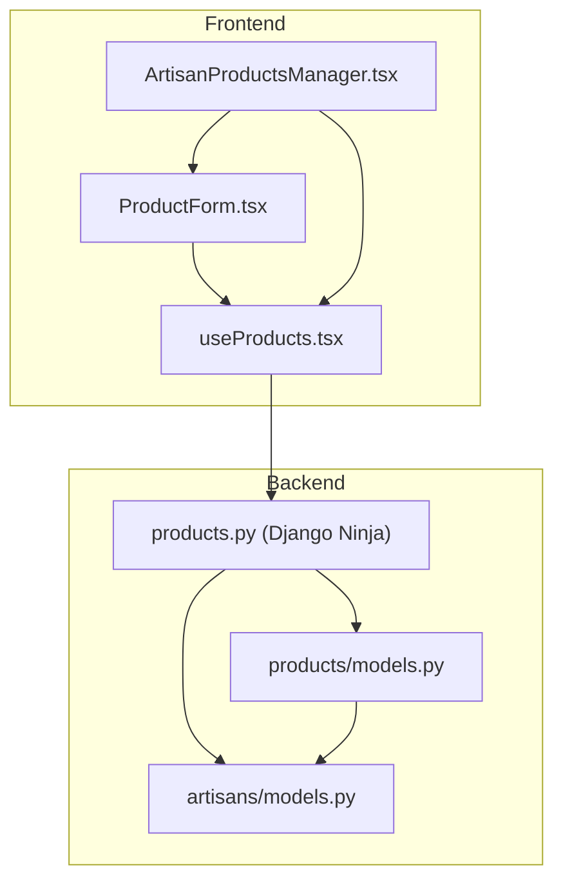
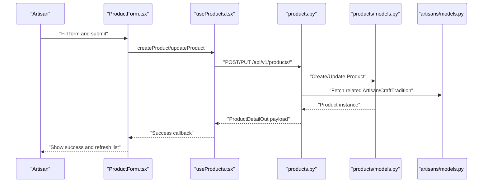
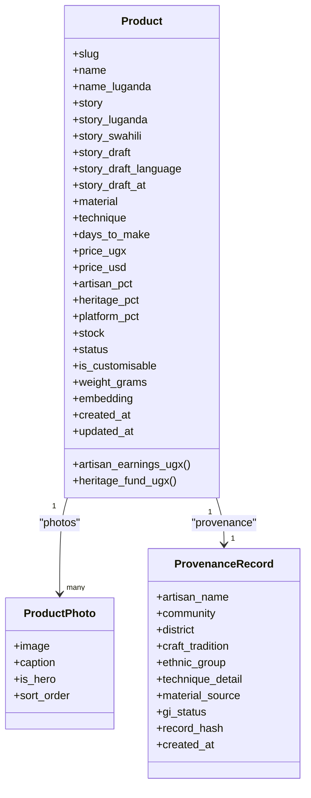
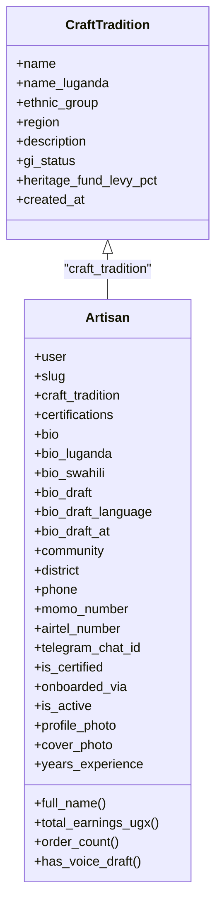
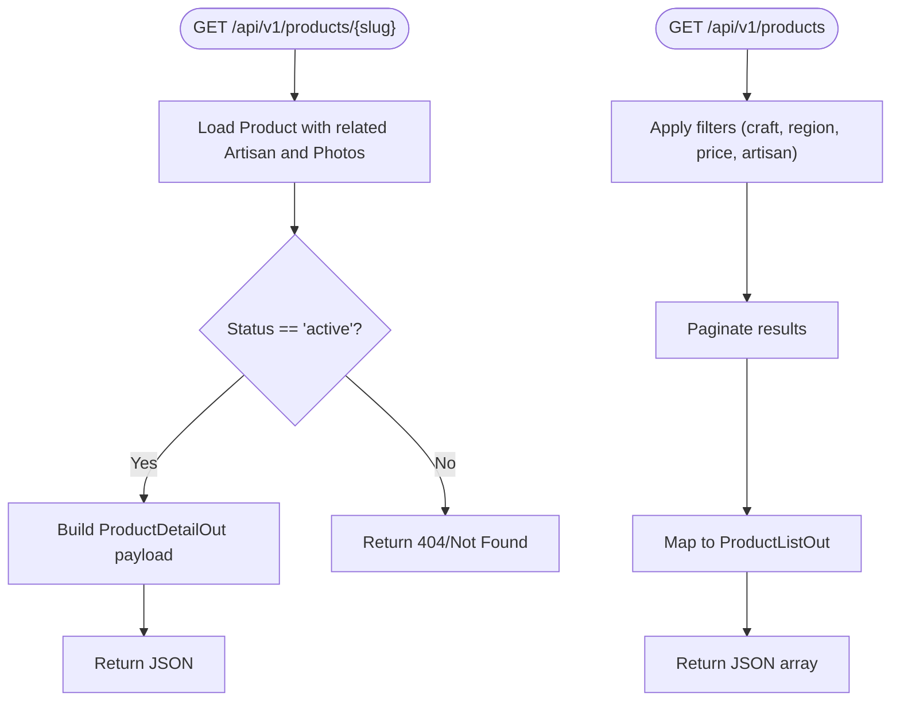
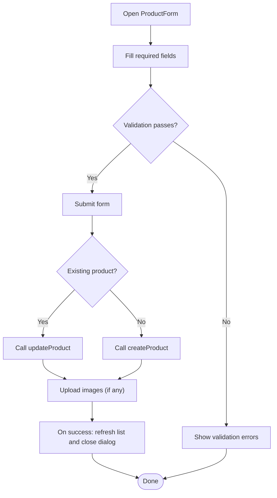
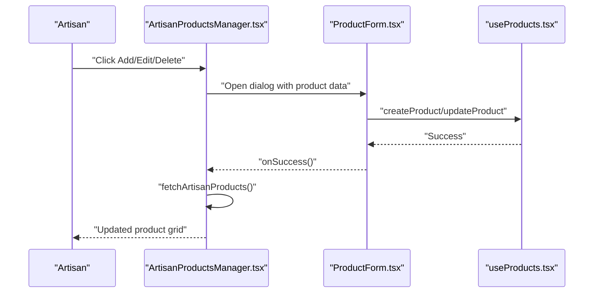
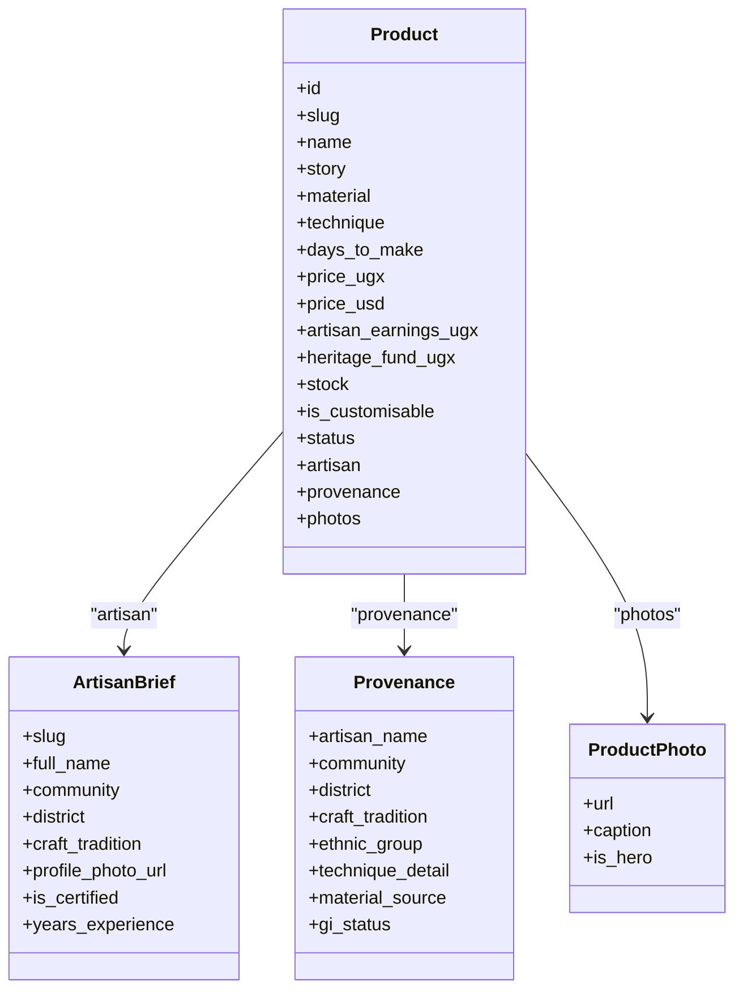
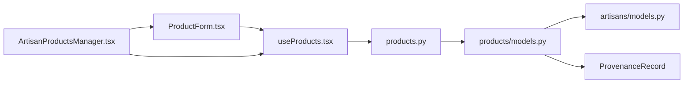

# Product Creation & Management Workflow

<cite>
**Referenced Files in This Document**
- [products.py](file://backend/api/v1/products.py)
- [models.py](file://backend/apps/products/models.py)
- [models.py](file://backend/apps/artisans/models.py)
- [ProductForm.tsx](file://apps/web/src/components/products/ProductForm.tsx)
- [ArtisanProductsManager.tsx](file://apps/web/src/components/products/ArtisanProductsManager.tsx)
- [useProducts.tsx](file://apps/web/src/hooks/useProducts.tsx)
</cite>

## Table of Contents
1. [Introduction](#introduction)
2. [Project Structure](#project-structure)
3. [Core Components](#core-components)
4. [Architecture Overview](#architecture-overview)
5. [Detailed Component Analysis](#detailed-component-analysis)
6. [Dependency Analysis](#dependency-analysis)
7. [Performance Considerations](#performance-considerations)
8. [Troubleshooting Guide](#troubleshooting-guide)
9. [Conclusion](#conclusion)

## Introduction
This document describes the complete product creation and management workflow for the platform. It covers:
- The product form interface for artisans, including story-first content, craft specifications, pricing configuration, inventory setup, and image uploads
- The artisan product management dashboard for listing, editing, deleting, and monitoring products
- Backend product models and API endpoints supporting the workflow
- Validation rules, error handling, and user guidance
- Integration between frontend forms and backend models

## Project Structure
The product workflow spans frontend React components and backend Django APIs and models:
- Frontend: Product form, artisan manager, and product hook
- Backend: Product and provenance models, artisan model, and product API endpoints

**Diagram sources**
- [ProductForm.tsx:1-387](file://apps/web/src/components/products/ProductForm.tsx#L1-L387)
- [ArtisanProductsManager.tsx:1-180](file://apps/web/src/components/products/ArtisanProductsManager.tsx#L1-L180)
- [useProducts.tsx:1-135](file://apps/web/src/hooks/useProducts.tsx#L1-L135)
- [products.py:1-191](file://backend/api/v1/products.py#L1-L191)
- [models.py:1-153](file://backend/apps/products/models.py#L1-L153)
- [models.py:1-170](file://backend/apps/artisans/models.py#L1-L170)

**Section sources**
- [ProductForm.tsx:1-387](file://apps/web/src/components/products/ProductForm.tsx#L1-L387)
- [ArtisanProductsManager.tsx:1-180](file://apps/web/src/components/products/ArtisanProductsManager.tsx#L1-L180)
- [useProducts.tsx:1-135](file://apps/web/src/hooks/useProducts.tsx#L1-L135)
- [products.py:1-191](file://backend/api/v1/products.py#L1-L191)
- [models.py:1-153](file://backend/apps/products/models.py#L1-L153)
- [models.py:1-170](file://backend/apps/artisans/models.py#L1-L170)

## Core Components
- Product model: story-first product with craft details, pricing, revenue split, inventory, and multilingual fields
- Provenance record: immutable cultural attribution snapshot linked to a product
- Artisan model: craft tradition, certifications, and multilingual biographical content
- Product API: public endpoints for product listing and detail retrieval
- Frontend form: artisan-facing form for creating and updating products
- Manager: dashboard for listing, searching, editing, and deleting products
- Hook: centralized product data fetching and state management

**Section sources**
- [models.py:10-100](file://backend/apps/products/models.py#L10-L100)
- [models.py:122-153](file://backend/apps/products/models.py#L122-L153)
- [models.py:62-170](file://backend/apps/artisans/models.py#L62-L170)
- [products.py:74-191](file://backend/api/v1/products.py#L74-L191)
- [ProductForm.tsx:24-387](file://apps/web/src/components/products/ProductForm.tsx#L24-L387)
- [ArtisanProductsManager.tsx:26-180](file://apps/web/src/components/products/ArtisanProductsManager.tsx#L26-L180)
- [useProducts.tsx:67-115](file://apps/web/src/hooks/useProducts.tsx#L67-L115)

## Architecture Overview
The workflow integrates frontend forms with backend models via API endpoints:
- Artisan fills the product form with story, craft details, pricing, inventory, and images
- On submit, the form calls the product hook, which invokes backend endpoints
- Backend returns enriched product data including artisan and provenance snapshots
- The manager displays products with filtering and actions

**Diagram sources**
- [ProductForm.tsx:71-104](file://apps/web/src/components/products/ProductForm.tsx#L71-L104)
- [useProducts.tsx:67-115](file://apps/web/src/hooks/useProducts.tsx#L67-L115)
- [products.py:74-191](file://backend/api/v1/products.py#L74-L191)
- [models.py:10-100](file://backend/apps/products/models.py#L10-L100)
- [models.py:62-170](file://backend/apps/artisans/models.py#L62-L170)

## Detailed Component Analysis

### Product Model and Multilingual Content
- Identity and story: product name, slug, and story content with multilingual variants
- Craft specifications: materials, technique, and estimated days to make
- Pricing and revenue: UGX and USD prices, configurable percentages for artisan, heritage fund, and platform
- Inventory and status: stock quantity and lifecycle status (draft, active, sold out, archived)
- Customization and shipping: personalization flag and weight metadata
- Embedding: semantic vector field for search enhancement
- Provenance linkage: one-to-one record capturing cultural attribution at listing time

**Diagram sources**
- [models.py:10-100](file://backend/apps/products/models.py#L10-L100)
- [models.py:102-120](file://backend/apps/products/models.py#L102-L120)
- [models.py:122-153](file://backend/apps/products/models.py#L122-L153)

**Section sources**
- [models.py:10-100](file://backend/apps/products/models.py#L10-L100)
- [models.py:122-153](file://backend/apps/products/models.py#L122-L153)

### Artisan Model and Craft Tradition
- Craft traditions define cultural IP anchors with GI status and heritage levy
- Artisans are linked to users, craft traditions, and certifications
- Multilingual biographical content and voice transcription drafts
- Location, contact, and media assets
- Computed metrics for earnings and order counts

**Diagram sources**
- [models.py:14-45](file://backend/apps/artisans/models.py#L14-L45)
- [models.py:62-170](file://backend/apps/artisans/models.py#L62-L170)

**Section sources**
- [models.py:14-45](file://backend/apps/artisans/models.py#L14-L45)
- [models.py:62-170](file://backend/apps/artisans/models.py#L62-L170)

### Product API Endpoints
- Product detail endpoint returns story-first content, pricing, artisan info, provenance, and photos
- Product listing supports filtering by craft type, region, price range, and artisan slug
- Both endpoints optimize queries with select_related and prefetch_related

**Diagram sources**
- [products.py:74-191](file://backend/api/v1/products.py#L74-L191)

**Section sources**
- [products.py:74-191](file://backend/api/v1/products.py#L74-L191)

### Product Form Interface
- Fields: basic info (name, category, price, stock), description/story, materials, use case, size category/dimensions, other skills
- Options: personalization, returnability, availability
- Image upload: up to five images with previews; primary image designation
- Validation: required fields marked with asterisks; numeric constraints for price and stock
- Submission: creates or updates product, then uploads images sequentially

**Diagram sources**
- [ProductForm.tsx:71-104](file://apps/web/src/components/products/ProductForm.tsx#L71-L104)
- [ProductForm.tsx:114-387](file://apps/web/src/components/products/ProductForm.tsx#L114-L387)

**Section sources**
- [ProductForm.tsx:24-387](file://apps/web/src/components/products/ProductForm.tsx#L24-L387)

### Artisan Products Manager
- Lists products with search by name or category
- Opens the product form dialog for add/edit
- Handles deletion with confirmation
- Refreshes product list on successful operations

**Diagram sources**
- [ArtisanProductsManager.tsx:26-180](file://apps/web/src/components/products/ArtisanProductsManager.tsx#L26-L180)
- [ProductForm.tsx:24-387](file://apps/web/src/components/products/ProductForm.tsx#L24-L387)
- [useProducts.tsx:67-115](file://apps/web/src/hooks/useProducts.tsx#L67-L115)

**Section sources**
- [ArtisanProductsManager.tsx:26-180](file://apps/web/src/components/products/ArtisanProductsManager.tsx#L26-L180)

### Data Fetching and Types
- Centralized product fetching with optional filters
- Strongly typed product interface aligning with backend schemas
- Toast-based error feedback for failed loads

**Diagram sources**
- [useProducts.tsx:6-53](file://apps/web/src/hooks/useProducts.tsx#L6-L53)

**Section sources**
- [useProducts.tsx:67-115](file://apps/web/src/hooks/useProducts.tsx#L67-L115)
- [useProducts.tsx:6-53](file://apps/web/src/hooks/useProducts.tsx#L6-L53)

## Dependency Analysis
- Frontend depends on the product hook for data and on the product form for UI
- The manager orchestrates UI interactions and triggers data refresh
- Backend API depends on product and artisan models; product model depends on artisan model
- Provenance record depends on product

**Diagram sources**
- [ProductForm.tsx:1-387](file://apps/web/src/components/products/ProductForm.tsx#L1-L387)
- [ArtisanProductsManager.tsx:1-180](file://apps/web/src/components/products/ArtisanProductsManager.tsx#L1-L180)
- [useProducts.tsx:1-135](file://apps/web/src/hooks/useProducts.tsx#L1-L135)
- [products.py:1-191](file://backend/api/v1/products.py#L1-L191)
- [models.py:1-153](file://backend/apps/products/models.py#L1-L153)
- [models.py:1-170](file://backend/apps/artisans/models.py#L1-L170)

**Section sources**
- [products.py:1-191](file://backend/api/v1/products.py#L1-L191)
- [models.py:1-153](file://backend/apps/products/models.py#L1-L153)
- [models.py:1-170](file://backend/apps/artisans/models.py#L1-L170)

## Performance Considerations
- API endpoints use select_related and prefetch_related to minimize database queries for product detail and listing
- Pagination on listing reduces payload sizes
- Image uploads occur sequentially in the form; consider batching or concurrency limits if scaling
- Product model includes a vector field for embeddings; ensure indexing and background tasks are configured for efficient search

[No sources needed since this section provides general guidance]

## Troubleshooting Guide
- Form submission errors: check console logs for thrown errors during create/update; ensure required fields are filled
- Image upload failures: verify file count limit and accepted types; confirm upload flow completes for all selected images
- Product list not refreshing: ensure onSuccess handler triggers fetchArtisanProducts; verify toast feedback on errors
- API errors: review backend logs for query exceptions; confirm filters and pagination parameters are valid

**Section sources**
- [ProductForm.tsx:71-104](file://apps/web/src/components/products/ProductForm.tsx#L71-L104)
- [ArtisanProductsManager.tsx:42-53](file://apps/web/src/components/products/ArtisanProductsManager.tsx#L42-L53)
- [useProducts.tsx:83-92](file://apps/web/src/hooks/useProducts.tsx#L83-L92)

## Conclusion
The product creation and management workflow combines a story-first product model with artisan-centric UI and robust backend APIs. The form captures essential craft and commercial details, while the manager enables efficient listing and maintenance. Multilingual content and provenance records reinforce cultural attribution and transparency. The integration between frontend and backend ensures a cohesive experience for artisans to publish and manage their listings.