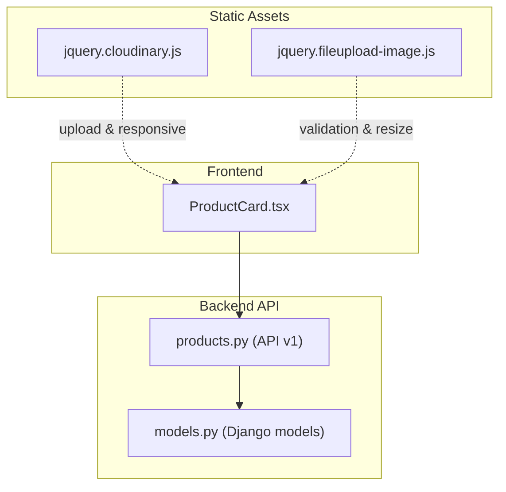
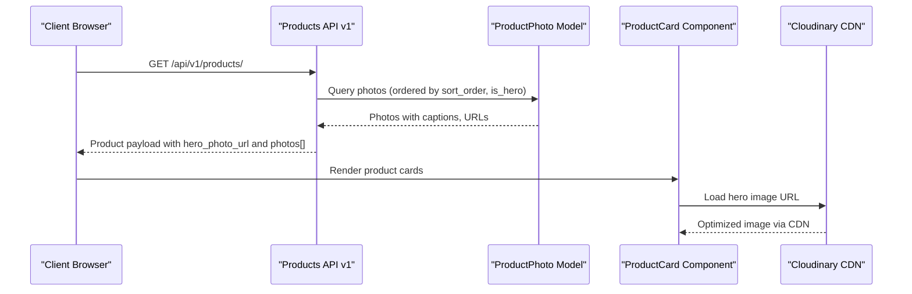
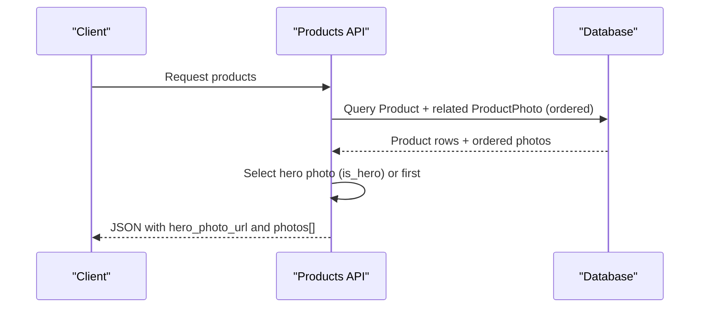
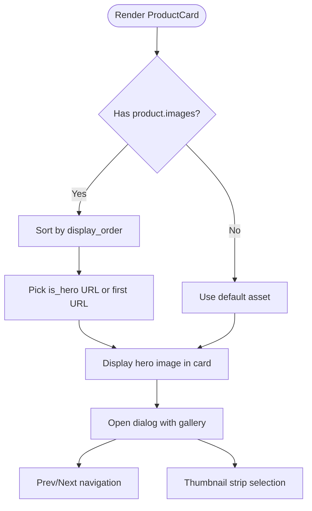
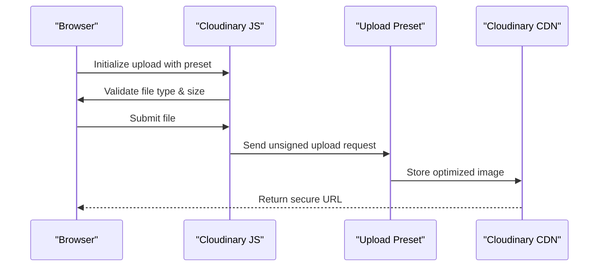
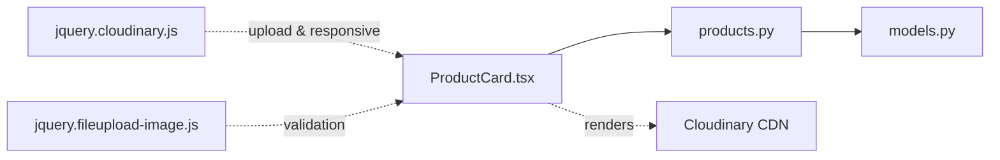

# Product Media Management

<cite>
**Referenced Files in This Document**
- [ProductCard.tsx](file://apps/web/src/components/products/ProductCard.tsx)
- [models.py](file://backend/apps/products/models.py)
- [products.py](file://backend/api/v1/products.py)
- [jquery.cloudinary.js](file://backend/staticfiles/cloudinary/js/jquery.cloudinary.js)
- [jquery.fileupload-image.js](file://backend/staticfiles/cloudinary/js/jquery.fileupload-image.js)
</cite>

## Table of Contents
1. [Introduction](#introduction)
2. [Project Structure](#project-structure)
3. [Core Components](#core-components)
4. [Architecture Overview](#architecture-overview)
5. [Detailed Component Analysis](#detailed-component-analysis)
6. [Dependency Analysis](#dependency-analysis)
7. [Performance Considerations](#performance-considerations)
8. [Troubleshooting Guide](#troubleshooting-guide)
9. [Conclusion](#conclusion)

## Introduction
This document explains the product media handling and image management system. It covers the ProductPhoto model architecture supporting multiple images per product, hero image designation, captions, and sorting; the Cloudinary integration for storage, optimization, and CDN delivery; the image upload workflow and validation rules; responsive image generation; the product card component implementation for hero image display, fallback mechanisms, and lazy loading strategies; and media optimization techniques, accessibility considerations, and performance best practices for large product catalogs.

## Project Structure
The media system spans frontend React components and backend Django models/APIs, with static Cloudinary client libraries included for upload and responsive transformations.

**Diagram sources**
- [ProductCard.tsx:1-396](file://apps/web/src/components/products/ProductCard.tsx#L1-L396)
- [models.py:102-119](file://backend/apps/products/models.py#L102-L119)
- [products.py:34-190](file://backend/api/v1/products.py#L34-L190)
- [jquery.cloudinary.js:3541-4778](file://backend/staticfiles/cloudinary/js/jquery.cloudinary.js#L3541-L4778)
- [jquery.fileupload-image.js:121-151](file://backend/staticfiles/cloudinary/js/jquery.fileupload-image.js#L121-L151)

**Section sources**
- [ProductCard.tsx:1-396](file://apps/web/src/components/products/ProductCard.tsx#L1-L396)
- [models.py:102-119](file://backend/apps/products/models.py#L102-L119)
- [products.py:34-190](file://backend/api/v1/products.py#L34-L190)
- [jquery.cloudinary.js:3541-4778](file://backend/staticfiles/cloudinary/js/jquery.cloudinary.js#L3541-L4778)
- [jquery.fileupload-image.js:121-151](file://backend/staticfiles/cloudinary/js/jquery.fileupload-image.js#L121-L151)

## Core Components
- ProductPhoto model: Stores multiple images per product with caption, hero designation, and sort order.
- Product API: Serializes hero photo URLs and aggregates product images for clients.
- ProductCard component: Renders hero images, fallbacks, gallery navigation, and feature badges.
- Cloudinary client libraries: Provide upload presets, responsive transformations, and image validation/resizing defaults.

Key implementation references:
- ProductPhoto model definition and ordering: [models.py:102-119](file://backend/apps/products/models.py#L102-L119)
- Product API serialization of hero photo: [products.py:186](file://backend/api/v1/products.py#L186)
- Frontend hero image selection and fallback: [ProductCard.tsx:66-68](file://apps/web/src/components/products/ProductCard.tsx#L66-L68)
- Cloudinary defaults and responsive update: [jquery.cloudinary.js:3548-4504](file://backend/staticfiles/cloudinary/js/jquery.cloudinary.js#L3548-L4504)
- Image upload validation and resize limits: [jquery.fileupload-image.js:121-151](file://backend/staticfiles/cloudinary/js/jquery.fileupload-image.js#L121-L151)

**Section sources**
- [models.py:102-119](file://backend/apps/products/models.py#L102-L119)
- [products.py:186](file://backend/api/v1/products.py#L186)
- [ProductCard.tsx:66-68](file://apps/web/src/components/products/ProductCard.tsx#L66-L68)
- [jquery.cloudinary.js:3548-4504](file://backend/staticfiles/cloudinary/js/jquery.cloudinary.js#L3548-L4504)
- [jquery.fileupload-image.js:121-151](file://backend/staticfiles/cloudinary/js/jquery.fileupload-image.js#L121-L151)

## Architecture Overview
The media pipeline integrates frontend and backend:
- Backend: ProductPhoto records are stored with metadata and ordering. The API serializes hero images and lists all images for a product.
- Frontend: ProductCard selects the hero image or falls back to a default asset, displays a gallery, and supports navigation among multiple images.
- Static Cloudinary assets: Provide upload presets and responsive image updates to optimize delivery via CDN.

**Diagram sources**
- [products.py:186](file://backend/api/v1/products.py#L186)
- [models.py:102-119](file://backend/apps/products/models.py#L102-L119)
- [ProductCard.tsx:66-68](file://apps/web/src/components/products/ProductCard.tsx#L66-L68)

## Detailed Component Analysis

### ProductPhoto Model Architecture
The ProductPhoto model encapsulates:
- Foreign key to Product with related_name "photos"
- Image field with upload_to path
- Caption field for optional description
- is_hero flag to designate the primary display image
- sort_order for deterministic ordering
- Ordering: ascending by sort_order, then prioritizing is_hero

**Diagram sources**
- [models.py:102-119](file://backend/apps/products/models.py#L102-L119)

Implementation highlights:
- Ordering ensures consistent rendering and easy retrieval of hero images.
- Related_name "photos" enables reverse lookup from Product to images.

**Section sources**
- [models.py:102-119](file://backend/apps/products/models.py#L102-L119)

### Product API Serialization and Hero Image Exposure
The API endpoint serializes product data and exposes:
- hero_photo_url derived from the hero image
- photos list containing all images for the product

**Diagram sources**
- [products.py:186](file://backend/api/v1/products.py#L186)

**Section sources**
- [products.py:186](file://backend/api/v1/products.py#L186)

### Product Card Component: Hero Image Display, Fallbacks, and Gallery
The ProductCard component:
- Selects the hero image if present, otherwise the first image, otherwise a default asset
- Renders a gallery with navigation and thumbnails
- Applies hover scaling and grayscale effects on desktop
- Uses feature badges and availability indicators

**Diagram sources**
- [ProductCard.tsx:44-68](file://apps/web/src/components/products/ProductCard.tsx#L44-L68)
- [ProductCard.tsx:229-284](file://apps/web/src/components/products/ProductCard.tsx#L229-L284)

**Section sources**
- [ProductCard.tsx:44-68](file://apps/web/src/components/products/ProductCard.tsx#L44-L68)
- [ProductCard.tsx:229-284](file://apps/web/src/components/products/ProductCard.tsx#L229-L284)

### Cloudinary Integration: Uploads, Validation, and Responsive Images
Cloudinary client libraries provide:
- Default image/video parameters and upload presets
- Image validation rules (file type, max size, max dimensions)
- Responsive image updates (width auto, device pixel ratio)
- Unsigned upload initialization for browser-side uploads

**Diagram sources**
- [jquery.cloudinary.js:4693-4756](file://backend/staticfiles/cloudinary/js/jquery.cloudinary.js#L4693-L4756)
- [jquery.fileupload-image.js:121-151](file://backend/staticfiles/cloudinary/js/jquery.fileupload-image.js#L121-L151)

Responsive image behavior:
- Updates widths and DPR automatically based on container size
- Supports stoppoints and debounced resizing

**Section sources**
- [jquery.cloudinary.js:3548-4504](file://backend/staticfiles/cloudinary/js/jquery.cloudinary.js#L3548-L4504)
- [jquery.cloudinary.js:4693-4756](file://backend/staticfiles/cloudinary/js/jquery.cloudinary.js#L4693-L4756)
- [jquery.fileupload-image.js:121-151](file://backend/staticfiles/cloudinary/js/jquery.fileupload-image.js#L121-L151)

## Dependency Analysis
- ProductCard depends on product.images and the hero selection logic.
- API depends on ProductPhoto ordering to expose consistent image sequences.
- Static Cloudinary assets depend on configured upload presets and responsive settings.

**Diagram sources**
- [ProductCard.tsx:1-396](file://apps/web/src/components/products/ProductCard.tsx#L1-L396)
- [products.py:34-190](file://backend/api/v1/products.py#L34-L190)
- [models.py:102-119](file://backend/apps/products/models.py#L102-L119)
- [jquery.cloudinary.js:3541-4778](file://backend/staticfiles/cloudinary/js/jquery.cloudinary.js#L3541-L4778)
- [jquery.fileupload-image.js:121-151](file://backend/staticfiles/cloudinary/js/jquery.fileupload-image.js#L121-L151)

**Section sources**
- [ProductCard.tsx:1-396](file://apps/web/src/components/products/ProductCard.tsx#L1-L396)
- [products.py:34-190](file://backend/api/v1/products.py#L34-L190)
- [models.py:102-119](file://backend/apps/products/models.py#L102-L119)
- [jquery.cloudinary.js:3541-4778](file://backend/staticfiles/cloudinary/js/jquery.cloudinary.js#L3541-L4778)
- [jquery.fileupload-image.js:121-151](file://backend/staticfiles/cloudinary/js/jquery.fileupload-image.js#L121-L151)

## Performance Considerations
- Sorting and ordering: ProductPhoto ordering by sort_order and is_hero ensures predictable rendering and efficient hero selection.
- CDN delivery: Cloudinary URLs deliver optimized images with compression and responsive sizing.
- Lazy loading: Consider using native loading="lazy" on img tags and intersection observer-based loading for offscreen images.
- Image validation: Enforce file type and size limits to reduce server load and storage costs.
- Responsive updates: Use Cloudinary responsive updates to avoid oversized images and improve LCP.
- Asset fallbacks: Provide a lightweight default asset for products without images to avoid layout shifts.

[No sources needed since this section provides general guidance]

## Troubleshooting Guide
- Hero image not visible:
  - Verify is_hero flag is set on the intended ProductPhoto.
  - Confirm API serialization includes hero_photo_url.
  - Check that the image URL resolves via CDN.
- Gallery not rendering:
  - Ensure product.images is populated and sorted by display_order.
  - Confirm thumbnail navigation updates currentImageIndex.
- Upload errors:
  - Validate file type matches allowed image types.
  - Check file size does not exceed maximum.
  - Ensure upload preset is configured and CORS callback is present.

**Section sources**
- [models.py:102-119](file://backend/apps/products/models.py#L102-L119)
- [products.py:186](file://backend/api/v1/products.py#L186)
- [ProductCard.tsx:44-68](file://apps/web/src/components/products/ProductCard.tsx#L44-L68)
- [jquery.fileupload-image.js:121-151](file://backend/staticfiles/cloudinary/js/jquery.fileupload-image.js#L121-L151)
- [jquery.cloudinary.js:4693-4756](file://backend/staticfiles/cloudinary/js/jquery.cloudinary.js#L4693-L4756)

## Conclusion
The product media system combines a robust ProductPhoto model with Cloudinary-powered storage and optimization, a flexible API exposing hero and gallery images, and a React component that renders hero images with fallbacks and a rich gallery experience. By leveraging ordering, responsive transformations, and validation rules, the system scales efficiently for large catalogs while maintaining strong accessibility and performance characteristics.