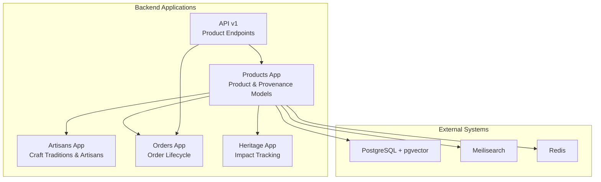
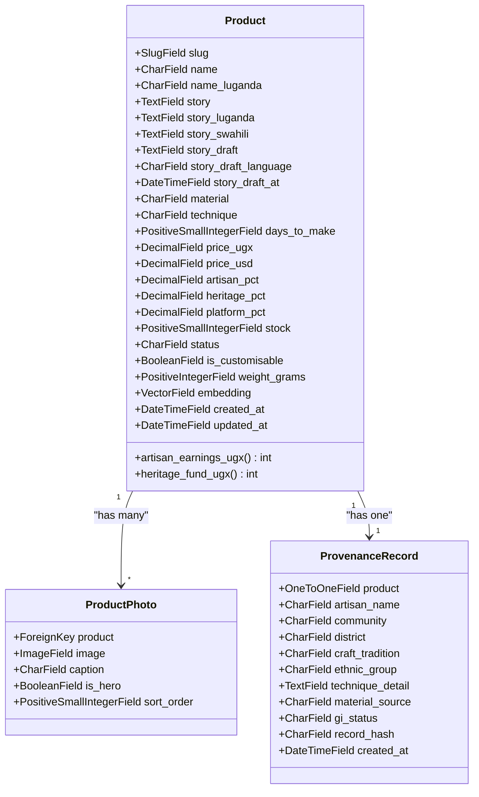
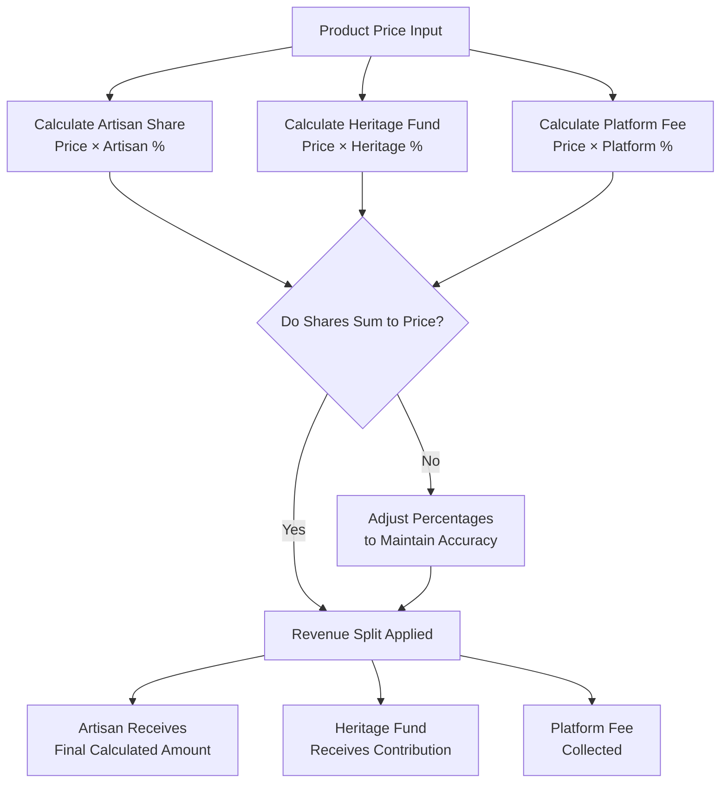
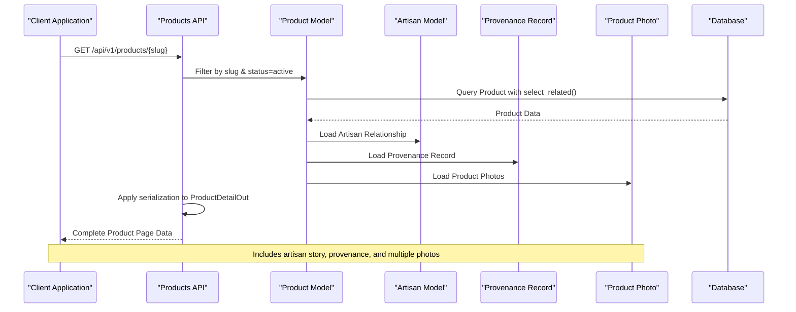
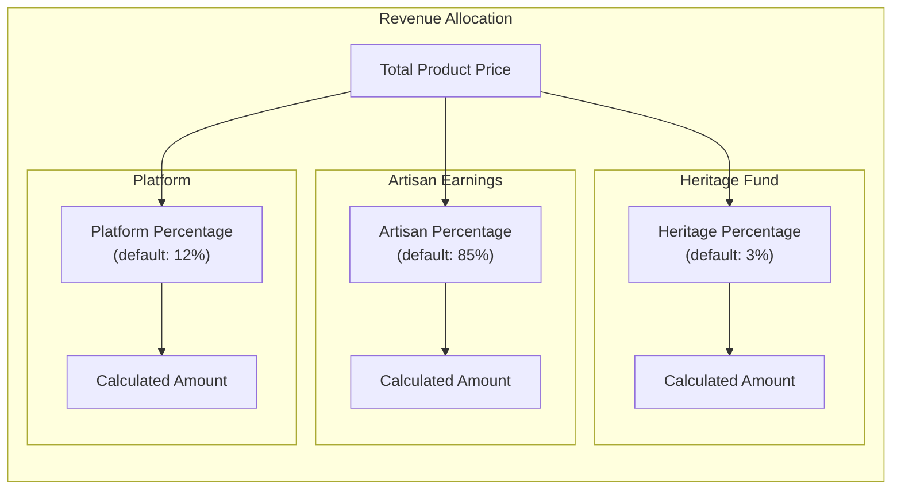
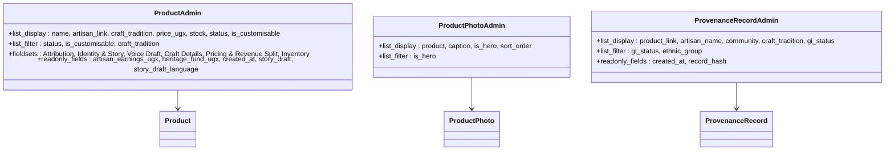
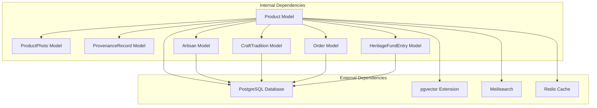
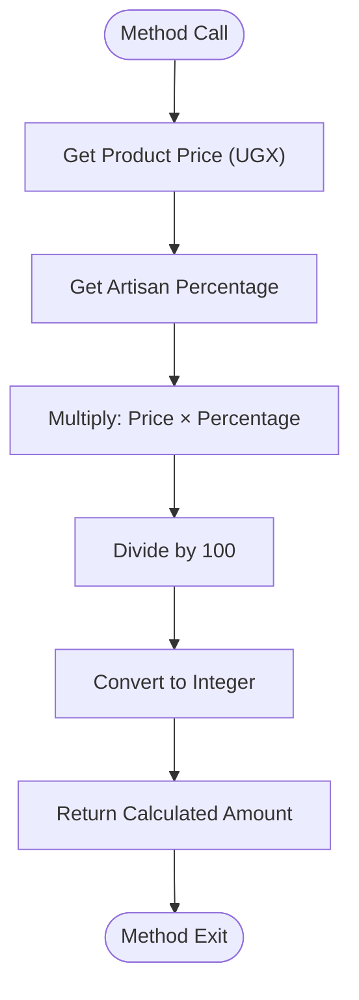
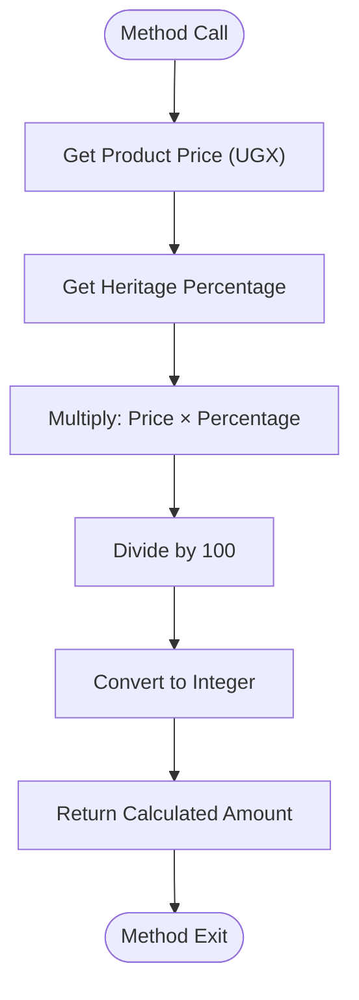

# Product Model Design

<cite>
**Referenced Files in This Document**
- [models.py](file://backend/apps/products/models.py)
- [products.py](file://backend/api/v1/products.py)
- [admin.py](file://backend/apps/products/admin.py)
- [models.py](file://backend/apps/artisans/models.py)
- [models.py](file://backend/apps/orders/models.py)
- [models.py](file://backend/apps/heritage/models.py)
- [docker-compose.yml](file://infrastructure/docker-compose.yml)
</cite>

## Table of Contents
1. [Introduction](#introduction)
2. [Project Structure](#project-structure)
3. [Core Components](#core-components)
4. [Architecture Overview](#architecture-overview)
5. [Detailed Component Analysis](#detailed-component-analysis)
6. [Dependency Analysis](#dependency-analysis)
7. [Performance Considerations](#performance-considerations)
8. [Troubleshooting Guide](#troubleshooting-guide)
9. [Conclusion](#conclusion)

## Introduction
This document provides comprehensive documentation for the Product model design and architecture. The system follows a story-first product philosophy that prioritizes artisan narratives and cultural provenance over traditional e-commerce product descriptions. The Product model is anchored to an artisan and craft tradition, with embedded semantic search capabilities and transparent revenue sharing mechanisms that support both artisans and the heritage fund.

## Project Structure
The Product model architecture spans multiple Django applications and integrates with external systems for semantic search and administrative management:

**Diagram sources**
- [models.py:10-153](file://backend/apps/products/models.py#L10-L153)
- [models.py:14-170](file://backend/apps/artisans/models.py#L14-L170)
- [models.py:10-122](file://backend/apps/orders/models.py#L10-L122)
- [models.py:9-66](file://backend/apps/heritage/models.py#L9-L66)

**Section sources**
- [models.py:1-153](file://backend/apps/products/models.py#L1-L153)
- [docker-compose.yml:1-51](file://infrastructure/docker-compose.yml#L1-L51)

## Core Components
The Product model consists of several interconnected components that work together to create a culturally-rich, transparent commerce experience:

### Primary Product Model
The core Product model defines the fundamental attributes and relationships that form the foundation of the story-first approach:

**Diagram sources**
- [models.py:10-153](file://backend/apps/products/models.py#L10-L153)

### Revenue Sharing Architecture
The product model implements a transparent three-way revenue split that supports artisans, heritage preservation, and platform sustainability:

**Diagram sources**
- [models.py:88-96](file://backend/apps/products/models.py#L88-L96)

**Section sources**
- [models.py:10-153](file://backend/apps/products/models.py#L10-L153)

## Architecture Overview
The Product model architecture integrates multiple systems to create a comprehensive story-first commerce platform:

**Diagram sources**
- [products.py:74-123](file://backend/api/v1/products.py#L74-L123)
- [models.py:10-153](file://backend/apps/products/models.py#L10-L153)

The architecture emphasizes cultural storytelling through:
- Multilingual story support (English, Luganda, Swahili)
- Immutable provenance records that capture cultural IP
- Transparent revenue sharing with heritage fund contributions
- Semantic search integration via vector embeddings

**Section sources**
- [products.py:1-191](file://backend/api/v1/products.py#L1-L191)
- [models.py:10-153](file://backend/apps/products/models.py#L10-L153)

## Detailed Component Analysis

### Identity and Story Elements
The identity and story components form the foundation of the story-first philosophy:

| Field Category | Field Name | Type | Purpose | Validation |
|---|---|---|---|---|
| Identity | slug | SlugField | Unique URL identifier | unique=True, max_length=150 |
| Identity | name | CharField | Primary product name | max_length=300 |
| Identity | name_luganda | CharField | Luganda translation | max_length=300, blank=True |
| Story | story | TextField | Primary artisan narrative | primary storytelling element |
| Story | story_luganda | TextField | Luganda translation | blank=True |
| Story | story_swahili | TextField | Swahili translation | blank=True |
| Voice Draft | story_draft | TextField | Transcribed voice notes | blank=True, null=True |
| Voice Draft | story_draft_language | CharField | Language code (e.g., "en") | max_length=10, blank=True |
| Voice Draft | story_draft_at | DateTimeField | Timestamp of transcription | null=True, blank=True |

### Craft Details and Production Information
The craft details section captures the artisanal heritage and production specifics:

| Field | Type | Description | Constraints |
|---|---|---|---|
| material | CharField | Material sourcing details | max_length=300 |
| technique | CharField | Specific crafting technique | max_length=400 |
| days_to_make | PositiveSmallIntegerField | Production lead time | default=1 |

### Pricing and Revenue Structure
The pricing system implements a transparent three-way revenue split:

**Diagram sources**
- [models.py:55-67](file://backend/apps/products/models.py#L55-L67)
- [models.py:88-96](file://backend/apps/products/models.py#L88-L96)

### Inventory and Availability Management
The inventory system tracks product availability and status:

| Field | Type | Description | Options |
|---|---|---|---|
| stock | PositiveSmallIntegerField | Available quantity | default=1 |
| status | CharField | Product lifecycle status | draft, active, sold_out, archived |

### Customization and Shipping Specifications
The customization and shipping components enable flexible product offerings:

| Field | Type | Description | Default |
|---|---|---|---|
| is_customisable | BooleanField | Allows custom orders | default=False |
| weight_grams | PositiveIntegerField | Shipping weight | default=0 |
| embedding | VectorField | Semantic search vectors | dimensions=384 |

### Administrative Interface
The Django admin interface provides comprehensive management capabilities:

**Diagram sources**
- [admin.py:11-109](file://backend/apps/products/admin.py#L11-L109)

**Section sources**
- [models.py:10-153](file://backend/apps/products/models.py#L10-L153)
- [admin.py:1-109](file://backend/apps/products/admin.py#L1-L109)

## Dependency Analysis
The Product model has well-defined dependencies that support the story-first architecture:

**Diagram sources**
- [models.py:10-153](file://backend/apps/products/models.py#L10-L153)
- [models.py:62-170](file://backend/apps/artisans/models.py#L62-L170)
- [models.py:10-122](file://backend/apps/orders/models.py#L10-L122)
- [models.py:9-66](file://backend/apps/heritage/models.py#L9-L66)

### Business Logic Implementation
The Product model implements several key business logic components:

#### Artisan Earnings Calculation
The artisan earnings property calculates the net amount an artisan receives per unit sale:

**Diagram sources**
- [models.py:88-91](file://backend/apps/products/models.py#L88-L91)

#### Heritage Fund Contribution
The heritage fund contribution property calculates the cultural preservation contribution:

**Diagram sources**
- [models.py:93-96](file://backend/apps/products/models.py#L93-L96)

**Section sources**
- [models.py:88-96](file://backend/apps/products/models.py#L88-L96)

## Performance Considerations
The Product model architecture incorporates several performance optimizations:

### Database Design Optimizations
- **Indexing Strategy**: Slug fields are indexed for fast lookups, and foreign keys are properly indexed for relationship queries
- **Query Optimization**: Select-related and prefetch-related methods minimize database queries for product detail pages
- **Vector Storage**: pgvector extension enables efficient semantic search without impacting primary query performance

### Caching Strategy
- **Admin Interface**: Read-only fields prevent unnecessary updates to calculated values
- **Image Management**: Separate ProductPhoto model allows for efficient image loading and caching
- **Pagination**: API endpoints implement pagination for large product catalogs

### Semantic Search Integration
The embedding field enables advanced search capabilities:
- **Dimensions**: 384-dimensional vector space for optimal semantic representation
- **Storage**: Efficient vector storage optimized for similarity searches
- **Processing**: Asynchronous embedding generation prevents blocking user actions

**Section sources**
- [docker-compose.yml:36-47](file://infrastructure/docker-compose.yml#L36-L47)

## Troubleshooting Guide

### Common Issues and Solutions

#### Product Creation Failures
**Issue**: Products not appearing in listings
**Solution**: Verify status field is set to "active" and all required fields are populated

#### Revenue Calculation Discrepancies
**Issue**: Artisan earnings not matching expectations
**Solution**: Check percentage allocations sum to 100% and verify decimal precision

#### Image Loading Problems
**Issue**: Product photos not displaying correctly
**Solution**: Ensure is_hero flag is properly set and image URLs are accessible

#### Search Functionality Issues
**Issue**: Semantic search not returning expected results
**Solution**: Verify embedding field is populated and Meilisearch service is operational

### Validation Rules and Constraints
The Product model implements comprehensive validation:

| Field | Constraint | Validation Purpose |
|---|---|---|
| slug | unique=True | Prevents URL conflicts |
| price_ugx | max_digits=12, decimal_places=2 | Prevents overflow in Ugandan Shilling calculations |
| price_usd | max_digits=8, decimal_places=2 | Prevents overflow in USD calculations |
| artisan_pct | max_digits=4, decimal_places=2 | Ensures reasonable artisan percentage |
| heritage_pct | max_digits=4, decimal_places=2 | Ensures reasonable heritage contribution |
| platform_pct | max_digits=4, decimal_places=2 | Ensures reasonable platform fee |
| stock | PositiveSmallIntegerField | Prevents negative inventory quantities |
| status | ChoiceField | Maintains product lifecycle integrity |

**Section sources**
- [models.py:16-21](file://backend/apps/products/models.py#L16-L21)
- [models.py:55-67](file://backend/apps/products/models.py#L55-L67)

## Conclusion
The Product model design successfully implements a story-first commerce architecture that prioritizes artisan narratives and cultural provenance. The comprehensive field structure, transparent revenue sharing, and integrated semantic search capabilities create a unique marketplace experience that benefits artisans, preserves cultural heritage, and provides customers with meaningful purchasing experiences. The modular design ensures scalability while maintaining the cultural authenticity that distinguishes this platform from traditional e-commerce solutions.