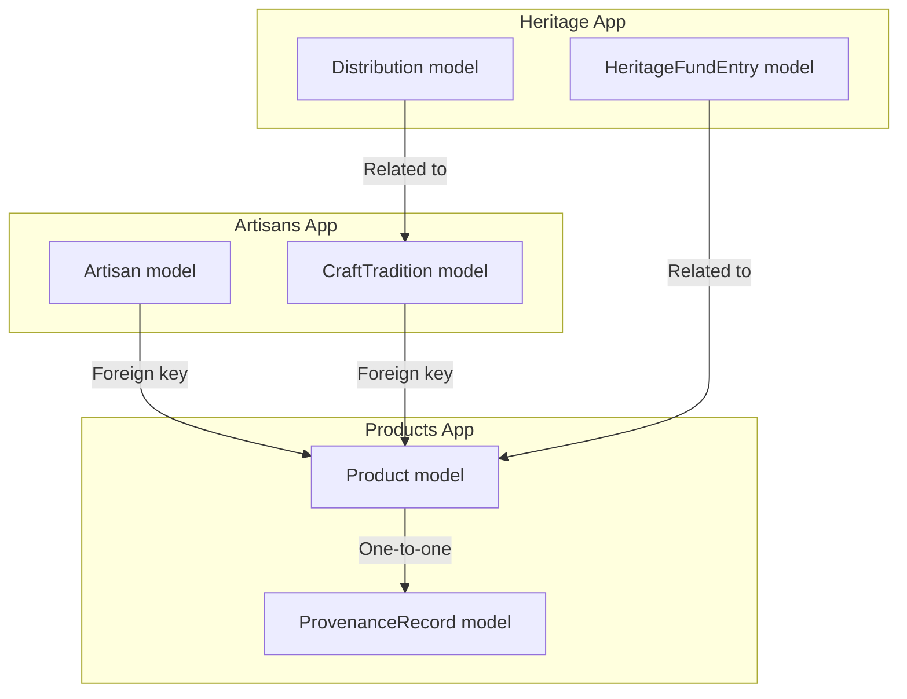
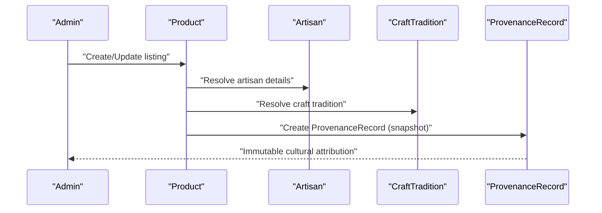
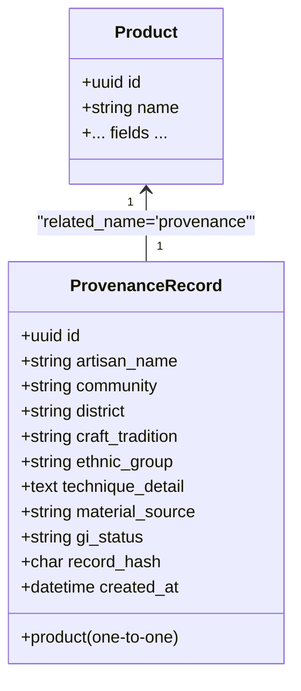
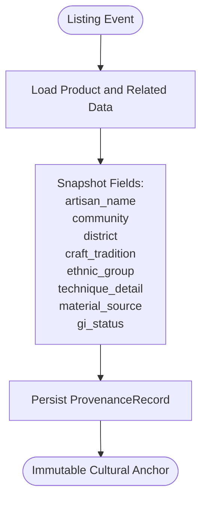
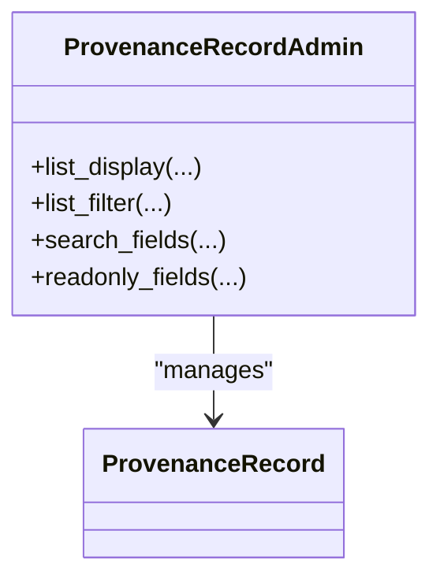
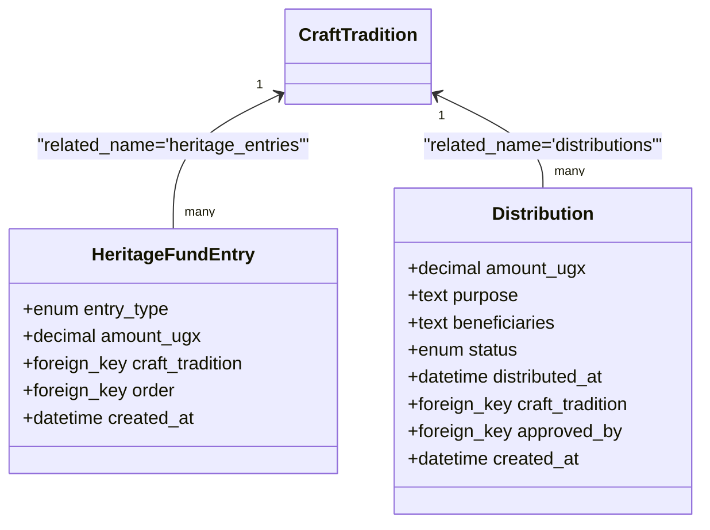
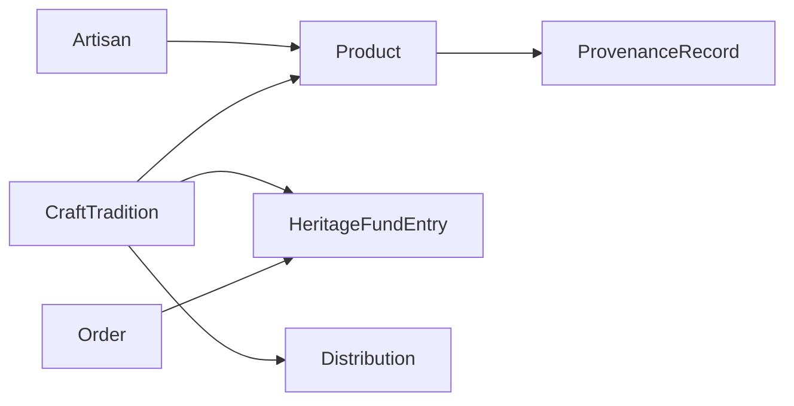

# Provenance Records & Cultural IP

<cite>
**Referenced Files in This Document**
- [models.py](file://backend/apps/products/models.py)
- [admin.py](file://backend/apps/products/admin.py)
- [0001_initial.py](file://backend/apps/products/migrations/0001_initial.py)
- [models.py](file://backend/apps/artisans/models.py)
- [models.py](file://backend/apps/heritage/models.py)
- [0001_initial.py](file://backend/apps/heritage/migrations/0001_initial.py)
- [PROGRESS_REPORT.md](file://PROGRESS_REPORT.md)
</cite>

## Table of Contents
1. [Introduction](#introduction)
2. [Project Structure](#project-structure)
3. [Core Components](#core-components)
4. [Architecture Overview](#architecture-overview)
5. [Detailed Component Analysis](#detailed-component-analysis)
6. [Dependency Analysis](#dependency-analysis)
7. [Performance Considerations](#performance-considerations)
8. [Legal and Ethical Considerations](#legal-and-ethical-considerations)
9. [Conclusion](#conclusion)

## Introduction
This document explains the provenance record system that establishes immutable cultural IP anchors for each product on the platform. It details the ProvenanceRecord model design, the snapshot mechanism that freezes cultural attribution at listing time, the planned blockchain hash field, and the relationship to the main Product model. It also outlines the cultural preservation implications, legal and ethical considerations, and the platform's commitment to fair cultural representation.

## Project Structure
The provenance system spans three primary areas:
- Product catalog and provenance records
- Artisan and craft tradition models that inform provenance snapshots
- Heritage fund models that complement cultural IP stewardship

**Diagram sources**
- [models.py:122-152](file://backend/apps/products/models.py#L122-L152)
- [models.py:14-44](file://backend/apps/artisans/models.py#L14-L44)
- [models.py:9-36](file://backend/apps/heritage/models.py#L9-L36)

**Section sources**
- [models.py:122-152](file://backend/apps/products/models.py#L122-L152)
- [models.py:14-44](file://backend/apps/artisans/models.py#L14-L44)
- [models.py:9-36](file://backend/apps/heritage/models.py#L9-L36)

## Core Components
- ProvenanceRecord: Immutable cultural IP anchor created at listing time, capturing artisan identity, community attribution, craft tradition details, material sourcing, and geographic origins. Includes a placeholder for a future blockchain hash.
- Product: The main product entity that owns a single ProvenanceRecord via a one-to-one relationship.
- Artisan and CraftTradition: Provide the contextual data snapshotted into ProvenanceRecord at listing time.
- HeritageFundEntry and Distribution: Financial transparency and community benefit mechanisms that support cultural IP stewardship.

Key design characteristics:
- One-to-one ownership ensures each product has exactly one provenance record.
- Snapshot fields capture identity, geography, craft, materials, and GI status at listing time.
- Timestamps preserve provenance provenance chronology.
- Admin interface exposes provenance records for oversight and compliance.

**Section sources**
- [models.py:122-152](file://backend/apps/products/models.py#L122-L152)
- [admin.py:92-108](file://backend/apps/products/admin.py#L92-L108)
- [models.py:62-170](file://backend/apps/artisans/models.py#L62-L170)
- [models.py:9-36](file://backend/apps/heritage/models.py#L9-L36)

## Architecture Overview
The provenance lifecycle begins when a product is listed. At that moment, the system captures a snapshot of cultural and geographic details from the associated artisan and craft tradition, and persists them into a dedicated ProvenanceRecord. This record becomes immutable with respect to the product’s listing, ensuring permanent cultural recognition.

**Diagram sources**
- [models.py:122-152](file://backend/apps/products/models.py#L122-L152)
- [models.py:62-170](file://backend/apps/artisans/models.py#L62-L170)

## Detailed Component Analysis

### ProvenanceRecord Model
The ProvenanceRecord model encapsulates the cultural IP anchor:
- Relationship: One-to-one with Product via a foreign key relationship.
- Snapshot fields: artisan_name, community, district, craft_tradition, ethnic_group, technique_detail, material_source, gi_status.
- Future blockchain anchor: record_hash (length 64, blank allowed).
- Timestamp: created_at auto-populated at creation.

**Diagram sources**
- [models.py:122-152](file://backend/apps/products/models.py#L122-L152)

**Section sources**
- [models.py:122-152](file://backend/apps/products/models.py#L122-L152)
- [0001_initial.py:66-86](file://backend/apps/products/migrations/0001_initial.py#L66-L86)

### Product-Related Snapshots
At listing time, the system snapshots:
- Identity: artisan_name
- Community: community, district
- Craft: craft_tradition, technique_detail
- Materials: material_source
- Geography: district (as a proxy for geographic origin)
- Intellectual property: gi_status

These fields are populated from the associated Product’s related Artisan and CraftTradition at the time of listing, ensuring immutability for the product’s record.

**Diagram sources**
- [models.py:122-152](file://backend/apps/products/models.py#L122-L152)
- [models.py:14-44](file://backend/apps/artisans/models.py#L14-L44)

**Section sources**
- [models.py:122-152](file://backend/apps/products/models.py#L122-L152)
- [models.py:14-44](file://backend/apps/artisans/models.py#L14-L44)

### Admin Interface and Oversight
The Unfold admin exposes provenance records for monitoring and compliance:
- Displays product linkage, artisan name, community, craft tradition, and GI status.
- Filters by GI status and ethnic group.
- Searchable by artisan name and craft tradition.
- Protects immutable fields (created_at, record_hash) from editing.

**Diagram sources**
- [admin.py:92-108](file://backend/apps/products/admin.py#L92-L108)

**Section sources**
- [admin.py:92-108](file://backend/apps/products/admin.py#L92-L108)

### Heritage Fund Integration
Financial transparency and community benefit complement cultural IP:
- HeritageFundEntry logs contributions and distributions linked to craft traditions and orders.
- Distribution tracks proposals, approvals, and completions for community benefit.
- Together with ProvenanceRecord, this forms a dual-layer system: cultural attribution and financial stewardship.

**Diagram sources**
- [models.py:9-36](file://backend/apps/heritage/models.py#L9-L36)
- [0001_initial.py:19-49](file://backend/apps/heritage/migrations/0001_initial.py#L19-L49)

**Section sources**
- [models.py:9-36](file://backend/apps/heritage/models.py#L9-L36)
- [0001_initial.py:19-49](file://backend/apps/heritage/migrations/0001_initial.py#L19-L49)

## Dependency Analysis
- Product depends on Artisan and CraftTradition for listing-time context.
- ProvenanceRecord depends on Product (one-to-one).
- Heritage models depend on CraftTradition and optionally on Order for financial transparency.
- Admin module depends on Product and ProvenanceRecord for operational oversight.

**Diagram sources**
- [models.py:122-152](file://backend/apps/products/models.py#L122-L152)
- [models.py:62-170](file://backend/apps/artisans/models.py#L62-L170)
- [models.py:9-36](file://backend/apps/heritage/models.py#L9-L36)

**Section sources**
- [models.py:122-152](file://backend/apps/products/models.py#L122-L152)
- [models.py:62-170](file://backend/apps/artisans/models.py#L62-L170)
- [models.py:9-36](file://backend/apps/heritage/models.py#L9-L36)

## Performance Considerations
- Snapshot cost: Capturing provenance at listing time is a one-time write operation per product listing.
- Query patterns: Provenance queries are read-heavy and benefit from indexing on frequently filtered fields (e.g., gi_status, ethnic_group).
- Storage: ProvenanceRecord is compact; overhead is minimal compared to product media and metadata.
- Admin performance: Limit list filters and search scopes to reduce load on provenance listings.

## Legal and Ethical Considerations
- Cultural attribution: The snapshot preserves the cultural context at listing time, ensuring permanent recognition of artisan and community contributions.
- Intellectual property status: The gi_status field enables transparent tracking of traditional knowledge and design protections.
- Fair representation: The platform commits to accurate and respectful representation of identities, communities, and traditions.
- Transparency and consent: The heritage fund and distribution mechanisms support fair economic outcomes for craft communities.
- Immutable records: Once created, provenance records serve as durable evidence of cultural IP, supporting claims and audits.

**Section sources**
- [models.py:122-152](file://backend/apps/products/models.py#L122-L152)
- [models.py:9-36](file://backend/apps/heritage/models.py#L9-L36)
- [PROGRESS_REPORT.md:52-90](file://PROGRESS_REPORT.md#L52-L90)

## Conclusion
The provenance record system creates immutable cultural IP anchors for each product by capturing a comprehensive snapshot of artisan identity, community attribution, craft tradition, materials, and geography at listing time. The one-to-one relationship with Product ensures a durable, unchangeable record that supports long-term cultural recognition. The upcoming blockchain hash field will further strengthen the system’s integrity. Combined with the heritage fund and distribution models, the platform demonstrates a holistic approach to cultural preservation and fair representation.