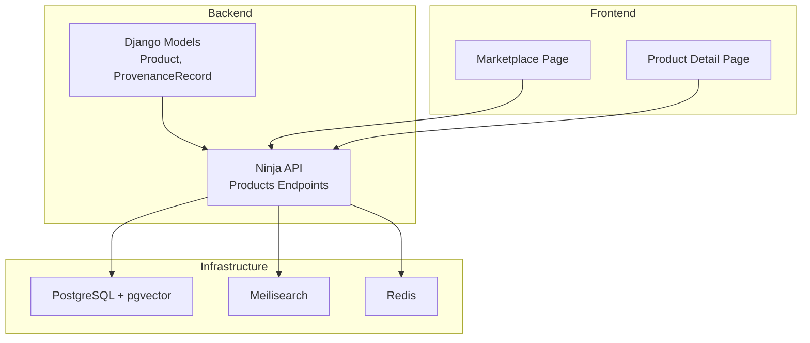
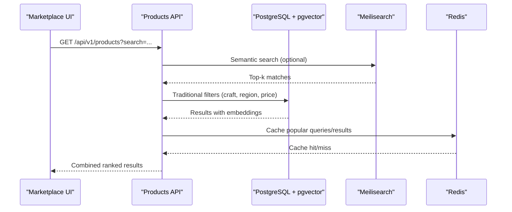
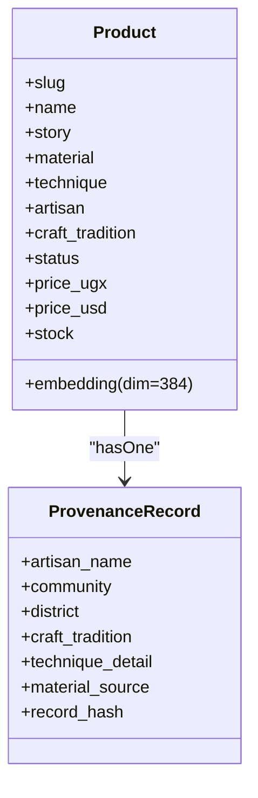
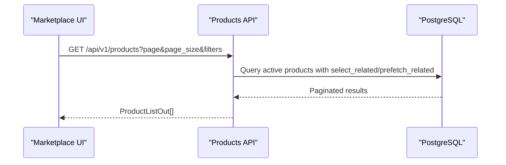
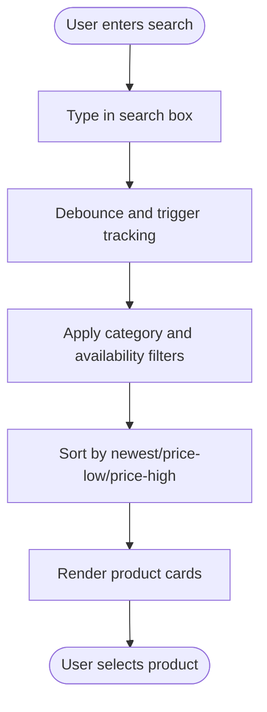
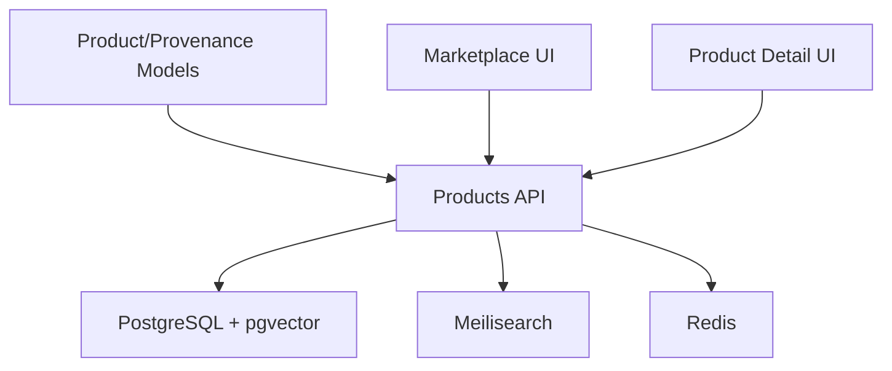

# Search Integration & Semantic Discovery

<cite>
**Referenced Files in This Document**
- [models.py](file://backend/apps/products/models.py)
- [products.py](file://backend/api/v1/products.py)
- [docker-compose.yml](file://infrastructure/docker-compose.yml)
- [Marketplace.tsx](file://apps/web/src/pages/Marketplace.tsx)
- [ProductDetail.tsx](file://apps/web/src/pages/ProductDetail.tsx)
- [Procfile](file://backend/Procfile)
- [README.md](file://README.md)
</cite>

## Table of Contents
1. [Introduction](#introduction)
2. [Project Structure](#project-structure)
3. [Core Components](#core-components)
4. [Architecture Overview](#architecture-overview)
5. [Detailed Component Analysis](#detailed-component-analysis)
6. [Dependency Analysis](#dependency-analysis)
7. [Performance Considerations](#performance-considerations)
8. [Troubleshooting Guide](#troubleshooting-guide)
9. [Conclusion](#conclusion)

## Introduction
This document explains the semantic search integration and product discovery system for Empindu. It focuses on how product embeddings enable intelligent search beyond keyword matching, the pgvector implementation and dimension configuration, hybrid search combining semantic similarity with traditional filtering and relevance scoring, and the integration between product stories, craft details, and embedding vectors for contextual results. It also covers the search interface, filter options, performance optimization techniques for large catalogs, and how the story-first approach improves search relevance and discoverability.

## Project Structure
The search and discovery system spans backend models and APIs, frontend marketplace and product detail pages, and supporting infrastructure for vector storage and a semantic engine.



**Diagram sources**
- [models.py:10-86](file://backend/apps/products/models.py#L10-L86)
- [products.py:14-191](file://backend/api/v1/products.py#L14-L191)
- [docker-compose.yml:4-46](file://infrastructure/docker-compose.yml#L4-L46)
- [Marketplace.tsx:19-55](file://apps/web/src/pages/Marketplace.tsx#L19-L55)
- [ProductDetail.tsx:40-67](file://apps/web/src/pages/ProductDetail.tsx#L40-L67)

**Section sources**
- [models.py:10-86](file://backend/apps/products/models.py#L10-L86)
- [products.py:74-191](file://backend/api/v1/products.py#L74-L191)
- [docker-compose.yml:4-46](file://infrastructure/docker-compose.yml#L4-L46)
- [Marketplace.tsx:19-55](file://apps/web/src/pages/Marketplace.tsx#L19-L55)
- [ProductDetail.tsx:40-67](file://apps/web/src/pages/ProductDetail.tsx#L40-L67)

## Core Components
- Product model with story-first content and a pgvector embedding field configured for 384 dimensions.
- Provenance record anchoring cultural and geographic context to each product.
- Public product listing and detail endpoints returning story, craft details, and artisan metadata.
- Docker Compose services for PostgreSQL with pgvector, Meilisearch for semantic search, and Redis for caching/Celery.

Key implementation highlights:
- Embedding dimension: 384.
- Story-first presentation: product detail and list endpoints surface narrative and craft details prominently.
- Hybrid discovery: traditional faceted filters plus semantic search via Meilisearch.

**Section sources**
- [models.py:78-86](file://backend/apps/products/models.py#L78-L86)
- [products.py:74-191](file://backend/api/v1/products.py#L74-L191)
- [docker-compose.yml:4-46](file://infrastructure/docker-compose.yml#L4-L46)

## Architecture Overview
The system integrates Django-backed product data with vector storage and a semantic search engine. Product stories and craft details inform both embeddings and Meilisearch documents. The frontend exposes a search bar, category filters, and sorting, while the backend augments results with semantic similarity and traditional filters.



**Diagram sources**
- [products.py:126-191](file://backend/api/v1/products.py#L126-L191)
- [docker-compose.yml:4-46](file://infrastructure/docker-compose.yml#L4-L46)

## Detailed Component Analysis

### Product Model and Embeddings
The Product model defines the embedding field with pgvector and includes story and craft details that feed both semantic indexing and the story-first presentation.



- Embedding dimension: 384.
- Story-first fields: story, story_luganda, story_swahili, story_draft influence semantic representation.
- Craft details: material, technique, craft_tradition support hybrid filtering and contextual ranking.

**Diagram sources**
- [models.py:10-86](file://backend/apps/products/models.py#L10-L86)
- [models.py:122-153](file://backend/apps/products/models.py#L122-L153)

**Section sources**
- [models.py:10-86](file://backend/apps/products/models.py#L10-L86)
- [models.py:122-153](file://backend/apps/products/models.py#L122-L153)

### Products API: Listing and Detail
The Products API provides:
- Product listing with faceted filters (craft, region, price range, artisan).
- Product detail with artisan and provenance included for story-first SEO and discoverability.



- Filters supported: craft_type, region, min/max USD, artisan slug.
- Pagination: configurable page/page_size.
- Detail endpoint: returns story, materials, techniques, artisan, provenance, and photos.

**Diagram sources**
- [products.py:126-191](file://backend/api/v1/products.py#L126-L191)
- [products.py:74-124](file://backend/api/v1/products.py#L74-L124)

**Section sources**
- [products.py:126-191](file://backend/api/v1/products.py#L126-L191)
- [products.py:74-124](file://backend/api/v1/products.py#L74-L124)

### Frontend Search Interfaces
- Marketplace page: search bar, category filter, and sorting controls. It debounces search input and tracks search events.
- Product detail page: loads product data for story-first presentation and related recommendations.



**Diagram sources**
- [Marketplace.tsx:26-55](file://apps/web/src/pages/Marketplace.tsx#L26-L55)

**Section sources**
- [Marketplace.tsx:19-55](file://apps/web/src/pages/Marketplace.tsx#L19-L55)
- [ProductDetail.tsx:40-67](file://apps/web/src/pages/ProductDetail.tsx#L40-L67)

### Semantic Search Engine and Vector Storage
- PostgreSQL with pgvector: stores product embeddings and supports vector similarity search.
- Meilisearch: provides semantic search capabilities and is exposed on port 7700.
- Redis: used for caching and as a Celery broker/worker transport.

```mermaid
graph LR
PG["PostgreSQL + pgvector"] <- --> |Vector similarity| Engine["pgvector"]
MS["Meilisearch"] <- --> |Semantic indexing| Engine
RED["Redis"] <- --> |Cache & Tasks| Worker["Celery Worker"]
```

**Diagram sources**
- [docker-compose.yml:4-46](file://infrastructure/docker-compose.yml#L4-L46)
- [Procfile:1-3](file://backend/Procfile#L1-L3)

**Section sources**
- [docker-compose.yml:4-46](file://infrastructure/docker-compose.yml#L4-L46)
- [Procfile:1-3](file://backend/Procfile#L1-L3)

## Dependency Analysis
- Backend depends on Django ORM and pgvector for vector storage.
- API endpoints depend on product models and external services (Meilisearch, Redis).
- Frontend depends on API endpoints for product data and recommendation hooks.



**Diagram sources**
- [models.py:10-86](file://backend/apps/products/models.py#L10-L86)
- [products.py:126-191](file://backend/api/v1/products.py#L126-L191)
- [docker-compose.yml:4-46](file://infrastructure/docker-compose.yml#L4-L46)

**Section sources**
- [models.py:10-86](file://backend/apps/products/models.py#L10-L86)
- [products.py:126-191](file://backend/api/v1/products.py#L126-L191)
- [docker-compose.yml:4-46](file://infrastructure/docker-compose.yml#L4-L46)

## Performance Considerations
- Vector dimension: 384-dimensional embeddings balance recall and compute cost; consider quantization or pruning if scaling.
- Indexing strategy: leverage pgvector’s GIN/HNSW indexes and Meilisearch built-in indexing for fast similarity retrieval.
- Caching: cache frequent queries and product lists in Redis to reduce latency.
- Pagination: keep page_size reasonable; use cursor-based pagination for deep paging.
- Filtering: pre-filter by facets (craft, region, price) before vector search to reduce candidate sets.
- Background tasks: use Celery workers to periodically update embeddings and maintain Meilisearch indices.
- CDN and SSR: serve product detail pages with SSR to improve SEO and perceived performance.

[No sources needed since this section provides general guidance]

## Troubleshooting Guide
- Meilisearch not reachable: confirm service is running and accessible on port 7700.
- Vector search returns empty: verify embedding generation pipeline and that product stories/techniques are populated.
- Slow search performance: enable Redis caching, optimize filters, and consider reducing embedding dimensionality or adding index tuning.
- Celery tasks not processing: check Procfile configuration and logs for worker/beat processes.

**Section sources**
- [README.md:61-111](file://README.md#L61-L111)
- [Procfile:1-3](file://backend/Procfile#L1-L3)
- [docker-compose.yml:4-46](file://infrastructure/docker-compose.yml#L4-L46)

## Conclusion
Empindu’s search and discovery system blends story-first product narratives with modern semantic search powered by pgvector and Meilisearch. The integration of product stories, craft details, and embeddings enables contextual, human-friendly results that go beyond keyword matching. Traditional faceted filters and relevance scoring further refine outcomes, while frontend UX and backend infrastructure ensure scalability and responsiveness for large catalogs.