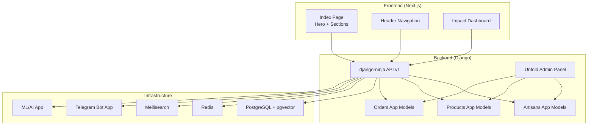
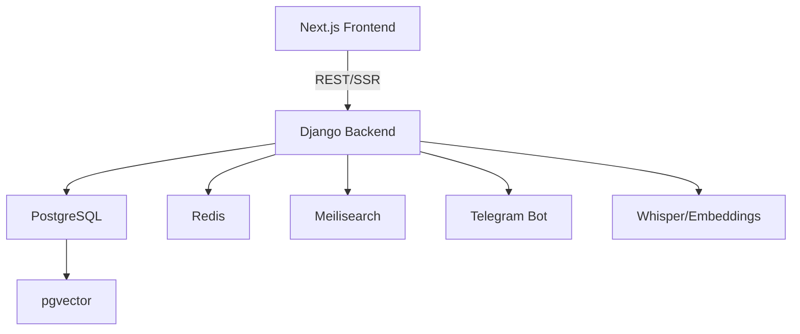
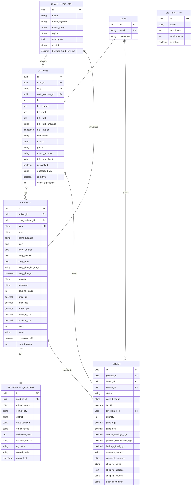
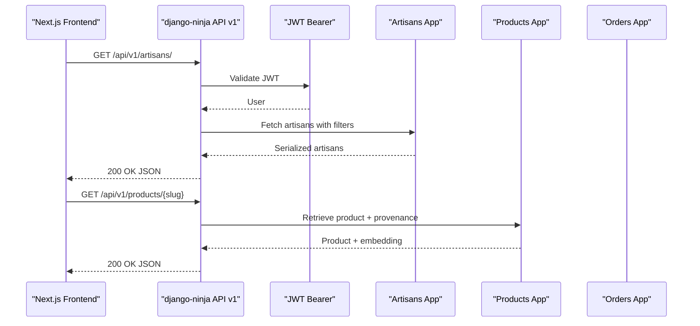
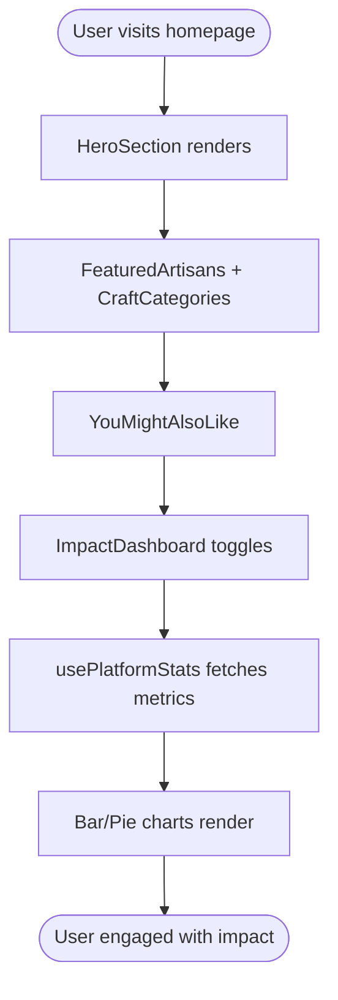
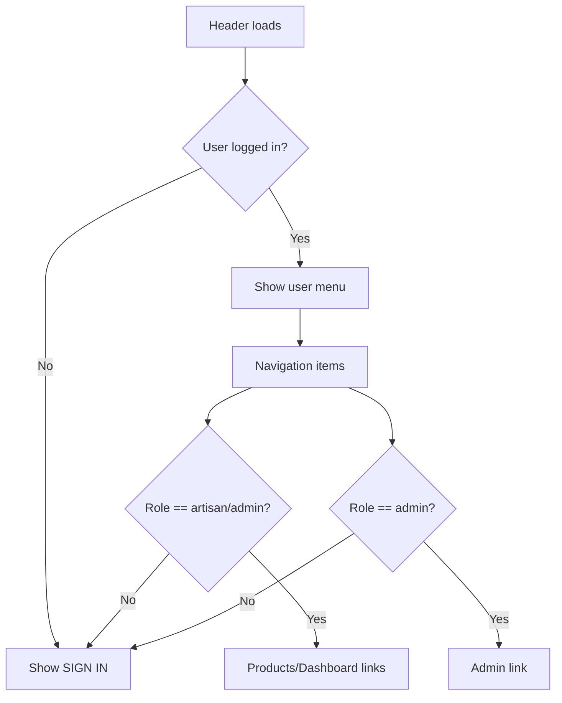
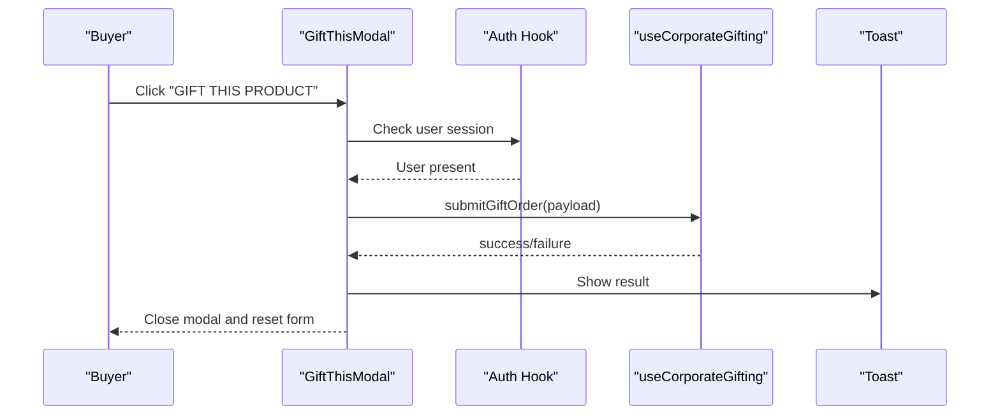
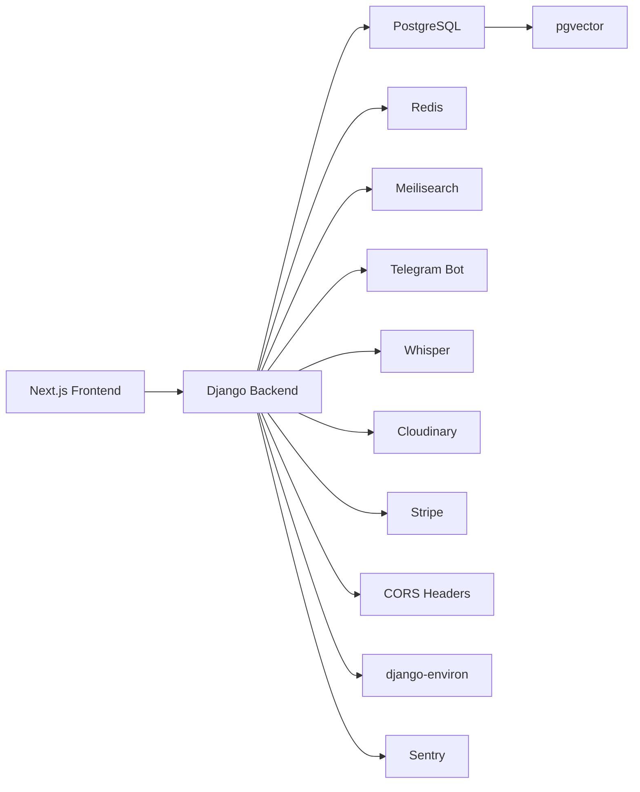

# Project Overview

<cite>
**Referenced Files in This Document**
- [README.md](file://README.md)
- [PROGRESS_REPORT.md](file://PROGRESS_REPORT.md)
- [backend/config/settings/base.py](file://backend/config/settings/base.py)
- [backend/requirements.txt](file://backend/requirements.txt)
- [package.json](file://package.json)
- [backend/api/v1/router.py](file://backend/api/v1/router.py)
- [backend/apps/artisans/models.py](file://backend/apps/artisans/models.py)
- [backend/apps/products/models.py](file://backend/apps/products/models.py)
- [backend/apps/orders/models.py](file://backend/apps/orders/models.py)
- [src/pages/Index.tsx](file://src/pages/Index.tsx)
- [src/components/sections/ImpactDashboard.tsx](file://src/components/sections/ImpactDashboard.tsx)
- [src/hooks/usePlatformStats.tsx](file://src/hooks/usePlatformStats.tsx)
- [src/components/layout/Header.tsx](file://src/components/layout/Header.tsx)
- [src/components/business/BusinessRegistration.tsx](file://src/components/business/BusinessRegistration.tsx)
- [src/components/gifting/GiftThisModal.tsx](file://src/components/gifting/GiftThisModal.tsx)
- [backend/apps/telegram_bot/__init__.py](file://backend/apps/telegram_bot/__init__.py)
- [backend/apps/ml/__init__.py](file://backend/apps/ml/__init__.py)
</cite>

## Table of Contents
1. [Introduction](#introduction)
2. [Project Structure](#project-structure)
3. [Core Components](#core-components)
4. [Architecture Overview](#architecture-overview)
5. [Detailed Component Analysis](#detailed-component-analysis)
6. [Dependency Analysis](#dependency-analysis)
7. [Performance Considerations](#performance-considerations)
8. [Troubleshooting Guide](#troubleshooting-guide)
9. [Conclusion](#conclusion)
10. [Appendices](#appendices)

## Introduction
Empindu is a production-grade artisan marketplace connecting traditional Ugandan craftspeople with conscious global consumers. Its mission is to preserve cultural heritage by anchoring each product to a craft tradition and artisan story, while enabling sustainable, transparent commerce with fair revenue distribution. The platform integrates a Django backend with a Next.js frontend, a Telegram bot layer, and AI/ML capabilities for voice transcription and semantic search.

Key value propositions:
- For buyers: Story-first product pages, direct artisan relationships, gift commerce, multilingual support, and international shipping.
- For artisans: Zero-cost onboarding via WhatsApp/Telegram, voice note biography transcription, professional digital presence, real-time earnings, and automated mobile money payouts.
- For platform operations: Branded admin panel, heritage fund tracking, impact analytics, and automated notifications.

## Project Structure
The repository follows a monorepo architecture with:
- Backend: Django 5 + django-ninja API, Unfold admin, PostgreSQL with pgvector, Redis, Celery, Meilisearch, and Telegram bot integration.
- Frontend: Next.js 14 App Router (SSR, PWA), shadcn/ui primitives, Radix UI, and Recharts for analytics.
- Infrastructure: Docker Compose for local services, Railway for backend, Vercel for frontend.
- Supabase functions and migrations support payment and notification workflows.

**Diagram sources**
- [backend/config/settings/base.py:29-64](file://backend/config/settings/base.py#L29-L64)
- [backend/api/v1/router.py:30-40](file://backend/api/v1/router.py#L30-L40)
- [backend/apps/artisans/models.py:14-170](file://backend/apps/artisans/models.py#L14-L170)
- [backend/apps/products/models.py:10-153](file://backend/apps/products/models.py#L10-L153)
- [backend/apps/orders/models.py:10-122](file://backend/apps/orders/models.py#L10-L122)
- [src/pages/Index.tsx:11-27](file://src/pages/Index.tsx#L11-L27)
- [src/components/sections/ImpactDashboard.tsx:48-367](file://src/components/sections/ImpactDashboard.tsx#L48-L367)

**Section sources**
- [README.md:3-49](file://README.md#L3-L49)
- [PROGRESS_REPORT.md:15-87](file://PROGRESS_REPORT.md#L15-L87)

## Core Components
- Django backend with Unfold admin and django-ninja API.
- Data models for artisans, products, orders, gifting, heritage, and ML/AI.
- Next.js frontend with SSR pages, analytics dashboard, and user-centric flows.
- Telegram bot app and ML app placeholders for future implementation.
- Supabase functions for payment and notification orchestration.

**Section sources**
- [backend/config/settings/base.py:29-64](file://backend/config/settings/base.py#L29-L64)
- [backend/requirements.txt:1-49](file://backend/requirements.txt#L1-L49)
- [package.json:14-67](file://package.json#L14-L67)
- [backend/apps/artisans/models.py:62-170](file://backend/apps/artisans/models.py#L62-L170)
- [backend/apps/products/models.py:10-153](file://backend/apps/products/models.py#L10-L153)
- [backend/apps/orders/models.py:10-122](file://backend/apps/orders/models.py#L10-L122)
- [src/components/sections/ImpactDashboard.tsx:48-367](file://src/components/sections/ImpactDashboard.tsx#L48-L367)

## Architecture Overview
Empindu’s architecture blends a modern full-stack approach with cultural IP anchoring:
- Backend: Django 5 with Unfold admin, ASGI for WebSockets, JWT-authenticated django-ninja endpoints, PostgreSQL + pgvector, Redis, Meilisearch, Celery, and Telegram bot.
- Frontend: Next.js 14 App Router with SSR/PWA, shadcn/ui components, and analytics dashboards powered by Supabase queries.
- Bot layer: Telegram bot app prepared for webhook handlers and AI transcription workflows.
- ML/AI: Whisper and embeddings integrated for voice transcription and semantic search.

**Diagram sources**
- [README.md:5-15](file://README.md#L5-L15)
- [backend/config/settings/base.py:100-121](file://backend/config/settings/base.py#L100-L121)
- [backend/requirements.txt:21-24](file://backend/requirements.txt#L21-L24)
- [backend/apps/telegram_bot/__init__.py:1-2](file://backend/apps/telegram_bot/__init__.py#L1-L2)
- [backend/apps/ml/__init__.py:1-2](file://backend/apps/ml/__init__.py#L1-L2)

**Section sources**
- [README.md:5-15](file://README.md#L5-L15)
- [PROGRESS_REPORT.md:93-116](file://PROGRESS_REPORT.md#L93-L116)

## Detailed Component Analysis

### Data Model Layer
The data models implement a story-first, heritage-anchored architecture:
- Artisan model captures identity, craft tradition, certifications, multilingual biographies, and voice draft fields for AI transcription.
- Product model emphasizes storytelling, revenue split, provenance records, and embedding vectors for semantic search.
- Order model tracks lifecycle, frozen financial snapshots, gift orders, and payout statuses.

**Diagram sources**
- [backend/apps/artisans/models.py:62-170](file://backend/apps/artisans/models.py#L62-L170)
- [backend/apps/products/models.py:10-153](file://backend/apps/products/models.py#L10-L153)
- [backend/apps/orders/models.py:10-122](file://backend/apps/orders/models.py#L10-L122)

**Section sources**
- [backend/apps/artisans/models.py:14-170](file://backend/apps/artisans/models.py#L14-L170)
- [backend/apps/products/models.py:10-153](file://backend/apps/products/models.py#L10-L153)
- [backend/apps/orders/models.py:10-122](file://backend/apps/orders/models.py#L10-L122)

### API Layer and Authentication
The API uses django-ninja with JWT authentication and CORS support. It exposes routes for artisans, products, orders, and gifting, with typed schemas and OpenAPI documentation.

**Diagram sources**
- [backend/api/v1/router.py:10-40](file://backend/api/v1/router.py#L10-L40)
- [backend/config/settings/base.py:160-167](file://backend/config/settings/base.py#L160-L167)

**Section sources**
- [backend/api/v1/router.py:22-40](file://backend/api/v1/router.py#L22-L40)
- [backend/config/settings/base.py:172-176](file://backend/config/settings/base.py#L172-L176)

### Frontend Experience and Impact Dashboard
The frontend delivers a story-driven marketplace with SSR pages, navigation, and an impact dashboard that visualizes platform metrics using Supabase data and Recharts.

**Diagram sources**
- [src/pages/Index.tsx:11-27](file://src/pages/Index.tsx#L11-L27)
- [src/components/sections/ImpactDashboard.tsx:48-367](file://src/components/sections/ImpactDashboard.tsx#L48-L367)
- [src/hooks/usePlatformStats.tsx:17-94](file://src/hooks/usePlatformStats.tsx#L17-L94)

**Section sources**
- [src/pages/Index.tsx:11-27](file://src/pages/Index.tsx#L11-L27)
- [src/components/sections/ImpactDashboard.tsx:48-367](file://src/components/sections/ImpactDashboard.tsx#L48-L367)
- [src/hooks/usePlatformStats.tsx:17-94](file://src/hooks/usePlatformStats.tsx#L17-L94)

### User Roles and Navigation
The header adapts to user roles (buyer, artisan, admin) and provides contextual navigation and actions.

**Diagram sources**
- [src/components/layout/Header.tsx:26-275](file://src/components/layout/Header.tsx#L26-L275)

**Section sources**
- [src/components/layout/Header.tsx:26-275](file://src/components/layout/Header.tsx#L26-L275)

### Gift Commerce Flow
The gift modal enables corporate/gifting purchases with sender/recipient details and personalized messages.

**Diagram sources**
- [src/components/gifting/GiftThisModal.tsx:23-208](file://src/components/gifting/GiftThisModal.tsx#L23-L208)

**Section sources**
- [src/components/gifting/GiftThisModal.tsx:23-208](file://src/components/gifting/GiftThisModal.tsx#L23-L208)

### Business Registration for Artisans
Artisans can register business profiles for gift commerce and operational needs.

**Section sources**
- [src/components/business/BusinessRegistration.tsx:30-205](file://src/components/business/BusinessRegistration.tsx#L30-L205)

## Dependency Analysis
Technology stack summary:
- Backend: Django 5, django-ninja, Unfold admin, PostgreSQL + pgvector, Redis, Celery, Meilisearch, python-telegram-bot, OpenAI Whisper, Cloudinary, Stripe, django-cors-headers, django-environ, Sentry.
- Frontend: Next.js 14, shadcn/ui, Radix UI, Recharts, Framer Motion, Zustand, TanStack Query, Supabase JS.

**Diagram sources**
- [backend/requirements.txt:1-49](file://backend/requirements.txt#L1-L49)
- [package.json:14-67](file://package.json#L14-L67)

**Section sources**
- [backend/requirements.txt:1-49](file://backend/requirements.txt#L1-L49)
- [package.json:14-67](file://package.json#L14-L67)

## Performance Considerations
- Use pgvector for semantic search to reduce latency and simplify deployment.
- Leverage Redis for caching and Celery for asynchronous tasks.
- Employ SSR and ISR patterns in Next.js to optimize initial load and freshness.
- Monitor API performance and enable rate limiting and Sentry error tracking in production.

[No sources needed since this section provides general guidance]

## Troubleshooting Guide
Common setup and runtime issues:
- Environment variables: Ensure .env files are created in both backend and frontend directories with required keys for database, Redis, Cloudinary, Stripe, Telegram, and OpenAI.
- CORS: Verify allowed origins match frontend URLs.
- Database migrations: Run migrations after starting infrastructure services.
- Telegram webhook: Secure webhook endpoint with secret token and configure site URL.
- Redis connectivity: Confirm Redis URL is reachable by Django and Celery.

**Section sources**
- [README.md:109-152](file://README.md#L109-L152)
- [backend/config/settings/base.py:160-167](file://backend/config/settings/base.py#L160-L167)
- [backend/config/settings/base.py:108-121](file://backend/config/settings/base.py#L108-L121)

## Conclusion
Empindu is building a culturally grounded, technically robust artisan marketplace. Its architecture balances scalability and heritage preservation, integrating AI/ML, multilingual support, and a seamless buyer-artisan experience. The roadmap outlines clear milestones for frontend migration, bot and payment integrations, and advanced features, positioning Empindu for sustainable growth and impact.

[No sources needed since this section summarizes without analyzing specific files]

## Appendices

### Technology Stack Summary
- Backend: Django 5, django-ninja, Unfold, PostgreSQL + pgvector, Redis, Celery, Meilisearch, python-telegram-bot, OpenAI Whisper, Cloudinary, Stripe, Sentry.
- Frontend: Next.js 14, shadcn/ui, Radix UI, Recharts, Framer Motion, TanStack Query, Supabase JS.

**Section sources**
- [README.md:5-15](file://README.md#L5-L15)
- [backend/requirements.txt:1-49](file://backend/requirements.txt#L1-L49)
- [package.json:14-67](file://package.json#L14-L67)

### Deployment Strategy
- Backend: Railway with Procfile and railway.toml.
- Frontend: Vercel deployment.
- Infrastructure: Docker Compose for local services.

**Section sources**
- [README.md:179-203](file://README.md#L179-L203)
- [PROGRESS_REPORT.md:273-290](file://PROGRESS_REPORT.md#L273-L290)

### Business Impact Metrics
- Artisan metrics: Onboarded artisans, average earnings increase, voice onboarding completion, profile view to first listing conversion.
- Buyer metrics: Homepage to product page conversion, product page to cart conversion, cart to checkout completion, diaspora vs local split, gift flow usage.
- Platform metrics: Total transactions, heritage fund contributions, average order value, repeat purchase rate, NPS.

**Section sources**
- [PROGRESS_REPORT.md:395-416](file://PROGRESS_REPORT.md#L395-L416)