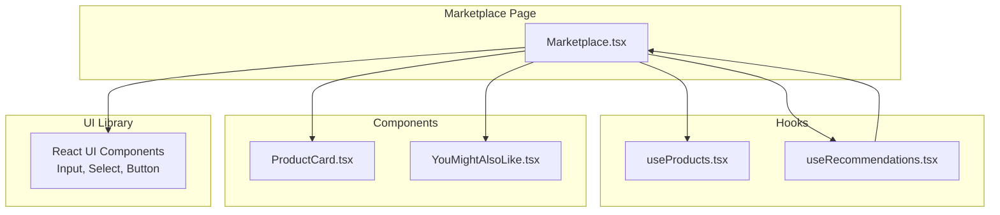
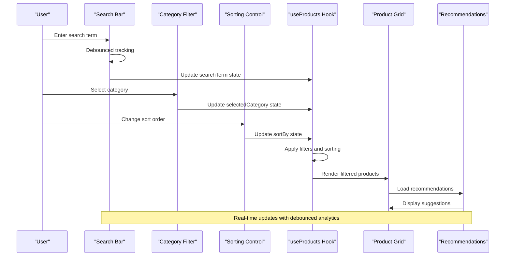
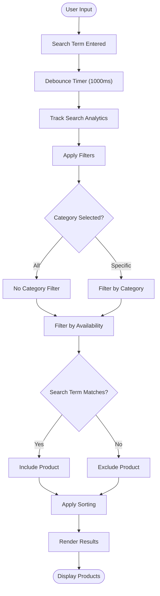
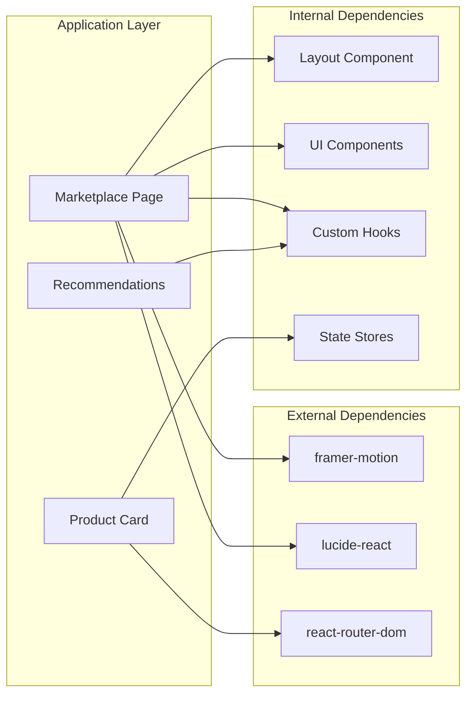

# Marketplace Search Interface

<cite>
**Referenced Files in This Document**
- [Marketplace.tsx](file://apps/web/src/pages/Marketplace.tsx)
- [useProducts.tsx](file://apps/web/src/hooks/useProducts.tsx)
- [ProductCard.tsx](file://apps/web/src/components/products/ProductCard.tsx)
- [useRecommendations.tsx](file://apps/web/src/hooks/useRecommendations.tsx)
- [YouMightAlsoLike.tsx](file://apps/web/src/components/recommendations/YouMightAlsoLike.tsx)
</cite>

## Table of Contents
1. [Introduction](#introduction)
2. [Project Structure](#project-structure)
3. [Core Components](#core-components)
4. [Architecture Overview](#architecture-overview)
5. [Detailed Component Analysis](#detailed-component-analysis)
6. [Dependency Analysis](#dependency-analysis)
7. [Performance Considerations](#performance-considerations)
8. [Accessibility Features](#accessibility-features)
9. [Mobile Optimization](#mobile-optimization)
10. [Troubleshooting Guide](#troubleshooting-guide)
11. [Conclusion](#conclusion)

## Introduction
This document provides comprehensive documentation for the marketplace search user interface and interaction patterns. It covers the search bar implementation, filtering mechanisms, result presentation, and integration with recommendation systems. The analysis focuses on the frontend components and hooks that power the marketplace search experience, including search term handling, category filtering, sorting options, and responsive design considerations.

## Project Structure
The marketplace search interface is implemented primarily in the Marketplace page component with supporting hooks and components:

**Diagram sources**
- [Marketplace.tsx:19-202](file://apps/web/src/pages/Marketplace.tsx#L19-L202)
- [useProducts.tsx:67-115](file://apps/web/src/hooks/useProducts.tsx#L67-L115)
- [useRecommendations.tsx:6-182](file://apps/web/src/hooks/useRecommendations.tsx#L6-L182)
- [ProductCard.tsx:30-396](file://apps/web/src/components/products/ProductCard.tsx#L30-L396)
- [YouMightAlsoLike.tsx:12-49](file://apps/web/src/components/recommendations/YouMightAlsoLike.tsx#L12-L49)

**Section sources**
- [Marketplace.tsx:1-202](file://apps/web/src/pages/Marketplace.tsx#L1-L202)
- [useProducts.tsx:1-135](file://apps/web/src/hooks/useProducts.tsx#L1-L135)
- [useRecommendations.tsx:1-183](file://apps/web/src/hooks/useRecommendations.tsx#L1-L183)
- [ProductCard.tsx:1-396](file://apps/web/src/components/products/ProductCard.tsx#L1-L396)
- [YouMightAlsoLike.tsx:1-50](file://apps/web/src/components/recommendations/YouMightAlsoLike.tsx#L1-L50)

## Core Components
The marketplace search interface consists of several interconnected components that work together to provide a seamless search and discovery experience:

### Search Bar Implementation
The search bar is implemented as a styled input field with integrated search icon positioning and responsive design. It captures user input and triggers debounced search tracking for analytics purposes.

### Filtering System
The filtering system includes category selection via dropdown and product availability filtering. The implementation uses client-side filtering with logical AND conditions between search term, category, and availability status.

### Sorting Options
Products can be sorted by newest arrival, price low to high, or price high to low. The sorting algorithm handles date comparisons for newest items and numeric comparisons for price-based sorting.

### Recommendation Integration
The interface integrates with a recommendation system that tracks search terms and user interactions to provide personalized product suggestions.

**Section sources**
- [Marketplace.tsx:26-55](file://apps/web/src/pages/Marketplace.tsx#L26-L55)
- [useProducts.tsx:117-128](file://apps/web/src/hooks/useProducts.tsx#L117-L128)
- [useRecommendations.tsx:23-34](file://apps/web/src/hooks/useRecommendations.tsx#L23-L34)

## Architecture Overview
The marketplace search interface follows a unidirectional data flow pattern with clear separation of concerns:

**Diagram sources**
- [Marketplace.tsx:19-55](file://apps/web/src/pages/Marketplace.tsx#L19-L55)
- [useProducts.tsx:67-115](file://apps/web/src/hooks/useProducts.tsx#L67-L115)
- [useRecommendations.tsx:6-182](file://apps/web/src/hooks/useRecommendations.tsx#L6-L182)

## Detailed Component Analysis

### Marketplace Page Component
The main marketplace page orchestrates the entire search experience with integrated state management and UI rendering.

#### Search Functionality
The search implementation uses a debounced approach to balance user experience with analytics tracking. The system only triggers search tracking after the user has stopped typing for a specified duration.

#### Filtering Logic
The filtering system applies three criteria:
1. Search term matching against product name, description, and artisan name
2. Category selection with "all" as default
3. Product availability status

#### Sorting Implementation
The sorting system supports three modes with appropriate comparison algorithms for each data type.

**Diagram sources**
- [Marketplace.tsx:26-55](file://apps/web/src/pages/Marketplace.tsx#L26-L55)

**Section sources**
- [Marketplace.tsx:19-202](file://apps/web/src/pages/Marketplace.tsx#L19-L202)

### Product Data Management Hook
The `useProducts` hook manages product data fetching, caching, and state updates with comprehensive error handling and loading states.

#### Data Structure
The hook defines comprehensive TypeScript interfaces for product data, including artisan information, provenance details, and image metadata.

#### API Integration
The hook integrates with the backend API through dedicated functions for product retrieval and individual product lookup.

#### Category Management
The hook exports predefined product categories and size classifications for consistent filtering across the application.

**Section sources**
- [useProducts.tsx:67-115](file://apps/web/src/hooks/useProducts.tsx#L67-L115)
- [useProducts.tsx:117-135](file://apps/web/src/hooks/useProducts.tsx#L117-L135)

### Product Card Component
The Product Card component provides a comprehensive display of product information with interactive elements and responsive design.

#### Image Gallery
The component implements an interactive image gallery with navigation controls and thumbnail support for products with multiple images.

#### Feature Badges
Visual indicators show product features like returnability, personalization options, and availability status.

#### Mobile Responsiveness
The component adapts its layout and interactions for mobile devices while maintaining functionality.

**Section sources**
- [ProductCard.tsx:30-396](file://apps/web/src/components/products/ProductCard.tsx#L30-L396)

### Recommendation System Integration
The recommendation system tracks user interactions and search behavior to provide personalized product suggestions.

#### Analytics Tracking
The system tracks search queries with user identification and category associations for analytics purposes.

#### Scoring Algorithm
The recommendation engine uses a weighted scoring system based on user history, category preferences, and product characteristics.

#### Supabase Integration
The system integrates with Supabase for data persistence and retrieval of user interaction data.

**Section sources**
- [useRecommendations.tsx:6-182](file://apps/web/src/hooks/useRecommendations.tsx#L6-L182)

## Dependency Analysis
The marketplace search interface has well-defined dependencies that promote maintainability and testability:

**Diagram sources**
- [Marketplace.tsx:1-18](file://apps/web/src/pages/Marketplace.tsx#L1-L18)
- [ProductCard.tsx:1-17](file://apps/web/src/components/products/ProductCard.tsx#L1-L17)

The dependency structure shows clear separation between UI components, business logic, and external integrations, enabling modular development and testing.

**Section sources**
- [Marketplace.tsx:1-202](file://apps/web/src/pages/Marketplace.tsx#L1-L202)
- [ProductCard.tsx:1-396](file://apps/web/src/components/products/ProductCard.tsx#L1-L396)

## Performance Considerations
The marketplace search interface implements several performance optimization strategies:

### Debouncing Strategy
Search tracking is debounced for 1000 milliseconds to reduce server load and improve user experience during rapid typing.

### Client-Side Filtering
Product filtering occurs on the client side after initial data loading, reducing API calls and providing instant feedback.

### Loading States
Comprehensive loading states prevent unnecessary re-renders and provide user feedback during data operations.

### Memoization Opportunities
The current implementation could benefit from React.memo for ProductCard components and useMemo for filtered product calculations.

## Accessibility Features
The marketplace search interface incorporates several accessibility best practices:

### Keyboard Navigation
- Focus management for interactive elements
- Tab order preservation in filter controls
- Keyboard operability for all interactive components

### Screen Reader Support
- Proper ARIA labels for interactive elements
- Semantic HTML structure
- Descriptive alt text for images

### Color Contrast
- Sufficient color contrast ratios for text and backgrounds
- High visibility focus states
- Clear visual indicators for interactive elements

### Responsive Design
- Touch-friendly target sizes for mobile devices
- Appropriate spacing for different screen sizes
- Flexible layouts that adapt to various viewport sizes

## Mobile Optimization
The interface is designed with mobile-first principles:

### Responsive Layout
- Flexible grid system for product display
- Adaptive typography scales
- Mobile-optimized touch targets

### Performance on Mobile
- Optimized image loading and lazy loading
- Reduced JavaScript bundle size
- Efficient event handling for mobile devices

### Touch Interactions
- Large tap areas for buttons and controls
- Gesture-friendly navigation
- Mobile-specific UI adaptations

## Troubleshooting Guide
Common issues and their solutions:

### Search Not Working
- Verify that the search term length threshold is met
- Check that the debouncing timer is properly configured
- Ensure that the trackSearch function has proper user authentication

### Filter Not Applying
- Confirm that category values match the predefined categories
- Verify that product availability filtering is working correctly
- Check for case sensitivity issues in search matching

### Performance Issues
- Monitor debounce timing for optimal user experience
- Consider implementing virtual scrolling for large product lists
- Optimize image loading and caching strategies

### State Management Problems
- Ensure proper cleanup of timers in search handlers
- Verify that state updates are batched appropriately
- Check for memory leaks in recommendation tracking

**Section sources**
- [Marketplace.tsx:26-33](file://apps/web/src/pages/Marketplace.tsx#L26-L33)
- [useProducts.tsx:84-92](file://apps/web/src/hooks/useProducts.tsx#L84-L92)
- [useRecommendations.tsx:18-34](file://apps/web/src/hooks/useRecommendations.tsx#L18-L34)

## Conclusion
The marketplace search interface demonstrates a well-architected solution that balances user experience with technical efficiency. The implementation successfully combines client-side filtering, debounced analytics, and responsive design principles to create an intuitive search experience. The modular component structure and clear separation of concerns enable easy maintenance and future enhancements. Key strengths include the thoughtful debouncing strategy, comprehensive filtering capabilities, and integration with the recommendation system. Areas for potential improvement include implementing virtual scrolling for large datasets and adding more sophisticated autocomplete functionality.