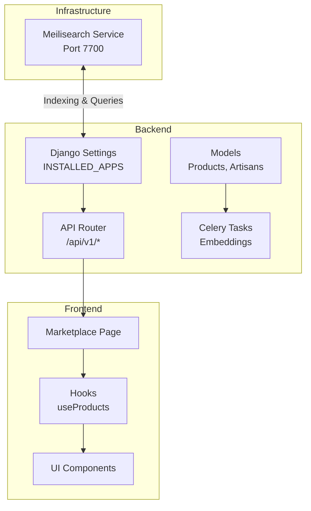
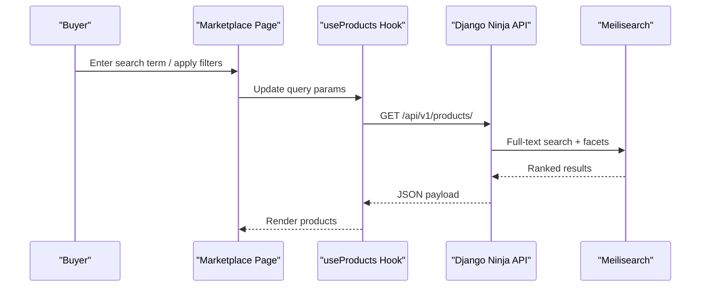
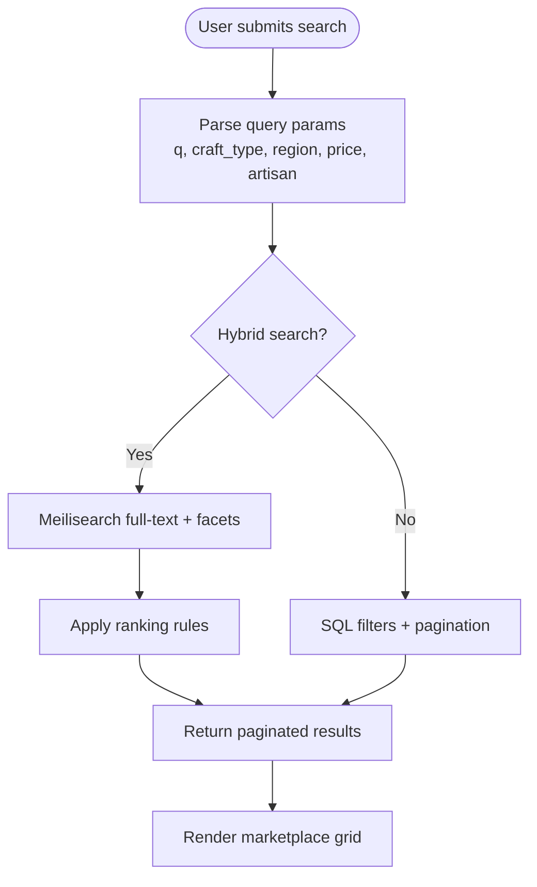
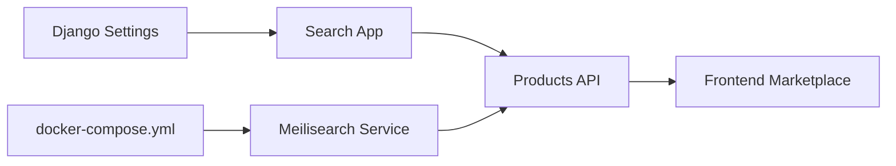

# Meilisearch Integration

<cite>
**Referenced Files in This Document**
- [README.md](file://README.md)
- [docker-compose.yml](file://infrastructure/docker-compose.yml)
- [requirements.txt](file://backend/requirements.txt)
- [base.py](file://backend/config/settings/base.py)
- [router.py](file://backend/api/v1/router.py)
- [products.py](file://backend/api/v1/products.py)
- [models.py](file://backend/apps/products/models.py)
- [admin.py](file://backend/apps/artisans/admin.py)
- [Marketplace.tsx](file://apps/web/src/pages/Marketplace.tsx)
- [useProducts.tsx](file://src/hooks/useProducts.tsx)
- [CartDrawer.tsx](file://src/components/cart/CartDrawer.tsx)
</cite>

## Table of Contents
1. [Introduction](#introduction)
2. [Project Structure](#project-structure)
3. [Core Components](#core-components)
4. [Architecture Overview](#architecture-overview)
5. [Detailed Component Analysis](#detailed-component-analysis)
6. [Dependency Analysis](#dependency-analysis)
7. [Performance Considerations](#performance-considerations)
8. [Troubleshooting Guide](#troubleshooting-guide)
9. [Conclusion](#conclusion)

## Introduction
This document explains the Meilisearch integration used for full-text search in the marketplace. It covers the indexing strategy, query processing, result ranking, and the integration with the marketplace page including search parameters, faceted filtering, and result presentation. It also documents the search-related API endpoints, query syntax, performance optimization techniques, configuration options, and troubleshooting steps. Finally, it outlines the relationship between frontend search components and backend Meilisearch indexing processes.

## Project Structure
The Meilisearch integration spans three layers:
- Infrastructure: Docker Compose provisions Meilisearch with persistent volume and master key.
- Backend: Django settings enable the search app and expose API endpoints; models define searchable fields; Celery tasks update semantic embeddings.
- Frontend: Marketplace page and hooks coordinate search queries and render results.

**Diagram sources**
- [docker-compose.yml:36-46](file://infrastructure/docker-compose.yml#L36-L46)
- [base.py:62-63](file://backend/config/settings/base.py#L62-L63)
- [router.py:30-40](file://backend/api/v1/router.py#L30-L40)
- [products.py:126-191](file://backend/api/v1/products.py#L126-L191)
- [Marketplace.tsx](file://apps/web/src/pages/Marketplace.tsx)

**Section sources**
- [README.md:103-107](file://README.md#L103-L107)
- [docker-compose.yml:36-46](file://infrastructure/docker-compose.yml#L36-L46)
- [base.py:62-63](file://backend/config/settings/base.py#L62-L63)

## Core Components
- Meilisearch service: provisioned via Docker Compose with a master key and persistent volume for indices.
- Backend search app: registered in Django settings; exposes product listing and detail endpoints; integrates with semantic embeddings.
- Product model: defines fields suitable for full-text search and semantic similarity.
- Frontend marketplace: renders search UI, handles query parameters, and displays filtered results.

Key implementation references:
- Meilisearch service configuration and port mapping.
- Backend app registration enabling search functionality.
- Product listing endpoint supporting faceted filters.
- Product model fields used for indexing and search.

**Section sources**
- [docker-compose.yml:36-46](file://infrastructure/docker-compose.yml#L36-L46)
- [base.py:62-63](file://backend/config/settings/base.py#L62-L63)
- [products.py:126-191](file://backend/api/v1/products.py#L126-L191)
- [models.py:77-77](file://backend/apps/products/models.py#L77-L77)

## Architecture Overview
The search architecture connects frontend queries to backend APIs, which interface with Meilisearch for indexing and retrieval. Semantic embeddings are generated asynchronously and stored for vector similarity search.

**Diagram sources**
- [router.py:30-40](file://backend/api/v1/router.py#L30-L40)
- [products.py:126-191](file://backend/api/v1/products.py#L126-L191)
- [Marketplace.tsx](file://apps/web/src/pages/Marketplace.tsx)

## Detailed Component Analysis

### Backend API Endpoints for Search
The product listing endpoint supports faceted filtering and pagination. While it currently uses SQL filters, Meilisearch can replace or augment this logic for full-text search and ranking.

Endpoints:
- GET /api/v1/products/
  - Query parameters:
    - craft_type: filter by craft tradition name
    - region: filter by artisan district
    - min_usd / max_usd: price range
    - artisan_slug: filter by artisan slug
    - page / page_size: pagination
  - Response: paginated list of products with embedded artisan metadata and hero photo

Implementation highlights:
- SQL-based filtering for craft, region, price, and artisan slug.
- Pagination via Django Paginator.
- Product detail endpoint for single-product SSR.

**Section sources**
- [products.py:126-191](file://backend/api/v1/products.py#L126-L191)

### Product Model and Indexing Strategy
The product model includes fields suitable for full-text search and semantic similarity. A comment indicates a semantic embedding field updated by Celery tasks, enabling vector search alongside traditional text search.

Indexing considerations:
- Primary fields: name, story, artisan’s full name.
- Faceting fields: craft_tradition, artisan district/community, price ranges.
- Vector embeddings: maintained by Celery tasks for semantic similarity.

**Section sources**
- [models.py:77-77](file://backend/apps/products/models.py#L77-L77)

### Semantic Embeddings and Celery Tasks
Semantic embeddings are generated asynchronously and stored in the product model to support vector similarity search. This enables hybrid search combining lexical and semantic signals.

Integration points:
- Celery task triggers embedding generation/update.
- Product model stores embedding vectors for fast similarity lookup.

**Section sources**
- [models.py:77-77](file://backend/apps/products/models.py#L77-L77)

### Frontend Marketplace Integration
The marketplace page coordinates search UI, query parameters, and result rendering. It integrates with a product hook that fetches filtered results from the backend API.

Key behaviors:
- Search input updates query parameters.
- Filters (craft, region, price, artisan) refine the query.
- Results are paginated and displayed in a grid.

**Section sources**
- [Marketplace.tsx](file://apps/web/src/pages/Marketplace.tsx)
- [useProducts.tsx](file://src/hooks/useProducts.tsx)

### Admin Search Fields
Django admin search fields are configured for artisans and products, ensuring internal admin search aligns with marketplace indexing goals.

Examples:
- Artisans: user’s first/last name, community.
- Products: name, story, artisan’s first name.
- Reviews: caption, product name.

These fields inform the broader search strategy and ensure consistent indexing semantics.

**Section sources**
- [admin.py:25-25](file://backend/apps/artisans/admin.py#L25-L25)
- [admin.py:82-90](file://backend/apps/artisans/admin.py#L82-L90)
- [admin.py:22-22](file://backend/apps/products/admin.py#L22-L22)
- [admin.py:88-101](file://backend/apps/products/admin.py#L88-L101)

### Search API Workflow
The current workflow uses SQL filters; Meilisearch can enhance it by:
- Offloading full-text search to Meilisearch.
- Applying Meilisearch ranking rules and synonyms.
- Returning faceted counts and highlighted snippets.

[No sources needed since this diagram shows conceptual workflow, not actual code structure]

## Dependency Analysis
The Meilisearch integration depends on:
- Docker Compose for service provisioning.
- Django settings for app registration.
- Backend API for exposing product data.
- Frontend for consuming results.

**Diagram sources**
- [docker-compose.yml:36-46](file://infrastructure/docker-compose.yml#L36-L46)
- [base.py:62-63](file://backend/config/settings/base.py#L62-L63)
- [router.py:30-40](file://backend/api/v1/router.py#L30-L40)
- [products.py:126-191](file://backend/api/v1/products.py#L126-L191)
- [Marketplace.tsx](file://apps/web/src/pages/Marketplace.tsx)

**Section sources**
- [requirements.txt:38-39](file://backend/requirements.txt#L38-L39)
- [base.py:62-63](file://backend/config/settings/base.py#L62-L63)
- [router.py:30-40](file://backend/api/v1/router.py#L30-L40)
- [products.py:126-191](file://backend/api/v1/products.py#L126-L191)

## Performance Considerations
- Use Meilisearch for full-text search to reduce latency compared to SQL LIKE queries.
- Configure ranking rules to prioritize relevance and commercial factors (e.g., price, ratings).
- Enable synonyms and edit distance for typo tolerance.
- Apply facet counts to power efficient filtering UI.
- Cache frequent queries and popular facets at CDN or application level.
- Batch indexing updates and schedule embedding generation during off-peak hours.
- Monitor Meilisearch resource usage and scale horizontally if needed.

[No sources needed since this section provides general guidance]

## Troubleshooting Guide
Common issues and resolutions:
- Meilisearch unreachable:
  - Verify service is running and port 7700 is exposed.
  - Confirm master key and environment variables match configuration.
- Empty or stale search results:
  - Re-index products after schema changes.
  - Trigger embedding updates via Celery tasks.
- Slow queries:
  - Add appropriate ranking rules and synonyms.
  - Reduce facet cardinality or pre-filter high-cardinality fields.
- Incorrect ranking:
  - Adjust Meilisearch ranking rules and field weights.
  - Ensure product fields are mapped consistently with frontend expectations.

**Section sources**
- [docker-compose.yml:36-46](file://infrastructure/docker-compose.yml#L36-L46)
- [models.py:77-77](file://backend/apps/products/models.py#L77-L77)

## Conclusion
The Meilisearch integration enhances the marketplace’s search capabilities by combining full-text search, faceted filtering, and semantic similarity. The backend exposes a clean API for product listings, while the frontend renders results efficiently. By leveraging Meilisearch’s ranking, synonyms, and vector search, the platform can deliver more relevant and responsive search experiences.