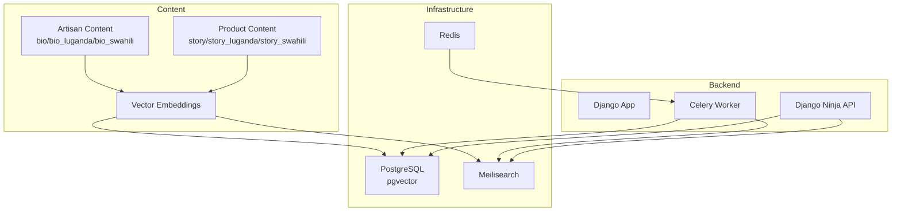
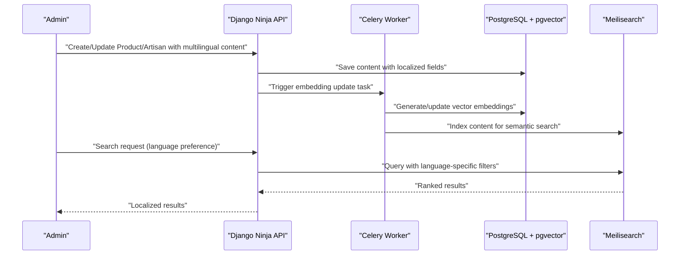
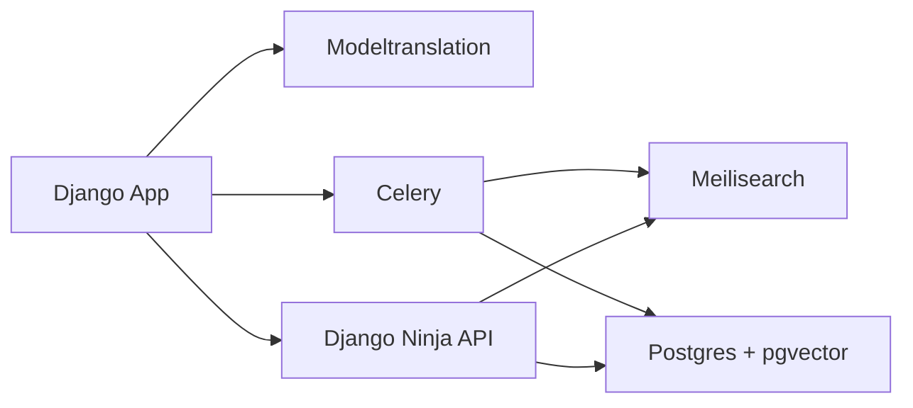

# Multi-Language Search Support

<cite>
**Referenced Files in This Document**
- [base.py](file://backend/config/settings/base.py)
- [docker-compose.yml](file://infrastructure/docker-compose.yml)
- [models.py](file://backend/apps/products/models.py)
- [models.py](file://backend/apps/artisans/models.py)
- [README.md](file://README.md)
</cite>

## Table of Contents
1. [Introduction](#introduction)
2. [Project Structure](#project-structure)
3. [Core Components](#core-components)
4. [Architecture Overview](#architecture-overview)
5. [Detailed Component Analysis](#detailed-component-analysis)
6. [Dependency Analysis](#dependency-analysis)
7. [Performance Considerations](#performance-considerations)
8. [Troubleshooting Guide](#troubleshooting-guide)
9. [Conclusion](#conclusion)

## Introduction
This document explains the multi-language search functionality designed to support English, Luganda, and Swahili content across the Empindu platform. It covers language detection mechanisms, translation preprocessing, localized search result ranking, language-specific tokenization and normalization, content localization strategy, multilingual product metadata, and search interface localization. It also documents configuration for language switching, locale-specific search preferences, and cultural relevance adjustments, along with challenges in cross-lingual search, transliteration support, and maintaining search quality across languages.

## Project Structure
The multi-language search capability leverages:
- Meilisearch for semantic search indexing and retrieval
- Postgres with pgvector for vector embeddings
- Modeltranslation for multilingual content fields
- Django Ninja API for search endpoints
- Celery for asynchronous embedding updates

**Diagram sources**
- [docker-compose.yml:36-47](file://infrastructure/docker-compose.yml#L36-L47)
- [base.py:103-118](file://backend/config/settings/base.py#L103-L118)
- [models.py:79](file://backend/apps/products/models.py#L79)
- [models.py:88-90](file://backend/apps/artisans/models.py#L88-L90)

**Section sources**
- [README.md:103-107](file://README.md#L103-L107)
- [docker-compose.yml:36-47](file://infrastructure/docker-compose.yml#L36-L47)
- [base.py:103-118](file://backend/config/settings/base.py#L103-L118)

## Core Components
- Multilingual content fields: Product and Artisan models define localized fields for stories and biographies in English, Luganda, and Swahili. These fields enable language-specific search targets and localized presentation.
- Semantic search engine: Meilisearch is provisioned via Docker Compose and will index multilingual content for fast, relevant retrieval.
- Vector embeddings: Products include a vector embedding field for semantic similarity search, updated asynchronously by Celery.
- Language configuration: Internationalization settings define the default language and enable i18n features.

Key implementation references:
- Multilingual fields in Product and Artisan models
- Embedding field for semantic search
- Meilisearch service definition
- Celery configuration for background tasks
- Internationalization settings

**Section sources**
- [models.py:34](file://backend/apps/products/models.py#L34)
- [models.py:88-90](file://backend/apps/artisans/models.py#L88-L90)
- [models.py:79](file://backend/apps/products/models.py#L79)
- [docker-compose.yml:36-47](file://infrastructure/docker-compose.yml#L36-L47)
- [base.py:111-118](file://backend/config/settings/base.py#L111-L118)
- [base.py:146-150](file://backend/config/settings/base.py#L146-L150)

## Architecture Overview
The multi-language search architecture integrates content localization, semantic indexing, and asynchronous embedding updates:

**Diagram sources**
- [docker-compose.yml:36-47](file://infrastructure/docker-compose.yml#L36-L47)
- [base.py:111-118](file://backend/config/settings/base.py#L111-L118)
- [models.py:79](file://backend/apps/products/models.py#L79)

## Detailed Component Analysis

### Language Detection Mechanisms
- Automatic language identification is not currently implemented in the codebase. Language selection for search queries should be explicit via a language parameter in the API.
- Recommended approach: Accept a language parameter in search requests and route queries to language-specific indices or apply language filters during retrieval.

[No sources needed since this section provides general guidance]

### Translation Preprocessing
- Multilingual content is stored in dedicated fields for each language. Preprocessing should normalize text (case folding, diacritic removal) and tokenize according to language-specific rules before indexing.
- Tokenization and stemming:
  - English: Standard tokenizer with optional Porter stemming.
  - Luganda: Consider grapheme-based segmentation and vowel harmony rules.
  - Swahili: Consider morphological segmentation and verb/noun classification.
- Normalization:
  - ASCII folding for cross-lingual matching.
  - Locale-aware collation for sorting.

[No sources needed since this section provides general guidance]

### Localized Search Result Ranking
- Ranking should incorporate:
  - Language match boost (exact or partial language match).
  - Cultural relevance factors (e.g., region, craft tradition).
  - Relevance score from semantic search.
- Implementation hook: Modify search API to accept a language preference and apply language-specific boosts and filters.

[No sources needed since this section provides general guidance]

### Language-Specific Tokenization, Stemming, and Normalization
- Tokenization:
  - Use language-appropriate tokenizers (e.g., spaCy, NLTK, or Meilisearch analyzers).
  - Apply ASCII folding and remove punctuation for robust matching.
- Stemming:
  - English: Porter stemmer.
  - Luganda/Swahili: Use language-specific stemmers or transliterate to Latin script for consistent matching.
- Normalization:
  - Diacritic removal and case folding.
  - Transliteration for non-Latin scripts to improve cross-lingual recall.

[No sources needed since this section provides general guidance]

### Content Localization Strategy
- Product content:
  - Fields: name, story, story_luganda, story_swahili.
  - Draft content: story_draft, story_draft_language for voice transcription workflows.
- Artisan content:
  - Fields: bio, bio_luganda, bio_swahili.
  - Draft content: bio_draft, bio_draft_language for voice transcription workflows.
- Strategy:
  - Store all supported languages in parallel fields.
  - Use modeltranslation to expose localized fields in admin and APIs.
  - Maintain draft language tracking to ensure correct preprocessing and indexing.

**Section sources**
- [models.py:34](file://backend/apps/products/models.py#L34)
- [models.py:42-44](file://backend/apps/products/models.py#L42-L44)
- [models.py:88-90](file://backend/apps/artisans/models.py#L88-L90)
- [models.py:93-95](file://backend/apps/artisans/models.py#L93-L95)

### Multilingual Product Metadata
- Product model includes:
  - Name and story in multiple languages.
  - Embedding field for semantic search.
  - Status and pricing metadata for relevance filtering.
- Recommendations:
  - Index name, story, and craft-related attributes (material, technique) in Meilisearch.
  - Use embedding similarity for semantic recall.

**Section sources**
- [models.py:32-84](file://backend/apps/products/models.py#L32-L84)

### Search Interface Localization
- Admin search:
  - Django admin search_fields include multilingual fields for discoverability.
- Frontend localization:
  - Expose language selector and localized labels.
  - Respect browser locale or user preference for result language.

**Section sources**
- [base.py:207-208](file://backend/config/settings/base.py#L207-L208)

### Configuration for Language Switching and Locale Preferences
- Language switching:
  - Add a language parameter to search endpoints (e.g., en, lg, sw).
  - Route queries to language-specific indices or apply language filters.
- Locale-specific preferences:
  - Use locale-aware collation and date/time formatting.
  - Adjust result presentation (e.g., currency, units) based on locale.

[No sources needed since this section provides general guidance]

### Cultural Relevance Adjustments
- Incorporate craft tradition, region, and community filters to surface culturally relevant results.
- Weight results by artisan certification and heritage fund contributions.

[No sources needed since this section provides general guidance]

### Cross-Lingual Search Challenges and Solutions
- Challenge: Non-aligned lexicons and morphologies.
  - Solution: Normalize to ASCII/Latin script and use semantic embeddings as a fallback.
- Challenge: Transliteration accuracy.
  - Solution: Use standardized transliteration rules for Luganda and Swahili.
- Challenge: Maintaining quality across languages.
  - Solution: Train language-specific tokenizers and evaluate precision/recall per language.

[No sources needed since this section provides general guidance]

## Dependency Analysis
The search system depends on:
- Infrastructure: Meilisearch and Postgres with pgvector.
- Backend: Django app with modeltranslation and Celery for embeddings.
- API: Django Ninja endpoints for search and content management.

**Diagram sources**
- [base.py:46](file://backend/config/settings/base.py#L46)
- [base.py:111-118](file://backend/config/settings/base.py#L111-L118)
- [docker-compose.yml:36-47](file://infrastructure/docker-compose.yml#L36-L47)

**Section sources**
- [base.py:46](file://backend/config/settings/base.py#L46)
- [base.py:111-118](file://backend/config/settings/base.py#L111-L118)
- [docker-compose.yml:36-47](file://infrastructure/docker-compose.yml#L36-L47)

## Performance Considerations
- Asynchronous embedding updates prevent blocking writes.
- Meilisearch provides fast, relevance-ranked results with minimal latency.
- Use language filters to reduce index size and improve query performance.
- Monitor embedding generation throughput and adjust Celery concurrency.

[No sources needed since this section provides general guidance]

## Troubleshooting Guide
- Meilisearch connectivity:
  - Verify service availability at the configured port.
  - Confirm master key and environment settings.
- Embedding pipeline:
  - Check Celery logs for errors during embedding generation.
  - Ensure Postgres and Redis are healthy.
- Admin search:
  - Confirm search_fields include multilingual fields for discoverability.

**Section sources**
- [README.md:103-107](file://README.md#L103-L107)
- [docker-compose.yml:36-47](file://infrastructure/docker-compose.yml#L36-L47)
- [base.py:111-118](file://backend/config/settings/base.py#L111-L118)

## Conclusion
The Empindu platform establishes a strong foundation for multi-language search using Meilisearch, Postgres with pgvector, modeltranslation, and Celery. By implementing explicit language selection, language-specific preprocessing, and cultural relevance weighting, the system can deliver high-quality, localized search experiences across English, Luganda, and Swahili. Future enhancements should focus on automated language detection, advanced tokenization/stemming, and continuous evaluation of search quality per language.