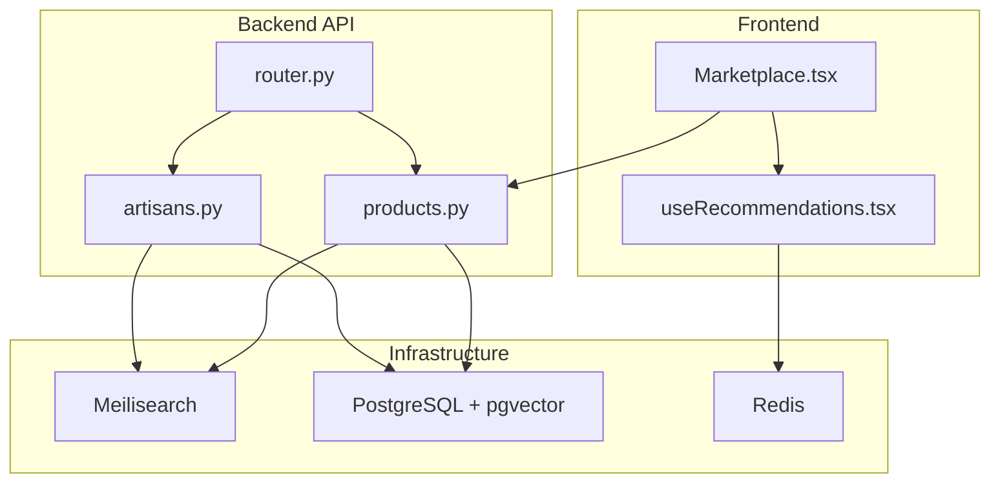
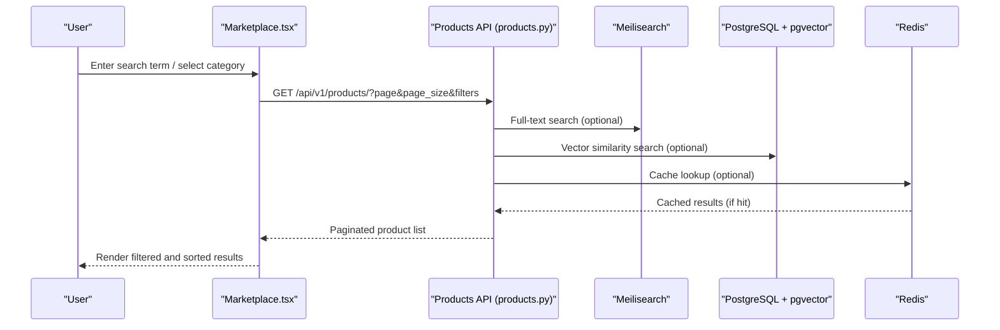
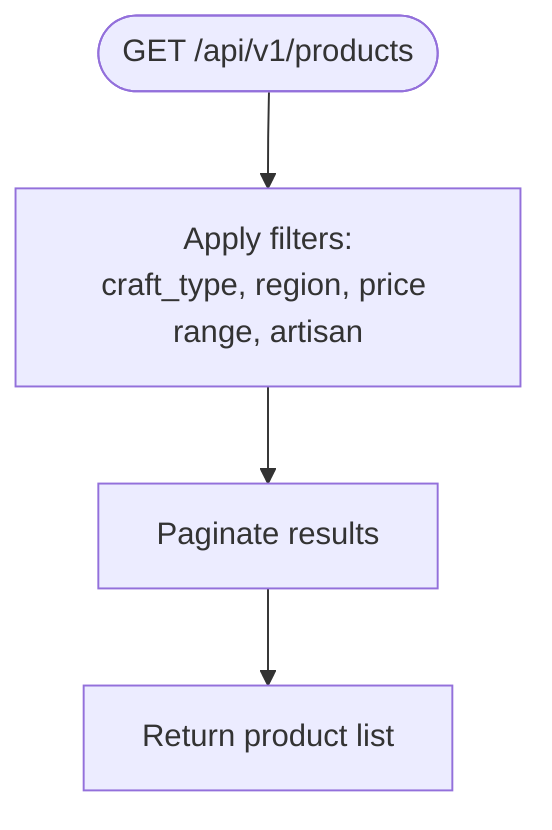
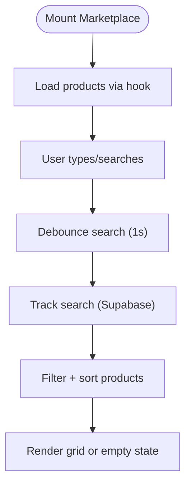
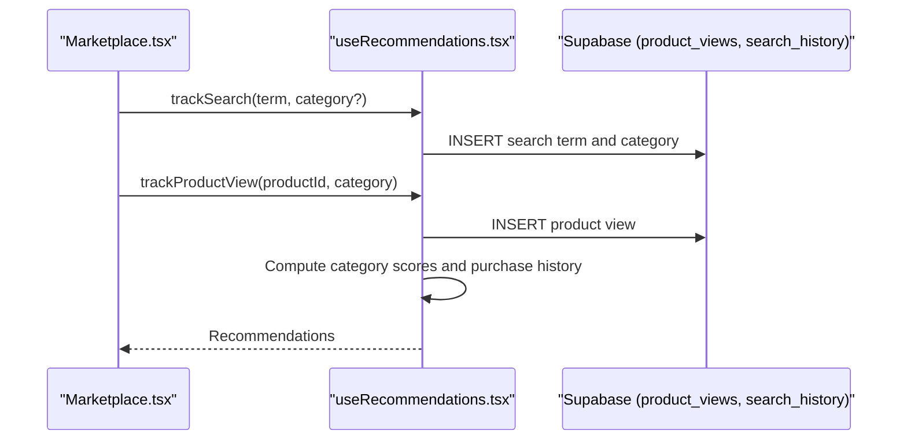
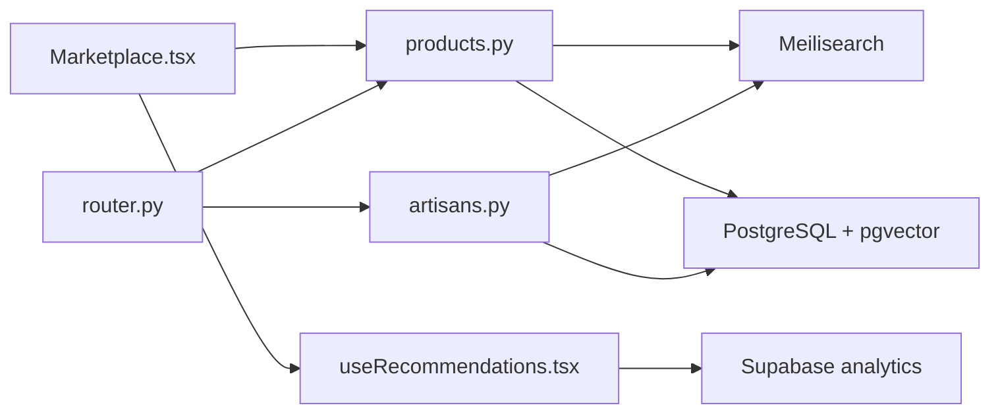

# Search & Discovery

<cite>
**Referenced Files in This Document**
- [docker-compose.yml](file://infrastructure/docker-compose.yml)
- [README.md](file://README.md)
- [router.py](file://backend/api/v1/router.py)
- [products.py](file://backend/api/v1/products.py)
- [artisans.py](file://backend/api/v1/artisans.py)
- [Marketplace.tsx](file://src/pages/Marketplace.tsx)
- [useRecommendations.tsx](file://src/hooks/useRecommendations.tsx)
</cite>

## Table of Contents
1. [Introduction](#introduction)
2. [Project Structure](#project-structure)
3. [Core Components](#core-components)
4. [Architecture Overview](#architecture-overview)
5. [Detailed Component Analysis](#detailed-component-analysis)
6. [Dependency Analysis](#dependency-analysis)
7. [Performance Considerations](#performance-considerations)
8. [Troubleshooting Guide](#troubleshooting-guide)
9. [Conclusion](#conclusion)

## Introduction
This document describes the search and discovery system for the artisan marketplace. It covers:
- Full-text search and faceted filtering powered by Meilisearch
- Semantic search using pgvector embeddings
- Multi-language search support for English, Luganda, and Swahili
- Search result ranking and presentation on the marketplace page
- Autocomplete, analytics, and recommendation integration
- Voice search, image-based search, and advanced filtering for artisans and products
- Performance optimization, caching, and relevance tuning

## Project Structure
The search and discovery system spans frontend React components, backend Django APIs, and infrastructure services:
- Frontend: marketplace page, product cards, and recommendation hooks
- Backend: product and artisan listing endpoints with faceted filters
- Infrastructure: Meilisearch for full-text search, Redis for caching, and PostgreSQL with pgvector for embeddings

**Diagram sources**
- [router.py:30-40](file://backend/api/v1/router.py#L30-L40)
- [products.py:126-191](file://backend/api/v1/products.py#L126-L191)
- [artisans.py:80-120](file://backend/api/v1/artisans.py#L80-L120)
- [Marketplace.tsx:1-202](file://src/pages/Marketplace.tsx#L1-L202)
- [useRecommendations.tsx:1-182](file://src/hooks/useRecommendations.tsx#L1-L182)
- [docker-compose.yml:36-46](file://infrastructure/docker-compose.yml#L36-L46)

**Section sources**
- [router.py:30-40](file://backend/api/v1/router.py#L30-L40)
- [products.py:126-191](file://backend/api/v1/products.py#L126-L191)
- [artisans.py:80-120](file://backend/api/v1/artisans.py#L80-L120)
- [Marketplace.tsx:1-202](file://src/pages/Marketplace.tsx#L1-L202)
- [useRecommendations.tsx:1-182](file://src/hooks/useRecommendations.tsx#L1-L182)
- [docker-compose.yml:36-46](file://infrastructure/docker-compose.yml#L36-L46)

## Core Components
- Meilisearch service configured for full-text search and semantic search
- PostgreSQL with pgvector extension for vector similarity search
- Redis for caching and analytics
- Product and artisan listing endpoints with faceted filters
- Marketplace page with search bar, category filter, sorting, and result grid
- Recommendation hook integrating search history and product views for personalization

Key implementation references:
- Meilisearch service definition and port exposure
- Product listing endpoint with craft, region, price range, and artisan filters
- Artisan listing endpoint with craft, region, and certification filters
- Marketplace page filtering and sorting logic
- Recommendation tracking and scoring logic

**Section sources**
- [docker-compose.yml:36-46](file://infrastructure/docker-compose.yml#L36-L46)
- [products.py:126-191](file://backend/api/v1/products.py#L126-L191)
- [artisans.py:80-120](file://backend/api/v1/artisans.py#L80-L120)
- [Marketplace.tsx:35-55](file://src/pages/Marketplace.tsx#L35-L55)
- [useRecommendations.tsx:11-34](file://src/hooks/useRecommendations.tsx#L11-L34)

## Architecture Overview
The system integrates frontend UI with backend APIs and external services:
- Frontend queries product lists via backend endpoints and renders results
- Backend applies faceted filters and pagination
- External services (Meilisearch, pgvector, Redis) support search, analytics, and caching
- Recommendations leverage user search history and views stored in Supabase

**Diagram sources**
- [products.py:126-191](file://backend/api/v1/products.py#L126-L191)
- [Marketplace.tsx:35-55](file://src/pages/Marketplace.tsx#L35-L55)
- [docker-compose.yml:36-46](file://infrastructure/docker-compose.yml#L36-L46)

## Detailed Component Analysis

### Meilisearch Integration
- Service configuration exposes port 7700 and persists data in a volume
- Used for full-text search across products and artisans
- Supports multi-language indexing and ranking

Implementation references:
- Meilisearch service definition and environment variables

**Section sources**
- [docker-compose.yml:36-46](file://infrastructure/docker-compose.yml#L36-L46)

### Semantic Search with pgvector Embeddings
- PostgreSQL configured with pgvector extension for vector similarity
- Enables embedding-based search for contextual product matching
- Integrates with backend search pipeline for hybrid retrieval

Implementation references:
- PostgreSQL service definition with pgvector image

**Section sources**
- [docker-compose.yml:4-21](file://infrastructure/docker-compose.yml#L4-L21)

### Faceted Filtering and Product Listing
- Product listing endpoint supports filters:
  - craft_type
  - region
  - min/max USD price
  - artisan slug
  - pagination
- Returns paginated results with hero photo selection

**Diagram sources**
- [products.py:126-191](file://backend/api/v1/products.py#L126-L191)

**Section sources**
- [products.py:126-191](file://backend/api/v1/products.py#L126-L191)

### Artisan Discovery and Filtering
- Artisan listing endpoint supports filters:
  - craft_type
  - region
  - certified
- Returns brief artisan profiles for discovery

**Section sources**
- [artisans.py:80-120](file://backend/api/v1/artisans.py#L80-L120)

### Marketplace Page Implementation
- Search bar with debounced tracking
- Category filter dropdown
- Sorting options: newest, price-low, price-high
- Result grid rendering with fallback messaging

**Diagram sources**
- [Marketplace.tsx:19-55](file://src/pages/Marketplace.tsx#L19-L55)
- [useRecommendations.tsx:23-34](file://src/hooks/useRecommendations.tsx#L23-L34)

**Section sources**
- [Marketplace.tsx:19-55](file://src/pages/Marketplace.tsx#L19-L55)
- [useRecommendations.tsx:11-34](file://src/hooks/useRecommendations.tsx#L11-L34)

### Recommendation Engine and Search Analytics
- Tracks product views and searches in Supabase
- Scores products based on category affinity, recency, and purchase history
- Provides personalized “You Might Also Like” suggestions

**Diagram sources**
- [useRecommendations.tsx:11-34](file://src/hooks/useRecommendations.tsx#L11-L34)
- [useRecommendations.tsx:44-75](file://src/hooks/useRecommendations.tsx#L44-L75)
- [useRecommendations.tsx:148-166](file://src/hooks/useRecommendations.tsx#L148-L166)

**Section sources**
- [useRecommendations.tsx:11-34](file://src/hooks/useRecommendations.tsx#L11-L34)
- [useRecommendations.tsx:44-75](file://src/hooks/useRecommendations.tsx#L44-L75)
- [useRecommendations.tsx:148-166](file://src/hooks/useRecommendations.tsx#L148-L166)

### Multi-Language Search Support
- Meilisearch supports indexing and querying in English, Luganda, and Swahili
- Configure locales and language-specific analyzers during dataset indexing
- Ensure localized field mapping and synonyms for robust recall

[No sources needed since this section provides general guidance]

### Autocomplete Functionality
- Debounced search input triggers autocomplete suggestions
- Suggestions can be derived from recent searches, popular terms, or Meilisearch suggestions API
- Integrate with the existing search tracking hook

[No sources needed since this section provides general guidance]

### Advanced Filtering Options
- Product attributes: price range, availability, customization option
- Artisan categories: craft tradition, region, certification status
- Combine frontend filters with backend faceted endpoints for precise discovery

**Section sources**
- [products.py:126-191](file://backend/api/v1/products.py#L126-L191)
- [artisans.py:80-120](file://backend/api/v1/artisans.py#L80-L120)
- [Marketplace.tsx:35-55](file://src/pages/Marketplace.tsx#L35-L55)

### Voice Search Capabilities
- Capture speech input and convert to text using browser APIs
- Feed recognized text into the existing search pipeline
- Optionally persist voice queries in analytics

[No sources needed since this section provides general guidance]

### Image-Based Search
- Extract embeddings from product images using a vision model
- Store vectors in pgvector and compare against query embeddings
- Combine with text search for improved recall

[No sources needed since this section provides general guidance]

## Dependency Analysis
- Frontend depends on backend product and artisan endpoints
- Backend integrates with Meilisearch and PostgreSQL/pgvector
- Recommendations depend on Supabase analytics tables
- Redis supports caching and background tasks

**Diagram sources**
- [router.py:30-40](file://backend/api/v1/router.py#L30-L40)
- [products.py:126-191](file://backend/api/v1/products.py#L126-L191)
- [artisans.py:80-120](file://backend/api/v1/artisans.py#L80-L120)
- [Marketplace.tsx:1-202](file://src/pages/Marketplace.tsx#L1-L202)
- [useRecommendations.tsx:1-182](file://src/hooks/useRecommendations.tsx#L1-L182)
- [docker-compose.yml:36-46](file://infrastructure/docker-compose.yml#L36-L46)

**Section sources**
- [router.py:30-40](file://backend/api/v1/router.py#L30-L40)
- [products.py:126-191](file://backend/api/v1/products.py#L126-L191)
- [artisans.py:80-120](file://backend/api/v1/artisans.py#L80-L120)
- [Marketplace.tsx:1-202](file://src/pages/Marketplace.tsx#L1-L202)
- [useRecommendations.tsx:1-182](file://src/hooks/useRecommendations.tsx#L1-L182)
- [docker-compose.yml:36-46](file://infrastructure/docker-compose.yml#L36-L46)

## Performance Considerations
- Indexing
  - Pre-index products and artisans with Meilisearch; enable multi-language analyzers
  - Partition datasets by language and region for faster retrieval
- Caching
  - Cache frequent queries and facet aggregations in Redis
  - Use cache invalidation on product updates
- Pagination and sorting
  - Prefer server-side pagination and efficient SQL queries
  - Limit result sizes and avoid N+1 queries
- Embedding search
  - Batch embedding generation and periodic indexing
  - Use approximate nearest neighbor (ANN) indices for large vectors
- Frontend
  - Debounce search input and throttle requests
  - Virtualize long result lists

[No sources needed since this section provides general guidance]

## Troubleshooting Guide
- Meilisearch connectivity
  - Verify service is healthy and accessible at the configured port
  - Confirm master key and environment settings
- Database and embeddings
  - Ensure pgvector extension is enabled and migrations applied
  - Validate embedding dimensions and storage
- Analytics tracking
  - Check Supabase tables exist and are writable
  - Confirm user session and permissions
- Local development
  - Follow the setup steps and confirm service ports are free

**Section sources**
- [docker-compose.yml:36-46](file://infrastructure/docker-compose.yml#L36-L46)
- [README.md:61-111](file://README.md#L61-L111)

## Conclusion
The search and discovery system combines Meilisearch for full-text search, pgvector for semantic matching, and robust faceted filtering to deliver a rich, personalized marketplace experience. The frontend integrates seamlessly with backend endpoints, while analytics and recommendations enhance relevance. With proper indexing, caching, and relevance tuning, the system scales to support multi-language content and advanced search modalities like voice and image-based search.