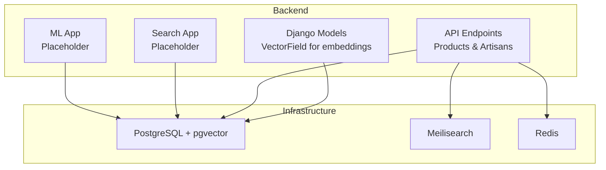
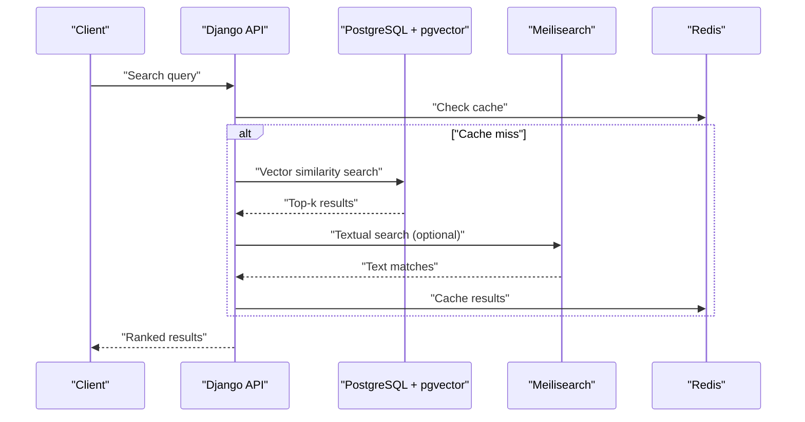
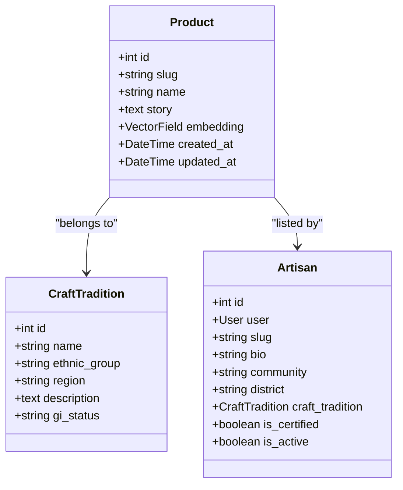
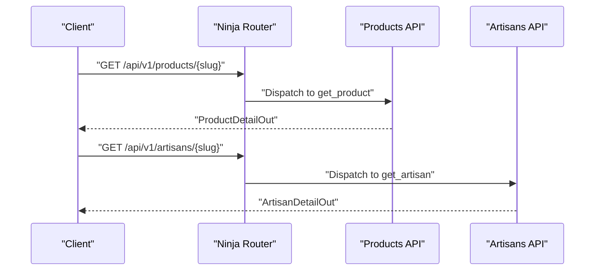
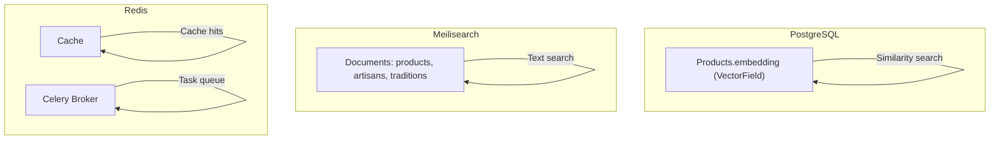
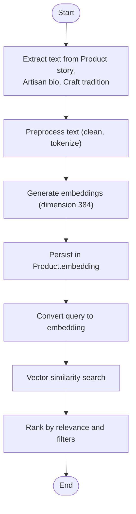
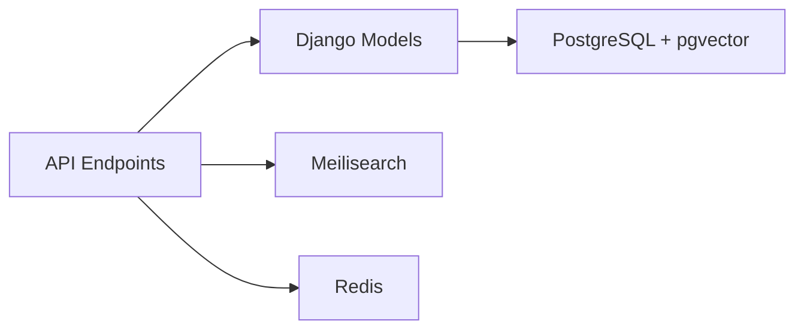

# Semantic Search Implementation

<cite>
**Referenced Files in This Document**
- [docker-compose.yml](file://infrastructure/docker-compose.yml)
- [router.py](file://backend/api/v1/router.py)
- [products.py](file://backend/api/v1/products.py)
- [artisans.py](file://backend/api/v1/artisans.py)
- [models.py](file://backend/apps/products/models.py)
- [models.py](file://backend/apps/artisans/models.py)
- [__init__.py](file://backend/apps/search/__init__.py)
- [__init__.py](file://backend/apps/ml/__init__.py)
</cite>

## Table of Contents
1. [Introduction](#introduction)
2. [Project Structure](#project-structure)
3. [Core Components](#core-components)
4. [Architecture Overview](#architecture-overview)
5. [Detailed Component Analysis](#detailed-component-analysis)
6. [Dependency Analysis](#dependency-analysis)
7. [Performance Considerations](#performance-considerations)
8. [Troubleshooting Guide](#troubleshooting-guide)
9. [Conclusion](#conclusion)

## Introduction
This document describes the semantic search system implemented for the Empindu artisan marketplace. The system leverages pgvector embeddings stored in PostgreSQL to enable similarity search across product descriptions, artisan stories, and craft traditions. It also documents the current search stack (PostgreSQL with pgvector, Meilisearch, Redis) and outlines embedding generation, indexing, similarity search, and operational best practices for large-scale deployments.

## Project Structure
The semantic search implementation spans backend Django models, API endpoints, and supporting infrastructure containers. The key areas are:
- Backend models with pgvector VectorField for embeddings
- API endpoints for product and artisan data retrieval
- Infrastructure stack including PostgreSQL with pgvector, Meilisearch, and Redis

**Diagram sources**
- [models.py:78-79](file://backend/apps/products/models.py#L78-L79)
- [docker-compose.yml:5-46](file://infrastructure/docker-compose.yml#L5-L46)
- [router.py:30-39](file://backend/api/v1/router.py#L30-L39)
- [products.py:74-123](file://backend/api/v1/products.py#L74-L123)
- [artisans.py:52-77](file://backend/api/v1/artisans.py#L52-L77)
- [__init__.py:1-2](file://backend/apps/search/__init__.py#L1-L2)
- [__init__.py:1-2](file://backend/apps/ml/__init__.py#L1-L2)

**Section sources**
- [docker-compose.yml:1-51](file://infrastructure/docker-compose.yml#L1-L51)
- [router.py:1-40](file://backend/api/v1/router.py#L1-L40)
- [products.py:1-191](file://backend/api/v1/products.py#L1-L191)
- [artisans.py:1-120](file://backend/api/v1/artisans.py#L1-L120)
- [models.py:1-153](file://backend/apps/products/models.py#L1-L153)
- [models.py:1-170](file://backend/apps/artisans/models.py#L1-L170)
- [__init__.py:1-2](file://backend/apps/search/__init__.py#L1-L2)
- [__init__.py:1-2](file://backend/apps/ml/__init__.py#L1-L2)

## Core Components
- Embedding storage: VectorField with dimension 384 is defined on the Product model for semantic similarity search.
- Data sources for embeddings: Product story, artisan bio, and craft tradition description.
- Search stack: PostgreSQL with pgvector for vector storage and similarity search; Meilisearch for general-purpose search; Redis for caching and background tasks.
- API exposure: Product and artisan endpoints provide structured data consumed by frontend and ML pipelines.

Key implementation references:
- VectorField definition and embedding column on Product
- Docker Compose services for Postgres (pgvector), Meilisearch, and Redis
- API routers and endpoints for product and artisan data

**Section sources**
- [models.py:78-79](file://backend/apps/products/models.py#L78-L79)
- [docker-compose.yml:5-46](file://infrastructure/docker-compose.yml#L5-L46)
- [router.py:30-39](file://backend/api/v1/router.py#L30-L39)
- [products.py:74-123](file://backend/api/v1/products.py#L74-L123)
- [artisans.py:52-77](file://backend/api/v1/artisans.py#L52-L77)

## Architecture Overview
The semantic search architecture integrates:
- Data ingestion pipeline: Extract product story, artisan bio, and craft tradition description; generate embeddings via a model; persist vectors in PostgreSQL using pgvector.
- Query pipeline: Convert user queries to embeddings; perform vector similarity search in PostgreSQL; optionally enrich results with Meilisearch for broader textual matches.
- Caching and orchestration: Use Redis for caching frequent queries and as a Celery broker for asynchronous embedding updates.

**Diagram sources**
- [docker-compose.yml:5-46](file://infrastructure/docker-compose.yml#L5-L46)
- [router.py:30-39](file://backend/api/v1/router.py#L30-L39)
- [products.py:74-123](file://backend/api/v1/products.py#L74-L123)
- [artisans.py:52-77](file://backend/api/v1/artisans.py#L52-L77)

## Detailed Component Analysis

### Embedding Generation and Storage
- Embedding field: Product model includes a VectorField with dimension 384 for storing embeddings.
- Data sources: Product story, artisan bio, and craft tradition description serve as input texts for embedding generation.
- Storage: Vectors are persisted in PostgreSQL with pgvector extension enabled.

**Diagram sources**
- [models.py:10-100](file://backend/apps/products/models.py#L10-L100)
- [models.py:62-170](file://backend/apps/artisans/models.py#L62-L170)

**Section sources**
- [models.py:78-79](file://backend/apps/products/models.py#L78-L79)
- [models.py:36-44](file://backend/apps/products/models.py#L36-L44)
- [models.py:87-96](file://backend/apps/artisans/models.py#L87-L96)

### Similarity Search and Threshold Configuration
- Similarity metric: Cosine distance is commonly used with pgvector for VectorField; adjust thresholds to balance precision and recall.
- Threshold tuning: Start with a conservative threshold and iteratively lower it based on evaluation metrics (precision@k, recall@k).
- Filtering: Combine vector search with SQL filters (e.g., status, certification) to refine results.

Note: The repository does not include explicit threshold constants or similarity functions. Implement threshold tuning in the query layer and expose configurable parameters via API or settings.

**Section sources**
- [models.py:78-79](file://backend/apps/products/models.py#L78-L79)

### Database Schema and Indexing Strategies
- Vector column: Product.embedding is a VectorField with dimension 384.
- Indexing: Use ivfflat or hnsw indexes on the embedding column for efficient similarity search. Configure lists/probes for ivfflat and ef_construction/ef_search for hnsw.
- Query optimization: Use WHERE clauses to pre-filter rows (e.g., status) before vector similarity search to reduce candidate set size.

Note: The repository does not include explicit index creation statements. Add appropriate indexes in migrations or via database administration.

**Section sources**
- [models.py:78-79](file://backend/apps/products/models.py#L78-L79)

### API Endpoints for Semantic Search Inputs
- Product detail endpoint: Returns product story and related metadata used as semantic search inputs.
- Artisan detail endpoint: Returns artisan bio and craft tradition for embedding generation.

**Diagram sources**
- [router.py:30-39](file://backend/api/v1/router.py#L30-L39)
- [products.py:74-123](file://backend/api/v1/products.py#L74-L123)
- [artisans.py:52-77](file://backend/api/v1/artisans.py#L52-L77)

**Section sources**
- [router.py:30-39](file://backend/api/v1/router.py#L30-L39)
- [products.py:74-123](file://backend/api/v1/products.py#L74-L123)
- [artisans.py:52-77](file://backend/api/v1/artisans.py#L52-L77)

### Search Stack and Operational Components
- PostgreSQL with pgvector: Hosts vector embeddings and performs similarity search.
- Meilisearch: Provides general-purpose search across text fields.
- Redis: Used for caching and as a message broker for background tasks.

**Diagram sources**
- [docker-compose.yml:5-46](file://infrastructure/docker-compose.yml#L5-L46)
- [models.py:78-79](file://backend/apps/products/models.py#L78-L79)

**Section sources**
- [docker-compose.yml:5-46](file://infrastructure/docker-compose.yml#L5-L46)

### Conceptual Overview
- Embedding lifecycle: Data extraction → preprocessing → embedding generation → persistence → similarity search.
- Ranking: Combine vector similarity scores with textual match scores and business rules (e.g., certification, stock).
- Maintenance: Periodic reindexing, monitoring embedding drift, and updating indexes.

[No sources needed since this diagram shows conceptual workflow, not actual code structure]

## Dependency Analysis
- Internal dependencies:
  - API routers depend on models for data retrieval.
  - Models define VectorField for embeddings.
- External dependencies:
  - PostgreSQL with pgvector for vector storage and similarity search.
  - Meilisearch for general-purpose search.
  - Redis for caching and task queue.

**Diagram sources**
- [router.py:30-39](file://backend/api/v1/router.py#L30-L39)
- [models.py:78-79](file://backend/apps/products/models.py#L78-L79)
- [docker-compose.yml:5-46](file://infrastructure/docker-compose.yml#L5-L46)

**Section sources**
- [router.py:30-39](file://backend/api/v1/router.py#L30-L39)
- [models.py:78-79](file://backend/apps/products/models.py#L78-L79)
- [docker-compose.yml:5-46](file://infrastructure/docker-compose.yml#L5-L46)

## Performance Considerations
- Embedding dimension: Dimension 384 balances model quality and memory footprint; larger dimensions improve accuracy but increase storage and compute costs.
- Index selection:
  - ivfflat: Good for balanced recall and latency; configure lists/probes for desired performance.
  - hnsw: Often superior for high-recall scenarios; tune ef_construction and ef_search.
- Query optimization:
  - Pre-filter by status and other attributes to reduce candidate sets.
  - Use LIMIT to cap results and avoid scanning entire tables.
- Caching:
  - Cache frequent queries in Redis to reduce load on PostgreSQL and Meilisearch.
- Background updates:
  - Use Celery with Redis to periodically regenerate embeddings and reindex vectors.

[No sources needed since this section provides general guidance]

## Troubleshooting Guide
- VectorField errors:
  - Ensure pgvector extension is installed and migrations applied.
  - Verify embedding dimension matches the model output.
- Slow similarity search:
  - Confirm indexes exist and are properly configured.
  - Reduce candidate set with WHERE filters.
- Meilisearch sync:
  - Re-index documents after embedding updates.
- Cache misses:
  - Warm caches for popular queries.
  - Monitor Redis memory usage.

**Section sources**
- [models.py:78-79](file://backend/apps/products/models.py#L78-L79)
- [docker-compose.yml:5-46](file://infrastructure/docker-compose.yml#L5-L46)

## Conclusion
The Empindu semantic search system integrates PostgreSQL with pgvector for vector storage and similarity search, complemented by Meilisearch for general-purpose search and Redis for caching and background tasks. The Product model’s VectorField with dimension 384 enables contextual relevance ranking for product discovery. To operate effectively at scale, implement robust indexing strategies, threshold tuning, periodic reindexing, and caching. The current repository includes placeholder apps for search and ML; future sprints should implement embedding generation pipelines, similarity search endpoints, and operational tooling.