# Artisan Onboarding Workflow

<cite>
**Referenced Files in This Document**
- [models.py](file://backend/apps/artisans/models.py)
- [artisans.py](file://backend/api/v1/artisans.py)
- [ArtisansManager.tsx](file://apps/web/src/components/admin/ArtisansManager.tsx)
- [BusinessRegistration.tsx](file://apps/web/src/components/business/BusinessRegistration.tsx)
- [ArtisanAnalytics.tsx](file://apps/web/src/components/business/ArtisanAnalytics.tsx)
- [MIGRATION_GUIDE.md](file://MIGRATION_GUIDE.md)
- [README.md](file://README.md)
</cite>

## Table of Contents
1. [Introduction](#introduction)
2. [Project Structure](#project-structure)
3. [Core Components](#core-components)
4. [Architecture Overview](#architecture-overview)
5. [Detailed Component Analysis](#detailed-component-analysis)
6. [Dependency Analysis](#dependency-analysis)
7. [Performance Considerations](#performance-considerations)
8. [Troubleshooting Guide](#troubleshooting-guide)
9. [Conclusion](#conclusion)
10. [Appendices](#appendices)

## Introduction
This document explains the artisan onboarding workflow through the Telegram bot, covering the step-by-step registration process, identity verification, craft tradition documentation, and the integration with Django authentication for account creation and profile management. It also details the automated onboarding checklist, document validation processes, approval workflow notifications, artisan interaction patterns, common questions, automated guidance systems, integration with the business registration system, artisan analytics dashboard, and profile completion tracking. Finally, it provides troubleshooting guidance and manual intervention procedures.

## Project Structure
The onboarding workflow spans frontend, backend, and administrative components:
- Backend Django models define artisan profiles, craft traditions, and certification metadata.
- Backend Ninja API exposes endpoints for artisan discovery and profile retrieval.
- Frontend admin component allows verification actions and status updates.
- Business registration and artisan analytics dashboards support complementary workflows.
- Telegram bot integration is planned and documented for onboarding automation.

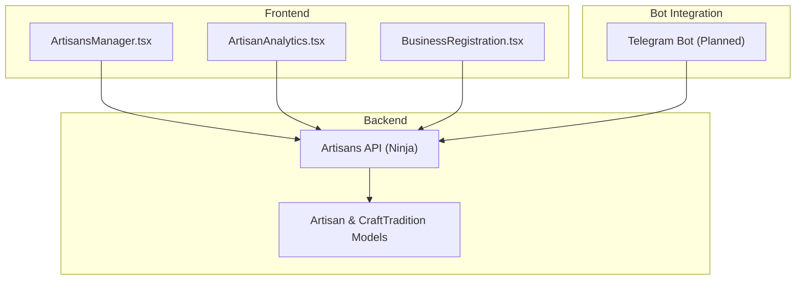

**Diagram sources**
- [ArtisansManager.tsx:1-216](file://apps/web/src/components/admin/ArtisansManager.tsx#L1-L216)
- [BusinessRegistration.tsx:1-205](file://apps/web/src/components/business/BusinessRegistration.tsx#L1-L205)
- [ArtisanAnalytics.tsx:1-78](file://apps/web/src/components/business/ArtisanAnalytics.tsx#L1-L78)
- [artisans.py:1-120](file://backend/api/v1/artisans.py#L1-L120)
- [models.py:1-170](file://backend/apps/artisans/models.py#L1-L170)

**Section sources**
- [README.md:179-242](file://README.md#L179-L242)
- [MIGRATION_GUIDE.md:181-187](file://MIGRATION_GUIDE.md#L181-L187)

## Core Components
- Artisan model encapsulates identity, location, contact, status, media, and experience. It links to Django’s User via a OneToOne field and references CraftTradition and optional Certifications.
- CraftTradition model defines cultural craft traditions with GI status and heritage fund levy metadata.
- Artisans API provides public endpoints for listing artisans, retrieving detailed profiles, and fetching craft traditions.
- Admin manager enables verification actions and status updates for artisans.
- Business registration component supports business profile creation/update and status tracking.
- Artisan analytics dashboard aggregates product, order, revenue, and view metrics for artisans.

**Section sources**
- [models.py:62-170](file://backend/apps/artisans/models.py#L62-L170)
- [models.py:14-45](file://backend/apps/artisans/models.py#L14-L45)
- [artisans.py:13-120](file://backend/api/v1/artisans.py#L13-L120)
- [ArtisansManager.tsx:29-216](file://apps/web/src/components/admin/ArtisansManager.tsx#L29-L216)
- [BusinessRegistration.tsx:14-205](file://apps/web/src/components/business/BusinessRegistration.tsx#L14-L205)
- [ArtisanAnalytics.tsx:7-78](file://apps/web/src/components/business/ArtisanAnalytics.tsx#L7-L78)

## Architecture Overview
The onboarding architecture integrates Telegram bot interactions with Django authentication and profile management, exposing curated data via the Artisans API consumed by frontend dashboards.

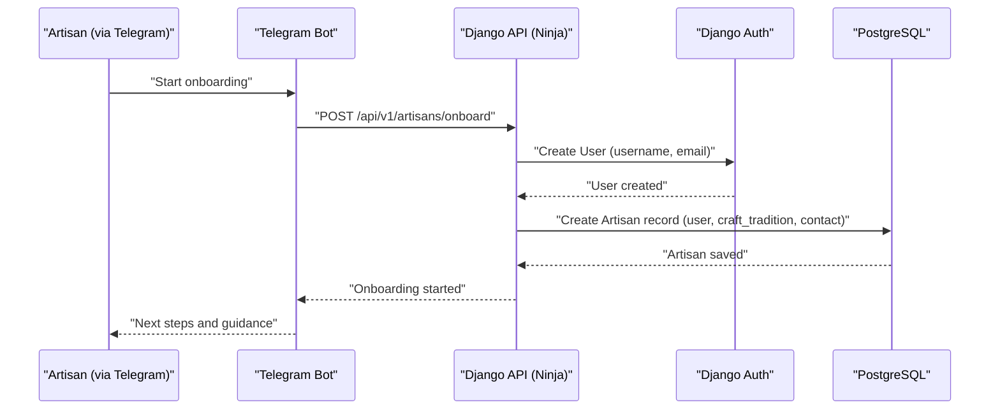

**Diagram sources**
- [artisans.py:13-120](file://backend/api/v1/artisans.py#L13-L120)
- [models.py:62-170](file://backend/apps/artisans/models.py#L62-L170)
- [MIGRATION_GUIDE.md:181-187](file://MIGRATION_GUIDE.md#L181-L187)

## Detailed Component Analysis

### Telegram Bot Onboarding Flow
- The Telegram bot initiates onboarding sessions, guiding artisans through identity collection, craft tradition selection, and document uploads.
- The bot validates inputs and triggers Django authentication to create a User account linked to an Artisan profile.
- The bot provides automated guidance, handles common questions, and notifies stakeholders upon completion or approval.

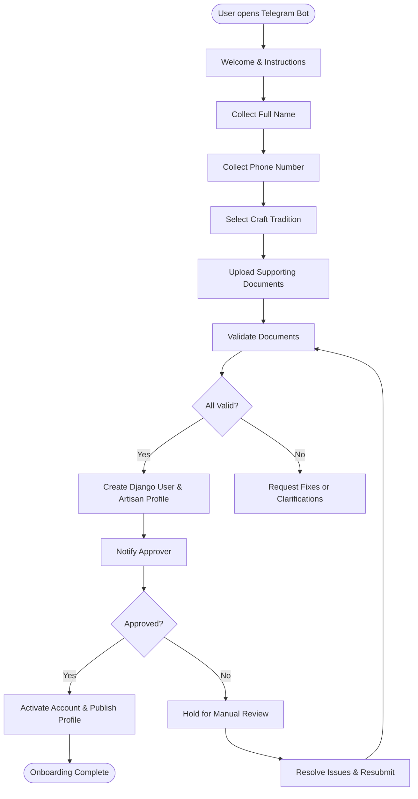

**Diagram sources**
- [MIGRATION_GUIDE.md:181-187](file://MIGRATION_GUIDE.md#L181-L187)
- [models.py:62-170](file://backend/apps/artisans/models.py#L62-L170)

### Django Authentication Integration
- The API creates a Django User during onboarding and associates it with the Artisan profile.
- The Artisan model’s OneToOne relationship with User ensures seamless authentication and profile linkage.

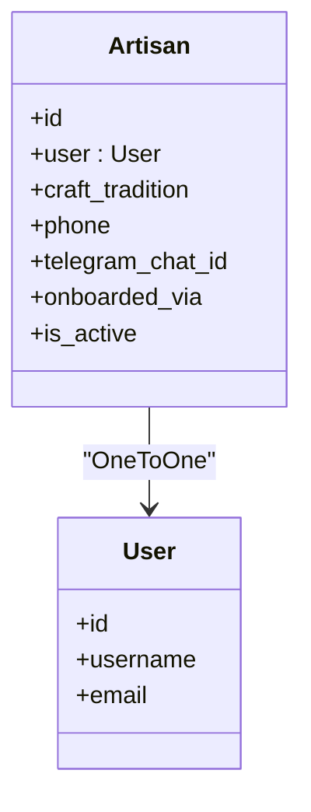

**Diagram sources**
- [models.py:76-78](file://backend/apps/artisans/models.py#L76-L78)
- [models.py:62-170](file://backend/apps/artisans/models.py#L62-L170)

### Automated Onboarding Checklist
- Identity: Full name, phone number, preferred communication channel.
- Craft Tradition: Selection from CraftTradition catalog.
- Documents: Photos, identity proof, craft samples, or business registration documents.
- Validation: Automated checks for completeness and format.
- Approval: Admin verification and status update.

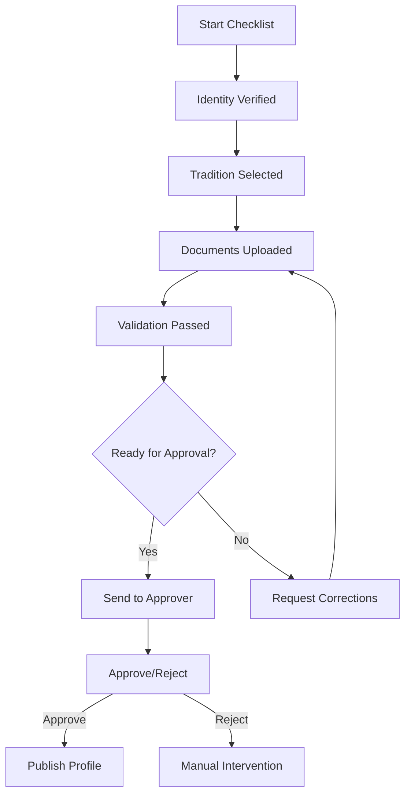

**Diagram sources**
- [models.py:62-170](file://backend/apps/artisans/models.py#L62-L170)
- [ArtisansManager.tsx:34-66](file://apps/web/src/components/admin/ArtisansManager.tsx#L34-L66)

### Document Validation and Approval Workflow Notifications
- Validation occurs after document upload; invalid items prompt resubmission.
- Approval workflow triggers notifications to approvers and users.
- Admin manager supports verification toggles and status updates.

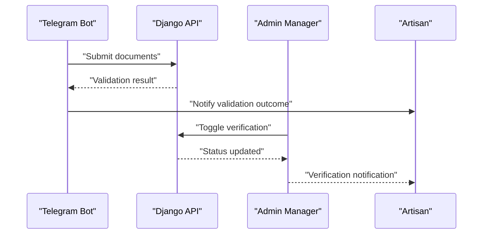

**Diagram sources**
- [ArtisansManager.tsx:34-66](file://apps/web/src/components/admin/ArtisansManager.tsx#L34-L66)
- [BusinessRegistration.tsx:30-108](file://apps/web/src/components/business/BusinessRegistration.tsx#L30-L108)

### Craft Tradition Documentation
- CraftTradition model stores name, ethnic group, region, description, GI status, and heritage fund levy percentage.
- The Artisans API exposes craft traditions for filtering and discovery.

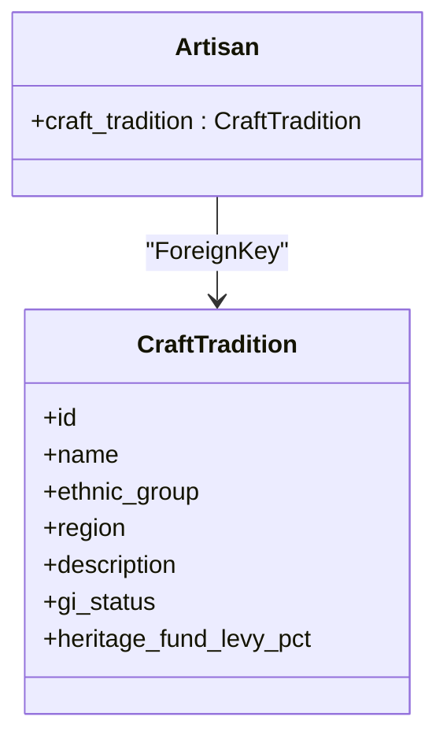

**Diagram sources**
- [models.py:14-45](file://backend/apps/artisans/models.py#L14-L45)
- [models.py:80-82](file://backend/apps/artisans/models.py#L80-L82)
- [artisans.py:115-120](file://backend/api/v1/artisans.py#L115-L120)

### Profile Completion Tracking and Discovery
- The Artisans API provides endpoints to list artisans and filter by craft tradition, region, and certification status.
- Public profile retrieval supports SSR-driven artisan pages.

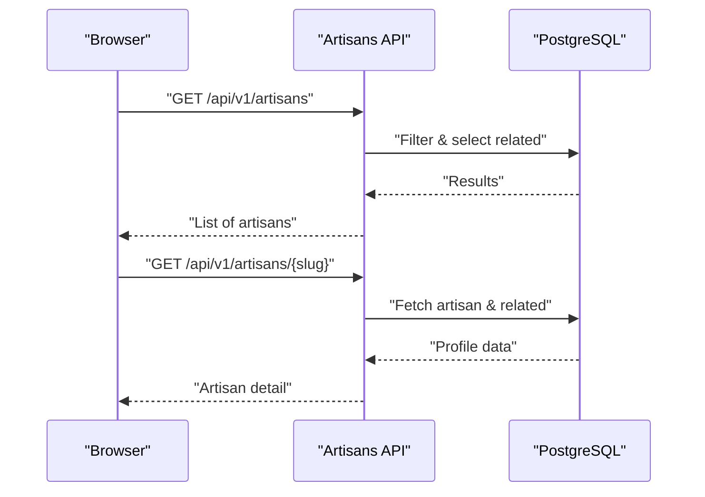

**Diagram sources**
- [artisans.py:80-120](file://backend/api/v1/artisans.py#L80-L120)

### Business Registration Integration
- BusinessRegistration component manages business profile creation/update and tracks registration status.
- Registration status influences onboarding completeness and eligibility for marketplace participation.

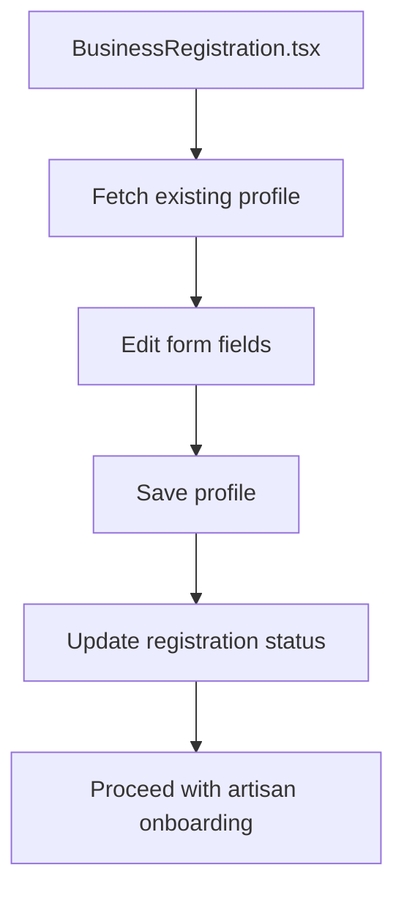

**Diagram sources**
- [BusinessRegistration.tsx:30-108](file://apps/web/src/components/business/BusinessRegistration.tsx#L30-L108)

### Artisan Analytics Dashboard
- ArtisanAnalytics component aggregates product counts, order totals, revenue, and views for performance insights.
- Useful for tracking onboarding impact and growth metrics.

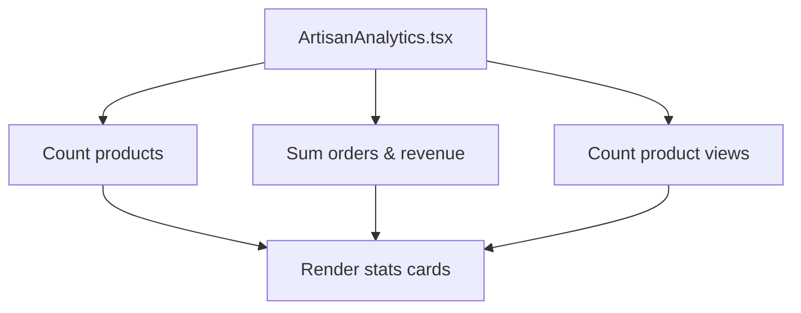

**Diagram sources**
- [ArtisanAnalytics.tsx:16-44](file://apps/web/src/components/business/ArtisanAnalytics.tsx#L16-L44)

## Dependency Analysis
- Artisan depends on Django User and CraftTradition.
- Artisans API depends on Artisan and CraftTradition models.
- Admin manager depends on Artisans API for verification actions.
- Business registration and analytics dashboards depend on external data sources and Supabase.

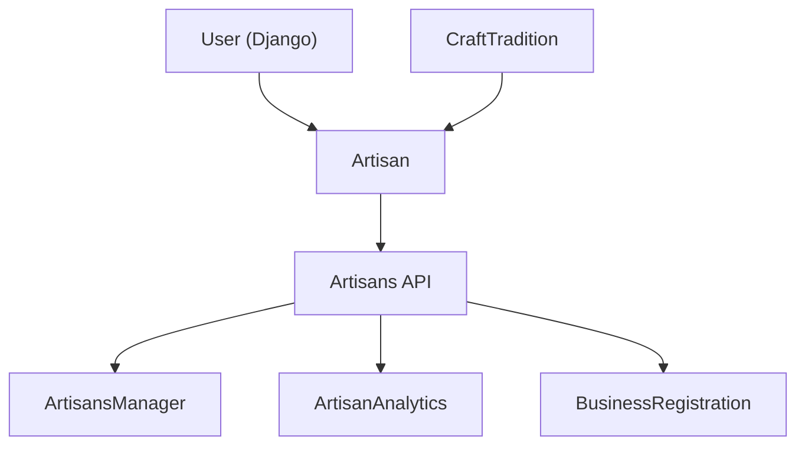

**Diagram sources**
- [models.py:76-82](file://backend/apps/artisans/models.py#L76-L82)
- [artisans.py:13-120](file://backend/api/v1/artisans.py#L13-L120)
- [ArtisansManager.tsx:34-66](file://apps/web/src/components/admin/ArtisansManager.tsx#L34-L66)
- [ArtisanAnalytics.tsx:16-44](file://apps/web/src/components/business/ArtisanAnalytics.tsx#L16-L44)
- [BusinessRegistration.tsx:55-74](file://apps/web/src/components/business/BusinessRegistration.tsx#L55-L74)

**Section sources**
- [models.py:62-170](file://backend/apps/artisans/models.py#L62-L170)
- [artisans.py:13-120](file://backend/api/v1/artisans.py#L13-L120)
- [ArtisansManager.tsx:34-66](file://apps/web/src/components/admin/ArtisansManager.tsx#L34-L66)
- [BusinessRegistration.tsx:55-74](file://apps/web/src/components/business/BusinessRegistration.tsx#L55-L74)
- [ArtisanAnalytics.tsx:16-44](file://apps/web/src/components/business/ArtisanAnalytics.tsx#L16-L44)

## Performance Considerations
- Use select_related in API queries to minimize database hits when fetching artisan and related craft tradition data.
- Paginate artisan listings and limit image sizes for profile and cover photos.
- Cache frequently accessed craft tradition lists to reduce load.
- Offload heavy tasks (e.g., ML transcription) to background workers and notify users asynchronously.

## Troubleshooting Guide
- Onboarding stuck on validation:
  - Verify document formats and completeness.
  - Re-upload missing or corrupted files.
- Approval delays:
  - Confirm admin notifications and verification actions.
  - Use the admin manager to toggle verification and resolve discrepancies.
- Business registration issues:
  - Ensure mandatory fields are filled and registration status is updated.
  - Re-fetch profile data to reflect latest changes.
- Analytics not updating:
  - Confirm product ownership and order fulfillment statuses.
  - Check product views and order items associations.

**Section sources**
- [ArtisansManager.tsx:34-66](file://apps/web/src/components/admin/ArtisansManager.tsx#L34-L66)
- [BusinessRegistration.tsx:76-108](file://apps/web/src/components/business/BusinessRegistration.tsx#L76-L108)
- [ArtisanAnalytics.tsx:16-44](file://apps/web/src/components/business/ArtisanAnalytics.tsx#L16-L44)

## Conclusion
The artisan onboarding workflow leverages a Telegram bot to collect identity and craft tradition data, integrates with Django authentication to create artisan accounts, and exposes curated data via the Artisans API for frontend dashboards. The admin manager streamlines verification, while business registration and analytics dashboards support broader operational needs. Automated validation, notifications, and manual intervention procedures ensure robust onboarding from start to finish.

## Appendices
- Development and deployment references:
  - Backend and frontend local development commands and access points.
  - Environment variables for Telegram bot token and third-party integrations.

**Section sources**
- [README.md:179-242](file://README.md#L179-L242)
- [MIGRATION_GUIDE.md:190-221](file://MIGRATION_GUIDE.md#L190-L221)