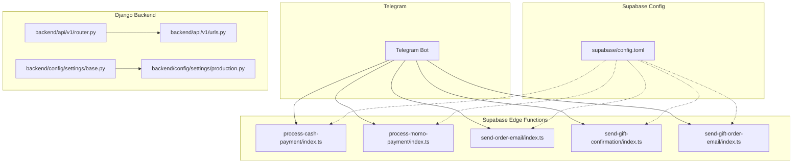
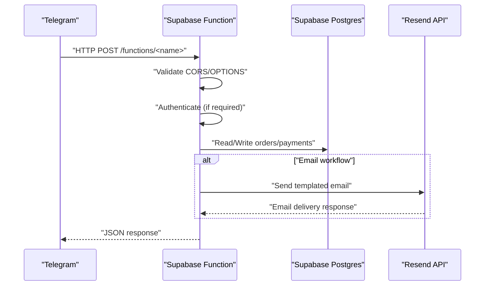
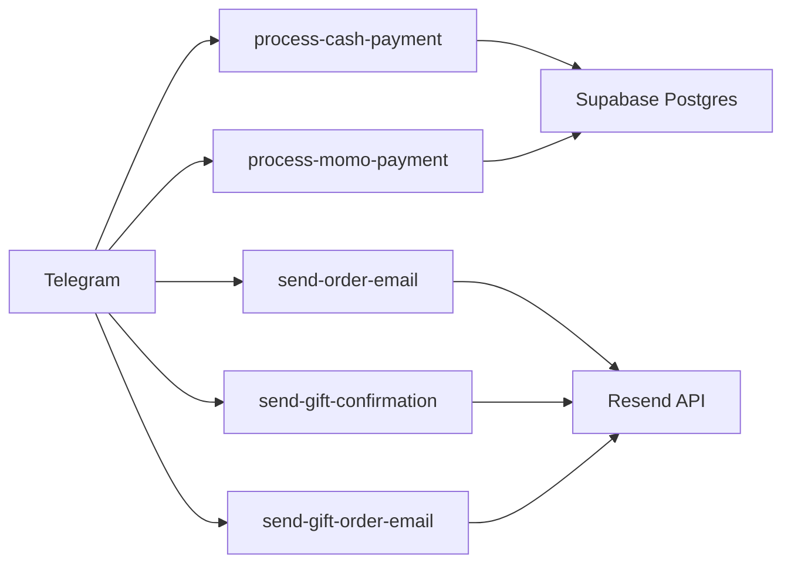

# Bot Webhook Configuration

<cite>
**Referenced Files in This Document**
- [router.py](file://backend/api/v1/router.py)
- [urls.py](file://backend/api/v1/urls.py)
- [base.py](file://backend/config/settings/base.py)
- [production.py](file://backend/config/settings/production.py)
- [config.toml](file://supabase/config.toml)
- [index.ts](file://supabase/functions/process-cash-payment/index.ts)
- [index.ts](file://supabase/functions/process-momo-payment/index.ts)
- [index.ts](file://supabase/functions/send-gift-confirmation/index.ts)
- [index.ts](file://supabase/functions/send-gift-order-email/index.ts)
- [index.ts](file://supabase/functions/send-order-email/index.ts)
</cite>

## Table of Contents
1. [Introduction](#introduction)
2. [Project Structure](#project-structure)
3. [Core Components](#core-components)
4. [Architecture Overview](#architecture-overview)
5. [Detailed Component Analysis](#detailed-component-analysis)
6. [Dependency Analysis](#dependency-analysis)
7. [Performance Considerations](#performance-considerations)
8. [Troubleshooting Guide](#troubleshooting-guide)
9. [Conclusion](#conclusion)
10. [Appendices](#appendices)

## Introduction
This document explains how to configure and operate Telegram bot webhooks for the Empindu platform. It covers webhook URL endpoints, security tokens, SSL requirements, payload structures, message parsing, response handling, and integration with Supabase Edge Functions for payment processing and order confirmation workflows. It also includes verification methods, rate limiting considerations, error handling strategies, routing logic, message filtering, priority handling for different conversation types, testing procedures, local development setup, production deployment considerations, and troubleshooting guidance.

## Project Structure
The webhook-related logic is implemented as Supabase Edge Functions written in TypeScript. These functions expose HTTPS endpoints that Telegram can POST messages to. Supporting Django API routes and settings define CORS and authentication contexts for the broader backend.

**Diagram sources**
- [router.py:1-40](file://backend/api/v1/router.py#L1-L40)
- [urls.py:1-10](file://backend/api/v1/urls.py#L1-L10)
- [base.py:1-287](file://backend/config/settings/base.py#L1-L287)
- [production.py:1-33](file://backend/config/settings/production.py#L1-L33)
- [config.toml:1-17](file://supabase/config.toml#L1-L17)
- [index.ts:1-114](file://supabase/functions/process-cash-payment/index.ts#L1-L114)
- [index.ts:1-151](file://supabase/functions/process-momo-payment/index.ts#L1-L151)
- [index.ts:1-284](file://supabase/functions/send-order-email/index.ts#L1-L284)
- [index.ts:1-219](file://supabase/functions/send-gift-confirmation/index.ts#L1-L219)
- [index.ts:1-217](file://supabase/functions/send-gift-order-email/index.ts#L1-L217)

**Section sources**
- [router.py:1-40](file://backend/api/v1/router.py#L1-L40)
- [urls.py:1-10](file://backend/api/v1/urls.py#L1-L10)
- [base.py:166-176](file://backend/config/settings/base.py#L166-L176)
- [production.py:10-22](file://backend/config/settings/production.py#L10-L22)
- [config.toml:1-17](file://supabase/config.toml#L1-L17)

## Core Components
- Supabase Edge Functions: HTTP-triggered handlers that accept Telegram webhook payloads, parse messages, and orchestrate downstream actions such as payment creation, order updates, and email notifications.
- Supabase Function Configuration: Controls JWT verification per function via [supabase/config.toml:3-16](file://supabase/config.toml#L3-L16).
- Django Settings: Define CORS and security headers that may influence cross-origin requests to backend services.

Key responsibilities:
- Validate incoming requests and handle CORS preflight.
- Parse Telegram message payloads and route to appropriate workflows.
- Call Supabase Postgres tables to persist state and update order/payment records.
- Send templated emails via Resend API.
- Return structured JSON responses to Telegram.

**Section sources**
- [config.toml:3-16](file://supabase/config.toml#L3-L16)
- [base.py:166-176](file://backend/config/settings/base.py#L166-L176)
- [production.py:15-22](file://backend/config/settings/production.py#L15-L22)

## Architecture Overview
The Telegram webhook posts JSON payloads to Supabase Edge Function endpoints. Each function validates the request, authenticates if required, parses the payload, interacts with Supabase tables, and responds to Telegram. Some functions trigger asynchronous background tasks to update statuses later.

**Diagram sources**
- [index.ts:19-113](file://supabase/functions/process-cash-payment/index.ts#L19-L113)
- [index.ts:17-150](file://supabase/functions/process-momo-payment/index.ts#L17-L150)
- [index.ts:165-281](file://supabase/functions/send-order-email/index.ts#L165-L281)
- [index.ts:15-218](file://supabase/functions/send-gift-confirmation/index.ts#L15-L218)
- [index.ts:109-216](file://supabase/functions/send-gift-order-email/index.ts#L109-L216)

## Detailed Component Analysis

### Supabase Function: process-cash-payment
Purpose:
- Accept cash payment initiation for an order.
- Create a payment record with a generated transaction reference.
- Update order status to confirmed.
- Optionally include pickup location details for pickup orders.
- Return a structured JSON response to Telegram.

Security and CORS:
- Handles OPTIONS preflight.
- Uses service role credentials to write to Supabase tables.

Payload structure:
- Fields include order identifier, amount, customer name, phone, delivery method, optional delivery address/pickup location.

Response handling:
- On success: returns success flag, payment identifiers, delivery method, amount due, and optional pickup details.
- On failure: returns error with HTTP 500.

Asynchronous behavior:
- No background task in this function; immediate completion.

**Section sources**
- [index.ts:9-17](file://supabase/functions/process-cash-payment/index.ts#L9-L17)
- [index.ts:19-113](file://supabase/functions/process-cash-payment/index.ts#L19-L113)

### Supabase Function: process-momo-payment
Purpose:
- Validate phone number format for Uganda.
- Normalize phone number to international format.
- Create a payment record with a unique transaction reference.
- Simulate payment initiation and set status to processing.
- Schedule a background task to mark payment as completed and order as confirmed after a delay.

Security and CORS:
- Handles OPTIONS preflight.
- Uses service role credentials.

Validation:
- Enforces phone number regex for Uganda (+256, starts with 7, 9 digits).

Response handling:
- On success: returns success flag, payment identifiers, provider, and message instructing the customer to confirm on their phone.
- On validation error: returns 400 with error message.
- On failure: returns error with HTTP 500.

Background task:
- Updates payment to completed and order to confirmed after a simulated delay.

**Section sources**
- [index.ts:9-15](file://supabase/functions/process-momo-payment/index.ts#L9-L15)
- [index.ts:17-150](file://supabase/functions/process-momo-payment/index.ts#L17-L150)

### Supabase Function: send-order-email
Purpose:
- Send order confirmation/status update/shipped emails.
- Authenticate caller via JWT and authorize based on order ownership or admin role.
- Build HTML email content based on type and order details.
- Deliver via Resend API.

Security and CORS:
- Validates Authorization header and verifies JWT.
- Verifies user is either order owner or admin.
- Handles OPTIONS preflight.

Payload structure:
- Fields include type (confirmation, status_update, shipped), customer email, customer name, order identifier, optional items, shipping address, new status, tracking info.

Response handling:
- On success: returns success flag and email response.
- On unauthorized/forbidden/not found: returns appropriate HTTP errors.

**Section sources**
- [index.ts:17-27](file://supabase/functions/send-order-email/index.ts#L17-L27)
- [index.ts:165-281](file://supabase/functions/send-order-email/index.ts#L165-L281)

### Supabase Function: send-gift-confirmation
Purpose:
- Send a confirmation email for a corporate gift order submission.
- Verify JWT claims and ownership of the gift order.
- Build HTML email content with items and recipients.
- Deliver via Resend API.

Security and CORS:
- Validates Authorization header and checks claims.
- Verifies ownership of the gift order.
- Handles OPTIONS preflight.

Payload structure:
- Fields include gift order identifier.

Response handling:
- On success: returns success flag.
- On missing authorization, unauthorized, forbidden, or not found: returns appropriate HTTP errors.

**Section sources**
- [index.ts:11-13](file://supabase/functions/send-gift-confirmation/index.ts#L11-L13)
- [index.ts:15-218](file://supabase/functions/send-gift-confirmation/index.ts#L15-L218)

### Supabase Function: send-gift-order-email
Purpose:
- Send status update emails for corporate gift orders.
- Verify admin role and ownership of the gift order.
- Build HTML email content based on status.
- Deliver via Resend API.

Security and CORS:
- Validates Authorization header and checks claims.
- Verifies admin role.
- Handles OPTIONS preflight.

Payload structure:
- Fields include gift order identifier and new status.

Response handling:
- On success: returns success flag.
- On missing authorization, unauthorized, forbidden, or not found: returns appropriate HTTP errors.

**Section sources**
- [index.ts:11-14](file://supabase/functions/send-gift-order-email/index.ts#L11-L14)
- [index.ts:109-216](file://supabase/functions/send-gift-order-email/index.ts#L109-L216)

### Supabase Function Configuration (JWT Verification)
Supabase Edge Functions can be configured to require JWT verification per function. The current configuration disables JWT verification for all functions.

Implications:
- Requests can be made without a JWT.
- For sensitive operations, enable JWT verification and enforce role-based access within the function.

**Section sources**
- [config.toml:3-16](file://supabase/config.toml#L3-L16)

## Dependency Analysis
- Telegram posts to Supabase Edge Function endpoints.
- Functions depend on Supabase client libraries to connect to Postgres.
- Email functions depend on Resend API for sending emails.
- Background tasks are scheduled within function code (non-blocking) to update statuses.

**Diagram sources**
- [index.ts:25-28](file://supabase/functions/process-cash-payment/index.ts#L25-L28)
- [index.ts:24-26](file://supabase/functions/process-momo-payment/index.ts#L24-L26)
- [index.ts:184-189](file://supabase/functions/send-order-email/index.ts#L184-L189)
- [index.ts:31-33](file://supabase/functions/send-gift-confirmation/index.ts#L31-L33)
- [index.ts:125-127](file://supabase/functions/send-gift-order-email/index.ts#L125-L127)

**Section sources**
- [index.ts:25-28](file://supabase/functions/process-cash-payment/index.ts#L25-L28)
- [index.ts:24-26](file://supabase/functions/process-momo-payment/index.ts#L24-L26)
- [index.ts:184-189](file://supabase/functions/send-order-email/index.ts#L184-L189)
- [index.ts:31-33](file://supabase/functions/send-gift-confirmation/index.ts#L31-L33)
- [index.ts:125-127](file://supabase/functions/send-gift-order-email/index.ts#L125-L127)

## Performance Considerations
- Asynchronous background tasks: The MoMo payment function schedules a background task to update payment and order status after a delay. This avoids blocking the initial HTTP response.
- CORS preflight: All functions handle OPTIONS requests to avoid preflight failures.
- Response size: Email functions construct HTML bodies; keep payloads minimal to reduce latency.
- Rate limiting: Configure at the platform level (e.g., Supabase Edge Functions limits) and consider application-level throttling if needed.

[No sources needed since this section provides general guidance]

## Troubleshooting Guide
Common issues and resolutions:
- Missing authorization header:
  - Symptom: 401 Unauthorized.
  - Resolution: Ensure requests include a valid Authorization header when required by the function.
- Invalid phone number format:
  - Symptom: 400 Bad Request with validation error.
  - Resolution: Ensure phone numbers match the expected Uganda format.
- Not found resources:
  - Symptom: 404 Not Found for orders or gift orders.
  - Resolution: Verify identifiers and permissions.
- Forbidden access:
  - Symptom: 403 Forbidden when attempting admin-only operations.
  - Resolution: Confirm user role and ownership.
- Email delivery failures:
  - Symptom: 500 Internal Server Error from email function.
  - Resolution: Check Resend API key and network connectivity; inspect logs for detailed error messages.
- CORS errors:
  - Symptom: Browser/network preflight failures.
  - Resolution: Ensure Access-Control-Allow-Origin and headers are present; verify Supabase function CORS configuration.

**Section sources**
- [index.ts:33-40](file://supabase/functions/process-momo-payment/index.ts#L33-L40)
- [index.ts:174-199](file://supabase/functions/send-order-email/index.ts#L174-L199)
- [index.ts:21-42](file://supabase/functions/send-gift-confirmation/index.ts#L21-L42)
- [index.ts:115-147](file://supabase/functions/send-gift-order-email/index.ts#L115-L147)
- [index.ts:247-266](file://supabase/functions/send-order-email/index.ts#L247-L266)

## Conclusion
The Telegram bot webhook integration leverages Supabase Edge Functions to process payments, manage orders, and send emails. Functions are designed to handle CORS, authentication, validation, and asynchronous updates. For production, enable JWT verification where appropriate, secure endpoints with HTTPS, and monitor function logs and Resend delivery reports.

[No sources needed since this section summarizes without analyzing specific files]

## Appendices

### Webhook URL Endpoints
- Base URL: Supabase Edge Functions endpoint for your project.
- Endpoints:
  - /functions/process-cash-payment
  - /functions/process-momo-payment
  - /functions/send-order-email
  - /functions/send-gift-confirmation
  - /functions/send-gift-order-email

Notes:
- Replace placeholders with your Supabase project domain.
- Ensure HTTPS is enforced in production.

**Section sources**
- [config.toml:1-17](file://supabase/config.toml#L1-L17)

### Security Token Configuration
- JWT verification: Disabled for all functions in [supabase/config.toml:3-16](file://supabase/config.toml#L3-L16).
- Recommendation: Enable JWT verification per function and enforce role-based access within handlers.

**Section sources**
- [config.toml:3-16](file://supabase/config.toml#L3-L16)

### SSL Certificate Requirements
- Production settings enforce SSL redirect and secure cookies in Django.
- Ensure your domain serves HTTPS for Telegram webhook URLs.

**Section sources**
- [production.py:15-22](file://backend/config/settings/production.py#L15-L22)

### Webhook Payload Structure
- process-cash-payment:
  - Fields: order identifier, amount, customer name, phone, delivery method, optional delivery address/pickup location.
- process-momo-payment:
  - Fields: order identifier, amount, phone number, provider (mtn or airtel), customer name.
- send-order-email:
  - Fields: type, customer email, customer name, order identifier, optional items, shipping address, new status, tracking info.
- send-gift-confirmation:
  - Fields: gift order identifier.
- send-gift-order-email:
  - Fields: gift order identifier, new status.

**Section sources**
- [index.ts:9-17](file://supabase/functions/process-cash-payment/index.ts#L9-L17)
- [index.ts:9-15](file://supabase/functions/process-momo-payment/index.ts#L9-L15)
- [index.ts:17-27](file://supabase/functions/send-order-email/index.ts#L17-L27)
- [index.ts:11-13](file://supabase/functions/send-gift-confirmation/index.ts#L11-L13)
- [index.ts:11-14](file://supabase/functions/send-gift-order-email/index.ts#L11-L14)

### Message Parsing Mechanisms
- All functions parse JSON payloads from the request body.
- Validation steps:
  - Phone number normalization and format validation for MoMo payments.
  - Ownership and role checks for email functions.
- Responses:
  - JSON with success/error fields and relevant metadata.

**Section sources**
- [index.ts:28-48](file://supabase/functions/process-momo-payment/index.ts#L28-L48)
- [index.ts:203-212](file://supabase/functions/send-order-email/index.ts#L203-L212)
- [index.ts:46-74](file://supabase/functions/send-gift-confirmation/index.ts#L46-L74)

### Response Handling Patterns
- Standardized JSON response with success flag and contextual data.
- Error responses include an error message and appropriate HTTP status codes.
- OPTIONS preflight responses return empty body with CORS headers.

**Section sources**
- [index.ts:92-112](file://supabase/functions/process-cash-payment/index.ts#L92-L112)
- [index.ts:131-149](file://supabase/functions/process-momo-payment/index.ts#L131-L149)
- [index.ts:270-280](file://supabase/functions/send-order-email/index.ts#L270-L280)

### Integration with Supabase Functions
- Payment processing:
  - Create payment records and update order status.
  - Simulate payment completion with background task.
- Order confirmation and updates:
  - Build HTML templates and send via Resend.
- Gift order workflows:
  - Confirmation and status update emails with admin authorization.

**Section sources**
- [index.ts:44-72](file://supabase/functions/process-cash-payment/index.ts#L44-L72)
- [index.ts:53-71](file://supabase/functions/process-momo-payment/index.ts#L53-L71)
- [index.ts:245-268](file://supabase/functions/send-order-email/index.ts#L245-L268)
- [index.ts:183-201](file://supabase/functions/send-gift-confirmation/index.ts#L183-L201)
- [index.ts:181-199](file://supabase/functions/send-gift-order-email/index.ts#L181-L199)

### Webhook Verification Methods
- Enable JWT verification in [supabase/config.toml:3-16](file://supabase/config.toml#L3-L16) per function.
- Within handlers, verify Authorization header and user claims/roles.
- For payment functions, validate payload fields and normalize phone numbers.

**Section sources**
- [config.toml:3-16](file://supabase/config.toml#L3-L16)
- [index.ts:33-40](file://supabase/functions/process-momo-payment/index.ts#L33-L40)
- [index.ts:174-199](file://supabase/functions/send-order-email/index.ts#L174-L199)

### Rate Limiting Considerations
- Apply platform-level limits (e.g., Supabase Edge Functions quotas).
- Implement application-level throttling if Telegram sends bursts.
- Monitor function logs and email delivery metrics.

[No sources needed since this section provides general guidance]

### Error Handling Strategies
- Validate inputs early and return 400/401/403/404 as appropriate.
- Log detailed errors and return concise messages to clients.
- Ensure CORS preflight succeeds to avoid browser-side failures.

**Section sources**
- [index.ts:33-40](file://supabase/functions/process-momo-payment/index.ts#L33-L40)
- [index.ts:174-199](file://supabase/functions/send-order-email/index.ts#L174-L199)

### Webhook Routing Logic and Priority
- Routing:
  - Telegram posts to function-specific endpoints.
  - Functions parse payloads and dispatch to internal logic.
- Priority:
  - Payment functions take precedence for payment-related commands.
  - Email functions prioritize order ownership or admin roles.

**Section sources**
- [index.ts:19-113](file://supabase/functions/process-cash-payment/index.ts#L19-L113)
- [index.ts:17-150](file://supabase/functions/process-momo-payment/index.ts#L17-L150)
- [index.ts:214-241](file://supabase/functions/send-order-email/index.ts#L214-L241)

### Message Filtering and Conversation Types
- Filter by payload fields and command patterns within functions.
- Different conversation types (orders, gifts, payments) mapped to distinct endpoints and handlers.

**Section sources**
- [index.ts:9-17](file://supabase/functions/process-cash-payment/index.ts#L9-L17)
- [index.ts:9-15](file://supabase/functions/process-momo-payment/index.ts#L9-L15)
- [index.ts:11-13](file://supabase/functions/send-gift-confirmation/index.ts#L11-L13)

### Testing Procedures
- Local development:
  - Use curl or similar to POST to function endpoints with JSON payloads.
  - Verify CORS headers and response codes.
- Production:
  - Set up Telegram webhook URL pointing to Supabase function endpoint.
  - Monitor logs and email delivery reports.

[No sources needed since this section provides general guidance]

### Local Development Setup
- Backend:
  - Django settings define CORS origins and security headers.
- Supabase functions:
  - Deploy locally using Supabase CLI and test with curl.

**Section sources**
- [base.py:166-176](file://backend/config/settings/base.py#L166-L176)
- [production.py:15-22](file://backend/config/settings/production.py#L15-L22)

### Production Deployment Considerations
- Enforce HTTPS and secure cookies.
- Enable JWT verification for sensitive functions.
- Monitor Supabase function logs and Resend delivery status.
- Configure domain and SSL certificates for webhook URLs.

**Section sources**
- [production.py:15-22](file://backend/config/settings/production.py#L15-L22)
- [config.toml:3-16](file://supabase/config.toml#L3-L16)