# Customer Service Automation

<cite>
**Referenced Files in This Document**
- [backend/api/v1/router.py](file://backend/api/v1/router.py)
- [backend/api/v1/urls.py](file://backend/api/v1/urls.py)
- [backend/api/v1/orders.py](file://backend/api/v1/orders.py)
- [backend/apps/artisans/models.py](file://backend/apps/artisans/models.py)
- [backend/apps/products/models.py](file://backend/apps/products/models.py)
- [backend/apps/orders/models.py](file://backend/apps/orders/models.py)
- [backend/apps/notifications/__init__.py](file://backend/apps/notifications/__init__.py)
- [backend/apps/telegram_bot/__init__.py](file://backend/apps/telegram_bot/__init__.py)
- [supabase/functions/send-order-email/index.ts](file://supabase/functions/send-order-email/index.ts)
- [supabase/functions/send-gift-order-email/index.ts](file://supabase/functions/send-gift-order-email/index.ts)
- [supabase/functions/send-gift-confirmation/index.ts](file://supabase/functions/send-gift-confirmation/index.ts)
- [backend/staticfiles/modeltranslation/js/tabbed_translation_fields.js](file://backend/staticfiles/modeltranslation/js/tabbed_translation_fields.js)
</cite>

## Table of Contents
1. [Introduction](#introduction)
2. [Project Structure](#project-structure)
3. [Core Components](#core-components)
4. [Architecture Overview](#architecture-overview)
5. [Detailed Component Analysis](#detailed-component-analysis)
6. [Dependency Analysis](#dependency-analysis)
7. [Performance Considerations](#performance-considerations)
8. [Troubleshooting Guide](#troubleshooting-guide)
9. [Conclusion](#conclusion)
10. [Appendices](#appendices)

## Introduction
This document describes the customer service automation system integrated with Telegram for the Empindu artisan marketplace. It covers automated response workflows, conversation starters, FAQ handling, order update notifications, multilingual support, message templating, dynamic content generation, automated ticketing, escalation to human agents, and integration with product catalogs, order history, and artisan profiles. It also provides guidelines for customizing automated responses and managing conversation contexts.

## Project Structure
The customer service automation spans three primary areas:
- Backend API and data models for orders, artisans, and products
- Notification functions for order and gift updates via email
- Telegram bot placeholder for future integration

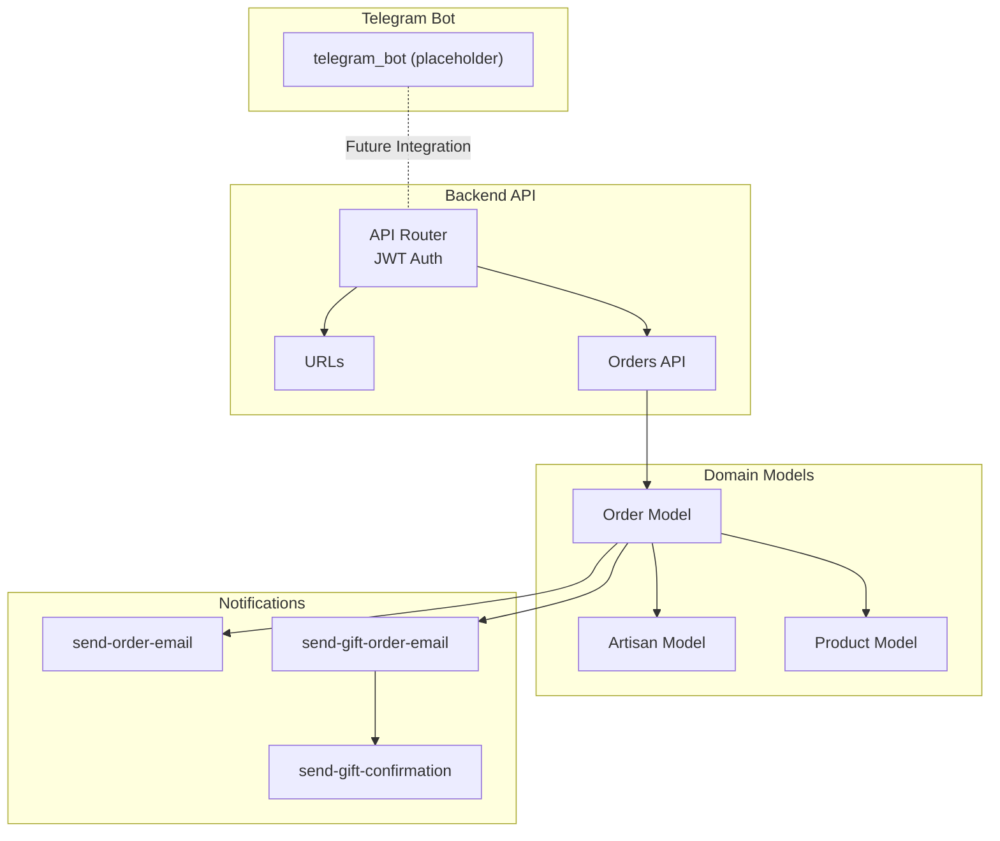

**Diagram sources**
- [backend/api/v1/router.py:1-40](file://backend/api/v1/router.py#L1-L40)
- [backend/api/v1/urls.py:1-10](file://backend/api/v1/urls.py#L1-L10)
- [backend/api/v1/orders.py:1-18](file://backend/api/v1/orders.py#L1-L18)
- [backend/apps/orders/models.py:1-122](file://backend/apps/orders/models.py#L1-L122)
- [backend/apps/artisans/models.py:1-170](file://backend/apps/artisans/models.py#L1-L170)
- [backend/apps/products/models.py:1-153](file://backend/apps/products/models.py#L1-L153)
- [supabase/functions/send-order-email/index.ts:1-283](file://supabase/functions/send-order-email/index.ts#L1-L283)
- [supabase/functions/send-gift-order-email/index.ts:142-216](file://supabase/functions/send-gift-order-email/index.ts#L142-L216)
- [supabase/functions/send-gift-confirmation/index.ts:15-38](file://supabase/functions/send-gift-confirmation/index.ts#L15-L38)
- [backend/apps/telegram_bot/__init__.py:1-2](file://backend/apps/telegram_bot/__init__.py#L1-L2)

**Section sources**
- [backend/api/v1/router.py:1-40](file://backend/api/v1/router.py#L1-L40)
- [backend/api/v1/urls.py:1-10](file://backend/api/v1/urls.py#L1-L10)
- [backend/api/v1/orders.py:1-18](file://backend/api/v1/orders.py#L1-L18)
- [backend/apps/orders/models.py:1-122](file://backend/apps/orders/models.py#L1-L122)
- [backend/apps/artisans/models.py:1-170](file://backend/apps/artisans/models.py#L1-L170)
- [backend/apps/products/models.py:1-153](file://backend/apps/products/models.py#L1-L153)
- [backend/apps/telegram_bot/__init__.py:1-2](file://backend/apps/telegram_bot/__init__.py#L1-L2)

## Core Components
- API v1 Router and URLs: Centralized routing and JWT authentication for API endpoints.
- Orders API: Placeholder for order-related endpoints (to be implemented).
- Domain Models: Order, Artisan, and Product models define the data and relationships used for contextual responses and notifications.
- Notifications: Supabase Edge Functions handle order and gift email notifications.
- Telegram Bot: Placeholder app indicating future Telegram integration.

Key capabilities:
- Multilingual content via modeltranslation fields on artisan and product models.
- Dynamic content generation using order and product data.
- Context-aware responses leveraging order history and artisan profiles.

**Section sources**
- [backend/api/v1/router.py:10-28](file://backend/api/v1/router.py#L10-L28)
- [backend/api/v1/urls.py:7-9](file://backend/api/v1/urls.py#L7-L9)
- [backend/api/v1/orders.py:10-17](file://backend/api/v1/orders.py#L10-L17)
- [backend/apps/orders/models.py:16-122](file://backend/apps/orders/models.py#L16-L122)
- [backend/apps/artisans/models.py:87-121](file://backend/apps/artisans/models.py#L87-L121)
- [backend/apps/products/models.py:36-79](file://backend/apps/products/models.py#L36-L79)
- [supabase/functions/send-order-email/index.ts:17-283](file://supabase/functions/send-order-email/index.ts#L17-L283)
- [supabase/functions/send-gift-order-email/index.ts:142-216](file://supabase/functions/send-gift-order-email/index.ts#L142-L216)
- [backend/apps/telegram_bot/__init__.py:1-2](file://backend/apps/telegram_bot/__init__.py#L1-L2)

## Architecture Overview
The customer service automation relies on:
- API gateway with JWT authentication
- Domain models for order, artisan, and product
- Notification functions triggered by order events
- Future Telegram bot integration for conversational automation

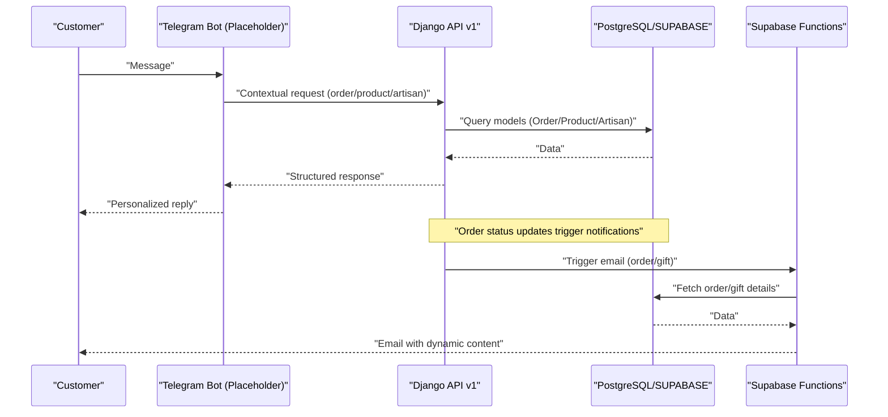

**Diagram sources**
- [backend/api/v1/router.py:22-28](file://backend/api/v1/router.py#L22-L28)
- [backend/apps/orders/models.py:108-122](file://backend/apps/orders/models.py#L108-L122)
- [backend/apps/artisans/models.py:132-150](file://backend/apps/artisans/models.py#L132-L150)
- [backend/apps/products/models.py:88-99](file://backend/apps/products/models.py#L88-L99)
- [supabase/functions/send-order-email/index.ts:165-283](file://supabase/functions/send-order-email/index.ts#L165-L283)
- [supabase/functions/send-gift-order-email/index.ts:142-216](file://supabase/functions/send-gift-order-email/index.ts#L142-L216)

## Detailed Component Analysis

### API v1 Router and Authentication
- JWT bearer authentication is implemented for protected endpoints.
- API instance registers routers for artisans, products, orders, and gifting.

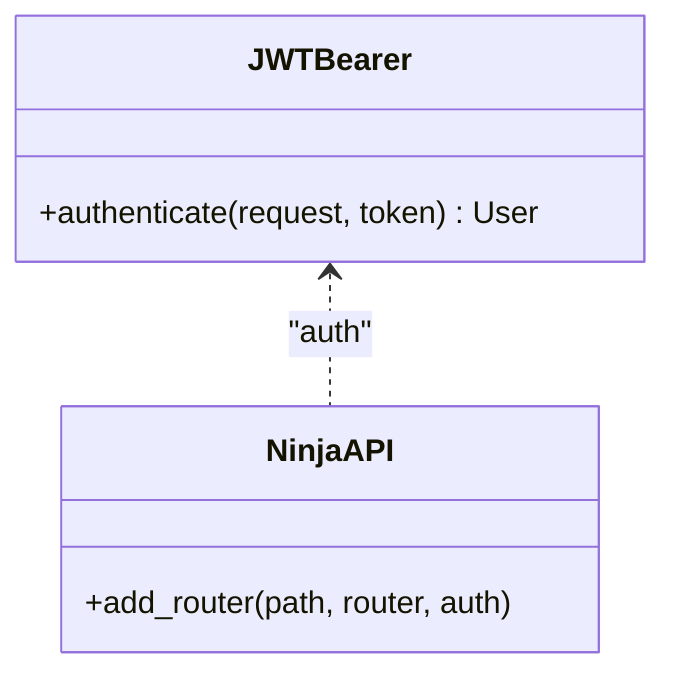

**Diagram sources**
- [backend/api/v1/router.py:10-18](file://backend/api/v1/router.py#L10-L18)
- [backend/api/v1/router.py:22-28](file://backend/api/v1/router.py#L22-L28)

**Section sources**
- [backend/api/v1/router.py:10-18](file://backend/api/v1/router.py#L10-L18)
- [backend/api/v1/router.py:22-28](file://backend/api/v1/router.py#L22-L28)

### Orders API (Placeholder)
- Exposes GET and POST endpoints for orders with placeholder messages.
- To be extended with order retrieval, creation, and status updates.

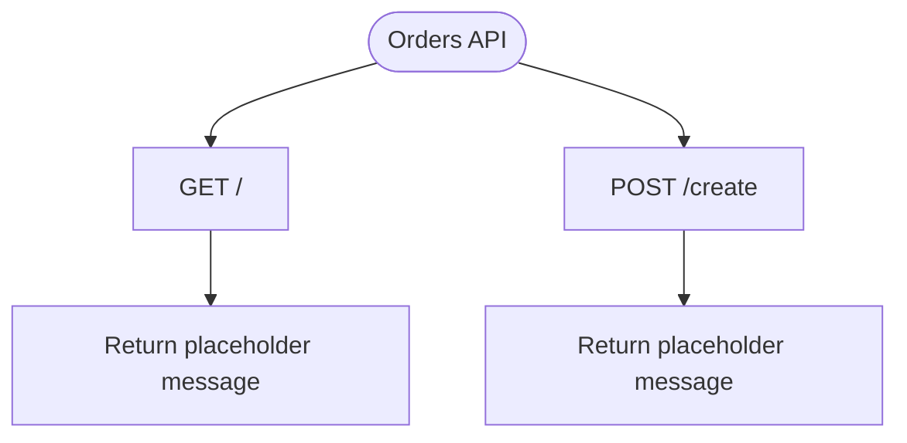

**Diagram sources**
- [backend/api/v1/orders.py:10-17](file://backend/api/v1/orders.py#L10-L17)

**Section sources**
- [backend/api/v1/orders.py:10-17](file://backend/api/v1/orders.py#L10-L17)

### Orders Model
- Defines order lifecycle statuses, payment methods, payout status, gift flag, quantities, financial snapshots, shipping info, and timestamps.
- Links to Product and Artisan models and supports order history queries.

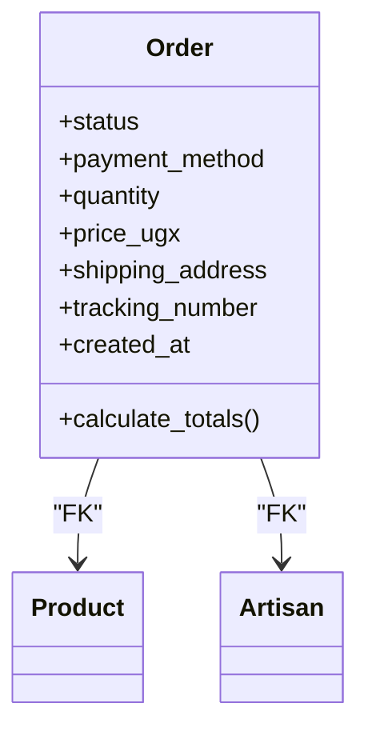

**Diagram sources**
- [backend/apps/orders/models.py:16-122](file://backend/apps/orders/models.py#L16-L122)
- [backend/apps/products/models.py:24-30](file://backend/apps/products/models.py#L24-L30)
- [backend/apps/artisans/models.py:62-110](file://backend/apps/artisans/models.py#L62-L110)

**Section sources**
- [backend/apps/orders/models.py:16-122](file://backend/apps/orders/models.py#L16-L122)

### Artisans Model
- Stores artisan identity, certifications, multilingual biographies, location, contact details, and Telegram chat ID.
- Provides computed properties for earnings and order counts.

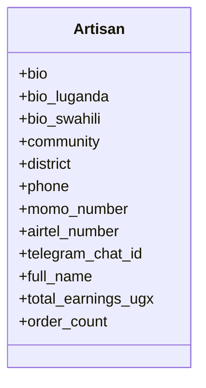

**Diagram sources**
- [backend/apps/artisans/models.py:87-121](file://backend/apps/artisans/models.py#L87-L121)
- [backend/apps/artisans/models.py:132-150](file://backend/apps/artisans/models.py#L132-L150)

**Section sources**
- [backend/apps/artisans/models.py:87-121](file://backend/apps/artisans/models.py#L87-L121)
- [backend/apps/artisans/models.py:132-150](file://backend/apps/artisans/models.py#L132-L150)

### Products Model
- Stores product identity, multilingual stories, pricing, inventory, customization options, shipping weight, and semantic embeddings.
- Links to artisan and craft tradition.

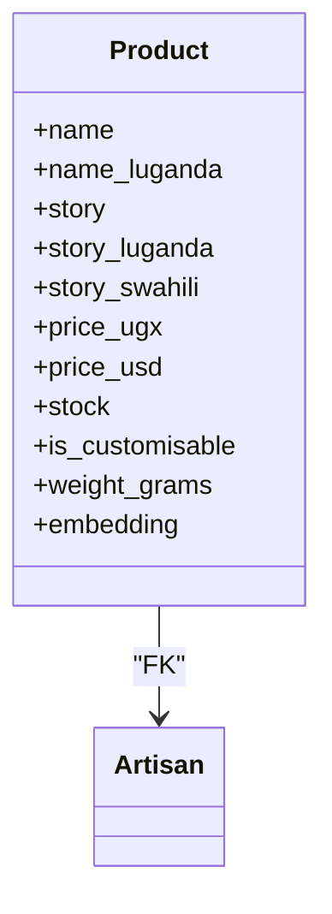

**Diagram sources**
- [backend/apps/products/models.py:36-79](file://backend/apps/products/models.py#L36-L79)
- [backend/apps/products/models.py:24-30](file://backend/apps/products/models.py#L24-L30)

**Section sources**
- [backend/apps/products/models.py:36-79](file://backend/apps/products/models.py#L36-L79)

### Notifications: Order Email Function
- Handles order confirmation, status updates, and shipping notifications.
- Uses dynamic HTML templates with customer name, order items, shipping address, and tracking info.
- Enforces authorization checks against order ownership or admin role.

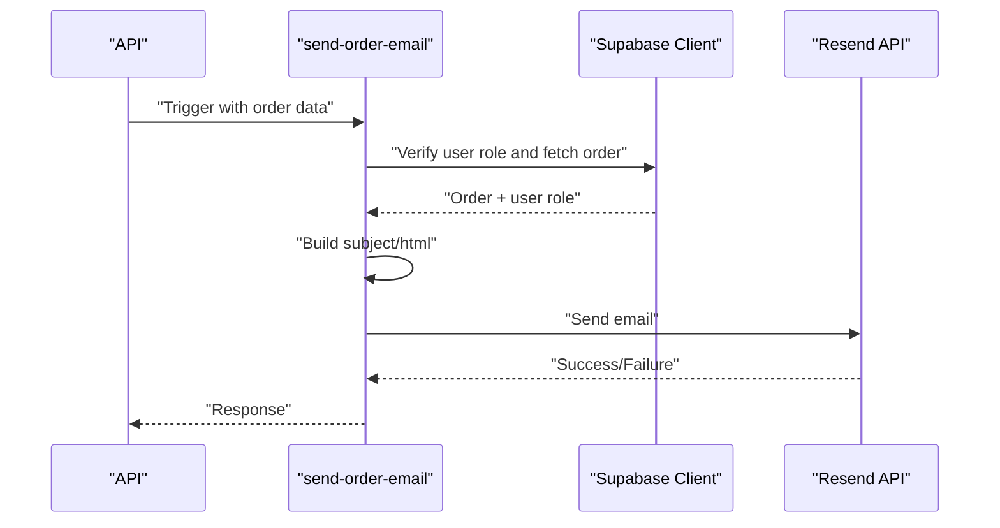

**Diagram sources**
- [supabase/functions/send-order-email/index.ts:165-283](file://supabase/functions/send-order-email/index.ts#L165-L283)

**Section sources**
- [supabase/functions/send-order-email/index.ts:17-283](file://supabase/functions/send-order-email/index.ts#L17-L283)

### Notifications: Gift Order and Gift Confirmation
- Gift order email function builds corporate gifting notifications and sends via Resend.
- Gift confirmation function validates JWT and triggers confirmation emails.

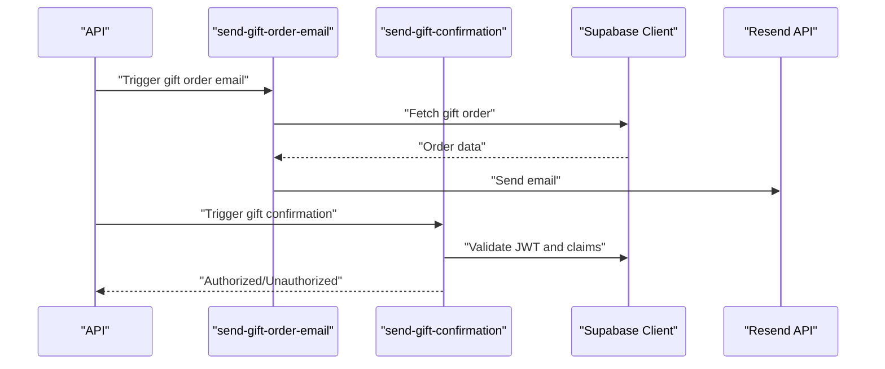

**Diagram sources**
- [supabase/functions/send-gift-order-email/index.ts:142-216](file://supabase/functions/send-gift-order-email/index.ts#L142-L216)
- [supabase/functions/send-gift-confirmation/index.ts:15-38](file://supabase/functions/send-gift-confirmation/index.ts#L15-L38)

**Section sources**
- [supabase/functions/send-gift-order-email/index.ts:142-216](file://supabase/functions/send-gift-order-email/index.ts#L142-L216)
- [supabase/functions/send-gift-confirmation/index.ts:15-38](file://supabase/functions/send-gift-confirmation/index.ts#L15-L38)

### Telegram Bot Integration (Placeholder)
- The telegram_bot app is currently a placeholder indicating future implementation.
- Expected integration points include receiving messages, intent recognition, and sending personalized replies.

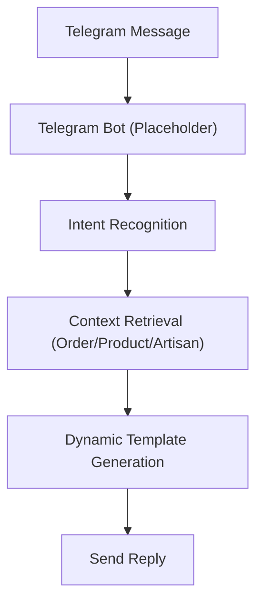

**Diagram sources**
- [backend/apps/telegram_bot/__init__.py:1-2](file://backend/apps/telegram_bot/__init__.py#L1-L2)

**Section sources**
- [backend/apps/telegram_bot/__init__.py:1-2](file://backend/apps/telegram_bot/__init__.py#L1-L2)

### Multilingual Support and Message Templating
- Multilingual fields on Artisan and Product models enable localized content.
- Notification functions build dynamic HTML using customer name and order details.
- Modeltranslation JavaScript enhances admin editing of translated fields.

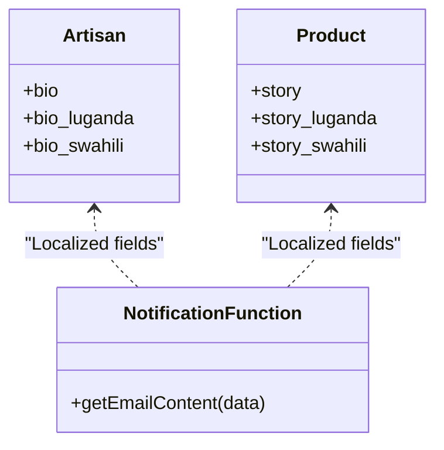

**Diagram sources**
- [backend/apps/artisans/models.py:87-95](file://backend/apps/artisans/models.py#L87-L95)
- [backend/apps/products/models.py:36-44](file://backend/apps/products/models.py#L36-L44)
- [supabase/functions/send-order-email/index.ts:29-162](file://supabase/functions/send-order-email/index.ts#L29-L162)

**Section sources**
- [backend/apps/artisans/models.py:87-95](file://backend/apps/artisans/models.py#L87-L95)
- [backend/apps/products/models.py:36-44](file://backend/apps/products/models.py#L36-L44)
- [supabase/functions/send-order-email/index.ts:29-162](file://supabase/functions/send-order-email/index.ts#L29-L162)
- [backend/staticfiles/modeltranslation/js/tabbed_translation_fields.js:60-331](file://backend/staticfiles/modeltranslation/js/tabbed_translation_fields.js#L60-L331)

### Automated Ticketing and Escalation
- Current system does not implement a dedicated ticketing module.
- Recommendation: Introduce a ticket model linked to user chats, orders, and artisans, with status transitions and human agent assignment.

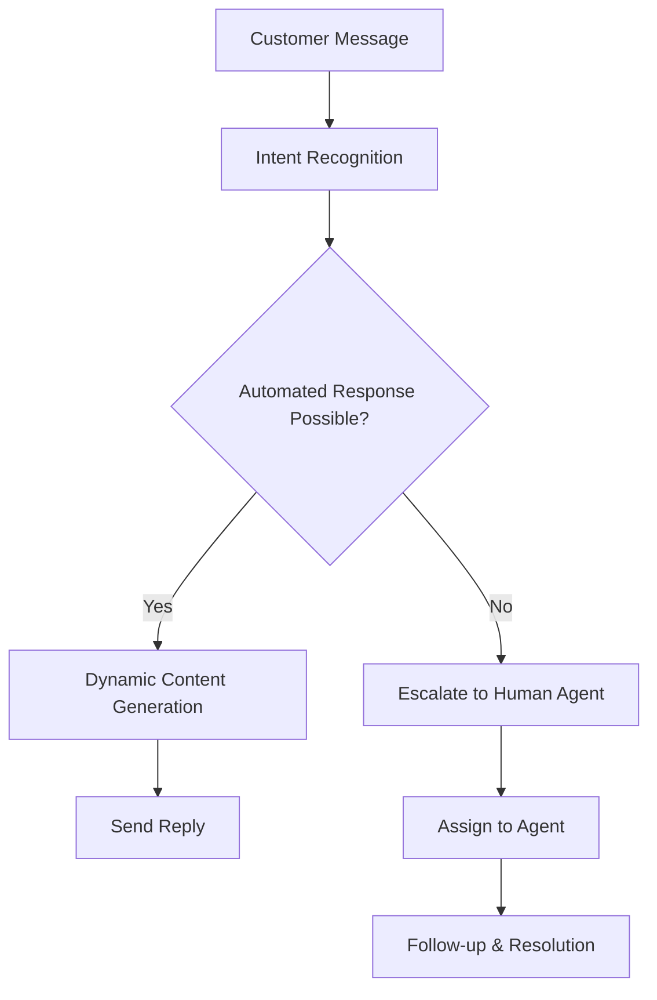

[No sources needed since this diagram shows conceptual workflow, not actual code structure]

### Conversation Flow Design and Personalization
- Use order history to personalize responses (e.g., “We noticed you purchased X before…”).
- Use artisan profiles to tailor product recommendations and storytelling.
- Use product catalogs to provide context-aware FAQs and suggestions.

[No sources needed since this section doesn't analyze specific source files]

## Dependency Analysis
- API depends on Django and NinjaAPI with JWT authentication.
- Orders model depends on Product and Artisan models.
- Notification functions depend on Supabase client and Resend API.
- Telegram bot integration is pending but will depend on the API and domain models.

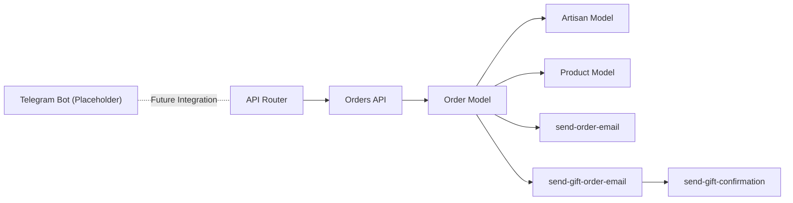

**Diagram sources**
- [backend/api/v1/router.py:22-28](file://backend/api/v1/router.py#L22-L28)
- [backend/api/v1/orders.py:10-17](file://backend/api/v1/orders.py#L10-L17)
- [backend/apps/orders/models.py:108-122](file://backend/apps/orders/models.py#L108-L122)
- [backend/apps/artisans/models.py:132-150](file://backend/apps/artisans/models.py#L132-L150)
- [backend/apps/products/models.py:88-99](file://backend/apps/products/models.py#L88-L99)
- [supabase/functions/send-order-email/index.ts:165-283](file://supabase/functions/send-order-email/index.ts#L165-L283)
- [supabase/functions/send-gift-order-email/index.ts:142-216](file://supabase/functions/send-gift-order-email/index.ts#L142-L216)
- [supabase/functions/send-gift-confirmation/index.ts:15-38](file://supabase/functions/send-gift-confirmation/index.ts#L15-L38)
- [backend/apps/telegram_bot/__init__.py:1-2](file://backend/apps/telegram_bot/__init__.py#L1-L2)

**Section sources**
- [backend/api/v1/router.py:22-28](file://backend/api/v1/router.py#L22-L28)
- [backend/api/v1/orders.py:10-17](file://backend/api/v1/orders.py#L10-L17)
- [backend/apps/orders/models.py:108-122](file://backend/apps/orders/models.py#L108-L122)
- [backend/apps/artisans/models.py:132-150](file://backend/apps/artisans/models.py#L132-L150)
- [backend/apps/products/models.py:88-99](file://backend/apps/products/models.py#L88-L99)
- [supabase/functions/send-order-email/index.ts:165-283](file://supabase/functions/send-order-email/index.ts#L165-L283)
- [supabase/functions/send-gift-order-email/index.ts:142-216](file://supabase/functions/send-gift-order-email/index.ts#L142-L216)
- [supabase/functions/send-gift-confirmation/index.ts:15-38](file://supabase/functions/send-gift-confirmation/index.ts#L15-L38)
- [backend/apps/telegram_bot/__init__.py:1-2](file://backend/apps/telegram_bot/__init__.py#L1-L2)

## Performance Considerations
- Minimize database queries by batching and caching frequently accessed order/product/artisan data.
- Use Supabase Edge Functions for low-latency notifications.
- Keep message templates concise and defer heavy computations to background tasks.

[No sources needed since this section provides general guidance]

## Troubleshooting Guide
- API Authentication Failures: Ensure JWT token is present and valid; verify user role for protected routes.
- Notification Delivery Issues: Check Resend API key and network connectivity; review function logs for errors.
- Authorization Errors: Confirm user ownership of order or admin privileges before sending order emails.

**Section sources**
- [backend/api/v1/router.py:10-18](file://backend/api/v1/router.py#L10-L18)
- [supabase/functions/send-order-email/index.ts:172-283](file://supabase/functions/send-order-email/index.ts#L172-L283)
- [supabase/functions/send-gift-order-email/index.ts:142-216](file://supabase/functions/send-gift-order-email/index.ts#L142-L216)

## Conclusion
The customer service automation foundation is established with a secure API, rich domain models, and notification functions. The Telegram bot remains a placeholder for future conversational automation. By leveraging order history, artisan profiles, and product catalogs, the system can deliver personalized, multilingual, and context-aware customer experiences. Extending the Telegram integration and formalizing ticketing and escalation workflows will complete the automation pipeline.

## Appendices

### Guidelines for Customizing Automated Responses
- Use order/product/artisan data to construct personalized replies.
- Employ multilingual fields to localize content.
- Keep templates modular and reusable across intents.

[No sources needed since this section provides general guidance]