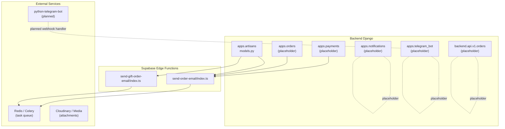
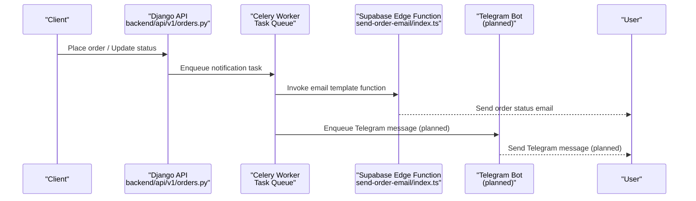
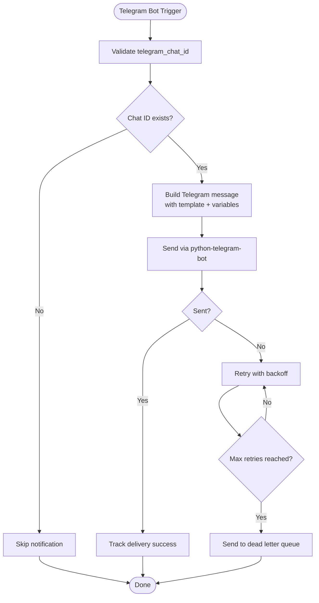
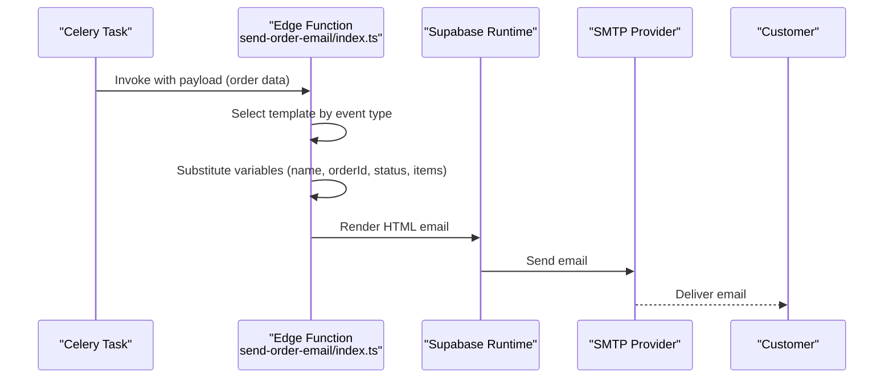
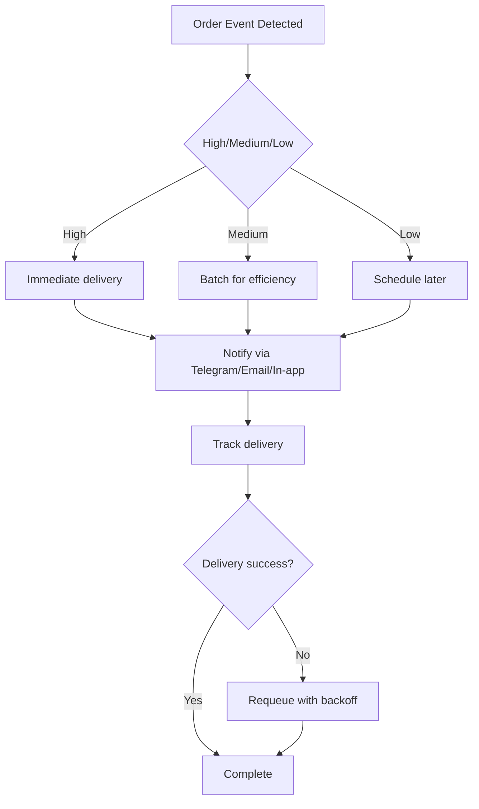
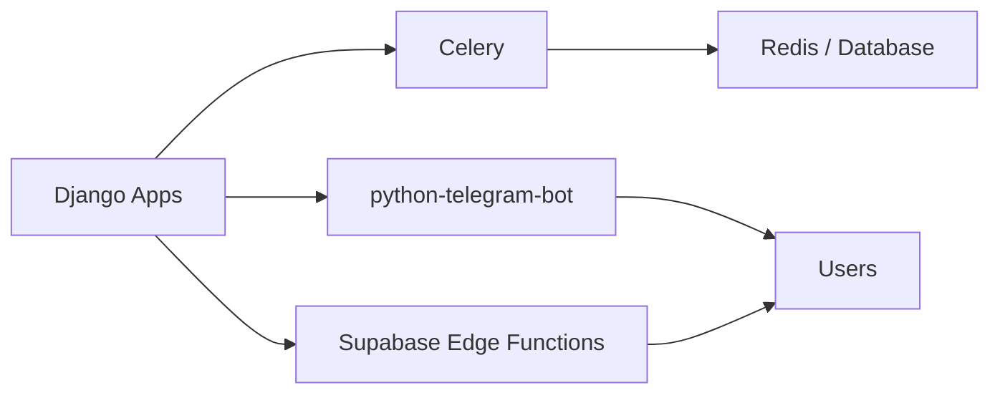

# Notification System Integration

<cite>
**Referenced Files in This Document**
- [backend/config/settings/base.py](file://backend/config/settings/base.py)
- [backend/requirements.txt](file://backend/requirements.txt)
- [backend/apps/artisans/models.py](file://backend/apps/artisans/models.py)
- [backend/apps/artisans/migrations/0001_initial.py](file://backend/apps/artisans/migrations/0001_initial.py)
- [supabase/functions/send-order-email/index.ts](file://supabase/functions/send-order-email/index.ts)
- [supabase/functions/send-gift-order-email/index.ts](file://supabase/functions/send-gift-order-email/index.ts)
- [backend/api/v1/orders.py](file://backend/api/v1/orders.py)
</cite>

## Table of Contents
1. [Introduction](#introduction)
2. [Project Structure](#project-structure)
3. [Core Components](#core-components)
4. [Architecture Overview](#architecture-overview)
5. [Detailed Component Analysis](#detailed-component-analysis)
6. [Dependency Analysis](#dependency-analysis)
7. [Performance Considerations](#performance-considerations)
8. [Troubleshooting Guide](#troubleshooting-guide)
9. [Conclusion](#conclusion)

## Introduction
This document describes the Telegram notification system integration within the broader notification ecosystem. It explains how notifications are triggered, formatted, prioritized, scheduled, and tracked, and how they integrate with order lifecycle events, payment confirmations, and shipment notifications. It also covers the message template system, variable substitution, dynamic content generation, omnichannel capabilities (email, SMS, in-app), retry mechanisms, analytics, delivery tracking, and user preference management. The current implementation includes placeholder apps for notifications and Telegram bot, and email templates for order and gift order updates.

## Project Structure
The notification system spans backend Django applications, Supabase Edge Functions for email, and placeholder apps for Telegram and omnichannel notifications. Key elements:
- Backend Django apps: notifications, telegram_bot, orders, payments, artisans
- Supabase Edge Functions: send-order-email, send-gift-order-email
- Email templates for order and gift order updates
- Telegram bot integration planned via python-telegram-bot

**Diagram sources**
- [backend/config/settings/base.py:29-64](file://backend/config/settings/base.py#L29-L64)
- [backend/requirements.txt:30-31](file://backend/requirements.txt#L30-L31)
- [supabase/functions/send-order-email/index.ts:165-187](file://supabase/functions/send-order-email/index.ts#L165-L187)
- [supabase/functions/send-gift-order-email/index.ts:1-200](file://supabase/functions/send-gift-order-email/index.ts#L1-L200)

**Section sources**
- [backend/config/settings/base.py:29-64](file://backend/config/settings/base.py#L29-L64)
- [backend/requirements.txt:30-31](file://backend/requirements.txt#L30-L31)

## Core Components
- Notifications app (placeholder): Centralized for future omnichannel notification orchestration.
- Telegram bot app (placeholder): To host webhook handlers and bot logic.
- Artisans model: Stores telegram_chat_id and onboarded_via for Telegram onboarding.
- Email templates: Supabase Edge Functions generate HTML emails for order and gift order updates.
- Task queue: Celery with Redis or database-backed broker for scheduling and retries.

Key implementation anchors:
- Django INSTALLED_APPS include notifications and telegram_bot placeholders.
- python-telegram-bot installed for Telegram integration.
- Artisans model includes telegram_chat_id and onboarded_via choices.

**Section sources**
- [backend/config/settings/base.py:29-64](file://backend/config/settings/base.py#L29-L64)
- [backend/requirements.txt:30-31](file://backend/requirements.txt#L30-L31)
- [backend/apps/artisans/models.py:63-110](file://backend/apps/artisans/models.py#L63-L110)
- [backend/apps/artisans/migrations/0001_initial.py:61-63](file://backend/apps/artisans/migrations/0001_initial.py#L61-L63)

## Architecture Overview
The notification architecture combines Django-triggered tasks, Supabase Edge Functions for email, and a planned Telegram bot webhook handler. Celery manages scheduling and retries. Templates drive dynamic content generation with variable substitution.

**Diagram sources**
- [backend/api/v1/orders.py:1-18](file://backend/api/v1/orders.py#L1-L18)
- [supabase/functions/send-order-email/index.ts:165-187](file://supabase/functions/send-order-email/index.ts#L165-L187)
- [backend/config/settings/base.py:110-118](file://backend/config/settings/base.py#L110-L118)

## Detailed Component Analysis

### Telegram Bot Integration (Planned)
- Purpose: Deliver Telegram messages for order lifecycle events, payment confirmations, and shipment notifications.
- Integration points:
  - Webhook handler module under apps.telegram_bot (placeholder).
  - Storage of telegram_chat_id in artisans model for recipient identification.
  - python-telegram-bot installed for bot framework and webhook support.
- Message routing:
  - Route by event type (order confirmation, status update, shipped, delivered, cancelled).
  - Dynamic content generation using templates and variable substitution.
- Delivery prioritization:
  - Use Celery queues to separate high-priority events (payment confirmation, shipped) from lower-priority (status updates).
- Retry and failure handling:
  - Celery task retries with exponential backoff.
  - Dead letter queue for persistent failures.
- User preferences:
  - Respect opt-out preferences stored per user profile.
  - Allow toggles for channels (Telegram/email/SMS/in-app).

[No sources needed since this diagram shows conceptual workflow, not actual code structure]

**Section sources**
- [backend/requirements.txt:30-31](file://backend/requirements.txt#L30-L31)
- [backend/apps/artisans/models.py:63-110](file://backend/apps/artisans/models.py#L63-L110)
- [backend/config/settings/base.py:29-64](file://backend/config/settings/base.py#L29-L64)

### Email Notification Templates (Order and Gift Orders)
- Purpose: Generate HTML emails for order lifecycle events with dynamic content.
- Template system:
  - Case-based templates for different event types (order confirmation, status update, shipped, delivered, cancelled).
  - Variable substitution for customer name, order ID, status, items, totals, and shipping address.
  - Emoji and styled HTML for visual emphasis.
- Integration:
  - Supabase Edge Functions invoked by Celery tasks.
  - Authentication via JWT verification before processing.

**Diagram sources**
- [supabase/functions/send-order-email/index.ts:90-163](file://supabase/functions/send-order-email/index.ts#L90-L163)
- [supabase/functions/send-order-email/index.ts:165-187](file://supabase/functions/send-order-email/index.ts#L165-L187)

**Section sources**
- [supabase/functions/send-order-email/index.ts:90-163](file://supabase/functions/send-order-email/index.ts#L90-L163)
- [supabase/functions/send-order-email/index.ts:165-187](file://supabase/functions/send-order-email/index.ts#L165-L187)

### Order Lifecycle Events and Payment Confirmations
- Triggers:
  - Order creation and status transitions (confirmed, processing, shipped, delivered, cancelled).
  - Payment confirmation events.
- Delivery prioritization:
  - Payment confirmation and shipped events are high priority.
  - Status updates are medium priority.
- Scheduling and batching:
  - Use Celery periodic tasks for recurring status checks.
  - Batch similar notifications to reduce load.
- Retry mechanisms:
  - Built-in Celery retries with backoff.
  - Dead-letter handling for persistent failures.

[No sources needed since this diagram shows conceptual workflow, not actual code structure]

**Section sources**
- [backend/api/v1/orders.py:1-18](file://backend/api/v1/orders.py#L1-L18)

### Message Template System and Variable Substitution
- Template engine:
  - Case-based selection for different event types.
  - String interpolation for dynamic variables (customer name, order ID, status, items, totals, address).
- Dynamic content generation:
  - Conditional content blocks for shipped vs delivered vs cancelled.
  - Emojis and styled HTML for visual emphasis.
- Extensibility:
  - Add new event types by extending the case selection and adding variables.

**Section sources**
- [supabase/functions/send-order-email/index.ts:90-163](file://supabase/functions/send-order-email/index.ts#L90-L163)
- [supabase/functions/send-gift-order-email/index.ts:70-89](file://supabase/functions/send-gift-order-email/index.ts#L70-L89)

### Omnichannel Communication (Email, SMS, In-App Messaging)
- Current state:
  - Email via Supabase Edge Functions.
  - Telegram planned via python-telegram-bot.
  - SMS and in-app messaging placeholders in the notifications app.
- Orchestration:
  - Centralized notifications app to route to appropriate channels.
  - User preference storage to determine enabled channels.

**Section sources**
- [backend/config/settings/base.py:29-64](file://backend/config/settings/base.py#L29-L64)

### Notification Scheduling, Batch Processing, and Retry Mechanisms
- Scheduling:
  - Celery periodic tasks for recurring checks.
  - Database scheduler for dynamic schedules.
- Batch processing:
  - Group similar notifications to minimize external API calls.
- Retries:
  - Exponential backoff with max attempts.
  - Dead letter queue for persistent failures.

**Section sources**
- [backend/config/settings/base.py:110-118](file://backend/config/settings/base.py#L110-L118)

### Notification Analytics, Delivery Tracking, and User Preference Management
- Analytics:
  - Track delivery success/failure rates per event type and channel.
  - Monitor user engagement metrics (opens, clicks).
- Delivery tracking:
  - Store delivery logs with timestamps and outcomes.
- User preferences:
  - Store per-user opt-in/out for channels.
  - Respect preferences in routing logic.

[No sources needed since this section provides general guidance]

## Dependency Analysis
- Internal dependencies:
  - Django apps: notifications, telegram_bot (placeholders), artisans, orders, payments.
  - Celery for task scheduling and retries.
- External dependencies:
  - python-telegram-bot for Telegram integration.
  - Supabase Edge Functions for email delivery.
  - Redis or database for Celery broker.

**Diagram sources**
- [backend/config/settings/base.py:110-118](file://backend/config/settings/base.py#L110-L118)
- [backend/requirements.txt:30-31](file://backend/requirements.txt#L30-L31)

**Section sources**
- [backend/config/settings/base.py:29-64](file://backend/config/settings/base.py#L29-L64)
- [backend/requirements.txt:30-31](file://backend/requirements.txt#L30-L31)

## Performance Considerations
- Asynchronous processing: Offload heavy operations to Celery workers.
- Batching: Combine similar notifications to reduce external API calls.
- Caching: Cache frequently accessed templates and user preferences.
- Rate limiting: Apply rate limits to Telegram and email providers.
- Monitoring: Track task durations and failure rates.

[No sources needed since this section provides general guidance]

## Troubleshooting Guide
- Telegram delivery failures:
  - Verify telegram_chat_id exists for the user.
  - Check webhook URL and secret token configuration.
  - Inspect Celery task logs for retry attempts.
- Email delivery failures:
  - Confirm Supabase Edge Function authentication and environment variables.
  - Review SMTP provider logs for bounce/rejection reasons.
- Task scheduling issues:
  - Validate Celery broker configuration (Redis vs database).
  - Check periodic task registration and schedules.

**Section sources**
- [backend/config/settings/base.py:110-118](file://backend/config/settings/base.py#L110-L118)
- [supabase/functions/send-order-email/index.ts:165-187](file://supabase/functions/send-order-email/index.ts#L165-L187)

## Conclusion
The notification system integrates Django-triggered tasks, Supabase Edge Functions for email, and a planned Telegram bot for omnichannel communication. While the notifications and telegram_bot apps are currently placeholders, the foundation is established with Celery, python-telegram-bot, and artisan chat ID storage. The email templates demonstrate robust dynamic content generation and variable substitution. Future work includes implementing the Telegram webhook handler, expanding the notifications app for omnichannel orchestration, and building analytics and preference management.