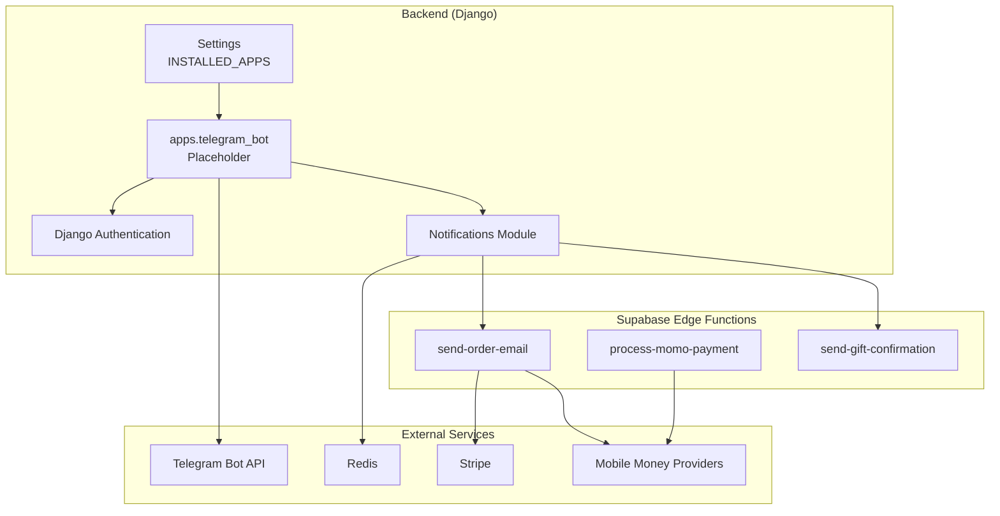
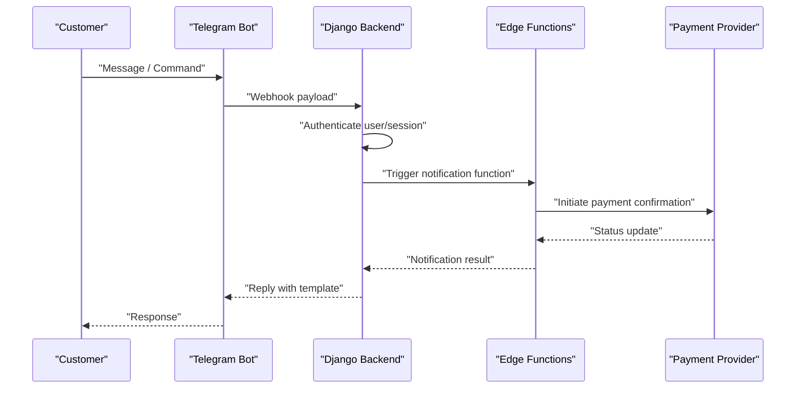
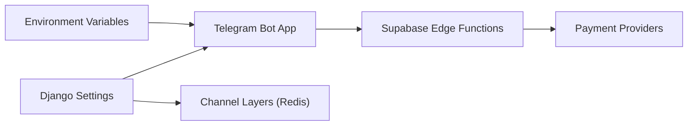

# Telegram Bot Integration

<cite>
**Referenced Files in This Document**
- [README.md](file://README.md)
- [__init__.py](file://backend/apps/telegram_bot/__init__.py)
- [base.py](file://backend/config/settings/base.py)
- [development.py](file://backend/config/settings/development.py)
- [production.py](file://backend/config/settings/production.py)
- [requirements.txt](file://backend/requirements.txt)
- [send-order-email/index.ts](file://supabase/functions/send-order-email/index.ts)
- [process-momo-payment/index.ts](file://supabase/functions/process-momo-payment/index.ts)
- [send-gift-confirmation/index.ts](file://supabase/functions/send-gift-confirmation/index.ts)
</cite>

## Table of Contents
1. [Introduction](#introduction)
2. [Project Structure](#project-structure)
3. [Core Components](#core-components)
4. [Architecture Overview](#architecture-overview)
5. [Detailed Component Analysis](#detailed-component-analysis)
6. [Dependency Analysis](#dependency-analysis)
7. [Performance Considerations](#performance-considerations)
8. [Troubleshooting Guide](#troubleshooting-guide)
9. [Conclusion](#conclusion)

## Introduction
This document explains the Telegram bot integration system for the Empindu artisan marketplace. It covers webhook configuration, customer service automation workflows, artisan onboarding via Telegram, order notifications, payment confirmations, and customer support conversations. It also documents integration with Django authentication, message handling patterns, conversation flows, webhook security, multilingual support, and automated response templates. Finally, it provides troubleshooting guidance for webhook configuration and message delivery issues.

## Project Structure
The Telegram bot lives within the Django backend as an installed application and is configured alongside other platform services. The repository includes:
- Django settings that enable the Telegram bot app
- Environment variables for Telegram bot tokens and webhook secrets
- Supabase Edge Functions for order and payment notifications
- Frontend and backend integration points for commerce and notifications

**Diagram sources**
- [base.py:29-64](file://backend/config/settings/base.py#L29-L64)
- [__init__.py:1-2](file://backend/apps/telegram_bot/__init__.py#L1-L2)
- [send-order-email/index.ts:165-219](file://supabase/functions/send-order-email/index.ts#L165-L219)
- [process-momo-payment/index.ts:1-150](file://supabase/functions/process-momo-payment/index.ts#L1-L150)
- [send-gift-confirmation/index.ts:1-38](file://supabase/functions/send-gift-confirmation/index.ts#L1-L38)

**Section sources**
- [README.md:1-242](file://README.md#L1-L242)
- [base.py:29-64](file://backend/config/settings/base.py#L29-L64)
- [__init__.py:1-2](file://backend/apps/telegram_bot/__init__.py#L1-L2)

## Core Components
- Telegram bot application module: Registered in Django settings as an installed app. The module currently acts as a placeholder for future implementation.
- Django authentication integration: Ensures secure access to bot-related operations and user sessions.
- Notification pipeline: Uses Supabase Edge Functions to send order and gift confirmations, integrating with payment providers.
- Environment configuration: Telegram bot token and webhook secret are configured via environment variables.

Key implementation references:
- Django app registration for the Telegram bot module
- Environment variables for Telegram bot token and webhook secret
- Edge Function handlers for order and payment notifications

**Section sources**
- [base.py:29-64](file://backend/config/settings/base.py#L29-L64)
- [README.md:138-145](file://README.md#L138-L145)
- [send-order-email/index.ts:165-219](file://supabase/functions/send-order-email/index.ts#L165-L219)
- [process-momo-payment/index.ts:1-150](file://supabase/functions/process-momo-payment/index.ts#L1-L150)

## Architecture Overview
The Telegram bot integrates with the Django backend and Supabase Edge Functions to deliver customer service automation, artisan onboarding, order notifications, and payment confirmations. The system leverages:
- Webhook mode for Telegram bot messages
- Django authentication for secure operations
- Supabase Edge Functions for serverless notifications
- Redis-backed channels for real-time updates

**Diagram sources**
- [requirements.txt:30-30](file://backend/requirements.txt#L30-L30)
- [base.py:29-64](file://backend/config/settings/base.py#L29-L64)
- [send-order-email/index.ts:165-219](file://supabase/functions/send-order-email/index.ts#L165-L219)
- [process-momo-payment/index.ts:1-150](file://supabase/functions/process-momo-payment/index.ts#L1-L150)

## Detailed Component Analysis

### Telegram Bot Application Module
- Purpose: Acts as a placeholder for Telegram bot functionality within Django’s app registry.
- Current state: Empty module indicating future implementation in upcoming sprints.
- Integration points: Ready to receive webhook events, handle commands, and route messages to appropriate handlers.

Implementation references:
- Module registration in Django settings
- Placeholder module file

**Section sources**
- [base.py:29-64](file://backend/config/settings/base.py#L29-L64)
- [__init__.py:1-2](file://backend/apps/telegram_bot/__init__.py#L1-L2)

### Webhook Configuration and Security
- Webhook mode: The project specifies the Telegram bot library supports webhook mode, enabling inbound message routing.
- Security: The environment includes a dedicated webhook secret variable for validating incoming requests.
- Endpoint exposure: Site URL is configured for webhook registration and HTTPS enforcement in production.

Implementation references:
- Library requirement for webhook support
- Environment variables for bot token and webhook secret
- Production HTTPS and cookie security settings

**Section sources**
- [requirements.txt:30-30](file://backend/requirements.txt#L30-L30)
- [README.md:138-145](file://README.md#L138-L145)
- [production.py:15-22](file://backend/config/settings/production.py#L15-L22)

### Message Handling Patterns and Conversation Flows
- Message routing: Telegram bot receives updates via webhook and routes them to Django views or handlers.
- Authentication: Requests are authenticated against Django’s authentication middleware and session framework.
- Conversation flows: To be implemented; current module indicates future development.

Implementation references:
- Django middleware stack including authentication
- Placeholder module for bot app

**Section sources**
- [base.py:66-77](file://backend/config/settings/base.py#L66-L77)
- [__init__.py:1-2](file://backend/apps/telegram_bot/__init__.py#L1-L2)

### Customer Service Automation Workflows
- Order notifications: Triggered via Supabase Edge Functions after order confirmation, sending templated messages to customers.
- Gift orders: Dedicated function handles gift order confirmations and delivery updates.
- Payment confirmations: Mobile money payment processing function updates order and payment statuses asynchronously.

Implementation references:
- Order email notification function
- Gift confirmation function
- Mobile money payment processing function

**Section sources**
- [send-order-email/index.ts:165-219](file://supabase/functions/send-order-email/index.ts#L165-L219)
- [send-gift-confirmation/index.ts:1-38](file://supabase/functions/send-gift-confirmation/index.ts#L1-L38)
- [process-momo-payment/index.ts:1-150](file://supabase/functions/process-momo-payment/index.ts#L1-L150)

### Artisan Onboarding Through Telegram
- Capability: Zero-cost onboarding via Telegram/WhatsApp is documented as a platform feature.
- Implementation: Future sprint focus; current module is a placeholder.

References:
- Feature documentation in README

**Section sources**
- [README.md:164-171](file://README.md#L164-L171)
- [__init__.py:1-2](file://backend/apps/telegram_bot/__init__.py#L1-L2)

### Order Notifications and Payment Confirmations
- Order notifications: Templated HTML emails generated and sent via Supabase Edge Functions upon order events.
- Payment confirmations: Mobile money payments validated and processed asynchronously; order and payment records updated accordingly.

Implementation references:
- Order email function logic
- Payment processing function logic

**Section sources**
- [send-order-email/index.ts:165-219](file://supabase/functions/send-order-email/index.ts#L165-L219)
- [process-momo-payment/index.ts:1-150](file://supabase/functions/process-momo-payment/index.ts#L1-L150)

### Multilingual Support and Automated Templates
- Multilingual support: The platform supports multiple languages (English, Luganda, Swahili).
- Automated templates: Notification functions include localized content and branding.

Implementation references:
- Platform multilingual features
- Notification function content

**Section sources**
- [README.md:162-162](file://README.md#L162-L162)
- [send-order-email/index.ts:150-162](file://supabase/functions/send-order-email/index.ts#L150-L162)

## Dependency Analysis
The Telegram bot integration depends on:
- Django settings for app registration and middleware
- Environment variables for Telegram credentials
- Supabase Edge Functions for notification orchestration
- Redis for channel layers and asynchronous tasks

**Diagram sources**
- [base.py:29-64](file://backend/config/settings/base.py#L29-L64)
- [README.md:138-145](file://README.md#L138-L145)
- [send-order-email/index.ts:165-219](file://supabase/functions/send-order-email/index.ts#L165-L219)
- [process-momo-payment/index.ts:1-150](file://supabase/functions/process-momo-payment/index.ts#L1-L150)

**Section sources**
- [base.py:29-64](file://backend/config/settings/base.py#L29-L64)
- [README.md:138-145](file://README.md#L138-L145)

## Performance Considerations
- Asynchronous processing: Payment confirmations and notifications are executed asynchronously to avoid blocking webhook responses.
- Background tasks: Edge Functions schedule background updates for payment completion and order confirmation.
- Caching and queues: Redis-backed Celery and channel layers improve responsiveness for real-time features.

[No sources needed since this section provides general guidance]

## Troubleshooting Guide

### Webhook Configuration Issues
- Verify Telegram bot token and webhook secret in environment variables.
- Ensure site URL is correctly set for webhook registration.
- Confirm HTTPS and SSL redirect settings in production.

References:
- Environment variables for Telegram configuration
- Production security settings

**Section sources**
- [README.md:138-145](file://README.md#L138-L145)
- [production.py:15-22](file://backend/config/settings/production.py#L15-L22)

### Message Delivery Problems
- Check Django middleware stack for authentication and CORS.
- Validate that the Telegram bot app is registered in INSTALLED_APPS.
- Confirm webhook endpoint accessibility and response codes.

References:
- Django settings and middleware
- App registration

**Section sources**
- [base.py:66-77](file://backend/config/settings/base.py#L66-L77)
- [base.py:29-64](file://backend/config/settings/base.py#L29-L64)

### Notification and Payment Failures
- Review Supabase Edge Function logs for authorization errors and missing fields.
- Validate phone number formats for mobile money payments.
- Confirm order ownership checks and admin permissions for sending notifications.

References:
- Order email function authorization and validation
- Gift confirmation function authorization
- Payment processing validation and updates

**Section sources**
- [send-order-email/index.ts:165-219](file://supabase/functions/send-order-email/index.ts#L165-L219)
- [send-gift-confirmation/index.ts:1-38](file://supabase/functions/send-gift-confirmation/index.ts#L1-L38)
- [process-momo-payment/index.ts:1-150](file://supabase/functions/process-momo-payment/index.ts#L1-L150)

## Conclusion
The Telegram bot integration is positioned as a future capability within the Empindu ecosystem, with the Django backend and Supabase Edge Functions providing the foundation for secure, scalable customer service automation. The current implementation includes environment configuration, app registration, and notification functions that demonstrate the intended workflows for order notifications, payment confirmations, and artisan onboarding. As the bot module evolves, it will integrate tightly with Django authentication, webhook security, and the broader notification system to deliver seamless multilingual support and automated conversational experiences.