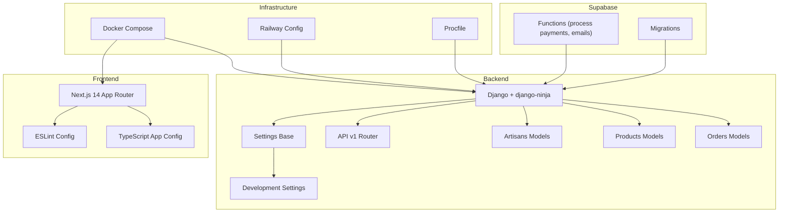
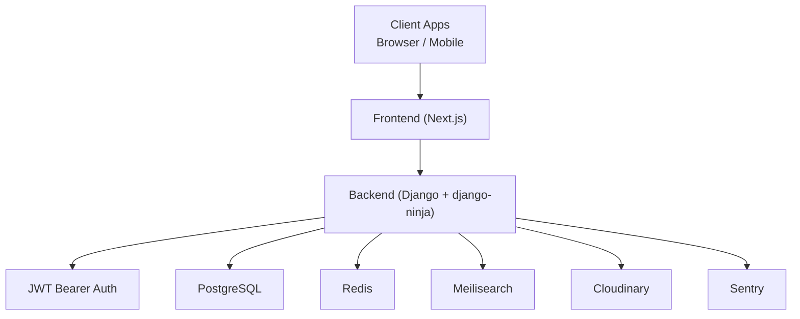
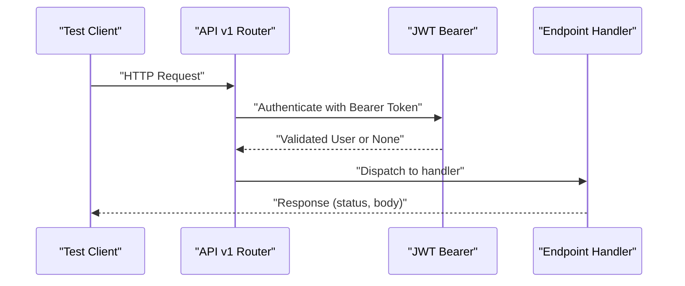
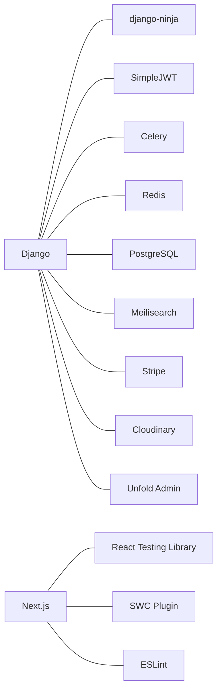

# Testing Strategy

<cite>
**Referenced Files in This Document**
- [README.md](file://README.md)
- [package.json](file://package.json)
- [backend/requirements.txt](file://backend/requirements.txt)
- [backend/setup.cfg](file://backend/setup.cfg)
- [backend/config/settings/base.py](file://backend/config/settings/base.py)
- [backend/config/settings/development.py](file://backend/config/settings/development.py)
- [backend/api/v1/router.py](file://backend/api/v1/router.py)
- [backend/apps/artisans/models.py](file://backend/apps/artisans/models.py)
- [backend/apps/products/models.py](file://backend/apps/products/models.py)
- [backend/apps/orders/models.py](file://backend/apps/orders/models.py)
- [eslint.config.js](file://eslint.config.js)
- [tsconfig.app.json](file://tsconfig.app.json)
</cite>

## Table of Contents
1. [Introduction](#introduction)
2. [Project Structure](#project-structure)
3. [Core Components](#core-components)
4. [Architecture Overview](#architecture-overview)
5. [Detailed Component Analysis](#detailed-component-analysis)
6. [Dependency Analysis](#dependency-analysis)
7. [Performance Considerations](#performance-considerations)
8. [Troubleshooting Guide](#troubleshooting-guide)
9. [Conclusion](#conclusion)
10. [Appendices](#appendices)

## Introduction
This document defines Empindu’s comprehensive testing strategy across backend, frontend, and integration domains. It covers unit testing patterns for Django models and views, component testing for React elements, API endpoint testing procedures, testing workflows, test data management, continuous integration testing, performance and load testing, security testing, best practices, code coverage requirements, quality gates, environment-specific testing, automated pipelines, bug tracking integration, debugging techniques, test automation, and regression testing strategies.

Empindu is a production-grade artisan marketplace with:
- Backend: Django 5 + django-ninja (async API)
- Frontend: Next.js 14 App Router (SSR, PWA)
- Bot layer: python-telegram-bot 20 (webhook mode)
- ML/AI: OpenAI Whisper (voice transcription)
- Database: PostgreSQL 16 + pgvector
- Cache/Queue: Redis 7
- Search: Meilisearch
- Admin: Django Unfold
- Deployment: Railway (backend), Vercel (frontend)

The repository includes explicit commands for running backend and frontend tests, indicating a baseline testing approach that this document formalizes and expands.

**Section sources**
- [README.md:205-215](file://README.md#L205-L215)

## Project Structure
The repository follows a monorepo-like structure with distinct areas for backend, frontend, infrastructure, and Supabase-related functions and migrations. Testing spans:
- Backend tests executed via pytest
- Frontend tests executed via npm test
- Infrastructure services managed by Docker Compose
- Supabase functions and migrations for serverless logic and schema

**Diagram sources**
- [backend/config/settings/base.py:100-127](file://backend/config/settings/base.py#L100-L127)
- [backend/config/settings/development.py:7-16](file://backend/config/settings/development.py#L7-L16)
- [backend/api/v1/router.py:21-40](file://backend/api/v1/router.py#L21-L40)
- [backend/apps/artisans/models.py:14-170](file://backend/apps/artisans/models.py#L14-L170)
- [backend/apps/products/models.py:10-153](file://backend/apps/products/models.py#L10-L153)
- [backend/apps/orders/models.py:10-122](file://backend/apps/orders/models.py#L10-L122)
- [eslint.config.js:1-26](file://eslint.config.js#L1-L26)
- [tsconfig.app.json:1-32](file://tsconfig.app.json#L1-L32)

**Section sources**
- [README.md:17-50](file://README.md#L17-L50)
- [backend/config/settings/base.py:100-127](file://backend/config/settings/base.py#L100-L127)

## Core Components
This section outlines the testing approach for each major component area.

- Backend (Django + django-ninja)
  - Authentication: JWT bearer via django-ninja and SimpleJWT
  - API routing: centralized router with per-endpoint authentication policies
  - Models: artisans, products, orders with calculated properties and financial snapshots
  - Settings: base and development configurations, Celery and Redis integration, CORS, media storage, and Unfold admin theme

- Frontend (Next.js 14)
  - TypeScript + React with ESLint configuration
  - App Router pages and components
  - Supabase client and typed types for integrations

- Infrastructure
  - Docker Compose for local services
  - Railway and Procfile for deployment

- Supabase Functions and Migrations
  - Serverless functions for payment processing and notifications
  - Migrations for schema evolution

**Section sources**
- [backend/api/v1/router.py:10-40](file://backend/api/v1/router.py#L10-L40)
- [backend/apps/artisans/models.py:62-170](file://backend/apps/artisans/models.py#L62-L170)
- [backend/apps/products/models.py:10-153](file://backend/apps/products/models.py#L10-L153)
- [backend/apps/orders/models.py:10-122](file://backend/apps/orders/models.py#L10-L122)
- [backend/config/settings/base.py:29-64](file://backend/config/settings/base.py#L29-L64)
- [backend/config/settings/base.py:100-127](file://backend/config/settings/base.py#L100-L127)
- [eslint.config.js:1-26](file://eslint.config.js#L1-L26)
- [tsconfig.app.json:1-32](file://tsconfig.app.json#L1-L32)

## Architecture Overview
The testing architecture integrates backend, frontend, and infrastructure layers with explicit authentication and routing patterns.

**Diagram sources**
- [backend/api/v1/router.py:10-28](file://backend/api/v1/router.py#L10-L28)
- [backend/config/settings/base.py:100-127](file://backend/config/settings/base.py#L100-L127)
- [backend/config/settings/base.py:157-164](file://backend/config/settings/base.py#L157-L164)

## Detailed Component Analysis

### Backend Testing Strategy (pytest)
- Unit testing patterns for Django models
  - Artisans: identity, location, contact, certifications, media, experience, calculated properties (earnings, order count, voice draft)
  - Products: story-first architecture, pricing, revenue split, inventory, semantic embeddings
  - Orders: lifecycle states, payment methods, payout statuses, financial snapshots
- View and API testing
  - Centralized router with JWT bearer authentication
  - Per-endpoint authentication policies applied during registration
- Settings and environment isolation
  - Base settings with fallbacks for development (in-memory cache, database broker)
  - Development-specific overrides (email backend, Sentry disabled)

Recommended unit testing patterns:
- Model tests
  - Validate property calculations (earnings, order counts)
  - Slug generation and uniqueness
  - Foreign key constraints and related_name usage
- API tests
  - Endpoint coverage with JWT authentication
  - Status code assertions and response shape validation
  - Edge cases: invalid tokens, unauthorized access, malformed requests
- Settings tests
  - Environment variable loading and defaults
  - Celery broker selection and task execution behavior

**Section sources**
- [backend/apps/artisans/models.py:62-170](file://backend/apps/artisans/models.py#L62-L170)
- [backend/apps/products/models.py:10-153](file://backend/apps/products/models.py#L10-L153)
- [backend/apps/orders/models.py:10-122](file://backend/apps/orders/models.py#L10-L122)
- [backend/api/v1/router.py:21-40](file://backend/api/v1/router.py#L21-L40)
- [backend/config/settings/base.py:100-127](file://backend/config/settings/base.py#L100-L127)
- [backend/config/settings/development.py:7-16](file://backend/config/settings/development.py#L7-L16)

### Frontend Testing Strategy (Jest + React Testing Library)
- Component testing
  - Isolated rendering of React components
  - Mock external dependencies (Supabase client, React Query)
  - User interaction simulation and assertion of UI state changes
- Type safety and linting
  - ESLint configuration for TypeScript and React
  - Strictness controlled via tsconfig.app.json
- Integration with Next.js App Router
  - Page-level tests leveraging App Router semantics
  - Navigation and route-based rendering verification

Recommended patterns:
- Use React Testing Library for DOM-centric tests
- Mock Supabase client and React Query for deterministic behavior
- Snapshot testing for static components where appropriate
- Accessibility checks using testing-library axe extensions

**Section sources**
- [eslint.config.js:1-26](file://eslint.config.js#L1-L26)
- [tsconfig.app.json:1-32](file://tsconfig.app.json#L1-L32)

### API Endpoint Testing Procedures

**Diagram sources**
- [backend/api/v1/router.py:10-28](file://backend/api/v1/router.py#L10-L28)

### Integration Testing Methodologies
- Backend-to-Infrastructure
  - PostgreSQL, Redis, Meilisearch connectivity and migrations
  - Celery task execution and channel layers
- Backend-to-External Services
  - Cloudinary uploads, Stripe payments, Telegram bot webhooks
  - Supabase functions for payment processing and notifications
- Frontend-to-Backend
  - API contract testing with realistic payloads
  - Authentication flow validation (JWT issuance and refresh)
- Cross-service E2E
  - Order lifecycle from placement to delivery
  - Gift commerce flow and email notifications

**Section sources**
- [backend/config/settings/base.py:100-127](file://backend/config/settings/base.py#L100-L127)
- [backend/requirements.txt:1-50](file://backend/requirements.txt#L1-L50)

### Testing Workflow
- Local development
  - Start services with Docker Compose
  - Run migrations and create superuser
  - Execute backend tests with pytest and frontend tests with npm test
- CI/CD
  - Automated test runs on pull requests
  - Environment-specific test matrices (development, staging, production)
  - Artifact and coverage reporting

**Section sources**
- [README.md:61-101](file://README.md#L61-L101)
- [README.md:205-215](file://README.md#L205-L215)

### Test Data Management
- Backend
  - Use factories or fixtures to generate model instances
  - Manage secrets via environment variables
  - Separate test databases or migrations for isolated runs
- Frontend
  - Mock data for components and API responses
  - Deterministic fixtures for stateful components

**Section sources**
- [backend/config/settings/base.py:12-26](file://backend/config/settings/base.py#L12-L26)

### Continuous Integration Testing
- Trigger tests on PRs and pushes
- Matrix builds for different environments
- Coverage thresholds and quality gates

[No sources needed since this section provides general guidance]

### Performance Testing Approaches
- Backend
  - Load tests using Locust or similar against django-ninja endpoints
  - Measure response times and throughput under concurrency
- Frontend
  - Lighthouse audits and Web Vitals monitoring
  - Bundle size and hydration performance checks

[No sources needed since this section provides general guidance]

### Load Testing Strategies
- Simulate concurrent users placing orders, uploading media, and streaming content
- Gradually increase load to identify saturation points
- Monitor Redis, PostgreSQL, and Meilisearch resource utilization

[No sources needed since this section provides general guidance]

### Security Testing Procedures
- Authentication and authorization
  - Verify JWT token validation and scope enforcement
- Input sanitization and CSRF protection
- CORS misconfiguration checks
- Secret exposure prevention in frontend builds

**Section sources**
- [backend/api/v1/router.py:10-28](file://backend/api/v1/router.py#L10-L28)
- [backend/config/settings/base.py:166-173](file://backend/config/settings/base.py#L166-L173)

### Testing Best Practices
- Write small, focused tests with descriptive names
- Prefer property-based and boundary tests for numeric fields
- Use deterministic randomness seeds for reproducibility
- Keep tests independent and idempotent

[No sources needed since this section provides general guidance]

### Code Coverage Requirements and Quality Gates
- Target minimum coverage thresholds per module
- Gate merges on passing tests and coverage metrics
- Fail builds on regressions exceeding tolerance

[No sources needed since this section provides general guidance]

### Testing Across Environments
- Development
  - Fast feedback loops with in-memory cache and console email backend
- Staging
  - Near-production configuration with real services
- Production
  - Canary deployments with guarded rollouts and health checks

**Section sources**
- [backend/config/settings/development.py:7-16](file://backend/config/settings/development.py#L7-L16)
- [backend/config/settings/base.py:100-127](file://backend/config/settings/base.py#L100-L127)

### Automated Testing Pipelines
- Backend pipeline
  - Install dependencies, run migrations, execute pytest with coverage
- Frontend pipeline
  - Install dependencies, lint, type check, run tests, build artifacts
- Infrastructure pipeline
  - Validate Docker Compose services and readiness

**Section sources**
- [README.md:61-101](file://README.md#L61-L101)
- [backend/requirements.txt:1-50](file://backend/requirements.txt#L1-L50)
- [package.json:7-13](file://package.json#L7-L13)

### Bug Tracking Integration
- Link test failures to tickets
- Capture logs and stack traces for regression triage
- Maintain a changelog of test fixes and coverage improvements

[No sources needed since this section provides general guidance]

### Debugging Techniques
- Backend
  - Use pytest with verbose logging and breakpoints
  - Inspect Celery task queues and Redis keys
- Frontend
  - Enable React DevTools and Redux DevTools
  - Network tab inspection for API calls

[No sources needed since this section provides general guidance]

### Test Automation and Regression Testing
- Automate repetitive UI flows and API sequences
- Maintain regression suites for critical paths
- Schedule periodic smoke tests across environments

[No sources needed since this section provides general guidance]

## Dependency Analysis
Backend and frontend dependencies influence testing scope and tooling.

**Diagram sources**
- [backend/requirements.txt:1-50](file://backend/requirements.txt#L1-L50)
- [package.json:69-86](file://package.json#L69-L86)

**Section sources**
- [backend/requirements.txt:1-50](file://backend/requirements.txt#L1-L50)
- [package.json:69-86](file://package.json#L69-L86)

## Performance Considerations
- Optimize database queries in model properties and aggregations
- Use caching for expensive computations and media transformations
- Monitor API latency and queue depths under load

[No sources needed since this section provides general guidance]

## Troubleshooting Guide
- Backend
  - Validate environment variables and service connectivity
  - Inspect Celery task logs and Redis queues
- Frontend
  - Check browser console and network errors
  - Verify ESLint and TypeScript configurations

**Section sources**
- [backend/config/settings/base.py:12-26](file://backend/config/settings/base.py#L12-L26)
- [eslint.config.js:1-26](file://eslint.config.js#L1-L26)

## Conclusion
Empindu’s testing strategy leverages pytest for backend, React Testing Library for frontend, and robust integration testing across services. By enforcing quality gates, maintaining environment parity, and adopting performance and security testing, the project ensures reliable delivery across development, staging, and production.

[No sources needed since this section summarizes without analyzing specific files]

## Appendices
- Quick Commands
  - Backend tests: [README.md:208-210](file://README.md#L208-L210)
  - Frontend tests: [README.md:212-214](file://README.md#L212-L214)

[No sources needed since this section provides general guidance]