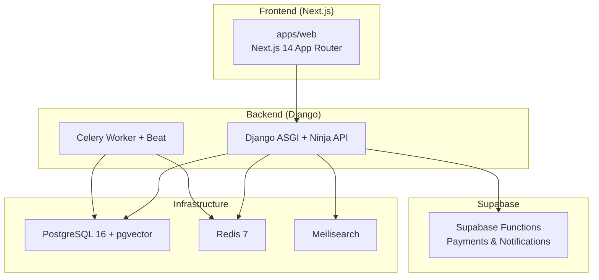
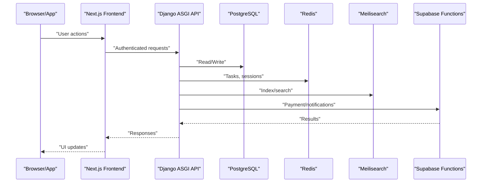
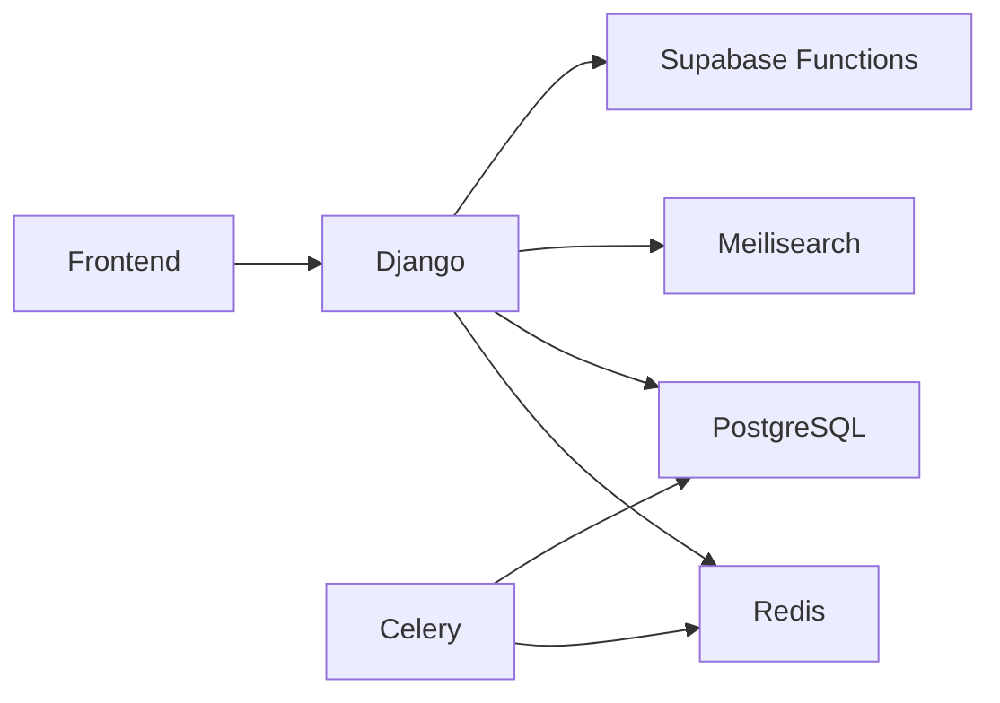

# Troubleshooting & FAQ

<cite>
**Referenced Files in This Document**
- [README.md](file://README.md)
- [docker-compose.yml](file://infrastructure/docker-compose.yml)
- [Procfile](file://backend/Procfile)
- [railway.toml](file://backend/railway.toml)
- [requirements.txt](file://backend/requirements.txt)
- [package.json](file://package.json)
- [base.py](file://backend/config/settings/base.py)
- [development.py](file://backend/config/settings/development.py)
- [production.py](file://backend/config/settings/production.py)
- [urls.py](file://backend/config/urls.py)
- [wsgi.py](file://backend/config/wsgi.py)
- [setup.ps1](file://backend/setup.ps1)
- [router.py](file://backend/api/v1/router.py)
- [urls.py](file://backend/api/v1/urls.py)
- [models.py](file://backend/apps/artisans/models.py)
- [models.py](file://backend/apps/products/models.py)
- [models.py](file://backend/apps/orders/models.py)
- [index.ts](file://src/integrations/lovable/index.ts)
- [client.ts](file://src/integrations/supabase/client.ts)
- [types.ts](file://src/integrations/supabase/types.ts)
- [process-cash-payment/index.ts](file://supabase/functions/process-cash-payment/index.ts)
- [process-momo-payment/index.ts](file://supabase/functions/process-momo-payment/index.ts)
- [send-order-email/index.ts](file://supabase/functions/send-order-email/index.ts)
- [send-gift-order-email/index.ts](file://supabase/functions/send-gift-order-email/index.ts)
- [send-gift-confirmation/index.ts](file://supabase/functions/send-gift-confirmation/index.ts)
- [20251231095959_3473bebe-42ab-4109-8633-54732ebf1eaf.sql](file://supabase/migrations/20251231095959_3473bebe-42ab-4109-8633-54732ebf1eaf.sql)
- [20260101210119_8814f12d-688f-4774-9ce8-6ce5f9fd0bba.sql](file://supabase/migrations/20260101210119_8814f12d-688f-4774-9ce8-6ce5f9fd0bba.sql)
- [20260101211534_d1ce3159-d630-4859-8ee8-6361241b244c.sql](file://supabase/migrations/20260101211534_d1ce3159-d630-4859-8ee8-6361241b244c.sql)
- [20260103085459_7948cea8-ed91-44d2-882d-43b3ec3c3fa4.sql](file://supabase/migrations/20260103085459_7948cea8-ed91-44d2-882d-43b3ec3c3fa4.sql)
- [20260104173154_8858732d-0e5c-45cd-afaf-c177dfa5487a.sql](file://supabase/migrations/20260104173154_8858732d-0e5c-45cd-afaf-c177dfa5487a.sql)
- [20260107224910_0b6f10e2-c8bb-49bb-ba91-d7b9b48cd27c.sql](file://supabase/migrations/20260107224910_0b6f10e2-c8bb-49bb-ba91-d7b9b48cd27c.sql)
- [20260109095251_6889a1b9-3b1c-4b8f-9535-f3ef095414de.sql](file://supabase/migrations/20260109095251_6889a1b9-3b1c-4b8f-9535-f3ef095414de.sql)
- [20260110082525_e26cf9e4-1e19-414d-9316-27ada8493a53.sql](file://supabase/migrations/20260110082525_e26cf9e4-1e19-414d-9316-27ada8493a53.sql)
- [20260110084208_19f31e38-2062-4a6a-a516-e5b9de4e3510.sql](file://supabase/migrations/20260110084208_19f31e38-2062-4a6a-a516-e5b9de4e3510.sql)
- [20260121122109_0b1cb36d-aa4e-4dd7-a125-c453bc87fffe.sql](file://supabase/migrations/20260121122109_0b1cb36d-aa4e-4dd7-a125-c453bc87fffe.sql)
- [20260301183140_74b1e32e-ded4-4234-9c49-76542f291b2d.sql](file://supabase/migrations/20260301183140_74b1e32e-ded4-4234-9c49-76542f291b2d.sql)
- [20260301185835_24e7e596-6ffe-4991-964c-74e173d7213e.sql](file://supabase/migrations/20260301185835_24e7e596-6ffe-4991-964c-74e173d7213e.sql)
- [20260307151135_abb92613-d0a4-4ab6-8384-d241b138020b.sql](file://supabase/migrations/20260307151135_abb92613-d0a4-4ab6-8384-d241b138020b.sql)
- [20260312151001_0ad1fffe-4364-4902-9212-6c6e1aeb1f08.sql](file://supabase/migrations/20260312151001_0ad1fffe-4364-4902-9212-6c6e1aeb1f08.sql)
- [20260312151243_54077459-7217-4c42-a35e-67af66d898f3.sql](file://supabase/migrations/20260312151243_54077459-7217-4c42-a35e-67af66d898f3.sql)
</cite>

## Table of Contents
1. [Introduction](#introduction)
2. [Project Structure](#project-structure)
3. [Core Components](#core-components)
4. [Architecture Overview](#architecture-overview)
5. [Detailed Component Analysis](#detailed-component-analysis)
6. [Dependency Analysis](#dependency-analysis)
7. [Performance Considerations](#performance-considerations)
8. [Troubleshooting Guide](#troubleshooting-guide)
9. [FAQ](#faq)
10. [Conclusion](#conclusion)
11. [Appendices](#appendices)

## Introduction
This document provides a comprehensive troubleshooting and FAQ guide for Empindu development and operations. It covers setup issues, dependency conflicts, environment configuration, frontend and backend diagnostics, database connectivity, payment processing, Telegram bot webhooks, search functionality, performance optimization, scaling, migration and deployment problems, and integration troubleshooting. It also includes step-by-step diagnostic procedures, log analysis techniques, and escalation paths.

## Project Structure
Empindu is a monorepo with:
- Backend: Django 5 + django-ninja (async API), deployed via Railway
- Frontend: Next.js 14 App Router (SSR, PWA), deployed via Vercel
- Infrastructure: Docker Compose for local services (PostgreSQL, Redis, Meilisearch)
- Supabase Functions: Payment processors and notifications
- ML/AI: Whisper for voice transcription
- Search: Meilisearch
- Cache/Queue: Redis
- Admin: Django Unfold

**Diagram sources**
- [README.md:3-49](file://README.md#L3-L49)
- [docker-compose.yml:1-52](file://infrastructure/docker-compose.yml#L1-L52)
- [Procfile:1-4](file://backend/Procfile#L1-L4)
- [railway.toml:1-13](file://backend/railway.toml#L1-L13)

**Section sources**
- [README.md:17-50](file://README.md#L17-L50)
- [docker-compose.yml:1-52](file://infrastructure/docker-compose.yml#L1-L52)
- [Procfile:1-4](file://backend/Procfile#L1-L4)
- [railway.toml:1-13](file://backend/railway.toml#L1-L13)

## Core Components
- Backend settings and environment management
- API routing and authentication
- Domain models for artisans, products, and orders
- Supabase functions for payments and notifications
- Frontend integration clients for Supabase and Lovable

Key areas to check during troubleshooting:
- Environment variables and settings loading
- Database connectivity and migrations
- Celery workers and scheduled tasks
- Supabase function logs and secrets
- Frontend API base URLs and auth tokens

**Section sources**
- [base.py:11-287](file://backend/config/settings/base.py#L11-L287)
- [development.py:1-17](file://backend/config/settings/development.py#L1-L17)
- [production.py:1-33](file://backend/config/settings/production.py#L1-L33)
- [router.py:1-40](file://backend/api/v1/router.py#L1-L40)
- [models.py:1-170](file://backend/apps/artisans/models.py#L1-L170)
- [models.py:1-153](file://backend/apps/products/models.py#L1-L153)
- [models.py:1-122](file://backend/apps/orders/models.py#L1-L122)
- [client.ts:1-200](file://src/integrations/supabase/client.ts#L1-L200)
- [index.ts:1-200](file://src/integrations/lovable/index.ts#L1-L200)

## Architecture Overview
High-level runtime architecture and data flow:

**Diagram sources**
- [README.md:3-15](file://README.md#L3-L15)
- [router.py:21-40](file://backend/api/v1/router.py#L21-L40)
- [base.py:100-127](file://backend/config/settings/base.py#L100-L127)
- [docker-compose.yml:4-47](file://infrastructure/docker-compose.yml#L4-L47)

## Detailed Component Analysis

### Backend Settings and Environment
Common issues:
- Missing environment variables
- Incorrect allowed hosts
- Database URL misconfiguration
- CORS mismatch
- Redis URL missing causing fallback behavior

Diagnostic checklist:
- Verify .env contents for backend and frontend
- Confirm DATABASE_URL and REDIS_URL
- Check ALLOWED_HOSTS for deployment domain
- Validate CORS_ALLOWED_ORIGINS
- Ensure SECRET_KEY and DEBUG are set appropriately

**Section sources**
- [base.py:11-287](file://backend/config/settings/base.py#L11-L287)
- [development.py:7-16](file://backend/config/settings/development.py#L7-L16)
- [production.py:8-32](file://backend/config/settings/production.py#L8-L32)
- [README.md:109-152](file://README.md#L109-L152)

### API Routing and Authentication
Common issues:
- JWT bearer authentication failing
- Missing auth on protected routes
- Ninja API not reachable

Diagnostic checklist:
- Confirm JWT token is present and valid
- Verify API namespace and route registration
- Check CORS headers for preflight responses

**Section sources**
- [router.py:10-40](file://backend/api/v1/router.py#L10-L40)
- [urls.py:9-16](file://backend/config/urls.py#L9-L16)

### Artisan, Product, and Order Models
Common issues:
- Slug generation conflicts
- Embedded vector indexing for search
- Financial calculations and snapshots

Diagnostic checklist:
- Inspect artisan slug uniqueness
- Verify product embedding updates
- Review order totals calculation and frozen values

**Section sources**
- [models.py:62-170](file://backend/apps/artisans/models.py#L62-L170)
- [models.py:10-153](file://backend/apps/products/models.py#L10-L153)
- [models.py:10-122](file://backend/apps/orders/models.py#L10-L122)

### Supabase Functions (Payments and Notifications)
Common issues:
- Function execution errors
- Missing environment variables in Supabase
- Webhook secret mismatches

Diagnostic checklist:
- Check Supabase dashboard logs for function errors
- Verify function secrets match environment
- Validate webhook URLs and signatures

**Section sources**
- [process-cash-payment/index.ts:1-200](file://supabase/functions/process-cash-payment/index.ts#L1-L200)
- [process-momo-payment/index.ts:1-200](file://supabase/functions/process-momo-payment/index.ts#L1-L200)
- [send-order-email/index.ts:1-200](file://supabase/functions/send-order-email/index.ts#L1-L200)
- [send-gift-order-email/index.ts:1-200](file://supabase/functions/send-gift-order-email/index.ts#L1-L200)
- [send-gift-confirmation/index.ts:1-200](file://supabase/functions/send-gift-confirmation/index.ts#L1-L200)

### Frontend Integration Clients
Common issues:
- API base URL mismatch
- Supabase client initialization errors
- Lovable auth client failures

Diagnostic checklist:
- Confirm NEXT_PUBLIC_API_URL
- Validate Supabase project keys
- Check Lovable auth credentials

**Section sources**
- [client.ts:1-200](file://src/integrations/supabase/client.ts#L1-L200)
- [types.ts:1-200](file://src/integrations/supabase/types.ts#L1-L200)
- [index.ts:1-200](file://src/integrations/lovable/index.ts#L1-L200)
- [package.json:14-88](file://package.json#L14-L88)

## Dependency Analysis
Runtime dependencies and their roles:
- Django and django-ninja for async API
- Celery + Redis for background tasks
- PostgreSQL with pgvector for embeddings
- Meilisearch for semantic search
- Supabase Functions for payment and notification orchestration

**Diagram sources**
- [requirements.txt:1-50](file://backend/requirements.txt#L1-L50)
- [docker-compose.yml:4-47](file://infrastructure/docker-compose.yml#L4-L47)
- [Procfile:1-4](file://backend/Procfile#L1-L4)

**Section sources**
- [requirements.txt:1-50](file://backend/requirements.txt#L1-L50)
- [docker-compose.yml:1-52](file://infrastructure/docker-compose.yml#L1-L52)
- [Procfile:1-4](file://backend/Procfile#L1-L4)

## Performance Considerations
- Use Redis for caching and task queuing; monitor queue backlog
- Optimize Meilisearch indexing jobs and batch updates
- Monitor PostgreSQL connections and slow queries
- Enable compression and CDN for static assets
- Use concurrency settings appropriate for deployment scale

[No sources needed since this section provides general guidance]

## Troubleshooting Guide

### Setup Problems
Symptoms:
- Virtual environment creation fails
- Dependencies installation errors
- Missing .env file

Resolution steps:
- Use provided setup script to automate environment creation and dependency installation
- Ensure Python 3.11+ and Node.js 20+ are installed
- Create .env files in both backend and frontend directories with required variables

**Section sources**
- [setup.ps1:1-55](file://backend/setup.ps1#L1-L55)
- [README.md:54-101](file://README.md#L54-L101)

### Dependency Conflicts
Symptoms:
- Version mismatch errors
- Import failures

Resolution steps:
- Pin versions in requirements.txt and package.json
- Reinstall dependencies after updating lock files
- Use clean virtual environments

**Section sources**
- [requirements.txt:1-50](file://backend/requirements.txt#L1-L50)
- [package.json:14-88](file://package.json#L14-L88)

### Environment Configuration Errors
Symptoms:
- 500 errors due to missing environment variables
- CORS errors
- Database connection refused

Resolution steps:
- Validate .env contents for backend and frontend
- Confirm DATABASE_URL and REDIS_URL
- Check ALLOWED_HOSTS and CORS_ALLOWED_ORIGINS
- Ensure SITE_URL matches configured webhook base URL

**Section sources**
- [base.py:11-287](file://backend/config/settings/base.py#L11-L287)
- [development.py:7-16](file://backend/config/settings/development.py#L7-L16)
- [production.py:8-32](file://backend/config/settings/production.py#L8-L32)
- [README.md:109-152](file://README.md#L109-L152)

### Frontend Build Issues
Symptoms:
- Build failures
- Missing environment variables at build time
- SSR hydration errors

Resolution steps:
- Install dependencies with npm install
- Verify NEXT_PUBLIC_* variables are present
- Check Vite configuration and plugins

**Section sources**
- [README.md:147-152](file://README.md#L147-L152)
- [package.json:7-13](file://package.json#L7-L13)

### Backend Server Problems
Symptoms:
- Server not starting
- Health check failures on Railway
- ASGI application errors

Resolution steps:
- Confirm ASGI module path and settings module
- Check Procfile and railway.toml configuration
- Validate environment variables in deployment

**Section sources**
- [wsgi.py:1-10](file://backend/config/wsgi.py#L1-L10)
- [Procfile:1-4](file://backend/Procfile#L1-L4)
- [railway.toml:4-12](file://backend/railway.toml#L4-L12)

### Database Connectivity Failures
Symptoms:
- OperationalError: could not connect to PostgreSQL
- Migration failures

Resolution steps:
- Start local services with Docker Compose
- Verify PostgreSQL service health
- Run migrations after connecting to the database

**Section sources**
- [docker-compose.yml:4-21](file://infrastructure/docker-compose.yml#L4-L21)
- [README.md:82-84](file://README.md#L82-L84)

### Payment Processing Issues
Symptoms:
- Payment function errors
- Missing secrets
- Webhook signature verification failures

Resolution steps:
- Check Supabase Functions logs for exceptions
- Verify function environment variables
- Confirm webhook secret and signing

**Section sources**
- [process-cash-payment/index.ts:1-200](file://supabase/functions/process-cash-payment/index.ts#L1-L200)
- [process-momo-payment/index.ts:1-200](file://supabase/functions/process-momo-payment/index.ts#L1-L200)
- [README.md:128-144](file://README.md#L128-L144)

### Telegram Bot Webhook Problems
Symptoms:
- Webhook not received
- Signature verification errors
- Invalid token

Resolution steps:
- Verify TELEGRAM_BOT_TOKEN and TELEGRAM_WEBHOOK_SECRET
- Ensure SITE_URL matches configured webhook base URL
- Check webhook endpoint accessibility

**Section sources**
- [README.md:138-144](file://README.md#L138-L144)

### Search Functionality Troubleshooting
Symptoms:
- Search returns no results
- Embeddings not updating

Resolution steps:
- Verify Meilisearch service health
- Trigger re-indexing jobs
- Confirm embedding updates via Celery

**Section sources**
- [docker-compose.yml:36-47](file://infrastructure/docker-compose.yml#L36-L47)
- [models.py:78-80](file://backend/apps/products/models.py#L78-L80)

### Migration Problems
Symptoms:
- Migration conflicts
- Incomplete migrations

Resolution steps:
- Review migration files in order
- Apply migrations sequentially
- Resolve conflicts manually if needed

**Section sources**
- [20251231095959_3473bebe-42ab-4109-8633-54732ebf1eaf.sql:1-200](file://supabase/migrations/20251231095959_3473bebe-42ab-4109-8633-54732ebf1eaf.sql#L1-L200)
- [20260101210119_8814f12d-688f-4774-9ce8-6ce5f9fd0bba.sql:1-200](file://supabase/migrations/20260101210119_8814f12d-688f-4774-9ce8-6ce5f9fd0bba.sql#L1-L200)
- [20260101211534_d1ce3159-d630-4859-8ee8-6361241b244c.sql:1-200](file://supabase/migrations/20260101211534_d1ce3159-d630-4859-8ee8-6361241b244c.sql#L1-L200)
- [20260103085459_7948cea8-ed91-44d2-882d-43b3ec3c3fa4.sql:1-200](file://supabase/migrations/20260103085459_7948cea8-ed91-44d2-882d-43b3ec3c3fa4.sql#L1-L200)
- [20260104173154_8858732d-0e5c-45cd-afaf-c177dfa5487a.sql:1-200](file://supabase/migrations/20260104173154_8858732d-0e5c-45cd-afaf-c177dfa5487a.sql#L1-L200)
- [20260107224910_0b6f10e2-c8bb-49bb-ba91-d7b9b48cd27c.sql:1-200](file://supabase/migrations/20260107224910_0b6f10e2-c8bb-49bb-ba91-d7b9b48cd27c.sql#L1-L200)
- [20260109095251_6889a1b9-3b1c-4b8f-9535-f3ef095414de.sql:1-200](file://supabase/migrations/20260109095251_6889a1b9-3b1c-4b8f-9535-f3ef095414de.sql#L1-L200)
- [20260110082525_e26cf9e4-1e19-414d-9316-27ada8493a53.sql:1-200](file://supabase/migrations/20260110082525_e26cf9e4-1e19-414d-9316-27ada8493a53.sql#L1-L200)
- [20260110084208_19f31e38-2062-4a6a-a516-e5b9de4e3510.sql:1-200](file://supabase/migrations/20260110084208_19f31e38-2062-4a6a-a516-e5b9de4e3510.sql#L1-L200)
- [20260121122109_0b1cb36d-aa4e-4dd7-a125-c453bc87fffe.sql:1-200](file://supabase/migrations/20260121122109_0b1cb36d-aa4e-4dd7-a125-c453bc87fffe.sql#L1-L200)
- [20260301183140_74b1e32e-ded4-4234-9c49-76542f291b2d.sql:1-200](file://supabase/migrations/20260301183140_74b1e32e-ded4-4234-9c49-76542f291b2d.sql#L1-L200)
- [20260301185835_24e7e596-6ffe-4991-964c-74e173d7213e.sql:1-200](file://supabase/migrations/20260301185835_24e7e596-6ffe-4991-964c-74e173d7213e.sql#L1-L200)
- [20260307151135_abb92613-d0a4-4ab6-8384-d241b138020b.sql:1-200](file://supabase/migrations/20260307151135_abb92613-d0a4-4ab6-8384-d241b138020b.sql#L1-L200)
- [20260312151001_0ad1fffe-4364-4902-9212-6c6e1aeb1f08.sql:1-200](file://supabase/migrations/20260312151001_0ad1fffe-4364-4902-9212-6c6e1aeb1f08.sql#L1-L200)
- [20260312151243_54077459-7217-4c42-a35e-67af66d898f3.sql:1-200](file://supabase/migrations/20260312151243_54077459-7217-4c42-a35e-67af66d898f3.sql#L1-L200)

### Deployment Failures
Symptoms:
- Railway start command failure
- Health check timeouts
- Restart policy triggered

Resolution steps:
- Validate Procfile and railway.toml
- Confirm PYTHON_VERSION and start command
- Check healthcheck path and timeout

**Section sources**
- [Procfile:1-4](file://backend/Procfile#L1-L4)
- [railway.toml:4-8](file://backend/railway.toml#L4-L8)

### Integration Troubleshooting
Symptoms:
- Supabase client initialization errors
- Lovable auth client failures
- API base URL mismatches

Resolution steps:
- Verify Supabase project keys and URLs
- Confirm NEXT_PUBLIC_API_URL
- Check Lovable auth credentials and network access

**Section sources**
- [client.ts:1-200](file://src/integrations/supabase/client.ts#L1-L200)
- [types.ts:1-200](file://src/integrations/supabase/types.ts#L1-L200)
- [index.ts:1-200](file://src/integrations/lovable/index.ts#L1-L200)
- [README.md:147-152](file://README.md#L147-L152)

### Log Analysis Techniques
- Backend: Check Django logs and Sentry (when enabled)
- Frontend: Browser console and Next.js server logs
- Infrastructure: Docker Compose logs for PostgreSQL, Redis, Meilisearch
- Supabase Functions: Supabase dashboard logs and function execution traces

**Section sources**
- [production.py:23-32](file://backend/config/settings/production.py#L23-L32)
- [docker-compose.yml:16-34](file://infrastructure/docker-compose.yml#L16-L34)

### Escalation Paths
- For production incidents, enable Sentry and review traces
- For infrastructure issues, escalate to DevOps team with Docker logs
- For payment issues, escalate to finance team with transaction logs
- For search issues, escalate to ML team with embedding and indexing logs

**Section sources**
- [production.py:23-32](file://backend/config/settings/production.py#L23-L32)

## FAQ

### Artisan Onboarding
Q: How do I onboard a new artisan?
A: Use the artisan onboarding flow via WhatsApp/Telegram or web form. Ensure the artisan’s phone numbers and payment accounts are captured during onboarding.

**Section sources**
- [models.py:62-111](file://backend/apps/artisans/models.py#L62-L111)

### Product Listing
Q: How do I list a product?
A: Create a product under an artisan and craft tradition. Ensure story, materials, technique, and pricing are set. Products are indexed with embeddings for search.

**Section sources**
- [models.py:10-84](file://backend/apps/products/models.py#L10-L84)

### Order Processing
Q: How does order processing work?
A: Orders move through statuses from pending payment to delivered. Financial snapshots are frozen at order time. Payouts to artisans are tracked separately.

**Section sources**
- [models.py:10-122](file://backend/apps/orders/models.py#L10-L122)

### User Management
Q: How are users managed?
A: Django auth handles users. Artisans are linked to User via a OneToOne field. Admin access is provided via Django Unfold.

**Section sources**
- [models.py:75-85](file://backend/apps/artisans/models.py#L75-L85)

### Payment Methods
Q: Which payment methods are supported?
A: Stripe, MTN MoMo, Airtel Money, and TON crypto are supported. Payment functions are implemented in Supabase.

**Section sources**
- [models.py:27-32](file://backend/apps/orders/models.py#L27-L32)
- [README.md:128-136](file://README.md#L128-L136)

### Telegram Bot Webhooks
Q: How do I configure Telegram bot webhooks?
A: Set TELEGRAM_BOT_TOKEN, TELEGRAM_WEBHOOK_SECRET, and SITE_URL. Ensure the webhook endpoint is accessible.

**Section sources**
- [README.md:138-144](file://README.md#L138-L144)

### Search Functionality
Q: How does search work?
A: Products are embedded and indexed in Meilisearch. Use semantic search to find relevant products.

**Section sources**
- [models.py:78-80](file://backend/apps/products/models.py#L78-L80)
- [docker-compose.yml:36-47](file://infrastructure/docker-compose.yml#L36-L47)

### Performance Optimization
Q: How can I optimize performance?
A: Use Redis for caching, optimize Meilisearch indexing, monitor PostgreSQL, and enable static asset compression.

**Section sources**
- [base.py:109-127](file://backend/config/settings/base.py#L109-L127)
- [docker-compose.yml:22-47](file://infrastructure/docker-compose.yml#L22-L47)

### Memory Usage and Scaling
Q: How do I handle memory usage and scaling?
A: Scale Celery workers and Redis instances. Monitor queue sizes and adjust concurrency. Use horizontal scaling for the web process.

**Section sources**
- [Procfile:2-3](file://backend/Procfile#L2-L3)

### Step-by-Step Diagnostic Procedures
- Environment: Verify .env variables and load order
- Backend: Check ASGI application and settings module
- Database: Confirm PostgreSQL connectivity and migrations
- Cache/Search: Validate Redis and Meilisearch health
- Payments: Inspect Supabase function logs and secrets
- Frontend: Confirm API base URL and build artifacts

**Section sources**
- [base.py:11-287](file://backend/config/settings/base.py#L11-L287)
- [wsgi.py:1-10](file://backend/config/wsgi.py#L1-L10)
- [docker-compose.yml:4-47](file://infrastructure/docker-compose.yml#L4-L47)
- [README.md:109-152](file://README.md#L109-L152)

## Conclusion
This guide consolidates the most common issues and resolutions across Empindu’s stack. By following the diagnostic procedures and leveraging the provided references, teams can quickly resolve setup, configuration, and runtime problems while maintaining a smooth developer and operator experience.

## Appendices

### Environment Variables Reference
- Backend: DATABASE_URL, REDIS_URL, SECRET_KEY, DEBUG, ALLOWED_HOSTS, CORS_ALLOWED_ORIGINS, CLOUDINARY_*, STRIPE_*, MTN_MOMO_*, TELEGRAM_*, OPENAI_API_KEY
- Frontend: NEXT_PUBLIC_API_URL, NEXT_PUBLIC_SITE_URL

**Section sources**
- [README.md:113-152](file://README.md#L113-L152)